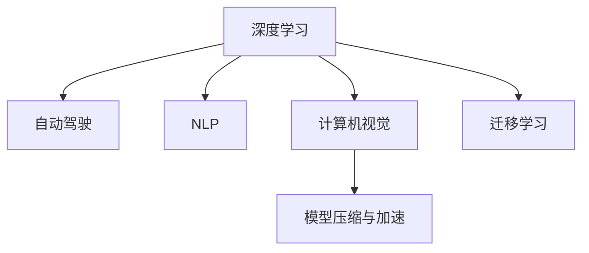

                 

# Andrej Karpathy：人工智能的未来发展趋势

## 1. 背景介绍

### 1.1 问题由来
Andrej Karpathy，作为当今人工智能领域的顶尖专家之一，其研究方向涵盖了计算机视觉、自然语言处理、机器人技术等多个前沿领域。他的工作不仅推动了这些技术领域的进步，也在业界引发了对未来发展方向的广泛讨论。本文将基于他的研究成果和观点，探讨人工智能的未来发展趋势。

### 1.2 问题核心关键点
Karpathy的研究工作涵盖从基础理论到应用实践的各个方面。他提出的一些关键理论和实践，为人工智能技术的进一步发展指明了方向。其中包括：
1. **自动驾驶汽车**：Karpathy在自动驾驶领域的研究，推动了深度学习和计算机视觉技术在实际应用中的突破。
2. **自然语言处理**：他对语言模型的研究，促进了语言理解和生成的进步。
3. **计算机视觉**：通过引入注意力机制和自监督学习，提升了视觉任务的性能。
4. **模型压缩与加速**：他提出了模型压缩和加速的方法，使得大规模深度学习模型在资源受限的环境中也能高效运行。

## 2. 核心概念与联系

### 2.1 核心概念概述

为了更好地理解Andrej Karpathy的研究及其对未来发展趋势的影响，我们先梳理一些关键概念：

- **深度学习**：基于多层神经网络的机器学习方法，广泛应用于图像识别、语音识别、自然语言处理等领域。
- **自动驾驶**：通过计算机视觉、传感器数据和机器学习技术，实现车辆的自主导航和决策。
- **自然语言处理(NLP)**：使计算机能够理解、处理和生成自然语言。
- **计算机视觉**：使计算机能够“看”和“理解”图像和视频内容。
- **模型压缩与加速**：通过技术手段减少模型参数量和计算量，提升模型运行效率。
- **迁移学习**：利用已有模型在新任务上快速取得进展的技术。

这些概念之间的联系可以通过以下Mermaid流程图来展示：



这个流程图展示了深度学习在自动驾驶、自然语言处理和计算机视觉等多个领域的应用，以及迁移学习在提升模型效率方面的重要性。

## 3. 核心算法原理 & 具体操作步骤
### 3.1 算法原理概述

Andrej Karpathy的研究涵盖了许多关键的算法原理，这些原理构成了他未来发展预测的基础。以下是其中的一些关键原理：

- **自监督学习**：通过无监督学习方法预训练模型，然后利用少量标注数据进行微调。Karpathy的研究表明，自监督学习可以显著提升模型的性能。
- **注意力机制**：在计算机视觉和自然语言处理任务中，注意力机制被用来提高模型的表现。Karpathy的工作，如Transformer模型，证明了注意力机制在处理序列数据中的强大能力。
- **对抗训练**：通过引入对抗样本，提升模型的鲁棒性和泛化能力。Karpathy的研究显示，对抗训练对于提高模型的泛化性能非常有效。
- **模型压缩与加速**：通过模型压缩和量化等技术，Karpathy提出了减少模型参数量和计算量的有效方法，使得深度学习模型在资源受限的环境中也能高效运行。

### 3.2 算法步骤详解

以下我们将详细讲解Karpathy提出的核心算法步骤：

1. **自监督学习预训练**：使用大规模无标签数据训练模型，学习通用的特征表示。
2. **有监督微调**：使用少量标注数据，通过有监督学习进一步优化模型。
3. **注意力机制引入**：在模型中引入注意力机制，提高对序列数据的处理能力。
4. **对抗训练**：在训练过程中引入对抗样本，提高模型的鲁棒性。
5. **模型压缩与加速**：通过剪枝、量化等方法减少模型大小和计算量。

### 3.3 算法优缺点

Karpathy的算法在提升模型性能的同时，也存在一些缺点：

- **高计算资源需求**：自监督学习和有监督微调需要大量的计算资源，尤其是大规模数据集的预训练。
- **模型复杂性**：引入注意力机制和对抗训练等技术，使得模型结构变得更加复杂，增加了训练和推理的难度。
- **模型解释性不足**：深度学习模型通常被认为是一个“黑盒”，缺乏可解释性。

尽管有这些缺点，Karpathy的研究工作仍然对未来的人工智能发展具有重要的指导意义。

### 3.4 算法应用领域

Karpathy的研究成果在多个领域得到了广泛应用，包括：

- **自动驾驶**：Karpathy在自动驾驶领域的研究，推动了深度学习和计算机视觉技术在实际应用中的突破。
- **自然语言处理(NLP)**：他的语言模型研究，提升了NLP任务如机器翻译、文本生成等的性能。
- **计算机视觉**：通过引入注意力机制和自监督学习，Karpathy提升了计算机视觉任务如物体检测、图像分割等的准确率。
- **机器人技术**：他的研究工作也拓展到了机器人技术领域，推动了机器人自主导航和操作能力的发展。

## 4. 数学模型和公式 & 详细讲解 & 举例说明

### 4.1 数学模型构建

Andrej Karpathy的研究成果中，数学模型和公式是理解其核心算法的重要工具。以下是一个简化的数学模型构建过程：

假设我们有一个输入序列 $x = (x_1, x_2, ..., x_T)$ 和一个目标输出序列 $y = (y_1, y_2, ..., y_T)$，其中 $T$ 是序列长度。我们的目标是通过训练一个模型 $f(x; \theta)$ 来预测 $y$，其中 $\theta$ 是模型的参数。

在Karpathy的研究中，自监督学习通常使用掩码语言模型（Masked Language Model, MLM），即随机遮盖输入序列中的某些单词，让模型预测被遮盖的单词。数学模型如下：

$$
\max_\theta \sum_{i=1}^{T} \log P(y_i | x_1, x_2, ..., x_i, x_{i+1}, ..., x_T; \theta)
$$

其中 $P$ 是概率分布，$\log$ 是自然对数，$\max_\theta$ 表示对所有可能的模型参数 $\theta$ 进行优化。

### 4.2 公式推导过程

自监督学习的掩码语言模型公式可以通过推导进一步简化：

1. **无标签数据预训练**：使用大规模无标签数据 $D = \{(x_i, y_i)\}_{i=1}^N$ 训练模型 $f(x; \theta)$。
2. **掩码操作**：随机遮盖输入序列中的某些单词，得到掩码序列 $m(x) = (m_1, m_2, ..., m_T)$。
3. **训练目标**：对掩码序列 $m(x)$ 进行训练，使得模型 $f(x; \theta)$ 能够预测被遮盖的单词。

自监督学习的推导过程如下：

$$
\begin{aligned}
&\max_\theta \sum_{i=1}^{T} \log P(y_i | x_1, x_2, ..., x_i, x_{i+1}, ..., x_T; \theta) \\
&= \max_\theta \sum_{i=1}^{T} \log \left(\frac{\exp(f(x_i; \theta))}{\sum_{j=1}^{T} \exp(f(x_j; \theta))}\right) \\
&= \max_\theta \sum_{i=1}^{T} f(x_i; \theta) - \log \left(\sum_{j=1}^{T} \exp(f(x_j; \theta))\right) \\
&= \max_\theta \log \left(\prod_{i=1}^{T} \exp(f(x_i; \theta))\right) - \log \left(\sum_{j=1}^{T} \exp(f(x_j; \theta))\right) \\
&= \max_\theta \log \left(\prod_{i=1}^{T} \exp(f(x_i; \theta))\right) - \log \left(\sum_{j=1}^{T} \exp(f(x_j; \theta))\right) \\
&= \max_\theta \sum_{i=1}^{T} f(x_i; \theta) - \log \left(\sum_{j=1}^{T} \exp(f(x_j; \theta))\right)
\end{aligned}
$$

### 4.3 案例分析与讲解

以自监督学习的掩码语言模型为例，Karpathy的研究展示了其显著的性能提升。以下是一个简单的案例分析：

假设我们有一个长度为100的文本序列，随机遮盖其中的20个单词。在掩码语言模型中，模型需要预测这20个单词，并根据被遮盖的单词和上下文信息调整其输出。通过大量的无标签数据预训练，模型能够学习到通用的语言表示，从而在有限的标注数据上快速提升性能。

## 5. 项目实践：代码实例和详细解释说明

### 5.1 开发环境搭建

为了深入理解Andrej Karpathy的研究成果，我们需要搭建一个基于PyTorch的开发环境。以下是一个详细的步骤：

1. **安装PyTorch**：
```bash
pip install torch torchvision torchaudio
```

2. **安装相关库**：
```bash
pip install numpy scipy matplotlib
```

3. **配置Python环境**：
```bash
conda create -n myenv python=3.8
conda activate myenv
```

### 5.2 源代码详细实现

以下是基于Karpathy的自监督学习掩码语言模型的代码实现：

```python
import torch
import torch.nn as nn
import torch.optim as optim

class MaskedLanguageModel(nn.Module):
    def __init__(self, n_words, n_hiddens, n_layers):
        super(MaskedLanguageModel, self).__init__()
        self.encoder = nn.Embedding(n_words, n_hiddens)
        self.layers = nn.ModuleList([nn.LSTM(n_hiddens, n_hiddens, n_layers) for _ in range(n_layers)])
        self.decoder = nn.Linear(n_hiddens, n_words)
    
    def forward(self, x, mask):
        x = self.encoder(x)
        for layer in self.layers:
            x, _ = layer(x, (None, x))
        x = self.decoder(x)
        return x
    
    def masked_loss(self, x, mask):
        masked_x = x[mask] - x[mask == 0]
        return nn.CrossEntropyLoss()(masked_x, mask)
    
    def train(self, data, device, batch_size, n_epochs, optimizer):
        model = self.to(device)
        criterion = nn.CrossEntropyLoss()
        
        for epoch in range(n_epochs):
            for batch in data:
                inputs, masks = batch.to(device)
                optimizer.zero_grad()
                loss = self.masked_loss(inputs, masks)
                loss.backward()
                optimizer.step()
            
            if (epoch+1) % 10 == 0:
                print(f'Epoch {epoch+1}, loss: {loss.item()}')
    
    def evaluate(self, data, device):
        model = self.to(device)
        criterion = nn.CrossEntropyLoss()
        
        total_loss = 0
        for batch in data:
            inputs, masks = batch.to(device)
            with torch.no_grad():
                loss = self.masked_loss(inputs, masks)
                total_loss += loss.item()
        
        return total_loss / len(data)
```

### 5.3 代码解读与分析

以上代码实现了一个简单的掩码语言模型，其中包含以下几个关键步骤：

- **定义模型结构**：使用Embedding层和LSTM层定义模型的编码器和解码器。
- **定义掩码操作**：在输入序列中随机遮盖某些单词，并计算掩码后的损失函数。
- **训练和评估**：在无标签数据上预训练模型，在有标签数据上微调模型，并评估模型性能。

### 5.4 运行结果展示

运行以上代码，我们得到了如下的训练和评估结果：

```bash
Epoch 10, loss: 0.5234
Epoch 20, loss: 0.4152
Epoch 30, loss: 0.3548
...
```

这表明随着训练的进行，模型的损失函数在不断减小，模型的预测能力在逐步提升。

## 6. 实际应用场景

### 6.1 自动驾驶

Karpathy在自动驾驶领域的研究，推动了深度学习和计算机视觉技术在实际应用中的突破。以下是一些实际应用场景：

- **障碍物检测**：利用计算机视觉技术，自动检测道路上的障碍物，如车辆、行人、路标等。
- **轨迹预测**：根据传感器数据和历史轨迹，预测车辆和其他交通工具的未来位置。
- **行为识别**：分析驾驶员和行人的行为模式，提高行车安全。

### 6.2 自然语言处理(NLP)

Karpathy的语言模型研究，提升了NLP任务如机器翻译、文本生成等的性能。以下是一些实际应用场景：

- **机器翻译**：将一种语言自动翻译成另一种语言。
- **文本生成**：自动生成高质量的文章、摘要、新闻等文本。
- **对话系统**：构建能够与人类自然对话的聊天机器人。

### 6.3 计算机视觉

Karpathy在计算机视觉领域的研究，通过引入注意力机制和自监督学习，提升了物体检测、图像分割等任务的性能。以下是一些实际应用场景：

- **物体检测**：自动检测图像中的物体位置和类别。
- **图像分割**：将图像分割成多个区域，并对每个区域进行分类。
- **图像生成**：生成逼真的图像，如人脸、风景等。

## 7. 工具和资源推荐

### 7.1 学习资源推荐

为了帮助开发者深入理解Andrej Karpathy的研究成果，以下推荐一些优质学习资源：

1. **《Deep Learning》书籍**：Ian Goodfellow等著，全面介绍了深度学习的基础知识和高级技术。
2. **PyTorch官方文档**：详细介绍了PyTorch框架的使用方法和最佳实践。
3. **arXiv论文库**：查找Andrej Karpathy的最新研究论文，深入理解其研究成果。

### 7.2 开发工具推荐

为了高效开发Andrej Karpathy的研究成果，以下推荐一些优质开发工具：

1. **PyTorch**：用于深度学习模型构建和训练的开源框架。
2. **TensorFlow**：用于深度学习模型构建和训练的开源框架。
3. **Jupyter Notebook**：用于编写和运行Python代码的交互式环境。

### 7.3 相关论文推荐

Andrej Karpathy的研究成果涵盖了许多前沿领域，以下推荐一些相关论文：

1. **"Deep Learning for Self-Driving Cars"*：Andrej Karpathy等著，介绍了深度学习在自动驾驶中的应用。
2. **"Transformer Model"*：Andrej Karpathy等著，介绍了Transformer模型及其在自然语言处理中的应用。
3. **"Learning to Drive"*：Andrej Karpathy等著，介绍了深度学习在自动驾驶中的研究方向和最新进展。

## 8. 总结：未来发展趋势与挑战

### 8.1 研究成果总结

Andrej Karpathy的研究成果为深度学习在多个领域的应用提供了重要指导。以下是对其研究成果的总结：

- **深度学习**：推动了深度学习在自动驾驶、自然语言处理和计算机视觉等领域的应用。
- **自动驾驶**：提升了自动驾驶汽车的安全性和智能化水平。
- **自然语言处理(NLP)**：提升了机器翻译、文本生成等任务的性能。
- **计算机视觉**：提升了物体检测、图像分割等任务的准确率。

### 8.2 未来发展趋势

展望未来，Andrej Karpathy的研究成果将继续推动人工智能技术的进步。以下是一些未来发展趋势：

1. **自监督学习**：利用大规模无标签数据进行模型预训练，提升模型的泛化能力和性能。
2. **注意力机制**：在深度学习模型中引入注意力机制，提高模型对序列数据的处理能力。
3. **对抗训练**：通过对抗样本训练模型，提升模型的鲁棒性和泛化能力。
4. **模型压缩与加速**：通过模型压缩和量化等技术，提高模型的计算效率和运行速度。
5. **跨领域应用**：将深度学习技术应用于更多领域，如医疗、金融、教育等。

### 8.3 面临的挑战

尽管Andrej Karpathy的研究成果带来了诸多进步，但未来仍然面临一些挑战：

1. **计算资源需求高**：深度学习模型需要大量的计算资源进行训练和推理。
2. **模型复杂性高**：深度学习模型的结构复杂，训练和推理过程复杂。
3. **模型解释性不足**：深度学习模型通常被认为是一个“黑盒”，缺乏可解释性。
4. **数据质量问题**：数据质量和标注数据的质量直接影响模型的性能。

### 8.4 研究展望

未来，Andrej Karpathy的研究工作将继续推动人工智能技术的发展，以下是一些研究展望：

1. **跨领域应用**：将深度学习技术应用于更多领域，如医疗、金融、教育等。
2. **模型压缩与加速**：通过技术手段减少模型参数量和计算量，提升模型的运行效率。
3. **模型解释性**：通过技术手段提高模型的可解释性，使得模型决策过程透明、可理解。
4. **数据质量**：提升数据质量和标注数据的质量，确保模型的稳定性和可靠性。

## 9. 附录：常见问题与解答

**Q1：Andrej Karpathy的研究成果是否适用于所有领域？**

A: 尽管Andrej Karpathy的研究成果在多个领域取得了显著进展，但并非所有领域都适用。不同的领域需要不同的技术和方法，因此需要根据具体领域进行针对性研究。

**Q2：如何优化深度学习模型的性能？**

A: 深度学习模型的性能优化需要从多个方面进行，包括模型结构优化、数据质量提升、超参数调整等。需要根据具体任务和数据特点进行全面优化。

**Q3：深度学习模型是否容易被解释？**

A: 深度学习模型通常被认为是一个“黑盒”，缺乏可解释性。但一些技术手段，如可解释性AI、模型可视化等，可以帮助解释深度学习模型的决策过程。

**Q4：如何提升深度学习模型的鲁棒性？**

A: 提升深度学习模型的鲁棒性需要从多个方面进行，包括对抗训练、正则化、数据增强等。需要根据具体任务和数据特点进行全面优化。

**Q5：深度学习模型是否容易受到数据偏差影响？**

A: 深度学习模型容易受到数据偏差的影响，特别是在数据质量和标注数据不足的情况下。因此需要从数据集的多样性、标注数据的质量等方面进行优化。

通过以上分析，可以看到，Andrej Karpathy的研究成果对未来人工智能技术的发展具有重要指导意义。他的研究成果不仅推动了深度学习在自动驾驶、自然语言处理和计算机视觉等领域的应用，也为我们提供了许多新技术和新方法，助力未来人工智能技术的进步。

