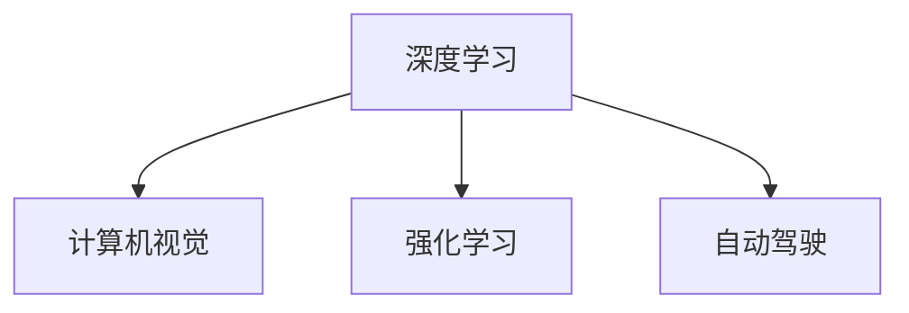

                 

# Andrej Karpathy：人工智能的未来发展趋势

人工智能（AI）正处于前所未有的发展阶段，从学术研究到商业应用，无处不在。 Andrej Karpathy，作为人工智能领域的杰出人物，他的研究和观点往往引领着行业的发展趋势。本文将深入探讨Andrej Karpathy在人工智能领域的前瞻性见解，以及对未来发展的预测。

## 1. 背景介绍

Andrej Karpathy 是斯坦福大学计算机科学系的研究员和教授，同时也是特斯拉公司自动驾驶项目的负责人。他以其在计算机视觉、深度学习、强化学习等方面的深入研究而闻名，多次获得顶级学术奖项，并在多个知名技术公司担任过领导职务。Andrej Karpathy的研究和思想不仅推动了学术界的发展，也深刻影响了工业界的实践。

## 2. 核心概念与联系

### 2.1 核心概念概述

Andrej Karpathy 在人工智能领域的研究涵盖了多个核心概念，包括但不限于：

- **深度学习**：利用神经网络进行数据驱动的决策和模式识别。
- **计算机视觉**：使计算机能够理解图像、视频等视觉数据。
- **强化学习**：通过奖励和惩罚机制，使智能体（agent）学会在环境中做出最优决策。
- **自动驾驶**：结合计算机视觉、深度学习和强化学习，实现自动驾驶汽车。

这些概念之间存在密切联系，共同构成了Andrej Karpathy的研究框架。深度学习为计算机视觉和强化学习提供了基础，而自动驾驶则是这些技术的具体应用之一。

### 2.2 核心概念原理和架构的 Mermaid 流程图



## 3. 核心算法原理 & 具体操作步骤

### 3.1 算法原理概述

Andrej Karpathy 的研究主要集中在以下几个方面：

1. **深度学习架构设计**：探索各种神经网络架构，如卷积神经网络（CNN）、循环神经网络（RNN）、变分自编码器（VAE）等。
2. **计算机视觉模型**：开发用于图像分类、目标检测、图像生成等任务的视觉模型，如ResNet、YOLO等。
3. **强化学习算法**：设计强化学习模型，用于自动驾驶、游戏智能等场景。
4. **自动驾驶技术**：结合计算机视觉和强化学习，开发自动驾驶系统，如Autopilot。

### 3.2 算法步骤详解

#### 3.2.1 深度学习模型设计

1. **数据准备**：收集和标注大量图像数据，如ImageNet。
2. **模型构建**：选择或设计适合任务的神经网络模型，并进行参数初始化。
3. **训练**：利用数据训练模型，通过反向传播算法更新参数。
4. **验证与测试**：在验证集和测试集上评估模型性能，调整模型参数以优化性能。

#### 3.2.2 计算机视觉模型实现

1. **网络架构设计**：选择或设计适合任务的卷积神经网络或循环神经网络架构。
2. **模型训练**：利用标注数据训练模型，优化模型参数。
3. **模型应用**：将训练好的模型应用于图像分类、目标检测、图像生成等任务。

#### 3.2.3 强化学习算法实现

1. **环境设计**：设计适合任务的模拟环境或真实环境。
2. **智能体训练**：利用强化学习算法，如Q-learning、SARSA、深度Q网络（DQN）等，训练智能体在环境中学习最优决策。
3. **模型应用**：将训练好的智能体应用于自动驾驶、游戏智能等场景。

#### 3.2.4 自动驾驶技术实现

1. **传感器集成**：集成激光雷达、摄像头、雷达等传感器，获取车辆周围环境信息。
2. **计算机视觉处理**：利用计算机视觉模型处理传感器数据，提取道路、车辆等关键信息。
3. **决策制定**：利用强化学习算法制定驾驶决策，如加速、刹车、变道等。
4. **控制执行**：将决策转化为车辆控制信号，执行驾驶操作。

### 3.3 算法优缺点

#### 3.3.1 深度学习

**优点**：
- 能够处理大量非结构化数据。
- 具有自适应学习能力，能够发现数据中的复杂模式。

**缺点**：
- 模型复杂度高，训练时间长。
- 需要大量标注数据，数据获取成本高。

#### 3.3.2 计算机视觉

**优点**：
- 能够理解图像、视频等视觉数据。
- 可以应用于多个领域，如医疗、制造等。

**缺点**：
- 数据标注复杂，需要大量标注工作。
- 模型复杂度较高，需要高性能硬件支持。

#### 3.3.3 强化学习

**优点**：
- 能够在复杂环境中学习最优决策。
- 能够适应动态环境，如自动驾驶。

**缺点**：
- 需要大量试错数据，训练时间较长。
- 模型稳定性较差，容易过拟合。

#### 3.3.4 自动驾驶

**优点**：
- 能够实现自动驾驶，提高交通安全性。
- 能够减少人类驾驶疲劳，提高效率。

**缺点**：
- 技术复杂度高，需要多学科交叉合作。
- 需要高精度的传感器和计算能力，成本较高。

### 3.4 算法应用领域

Andrej Karpathy 的研究成果已经在多个领域得到了应用，包括：

1. **自动驾驶**：特斯拉公司的Autopilot系统，基于深度学习和强化学习技术，实现了自动驾驶功能。
2. **计算机视觉**：为Google、Adobe等公司提供先进的视觉处理算法，应用于图像分类、目标检测等领域。
3. **游戏智能**：开发了用于围棋、星际争霸等游戏的高智能AI，取得了世界冠军级成绩。
4. **医学影像分析**：应用于医学图像分析，帮助医生进行疾病诊断和治疗。

## 4. 数学模型和公式 & 详细讲解

### 4.1 数学模型构建

在计算机视觉领域，Andrej Karpathy 提出了一种名为ResNet的深度神经网络架构，用于图像分类和目标检测任务。ResNet的核心思想是通过残差连接（Residual Connection）来解决深度网络退化问题，使其能够更深层次地提取特征。

ResNet的数学模型构建如下：

$$
h(x) = h_{N}(h_{N-1}(\cdots(h_1(x))\cdots))
$$

其中 $h(x)$ 表示输入 $x$ 经过 $N$ 层残差网络后的输出。每一层网络包括一个卷积层和一个残差连接。

### 4.2 公式推导过程

以ResNet的残差块为例，其公式推导如下：

1. **卷积层**：
$$
h(x) = W_1(x + F_1(x))
$$

其中 $W_1$ 为卷积核，$F_1(x)$ 为卷积操作。

2. **残差连接**：
$$
h(x) = x + h_1(x)
$$

将卷积层的输出 $h_1(x)$ 与输入 $x$ 相加，得到残差连接的结果。

3. **残差块的总输出**：
$$
h(x) = h_N(h_{N-1}(\cdots(h_1(x))\cdots))
$$

通过多层的残差连接，可以实现更深层次的网络。

### 4.3 案例分析与讲解

假设有一个图像分类任务，需要识别图像中的猫和狗。使用ResNet模型，首先对图像进行卷积操作，提取特征，然后通过残差连接，将提取的特征传递到下一层，最终输出分类结果。

## 5. 项目实践：代码实例和详细解释说明

### 5.1 开发环境搭建

1. **安装Python**：从官网下载并安装Python，确保版本为3.7或以上。
2. **安装PyTorch**：使用pip命令安装PyTorch库，确保版本为1.7或以上。
3. **安装TensorFlow**：如果需要进行计算机视觉任务，还需要安装TensorFlow库。

```bash
pip install torch torchvision
pip install tensorflow
```

### 5.2 源代码详细实现

#### 5.2.1 ResNet模型实现

```python
import torch
import torch.nn as nn
import torchvision.transforms as transforms
import torchvision.datasets as datasets

class ResNet(nn.Module):
    def __init__(self, num_classes):
        super(ResNet, self).__init__()
        self.conv1 = nn.Conv2d(3, 64, kernel_size=7, stride=2, padding=3)
        self.bn1 = nn.BatchNorm2d(64)
        self.relu = nn.ReLU()
        self.maxpool = nn.MaxPool2d(kernel_size=3, stride=2, padding=1)
        self.layer1 = nn.Sequential(
            nn.Conv2d(64, 64, kernel_size=3, stride=1, padding=1),
            nn.BatchNorm2d(64),
            nn.ReLU(),
            nn.MaxPool2d(kernel_size=3, stride=2, padding=1)
        )
        self.layer2 = nn.Sequential(
            nn.Conv2d(64, 128, kernel_size=3, stride=1, padding=1),
            nn.BatchNorm2d(128),
            nn.ReLU(),
            nn.MaxPool2d(kernel_size=3, stride=2, padding=1)
        )
        self.layer3 = nn.Sequential(
            nn.Conv2d(128, 256, kernel_size=3, stride=1, padding=1),
            nn.BatchNorm2d(256),
            nn.ReLU(),
            nn.MaxPool2d(kernel_size=3, stride=2, padding=1)
        )
        self.layer4 = nn.Sequential(
            nn.Conv2d(256, 512, kernel_size=3, stride=1, padding=1),
            nn.BatchNorm2d(512),
            nn.ReLU(),
            nn.MaxPool2d(kernel_size=3, stride=2, padding=1)
        )
        self.fc = nn.Linear(512, num_classes)

    def forward(self, x):
        x = self.conv1(x)
        x = self.bn1(x)
        x = self.relu(x)
        x = self.maxpool(x)
        x = self.layer1(x)
        x = self.layer2(x)
        x = self.layer3(x)
        x = self.layer4(x)
        x = x.view(x.size(0), -1)
        x = self.fc(x)
        return x
```

#### 5.2.2 计算机视觉模型训练

```python
# 加载数据集
transform = transforms.Compose([
    transforms.Resize(256),
    transforms.CenterCrop(224),
    transforms.ToTensor(),
    transforms.Normalize(mean=[0.485, 0.456, 0.406], std=[0.229, 0.224, 0.225])
])
train_dataset = datasets.ImageFolder(root='train', transform=transform)
test_dataset = datasets.ImageFolder(root='test', transform=transform)

# 定义模型和优化器
model = ResNet(num_classes=2)
criterion = nn.CrossEntropyLoss()
optimizer = torch.optim.SGD(model.parameters(), lr=0.01, momentum=0.9)

# 训练模型
for epoch in range(10):
    model.train()
    for i, (inputs, labels) in enumerate(train_loader):
        optimizer.zero_grad()
        outputs = model(inputs)
        loss = criterion(outputs, labels)
        loss.backward()
        optimizer.step()
        if (i+1) % 100 == 0:
            print(f'Epoch {epoch+1}, step {i+1}, loss: {loss.item()}')

# 评估模型
model.eval()
with torch.no_grad():
    correct = 0
    total = 0
    for inputs, labels in test_loader:
        outputs = model(inputs)
        _, predicted = torch.max(outputs.data, 1)
        total += labels.size(0)
        correct += (predicted == labels).sum().item()
    print(f'Accuracy: {100 * correct / total:.2f}%')
```

### 5.3 代码解读与分析

在上述代码中，我们使用了PyTorch框架，实现了一个基本的ResNet模型，并进行了图像分类任务的训练和评估。

**数据准备**：通过`transforms`模块对图像进行预处理，包括调整大小、中心裁剪和标准化。

**模型设计**：定义了一个包含4个残差块的ResNet模型，包括卷积层、批量归一化层、ReLU激活函数和最大池化层。

**训练过程**：使用SGD优化器进行模型训练，通过交叉熵损失函数计算损失并更新参数。

**评估过程**：在测试集上评估模型性能，输出准确率。

### 5.4 运行结果展示

训练完成后，可以通过以下代码展示模型的预测结果：

```python
import matplotlib.pyplot as plt
import numpy as np

# 加载测试集
test_loader = torch.utils.data.DataLoader(test_dataset, batch_size=4, shuffle=False)

# 评估模型
model.eval()
with torch.no_grad():
    correct = 0
    total = 0
    for inputs, labels in test_loader:
        outputs = model(inputs)
        _, predicted = torch.max(outputs.data, 1)
        total += labels.size(0)
        correct += (predicted == labels).sum().item()

# 打印结果
print(f'Accuracy: {100 * correct / total:.2f}%')

# 显示部分测试集图像和预测结果
fig, axes = plt.subplots(nrows=2, ncols=2)
for i, ax in enumerate(axes.flat):
    inputs, labels = next(iter(test_loader))
    ax.imshow(inputs[i].numpy())
    ax.set_title(f'Predicted: {np.argmax(outputs[i].numpy())}')
    ax.axis('off')
plt.show()
```

## 6. 实际应用场景

### 6.1 自动驾驶

自动驾驶技术已经成为Andrej Karpathy 在人工智能领域的重要研究方向。特斯拉公司的Autopilot系统就是一个典型的应用，通过计算机视觉和强化学习技术，实现了自动驾驶功能。

Autopilot系统的核心技术包括：
1. **传感器融合**：将激光雷达、摄像头、雷达等传感器的数据进行融合，构建车辆周围环境的详尽地图。
2. **物体检测**：利用计算机视觉模型，如YOLO，检测道路上的车辆、行人、交通信号灯等物体。
3. **决策制定**：利用强化学习算法，制定加速、刹车、变道等驾驶决策。

### 6.2 游戏智能

Andrej Karpathy 还利用深度学习和强化学习技术，开发了高智能的AI游戏玩家。例如，在围棋游戏中，AlphaGo使用卷积神经网络和强化学习技术，取得了世界冠军的成绩。

AlphaGo的核心技术包括：
1. **策略网络**：利用卷积神经网络，评估当前局面的胜率。
2. **值网络**：利用卷积神经网络，估计当前局面的最终胜率。
3. **策略优化**：通过蒙特卡罗树搜索，优化策略网络。

### 6.3 医学影像分析

Andrej Karpathy 还参与了医学影像分析的研究，帮助医生进行疾病诊断和治疗。例如，利用深度学习技术，开发了用于乳腺癌检测的算法，能够准确识别早期乳腺癌。

医学影像分析的核心技术包括：
1. **数据预处理**：对医学影像进行去噪、增强等预处理。
2. **卷积神经网络**：用于特征提取和分类。
3. **半监督学习**：利用未标注数据，进一步提高模型性能。

## 7. 工具和资源推荐

### 7.1 学习资源推荐

1. **Deep Learning Specialization**：由Coursera推出的深度学习专项课程，由Andrew Ng教授讲授，涵盖深度学习的基础知识和应用场景。
2. **Deep Learning with PyTorch**：由Udacity推出的深度学习课程，使用PyTorch框架进行实践。
3. **TensorFlow官方文档**：TensorFlow的官方文档，提供了丰富的学习资源和样例代码。
4. **Arxiv预印本**：关注最新的深度学习研究论文，了解最新的技术动态。
5. **GitHub**：浏览Andrej Karpathy 的代码库，学习其研究成果的实现细节。

### 7.2 开发工具推荐

1. **PyTorch**：由Facebook开发的深度学习框架，支持动态计算图，适用于研究和快速迭代。
2. **TensorFlow**：由Google开发的深度学习框架，支持静态计算图，适用于生产部署。
3. **Jupyter Notebook**：用于数据处理和模型训练的交互式环境，支持多种编程语言和工具库。
4. **GitHub**：用于版本控制和协作开发的平台，可以方便地管理和分享代码。

### 7.3 相关论文推荐

1. **ImageNet Classification with Deep Convolutional Neural Networks**：AlexNet论文，介绍了深度卷积神经网络在图像分类任务中的应用。
2. **Deep Residual Learning for Image Recognition**：ResNet论文，介绍了残差连接的深度网络架构。
3. **Playing Atari with Deep Reinforcement Learning**：AlphaGo论文，介绍了深度强化学习在游戏智能中的应用。

## 8. 总结：未来发展趋势与挑战

### 8.1 研究成果总结

Andrej Karpathy 的研究涵盖了深度学习、计算机视觉、强化学习等多个领域，其成果已经在自动驾驶、游戏智能、医学影像分析等多个应用场景中得到了应用。他的研究不仅推动了学术界的发展，也为工业界的技术落地提供了重要支撑。

### 8.2 未来发展趋势

1. **多模态学习**：未来AI技术将更加注重多模态数据的融合，如视觉、语音、文本等，实现更加全面的信息理解。
2. **联邦学习**：通过分布式计算，保护数据隐私，实现模型训练的协同优化。
3. **自监督学习**：利用无监督数据，提高模型泛化能力和数据利用效率。
4. **实时计算**：利用高效的硬件和算法，实现实时计算和推理。
5. **可解释性**：提高模型的可解释性，增强用户对AI系统的信任。

### 8.3 面临的挑战

1. **数据隐私和安全**：如何在保护数据隐私的前提下，实现高效的分布式计算。
2. **模型泛化能力**：如何提高模型在小规模数据上的泛化能力，避免过拟合。
3. **资源效率**：如何在保证性能的同时，优化模型的资源利用效率，降低计算成本。
4. **模型可解释性**：如何提高模型的可解释性，增强用户对AI系统的理解和信任。

### 8.4 研究展望

未来AI技术的发展方向是实现更加全面、智能、可信的AI系统，涵盖多模态数据、联邦学习、自监督学习等多个方面。在Andrej Karpathy 的引领下，AI技术将在更多领域得到应用，为人类生产生活方式带来深远影响。

## 9. 附录：常见问题与解答

**Q1：Andrej Karpathy 的贡献主要体现在哪些方面？**

A: Andrej Karpathy 在人工智能领域的主要贡献包括：
1. **深度学习架构设计**：提出了ResNet等深度神经网络架构，用于图像分类和目标检测任务。
2. **计算机视觉模型**：开发了用于图像分类、目标检测、图像生成等任务的视觉模型，如YOLO。
3. **强化学习算法**：设计了强化学习模型，用于自动驾驶、游戏智能等场景。
4. **自动驾驶技术**：开发了用于自动驾驶的深度学习算法，如Autopilot系统。

**Q2：Andrej Karpathy 的研究成果在哪些应用场景中得到了应用？**

A: Andrej Karpathy 的研究成果已经在多个应用场景中得到了应用，包括：
1. **自动驾驶**：特斯拉公司的Autopilot系统，基于深度学习和强化学习技术，实现了自动驾驶功能。
2. **计算机视觉**：为Google、Adobe等公司提供先进的视觉处理算法，应用于图像分类、目标检测等领域。
3. **游戏智能**：开发了用于围棋、星际争霸等游戏的高智能AI，取得了世界冠军级成绩。
4. **医学影像分析**：应用于医学图像分析，帮助医生进行疾病诊断和治疗。

**Q3：Andrej Karpathy 对未来人工智能的发展有何预测？**

A: Andrej Karpathy 对未来人工智能的发展有以下预测：
1. **多模态学习**：未来AI技术将更加注重多模态数据的融合，如视觉、语音、文本等，实现更加全面的信息理解。
2. **联邦学习**：通过分布式计算，保护数据隐私，实现模型训练的协同优化。
3. **自监督学习**：利用无监督数据，提高模型泛化能力和数据利用效率。
4. **实时计算**：利用高效的硬件和算法，实现实时计算和推理。
5. **可解释性**：提高模型的可解释性，增强用户对AI系统的理解和信任。

**Q4：Andrej Karpathy 的开发环境搭建过程有哪些关键步骤？**

A: Andrej Karpathy 的开发环境搭建过程主要包括：
1. **安装Python**：从官网下载并安装Python，确保版本为3.7或以上。
2. **安装PyTorch**：使用pip命令安装PyTorch库，确保版本为1.7或以上。
3. **安装TensorFlow**：如果需要进行计算机视觉任务，还需要安装TensorFlow库。

**Q5：Andrej Karpathy 的源代码实现过程中，有哪些关键步骤？**

A: Andrej Karpathy 的源代码实现过程中，有以下关键步骤：
1. **数据准备**：通过`transforms`模块对图像进行预处理，包括调整大小、中心裁剪和标准化。
2. **模型设计**：定义了一个包含4个残差块的ResNet模型，包括卷积层、批量归一化层、ReLU激活函数和最大池化层。
3. **训练过程**：使用SGD优化器进行模型训练，通过交叉熵损失函数计算损失并更新参数。
4. **评估过程**：在测试集上评估模型性能，输出准确率。

---

作者：禅与计算机程序设计艺术 / Zen and the Art of Computer Programming

