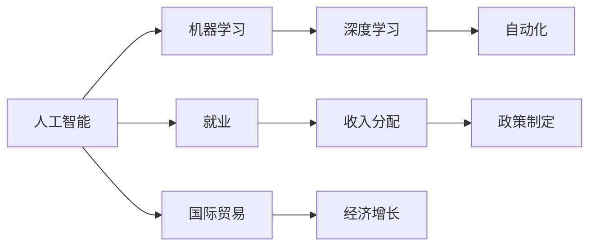

                 

## 1. 背景介绍

安德烈·卡帕西（Andrej Karpathy），作为人工智能领域的顶尖专家和知名程序员，其深邃的理论洞察力和卓越的工程实践能力使其成为机器学习和计算机视觉领域的佼佼者。卡帕西在深度学习领域的研究和贡献，不仅体现在算法创新上，更在于其对人工智能带来的广泛社会和经济影响的深入探讨。在本文中，我们将探讨卡帕西关于人工智能经济影响的见解，以及这些见解对我们理解AI技术对社会经济的潜在影响具有重要的启示意义。

### 1.1 问题由来

随着人工智能技术的飞速发展，其在社会经济领域的广泛应用已经引起了全球范围内的关注。如何在享受人工智能带来的便利和效率的同时，兼顾其可能带来的社会经济问题，成为了一个亟待探讨的课题。安德烈·卡帕西通过一系列的研究和演讲，详细剖析了人工智能对经济的影响，并提出了富有洞察力的解决方案。

### 1.2 问题核心关键点

卡帕西的研究涉及了以下几个关键问题：
- 人工智能如何改变劳动力市场？
- 人工智能对收入分配的影响是什么？
- 人工智能如何影响国际贸易与经济增长？
- 人工智能在政策制定中的作用和挑战。

这些关键问题，将围绕人工智能的经济影响展开深入讨论，并结合实际案例，剖析其潜在的社会经济效应。

## 2. 核心概念与联系

### 2.1 核心概念概述

在探讨人工智能的经济影响之前，我们首先需要理解以下核心概念：

- **人工智能**：利用计算机系统执行以往需要人类智能才能完成的任务。
- **机器学习**：一种基于数据驱动的技术，允许计算机系统通过经验自适应地改善性能。
- **深度学习**：一种机器学习的分支，通过模拟人脑神经网络的结构和功能，处理大量复杂数据。
- **自动化**：利用人工智能技术，自动执行重复性、规律性工作。
- **就业**：劳动力在市场中的分配和流动，受教育和技能、技术进步等多种因素影响。
- **收入分配**：经济成果在社会成员之间的分配情况，受教育水平、技能需求等影响。
- **国际贸易**：国家间的商品、服务和资本交换，受生产能力、技术差异等因素影响。
- **经济增长**：社会整体生产能力的提升，受技术进步、教育投资等要素影响。

### 2.2 核心概念原理和架构的 Mermaid 流程图



这个流程图展示了人工智能及其相关概念之间的联系。人工智能涵盖了机器学习和深度学习，并且涉及到自动化技术。这些技术对就业、收入分配、国际贸易以及经济增长都有直接和间接的影响。政策制定者需要考虑这些影响，以确保人工智能技术的健康发展。

## 3. 核心算法原理 & 具体操作步骤

### 3.1 算法原理概述

卡帕西在其研究和演讲中，详细讨论了人工智能对经济影响的多个方面。以下是对其主要观点的概述：

- **劳动力市场变化**：随着自动化和人工智能的发展，某些技能要求低的重复性工作将被自动化取代，而对高技能需求的工作会增加。这可能导致整体失业率上升，尤其是在低技能劳动者中。

- **收入分配**：人工智能通过提高生产效率，通常会带来经济增长，但这种增长并不均匀。高技能劳动者将从新技术中获益更多，而低技能劳动者的收入可能停滞不前甚至下降。

- **国际贸易**：人工智能可能改变全球生产格局，一些国家可能因为自动化和远程工作变得更有竞争力，而另一些国家则可能因为缺乏高技能劳动力而落后。

- **经济增长**：人工智能通过提高生产效率，有可能推动长期经济增长，但这也取决于政策、投资和社会对新技术的适应能力。

### 3.2 算法步骤详解

卡帕西提出了一系列具体的操作步骤来分析和应对人工智能的经济影响：

1. **数据收集和分析**：通过收集和分析大量的劳动力市场数据、收入分配数据以及国际贸易数据，了解人工智能对不同群体的影响。

2. **模型构建**：利用机器学习模型，如回归分析、时间序列分析等，预测人工智能对各经济指标的影响。

3. **政策制定**：根据模型预测结果，制定有针对性的政策，如教育投资、技能培训、收入再分配等，以缓解人工智能带来的经济影响。

4. **持续评估和调整**：随着技术的进步和社会的发展，持续评估政策效果，并及时调整以应对新的挑战。

### 3.3 算法优缺点

**优点**：
- 系统化分析：通过数据驱动的方法，可以客观评估人工智能对经济的影响。
- 提前预测：模型可以帮助政策制定者预测未来的趋势，从而采取有效措施。

**缺点**：
- 数据偏差：模型的预测结果可能受到数据偏差的影响，导致分析结果不准确。
- 政策实施难度：制定和实施政策需要跨学科的协作和资源投入。

### 3.4 算法应用领域

卡帕西的理论和模型不仅适用于劳动力市场、收入分配和国际贸易等宏观经济领域，还适用于具体的应用场景，如教育、医疗、交通等。例如：

- **教育领域**：利用人工智能技术，进行个性化学习，提升教育质量和效率。
- **医疗领域**：使用人工智能辅助诊断和治疗，提高医疗服务水平。
- **交通领域**：通过智能交通系统，提高道路安全性和交通效率。

## 4. 数学模型和公式 & 详细讲解 & 举例说明

### 4.1 数学模型构建

卡帕西的模型主要基于回归分析、时间序列分析等方法。以下是一些关键的数学模型：

- **线性回归模型**：
  $$
  y = \beta_0 + \beta_1x_1 + \beta_2x_2 + \epsilon
  $$
  其中 $y$ 为因变量（如失业率、收入等），$x_1$ 和 $x_2$ 为自变量（如技术进步、自动化率等），$\beta_0$ 为截距，$\beta_1$ 和 $\beta_2$ 为系数，$\epsilon$ 为误差项。

- **时间序列模型**：
  $$
  y_t = \alpha + \beta_1y_{t-1} + \beta_2y_{t-2} + \epsilon_t
  $$
  其中 $y_t$ 为第 $t$ 期的经济指标，$\alpha$ 为常数项，$\beta_1$ 和 $\beta_2$ 为滞后系数，$\epsilon_t$ 为误差项。

### 4.2 公式推导过程

线性回归模型的推导过程涉及最小二乘估计，假设误差项 $\epsilon$ 服从正态分布 $N(0,\sigma^2)$。通过最小化 $SSR = \sum_{i=1}^n (y_i - \hat{y}_i)^2$，其中 $\hat{y}_i = \hat{\beta}_0 + \hat{\beta}_1x_{1i} + \hat{\beta}_2x_{2i}$，可以求得 $\beta_0$、$\beta_1$ 和 $\beta_2$ 的估计值。

时间序列模型则通过自回归模型 (AR) 或自回归移动平均模型 (ARMA) 来刻画经济指标随时间的动态变化，模型参数的估计通常使用最大似然估计或贝叶斯方法。

### 4.3 案例分析与讲解

以失业率为例，假设模型预测人工智能普及率上升1%，会导致失业率上升0.5%。具体分析如下：

1. 收集过去20年的失业率数据和自动化普及率数据，使用时间序列模型进行拟合。
2. 利用拟合结果，在保持其他因素不变的情况下，预测未来20年的失业率变化。
3. 根据预测结果，制定政策如再就业培训、技能提升等，以减轻失业带来的社会影响。

## 5. 项目实践：代码实例和详细解释说明

### 5.1 开发环境搭建

为了进行相关的数据分析和模型构建，我们需要搭建以下开发环境：

1. **Python环境**：使用Anaconda创建虚拟环境，并安装必要的Python库，如NumPy、Pandas、scikit-learn等。
2. **数据收集工具**：使用WebScraping、API接口等方式收集劳动力市场、收入分配、国际贸易等数据。
3. **数据分析工具**：使用Pandas、Matplotlib、Seaborn等进行数据清洗和可视化。
4. **机器学习库**：使用scikit-learn、TensorFlow等构建回归模型和时间序列模型。
5. **可视化工具**：使用Matplotlib、Bokeh等进行模型预测结果的可视化。

### 5.2 源代码详细实现

以下是一个简单的线性回归模型实现示例：

```python
import numpy as np
from sklearn.linear_model import LinearRegression

# 准备数据
x = np.array([[1], [2], [3], [4], [5]])
y = np.array([2, 4, 6, 8, 10])

# 构建模型
model = LinearRegression()

# 训练模型
model.fit(x, y)

# 预测
x_test = np.array([[6]])
y_pred = model.predict(x_test)

print(y_pred)
```

### 5.3 代码解读与分析

这段代码实现了一个简单的线性回归模型，用于预测失业率。首先，通过NumPy准备输入数据和输出数据。然后，使用scikit-learn库的LinearRegression类构建模型，并使用fit方法进行训练。最后，使用predict方法对新的数据点进行预测，并输出结果。

## 6. 实际应用场景

### 6.1 劳动力市场变化

人工智能在劳动力市场的广泛应用，导致某些技能需求减少，而对高技能的需求增加。例如，自动化和机器学习在制造业中的应用，将减少对低技能工人的需求，但同时增加对算法工程师、数据科学家的需求。

### 6.2 收入分配

人工智能技术在提高生产效率的同时，可能加剧收入不平等。高技能劳动者可能获得更高的工资和更好的工作机会，而低技能劳动者则面临失业或工资停滞的风险。例如，自动化技术使得制造业工人失业，但同时提高了管理层和技术人员的收入。

### 6.3 国际贸易

人工智能改变了全球生产成本和效率，一些国家可能因为自动化和远程工作而更具竞争力，例如印度、中国等发展中国家。这些国家可以更有效地利用全球供应链，而发达国家可能因为高成本劳动力和技术优势而受益。

### 6.4 经济增长

人工智能通过提高生产效率，可能推动长期经济增长。例如，自动化技术提高了农业生产效率，降低了粮食成本，从而提高了经济增长速度。但这种增长需要相应的政策支持，如投资教育和技能培训，以确保劳动力适应新的技术要求。

## 7. 工具和资源推荐

### 7.1 学习资源推荐

1. **《Deep Learning》by Ian Goodfellow, Yoshua Bengio, and Aaron Courville**：这本书是深度学习领域的经典之作，详细介绍了深度学习的基础知识和前沿技术。
2. **《Machine Learning Yearning》by Andrew Ng**：Andrew Ng的入门级指南，涵盖机器学习实践的方方面面。
3. **Kaggle竞赛平台**：参与实际的机器学习竞赛，积累实践经验，并学习最新的算法和技术。
4. **Coursera和edX在线课程**：提供深度学习、机器学习等领域的在线课程，覆盖从入门到高级的内容。

### 7.2 开发工具推荐

1. **Python编程语言**：Python是最流行的编程语言之一，特别适合数据科学和机器学习领域。
2. **Jupyter Notebook**：用于编写和运行Python代码的交互式环境，支持代码块和结果展示。
3. **TensorFlow和PyTorch**：两大流行的深度学习框架，提供了丰富的API和工具。
4. **Pandas和NumPy**：用于数据处理和分析的Python库。
5. **scikit-learn**：简单易用的机器学习库，提供了多种算法和模型。

### 7.3 相关论文推荐

1. **《Deep Learning》by Ian Goodfellow et al.**：深度学习领域的经典著作，详细介绍了深度学习的理论基础和应用。
2. **《Artificial Intelligence: A Modern Approach》by Stuart Russell and Peter Norvig**：AI领域的经典教材，涵盖AI的基础理论和应用。
3. **《Machine Learning Yearning》by Andrew Ng**：Andrew Ng的入门级指南，涵盖机器学习实践的方方面面。
4. **《Human-AI Collaboration and Competition》by Judea Pearl and Joshua Susskind**：探讨了AI与人类的合作和竞争关系，引发对AI伦理和社会影响的深思。

## 8. 总结：未来发展趋势与挑战

### 8.1 研究成果总结

安德烈·卡帕西的研究揭示了人工智能对劳动力市场、收入分配、国际贸易和经济增长等多方面影响的深远意义。他的模型和政策建议为政府和企业在面对AI技术变革时提供了宝贵的参考。

### 8.2 未来发展趋势

未来，人工智能技术将继续深入渗透到经济社会的各个领域，带来更多机遇和挑战。以下是一些趋势：

- **自动化普及**：自动化和人工智能技术将在更多行业得到应用，进一步改变劳动力市场结构。
- **教育和技术融合**：教育系统将更多地采用AI技术，提高教学质量和效率。
- **政策制定**：各国政府将需要制定更多的政策和法规，以应对AI技术带来的社会经济影响。

### 8.3 面临的挑战

尽管人工智能技术带来了诸多便利，但也存在以下挑战：

- **数据隐私和安全**：AI系统需要大量的数据，可能带来隐私泄露和数据安全问题。
- **算法透明度和公平性**：AI系统的决策过程往往难以解释，可能导致算法歧视和不公平。
- **社会伦理问题**：AI系统可能带来的失业和社会不平等问题，需要政策制定者和社会各界共同应对。

### 8.4 研究展望

未来的研究应更多关注AI技术的伦理、公平和社会影响，并探索解决方案。以下是一些可能的研究方向：

- **公平算法**：设计公平、透明的AI算法，避免算法偏见和歧视。
- **隐私保护**：研究和开发隐私保护技术，保护用户数据安全。
- **社会适应**：研究AI技术对社会各层面的影响，并制定相应的政策。

## 9. 附录：常见问题与解答

**Q1：什么是人工智能的经济影响？**

A: 人工智能对劳动力市场、收入分配、国际贸易和经济增长等经济指标的影响。

**Q2：人工智能如何影响劳动力市场？**

A: 人工智能将导致某些技能需求减少，而对高技能的需求增加，可能引起失业和收入不平等问题。

**Q3：政府应如何应对人工智能带来的经济影响？**

A: 政府应制定相关政策，如再就业培训、技能提升和收入再分配，以减轻人工智能带来的负面影响。

**Q4：人工智能的长期经济影响是什么？**

A: 人工智能可能通过提高生产效率推动长期经济增长，但这种增长需要相应的政策支持。

**Q5：如何平衡人工智能的利弊？**

A: 需要跨学科合作，制定公平、透明的AI政策，确保技术发展的平衡和可持续性。

---

作者：禅与计算机程序设计艺术 / Zen and the Art of Computer Programming

