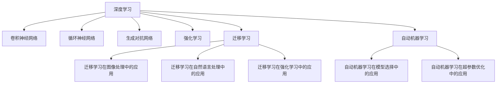

                 

## 1. 背景介绍

### 1.1 问题由来
人工智能（AI），特别是深度学习（DL），已经席卷了科技和商业的各个角落。从图像识别到自然语言处理（NLP），AI技术正在逐步替代人类的感知和决策能力。然而，尽管AI技术发展迅猛，其在理解和应用复杂任务方面仍然存在诸多挑战。例如，在自动驾驶中，AI模型需要同时处理视觉、听觉、传感器等多种数据源，并作出精确的决策；在金融风控中，AI模型需要分析大量的历史数据，准确预测潜在的风险。这些问题要求AI技术不仅要有强大的数据分析和模型训练能力，还需要能够高效、准确地应用到实际业务场景中。

### 1.2 问题核心关键点
针对这些问题，AI的代码实战案例讲解尤为重要。代码实战案例讲解不仅能帮助开发者理解AI技术的原理，还能指导其在实际业务场景中的应用。通过实例讲解，开发者可以更好地理解模型训练、数据预处理、模型优化、模型部署等关键环节，从而快速构建高效、稳定的AI系统。本文将重点探讨如何通过代码实例讲解，将AI技术转化为实际应用。

## 2. 核心概念与联系

### 2.1 核心概念概述

为更好地理解AI的代码实战案例讲解，本节将介绍几个密切相关的核心概念：

- **深度学习（Deep Learning, DL）**：一种基于多层神经网络的机器学习技术，通过数据驱动的方式，从原始数据中学习到数据的分布特征，并用于预测、分类、生成等任务。
- **卷积神经网络（Convolutional Neural Network, CNN）**：一种广泛应用于图像处理、视频分析等领域的深度学习模型，通过卷积操作捕捉图像特征，并提取局部特征进行分类。
- **循环神经网络（Recurrent Neural Network, RNN）**：一种处理序列数据的深度学习模型，通过循环结构捕捉序列之间的依赖关系，并用于时间序列预测、自然语言处理等任务。
- **生成对抗网络（Generative Adversarial Network, GAN）**：一种生成模型，由生成器和判别器两个网络组成，通过对抗训练，生成与真实数据相似的伪造数据。
- **强化学习（Reinforcement Learning, RL）**：一种通过试错学习，不断调整策略以最大化奖励的机器学习技术，广泛应用于游戏AI、机器人控制等领域。
- **迁移学习（Transfer Learning）**：将一个领域学到的知识迁移到另一个领域，以提高新任务的学习效率。
- **自动机器学习（AutoML）**：自动化机器学习，通过自动化模型构建、超参数优化等技术，减少模型构建的复杂度和成本。

这些核心概念之间的逻辑关系可以通过以下Mermaid流程图来展示：



这个流程图展示了大语言模型的核心概念及其之间的关系：

1. 深度学习是各类模型的基础。
2. CNN、RNN、GAN、RL、AutoML等模型分别在图像、序列、生成、控制等不同领域中应用广泛。
3. 迁移学习是连接不同模型领域的桥梁，可以加速新任务的学习。
4. 自动机器学习通过自动化模型构建和优化，降低开发者门槛。

这些概念共同构成了AI技术的核心框架，使开发者能够更好地理解和应用AI技术。

## 3. 核心算法原理 & 具体操作步骤
### 3.1 算法原理概述

AI的代码实战案例讲解涉及多个核心算法和操作步骤。本节将详细介绍这些算法原理和操作步骤，帮助开发者更好地理解和应用AI技术。

### 3.2 算法步骤详解

AI的代码实战案例讲解主要包括以下几个关键步骤：

**Step 1: 数据预处理**
- 收集和清洗数据集，确保数据的质量和一致性。
- 对数据进行特征提取和归一化处理，以便于模型训练。
- 将数据集划分为训练集、验证集和测试集。

**Step 2: 模型选择与构建**
- 根据任务类型，选择合适的深度学习模型，如CNN、RNN、GAN等。
- 使用深度学习框架（如TensorFlow、PyTorch）构建模型，并设置初始参数。
- 添加必要的层（如卷积层、全连接层、循环层等）和激活函数（如ReLU、Sigmoid等）。

**Step 3: 模型训练**
- 使用优化器（如SGD、Adam）和损失函数（如均方误差、交叉熵）进行模型训练。
- 设置合适的学习率、批大小、迭代轮数等超参数。
- 在训练过程中，使用验证集评估模型性能，并进行调整。

**Step 4: 模型评估与优化**
- 在测试集上评估模型性能，对比不同模型的效果。
- 根据评估结果，选择最优模型进行微调。
- 使用迁移学习、数据增强等技术进一步优化模型。

**Step 5: 模型部署与维护**
- 将训练好的模型保存并部署到生产环境中。
- 使用API接口或服务化封装，供业务系统调用。
- 定期收集反馈数据，进行模型更新和优化。

以上是AI的代码实战案例讲解的主要操作步骤。在实际应用中，开发者需要根据具体任务的特点，对每个步骤进行优化设计，如改进数据预处理方法、优化模型结构、调整超参数等。

### 3.3 算法优缺点

AI的代码实战案例讲解具有以下优点：
1. 直观易懂。通过代码实例讲解，开发者能够直观理解模型训练和应用的整个过程。
2. 操作便捷。深度学习框架和工具提供了丰富的API接口，简化了模型构建和优化过程。
3. 适用范围广。无论是图像处理、序列分析，还是生成和控制任务，AI的代码实战案例讲解都具备广泛的应用前景。
4. 效率提升。AI的代码实战案例讲解能够有效提升模型训练和推理效率，缩短项目开发周期。

同时，该方法也存在一定的局限性：
1. 依赖框架和工具。不同的深度学习框架和工具，其API接口和实现方式有所不同，开发者需要具备一定的技术积累。
2. 数据质量要求高。高质量的数据集是AI模型训练和评估的基础，数据预处理和清洗工作往往需要大量的时间和精力。
3. 模型复杂度高。大型深度学习模型具有高复杂度，需要专业的知识和技能进行调参和优化。
4. 计算资源需求大。深度学习模型的训练和推理通常需要高性能的计算资源，如GPU或TPU。

尽管存在这些局限性，但就目前而言，AI的代码实战案例讲解仍是大规模应用AI技术的重要范式。未来相关研究的重点在于如何进一步降低AI应用的技术门槛，提高模型的灵活性和可解释性，同时兼顾计算资源和数据质量的优化。

### 3.4 算法应用领域

AI的代码实战案例讲解已经在诸多领域得到了广泛应用，例如：

- 计算机视觉：如图像分类、目标检测、图像分割等。通过代码实例讲解，使得开发者能够快速构建高效的图像处理模型。
- 自然语言处理：如文本分类、情感分析、机器翻译等。通过代码实例讲解，帮助开发者理解和应用自然语言处理技术。
- 语音识别：如自动语音识别、语音合成等。通过代码实例讲解，指导开发者构建高质量的语音处理系统。
- 游戏AI：如强化学习在游戏中的应用，指导开发者实现游戏AI算法。
- 机器人控制：如深度学习在机器人控制中的应用，帮助开发者实现机器人自主导航和操作。
- 医疗影像分析：如深度学习在医学影像分析中的应用，指导开发者构建高效的医学影像处理系统。
- 金融风控：如深度学习在金融风险预测中的应用，帮助开发者实现金融风控模型。

除了上述这些经典应用外，AI的代码实战案例讲解还被创新性地应用到更多场景中，如智能制造、智能交通、智慧城市等，为各行各业带来了全新的突破。随着深度学习框架和工具的不断进步，相信AI的代码实战案例讲解将引领AI技术向更广阔的领域加速渗透。

## 4. 数学模型和公式 & 详细讲解  
### 4.1 数学模型构建

本节将使用数学语言对AI的代码实战案例讲解进行更加严格的刻画。

设深度学习模型为 $M_{\theta}$，其中 $\theta$ 为模型参数。假设数据集为 $D=\{(x_i,y_i)\}_{i=1}^N$，其中 $x_i$ 为输入，$y_i$ 为标签。

定义模型 $M_{\theta}$ 在数据样本 $(x,y)$ 上的损失函数为 $\ell(M_{\theta}(x),y)$，则在数据集 $D$ 上的经验风险为：

$$
\mathcal{L}(\theta) = \frac{1}{N}\sum_{i=1}^N \ell(M_{\theta}(x_i),y_i)
$$

微调的目标是最小化经验风险，即找到最优参数：

$$
\theta^* = \mathop{\arg\min}_{\theta} \mathcal{L}(\theta)
$$

在实践中，我们通常使用基于梯度的优化算法（如SGD、Adam等）来近似求解上述最优化问题。设 $\eta$ 为学习率，$\lambda$ 为正则化系数，则参数的更新公式为：

$$
\theta \leftarrow \theta - \eta \nabla_{\theta}\mathcal{L}(\theta) - \eta\lambda\theta
$$

其中 $\nabla_{\theta}\mathcal{L}(\theta)$ 为损失函数对参数 $\theta$ 的梯度，可通过反向传播算法高效计算。

### 4.2 公式推导过程

以下我们以图像分类任务为例，推导交叉熵损失函数及其梯度的计算公式。

假设模型 $M_{\theta}$ 在输入 $x$ 上的输出为 $\hat{y}=M_{\theta}(x) \in [0,1]$，表示样本属于某个类别的概率。真实标签 $y \in \{0,1\}$。则二分类交叉熵损失函数定义为：

$$
\ell(M_{\theta}(x),y) = -[y\log \hat{y} + (1-y)\log (1-\hat{y})]
$$

将其代入经验风险公式，得：

$$
\mathcal{L}(\theta) = -\frac{1}{N}\sum_{i=1}^N [y_i\log M_{\theta}(x_i)+(1-y_i)\log(1-M_{\theta}(x_i))]
$$

根据链式法则，损失函数对参数 $\theta_k$ 的梯度为：

$$
\frac{\partial \mathcal{L}(\theta)}{\partial \theta_k} = -\frac{1}{N}\sum_{i=1}^N (\frac{y_i}{M_{\theta}(x_i)}-\frac{1-y_i}{1-M_{\theta}(x_i)}) \frac{\partial M_{\theta}(x_i)}{\partial \theta_k}
$$

其中 $\frac{\partial M_{\theta}(x_i)}{\partial \theta_k}$ 可进一步递归展开，利用自动微分技术完成计算。

在得到损失函数的梯度后，即可带入参数更新公式，完成模型的迭代优化。重复上述过程直至收敛，最终得到适应下游任务的最优模型参数 $\theta^*$。

## 5. 项目实践：代码实例和详细解释说明
### 5.1 开发环境搭建

在进行AI的代码实战案例讲解实践前，我们需要准备好开发环境。以下是使用Python进行PyTorch开发的环境配置流程：

1. 安装Anaconda：从官网下载并安装Anaconda，用于创建独立的Python环境。

2. 创建并激活虚拟环境：
```bash
conda create -n pytorch-env python=3.8 
conda activate pytorch-env
```

3. 安装PyTorch：根据CUDA版本，从官网获取对应的安装命令。例如：
```bash
conda install pytorch torchvision torchaudio cudatoolkit=11.1 -c pytorch -c conda-forge
```

4. 安装TensorFlow：
```bash
conda install tensorflow
```

5. 安装各类工具包：
```bash
pip install numpy pandas scikit-learn matplotlib tqdm jupyter notebook ipython
```

完成上述步骤后，即可在`pytorch-env`环境中开始代码实例讲解实践。

### 5.2 源代码详细实现

这里我们以图像分类任务为例，给出使用PyTorch对卷积神经网络（CNN）进行图像分类任务代码实例的实现。

首先，定义数据处理函数：

```python
from torch.utils.data import Dataset, DataLoader
import torch
import torchvision.transforms as transforms
import numpy as np
import matplotlib.pyplot as plt

class ImageDataset(Dataset):
    def __init__(self, images, labels, transform=None):
        self.images = images
        self.labels = labels
        self.transform = transform

    def __len__(self):
        return len(self.images)

    def __getitem__(self, idx):
        img = self.images[idx]
        label = self.labels[idx]

        if self.transform:
            img = self.transform(img)

        return img, label
```

然后，定义CNN模型和优化器：

```python
from torch.nn import Conv2d, MaxPool2d, Flatten, Linear, Sequential
import torch.nn as nn
import torch.optim as optim

class CNN(nn.Module):
    def __init__(self):
        super(CNN, self).__init__()
        self.conv1 = Conv2d(3, 32, kernel_size=3, stride=1, padding=1)
        self.maxpool1 = MaxPool2d(kernel_size=2, stride=2)
        self.conv2 = Conv2d(32, 64, kernel_size=3, stride=1, padding=1)
        self.maxpool2 = MaxPool2d(kernel_size=2, stride=2)
        self.fc1 = Flatten()
        self.fc2 = Linear(64*4*4, 10)

    def forward(self, x):
        x = self.maxpool1(F.relu(self.conv1(x)))
        x = self.maxpool2(F.relu(self.conv2(x)))
        x = self.fc1(x.view(-1, 64*4*4))
        x = F.relu(self.fc2(x))
        return x

model = CNN()
optimizer = optim.Adam(model.parameters(), lr=0.001)
```

接着，定义训练和评估函数：

```python
from torchvision import datasets, transforms
from torch.utils.data import DataLoader

train_dataset = datasets.CIFAR10(root='./data', train=True, download=True, transform=transforms.ToTensor())
test_dataset = datasets.CIFAR10(root='./data', train=False, download=True, transform=transforms.ToTensor())

train_loader = DataLoader(train_dataset, batch_size=32, shuffle=True)
test_loader = DataLoader(test_dataset, batch_size=32, shuffle=False)

def train_epoch(model, loader, optimizer):
    model.train()
    running_loss = 0.0
    running_corrects = 0

    for inputs, labels in loader:
        inputs, labels = inputs.to(device), labels.to(device)
        optimizer.zero_grad()
        outputs = model(inputs)
        loss = nn.CrossEntropyLoss()(outputs, labels)
        loss.backward()
        optimizer.step()

        running_loss += loss.item() * inputs.size(0)
        _, preds = torch.max(outputs, 1)
        running_corrects += torch.sum(preds == labels.data)

    epoch_loss = running_loss / len(loader.dataset)
    epoch_acc = running_corrects.double() / len(loader.dataset)

    print(f'Epoch {epoch+1}, Loss: {epoch_loss:.4f}, Acc: {epoch_acc:.4f}')

def evaluate(model, loader):
    model.eval()
    corrects = 0

    with torch.no_grad():
        for inputs, labels in loader:
            inputs, labels = inputs.to(device), labels.to(device)
            outputs = model(inputs)
            _, preds = torch.max(outputs, 1)
            corrects += torch.sum(preds == labels.data)

    acc = corrects.double() / len(loader.dataset)
    print(f'Test Acc: {acc:.4f}')
```

最后，启动训练流程并在测试集上评估：

```python
epochs = 10

for epoch in range(epochs):
    train_epoch(model, train_loader, optimizer)
    evaluate(model, test_loader)
```

以上就是使用PyTorch对卷积神经网络进行图像分类任务代码实例的实现。可以看到，通过深度学习框架，我们可以用相对简洁的代码实现复杂的深度学习模型，并进行高效的模型训练和评估。

### 5.3 代码解读与分析

让我们再详细解读一下关键代码的实现细节：

**ImageDataset类**：
- `__init__`方法：初始化图像、标签、数据增强操作等关键组件。
- `__len__`方法：返回数据集的样本数量。
- `__getitem__`方法：对单个样本进行处理，将图像输入编码成张量，并可能进行数据增强操作。

**CNN模型**：
- 定义了卷积层、池化层、全连接层等核心组件，构建了一个简单的卷积神经网络模型。
- 在`forward`方法中，通过前向传播计算模型输出。

**train_epoch和evaluate函数**：
- 定义了训练和评估函数，使用DataLoader加载数据集，并在训练集和测试集上进行模型训练和评估。
- 训练函数中，通过循环遍历数据集，计算损失函数，反向传播更新模型参数，并在每个epoch结束时打印训练损失和准确率。
- 评估函数中，同样遍历数据集，计算模型在测试集上的准确率，并在最后打印测试准确率。

**训练流程**：
- 定义总的epoch数，开始循环迭代
- 每个epoch内，先在训练集上训练，输出训练损失和准确率
- 在测试集上评估，输出测试准确率

可以看到，PyTorch配合深度学习框架，使得模型构建和训练过程变得简单高效。开发者可以将更多精力放在数据处理、模型优化等高层逻辑上，而不必过多关注底层的实现细节。

当然，工业级的系统实现还需考虑更多因素，如模型的保存和部署、超参数的自动搜索、更灵活的任务适配层等。但核心的代码实例讲解流程基本与此类似。

## 6. 实际应用场景
### 6.1 计算机视觉

基于AI的代码实战案例讲解的计算机视觉技术，已经广泛应用于图像识别、目标检测、图像分割等任务。例如，图像分类、物体检测等任务，可以帮助商家识别商品种类，为电商平台的商品推荐和库存管理提供数据支持。

在技术实现上，可以使用卷积神经网络（CNN）模型进行图像分类。通过训练一个预训练的CNN模型，使其能够识别不同类别的图像，从而实现图像分类任务。此外，还可以使用目标检测模型（如Faster R-CNN、YOLO等），对图像中的物体进行定位和分类，帮助商家识别具体的物体类型。

### 6.2 自然语言处理

AI的代码实战案例讲解在自然语言处理（NLP）领域也有广泛的应用，覆盖了文本分类、情感分析、机器翻译等诸多任务。例如，情感分析任务，可以帮助企业了解用户对产品的情感倾向，提升用户体验；机器翻译任务，可以帮助企业实现多语言自动翻译，拓展国际市场。

在技术实现上，可以使用循环神经网络（RNN）或Transformer模型进行文本分类。通过训练一个预训练的RNN或Transformer模型，使其能够对文本进行分类，从而实现情感分析任务。此外，还可以使用序列到序列（Seq2Seq）模型进行机器翻译，帮助企业实现自动翻译功能。

### 6.3 语音识别

AI的代码实战案例讲解在语音识别领域也有广泛的应用，如自动语音识别（ASR）、语音合成（TTS）等。例如，自动语音识别任务，可以帮助企业实现语音助手功能，提升客户服务效率；语音合成任务，可以帮助企业实现语音播报，提升用户体验。

在技术实现上，可以使用循环神经网络（RNN）或Transformer模型进行语音识别。通过训练一个预训练的RNN或Transformer模型，使其能够识别和转录语音，从而实现自动语音识别任务。此外，还可以使用基于深度学习的文本到语音（TTS）模型，实现语音合成功能。

### 6.4 未来应用展望

随着AI技术的发展，AI的代码实战案例讲解的应用场景将更加广泛。未来，AI的代码实战案例讲解有望在更多领域得到应用，如医疗、金融、交通等，为各行各业带来变革性影响。

在智慧医疗领域，AI的代码实战案例讲解可以用于图像识别、医学影像分析等任务，帮助医生诊断疾病，提高诊疗效率。

在金融领域，AI的代码实战案例讲解可以用于风险预测、投资分析等任务，帮助金融机构进行决策支持，提升运营效率。

在交通领域，AI的代码实战案例讲解可以用于自动驾驶、智能交通等任务，帮助交通管理部门提升交通效率，降低事故发生率。

此外，在智慧城市、智能制造、智能家居等众多领域，AI的代码实战案例讲解也将不断涌现，为各行各业带来全新的突破。相信随着技术的日益成熟，AI的代码实战案例讲解必将在更广阔的应用领域大放异彩。

## 7. 工具和资源推荐
### 7.1 学习资源推荐

为了帮助开发者系统掌握AI的代码实战案例讲解的理论基础和实践技巧，这里推荐一些优质的学习资源：

1. 《深度学习》系列书籍：由多位专家合著，系统介绍了深度学习的理论基础和应用实践，涵盖图像、序列、生成等各类任务。

2. 《TensorFlow实战》系列书籍：由Google官方推出，详细介绍了TensorFlow的使用方法和应用场景，适合初学者入门。

3. 《PyTorch深度学习入门》系列博客：由PyTorch社区贡献者撰写，涵盖了从基础知识到实战项目的全面讲解。

4. Coursera《深度学习专项课程》：由斯坦福大学、密歇根大学等名校开设，系统讲解深度学习的理论基础和实践应用，适合全面学习。

5. Udacity《深度学习纳米学位》：由Google、Facebook等公司提供，通过项目实践，帮助开发者掌握深度学习的实战技能。

通过对这些资源的学习实践，相信你一定能够快速掌握AI的代码实战案例讲解的精髓，并用于解决实际的NLP问题。

### 7.2 开发工具推荐

高效的开发离不开优秀的工具支持。以下是几款用于AI代码实战案例讲解开发的常用工具：

1. TensorFlow：由Google主导开发的开源深度学习框架，生产部署方便，适合大规模工程应用。

2. PyTorch：基于Python的开源深度学习框架，灵活动态的计算图，适合快速迭代研究。

3. Keras：基于TensorFlow和Theano的高层深度学习API，简洁易用，适合快速原型开发。

4. Jupyter Notebook：交互式Python编程环境，支持代码执行、图表绘制、文档编写等功能，适合开发和分享。

5. Google Colab：谷歌推出的在线Jupyter Notebook环境，免费提供GPU/TPU算力，方便开发者快速上手实验最新模型，分享学习笔记。

6. Visual Studio Code：轻量级的代码编辑器，支持Python开发、调试、自动补全等功能，适合高效开发。

合理利用这些工具，可以显著提升AI代码实战案例讲解的开发效率，加快创新迭代的步伐。

### 7.3 相关论文推荐

AI的代码实战案例讲解的研究起源于学界的持续研究。以下是几篇奠基性的相关论文，推荐阅读：

1. ImageNet Classification with Deep Convolutional Neural Networks：提出CNN模型，通过多层卷积操作提取图像特征，极大提升了图像分类准确率。

2. Recurrent Neural Network for Sequence Prediction：提出RNN模型，通过循环结构捕捉序列之间的依赖关系，广泛应用于自然语言处理等领域。

3. Generative Adversarial Nets：提出GAN模型，通过对抗训练生成与真实数据相似的伪造数据，推动了生成模型的发展。

4. Deep Residual Learning for Image Recognition：提出残差网络（ResNet），解决了深层网络训练中的梯度消失问题，大幅提升了图像分类性能。

5. Attention Is All You Need：提出Transformer模型，通过自注意力机制提升模型性能，推动了NLP领域的发展。

6. Learning Deep Architectures for AI：提出多层神经网络，通过反向传播算法进行训练，为深度学习的发展奠定了基础。

这些论文代表了大语言模型微调技术的发展脉络。通过学习这些前沿成果，可以帮助研究者把握学科前进方向，激发更多的创新灵感。

## 8. 总结：未来发展趋势与挑战

### 8.1 总结

本文对AI的代码实战案例讲解进行了全面系统的介绍。首先阐述了AI技术的核心概念和代码实战案例讲解的重要意义，明确了其在实际业务场景中的应用价值。其次，从原理到实践，详细讲解了AI的代码实战案例讲解的数学模型和操作步骤，给出了代码实例讲解的完整代码实现。同时，本文还广泛探讨了AI的代码实战案例讲解在计算机视觉、自然语言处理、语音识别等众多领域的应用前景，展示了其广阔的应用前景。

通过本文的系统梳理，可以看到，AI的代码实战案例讲解不仅能帮助开发者理解AI技术的原理，还能指导其在实际业务场景中的应用。这种“学以致用”的学习方式，有助于开发者快速掌握AI技术的实战技能，构建高效、稳定的AI系统。

### 8.2 未来发展趋势

展望未来，AI的代码实战案例讲解将呈现以下几个发展趋势：

1. 模型规模持续增大。随着算力成本的下降和数据规模的扩张，AI模型的参数量还将持续增长。超大规模模型蕴含的丰富知识，有望支撑更加复杂多变的任务。

2. 任务复杂度提升。未来AI的代码实战案例讲解将面临更复杂、多模态的任务，如跨领域迁移学习、多模态融合等。

3. 模型可解释性增强。随着业务场景的不断变化，AI模型需要具备更强的可解释性，便于业务理解和决策。

4. 自动化程度提升。未来AI的代码实战案例讲解将借助自动化工具和平台，如AutoML、深度学习框架等，减少开发者的工作量，提升开发效率。

5. 深度学习框架的集成。AI的代码实战案例讲解将更紧密地集成到各类深度学习框架中，提升框架的使用便捷性。

6. 跨领域应用扩展。AI的代码实战案例讲解将应用于更多领域，如智慧城市、智能制造等，为各行各业带来变革性影响。

以上趋势凸显了AI的代码实战案例讲解的广阔前景。这些方向的探索发展，必将进一步提升AI系统的性能和应用范围，为各行各业带来更大的价值。

### 8.3 面临的挑战

尽管AI的代码实战案例讲解已经取得了瞩目成就，但在迈向更加智能化、普适化应用的过程中，它仍面临着诸多挑战：

1. 计算资源需求大。深度学习模型的训练和推理通常需要高性能的计算资源，如GPU或TPU。如何提升模型的计算效率，降低资源成本，是未来AI系统的重要研究方向。

2. 数据质量要求高。高质量的数据集是AI模型训练和评估的基础，数据预处理和清洗工作往往需要大量的时间和精力。如何降低数据处理的复杂度，提高数据利用率，是未来AI系统的关键问题。

3. 模型可解释性不足。当前AI模型通常缺乏可解释性，难以解释其内部工作机制和决策逻辑。如何赋予AI模型更强的可解释性，是未来AI系统的研究重点。

4. 业务适应性不足。AI模型在特定业务场景中，需要具备更强的适应性和灵活性。如何优化模型的超参数，增强模型的泛化能力，是未来AI系统的研究难点。

5. 伦理道德问题。AI模型可能会学习到有偏见、有害的信息，如何避免模型偏见，确保模型的安全性，是未来AI系统的研究重点。

6. 系统集成难度大。AI模型的部署和集成，需要考虑到模型的兼容性和稳定性。如何构建高效的AI系统，实现跨平台、跨语言的应用，是未来AI系统的研究方向。

正视AI的代码实战案例讲解所面临的这些挑战，积极应对并寻求突破，将是大规模应用AI技术的重要保障。

### 8.4 研究展望

未来，AI的代码实战案例讲解需要在以下几个方面进行深入研究：

1. 模型压缩与加速：通过模型压缩和加速技术，降低模型的计算资源需求，提升模型的实时性和可部署性。

2. 数据增强与处理：探索更高效的数据增强和处理技术，降低数据处理的复杂度和成本，提升数据利用率。

3. 模型可解释性：研究可解释性更强、更易于理解的AI模型，提升模型的业务适应性和可解释性。

4. 自动化机器学习：通过自动化机器学习技术，减少模型构建和调参的复杂度，提升开发效率。

5. 跨领域迁移学习：研究跨领域迁移学习技术，提升模型在不同领域的泛化能力，促进跨领域的知识共享和应用。

6. 伦理与安全性：研究AI模型的伦理与安全问题，确保模型的公平性、透明性和安全性。

这些研究方向将为AI的代码实战案例讲解带来新的突破，推动AI技术在各个领域的广泛应用。相信随着这些问题的逐步解决，AI的代码实战案例讲解必将在更多领域得到应用，为各行各业带来更大的价值。

## 9. 附录：常见问题与解答

**Q1：AI的代码实战案例讲解是否适用于所有AI任务？**

A: AI的代码实战案例讲解在大多数AI任务上都能取得不错的效果，特别是对于数据量较小的任务。但对于一些特定领域的任务，如医学、法律等，仅仅依靠通用语料预训练的模型可能难以很好地适应。此时需要在特定领域语料上进一步预训练，再进行微调，才能获得理想效果。此外，对于一些需要时效性、个性化很强的任务，如对话、推荐等，AI的代码实战案例讲解也需要针对性的改进优化。

**Q2：如何选择合适的AI模型和框架？**

A: 选择合适的AI模型和框架，需要根据具体任务的特点进行权衡。例如，对于图像分类任务，可以使用卷积神经网络（CNN）模型，并结合TensorFlow或PyTorch等深度学习框架。对于自然语言处理任务，可以使用循环神经网络（RNN）或Transformer模型，并结合Keras、PyTorch等框架。对于语音识别任务，可以使用卷积神经网络（CNN）或循环神经网络（RNN）模型，并结合TensorFlow或PyTorch等框架。选择合适的框架和模型，能够显著提升AI系统的开发效率和性能。

**Q3：AI的代码实战案例讲解需要哪些计算资源？**

A: AI的代码实战案例讲解通常需要高性能的计算资源，如GPU或TPU。特别是在模型训练阶段，计算资源的需求量较大。为了降低计算成本，可以使用云计算平台，如Google Cloud、AWS等，提供GPU或TPU算力，满足模型训练的需求。此外，还可以使用深度学习框架提供的模型压缩和加速技术，降低计算资源的需求。

**Q4：AI的代码实战案例讲解是否需要大量标注数据？**

A: 通常情况下，AI的代码实战案例讲解需要大量标注数据，以便于模型训练和评估。然而，在一些特定的任务上，可以通过迁移学习、数据增强等技术，使用少量的标注数据进行高效训练。例如，在自然语言处理任务中，可以使用预训练的BERT模型，并仅在少量标注数据上进行微调，以减少标注成本。

**Q5：AI的代码实战案例讲解是否需要专业技能？**

A: 尽管AI的代码实战案例讲解需要一定的专业技能，但通过深度学习框架的封装，开发者可以简化模型的构建和训练过程，降低技术门槛。例如，使用TensorFlow或PyTorch等框架，开发者只需编写简单的代码，即可完成模型的构建和训练。此外，还可以通过在线学习资源、社区支持等方式，提升开发者的技术水平，增强开发效率。

**Q6：AI的代码实战案例讲解是否存在安全风险？**

A: 使用AI的代码实战案例讲解开发的应用系统，可能存在安全风险，如数据泄露、模型篡改等。因此，开发者需要采取一定的安全措施，如数据加密、访问控制等，保护用户数据和模型安全。同时，还可以通过模型监控、异常检测等技术，实时监控系统的运行状态，确保系统的安全性。

通过本文的系统梳理，可以看到，AI的代码实战案例讲解不仅能够帮助开发者理解AI技术的原理，还能指导其在实际业务场景中的应用。这种“学以致用”的学习方式，有助于开发者快速掌握AI技术的实战技能，构建高效、稳定的AI系统。未来，随着AI技术的发展和应用，AI的代码实战案例讲解必将在更多领域得到应用，为各行各业带来更大的价值。

---

作者：禅与计算机程序设计艺术 / Zen and the Art of Computer Programming

