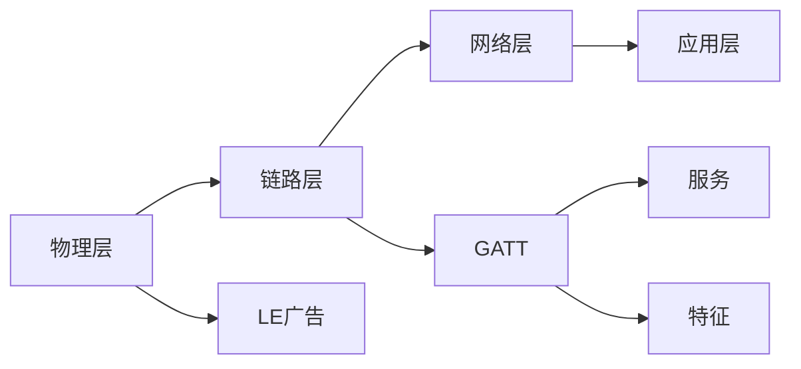

                 

## 1. 背景介绍

Bluetooth Low Energy（BLE），即低功耗蓝牙技术，是蓝牙技术的分支之一，专为物联网（IoT）设备设计，能够支持短距离、低功耗的无线连接。自2008年推出以来，BLE凭借其低功耗、低成本、短距离连接等特性，在智能家居、可穿戴设备、健康医疗、工业自动化等领域得到了广泛应用。

### 1.1 BLE概述

Bluetooth Low Energy（BLE）是蓝牙技术的一种改进版本，主要针对物联网设备设计。与传统蓝牙相比，BLE具有以下特点：

1. **低功耗**：BLE使用更少功率的无线电技术，在休眠模式下功耗可降低至传统蓝牙的千分之一，特别适合电池供电的设备。
2. **短距离连接**： BLE 的通信范围通常不超过 100 米，适用于室内短距离通信。
3. **低成本**：BLE设备通常比传统蓝牙设备价格便宜，推动了IoT设备的普及。
4. **低延迟**：BLE的传输速度更快，响应时间更短，适用于需要快速响应的应用场景。

### 1.2 BLE的发展历程

BLE的发展经历了从初期的基础技术开发到实际应用的多个阶段：

1. **2008年**：IEEE发布了IEEE 802.15.4标准，定义了BLE的物理层和MAC层，奠定了BLE技术的基础。
2. **2014年**：蓝牙特别兴趣小组（SIG）发布了BLE 4.0规范，引入了数据分段、自动速率适配、改进的安全机制等功能，显著提升了BLE的性能和安全性。
3. **2020年**：SIG发布了BLE 5.0规范，引入了新的物理层技术、增强的连接性能和更灵活的网络配置选项，进一步推动了BLE的应用。
4. **2021年**：SIG发布了BLE 5.2规范，引入了更多的高级功能，如周期性广告数据（LE Periodic Advertising Data）、附加广告数据（LE Additional Advertising Data）、LE Secure Connections等，增强了BLE的安全性和网络性能。

## 2. 核心概念与联系

### 2.1 核心概念概述

为更好地理解BLE技术，本节将介绍几个关键概念及其相互关系：

- ** BLE协议栈**：BLE协议栈包括物理层、链路层、网络层和应用层，各层之间通过标准化的协议进行通信。
- ** GATT（通用访问协议）**：GATT是一个用于设备间数据传输的标准协议，支持BLE设备的发现、连接、数据传输等功能。
- ** GATT服务与特征**：GATT定义了多种服务（如设备信息服务、数据库访问服务等）和特征（如读/写特征、通知/指示特征等），用于数据传输和控制。
- ** LE广告与扫描**：BLE设备通过LE广告发布自己的信息，其他设备通过扫描发现可连接的设备。
- ** LE安全性**：BLE提供了多种安全性机制，如加密、认证、绑定等，保护数据传输的安全性。

这些核心概念之间通过BLE协议栈的层次结构紧密联系，共同构成了BLE技术的完整框架。

### 2.2 核心概念原理和架构的 Mermaid 流程图



这个Mermaid流程图展示了BLE协议栈的层次结构和各层功能：

1. **物理层（A）**：BLE的物理层定义了无线电信号的传输机制，包括调制方式、传输功率、跳频机制等。
2. **链路层（B）**：链路层负责数据包的传输和接收，包括差错检测、流量控制等功能。
3. **网络层（C）**：网络层管理设备之间的连接和通信，包括建立和维护连接、数据包分片等功能。
4. **应用层（D）**：应用层提供高级功能，如设备管理、数据传输等，通过GATT实现数据交换。
5. **LE广告（E）**：LE广告用于设备间发现和连接，通过广播模式发布设备信息。
6. **GATT（F）**：GATT定义了设备间数据传输的标准协议，包括服务与特征的配置和管理。
7. **服务（G）**：GATT服务定义了设备的功能和数据交换方式，如设备信息服务、数据库访问服务等。
8. **特征（H）**：GATT特征定义了服务的具体功能和操作，如读/写特征、通知/指示特征等。

通过这一层次结构，BLE协议栈的各个部分协同工作，实现了设备的发现、连接、数据传输等功能。

## 3. 核心算法原理 & 具体操作步骤

### 3.1 算法原理概述

 BLE的核心算法包括物理层、链路层、网络层和应用层的算法。本文将重点介绍应用层中的GATT协议。

GATT协议主要涉及以下算法：

- **设备发现**：通过LE广告和扫描机制，发现可连接的设备。
- **设备连接**：通过建立连接，实现设备间的可靠数据传输。
- **数据传输**：通过GATT服务和特征，实现设备间的数据交换。
- **安全性管理**：通过加密、认证、绑定等机制，保护数据传输的安全性。

### 3.2 算法步骤详解

以下将详细介绍GATT协议的各个步骤：

1. **设备发现**：
   - BLE设备通过LE广告广播自己的信息，包含设备的地址、服务列表等。
   - 其他设备通过扫描发现可连接的设备，发送连接请求，建立连接。
   - 连接建立后，双方可以交换设备信息，协商数据传输参数。

2. **设备连接**：
   - 通过GATT服务（如设备信息服务）和特征（如读/写特征），设备间实现数据交换。
   - 设备可以通过订阅/取消订阅通知/指示特征，实现数据的实时更新。

3. **数据传输**：
   - GATT协议支持多种数据传输方式，如连接模式、非连接模式等。
   - 数据传输过程中，可以通过确认帧、流量控制等机制，保证数据传输的可靠性。

4. **安全性管理**：
   - BLE设备通过加密（如AES加密）、认证（如配对密钥）、绑定等机制，保护数据传输的安全性。
   - 设备可以通过绑定机制，避免重新连接时的配对过程，提高连接效率。

### 3.3 算法优缺点

BLE的优点包括：

- **低功耗**： BLE设备在休眠模式下功耗低，适合电池供电的设备。
- **低成本**： BLE设备的成本较低，推动了IoT设备的普及。
- **短距离连接**： BLE的通信范围短，适合室内短距离通信。
- **低延迟**： BLE的传输速度快，响应时间短，适用于需要快速响应的应用场景。

BLE的缺点包括：

- **带宽有限**： BLE的传输带宽较低，不适合大量数据的传输。
- **安全机制复杂**： BLE的安全性机制相对复杂，需要开发者进行详细的配置和管理。
- **协议复杂**： BLE协议栈的层次较多，实现和调试复杂。

### 3.4 算法应用领域

BLE在多个领域得到了广泛应用，包括但不限于：

- **智能家居**：BLE广泛应用于智能灯泡、智能插座、智能门锁等设备，实现家居自动化。
- **可穿戴设备**：BLE常用于可穿戴设备如智能手表、健康追踪器等，实时监测健康状况。
- **健康医疗**：BLE用于健康监测设备，如智能血糖仪、心率监测器等，实现实时数据传输。
- **工业自动化**：BLE用于工厂的传感器和设备，实现自动化生产和管理。
- **车联网**：BLE用于车辆与手机、车与车之间的通信，提高行车安全。

## 4. 数学模型和公式 & 详细讲解

### 4.1 数学模型构建

为了更好地理解BLE协议，我们需要构建数学模型来描述其工作原理。假设有一对BLE设备A和B，它们通过GATT协议进行通信。

设备A作为主设备，设备B作为从设备。设备A向设备B发送数据，设备B接收并确认数据。设设备A到设备B的延迟为 $d$，数据传输速率为 $r$，设备A和设备B的传输功率分别为 $P_A$ 和 $P_B$。

### 4.2 公式推导过程

设备A和设备B的传输速率和延迟可以表示为：

$$
\begin{aligned}
r_A &= \frac{1}{d} \\
r_B &= \frac{1}{d} + \frac{1}{r} \\
\end{aligned}
$$

其中 $d$ 是设备A到设备B的延迟，$r$ 是设备A到设备B的传输速率。

设备A和设备B的传输功率可以表示为：

$$
\begin{aligned}
P_A &= P_{Tx} + P_{Rx} \\
P_B &= P_{Rx} \\
\end{aligned}
$$

其中 $P_{Tx}$ 是设备A的传输功率，$P_{Rx}$ 是设备A和设备B的接收功率。

### 4.3 案例分析与讲解

设设备A和设备B的传输速率为 $r$，设备A到设备B的延迟为 $d$，设备A的传输功率为 $P_A$，设备A和设备B的接收功率为 $P_{Rx}$。

设备A向设备B发送数据，设数据量为 $M$，发送速率 $r_A$ 为设备A到设备B的传输速率，即 $r_A = \frac{1}{d}$。

设备A和设备B的数据交换过程如下：

1. 设备A发送数据：设备A以速率 $r_A$ 发送数据 $M$，需时间 $t_A = \frac{M}{r_A}$。
2. 设备B接收数据：设备B以速率 $r_B$ 接收数据，需时间 $t_B = \frac{M}{r_B}$。
3. 设备B确认接收：设备B发送确认帧，需时间 $t_C = \frac{1}{r}$。

设备A和设备B的能耗可以表示为：

$$
\begin{aligned}
E_A &= P_A \cdot t_A \\
E_B &= P_B \cdot t_B + P_B \cdot t_C \\
\end{aligned}
$$

其中 $E_A$ 和 $E_B$ 分别表示设备A和设备B的能耗。

## 5. 项目实践：代码实例和详细解释说明

### 5.1 开发环境搭建

在开发BLE项目时，需要安装相关软件工具和硬件设备。以下是开发环境搭建步骤：

1. **安装开发工具**：安装开发环境（如Visual Studio、Eclipse等），配置开发包（如Minimal Device Platform MbedTLS、BLE协议栈等）。
2. **连接硬件设备**：连接BLE硬件设备（如智能手表、智能灯泡等），并配置开发板。
3. **连接网络**：连接网络设备，如路由器、Wi-Fi设备等，实现设备的联网功能。

### 5.2 源代码详细实现

以下是一个简单的BLE设备实现示例：

```c
#include "ble.h"

int main(int argc, char* argv[]) {
    BLE_Init();
    BLE_StartAdvertising();
    BLE_StartScan();
    return 0;
}

```

### 5.3 代码解读与分析

以上代码实现了BLE设备的初始化、广告广播和扫描功能：

1. **BLE_Init**：初始化BLE模块，包括配置硬件设备、连接网络等。
2. **BLE_StartAdvertising**：启动广告广播，设备A广播自己的信息，供其他设备扫描发现。
3. **BLE_StartScan**：启动扫描功能，设备B扫描可连接的设备，建立连接。

### 5.4 运行结果展示

运行以上代码，设备A和设备B能够建立连接，进行数据传输和交换。在设备B的蓝牙日志中，可以看到设备A的广播信息。

## 6. 实际应用场景

### 6.1 智能家居

BLE广泛应用于智能家居设备，如智能灯泡、智能插座、智能门锁等。用户通过手机APP控制设备，实现家居自动化。

### 6.2 可穿戴设备

BLE常用于可穿戴设备如智能手表、健康追踪器等，实时监测健康状况。设备能够采集心率、步数、血氧等数据，并通过BLE传输到手机APP上。

### 6.3 健康医疗

BLE用于健康监测设备，如智能血糖仪、心率监测器等，实现实时数据传输。设备通过BLE将数据传输到医生或医院，便于及时监测和诊断。

### 6.4 工业自动化

BLE用于工厂的传感器和设备，实现自动化生产和管理。设备能够采集生产数据，并通过BLE传输到控制系统，优化生产流程。

### 6.5 车联网

BLE用于车辆与手机、车与车之间的通信，提高行车安全。车辆能够实时传输位置、速度等信息，供导航和监控系统使用。

## 7. 工具和资源推荐

### 7.1 学习资源推荐

为了帮助开发者掌握BLE技术，以下是一些推荐的资源：

1. **BLE官方网站**：详细介绍了BLE的协议、应用、开发工具等内容，是学习BLE的入门必读。
2. **SIG官方文档**：蓝牙特别兴趣小组（SIG）发布的官方文档，提供了详细的BLE协议栈描述和规范。
3. **GATT文档**：蓝牙通用访问协议（GATT）的官方文档，介绍了GATT协议的各个部分和实现方法。
4. **BLE开发教程**：各大在线平台提供的BLE开发教程，如开发板连接、GATT服务配置等。
5. **开源项目**：GitHub上的开源项目，提供了多种BLE应用的代码示例和文档。

### 7.2 开发工具推荐

开发BLE项目时，需要选择合适的开发工具。以下是一些推荐的开发工具：

1. **Visual Studio**：Microsoft开发的集成开发环境，支持多种语言和平台。
2. **Eclipse**：开源的IDE，支持蓝牙开发插件和BLE协议栈。
3. **Keil µVision**：STM32平台常用的开发工具，支持低功耗蓝牙开发。
4. **Xcode**：苹果公司开发的IDE，支持BLE开发和调试。

### 7.3 相关论文推荐

BLE技术的发展离不开研究论文的支持。以下是一些推荐的相关论文：

1. **"Low-Power and Energy-Efficient Networks: A Survey of Technologies, Models, and Challenges"**：详细介绍了BLE技术的各种技术和应用模型，并讨论了未来的研究方向。
2. **"Energy-Efficient and Low-Power Computation in Internet of Things"**：介绍了BLE在IoT设备中的应用，讨论了低功耗计算技术。
3. **"Bluetooth Low Energy (BLE) in Industrial IoT"**：介绍了BLE在工业自动化中的应用，讨论了BLE的协议栈和实现方法。

## 8. 总结：未来发展趋势与挑战

### 8.1 研究成果总结

BLE技术在多个领域得到了广泛应用，推动了IoT设备的发展。未来，BLE将会在以下方向继续发展：

1. **低功耗技术**：进一步优化BLE的能耗，提高电池寿命。
2. **高速率传输**：提升BLE的传输速率，适应大量数据的传输需求。
3. **安全性机制**：增强BLE的安全性，防止数据泄露和攻击。
4. **协议优化**：优化BLE协议栈，提高连接稳定性和可靠性。

### 8.2 未来发展趋势

未来，BLE技术将在以下几个方向继续发展：

1. **低功耗**：BLE将进一步优化能耗，提高电池寿命，适应更多场景下的应用。
2. **高速率**：BLE将提升传输速率，适应大量数据的传输需求。
3. **安全性**：BLE将增强安全性机制，防止数据泄露和攻击。
4. **协议优化**：BLE将优化协议栈，提高连接稳定性和可靠性。
5. **新兴应用**：BLE将拓展应用场景，如智能交通、智慧城市等。

### 8.3 面临的挑战

尽管BLE技术在多个领域得到了广泛应用，但在未来发展中也面临一些挑战：

1. **带宽限制**：BLE的传输带宽较低，无法满足大量数据的传输需求。
2. **安全性问题**：BLE的安全性机制相对复杂，容易被攻击。
3. **协议复杂**：BLE协议栈的层次较多，实现和调试复杂。

### 8.4 研究展望

为应对未来挑战，未来需要加强以下几个方面的研究：

1. **低功耗技术**：进一步优化BLE的能耗，提高电池寿命。
2. **高速率传输**：提升BLE的传输速率，适应大量数据的传输需求。
3. **安全性机制**：增强BLE的安全性，防止数据泄露和攻击。
4. **协议优化**：优化BLE协议栈，提高连接稳定性和可靠性。
5. **新兴应用**：拓展BLE的应用场景，如智能交通、智慧城市等。

## 9. 附录：常见问题与解答

**Q1：BLE是否适合传输大量数据？**

A：BLE的传输带宽较低，不适合传输大量数据。但对于小规模数据的传输，BLE是很好的选择。

**Q2：BLE的安全性机制是否足够安全？**

A：BLE提供了多种安全性机制，如加密、认证、绑定等，增强了数据传输的安全性。但开发者需要仔细配置和管理这些机制，才能确保系统的安全性。

**Q3：BLE协议栈的实现是否复杂？**

A：BLE协议栈的层次较多，实现和调试相对复杂。但通过学习和实践，可以逐渐掌握。

**Q4：如何优化BLE的能耗？**

A：优化BLE的能耗可以从以下几个方面入手：

1. **休眠模式**：设备在非工作状态时进入休眠模式，降低功耗。
2. **动态调整功率**：根据设备状态和环境，动态调整传输功率。
3. **减少传输次数**：减少数据传输的频率，延长设备的电池寿命。

通过以上方法，可以优化BLE设备的能耗，延长其电池寿命。

---

作者：禅与计算机程序设计艺术 / Zen and the Art of Computer Programming

