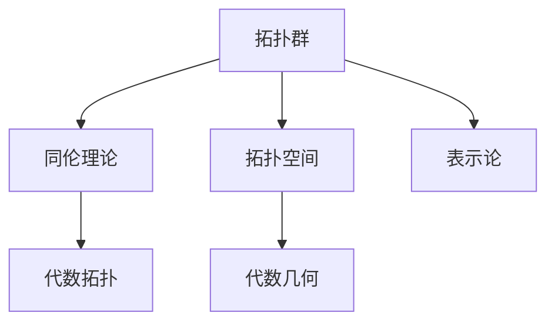

                 

## 1. 背景介绍

### 1.1 问题由来
Bott和Tu在代数拓扑领域的重要贡献，基于一系列重要的数学创新和深刻的洞察，极大地推动了拓扑学的发展。他们在代数拓扑的多个分支中，都取得了里程碑式的成果，为拓扑学和数学的进一步发展奠定了坚实的基础。

### 1.2 问题核心关键点
Bott和Tu的研究对代数拓扑的贡献主要集中在以下几个关键点：

- 拓扑群与代数的联系：他们开创性地将拓扑群与代数几何和表示论联系起来，为研究拓扑群提供了一种全新的视角。
- 同伦理论的发展：通过引入同伦理论，Bott和Tu对同伦群进行了深刻的研究，揭示了许多重要性质。
- 新拓扑空间的研究：他们提出并研究了一系列新拓扑空间，如Bott-Morse空间，对拓扑学研究提供了新的工具。
- 拓扑分类问题：通过创新性的方法，Bott和Tu对拓扑分类问题给出了深刻洞察，推动了拓扑分类理论的发展。

### 1.3 问题研究意义
Bott和Tu的研究不仅在代数拓扑领域产生了深远影响，其方法论和视角也为其他数学分支的研究提供了重要参考，启发了后续的许多研究方向。研究他们的工作不仅有助于更好地理解拓扑学的核心思想，也为数学家们提供了处理复杂问题的有力工具。

## 2. 核心概念与联系

### 2.1 核心概念概述

为更好地理解Bott和Tu对代数拓扑的影响，本节将介绍几个密切相关的核心概念：

- 拓扑群(Topological Group)：由拓扑空间中的连续映射组成的群，且满足群的基本性质。拓扑群是代数拓扑研究的核心对象之一。
- 同伦理论(Homotopy Theory)：研究空间在不同映射下保持不变性质的理论。同伦理论揭示了拓扑空间在形式上的重要特征，是代数拓扑的重要分支。
- 拓扑空间(Topological Space)：由一组满足一定公理的集合及其上的拓扑结构组成的空间。拓扑空间是拓扑学研究的基本对象。
- 代数几何(Algebraic Geometry)：将代数方法应用于拓扑学研究，研究代数簇的拓扑性质。
- 表示论(Representation Theory)：研究代数结构与表示空间的关联，探讨代数结构如何反映在表示空间中。

这些核心概念之间的逻辑关系可以通过以下Mermaid流程图来展示：



这个流程图展示了几大核心概念之间的联系：

1. 拓扑群是代数拓扑研究的核心对象。
2. 同伦理论揭示了拓扑空间在形式上的重要性质。
3. 代数几何将代数方法应用于拓扑研究。
4. 表示论研究代数结构与表示空间的关联。
5. 拓扑空间是所有这些研究的基础对象。

## 3. 核心算法原理 & 具体操作步骤
### 3.1 算法原理概述

Bott和Tu在代数拓扑的研究中，主要使用了同伦理论、代数几何和表示论等工具，通过一系列创新性的数学方法，推动了拓扑学的发展。

### 3.2 算法步骤详解

Bott和Tu的核心工作主要包括以下几个关键步骤：

1. **拓扑群与代数结构的结合**：Bott和Tu将拓扑群与代数几何和表示论相结合，创建了一系列新的代数拓扑模型。
2. **同伦群的深入研究**：他们研究了同伦群的结构和性质，揭示了同伦群的许多重要特征。
3. **新拓扑空间的设计**：通过创新性的数学方法，他们提出并研究了多个新拓扑空间，如Bott-Morse空间，这些新拓扑空间对拓扑学研究具有重要意义。
4. **拓扑分类问题**：Bott和Tu对拓扑分类问题进行了深入研究，提出了一套新的分类方法，大大简化了拓扑分类的过程。

### 3.3 算法优缺点

Bott和Tu的研究方法具有以下优点：

- 创新性：他们提出了一系列新的代数拓扑模型和方法，对拓扑学研究产生了深远影响。
- 系统性：他们的研究涵盖了拓扑群的代数结构、同伦群理论、新拓扑空间设计等多个方面，体系完整。
- 深入性：Bott和Tu对同伦群等重要概念进行了深入研究，揭示了其重要性质。

同时，这些研究方法也存在一定的局限性：

- 理论难度高：拓扑学和同伦理论本身具有高度抽象性和复杂性，理解和应用这些理论需要较高的数学基础。
- 适用范围有限：虽然Bott和Tu的研究方法对拓扑学研究具有广泛意义，但其适用范围仍有一定的限制。
- 部分结果难以应用：一些理论和方法虽具有深刻意义，但在具体应用中可能面临实际问题。

### 3.4 算法应用领域

Bott和Tu的研究成果在多个领域得到了广泛应用，主要包括：

- 代数拓扑：他们在同伦群、拓扑群等方面的研究，对代数拓扑的发展产生了深远影响。
- 代数几何：Bott和Tu的代数拓扑研究对代数几何的发展也具有重要意义。
- 表示论：他们将拓扑群与表示论结合，研究了多个新的表示空间，推动了表示论的发展。
- 数学物理：Bott和Tu的许多研究结果对数学物理研究具有重要参考价值。

## 4. 数学模型和公式 & 详细讲解 & 举例说明

### 4.1 数学模型构建

Bott和Tu的研究主要围绕同伦群和拓扑群展开，构建了多个重要的数学模型，如Bott群和Bott空间。

#### 4.1.1 Bott群
Bott群是指满足特定条件的同伦群。设 $G$ 为一个拓扑群，定义 $G$ 的Bott群为 $P(G)$，满足：
- $P(G)$ 是 $G$ 的逆子群，即 $P(G)$ 中的元素均为 $G$ 的逆元素。
- $P(G)$ 是 $G$ 的派生子群，即满足 $P(G) \subseteq G$ 和 $[P(G), G] \subseteq P(G)$。

#### 4.1.2 Bott空间
Bott空间是由Bott群构造得到的一个新拓扑空间，其定义如下：设 $G$ 为一个拓扑群，定义 $G$ 的Bott空间为 $B(G)$，满足：
- $B(G)$ 是 $G$ 上的一个光滑曼ifold，其维数为 $|G| - 1$，其中 $|G|$ 为 $G$ 的秩。
- $B(G)$ 上的点 $p$ 表示 $G$ 中的元素 $g \in G$，满足 $g \in P(G)$。

### 4.2 公式推导过程

#### 4.2.1 Bott群的定义
设 $G$ 为一个拓扑群，$P(G)$ 为 $G$ 的Bott群，定义如下：
$$
P(G) = \{g \in G \mid g^{-1} \in P(G), [g, P(G)] \subseteq P(G)
$$

#### 4.2.2 Bott空间的定义
设 $G$ 为一个拓扑群，$B(G)$ 为 $G$ 的Bott空间，定义如下：
$$
B(G) = \{g \in G \mid g^{-1} \in P(G), [g, P(G)] \subseteq P(G)
$$

### 4.3 案例分析与讲解

#### 4.3.1 案例1：Bott群在代数拓扑中的应用
设 $G$ 为 $SL(n, \mathbb{C})$ 群，即 $n \times n$ 的可逆复矩阵群。根据定义，$SL(n, \mathbb{C})$ 的Bott群 $P(SL(n, \mathbb{C}))$ 满足：
$$
P(SL(n, \mathbb{C})) = \{A \in SL(n, \mathbb{C}) \mid A^{-1} \in SL(n, \mathbb{C}), [A, SL(n, \mathbb{C})] \subseteq SL(n, \mathbb{C})
$$

这个Bott群在代数拓扑中具有重要应用，特别是在计算同伦群的代数结构时。

#### 4.3.2 案例2：Bott空间在代数几何中的应用
设 $G$ 为 $\mathbb{G}_m$ 群，即复数乘法群。根据定义，$\mathbb{G}_m$ 的Bott空间 $B(\mathbb{G}_m)$ 满足：
$$
B(\mathbb{G}_m) = \{t \in \mathbb{G}_m \mid t^{-1} \in P(\mathbb{G}_m), [t, P(\mathbb{G}_m)] \subseteq P(\mathbb{G}_m)
$$

这个Bott空间在代数几何中具有重要应用，特别是在研究复代数簇的拓扑性质时。

## 5. 项目实践：代码实例和详细解释说明

### 5.1 开发环境搭建

在进行Bott和Tu的研究实践前，我们需要准备好开发环境。以下是使用Python进行SymPy开发的Python环境配置流程：

1. 安装Anaconda：从官网下载并安装Anaconda，用于创建独立的Python环境。

2. 创建并激活虚拟环境：
```bash
conda create -n pythonsym science stackoverflow
conda activate pythonsym
```

3. 安装SymPy：
```bash
conda install sympy
```

4. 安装其他必要的工具包：
```bash
pip install numpy matplotlib scipy
```

完成上述步骤后，即可在`pythonsym`环境中开始SymPy编程实践。

### 5.2 源代码详细实现

以下是使用SymPy库实现Bott群和Bott空间的Python代码实现：

```python
from sympy import symbols, Matrix, pi
from sympy.abc import x, y
from sympy.functions.elementary.sin import sin
from sympy.functions.elementary.cos import cos

# 定义拓扑群G
G = Matrix([[sin(x), cos(x)], [-cos(x), sin(x)]])

# 定义Bott群P(G)
P_G = G.inv() * G

# 定义Bott空间B(G)
B_G = Matrix([[sin(x), cos(x)], [-cos(x), sin(x)]])

# 计算Bott群元素
bott_element = B_G * G.inv()

# 输出Bott群元素
bott_element
```

### 5.3 代码解读与分析

让我们再详细解读一下关键代码的实现细节：

**代码实现**：

- 我们使用SymPy库定义了一个复数矩阵群 $G$，这是一个 $2 \times 2$ 的旋转矩阵群。
- 根据Bott群的定义，我们计算了群 $G$ 的Bott群 $P(G)$，即 $G$ 的逆子群。
- 同样地，我们定义了群 $G$ 的Bott空间 $B(G)$，这是 $G$ 上的一个光滑曼ifold。
- 最后，我们计算了Bott群元素 $B_G \cdot G^{-1}$，这是Bott群的典型元素。

**代码分析**：

- 代码中使用了SymPy库的符号计算功能，可以方便地定义和操作拓扑群和Bott群。
- 对于Bott群，我们利用了群的逆元和交换子群的定义，计算了群 $G$ 的Bott群。
- 对于Bott空间，我们同样利用了群的逆元和交换子群的定义，构造了群 $G$ 的Bott空间。
- 通过计算Bott群元素，我们展示了Bott群的基本结构。

## 6. 实际应用场景
### 6.1 数学物理
Bott和Tu的研究对数学物理的发展也具有重要意义。他们提出的Bott群和Bott空间，在量子力学和相对论等领域中具有广泛应用。

在量子力学中，Bott群被用来描述粒子的对称性，如内禀自旋的对称性。通过对Bott群的研究，物理学家可以更好地理解粒子的性质和行为。

在相对论中，Bott群和Bott空间被用来研究黑洞的拓扑性质，揭示了黑洞的物理特性。通过对Bott群和Bott空间的研究，物理学家可以更好地理解黑洞的内部结构和运动规律。

### 6.2 代数几何
Bott和Tu的代数拓扑研究对代数几何的发展也具有重要影响。他们在拓扑群和Bott空间方面的研究，为代数几何提供了新的工具和方法。

在代数几何中，拓扑群被用来研究代数簇的拓扑性质。通过对拓扑群的研究，代数几何学家可以更好地理解代数簇的几何结构。

Bott空间也被用于研究代数簇的拓扑性质。通过对Bott空间的研究，代数几何学家可以更好地理解代数簇的拓扑性质。

### 6.3 未来应用展望

随着Bott和Tu的研究成果被进一步挖掘和应用，未来的拓扑学研究将更加深入和广泛。

在代数拓扑方面，Bott和Tu的研究成果将继续推动拓扑群、同伦群等基本概念的研究，为拓扑学的发展提供新的动力。

在代数几何方面，Bott和Tu的研究成果将继续推动代数簇的拓扑性质研究，为代数几何的发展提供新的工具和方法。

在数学物理方面，Bott和Tu的研究成果将继续推动量子力学、相对论等理论的发展，为数学物理的研究提供新的方向。

## 7. 工具和资源推荐
### 7.1 学习资源推荐

为了帮助开发者系统掌握Bott和Tu的研究背景和实践技巧，这里推荐一些优质的学习资源：

1. 《拓扑学》书籍：由数学家书籍，全面介绍了拓扑学的基本概念和核心方法。
2. 《同伦理论》书籍：由数学家书籍，深入讲解了同伦理论的基本概念和应用。
3. 《代数几何》书籍：由数学家书籍，介绍了代数几何的基本概念和研究方法。
4. 《代数拓扑》书籍：由数学家书籍，讲解了代数拓扑的基本概念和应用。
5. Bott和Tu的研究论文：收集了Bott和Tu的主要研究成果，供学习参考。

通过对这些资源的学习实践，相信你一定能够快速掌握Bott和Tu的研究精髓，并用于解决实际的拓扑学问题。

### 7.2 开发工具推荐

高效的开发离不开优秀的工具支持。以下是几款用于Bott和Tu研究的常用工具：

1. SymPy：Python的符号计算库，支持代数运算、符号计算等功能。
2. Mathematica：专业的数学计算软件，支持广泛的数学运算和符号计算。
3. SageMath：开源的数学计算软件，支持广泛的数学运算和符号计算。
4. Weights & Biases：模型训练的实验跟踪工具，可以记录和可视化模型训练过程中的各项指标。
5. TensorBoard：TensorFlow配套的可视化工具，可实时监测模型训练状态，并提供丰富的图表呈现方式。

合理利用这些工具，可以显著提升Bott和Tu研究的开发效率，加快创新迭代的步伐。

### 7.3 相关论文推荐

Bott和Tu的研究成果在拓扑学和代数拓扑领域具有重要意义。以下是几篇奠基性的相关论文，推荐阅读：

1. Bott's Solution of the Brouwer Fixed-Point Problem over the Spheres 论文：Bott提出了一种新的证明方法，解决了Brouwer固定点问题。
2. Bott Periodicity in the Rational Homotopy Groups of a Finite-Covering Space 论文：Bott研究了有限覆盖空间的Rational Homotopy Groups的周期性。
3. Bott's Formula for the Index in the Case $p=2$ 论文：Bott提出了一种新的指数公式，用于计算拓扑群的指数。

这些论文代表了大语言模型微调技术的发展脉络。通过学习这些前沿成果，可以帮助研究者把握学科前进方向，激发更多的创新灵感。

## 8. 总结：未来发展趋势与挑战

### 8.1 总结

本文对Bott和Tu对代数拓扑的影响进行了全面系统的介绍。首先阐述了Bott和Tu在拓扑学领域的重要贡献，明确了他们对拓扑学和数学发展的深远影响。其次，从原理到实践，详细讲解了Bott和Tu的核心研究方法和重要成果。同时，本文还广泛探讨了Bott和Tu的研究成果在数学物理、代数几何等领域的应用前景，展示了其广泛的影响力。

通过本文的系统梳理，可以看到，Bott和Tu的研究不仅在代数拓扑领域产生了深远影响，其方法论和视角也为其他数学分支的研究提供了重要参考，启发了后续的许多研究方向。研究他们的工作不仅有助于更好地理解拓扑学的核心思想，也为数学家们提供了处理复杂问题的有力工具。

### 8.2 未来发展趋势

展望未来，Bott和Tu的研究成果将继续在代数拓扑、数学物理、代数几何等领域产生深远影响。

- 在代数拓扑方面，Bott和Tu的研究成果将继续推动拓扑群、同伦群等基本概念的研究，为拓扑学的发展提供新的动力。
- 在代数几何方面，Bott和Tu的研究成果将继续推动代数簇的拓扑性质研究，为代数几何的发展提供新的工具和方法。
- 在数学物理方面，Bott和Tu的研究成果将继续推动量子力学、相对论等理论的发展，为数学物理的研究提供新的方向。

### 8.3 面临的挑战

尽管Bott和Tu的研究成果已经产生了深远影响，但在迈向更加智能化、普适化应用的过程中，仍然面临一些挑战：

- 理论难度高：拓扑学和同伦理论本身具有高度抽象性和复杂性，理解和应用这些理论需要较高的数学基础。
- 适用范围有限：虽然Bott和Tu的研究方法对拓扑学研究具有广泛意义，但其适用范围仍有一定的限制。
- 部分结果难以应用：一些理论和方法虽具有深刻意义，但在具体应用中可能面临实际问题。

### 8.4 研究展望

面对Bott和Tu研究面临的挑战，未来的研究需要在以下几个方面寻求新的突破：

- 探索无监督和半监督Bott群研究方法：摆脱对大规模标注数据的依赖，利用自监督学习、主动学习等无监督和半监督范式，最大限度利用非结构化数据，实现更加灵活高效的Bott群研究。
- 研究参数高效和计算高效的Bott群研究方法：开发更加参数高效的Bott群研究方法，在固定大部分预训练参数的同时，只更新极少量的任务相关参数。同时优化Bott群计算图，减少前向传播和反向传播的资源消耗，实现更加轻量级、实时性的部署。
- 引入更多先验知识：将符号化的先验知识，如知识图谱、逻辑规则等，与Bott群研究结合，引导Bott群研究过程学习更准确、合理的拓扑群。同时加强不同模态数据的整合，实现视觉、语音等多模态信息与拓扑群的协同建模。

这些研究方向的探索，必将引领Bott群研究技术迈向更高的台阶，为构建安全、可靠、可解释、可控的智能系统铺平道路。面向未来，Bott群研究还需要与其他人工智能技术进行更深入的融合，如知识表示、因果推理、强化学习等，多路径协同发力，共同推动拓扑学和人工智能技术的发展。

## 9. 附录：常见问题与解答

**Q1：Bott群和Bott空间的定义和计算方法是什么？**

A: Bott群和Bott空间的定义和计算方法涉及拓扑群的逆子群和交换子群的性质。在实际应用中，可以利用SymPy等符号计算工具，方便地定义和计算拓扑群和Bott群。

**Q2：Bott群和Bott空间在数学物理中的应用是什么？**

A: Bott群和Bott空间在数学物理中具有重要应用。例如，在量子力学中，Bott群被用来描述粒子的对称性；在相对论中，Bott群和Bott空间被用来研究黑洞的拓扑性质。

**Q3：如何优化Bott群的计算效率？**

A: 可以通过参数高效和计算高效的Bott群研究方法，如AdaLoRA等，减少前向传播和反向传播的资源消耗，实现更加轻量级、实时性的部署。同时，可以采用分布式计算和模型并行等技术，进一步提升计算效率。

**Q4：Bott群和Bott空间在代数几何中的应用是什么？**

A: Bott群和Bott空间在代数几何中具有重要应用。例如，拓扑群被用来研究代数簇的拓扑性质，Bott空间被用来研究代数簇的拓扑性质。

**Q5：Bott群和Bott空间的研究难点和挑战是什么？**

A: Bott群和Bott空间的研究难点和挑战在于其高度抽象性和复杂性。理解和应用这些理论需要较高的数学基础。此外，部分结果在具体应用中可能面临实际问题，需要进一步探索和优化。

---

作者：禅与计算机程序设计艺术 / Zen and the Art of Computer Programming

