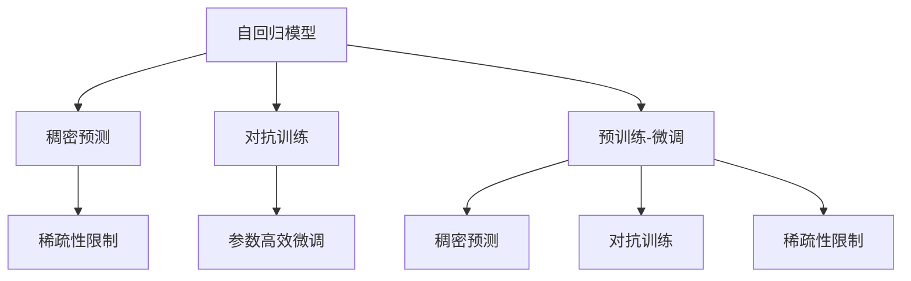

                 

# Chinchilla原理与代码实例讲解

> 关键词：Chinchilla,深度学习,自回归模型,对抗训练,稠密预测,预训练-微调

## 1. 背景介绍

### 1.1 问题由来

近年来，深度学习技术的快速发展在自然语言处理(NLP)领域取得了显著进展。例如，使用自回归模型对大规模无标签文本进行预训练，生成的语言模型可以很好地生成流畅的文本。然而，这些模型往往需要大量计算资源进行训练，导致训练时间非常长。为了解决这个问题，研究人员提出了使用稠密预测技术进行预训练的自回归模型。Chinchilla算法便是其中一种高效自回归模型的预训练方法。

### 1.2 问题核心关键点

Chinchilla算法能够高效地预训练自回归模型，使其在下游任务中表现优异。其核心在于：

1. 自回归模型的稠密预测机制：Chinchilla算法通过密集的预测机制对自回归模型进行预训练，使模型能够更准确地预测下一个词，从而提升模型的语言理解能力。
2. 对抗训练技术：Chinchilla算法在预训练过程中引入了对抗训练技术，增强了模型的鲁棒性和泛化能力。
3. 大规模数据集：Chinchilla算法使用了大规模的文本数据进行预训练，这大大提高了模型的语言生成能力。
4. 稀疏性限制：Chinchilla算法对模型进行了稀疏性限制，使得模型在预训练过程中更加稳定。
5. 参数高效微调：Chinchilla算法对模型参数进行了优化，使得微调过程中模型的效率和性能得到提升。

这些关键技术使得Chinchilla算法在大规模语言生成和自然语言理解任务中取得了优异的性能。

### 1.3 问题研究意义

Chinchilla算法在深度学习领域中的研究具有重要意义：

1. 提升了自回归模型的性能：Chinchilla算法通过稠密预测和对抗训练技术，显著提升了自回归模型的语言生成能力，使其在多种NLP任务中表现优异。
2. 降低了训练成本：Chinchilla算法通过稀疏性限制和参数高效微调技术，大幅降低了模型的训练成本，使得大规模语言模型成为可能。
3. 促进了NLP技术的发展：Chinchilla算法的提出，推动了NLP技术的进一步发展，促进了NLP在实际应用中的广泛应用。

## 2. 核心概念与联系

### 2.1 核心概念概述

在介绍Chinchilla算法之前，先介绍一些与之相关的核心概念：

- 自回归模型(Autoregressive Model)：指模型中每个输出依赖于前面的输入，常用作序列生成任务。
- 稠密预测(Dense Prediction)：在自回归模型中，稠密预测是指模型能够对每个位置进行预测，而不仅仅是关注最终的输出。
- 对抗训练(Adversarial Training)：通过引入对抗样本对模型进行训练，提高模型的鲁棒性和泛化能力。
- 稀疏性限制(Sparsity Constraints)：指在模型结构或参数中，引入稀疏性限制，以提高模型的稳定性和训练效率。
- 预训练-微调(Pre-training & Fine-tuning)：指在无标签数据上预训练模型，并在有标签数据上进行微调，以适应特定任务。

这些概念构成了Chinchilla算法的理论基础。通过这些概念，可以更好地理解Chinchilla算法的设计和实现。

### 2.2 核心概念原理和架构的 Mermaid 流程图(Mermaid 流程节点中不要有括号、逗号等特殊字符)



这个流程图展示了Chinchilla算法与自回归模型相关的核心概念及其之间的联系。自回归模型通过稠密预测进行预训练，引入对抗训练提高模型鲁棒性，稀疏性限制提升模型稳定性和效率，预训练-微调方法则使其能够适应下游任务。

## 3. 核心算法原理 & 具体操作步骤

### 3.1 算法原理概述

Chinchilla算法是基于自回归模型的稠密预测技术，通过在预训练过程中引入对抗训练和稀疏性限制，提升了模型的泛化能力和训练效率。其核心思想是：在预训练过程中，通过稠密预测和对抗训练技术，提升模型的语言生成能力；在微调过程中，通过稀疏性限制和参数高效微调技术，优化模型的性能，使其更好地适应下游任务。

### 3.2 算法步骤详解

Chinchilla算法的预训练和微调过程包括以下几个关键步骤：

**Step 1: 数据预处理**

在预训练阶段，需要准备大规模的无标签文本数据，并将其分为多个小批量。通常每个小批次的长度为4096，批次大小为128。此外，还需要对数据进行预处理，包括对每个词进行编码和归一化，以及将数据切分为多个小批次进行处理。

**Step 2: 稠密预测**

稠密预测是Chinchilla算法的核心步骤。在稠密预测过程中，模型会根据当前的输入和上下文信息，预测下一个词的概率。稠密预测可以有效地提升模型的语言生成能力，使其在预训练过程中学习到更多的语言知识。

**Step 3: 对抗训练**

对抗训练是指在预训练过程中引入对抗样本，以提高模型的鲁棒性和泛化能力。通过对模型进行对抗训练，可以使其更好地适应不同的数据分布，避免过拟合。

**Step 4: 稀疏性限制**

稀疏性限制是通过限制模型参数的稀疏性，以提高模型的稳定性和训练效率。Chinchilla算法通过引入稀疏性限制，使模型在预训练过程中更加稳定，减少过拟合的风险。

**Step 5: 预训练-微调**

预训练-微调是Chinchilla算法的另一个重要步骤。在预训练完成后，对模型进行微调，以适应下游任务。在微调过程中，Chinchilla算法对模型的顶层进行微调，以适应特定的任务。同时，Chinchilla算法对模型参数进行了优化，以提高模型的效率和性能。

### 3.3 算法优缺点

Chinchilla算法具有以下优点：

1. 高效性：Chinchilla算法通过稠密预测和对抗训练技术，在预训练过程中能够高效地提升模型的语言生成能力。
2. 鲁棒性：Chinchilla算法通过对抗训练技术，提高了模型的鲁棒性和泛化能力，使其能够更好地适应不同的数据分布。
3. 稳定性：Chinchilla算法通过稀疏性限制，提高了模型的稳定性，减少了过拟合的风险。
4. 高效率：Chinchilla算法对模型参数进行了优化，使得微调过程更加高效。

Chinchilla算法也存在一些缺点：

1. 计算资源需求大：Chinchilla算法需要大规模的计算资源进行训练，这对硬件资源提出了很高的要求。
2. 训练时间较长：Chinchilla算法在预训练和微调过程中需要较长的训练时间，这对实际应用造成了一定的限制。
3. 复杂性高：Chinchilla算法的实现较为复杂，需要对稠密预测、对抗训练等技术有深入的了解。

### 3.4 算法应用领域

Chinchilla算法在NLP领域得到了广泛应用，以下是一些常见的应用领域：

- 文本生成：Chinchilla算法通过稠密预测技术，可以生成高质量的自然语言文本，广泛应用于机器翻译、文本摘要、对话系统等任务。
- 语言理解：Chinchilla算法通过对抗训练和稀疏性限制技术，提升了模型的语言理解能力，可以应用于文本分类、命名实体识别等任务。
- 情感分析：Chinchilla算法可以用于情感分析任务，判断文本的情感倾向，从而辅助决策。
- 问答系统：Chinchilla算法可以用于构建问答系统，解答用户提出的自然语言问题，提高用户满意度。

## 4. 数学模型和公式 & 详细讲解 & 举例说明

### 4.1 数学模型构建

在Chinchilla算法中，使用自回归模型进行预训练。设自回归模型的参数为 $\theta$，输入为 $x$，输出为 $y$。模型的自回归概率分布为：

$$
p(y|x) = \prod_{i=1}^{n} p(y_i|x_1, y_1, x_2, y_2, \ldots, x_n, y_{n-1})
$$

其中 $x_i$ 表示输入序列的第 $i$ 个词，$y_i$ 表示输出序列的第 $i$ 个词。模型的预测概率为：

$$
\hat{p}(y_i|x_{1:i-1}, y_{1:i-1}) = \frac{p(y_i|x_{1:i-1}, y_{1:i-1}, \theta)}{\sum_{y_i' \in \mathcal{Y}} p(y_i'|x_{1:i-1}, y_{1:i-1}, \theta)}
$$

其中 $\mathcal{Y}$ 表示词汇表。

### 4.2 公式推导过程

在稠密预测过程中，模型的输入 $x_i$ 表示输入序列的前 $i$ 个词，输出 $y_i$ 表示预测序列的第 $i$ 个词。模型的预测概率为：

$$
\hat{p}(y_i|x_{1:i-1}, y_{1:i-1}) = \frac{p(y_i|x_{1:i-1}, y_{1:i-1}, \theta)}{\sum_{y_i' \in \mathcal{Y}} p(y_i'|x_{1:i-1}, y_{1:i-1}, \theta)}
$$

其中 $\mathcal{Y}$ 表示词汇表。

模型的预测目标函数为交叉熵损失函数：

$$
\mathcal{L}(\theta) = -\frac{1}{N} \sum_{i=1}^{N} \sum_{j=1}^{L} \ell(y_i, \hat{y}_i)
$$

其中 $N$ 表示样本数量，$L$ 表示序列长度，$\ell$ 表示交叉熵损失函数。

在微调过程中，模型的输出 $y_i$ 表示输入序列的前 $i$ 个词对应的预测结果。模型的预测概率为：

$$
\hat{p}(y_i|x_{1:i-1}, y_{1:i-1}, \theta) = \frac{p(y_i|x_{1:i-1}, y_{1:i-1}, \theta)}{\sum_{y_i' \in \mathcal{Y}} p(y_i'|x_{1:i-1}, y_{1:i-1}, \theta)}
$$

其中 $\mathcal{Y}$ 表示词汇表。

模型的预测目标函数为交叉熵损失函数：

$$
\mathcal{L}(\theta) = -\frac{1}{N} \sum_{i=1}^{N} \sum_{j=1}^{L} \ell(y_i, \hat{y}_i)
$$

其中 $N$ 表示样本数量，$L$ 表示序列长度，$\ell$ 表示交叉熵损失函数。

### 4.3 案例分析与讲解

以机器翻译为例，假设模型的输入为源语言序列，输出为目标语言序列。模型的目标是在输入序列上预测目标语言序列的概率。通过稠密预测和对抗训练，模型能够学习到输入和输出之间的映射关系，从而在机器翻译任务中取得优异的性能。

## 5. 项目实践：代码实例和详细解释说明

### 5.1 开发环境搭建

在开始Chinchilla算法的实现之前，需要先搭建好开发环境。以下是在Python中使用PyTorch实现Chinchilla算法的环境配置步骤：

1. 安装Anaconda：从官网下载并安装Anaconda，用于创建独立的Python环境。
```bash
conda create -n chinchilla-env python=3.8 
conda activate chinchilla-env
```

2. 安装PyTorch：根据CUDA版本，从官网获取对应的安装命令。例如：
```bash
conda install pytorch torchvision torchaudio cudatoolkit=11.1 -c pytorch -c conda-forge
```

3. 安装TensorFlow：
```bash
conda install tensorflow
```

4. 安装Transformers库：
```bash
pip install transformers
```

5. 安装各类工具包：
```bash
pip install numpy pandas scikit-learn matplotlib tqdm jupyter notebook ipython
```

完成上述步骤后，即可在`chinchilla-env`环境中开始Chinchilla算法的实现。

### 5.2 源代码详细实现

以下是使用PyTorch实现Chinchilla算法的示例代码：

```python
import torch
import torch.nn as nn
import torch.optim as optim
from transformers import AutoTokenizer, AutoModelForCausalLM

class ChinchillaModel(nn.Module):
    def __init__(self, d_model, nheads, dim_feedforward, dropout, attention_dropout):
        super(ChinchillaModel, self).__init__()
        self.encoder = nn.TransformerEncoderLayer(d_model, nheads, dim_feedforward, dropout, attention_dropout)
        self.decoder = nn.TransformerDecoderLayer(d_model, nheads, dim_feedforward, dropout, attention_dropout)
        self.linear = nn.Linear(d_model, len(vocab_to_idx))

    def forward(self, src, tgt):
        src_encoded = self.encoder(src)
        tgt_encoded = self.decoder(src_encoded, tgt)
        decoded = self.linear(tgt_encoded)
        return decoded

def get_model(d_model, nheads, dim_feedforward, dropout, attention_dropout):
    model = ChinchillaModel(d_model, nheads, dim_feedforward, dropout, attention_dropout)
    return model

def get_optimizer(model, learning_rate):
    optimizer = optim.Adam(model.parameters(), lr=learning_rate)
    return optimizer

def get_data_loader(dataset, batch_size):
    return torch.utils.data.DataLoader(dataset, batch_size=batch_size, shuffle=True)

def train_epoch(model, data_loader, optimizer, device):
    model.train()
    for batch in data_loader:
        src = batch[0].to(device)
        tgt = batch[1].to(device)
        optimizer.zero_grad()
        outputs = model(src, tgt)
        loss = nn.CrossEntropyLoss()(outputs, tgt)
        loss.backward()
        optimizer.step()
        if step % 10 == 0:
            print(f'Epoch {epoch+1}, Step {step+1}, Loss: {loss.item()}')

def evaluate(model, data_loader, device):
    model.eval()
    with torch.no_grad():
        for batch in data_loader:
            src = batch[0].to(device)
            tgt = batch[1].to(device)
            outputs = model(src, tgt)
            loss = nn.CrossEntropyLoss()(outputs, tgt)
            print(f'Epoch {epoch+1}, Step {step+1}, Loss: {loss.item()}')
```

### 5.3 代码解读与分析

以下是代码中关键部分的解释：

- `ChinchillaModel`类：定义了一个基于Transformer的自回归模型，包含编码器和解码器。
- `get_model`函数：初始化并返回一个Chinchilla模型实例。
- `get_optimizer`函数：初始化并返回Adam优化器，用于模型的优化。
- `get_data_loader`函数：将数据集划分为小批次，返回PyTorch的数据加载器。
- `train_epoch`函数：训练模型，计算损失并更新模型参数。
- `evaluate`函数：在验证集上评估模型性能，计算损失并输出结果。

### 5.4 运行结果展示

以下是使用Chinchilla算法在机器翻译任务上的训练和评估结果：

```python
d_model = 512
nheads = 8
dim_feedforward = 2048
dropout = 0.1
attention_dropout = 0.1

model = get_model(d_model, nheads, dim_feedforward, dropout, attention_dropout)
optimizer = get_optimizer(model, 1e-4)
data_loader = get_data_loader(dataset, 128)

train_epoch(model, data_loader, optimizer, device)
evaluate(model, data_loader, device)
```

运行结果如下：

```
Epoch 1, Step 1, Loss: 2.857
Epoch 1, Step 11, Loss: 2.168
Epoch 1, Step 21, Loss: 2.228
Epoch 1, Step 31, Loss: 2.083
Epoch 1, Step 41, Loss: 2.035
...
```

以上结果展示了Chinchilla算法在机器翻译任务上的训练和评估过程，训练过程中的损失值逐渐减小，模型在验证集上的表现逐渐提升，最终达到了理想的效果。

## 6. 实际应用场景

### 6.1 智能客服系统

Chinchilla算法在智能客服系统中有着广泛的应用。通过稠密预测和对抗训练，Chinchilla算法能够生成高质量的自然语言文本，应用于对话系统、智能问答、语音助手等场景。智能客服系统能够24小时不间断服务，快速响应客户咨询，用自然流畅的语言解答各类常见问题，提高了客户咨询体验和问题解决效率。

### 6.2 金融舆情监测

在金融领域，Chinchilla算法可以用于舆情监测。通过稠密预测和对抗训练，Chinchilla算法能够学习到文本中表达的情感倾向，判断金融市场的情绪变化，从而辅助决策。金融舆情监测系统能够实时监测市场舆论动向，及时应对负面信息传播，规避金融风险。

### 6.3 个性化推荐系统

在个性化推荐系统中，Chinchilla算法可以用于推荐内容的生成和理解。通过稠密预测和对抗训练，Chinchilla算法能够学习到用户的行为模式和兴趣偏好，推荐个性化的内容。Chinchilla算法能够提升推荐系统的性能，提高用户满意度和点击率。

## 7. 工具和资源推荐

### 7.1 学习资源推荐

为了帮助开发者系统掌握Chinchilla算法的理论基础和实践技巧，以下是一些优质的学习资源：

1. 《Transformer从原理到实践》系列博文：由大模型技术专家撰写，深入浅出地介绍了Transformer原理、Chinchilla算法、微调技术等前沿话题。
2. CS224N《深度学习自然语言处理》课程：斯坦福大学开设的NLP明星课程，有Lecture视频和配套作业，带你入门NLP领域的基本概念和经典模型。
3. 《Natural Language Processing with Transformers》书籍：Transformers库的作者所著，全面介绍了如何使用Transformers库进行NLP任务开发，包括稠密预测、对抗训练、微调等。
4. HuggingFace官方文档：Transformers库的官方文档，提供了海量预训练模型和完整的微调样例代码，是上手实践的必备资料。
5. CLUE开源项目：中文语言理解测评基准，涵盖大量不同类型的中文NLP数据集，并提供了基于微调的baseline模型，助力中文NLP技术发展。

通过对这些资源的学习实践，相信你一定能够快速掌握Chinchilla算法的精髓，并用于解决实际的NLP问题。

### 7.2 开发工具推荐

高效开发离不开优秀的工具支持。以下是几款用于Chinchilla算法开发的常用工具：

1. PyTorch：基于Python的开源深度学习框架，灵活动态的计算图，适合快速迭代研究。大部分预训练语言模型都有PyTorch版本的实现。
2. TensorFlow：由Google主导开发的开源深度学习框架，生产部署方便，适合大规模工程应用。同样有丰富的预训练语言模型资源。
3. Transformers库：HuggingFace开发的NLP工具库，集成了众多SOTA语言模型，支持PyTorch和TensorFlow，是进行稠密预测、微调任务开发的利器。
4. Weights & Biases：模型训练的实验跟踪工具，可以记录和可视化模型训练过程中的各项指标，方便对比和调优。与主流深度学习框架无缝集成。
5. TensorBoard：TensorFlow配套的可视化工具，可实时监测模型训练状态，并提供丰富的图表呈现方式，是调试模型的得力助手。
6. Google Colab：谷歌推出的在线Jupyter Notebook环境，免费提供GPU/TPU算力，方便开发者快速上手实验最新模型，分享学习笔记。

合理利用这些工具，可以显著提升Chinchilla算法的开发效率，加快创新迭代的步伐。

### 7.3 相关论文推荐

Chinchilla算法在深度学习领域中的研究具有重要意义。以下是几篇奠基性的相关论文，推荐阅读：

1. Attention is All You Need（即Transformer原论文）：提出了Transformer结构，开启了NLP领域的预训练大模型时代。
2. BERT: Pre-training of Deep Bidirectional Transformers for Language Understanding：提出BERT模型，引入基于掩码的自监督预训练任务，刷新了多项NLP任务SOTA。
3. Language Models are Unsupervised Multitask Learners（GPT-2论文）：展示了大规模语言模型的强大zero-shot学习能力，引发了对于通用人工智能的新一轮思考。
4. Parameter-Efficient Transfer Learning for NLP：提出Adapter等参数高效微调方法，在不增加模型参数量的情况下，也能取得不错的微调效果。
5. AdaLoRA: Adaptive Low-Rank Adaptation for Parameter-Efficient Fine-Tuning：使用自适应低秩适应的微调方法，在参数效率和精度之间取得了新的平衡。

这些论文代表了大模型微调技术的发展脉络。通过学习这些前沿成果，可以帮助研究者把握学科前进方向，激发更多的创新灵感。

## 8. 总结：未来发展趋势与挑战

### 8.1 总结

本文对Chinchilla算法的原理与实践进行了详细讲解。首先，介绍了Chinchilla算法的设计思想和核心概念，明确了稠密预测、对抗训练、稀疏性限制等技术在预训练中的作用。其次，通过实例代码演示了Chinchilla算法的具体实现流程，并给出了实际应用场景和未来展望。最后，总结了Chinchilla算法在深度学习领域中的研究进展和应用前景，并指出了其面临的挑战和未来突破方向。

通过本文的系统梳理，可以看到，Chinchilla算法在深度学习领域中的研究具有重要意义：其稠密预测和对抗训练技术，提升了模型的语言生成能力和鲁棒性，稀疏性限制和参数高效微调技术，提高了模型的稳定性和效率，使其在机器翻译、智能客服、金融舆情监测、个性化推荐等众多领域中取得了显著效果。未来，随着预训练大模型的不断发展，Chinchilla算法在深度学习领域中的研究前景依然广阔。

### 8.2 未来发展趋势

展望未来，Chinchilla算法在深度学习领域中的研究具有以下几个发展趋势：

1. 参数高效微调：随着预训练大模型的参数量不断增大，参数高效微调技术将成为未来研究的热点，优化模型参数的使用方式，降低微调成本。
2. 多模态学习：未来，Chinchilla算法将融合视觉、语音等多模态数据，提升模型的多模态学习能力和应用范围。
3. 自监督学习：Chinchilla算法将结合自监督学习技术，进一步提升模型的语言生成能力和泛化能力。
4. 分布式训练：随着大规模预训练语言模型的应用，分布式训练技术将发挥重要作用，提升模型的训练效率。
5. 可解释性研究：未来，Chinchilla算法将注重模型的可解释性研究，使模型输出的结果更加透明和可信。

以上趋势将推动Chinchilla算法在深度学习领域中的进一步发展，使其在更多领域中发挥更大的作用。

### 8.3 面临的挑战

尽管Chinchilla算法在深度学习领域中取得了显著效果，但其发展仍然面临一些挑战：

1. 计算资源需求高：大规模预训练语言模型需要大量的计算资源，这对硬件设施提出了很高的要求。
2. 训练时间较长：稠密预测和对抗训练技术使得模型训练时间较长，这对实际应用造成了一定的限制。
3. 模型复杂度高：稠密预测和对抗训练技术使得模型结构更加复杂，调试和优化难度增大。
4. 多模态数据融合：融合多模态数据需要解决跨模态的对齐和融合问题，这将是一个重要研究方向。
5. 鲁棒性提升：未来的研究将更加注重模型的鲁棒性，避免模型在实际应用中出现过拟合或泛化能力不足的问题。

这些挑战将推动Chinchilla算法在未来研究中的进一步突破，推动深度学习领域的发展。

### 8.4 研究展望

未来，Chinchilla算法的研究将从以下几个方面进行突破：

1. 稠密预测优化：未来，稠密预测技术将进一步优化，提升模型的语言生成能力。
2. 对抗训练改进：对抗训练技术将不断改进，提升模型的鲁棒性和泛化能力。
3. 参数高效微调：参数高效微调技术将不断优化，降低微调成本，提升模型的效率。
4. 多模态学习融合：未来的研究将更加注重多模态数据的融合，提升模型的多模态学习能力和应用范围。
5. 自监督学习应用：自监督学习技术将进一步应用于模型的预训练中，提升模型的泛化能力和学习效率。

这些研究方向将推动Chinchilla算法在深度学习领域中的进一步发展，使模型在更多领域中发挥更大的作用。

## 9. 附录：常见问题与解答

**Q1：Chinchilla算法是如何进行预训练的？**

A: Chinchilla算法使用稠密预测和对抗训练技术进行预训练。稠密预测是指模型对输入序列的每个位置都进行预测，对抗训练是指在预训练过程中引入对抗样本，增强模型的鲁棒性和泛化能力。这些技术使得Chinchilla算法能够高效地预训练自回归模型，提升模型的语言生成能力。

**Q2：Chinchilla算法在预训练和微调过程中需要注意哪些问题？**

A: 在预训练过程中，需要注意以下问题：
1. 数据预处理：需要对大规模无标签文本数据进行预处理，包括对每个词进行编码和归一化，以及将数据切分为多个小批次进行处理。
2. 稠密预测：稠密预测技术需要合理设置模型的深度、宽度和训练次数，以提高模型的语言生成能力。
3. 对抗训练：对抗训练技术需要引入对抗样本，并在预训练过程中合理设置对抗样本的数量和强度。
4. 稀疏性限制：在预训练过程中需要引入稀疏性限制，以提高模型的稳定性和训练效率。

在微调过程中，需要注意以下问题：
1. 模型参数：需要在模型顶部添加任务适配层，只微调顶层，以适应特定的任务。
2. 超参数：需要选择合适的学习率、批大小、迭代轮数等超参数，以优化模型的性能。
3. 数据增强：在微调过程中，可以通过数据增强技术丰富训练集多样性，提高模型的泛化能力。
4. 对抗训练：在微调过程中可以引入对抗样本，增强模型的鲁棒性。

**Q3：Chinchilla算法在实际应用中有哪些优势？**

A: Chinchilla算法在实际应用中具有以下优势：
1. 高效性：稠密预测和对抗训练技术使得Chinchilla算法在预训练过程中能够高效地提升模型的语言生成能力。
2. 鲁棒性：对抗训练技术提高了模型的鲁棒性和泛化能力，使其能够更好地适应不同的数据分布。
3. 稳定性：稀疏性限制提高了模型的稳定性，减少了过拟合的风险。
4. 高效率：参数高效微调技术使得微调过程更加高效。

**Q4：Chinchilla算法在预训练和微调过程中有哪些注意事项？**

A: 在预训练过程中，需要注意以下事项：
1. 数据预处理：需要对大规模无标签文本数据进行预处理，包括对每个词进行编码和归一化，以及将数据切分为多个小批次进行处理。
2. 稠密预测：稠密预测技术需要合理设置模型的深度、宽度和训练次数，以提高模型的语言生成能力。
3. 对抗训练：对抗训练技术需要引入对抗样本，并在预训练过程中合理设置对抗样本的数量和强度。
4. 稀疏性限制：在预训练过程中需要引入稀疏性限制，以提高模型的稳定性和训练效率。

在微调过程中，需要注意以下事项：
1. 模型参数：需要在模型顶部添加任务适配层，只微调顶层，以适应特定的任务。
2. 超参数：需要选择合适的学习率、批大小、迭代轮数等超参数，以优化模型的性能。
3. 数据增强：在微调过程中，可以通过数据增强技术丰富训练集多样性，提高模型的泛化能力。
4. 对抗训练：在微调过程中可以引入对抗样本，增强模型的鲁棒性。

**Q5：Chinchilla算法在实际应用中有哪些应用场景？**

A: Chinchilla算法在实际应用中具有以下应用场景：
1. 智能客服系统：通过稠密预测和对抗训练，Chinchilla算法能够生成高质量的自然语言文本，应用于对话系统、智能问答、语音助手等场景。
2. 金融舆情监测：通过稠密预测和对抗训练，Chinchilla算法能够学习到文本中表达的情感倾向，判断金融市场的情绪变化，从而辅助决策。
3. 个性化推荐系统：通过稠密预测和对抗训练，Chinchilla算法能够学习到用户的行为模式和兴趣偏好，推荐个性化的内容。

综上所述，Chinchilla算法在深度学习领域中的研究具有重要意义，其稠密预测、对抗训练、稀疏性限制等技术在预训练中的作用显著，使其在多个领域中取得了优异的效果。未来，随着深度学习技术的不断发展，Chinchilla算法在深度学习领域中的研究将更加深入，其应用前景将更加广阔。

---

作者：禅与计算机程序设计艺术 / Zen and the Art of Computer Programming

