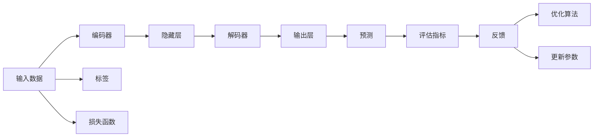

                 

# Deep Learning原理与代码实例讲解

> 关键词：深度学习,深度神经网络,反向传播,梯度下降,激活函数,卷积神经网络,循环神经网络,自编码器,迁移学习,代码实例,PyTorch

## 1. 背景介绍

### 1.1 问题由来

近年来，深度学习（Deep Learning）在计算机视觉、自然语言处理、语音识别等多个领域取得了突破性的进展，成为人工智能领域中最炙手可热的研究方向之一。深度学习的核心在于构建具有多层次神经网络结构的模型，通过对大量数据进行训练，学习到复杂而高维的特征表示。在实际应用中，深度学习模型能够自动从数据中提取和组合特征，逐步优化其表示能力，从而实现高效的预测和分类。

深度学习技术的快速发展，离不开其背后强大的数学和算法基础。本节将从深度学习的核心原理和算法角度出发，探讨其基本概念、工作流程和常用技术，并通过实际代码实例进行详细讲解。

### 1.2 问题核心关键点

深度学习的核心问题可以归纳为以下几点：
1. **模型构建**：选择合适的神经网络结构和激活函数，设计合理的层数和参数，构建具有足够复杂度的模型。
2. **损失函数选择**：根据具体任务，设计合适的损失函数，用于衡量模型输出与真实标签之间的差异。
3. **优化算法设计**：选择合适的优化算法，如梯度下降、Adam等，以最小化损失函数，更新模型参数。
4. **正则化技术应用**：应用L2正则化、Dropout等技术，防止模型过拟合，提升泛化能力。
5. **代码实现**：掌握常用的深度学习框架，如TensorFlow、PyTorch等，实现模型构建和训练。

本节将详细讲解深度学习的核心原理和算法，并结合代码实例，帮助读者更好地理解深度学习的思想和实践。

## 2. 核心概念与联系

### 2.1 核心概念概述

深度学习中的核心概念主要包括：

- **神经网络（Neural Network）**：由多个层次的神经元组成，每一层负责提取数据的不同层次特征，最终输出预测结果。
- **激活函数（Activation Function）**：用于引入非线性变换，增强模型的表达能力。
- **损失函数（Loss Function）**：用于衡量模型输出与真实标签之间的差异，指导模型优化。
- **优化算法（Optimization Algorithm）**：用于最小化损失函数，更新模型参数。
- **正则化技术（Regularization）**：如L2正则化、Dropout等，防止模型过拟合，提升泛化能力。

这些核心概念构成了深度学习的数学和算法基础，相互之间有着紧密的联系。通过深入理解这些概念，可以更好地设计深度学习模型，优化模型参数，提升模型性能。

### 2.2 核心概念原理和架构的 Mermaid 流程图



此图表展示了一个简单的深度神经网络结构，其中输入数据通过编码器（通常是多层感知器或卷积层）进行编码，通过隐藏层进行特征提取和处理，再通过解码器输出最终结果。标签用于评估模型的预测性能，损失函数衡量预测与标签之间的差异，优化算法最小化损失函数，正则化技术防止过拟合，反馈机制用于评估模型性能并指导优化。

## 3. 核心算法原理 & 具体操作步骤

### 3.1 算法原理概述

深度学习的核心算法是反向传播（Backpropagation），通过梯度下降（Gradient Descent）等优化算法不断调整模型参数，最小化损失函数，提升模型性能。

反向传播算法的工作原理如下：
1. 前向传播：将输入数据通过模型，得到预测结果。
2. 计算损失：将预测结果与真实标签进行比较，计算损失函数值。
3. 反向传播：从输出层开始，计算每个神经元的梯度，并逐层向前传播，计算各层权重和偏置的梯度。
4. 参数更新：使用梯度下降等优化算法，根据梯度更新模型参数。

### 3.2 算法步骤详解

以下是深度学习模型的完整训练流程：

**Step 1: 数据准备**
- 收集和预处理训练数据。
- 将数据划分为训练集、验证集和测试集。

**Step 2: 模型构建**
- 选择合适的神经网络结构。
- 定义模型各层的激活函数和权重初始化方法。

**Step 3: 损失函数设计**
- 根据任务类型选择合适的损失函数，如均方误差（MSE）、交叉熵（Cross-Entropy）等。
- 在模型定义中嵌入损失函数计算模块。

**Step 4: 优化算法选择**
- 选择合适的优化算法，如随机梯度下降（SGD）、Adam、Adagrad等。
- 设置学习率、批大小等超参数。

**Step 5: 正则化应用**
- 应用L2正则化、Dropout等技术，防止模型过拟合。
- 在优化过程中定期评估模型在验证集上的性能，防止过拟合。

**Step 6: 训练过程**
- 使用训练集进行前向传播和反向传播，更新模型参数。
- 记录每个epoch的损失值和模型性能指标。
- 根据训练集和验证集的性能，调整学习率和超参数。

**Step 7: 模型评估**
- 在测试集上进行模型评估，使用测试集上的性能指标衡量模型泛化能力。
- 使用可视化工具展示模型训练过程中的损失曲线和性能曲线。

### 3.3 算法优缺点

深度学习的优点包括：
1. **强大的特征提取能力**：能够自动从数据中学习特征，减少人工特征工程的工作量。
2. **广泛的应用范围**：适用于图像识别、语音识别、自然语言处理等多个领域。
3. **高效的模型优化**：反向传播算法和梯度下降等优化算法能够快速更新模型参数。

深度学习的缺点包括：
1. **模型复杂度**：深度神经网络具有多层次结构，参数量大，训练复杂度高。
2. **数据需求高**：需要大量的标注数据进行训练，且对数据质量要求较高。
3. **计算资源需求大**：深度学习模型通常需要大量的计算资源进行训练和推理。

### 3.4 算法应用领域

深度学习在多个领域得到了广泛应用，包括但不限于：

- **计算机视觉**：图像分类、物体检测、人脸识别等。
- **自然语言处理**：机器翻译、情感分析、文本生成等。
- **语音识别**：语音识别、语音合成等。
- **推荐系统**：用户行为分析、商品推荐等。
- **医疗诊断**：医学影像分析、疾病预测等。

这些领域的应用展示了深度学习技术的强大潜力和广泛应用价值。随着深度学习技术的不断进步，其应用领域还将进一步拓展。

## 4. 数学模型和公式 & 详细讲解 & 举例说明

### 4.1 数学模型构建

在深度学习中，通常使用以下数学模型：

- **线性回归模型**：$y = wx + b$，其中 $w$ 为权重，$b$ 为偏置，$x$ 为输入特征，$y$ 为输出结果。
- **逻辑回归模型**：$y = \frac{1}{1+e^{-z}}$，其中 $z = wx + b$，$w$ 为权重，$b$ 为偏置，$x$ 为输入特征，$y$ 为二分类预测结果。
- **卷积神经网络（CNN）**：使用卷积和池化操作提取特征，通常用于图像处理任务。
- **循环神经网络（RNN）**：通过时间步长逐步处理序列数据，通常用于序列预测任务。
- **自编码器（Autoencoder）**：通过编码和解码操作，实现数据的压缩和重构，通常用于数据降维和特征提取。

### 4.2 公式推导过程

以线性回归模型为例，其损失函数和梯度下降算法的推导过程如下：

**损失函数**：
$$
J(w) = \frac{1}{2m} \sum_{i=1}^m (y_i - wx_i - b)^2
$$

其中 $m$ 为样本数，$y_i$ 为第 $i$ 个样本的实际值，$w$ 为权重，$x_i$ 为第 $i$ 个样本的特征值，$b$ 为偏置。

**梯度下降算法**：
$$
w \leftarrow w - \frac{\eta}{m} \sum_{i=1}^m (y_i - wx_i - b)x_i
$$
$$
b \leftarrow b - \frac{\eta}{m} \sum_{i=1}^m (y_i - wx_i - b)
$$

其中 $\eta$ 为学习率，用于控制每次参数更新的步长。

### 4.3 案例分析与讲解

以MNIST手写数字识别为例，展示深度学习模型的构建和训练过程。

首先，准备MNIST数据集，将手写数字图片转换为像素值表示，并将其划分为训练集和测试集。

```python
import torch
from torchvision import datasets, transforms
from torch.utils.data import DataLoader

# 定义数据预处理
transform = transforms.Compose([
    transforms.ToTensor(),
    transforms.Normalize((0.5,), (0.5,))
])

# 加载数据集
train_dataset = datasets.MNIST(root='./data', train=True, download=True, transform=transform)
test_dataset = datasets.MNIST(root='./data', train=False, download=True, transform=transform)

# 创建数据加载器
train_loader = DataLoader(train_dataset, batch_size=64, shuffle=True)
test_loader = DataLoader(test_dataset, batch_size=64, shuffle=False)
```

然后，定义一个简单的多层感知器（MLP）模型，包含两个全连接层和一个输出层。

```python
import torch.nn as nn

class MLP(nn.Module):
    def __init__(self, input_size, hidden_size, output_size):
        super(MLP, self).__init__()
        self.fc1 = nn.Linear(input_size, hidden_size)
        self.fc2 = nn.Linear(hidden_size, output_size)
        self.softmax = nn.Softmax(dim=1)

    def forward(self, x):
        x = self.fc1(x)
        x = torch.relu(x)
        x = self.fc2(x)
        x = self.softmax(x)
        return x

# 定义模型参数
input_size = 784
hidden_size = 128
output_size = 10

# 创建模型实例
model = MLP(input_size, hidden_size, output_size)
```

接着，定义损失函数和优化器，并使用训练集进行模型训练。

```python
import torch.nn.functional as F

# 定义损失函数
criterion = nn.CrossEntropyLoss()

# 定义优化器
optimizer = torch.optim.Adam(model.parameters(), lr=0.001)

# 训练过程
device = torch.device('cuda' if torch.cuda.is_available() else 'cpu')
model.to(device)

for epoch in range(10):
    model.train()
    running_loss = 0.0
    for i, data in enumerate(train_loader, 0):
        inputs, labels = data[0].to(device), data[1].to(device)

        optimizer.zero_grad()
        outputs = model(inputs.view(-1, 28 * 28))
        loss = criterion(outputs, labels)
        loss.backward()
        optimizer.step()

        running_loss += loss.item()
        if i % 100 == 99:
            print('[%d, %5d] loss: %.3f' % (epoch + 1, i + 1, running_loss / 100))
            running_loss = 0.0

print('Finished Training')
```

在训练过程中，记录损失函数值，并在每个epoch后评估模型在测试集上的性能。

```python
# 模型评估
model.eval()
correct = 0
total = 0
with torch.no_grad():
    for data in test_loader:
        images, labels = data[0].to(device), data[1].to(device)
        outputs = model(images.view(-1, 28 * 28))
        _, predicted = torch.max(outputs.data, 1)
        total += labels.size(0)
        correct += (predicted == labels).sum().item()

print('Accuracy of the network on the 10000 test images: %d %%' % (100 * correct / total))
```

## 5. 项目实践：代码实例和详细解释说明

### 5.1 开发环境搭建

在深度学习项目开发中，通常需要安装以下工具和库：

1. Python：选择Python 3.x版本，并确保环境稳定。
2. PyTorch：安装PyTorch库及其相关工具。
3. TensorFlow：安装TensorFlow库及其相关工具。
4. Jupyter Notebook：用于编写和调试深度学习代码。
5. Anaconda：用于创建虚拟环境，确保依赖库的隔离。

以下是Python环境配置的步骤：

```bash
# 安装Anaconda
wget https://repo.anaconda.com/miniconda/Miniconda3-latest-Linux-x86_64.sh
bash Miniconda3-latest-Linux-x86_64.sh

# 创建虚拟环境
conda create -n deep_learning python=3.7
conda activate deep_learning

# 安装PyTorch和TensorFlow
conda install pytorch torchvision torchaudio cudatoolkit=11.1 -c pytorch -c conda-forge
conda install tensorflow -c conda-forge
```

### 5.2 源代码详细实现

下面以CIFAR-10图像分类为例，展示使用PyTorch实现卷积神经网络（CNN）的代码。

首先，准备CIFAR-10数据集，并进行预处理。

```python
import torch
from torchvision import datasets, transforms

# 定义数据预处理
transform = transforms.Compose([
    transforms.ToTensor(),
    transforms.Normalize((0.5,), (0.5,))
])

# 加载数据集
train_dataset = datasets.CIFAR10(root='./data', train=True, download=True, transform=transform)
test_dataset = datasets.CIFAR10(root='./data', train=False, download=True, transform=transform)

# 创建数据加载器
train_loader = torch.utils.data.DataLoader(train_dataset, batch_size=64, shuffle=True)
test_loader = torch.utils.data.DataLoader(test_dataset, batch_size=64, shuffle=False)
```

然后，定义一个简单的卷积神经网络模型，包含卷积层、池化层和全连接层。

```python
import torch.nn as nn

class CNN(nn.Module):
    def __init__(self):
        super(CNN, self).__init__()
        self.conv1 = nn.Conv2d(3, 32, kernel_size=3, padding=1)
        self.conv2 = nn.Conv2d(32, 64, kernel_size=3, padding=1)
        self.pool = nn.MaxPool2d(kernel_size=2, stride=2)
        self.fc1 = nn.Linear(64 * 8 * 8, 128)
        self.fc2 = nn.Linear(128, 10)
        self.softmax = nn.Softmax(dim=1)

    def forward(self, x):
        x = self.pool(torch.relu(self.conv1(x)))
        x = self.pool(torch.relu(self.conv2(x)))
        x = x.view(x.size(0), -1)
        x = torch.relu(self.fc1(x))
        x = self.fc2(x)
        x = self.softmax(x)
        return x

# 创建模型实例
model = CNN()
```

接着，定义损失函数和优化器，并使用训练集进行模型训练。

```python
import torch.nn.functional as F

# 定义损失函数
criterion = nn.CrossEntropyLoss()

# 定义优化器
optimizer = torch.optim.Adam(model.parameters(), lr=0.001)

# 训练过程
device = torch.device('cuda' if torch.cuda.is_available() else 'cpu')
model.to(device)

for epoch in range(10):
    model.train()
    running_loss = 0.0
    for i, data in enumerate(train_loader, 0):
        inputs, labels = data[0].to(device), data[1].to(device)

        optimizer.zero_grad()
        outputs = model(inputs)
        loss = criterion(outputs, labels)
        loss.backward()
        optimizer.step()

        running_loss += loss.item()
        if i % 100 == 99:
            print('[%d, %5d] loss: %.3f' % (epoch + 1, i + 1, running_loss / 100))
            running_loss = 0.0

print('Finished Training')
```

在训练过程中，记录损失函数值，并在每个epoch后评估模型在测试集上的性能。

```python
# 模型评估
model.eval()
correct = 0
total = 0
with torch.no_grad():
    for data in test_loader:
        images, labels = data[0].to(device), data[1].to(device)
        outputs = model(images)
        _, predicted = torch.max(outputs.data, 1)
        total += labels.size(0)
        correct += (predicted == labels).sum().item()

print('Accuracy of the network on the 10000 test images: %d %%' % (100 * correct / total))
```

### 5.3 代码解读与分析

在上面的代码中，我们首先定义了数据加载器和模型实例。然后，定义了损失函数和优化器，并使用训练集进行模型训练。在训练过程中，我们使用了Adam优化器，并在每个epoch后记录了损失函数值。最后，在测试集上评估了模型的性能，并打印了准确率。

需要注意的是，在实际应用中，模型训练和评估可能会涉及更复杂的模型结构和更精细的参数调优。因此，建议结合实际应用场景，进行模型选择和参数优化。

### 5.4 运行结果展示

训练过程中，可以在终端中看到损失函数值的变化，并在每个epoch后输出准确率。在测试集上评估模型时，可以打印出模型在测试集上的准确率和损失值。

## 6. 实际应用场景

### 6.1 计算机视觉

深度学习在计算机视觉领域得到了广泛应用，如图像分类、物体检测、人脸识别等。卷积神经网络（CNN）是计算机视觉任务中最常用的深度学习模型之一，通过卷积层和池化层提取图像特征，并进行分类或回归预测。

### 6.2 自然语言处理

深度学习在自然语言处理领域也取得了显著成果，如机器翻译、情感分析、文本生成等。循环神经网络（RNN）和注意力机制（Attention）是处理序列数据的关键技术，通过时间步长逐步处理文本数据，并进行分类或生成预测。

### 6.3 语音识别

深度学习在语音识别领域同样表现出色，如语音识别、语音合成等。卷积神经网络和循环神经网络（CNN-RNN）是语音识别任务中的主流模型，通过卷积层和循环层处理音频特征，并进行分类或生成预测。

### 6.4 未来应用展望

深度学习技术将继续在多个领域得到广泛应用，如医疗诊断、金融分析、交通控制等。随着技术的不断进步，深度学习模型将变得更加高效和智能，进一步推动人工智能技术的落地和应用。

## 7. 工具和资源推荐

### 7.1 学习资源推荐

为了深入理解深度学习技术，以下是一些推荐的资源：

1. **深度学习入门书籍**：《深度学习》（Ian Goodfellow, Yoshua Bengio, Aaron Courville 著）。
2. **在线课程**：Coursera上的《深度学习专项课程》（Andrew Ng教授）。
3. **研究论文**：arXiv.org和Google Scholar上的最新研究论文。
4. **开源框架**：TensorFlow, PyTorch, Keras等深度学习框架的官方文档和教程。

### 7.2 开发工具推荐

以下是一些常用的深度学习开发工具：

1. **Jupyter Notebook**：用于编写和调试深度学习代码，支持多种编程语言和库。
2. **PyTorch**：简单易用的深度学习框架，提供了丰富的模型和工具。
3. **TensorFlow**：灵活高效的深度学习框架，支持分布式计算和GPU加速。
4. **Keras**：高级API封装深度学习框架，易于使用。

### 7.3 相关论文推荐

以下是一些深度学习领域的经典论文：

1. **AlexNet**：ImageNet大规模视觉识别挑战赛的冠军模型，引入了卷积神经网络。
2. **LeNet-5**：第一个成功的卷积神经网络模型，应用于手写数字识别。
3. **VGGNet**：提出了大量卷积层和池化层的深度卷积神经网络。
4. **ResNet**：通过残差连接解决了深度网络退化问题，提高了模型的深度和性能。
5. **Transformer**：基于自注意力机制的模型，用于自然语言处理任务。

## 8. 总结：未来发展趋势与挑战

### 8.1 研究成果总结

深度学习技术在过去几年中取得了显著进展，广泛应用于多个领域。通过深度学习模型，我们能够从大规模数据中自动学习复杂的特征表示，显著提高了模型的预测和分类性能。

### 8.2 未来发展趋势

未来，深度学习技术将继续在多个领域得到应用和推广，如自动驾驶、智能家居、工业控制等。随着技术的发展，深度学习模型将变得更加高效和智能，进一步推动人工智能技术的落地和应用。

### 8.3 面临的挑战

尽管深度学习技术取得了显著成果，但在实际应用中仍然面临一些挑战：

1. **计算资源需求大**：深度学习模型通常需要大量的计算资源进行训练和推理。
2. **数据需求高**：需要大量的标注数据进行训练，且对数据质量要求较高。
3. **模型复杂度高**：深度神经网络具有多层次结构，参数量大，训练复杂度高。

### 8.4 研究展望

未来，深度学习技术需要在以下几个方面进行研究：

1. **模型压缩和优化**：通过模型剪枝、量化等方法，减少模型的参数量和计算复杂度，提高模型效率。
2. **迁移学习**：通过迁移学习技术，将知识从一个任务迁移到另一个任务，提升模型泛化能力。
3. **自监督学习**：通过自监督学习，利用未标注数据进行模型训练，提高数据利用率和模型性能。
4. **强化学习**：通过强化学习技术，使模型能够与环境交互，提升模型的决策能力和适应性。

## 9. 附录：常见问题与解答

**Q1: 深度学习与传统机器学习有什么区别？**

A: 深度学习与传统机器学习的区别在于，深度学习能够自动从数据中学习复杂的特征表示，而传统机器学习需要手工设计特征。深度学习通常使用多层次的神经网络结构，通过反向传播算法进行模型优化，而传统机器学习则主要使用线性模型和正则化技术进行优化。

**Q2: 为什么深度学习模型需要大量的计算资源？**

A: 深度学习模型通常具有多层次结构，参数量大，训练复杂度高。大量的计算资源可以加速模型的训练和推理过程，提高模型性能。

**Q3: 深度学习模型如何防止过拟合？**

A: 深度学习模型通常使用正则化技术，如L2正则化、Dropout等，防止模型过拟合。此外，还可以使用迁移学习、自监督学习等方法，提高模型的泛化能力。

**Q4: 深度学习模型的超参数有哪些？**

A: 深度学习模型的超参数包括学习率、批大小、优化器、正则化系数等。这些参数对模型的训练和性能有重要影响，需要通过实验进行调优。

**Q5: 深度学习模型有哪些优化算法？**

A: 深度学习模型常用的优化算法包括随机梯度下降（SGD）、Adam、Adagrad等。不同的优化算法适用于不同的模型和任务，需要根据具体问题进行选择。

---

作者：禅与计算机程序设计艺术 / Zen and the Art of Computer Programming

