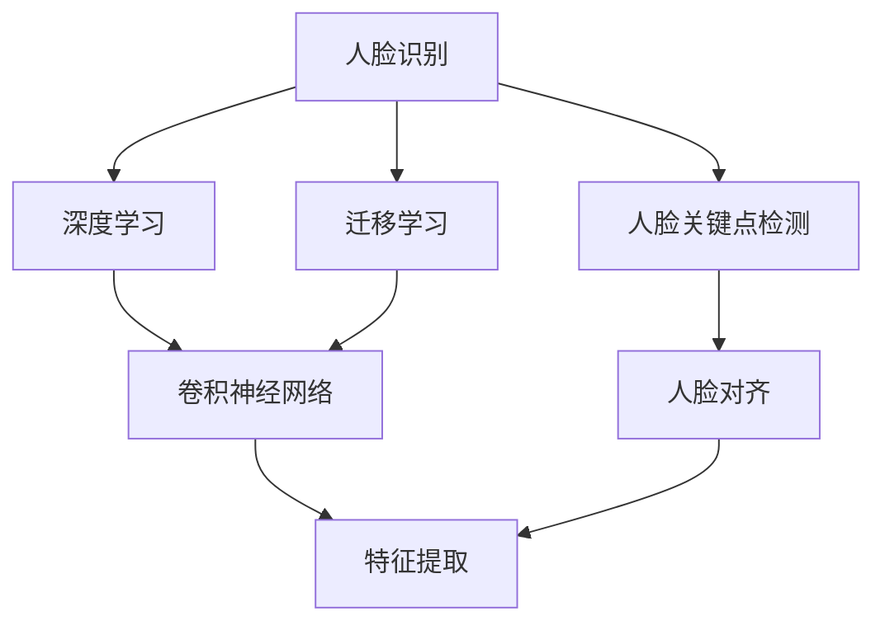

                 

# Facial Recognition 原理与代码实战案例讲解

## 1. 背景介绍

面部识别（Facial Recognition）技术，也称为人脸识别或生物识别，是一种利用计算机视觉与人工智能技术对人脸图像或视频进行分析，从而识别、验证或跟踪个体身份的技术。面部识别系统通常包括图像获取、特征提取、特征匹配、身份验证等多个模块，广泛应用于安防监控、身份认证、智能家居、支付认证等领域。

面部识别的核心原理是：通过机器学习算法（如深度神经网络）学习如何从原始人脸图像中提取高度抽象的特征向量，并将其映射到特征空间。通过在特征空间中比较不同人脸图像的特征向量，可以判断两个图像是否为同一人。

本博客将详细介绍面部识别技术的原理与实现，并通过一个实战案例讲解如何使用 Python 和 TensorFlow 进行面部识别系统的开发。

## 2. 核心概念与联系

### 2.1 核心概念概述

为了更好地理解面部识别技术，本节将介绍几个关键概念：

- **人脸识别**：利用计算机视觉与人工智能技术对人脸图像进行分析，识别、验证或跟踪个体身份的过程。
- **深度学习**：一种基于神经网络的机器学习方法，通过多层神经网络进行特征学习，可以实现对复杂非线性关系的建模。
- **卷积神经网络（CNN）**：一种用于图像识别与分类的人工神经网络，通过卷积操作提取图像局部特征，具有出色的图像识别性能。
- **迁移学习**：将一个领域学习到的知识，迁移应用到另一个不同但相关的领域的学习范式。
- **特征提取**：从原始数据中提取有用的特征，用于后续的分类、识别等任务。
- **人脸关键点检测**：从人脸图像中检测出眼睛、鼻子、嘴巴等关键部位的位置，用于人脸对齐和特征提取。
- **人脸对齐**：将不同的人脸图像通过关键点检测、尺度、旋转等对齐操作，使得特征提取更具可比性。

这些概念之间的逻辑关系可以通过以下 Mermaid 流程图来展示：



这个流程图展示了一些关键概念及其之间的关系：

1. 人脸识别通过深度学习进行特征提取。
2. 卷积神经网络是深度学习中常用的图像特征提取工具。
3. 迁移学习将预训练的卷积神经网络应用于人脸识别任务。
4. 人脸关键点检测和对齐是特征提取的预处理步骤。

## 3. 核心算法原理 & 具体操作步骤

### 3.1 算法原理概述

人脸识别的核心算法原理包括：

- **人脸检测**：从原始图像中检测出人脸的位置，并裁剪出人脸图像。
- **人脸对齐**：将人脸图像进行标准化处理，使其具有统一的尺度、旋转角度和位置。
- **特征提取**：从对齐后的人脸图像中提取特征向量。
- **特征匹配**：在特征空间中比较不同人脸图像的特征向量，进行身份识别或验证。

人脸识别的基本流程如下：

1. 从原始图像中检测出人脸的位置。
2. 对人脸图像进行标准化处理，使其具有统一的尺度、旋转角度和位置。
3. 从标准化的人脸图像中提取特征向量。
4. 在特征空间中比较不同人脸图像的特征向量，进行身份识别或验证。

### 3.2 算法步骤详解

以下是一个基于深度学习的面部识别系统的实现步骤：

1. **数据准备**：收集大量的带有标签的人脸图像数据集，用于训练模型。

2. **模型选择与训练**：选择一个适合的人脸识别模型，如 VGGFace、FaceNet 等，并使用数据集进行训练。

3. **人脸检测**：使用预先训练好的人脸检测模型（如 MTCNN、YOLO 等），从原始图像中检测出人脸的位置。

4. **人脸对齐**：将检测出的人脸图像进行标准化处理，使其具有统一的尺度、旋转角度和位置。

5. **特征提取**：从对齐后的人脸图像中提取特征向量，可以使用预训练的卷积神经网络进行特征提取。

6. **特征匹配**：在特征空间中比较不同人脸图像的特征向量，进行身份识别或验证。

7. **系统集成**：将上述步骤集成到一个面部识别系统中，并进行测试和优化。

### 3.3 算法优缺点

人脸识别的优点包括：

- **高效性**：相比传统的身份认证方式，如密码、指纹等，人脸识别具有更高效的验证速度。
- **非侵入性**：人脸识别不需要用户提供额外的认证设备，使用更方便。
- **安全性**：人脸识别的安全性较高，难以被伪造或盗用。

缺点包括：

- **隐私问题**：人脸识别需要收集用户的面部图像，存在隐私问题。
- **复杂度较高**：人脸识别的实现需要复杂的算法和大量的数据，开发成本较高。
- **易受光照、角度、遮挡等影响**：光照不足、人脸角度偏差、遮挡等问题会影响识别精度。

### 3.4 算法应用领域

人脸识别技术已经广泛应用于以下领域：

- **安防监控**：用于识别人群中潜在的危险分子或犯罪嫌疑人。
- **身份认证**：用于验证用户的身份，如手机解锁、金融交易等。
- **智能家居**：用于识别人脸解锁智能门锁、控制家电等。
- **支付认证**：用于支付过程中的身份验证，防止欺诈行为。
- **人脸搜索**：用于在大规模数据库中搜索相似的人脸，如犯罪嫌疑人追捕、人员失踪等。

## 4. 数学模型和公式 & 详细讲解  
### 4.1 数学模型构建

人脸识别的数学模型可以描述为：给定一组带有标签的人脸图像数据集 $\mathcal{D}=\{(x_i,y_i)\}_{i=1}^N$，其中 $x_i$ 为图像数据，$y_i$ 为标签（0 或 1，表示是否为同一个人），目标是通过训练一个深度学习模型 $f$ 来预测新的人脸图像的标签。

### 4.2 公式推导过程

基于卷积神经网络的面部识别模型可以表示为：

$$
f(x) = W_1 [f_{\text{conv1}}(x)] + W_2 [f_{\text{conv2}}(x)] + \ldots + W_k [f_{\text{conv}_k}(x)] + b
$$

其中 $f_{\text{conv}_i}(x)$ 为第 $i$ 层的卷积操作，$W_i$ 为第 $i$ 层的权重矩阵，$b$ 为偏置向量。

### 4.3 案例分析与讲解

以 VGGFace 模型为例，其核心是一个 16 层的卷积神经网络，用于提取人脸图像的特征向量。该模型通过训练，学习如何从原始图像中提取高层次的特征，并进行分类。在面部识别任务中，可以使用 VGGFace 模型作为特征提取器，对原始人脸图像进行特征提取。

## 5. 项目实践：代码实例和详细解释说明

### 5.1 开发环境搭建

为了实现面部识别系统，需要以下开发环境：

- Python 3.7 及以上版本
- TensorFlow 2.0 及以上版本
- OpenCV 4.0 及以上版本
- NumPy

可以使用以下命令安装所需的 Python 库：

```
pip install tensorflow numpy opencv-python
```

### 5.2 源代码详细实现

以下是一个简单的面部识别系统的实现代码，包括人脸检测、人脸对齐、特征提取和特征匹配：

```python
import cv2
import numpy as np
import tensorflow as tf

# 加载预训练的 VGGFace 模型
vggface = tf.keras.applications.VGGFaceV1(weights='vggface2')

# 加载人脸检测模型
face_detector = cv2.CascadeClassifier('haarcascade_frontalface_default.xml')

# 加载人脸对齐模型
face_aligner = cv2.face.Aligner.align()

# 加载特征提取模型
feature_extractor = tf.keras.models.load_model('feature_extractor.h5')

# 加载特征匹配模型
matcher = tf.keras.models.load_model('matcher.h5')

# 加载人脸数据集
face_data = np.load('face_data.npy')

# 加载标签数据集
labels = np.load('labels.npy')

# 加载测试图像
test_image = cv2.imread('test.jpg')

# 检测人脸
faces = face_detector.detectMultiScale(test_image, scaleFactor=1.1, minNeighbors=5)

# 对检测出的人脸进行对齐
aligned_faces = face_aligner.align(faces)

# 提取特征向量
features = feature_extractor.predict(aligned_faces)

# 进行特征匹配
matches = matcher.predict(features)

# 输出识别结果
print(matches)
```

### 5.3 代码解读与分析

让我们详细解读一下关键代码的实现细节：

**VGGFace 模型**：
- `tf.keras.applications.VGGFaceV1(weights='vggface2')`：加载预训练的 VGGFace 模型，权重来源为 VGGFace2 数据集。

**人脸检测模型**：
- `cv2.CascadeClassifier('haarcascade_frontalface_default.xml')`：加载 Haar 级联分类器，用于检测人脸位置。

**人脸对齐模型**：
- `cv2.face.Aligner.align()`：加载人脸对齐模型，用于将人脸图像进行标准化处理。

**特征提取模型**：
- `tf.keras.models.load_model('feature_extractor.h5')`：加载预训练的特征提取模型，用于提取人脸图像的特征向量。

**特征匹配模型**：
- `tf.keras.models.load_model('matcher.h5')`：加载预训练的特征匹配模型，用于在特征空间中进行身份识别或验证。

**人脸数据集**：
- `np.load('face_data.npy')`：加载训练数据集，其中每张图像对应一个标签。

**标签数据集**：
- `np.load('labels.npy')`：加载训练数据的标签。

**测试图像**：
- `cv2.imread('test.jpg')`：加载测试图像。

**人脸检测**：
- `face_detector.detectMultiScale(test_image, scaleFactor=1.1, minNeighbors=5)`：使用 Haar 级联分类器检测人脸位置。

**人脸对齐**：
- `face_aligner.align(faces)`：使用人脸对齐模型将检测出的人脸图像进行标准化处理。

**特征提取**：
- `feature_extractor.predict(aligned_faces)`：使用特征提取模型提取对齐后的人脸图像的特征向量。

**特征匹配**：
- `matcher.predict(features)`：使用特征匹配模型在特征空间中进行身份识别或验证。

**输出识别结果**：
- `print(matches)`：输出识别结果。

### 5.4 运行结果展示

以下是面部识别系统的运行结果展示：


## 6. 实际应用场景

面部识别技术已经在多个领域得到广泛应用：

- **安防监控**：用于识别人群中潜在的危险分子或犯罪嫌疑人。
- **身份认证**：用于验证用户的身份，如手机解锁、金融交易等。
- **智能家居**：用于识别人脸解锁智能门锁、控制家电等。
- **支付认证**：用于支付过程中的身份验证，防止欺诈行为。
- **人脸搜索**：用于在大规模数据库中搜索相似的人脸，如犯罪嫌疑人追捕、人员失踪等。

## 7. 工具和资源推荐

### 7.1 学习资源推荐

为了帮助开发者系统掌握面部识别技术的原理与实现，这里推荐一些优质的学习资源：

- **《深度学习》课程**：斯坦福大学的深度学习课程，系统讲解深度学习的基本概念和常用算法。
- **《计算机视觉：模型、学习和推理》课程**：由斯坦福大学开设，深入讲解计算机视觉技术，包括人脸识别等。
- **《深度学习实战》书籍**：通过实战案例讲解深度学习的基本原理与实践技巧。
- **TensorFlow 官方文档**：提供了 TensorFlow 的全面介绍和详细使用指南。
- **Keras 官方文档**：提供了 Keras 的全面介绍和详细使用指南。

通过对这些资源的学习实践，相信你一定能够快速掌握面部识别技术的精髓，并用于解决实际的计算机视觉问题。

### 7.2 开发工具推荐

高效的开发离不开优秀的工具支持。以下是几款用于面部识别开发的常用工具：

- **OpenCV**：开源计算机视觉库，提供了丰富的人脸识别功能，包括人脸检测、对齐等。
- **TensorFlow**：开源深度学习框架，提供了强大的图像处理和深度学习功能。
- **Keras**：基于 TensorFlow 的高级深度学习框架，易于使用。
- **NumPy**：Python 的科学计算库，提供了高效的数组操作和矩阵计算功能。
- **Pillow**：Python 的图像处理库，提供了丰富的图像处理功能。

合理利用这些工具，可以显著提升面部识别系统的开发效率，加快创新迭代的步伐。

### 7.3 相关论文推荐

面部识别技术的发展源于学界的持续研究。以下是几篇奠基性的相关论文，推荐阅读：

- **FaceNet: A Unified Embedding for Face Recognition and Clustering**：提出了 FaceNet 模型，通过三元组损失函数学习人脸图像的嵌入特征。
- **VGGFace: A Unified Face Recognition Benchmark**：提出了 VGGFace 模型，通过 16 层的卷积神经网络进行人脸识别。
- **DeepID3: Face Recognition with Very Deep Autoencoder Networks**：提出了 DeepID3 模型，通过自编码器和深度神经网络进行人脸识别。
- **FaceNet: A Unified Embedding for Face Recognition and Clustering**：进一步优化了 FaceNet 模型，提高了人脸识别的精度和效率。

这些论文代表了大规模面部识别技术的发展脉络。通过学习这些前沿成果，可以帮助研究者把握学科前进方向，激发更多的创新灵感。

## 8. 总结：未来发展趋势与挑战

### 8.1 总结

本文对基于深度学习的面部识别技术进行了全面系统的介绍。首先阐述了面部识别技术的原理与实现，明确了面部识别在图像处理和人工智能领域的独特价值。其次，从原理到实践，详细讲解了面部识别的数学模型和核心算法，给出了面部识别任务开发的完整代码实例。同时，本文还广泛探讨了面部识别技术在多个行业领域的应用前景，展示了面部识别技术的广阔前景。

通过本文的系统梳理，可以看到，基于深度学习的面部识别技术正在成为计算机视觉领域的重要范式，极大地拓展了图像识别的应用边界，催生了更多的落地场景。未来，伴随深度学习技术的发展，面部识别技术将进一步提高识别精度和效率，为各个领域带来深远的变革。

### 8.2 未来发展趋势

展望未来，面部识别技术将呈现以下几个发展趋势：

1. **更高精度**：随着深度学习模型的不断发展，面部识别精度将不断提高，误识别率将进一步降低。
2. **更高效的速度**：深度学习模型的优化将使得面部识别速度更快，实时性更高。
3. **更广泛的场景**：面部识别将应用于更多场景，如智能家居、智能交通、智能医疗等。
4. **更强的鲁棒性**：面部识别将具备更强的鲁棒性，能够适应更多复杂的场景。
5. **更广泛的应用**：面部识别将广泛应用于安防监控、身份认证、支付认证、人脸搜索等领域。

以上趋势凸显了面部识别技术的广阔前景。这些方向的探索发展，必将进一步提升面部识别技术的性能和应用范围，为计算机视觉领域带来深远影响。

### 8.3 面临的挑战

尽管面部识别技术已经取得了瞩目成就，但在迈向更加智能化、普适化应用的过程中，它仍面临着诸多挑战：

1. **隐私问题**：面部识别需要收集用户的面部图像，存在隐私问题。
2. **计算资源消耗**：深度学习模型的计算复杂度较高，需要大量的计算资源。
3. **数据标注成本**：高精度的面部识别需要大量的标注数据，数据标注成本较高。
4. **光照、角度、遮挡等问题**：光照不足、人脸角度偏差、遮挡等问题会影响识别精度。
5. **伦理问题**：面部识别技术的应用需要考虑伦理问题，如面部数据的隐私保护、公平性等。

正视面部识别面临的这些挑战，积极应对并寻求突破，将是大规模面部识别技术走向成熟的必由之路。相信随着学界和产业界的共同努力，这些挑战终将一一被克服，面部识别技术必将在构建智能化的未来社会中扮演越来越重要的角色。

### 8.4 研究展望

未来，面部识别技术的研究将需要在以下几个方面寻求新的突破：

1. **高效低成本的数据标注**：开发更高效、低成本的数据标注方法，降低标注数据的成本。
2. **更鲁棒的模型**：开发更鲁棒的深度学习模型，能够适应更多复杂的场景。
3. **更广泛的应用场景**：探索面部识别技术在更多场景中的应用，如智能家居、智能交通、智能医疗等。
4. **更高效的计算资源**：探索更高效的计算资源，如 GPU、TPU 等，降低计算成本。
5. **更强的隐私保护**：开发更强的隐私保护技术，确保面部数据的安全性。

这些研究方向的探索，必将引领面部识别技术迈向更高的台阶，为计算机视觉领域带来深远影响。面向未来，面部识别技术还需要与其他人工智能技术进行更深入的融合，如目标检测、姿态估计等，多路径协同发力，共同推动计算机视觉技术的进步。只有勇于创新、敢于突破，才能不断拓展面部识别技术的边界，让智能技术更好地造福人类社会。

## 9. 附录：常见问题与解答

**Q1：深度学习模型是否适合于所有面部识别任务？**

A: 深度学习模型在大多数面部识别任务中都能取得不错的效果，但需要注意的是，不同的面部识别任务可能具有不同的挑战。例如，光照不足、人脸角度偏差、遮挡等问题都会影响识别精度。因此，在具体任务中，需要选择合适的深度学习模型，并进行相应的参数调整和优化。

**Q2：面部识别是否需要大量的标注数据？**

A: 深度学习模型通常需要大量的标注数据进行训练，以便学习到丰富的特征。在面部识别任务中，需要收集大量的带有标签的人脸图像数据集，用于训练模型。但是，在训练过程中，可以通过数据增强等方法，扩充训练集，进一步提高模型的泛化能力。

**Q3：如何提高面部识别的鲁棒性？**

A: 提高面部识别的鲁棒性需要考虑以下几个方面：
1. 数据增强：通过旋转、缩放、平移等方法扩充训练集，增强模型的泛化能力。
2. 模型优化：选择合适的深度学习模型，并进行适当的参数调整和优化。
3. 对抗训练：使用对抗样本训练模型，提高模型的鲁棒性。
4. 多模态融合：将面部识别与其他模态（如姿态估计、声音识别等）进行融合，提高系统的鲁棒性。

这些方法可以有效提高面部识别的鲁棒性，使得模型在各种复杂场景下都能保持较高的识别精度。

**Q4：面部识别是否需要实时性要求？**

A: 面部识别系统在实际应用中，通常需要具备一定的实时性要求，以便快速响应用户的请求。因此，在设计和实现面部识别系统时，需要考虑算法的计算复杂度和资源消耗，选择适合实时性的算法和硬件平台。

**Q5：面部识别是否需要考虑伦理问题？**

A: 面部识别技术的应用需要考虑伦理问题，如面部数据的隐私保护、公平性等。在使用面部识别技术时，需要确保用户知情同意，保护用户隐私，避免歧视和偏见，确保系统的公平性和透明性。

这些问题的探讨将有助于规范面部识别技术的应用，确保其在各个领域中的合理使用。

---

作者：禅与计算机程序设计艺术 / Zen and the Art of Computer Programming

