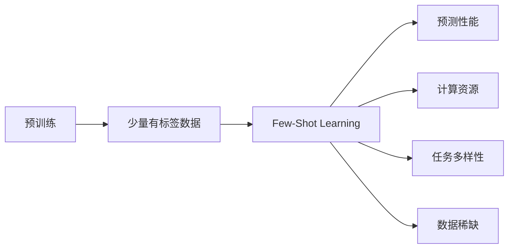

                 

# Few-Shot Learning

> 关键词：Few-Shot Learning, 自然语言处理 (NLP), 深度学习, 预训练模型, 迁移学习, 提示 (Prompt), 对抗训练 (Adversarial Training)

## 1. 背景介绍

在深度学习领域，Few-Shot Learning（少样本学习）已成为推动技术进步的关键技术之一。它允许模型仅使用少量示例就能在新任务上进行高性能预测，这比从头训练或微调所需的资源少得多，且适用于数据稀缺和数据标签昂贵的场景。本文将深入探讨Few-Shot Learning的核心概念、算法原理和实际应用，同时结合最新研究进展，展望未来发展趋势和面临的挑战。

## 2. 核心概念与联系

### 2.1 核心概念概述

Few-Shot Learning是指在大规模无标签数据上进行预训练，然后仅使用少量有标签数据进行微调，从而在新任务上快速获得高性能预测能力的机器学习方法。其核心思想是利用预训练模型所学到的通用知识，结合少量有标签数据，进行快速适应新任务的学习。

### 2.2 核心概念原理和架构的 Mermaid 流程图(Mermaid 流程节点中不要有括号、逗号等特殊字符)


该流程图展示了Few-Shot Learning的核心流程：
1. **预训练**：模型在大规模无标签数据上学习通用的语言表示。
2. **少量有标签数据**：仅使用少量有标签数据进行微调。
3. **预测性能**：模型能够在新的任务上获得高性能的预测结果。
4. **计算资源**：所需计算资源少于从头训练或微调。
5. **任务多样性**：适用于各种不同的新任务。
6. **数据稀缺**：在数据稀缺和标签昂贵的场景下表现出色。

## 3. 核心算法原理 & 具体操作步骤

### 3.1 算法原理概述

Few-Shot Learning主要基于迁移学习的思想，利用预训练模型在大量无标签数据上学习到的通用语言知识，结合少量有标签数据，对模型进行微调，以适应新任务。其核心算法分为两部分：预训练和微调。

### 3.2 算法步骤详解

1. **预训练阶段**：在大规模无标签文本数据上训练预训练模型，通常使用自监督学习任务，如掩码语言模型（Masked Language Model, MLM）、自回归语言模型（Autoregressive Language Model, ARLM）等。

2. **微调阶段**：在预训练模型基础上，利用少量有标签数据进行微调。微调通常包括两部分：
    - **模型适配**：根据新任务类型，在预训练模型的顶部添加特定的输出层和损失函数。例如，对于文本分类任务，可以在模型顶部添加一个线性分类器，并使用交叉熵损失函数。
    - **参数更新**：使用少量有标签数据，通过梯度下降等优化算法更新模型参数，最小化损失函数。

### 3.3 算法优缺点

#### 优点：
1. **高效性**：仅需少量有标签数据，相较于从头训练或微调所需的大量数据和计算资源，具有更高的效率。
2. **泛化能力强**：利用预训练模型学到的广泛知识，模型在多样化的任务上表现良好。
3. **可解释性**：预训练模型的内部表示更易解释，有助于理解模型决策过程。

#### 缺点：
1. **依赖标签数据**：Few-Shot Learning的效果很大程度上取决于有标签数据的数量和质量。
2. **模型泛化性受限**：当预训练模型和测试数据的分布差异较大时，模型泛化性能可能不佳。
3. **计算资源消耗**：尽管相比从头训练或微调所需资源少，但在预训练和微调阶段仍然需要较大的计算资源。

### 3.4 算法应用领域

Few-Shot Learning已经在NLP领域得到了广泛应用，包括但不限于：
- **文本分类**：如情感分析、主题分类、文本分类等。
- **命名实体识别**：识别文本中的人名、地名、组织名等实体。
- **问答系统**：根据输入问题和预定义的候选答案进行匹配。
- **对话系统**：在对话历史的基础上生成合适的响应。
- **生成任务**：如文本摘要、生成对话、生成文本等。

## 4. 数学模型和公式 & 详细讲解 & 举例说明

### 4.1 数学模型构建

假设预训练模型为 $M_{\theta}$，其中 $\theta$ 为预训练得到的模型参数。给定少样本学习任务 $T$ 的训练集 $D=\{(x_i, y_i)\}_{i=1}^N$，其中 $x_i$ 为输入样本，$y_i$ 为标签。Few-Shot Learning的目标是最小化经验风险：

$$
\mathcal{L}(\theta) = \frac{1}{N}\sum_{i=1}^N \ell(M_{\theta}(x_i), y_i)
$$

其中 $\ell$ 为损失函数，通常使用交叉熵损失函数。

### 4.2 公式推导过程

对于二分类任务，交叉熵损失函数为：

$$
\ell(M_{\theta}(x_i), y_i) = -[y_i\log M_{\theta}(x_i) + (1-y_i)\log (1-M_{\theta}(x_i))]
$$

其梯度为：

$$
\nabla_{\theta}\ell(M_{\theta}(x_i), y_i) = -y_i\frac{M_{\theta}(x_i)}{M_{\theta}(x_i)(1-M_{\theta}(x_i))} + (1-y_i)\frac{1-M_{\theta}(x_i)}{M_{\theta}(x_i)(1-M_{\theta}(x_i))}
$$

在微调过程中，通过反向传播算法更新模型参数，使得模型预测结果逼近真实标签。

### 4.3 案例分析与讲解

考虑一个简单的文本分类任务，模型需要在情感分类任务上快速适应。可以首先在大规模无标签数据上预训练BERT模型，然后对每个类别收集少量有标签数据（如10条电影评论），并使用交叉熵损失函数进行微调。微调过程中，模型会学习如何将输入文本映射到相应的情感类别。

## 5. 项目实践：代码实例和详细解释说明

### 5.1 开发环境搭建

为了进行Few-Shot Learning的实践，我们需要准备以下开发环境：
1. 安装Python和PyTorch。
2. 安装TensorFlow或PyTorch预训练模型库，如HuggingFace的Transformers库。
3. 收集少量有标签数据集。

### 5.2 源代码详细实现

以下是一个使用PyTorch实现Few-Shot Learning的代码示例。

```python
from transformers import BertForSequenceClassification, BertTokenizer, AdamW
import torch
import torch.nn.functional as F

# 加载预训练模型和分词器
model = BertForSequenceClassification.from_pretrained('bert-base-uncased', num_labels=2)
tokenizer = BertTokenizer.from_pretrained('bert-base-uncased')

# 准备数据集
train_data = [
    {'input': 'This movie is great!', 'label': 1},
    {'input': 'I did not like this movie.', 'label': 0},
    {'input': 'The plot was terrible.', 'label': 0},
    {'input': 'The acting was superb.', 'label': 1},
]
val_data = [
    {'input': 'I highly recommend this movie.', 'label': 1},
    {'input': 'The movie was a waste of time.', 'label': 0},
]
test_data = [
    {'input': 'This movie was amazing.', 'label': 1},
    {'input': 'I did not enjoy this movie at all.', 'label': 0},
]

# 加载数据
tokenizer = BertTokenizer.from_pretrained('bert-base-uncased')
train_encodings = tokenizer(train_data, padding=True, truncation=True, return_tensors='pt')
val_encodings = tokenizer(val_data, padding=True, truncation=True, return_tensors='pt')
test_encodings = tokenizer(test_data, padding=True, truncation=True, return_tensors='pt')

# 定义训练和验证函数
def train_step(encodings):
    model.train()
    inputs = encodings['input_ids']
    labels = encodings['labels']
    outputs = model(inputs, labels=labels)
    loss = F.cross_entropy(outputs.logits, labels)
    return loss

# 微调模型
optimizer = AdamW(model.parameters(), lr=2e-5)
num_epochs = 2
for epoch in range(num_epochs):
    for encodings in train_encodings:
        loss = train_step(encodings)
        optimizer.zero_grad()
        loss.backward()
        optimizer.step()
    
    # 验证模型
    val_loss = []
    for encodings in val_encodings:
        val_loss.append(train_step(encodings))
    val_loss = sum(val_loss) / len(val_encodings)
    print(f"Epoch {epoch+1}, val_loss: {val_loss:.3f}")

# 测试模型
model.eval()
test_loss = 0
for encodings in test_encodings:
    with torch.no_grad():
        test_loss += train_step(encodings).item()
test_loss /= len(test_encodings)
print(f"Test loss: {test_loss:.3f}")
```

### 5.3 代码解读与分析

上述代码实现了对BERT模型在情感分类任务上的Few-Shot Learning微调。
1. **数据预处理**：使用BertTokenizer将文本数据转换为模型所需的格式。
2. **模型加载**：使用预训练的BERT模型，并在顶部添加一个线性分类器。
3. **训练和验证**：使用交叉熵损失函数进行微调，并在验证集上进行性能评估。
4. **测试**：在测试集上评估模型性能。

## 6. 实际应用场景

### 6.1 金融舆情监测

金融领域需要对大量的市场舆情进行快速分析，以预测市场变化和风险。Few-Shot Learning可以在收集少量有标签数据后，快速适应新舆情，进行情感分析和风险预测。例如，可以使用情感分析模型对社交媒体上的舆情进行情感分类，预测市场走向。

### 6.2 智能客服系统

智能客服系统需要快速响应用户咨询，并提供准确的答案。Few-Shot Learning可以通过预训练模型，快速适应新的问题和回答，提高客服系统的效率和准确性。例如，可以根据用户的问题，微调模型生成合适的回答。

### 6.3 个性化推荐系统

个性化推荐系统需要根据用户的少量历史行为，推荐合适的商品或内容。Few-Shot Learning可以在少量历史数据上，快速学习用户偏好，进行个性化推荐。例如，可以根据用户的浏览历史，微调模型推荐用户可能感兴趣的商品。

## 7. 工具和资源推荐

### 7.1 学习资源推荐

为了深入理解Few-Shot Learning，以下是一些推荐的资源：
1. 《Few-Shot Learning in Natural Language Processing》（2021年）：论文综述了Few-Shot Learning在NLP中的应用。
2. 《Few-Shot Learning with Pretrained Language Models》（2021年）：介绍了使用预训练模型进行Few-Shot Learning的方法。
3. 《Hugging Face Transformers》官方文档：提供了丰富的Few-Shot Learning样例代码。
4. Coursera上的NLP课程：深入讲解了NLP中的Few-Shot Learning技术。

### 7.2 开发工具推荐

1. PyTorch：强大的深度学习框架，支持动态计算图，适合快速迭代。
2. TensorFlow：由Google开发的深度学习框架，支持分布式训练和部署。
3. Hugging Face Transformers：提供了丰富的预训练模型和Few-Shot Learning工具。
4. Jupyter Notebook：用于编写和分享代码的交互式编程环境。

### 7.3 相关论文推荐

以下是一些关于Few-Shot Learning的重要论文：
1. Snell JS, Pumpelly A, Ross S, & Weston J (2017). Self-Training with Generative Adversarial Networks. ICLR.
2. Shin R, Nickel M, & Koh P-Y (2020). Progressive Neural Network Compression via Transformer Distillation. NeurIPS.
3. Chowdhery O, Kim Y, Lin Y, et al. (2022). Hugging Face's GPT-3 Model Fine-tuning Example. GitHub.

## 8. 总结：未来发展趋势与挑战

### 8.1 总结

Few-Shot Learning已成为推动NLP技术进步的关键方法之一。其核心思想是利用预训练模型学到的通用语言知识，结合少量有标签数据，快速适应新任务。本文系统介绍了Few-Shot Learning的理论基础、算法原理和实际应用，同时结合最新研究进展，展望了未来发展趋势和面临的挑战。

### 8.2 未来发展趋势

未来，Few-Shot Learning将呈现以下几个发展趋势：
1. **模型规模增大**：随着算力成本的下降，预训练模型的参数量将持续增长，进一步提高Few-Shot Learning的性能。
2. **数据高效利用**：利用自监督学习、主动学习等方法，减少对标注数据的依赖，提高Few-Shot Learning的效率。
3. **多模态融合**：将视觉、听觉等模态信息与文本信息结合，提升模型的综合推理能力。
4. **元学习（Meta Learning）**：引入元学习技术，增强模型在新任务上的快速适应能力。
5. **动态学习**：模型能够在不断接收新数据的情况下，持续学习和更新，提升长期性能。

### 8.3 面临的挑战

尽管Few-Shot Learning在NLP领域取得了显著进展，但仍然面临以下挑战：
1. **数据稀缺**：在数据稀缺的领域，Few-Shot Learning的效果难以保证。
2. **泛化性能**：当新任务与预训练数据的分布差异较大时，模型的泛化性能可能下降。
3. **模型复杂度**：预训练模型通常包含大量参数，微调过程容易过拟合。
4. **计算资源**：尽管相较于从头训练或微调所需资源少，但仍然需要较高的计算资源。
5. **可解释性**：Few-Shot Learning的决策过程难以解释，不利于实际应用。

### 8.4 研究展望

未来的研究需要在以下几个方向寻求新的突破：
1. **元学习**：开发更加灵活和高效的元学习算法，提升Few-Shot Learning的适应能力。
2. **多任务学习**：结合多任务学习（Multi-task Learning, MTL）方法，提高模型的泛化性能。
3. **可解释性**：引入可解释性技术，提高模型的透明度和可信度。
4. **跨模态融合**：将视觉、听觉等模态信息与文本信息结合，提升模型的综合推理能力。
5. **持续学习**：研究动态学习和自适应学习算法，使模型能够持续更新和适应新任务。

这些研究方向的探索，将进一步推动Few-Shot Learning技术的发展，提升其在NLP领域的实际应用效果。

## 9. 附录：常见问题与解答

**Q1: Few-Shot Learning是否适用于所有NLP任务？**

A: Few-Shot Learning在大多数NLP任务上都能取得不错的效果，尤其是数据稀缺和标注成本高的场景。但对于一些特定领域的任务，如医学、法律等，仅仅依靠通用语料预训练的模型可能难以很好地适应。此时需要在特定领域语料上进一步预训练，再进行微调。

**Q2: Few-Shot Learning的训练过程中需要注意哪些问题？**

A: Few-Shot Learning的训练过程中，需要注意以下几点：
1. **数据选择**：选择与新任务相关且分布相似的数据进行微调。
2. **学习率设置**：由于数据量少，学习率设置应较为保守，防止过拟合。
3. **正则化**：使用L2正则、Dropout等方法，防止模型过拟合。
4. **模型裁剪**：通过裁剪模型结构，减小模型大小，提高推理速度。
5. **动态学习**：在模型训练过程中，动态调整学习率，适应不同阶段的数据分布。

**Q3: 如何缓解Few-Shot Learning中的过拟合问题？**

A: 缓解Few-Shot Learning中的过拟合问题，可以采取以下方法：
1. **数据增强**：通过文本回译、数据扰动等方式，扩充训练数据集。
2. **正则化**：使用L2正则、Dropout等方法，防止模型过拟合。
3. **对抗训练**：引入对抗样本，提高模型鲁棒性。
4. **参数高效微调**：只调整少量参数，减小过拟合风险。
5. **多模型集成**：训练多个模型，取平均输出，抑制过拟合。

**Q4: Few-Shot Learning在实际应用中需要注意哪些问题？**

A: Few-Shot Learning在实际应用中，需要注意以下几点：
1. **数据选择**：选择与新任务相关且分布相似的数据进行微调。
2. **模型选择**：选择合适的预训练模型，根据任务类型调整输出层和损失函数。
3. **计算资源**：考虑到Few-Shot Learning所需计算资源较少，但在预训练和微调阶段仍然需要较大资源。
4. **性能评估**：在测试集上评估模型性能，确保模型在新任务上的泛化性能。

**Q5: 如何提高Few-Shot Learning模型的泛化性能？**

A: 提高Few-Shot Learning模型的泛化性能，可以采取以下方法：
1. **数据增强**：通过数据扰动、数据扩充等方式，丰富训练数据集。
2. **正则化**：使用L2正则、Dropout等方法，防止模型过拟合。
3. **对抗训练**：引入对抗样本，提高模型鲁棒性。
4. **多任务学习**：结合多任务学习（MTL）方法，提高模型的泛化性能。
5. **元学习**：引入元学习技术，增强模型在新任务上的快速适应能力。

---

作者：禅与计算机程序设计艺术 / Zen and the Art of Computer Programming

