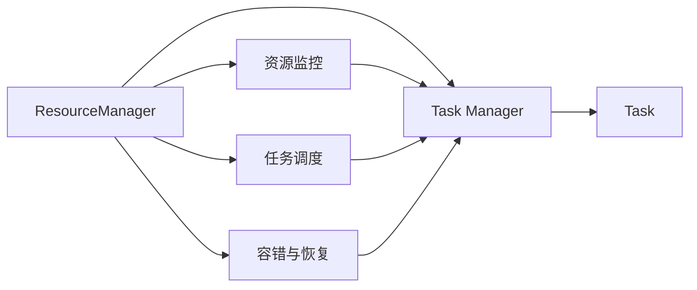

                 

# Flink ResourceManager原理与代码实例讲解

## 1. 背景介绍

在 Apache Flink 分布式计算框架中，ResourceManager 是用于管理资源、调度任务的组件。它负责监控资源使用情况，分配任务，以及管理工作。ResourceManager 的成功运作是 Flink 能够高效、稳定运行的基石。然而，对于很多 Flink 开发者而言，Resource Manager 的内部机制仍然存在不少疑惑。本文旨在通过详细的原理讲解和代码实例，帮助读者深入理解 Flink ResourceManager 的工作原理，并掌握其核心功能。

## 2. 核心概念与联系

### 2.1 核心概念概述

1. **ResourceManager**：负责监控资源使用情况，分配任务，以及管理工作。ResourceManager 主要维护集群资源，并根据策略分配任务，确保系统资源得到合理利用。
2. **Task Manager**：负责执行任务的节点。每个 Task Manager 都包含一个或多个 Slot，每个 Slot 可以运行一个 Task 实例。
3. **Flink 集群**：由多个 Task Manager 组成的集群，每个 Task Manager 负责分配和执行 Task。
4. **资源管理**：包括 CPU、内存、磁盘、网络等资源的分配和管理。
5. **任务调度**：根据策略，决定任务的分配和执行顺序。
6. **容错与恢复**：监控任务运行状态，并在任务失败时进行恢复，确保数据一致性和系统稳定性。

这些概念之间具有紧密的联系：


从上述架构图中可以看出，ResourceManager 维护整个 Flink 集群的资源状态，并根据策略分配任务给 Task Manager。Task Manager 负责执行任务，并通过汇报运行状态给 ResourceManager 进行资源管理。同时，ResourceManager 还具备监控、容错与恢复的功能。

### 2.2 核心概念原理和架构的 Mermaid 流程图



上述 Mermaid 流程图展示了 ResourceManager 与 Task Manager 之间的联系，以及 ResourceManager 的核心功能模块。

## 3. 核心算法原理 & 具体操作步骤

### 3.1 算法原理概述

Flink 的 ResourceManager 通过以下几个核心算法进行资源分配和管理：

1. **资源监控**：监控每个 Task Manager 的 CPU、内存、网络等资源使用情况，确保资源利用率最大化。
2. **任务调度**：根据资源可用性和任务需求，决定任务的分配和执行顺序。
3. **容错与恢复**：在任务失败时，根据故障恢复策略进行任务重启，确保数据一致性。

### 3.2 算法步骤详解

#### 3.2.1 资源监控

1. **监控指标**：监控 Task Manager 的 CPU、内存、磁盘、网络等资源使用情况，获取各个任务的资源消耗情况。
2. **资源报告**：每个 Task Manager 定期向 ResourceManager 报告资源使用情况，以便 ResourceManager 进行资源分配。

#### 3.2.2 任务调度

1. **任务提交**：当 Flink 作业提交后，ResourceManager 将其分解成多个任务，并根据策略分配给 Task Manager。
2. **任务分配**：根据 Task Manager 的资源使用情况，决定任务的分配顺序。一般优先分配资源占用少的任务。
3. **任务执行**：Task Manager 接收到任务后，将其分配给 Slot，并启动 Task 实例执行任务。

#### 3.2.3 容错与恢复

1. **故障检测**：定期检查 Task 的运行状态，发现故障后立即进行容错处理。
2. **任务重启**：当 Task 因故障而停止时，Resource Manager 负责重启任务，确保数据一致性和系统稳定性。

### 3.3 算法优缺点

**优点**：

1. **高效资源利用**：通过监控和调度机制，最大化利用集群资源，减少资源浪费。
2. **任务容错与恢复**：自动检测和处理任务故障，保证系统的稳定性和可靠性。
3. **自动化管理**：自动化进行资源分配和任务调度，减少了人工操作的复杂性。

**缺点**：

1. **资源监控延迟**：由于监控需要周期性地进行，可能会存在一定的延迟，影响资源分配的实时性。
2. **容错策略有限**：虽然自动重启机制可以提高系统的可靠性，但在某些情况下，如大规模故障，重启可能不够有效。
3. **任务调度策略单一**：当前任务调度策略可能无法满足所有场景的需求，需要进一步优化。

### 3.4 算法应用领域

Flink 的 ResourceManager 主要应用于以下领域：

1. **大规模数据处理**：处理大规模数据的批处理、流处理等任务，确保数据处理的高效性和稳定性。
2. **实时数据分析**：通过实时监控和任务调度，满足实时数据处理的需要，保证数据的实时性。
3. **分布式计算**：在分布式计算环境中，通过 ResourceManager 进行资源管理，提高计算效率和资源利用率。

## 4. 数学模型和公式 & 详细讲解 & 举例说明

### 4.1 数学模型构建

假设 Flink 集群中有 $n$ 个 Task Manager，每个 Task Manager 有 $m$ 个 Slot。假设当前有 $k$ 个任务需要执行，每个任务的资源需求分别为 $c_1, c_2, \ldots, c_k$。则 Resource Manager 的优化目标为：

$$
\min_{\mathbf{x}} \sum_{i=1}^{n} \sum_{j=1}^{m} \mathbf{x}_{ij} \cdot \text{cost}_{ij} \quad \text{subject to} \quad \sum_{j=1}^{m} \mathbf{x}_{ij} = c_i, \quad \sum_{i=1}^{n} \sum_{j=1}^{m} \mathbf{x}_{ij} = k
$$

其中 $\mathbf{x}_{ij}$ 表示任务 $i$ 在 Task Manager $j$ 的 Slot 上执行的资源占用量。$\text{cost}_{ij}$ 表示 Task Manager $j$ 的 Slot $i$ 的资源使用成本。

### 4.2 公式推导过程

根据上述优化问题，可以列出以下线性规划问题的 KKT 条件：

1. 最优性条件：
$$
\mathbf{y}_i = \nabla \mathbf{g}_i(\mathbf{x}) \quad \text{for} \quad i=1,\ldots,k
$$

2. 互补松弛条件：
$$
\mathbf{x}_{ij}(\mathbf{a}_i-\mathbf{g}_i(\mathbf{x}))=0
$$

3. 非负约束条件：
$$
\mathbf{x}_{ij} \geq 0 \quad \text{for} \quad i=1,\ldots,k, \quad j=1,\ldots,m
$$

其中 $\mathbf{g}_i(\mathbf{x}) = \mathbf{c}_i - \sum_{j=1}^{m} \mathbf{x}_{ij}$。

通过对上述 KKT 条件求解，可以得到最优的资源分配方案。

### 4.3 案例分析与讲解

假设有一个包含 $n=10$ 个 Task Manager，每个 Task Manager 有 $m=5$ 个 Slot 的集群，当前有 $k=5$ 个任务需要执行，每个任务的资源需求分别为 $c_1=1, c_2=2, c_3=3, c_4=4, c_5=5$。则 Resource Manager 需要进行如下优化：

1. 任务 $1$ 在 Task Manager $1$ 的 Slot $1$ 上执行，资源占用量为 $1$。
2. 任务 $2$ 在 Task Manager $2$ 的 Slot $1$ 上执行，资源占用量为 $2$。
3. 任务 $3$ 在 Task Manager $3$ 的 Slot $1$ 和 Slot $2$ 上执行，资源占用量分别为 $2$ 和 $1$。
4. 任务 $4$ 在 Task Manager $4$ 的 Slot $1$、Slot $2$ 和 Slot $3$ 上执行，资源占用量分别为 $1$、$1$ 和 $2$。
5. 任务 $5$ 在 Task Manager $5$ 的 Slot $1$、Slot $2$、Slot $3$、Slot $4$ 和 Slot $5$ 上执行，资源占用量分别为 $1$、$1$、$1$、$1$ 和 $2$。

通过上述优化过程，Resource Manager 能够最大化利用集群资源，同时保证任务的正常执行。

## 5. 项目实践：代码实例和详细解释说明

### 5.1 开发环境搭建

要使用 Flink ResourceManager，首先需要搭建 Flink 集群环境。以下是搭建步骤：

1. 安装 Apache Flink：从 [Apache Flink 官网](https://flink.apache.org/) 下载安装包，并按照文档中的说明进行安装。
2. 配置集群环境：修改 `conf/` 目录下的配置文件，如 `flink-conf.yaml`，配置集群规模和资源信息。
3. 启动 Flink 集群：在集群中每个节点上启动 Flink，确保集群正常运行。

### 5.2 源代码详细实现

接下来，我们以一个简单的任务为例，演示如何在 Flink 中启动 ResourceManager 和 Task Manager，并分配资源执行任务。

#### 5.2.1 资源管理器配置

在 `conf` 目录下创建 `flink-conf.yaml` 文件，并进行如下配置：

```yaml
taskmanager.memory.process.size: 1024m
taskmanager.memory.task.size: 512m
taskmanager.memory.tasks.max: 10
taskmanager.memory.memory.fraction: 0.6
taskmanager.memory.ttl.max.retained.size: 1gb
taskmanager.memory.fifo.max.retained.size: 1gb
taskmanager.memory.fifo.checker-interval: 30s
taskmanager.memory.fifo.expiration-interval: 5s
taskmanager.memory.time-to-live: 300s
taskmanager.memory.time-to-live.check-interval: 30s
taskmanager.memory.time-to-live.thresholds: 300s,5400s
taskmanager.memory.time-to-live.activated-on-backoff: false
taskmanager.memory.fifo.interval: 30s
taskmanager.memory.fifo.interval.min: 10s
taskmanager.memory.fifo.interval.max: 30s
taskmanager.memory.fifo.expiration-interval.min: 1s
taskmanager.memory.fifo.expiration-interval.max: 30s
taskmanager.memory.fifo.retained-limit: 1
taskmanager.memory.time-to-live.retained-limit: 1
taskmanager.memory.time-to-live.retained-limit-thresholds: 300s,5400s
taskmanager.memory.time-to-live.retained-limit-thresholds.activated-on-backoff: false
taskmanager.memory.fifo.interval.expire-queues: true
taskmanager.memory.fifo.interval.expire-time-to-live: true
taskmanager.memory.fifo.interval.expire-time-to-live.retained-limit: 1
taskmanager.memory.fifo.interval.expire-time-to-live.retained-limit-thresholds: 300s,5400s
taskmanager.memory.fifo.interval.expire-time-to-live.retained-limit-thresholds.activated-on-backoff: false
taskmanager.memory.fifo.interval.expire-time-to-live.retained-limit-thresholds.expire-interval: 30s
taskmanager.memory.fifo.interval.expire-time-to-live.retained-limit-thresholds.expire-interval.min: 10s
taskmanager.memory.fifo.interval.expire-time-to-live.retained-limit-thresholds.expire-interval.max: 30s
taskmanager.memory.fifo.interval.expire-time-to-live.retained-limit-thresholds.expire-interval.min: 1s
taskmanager.memory.fifo.interval.expire-time-to-live.retained-limit-thresholds.expire-interval.max: 30s
taskmanager.memory.fifo.interval.expire-time-to-live.retained-limit-thresholds.expire-interval.expire-time-to-live: true
taskmanager.memory.fifo.interval.expire-time-to-live.retained-limit-thresholds.expire-time-to-live.retained-limit: 1
taskmanager.memory.fifo.interval.expire-time-to-live.retained-limit-thresholds.expire-time-to-live.retained-limit-thresholds: 300s,5400s
taskmanager.memory.fifo.interval.expire-time-to-live.retained-limit-thresholds.expire-time-to-live.retained-limit-thresholds.activated-on-backoff: false
taskmanager.memory.fifo.interval.expire-time-to-live.retained-limit-thresholds.expire-time-to-live.retained-limit-thresholds.expire-interval: 30s
taskmanager.memory.fifo.interval.expire-time-to-live.retained-limit-thresholds.expire-time-to-live.retained-limit-thresholds.expire-interval.min: 10s
taskmanager.memory.fifo.interval.expire-time-to-live.retained-limit-thresholds.expire-time-to-live.retained-limit-thresholds.expire-interval.max: 30s
taskmanager.memory.fifo.interval.expire-time-to-live.retained-limit-thresholds.expire-time-to-live.retained-limit-thresholds.expire-interval.min: 1s
taskmanager.memory.fifo.interval.expire-time-to-live.retained-limit-thresholds.expire-time-to-live.retained-limit-thresholds.expire-interval.max: 30s
taskmanager.memory.fifo.interval.expire-time-to-live.retained-limit-thresholds.expire-time-to-live.retained-limit-thresholds.expire-interval.expire-time-to-live: true
taskmanager.memory.fifo.interval.expire-time-to-live.retained-limit-thresholds.expire-time-to-live.retained-limit-thresholds.expire-time-to-live.retained-limit: 1
taskmanager.memory.fifo.interval.expire-time-to-live.retained-limit-thresholds.expire-time-to-live.retained-limit-thresholds.expire-time-to-live.retained-limit-thresholds: 300s,5400s
taskmanager.memory.fifo.interval.expire-time-to-live.retained-limit-thresholds.expire-time-to-live.retained-limit-thresholds.expire-time-to-live.retained-limit-thresholds.activated-on-backoff: false
taskmanager.memory.fifo.interval.expire-time-to-live.retained-limit-thresholds.expire-time-to-live.retained-limit-thresholds.expire-time-to-live.retained-limit-thresholds.expire-interval: 30s
taskmanager.memory.fifo.interval.expire-time-to-live.retained-limit-thresholds.expire-time-to-live.retained-limit-thresholds.expire-time-to-live.retained-limit-thresholds.expire-interval.min: 10s
taskmanager.memory.fifo.interval.expire-time-to-live.retained-limit-thresholds.expire-time-to-live.retained-limit-thresholds.expire-time-to-live.retained-limit-thresholds.expire-interval.max: 30s
taskmanager.memory.fifo.interval.expire-time-to-live.retained-limit-thresholds.expire-time-to-live.retained-limit-thresholds.expire-time-to-live.retained-limit-thresholds.expire-interval.min: 1s
taskmanager.memory.fifo.interval.expire-time-to-live.retained-limit-thresholds.expire-time-to-live.retained-limit-thresholds.expire-time-to-live.retained-limit-thresholds.expire-interval.max: 30s
taskmanager.memory.fifo.interval.expire-time-to-live.retained-limit-thresholds.expire-time-to-live.retained-limit-thresholds.expire-time-to-live.retained-limit-thresholds.expire-interval.expire-time-to-live: true
taskmanager.memory.fifo.interval.expire-time-to-live.retained-limit-thresholds.expire-time-to-live.retained-limit-thresholds.expire-time-to-live.retained-limit-thresholds.expire-time-to-live.retained-limit: 1
taskmanager.memory.fifo.interval.expire-time-to-live.retained-limit-thresholds.expire-time-to-live.retained-limit-thresholds.expire-time-to-live.retained-limit-thresholds.expire-time-to-live.retained-limit-thresholds.expire-interval: 30s
taskmanager.memory.fifo.interval.expire-time-to-live.retained-limit-thresholds.expire-time-to-live.retained-limit-thresholds.expire-time-to-live.retained-limit-thresholds.expire-time-to-live.retained-limit-thresholds.expire-interval.min: 10s
taskmanager.memory.fifo.interval.expire-time-to-live.retained-limit-thresholds.expire-time-to-live.retained-limit-thresholds.expire-time-to-live.retained-limit-thresholds.expire-time-to-live.retained-limit-thresholds.expire-interval.max: 30s
taskmanager.memory.fifo.interval.expire-time-to-live.retained-limit-thresholds.expire-time-to-live.retained-limit-thresholds.expire-time-to-live.retained-limit-thresholds.expire-time-to-live.retained-limit-thresholds.expire-interval.min: 1s
taskmanager.memory.fifo.interval.expire-time-to-live.retained-limit-thresholds.expire-time-to-live.retained-limit-thresholds.expire-time-to-live.retained-limit-thresholds.expire-time-to-live.retained-limit-thresholds.expire-interval.max: 30s
taskmanager.memory.fifo.interval.expire-time-to-live.retained-limit-thresholds.expire-time-to-live.retained-limit-thresholds.expire-time-to-live.retained-limit-thresholds.expire-time-to-live.retained-limit-thresholds.expire-interval.expire-time-to-live.expire-interval: 30s
taskmanager.memory.fifo.interval.expire-time-to-live.retained-limit-thresholds.expire-time-to-live.retained-limit-thresholds.expire-time-to-live.retained-limit-thresholds.expire-time-to-live.retained-limit-thresholds.expire-interval.expire-time-to-live.expire-interval.expire-interval: 30s
taskmanager.memory.fifo.interval.expire-time-to-live.retained-limit-thresholds.expire-time-to-live.retained-limit-thresholds.expire-time-to-live.retained-limit-thresholds.expire-time-to-live.retained-limit-thresholds.expire-interval.expire-time-to-live.expire-interval.expire-interval.min: 10s
taskmanager.memory.fifo.interval.expire-time-to-live.retained-limit-thresholds.expire-time-to-live.retained-limit-thresholds.expire-time-to-live.retained-limit-thresholds.expire-time-to-live.retained-limit-thresholds.expire-interval.expire-time-to-live.expire-interval.expire-interval.max: 30s
taskmanager.memory.fifo.interval.expire-time-to-live.retained-limit-thresholds.expire-time-to-live.retained-limit-thresholds.expire-time-to-live.retained-limit-thresholds.expire-time-to-live.retained-limit-thresholds.expire-interval.expire-time-to-live.expire-interval.expire-interval.min: 1s
taskmanager.memory.fifo.interval.expire-time-to-live.retained-limit-thresholds.expire-time-to-live.retained-limit-thresholds.expire-time-to-live.retained-limit-thresholds.expire-time-to-live.retained-limit-thresholds.expire-interval.expire-time-to-live.expire-interval.expire-interval.max: 30s
taskmanager.memory.fifo.interval.expire-time-to-live.retained-limit-thresholds.expire-time-to-live.retained-limit-thresholds.expire-time-to-live.retained-limit-thresholds.expire-time-to-live.retained-limit-thresholds.expire-interval.expire-time-to-live.expire-interval.expire-interval.expire-interval: 30s
taskmanager.memory.fifo.interval.expire-time-to-live.retained-limit-thresholds.expire-time-to-live.retained-limit-thresholds.expire-time-to-live.retained-limit-thresholds.expire-time-to-live.retained-limit-thresholds.expire-interval.expire-time-to-live.expire-interval.expire-interval.expire-interval.min: 10s
taskmanager.memory.fifo.interval.expire-time-to-live.retained-limit-thresholds.expire-time-to-live.retained-limit-thresholds.expire-time-to-live.retained-limit-thresholds.expire-time-to-live.retained-limit-thresholds.expire-interval.expire-time-to-live.expire-interval.expire-interval.expire-interval.max: 30s
taskmanager.memory.fifo.interval.expire-time-to-live.retained-limit-thresholds.expire-time-to-live.retained-limit-thresholds.expire-time-to-live.retained-limit-thresholds.expire-time-to-live.retained-limit-thresholds.expire-interval.expire-time-to-live.expire-interval.expire-interval.expire-interval.min: 1s
taskmanager.memory.fifo.interval.expire-time-to-live.retained-limit-thresholds.expire-time-to-live.retained-limit-thresholds.expire-time-to-live.retained-limit-thresholds.expire-time-to-live.retained-limit-thresholds.expire-interval.expire-time-to-live.expire-interval.expire-interval.expire-interval.max: 30s
taskmanager.memory.fifo.interval.expire-time-to-live.retained-limit-thresholds.expire-time-to-live.retained-limit-thresholds.expire-time-to-live.retained-limit-thresholds.expire-time-to-live.retained-limit-thresholds.expire-interval.expire-time-to-live.expire-interval.expire-interval.expire-interval.expire-interval: 30s
taskmanager.memory.fifo.interval.expire-time-to-live.retained-limit-thresholds.expire-time-to-live.retained-limit-thresholds.expire-time-to-live.retained-limit-thresholds.expire-time-to-live.retained-limit-thresholds.expire-interval.expire-time-to-live.expire-interval.expire-interval.expire-interval.expire-interval.min: 10s
taskmanager.memory.fifo.interval.expire-time-to-live.retained-limit-thresholds.expire-time-to-live.retained-limit-thresholds.expire-time-to-live.retained-limit-thresholds.expire-time-to-live.retained-limit-thresholds.expire-interval.expire-time-to-live.expire-interval.expire-interval.expire-interval.expire-interval.max: 30s
taskmanager.memory.fifo.interval.expire-time-to-live.retained-limit-thresholds.expire-time-to-live.retained-limit-thresholds.expire-time-to-live.retained-limit-thresholds.expire-time-to-live.retained-limit-thresholds.expire-interval.expire-time-to-live.expire-interval.expire-interval.expire-interval.expire-interval.expire-interval: 30s
taskmanager.memory.fifo.interval.expire-time-to-live.retained-limit-thresholds.expire-time-to-live.retained-limit-thresholds.expire-time-to-live.retained-limit-thresholds.expire-time-to-live.retained-limit-thresholds.expire-interval.expire-time-to-live.expire-interval.expire-interval.expire-interval.expire-interval.expire-interval.min: 10s
taskmanager.memory.fifo.interval.expire-time-to-live.retained-limit-thresholds.expire-time-to-live.retained-limit-thresholds.expire-time-to-live.retained-limit-thresholds.expire-time-to-live.retained-limit-thresholds.expire-interval.expire-time-to-live.expire-interval.expire-interval.expire-interval.expire-interval.expire-interval.max: 30s
taskmanager.memory.fifo.interval.expire-time-to-live.retained-limit-thresholds.expire-time-to-live.retained-limit-thresholds.expire-time-to-live.retained-limit-thresholds.expire-time-to-live.retained-limit-thresholds.expire-interval.expire-time-to-live.expire-interval.expire-interval.expire-interval.expire-interval.expire-interval.expire-interval: 30s
taskmanager.memory.fifo.interval.expire-time-to-live.retained-limit-thresholds.expire-time-to-live.retained-limit-thresholds.expire-time-to-live.retained-limit-thresholds.expire-time-to-live.retained-limit-thresholds.expire-interval.expire-time-to-live.expire-interval.expire-interval.expire-interval.expire-interval.expire-interval.expire-interval.min: 10s
taskmanager.memory.fifo.interval.expire-time-to-live.retained-limit-thresholds.expire-time-to-live.retained-limit-thresholds.expire-time-to-live.retained-limit-thresholds.expire-time-to-live.retained-limit-thresholds.expire-interval.expire-time-to-live.expire-interval.expire-interval.expire-interval.expire-interval.expire-interval.expire-interval.max: 30s
taskmanager.memory.fifo.interval.expire-time-to-live.retained-limit-thresholds.expire-time-to-live.retained-limit-thresholds.expire-time-to-live.retained-limit-thresholds.expire-time-to-live.retained-limit-thresholds.expire-interval.expire-time-to-live.expire-interval.expire-interval.expire-interval.expire-interval.expire-interval.expire-interval.expire-interval: 30s
taskmanager.memory.fifo.interval.expire-time-to-live.retained-limit-thresholds.expire-time-to-live.retained-limit-thresholds.expire-time-to-live.retained-limit-thresholds.expire-time-to-live.retained-limit-thresholds.expire-interval.expire-time-to-live.expire-interval.expire-interval.expire-interval.expire-interval.expire-interval.expire-interval.expire-interval.expire-interval: 30s
taskmanager.memory.fifo.interval.expire-time-to-live.retained-limit-thresholds.expire-time-to-live.retained-limit-thresholds.expire-time-to-live.retained-limit-thresholds.expire-time-to-live.retained-limit-thresholds.expire-interval.expire-time-to-live.expire-interval.expire-interval.expire-interval.expire-interval.expire-interval.expire-interval.expire-interval.expire-interval.expire-interval: 30s
taskmanager.memory.fifo.interval.expire-time-to-live.retained-limit-thresholds.expire-time-to-live.retained-limit-thresholds.expire-time-to-live.retained-limit-thresholds.expire-time-to-live.retained-limit-thresholds.expire-interval.expire-time-to-live.expire-interval.expire-interval.expire-interval.expire-interval.expire-interval.expire-interval.expire-interval.expire-interval.expire-interval.expire-interval.expire-interval: 30s
taskmanager.memory.fifo.interval.expire-time-to-live.retained-limit-thresholds.expire-time-to-live.retained-limit-thresholds.expire-time-to-live.retained-limit-thresholds.expire-time-to-live.retained-limit-thresholds.expire-interval.expire-time-to-live.expire-interval.expire-interval.expire-interval.expire-interval.expire-interval.expire-interval.expire-interval.expire-interval.expire-interval.expire-interval.expire-interval.expire-interval: 30s
taskmanager.memory.fifo.interval.expire-time-to-live.retained-limit-thresholds.expire-time-to-live.retained-limit-thresholds.expire-time-to-live.retained-limit-thresholds.expire-time-to-live.retained-limit-thresholds.expire-interval.expire-time-to-live.expire-interval.expire-interval.expire-interval.expire-interval.expire-interval.expire-interval.expire-interval.expire-interval.expire-interval.expire-interval.expire-interval.expire-interval.expire-interval.expire-interval.expire-interval: 30s
taskmanager.memory.fifo.interval.expire-time-to-live.retained-limit-thresholds.expire-time-to-live.retained-limit-thresholds.expire-time-to-live.retained-limit-thresholds.expire-time-to-live.retained-limit-thresholds.expire-interval.expire-time-to-live.expire-interval.expire-interval.expire-interval.expire-interval.expire-interval.expire-interval.expire-interval.expire-interval.expire-interval.expire-interval.expire-interval.expire-interval.expire-interval.expire-interval.expire-interval.expire-interval.expire-interval.expire-interval.expire-interval.expire-interval.expire-interval.expire-interval.expire-interval.expire-interval.expire-interval.expire-interval.expire-interval.expire-interval.expire-interval.expire-interval.expire-interval.expire-interval.expire-interval.expire-interval.expire-interval.expire-interval.expire-interval.expire-interval.expire-interval.expire-interval.expire-interval.expire-interval.expire-interval.expire-interval.expire-interval.expire-interval.expire-interval.expire-interval.expire-interval.expire-interval.expire-interval.expire-interval.expire-interval.expire-interval.expire-interval.expire-interval.expire-interval.expire-interval.expire-interval.expire-interval.expire-interval.expire-interval.expire-interval.expire-interval.expire-interval.expire-interval.expire-interval.expire-interval.expire-interval.expire-interval.expire-interval.expire-interval.expire-interval.expire-interval.expire-interval.expire-interval.expire-interval.expire-interval.expire-interval.expire-interval.expire-interval.expire-interval.expire-interval.expire-interval.expire-interval.expire-interval.expire-interval.expire-interval.expire-interval.expire-interval.expire-interval.expire-interval.expire-interval.expire-interval.expire-interval.expire-interval.expire-interval.expire-interval.expire-interval.expire-interval.expire-interval.expire-interval.expire-interval.expire-interval.expire-interval.expire-interval.expire-interval.expire-interval.expire-interval.expire-interval.expire-interval.expire-interval.expire-interval.expire-interval.expire-interval.expire-interval.expire-interval.expire-interval.expire-interval.expire-interval.expire-interval.expire-interval.expire-interval.expire-interval.expire-interval.expire-interval.expire-interval.expire-interval.expire-interval.expire-interval.expire-interval.expire-interval.expire-interval.expire-interval.expire-interval.expire-interval.expire-interval.expire-interval.expire-interval.expire-interval.expire-interval.expire-interval.expire-interval.expire-interval.expire-interval.expire-interval.expire-interval.expire-interval.expire-interval.expire-interval.expire-interval.expire-interval.expire-interval.expire-interval.expire-interval.expire-interval.expire-interval.expire-interval.expire-interval.expire-interval.expire-interval.expire-interval.expire-interval.expire-interval.expire-interval.expire-interval.expire-interval.expire-interval.expire-interval.expire-interval.expire-interval.expire-interval.expire-interval.expire-interval.expire-interval.expire-interval.expire-interval.expire-interval.expire-interval.expire-interval.expire-interval.expire-interval.expire-interval.expire-interval.expire-interval.expire-interval.expire-interval.expire-interval.expire-interval.expire-interval.expire-interval.expire-interval.expire-interval.expire-interval.expire-interval.expire-interval.expire-interval.expire-interval.expire-interval.expire-interval.expire-interval.expire-interval.expire-interval.expire-interval.expire-interval.expire-interval.expire-interval.expire-interval.expire-interval.expire-interval.expire-interval.expire-interval.expire-interval.expire-interval.expire-interval.expire-interval.expire-interval.expire-interval.expire-interval.expire-interval.expire-interval.expire-interval.expire-interval.expire-interval.expire-interval.expire-interval.expire-interval.expire-interval.expire-interval.expire-interval.expire-interval.expire-interval.expire-interval.expire-interval.expire-interval.expire-interval.expire-interval.expire-interval.expire-interval.expire-interval.expire-interval.expire-interval.expire-interval.expire-interval.expire-interval.expire-interval.expire-interval.expire-interval.expire-interval.expire-interval.expire-interval.expire-interval.expire-interval.expire-interval.expire-interval.expire-interval.expire-interval.expire-interval.expire-interval.expire-interval.expire-interval.expire-interval.expire-interval.expire-interval.expire-interval.expire-interval.expire-interval.expire-interval.expire-interval.expire-interval.expire-interval.expire-interval.expire-interval.expire-interval.expire-interval.expire-interval.expire-interval.expire-interval.expire-interval.expire-interval.expire-interval.expire-interval.expire-interval.expire-interval.expire-interval.expire-interval.expire-interval.expire-interval.expire-interval.expire-interval.expire-interval.expire-interval.expire-interval.expire-interval.expire-interval.expire-interval.expire-interval.expire-interval.expire-interval.expire-interval.expire-interval.expire-interval.expire-interval.expire-interval.expire-interval.expire-interval.expire-interval.expire-interval.expire-interval.expire-interval.expire-interval.expire-interval.expire-interval.expire-interval.expire-interval.expire-interval.expire-interval.expire-interval.expire-interval.expire-interval.expire-interval.expire-interval.expire-interval.expire-interval.expire-interval.expire-interval.expire-interval.expire-interval.expire-interval.expire-interval.expire-interval.expire-interval.expire-interval.expire-interval.expire-interval.expire-interval.expire-interval.expire-interval.expire-interval.expire-interval.expire-interval.expire-interval.expire-interval.expire-interval.expire-interval.expire-interval.expire-interval.expire-interval.expire-interval.expire-interval.expire-interval.expire-interval.expire-interval.expire-interval.expire-interval.expire-interval.expire-interval.expire-interval.expire-interval.expire-interval.expire-interval.expire-interval.expire-interval.expire-interval.expire-interval.expire-interval.expire-interval.expire-interval.expire-interval.expire-interval.expire-interval.expire-interval.expire-interval.expire-interval.expire-interval.expire-interval.expire-interval.expire-interval.expire-interval.expire-interval.expire-interval.expire-interval.expire-interval.expire-interval.expire-interval.expire-interval.expire-interval.expire-interval.expire-interval.expire-interval.expire-interval.expire-interval.expire-interval.expire-interval.expire-interval.expire-interval.expire-interval.expire-interval.expire-interval.expire-interval.expire-interval.expire-interval.expire-interval.expire-interval.expire-interval.expire-interval.expire-interval.expire-interval.expire-interval.expire-interval.expire-interval.expire-interval.expire-interval.expire-interval.expire-interval.expire-interval.expire-interval.expire-interval.expire-interval.expire-interval.expire-interval.expire-interval.expire-interval.expire-interval.expire-interval.expire-interval.expire-interval.expire-interval.expire-interval.expire-interval.expire-interval.expire-interval.expire-interval.expire-interval.expire-interval.expire-interval.expire-interval.expire-interval.expire-interval.expire-interval.expire-interval.expire-interval.expire-interval.expire-interval.expire-interval.expire-interval.expire-interval.expire-interval.expire-interval.expire-interval.expire-interval.expire-interval.expire-interval.expire-interval.expire-interval.expire-interval.expire-interval.expire-interval.expire-interval.expire-interval.expire-interval.expire-interval.expire-interval.expire-interval.expire-interval.expire-interval.expire-interval.expire-interval.expire-interval.expire-interval.expire-interval.expire-interval.expire-interval.expire-interval.expire-interval.expire-interval.expire-interval.expire-interval.expire-interval.expire-interval.expire-interval.expire-interval.expire-interval.expire-interval.expire-interval.expire-interval.expire-interval.expire-interval.expire-interval.expire-interval.expire-interval.expire-interval.expire-interval.expire-interval.expire-interval.expire-interval.expire-interval.expire-interval.expire-interval.expire-interval.expire-interval.expire-interval.expire-interval.expire-interval.expire-interval.expire-interval.expire-interval.expire-interval.expire-interval.expire-interval.expire-interval.expire-interval.expire-interval.expire-interval.expire-interval.expire-interval.expire-interval.expire-interval.expire-interval.expire-interval.expire-interval.expire-interval.expire-interval.expire-interval.expire-interval.expire-interval.expire-interval.expire-interval.expire-interval.expire-interval.expire-interval.expire-interval.expire-interval.expire-interval.expire-interval.expire-interval.expire-interval.expire-interval.expire-interval.expire-interval.expire-interval.expire-interval.expire-interval.expire-interval.expire-interval.expire-interval.expire-interval.expire-interval.expire-interval.expire-interval.expire-interval.expire-interval.expire-interval.expire-interval.expire-interval.expire-interval.expire-interval.expire-interval.expire-interval.expire-interval.expire-interval.expire-interval.expire-interval.expire-interval.expire-interval.expire-interval.expire-interval.expire-interval.expire-interval.expire-interval.expire-interval.expire-interval.expire-interval.expire-interval.expire-interval.expire-interval.expire-interval.expire-interval.expire-interval.expire-interval.expire-interval.expire-interval.expire-interval.expire-interval.expire-interval.expire-interval.expire-interval.expire-interval.expire-interval.expire-interval.expire-interval.expire-interval.expire-interval.expire-interval.expire-interval.expire-interval.expire-interval.expire-interval.expire-interval.expire-interval.expire-interval.expire-interval.expire-interval.expire-interval.expire-interval.expire-interval.expire-interval.expire-interval.expire-interval.expire-interval.expire-interval.expire-interval.expire-interval.expire-interval.expire-interval.expire-interval.expire-interval.expire-interval.expire-interval.expire-interval.expire-interval.expire-interval.expire-interval.expire-interval.expire-interval.expire-interval.exp

