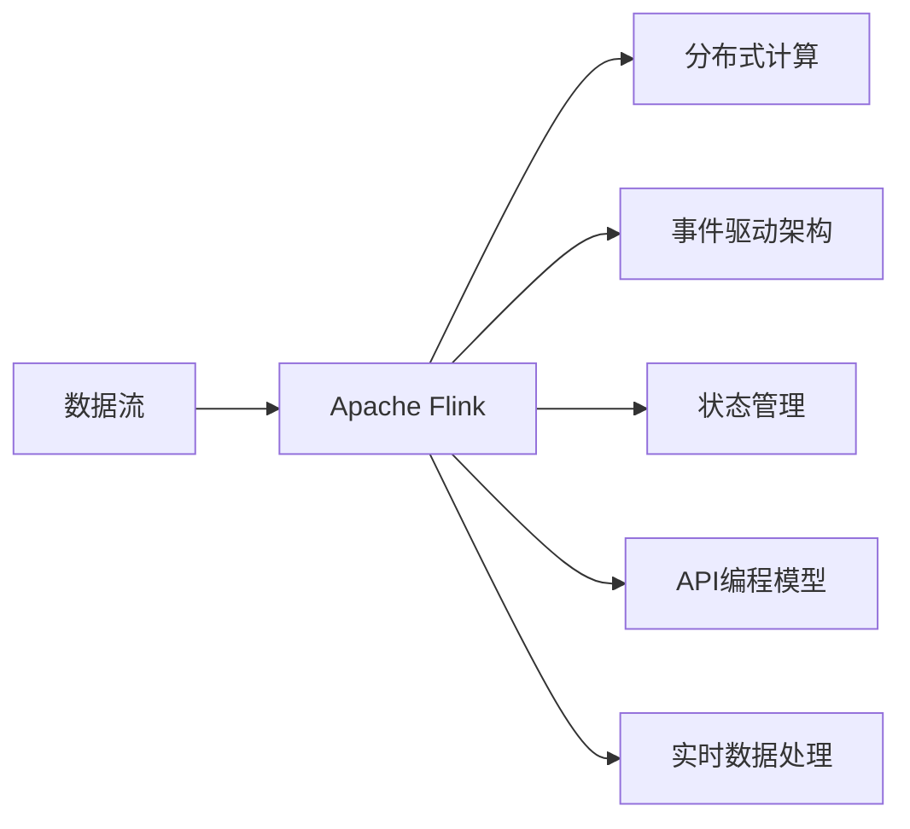

                 

# Flink Stream原理与代码实例讲解

> 关键词：流式处理、Apache Flink、流计算、实时数据处理、分布式数据流、事件驱动架构

## 1. 背景介绍

在当下数字化时代，数据量和数据源的多样性日益增加，各行各业对实时数据处理的需求也日益迫切。大数据技术不仅要处理批量的历史数据，还需要对实时数据进行高效、稳定、可靠的流式处理。而流式数据处理的系统设计和实现，自然成为了数据工程领域的重点和难点。

其中，Apache Flink是一个高性能的分布式流处理框架，由Apache软件基金会维护，能够在数据流模式和大数据批处理模式之间提供流畅的转换，从而满足各种复杂计算需求。Flink被广泛用于实时数据流处理，其特点包括：

1. 高性能：通过优化内存访问和数据并行处理，提供接近实时的高吞吐量和低延迟。
2. 容错性：通过状态恢复机制，保证系统在故障发生后的数据一致性。
3. 流批一体：支持批处理和流处理，统一编程模型，便于实现复杂的计算逻辑。
4. 高可用性：通过集群管理、资源管理等功能，保证系统的稳定运行。
5. 可扩展性：支持大规模的集群扩展，满足大量数据流处理需求。

本文章将详细介绍Flink Stream的原理与核心概念，并通过代码实例，展示其在实际应用中的使用方法和注意事项。

## 2. 核心概念与联系

### 2.1 核心概念概述

为了更好地理解Flink Stream，我们先简要介绍一下相关核心概念：

- **数据流**：指数据按照一定规则有序或无序地连续产生和流动，是流式数据处理的基础。
- **流处理**：指实时处理数据流，处理过程中数据流状态不断更新。
- **分布式计算**：通过分布式集群并行处理数据流，提高处理效率。
- **Apache Flink**：一个高性能、分布式、流处理和批处理相结合的框架，支持多种数据源和数据流模型。
- **事件驱动架构**：基于事件产生和处理的架构，强调数据的异步性和响应性。
- **状态管理**：在流处理中，状态指的是数据流的中间计算结果，用于保存计算过程中的临时数据，确保结果一致性。
- **API编程模型**：Flink提供了多种API，如基于Java、Scala、Python、Groovy的API，方便用户进行编程。

### 2.2 核心概念原理和架构的 Mermaid 流程图



在上述关系图中，Apache Flink处于核心位置，它通过分布式计算能力，支持数据流处理和事件驱动架构。数据流是处理的对象，状态管理和API编程模型是Flink支持的核心技术，实时数据处理是Flink框架的最终目标。

## 3. 核心算法原理 & 具体操作步骤

### 3.1 算法原理概述

Flink Stream的核心算法原理主要包括以下几个方面：

1. **流式处理**：将数据流分为多个小数据块（如微批次），对每个小数据块进行并行处理。
2. **容错处理**：通过检查点机制，定期保存状态，确保在异常情况下能够恢复处理。
3. **流批一体**：通过统一编程模型，可以灵活地支持流处理和批处理任务。
4. **分布式计算**：通过分布式集群并行处理数据流，提升处理性能。

### 3.2 算法步骤详解

#### 3.2.1 流式数据流模型

1. **数据源**：数据流的起点，可以是文件、数据库、网络流等。
2. **数据流管道**：数据流在集群内的传输和计算路径。
3. **数据流处理器**：对数据流进行各种计算操作，如过滤、聚合、窗口、状态等。
4. **数据流汇聚**：多个数据流处理器的输出结果合并。

#### 3.2.2 容错机制

1. **检查点**：定期将状态和任务快照保存在磁盘上，保证在故障时能够恢复状态。
2. **状态管理**：通过分布式状态管理，实现高可用性和容错性。
3. **流处理一致性**：通过定期检查点，确保流处理结果的一致性。

#### 3.2.3 流批一体

1. **统一编程模型**：通过统一的编程模型，支持流处理和批处理。
2. **参数控制**：通过配置参数，控制批处理的并行度和数据的流式处理方式。
3. **混合计算**：可以同时处理流式数据和批处理数据。

### 3.3 算法优缺点

#### 3.3.1 优点

1. **高效性**：Flink提供了内存优化的内存计算，提升了数据处理效率。
2. **实时性**：通过流式处理模型，实现了数据流的高实时性。
3. **容错性**：通过检查点机制，确保数据处理的可靠性。
4. **可扩展性**：通过分布式计算，支持大规模数据处理。

#### 3.3.2 缺点

1. **学习曲线陡峭**：需要一定的编程经验和理解能力，学习成本较高。
2. **资源消耗**：需要大量的硬件资源，如CPU、内存、磁盘等。
3. **部署复杂**：需要部署集群，管理复杂。
4. **处理能力有限**：对于大规模数据流，处理能力受限于集群规模。

### 3.4 算法应用领域

Flink Stream广泛应用于各种数据驱动的实时应用场景，如：

1. **金融交易**：实时监控金融市场动态，进行风险控制和交易决策。
2. **电子商务**：实时分析用户行为，进行个性化推荐和广告投放。
3. **日志分析**：实时分析系统日志，进行故障检测和优化。
4. **物联网**：实时处理物联网设备数据，进行数据监控和决策。
5. **游戏实时数据处理**：实时处理玩家数据，进行游戏推荐和个性化服务。

## 4. 数学模型和公式 & 详细讲解 & 举例说明

### 4.1 数学模型构建

Flink Stream的数学模型主要基于数据流处理的理论，可以表示为如下形式：

设 $D$ 为数据流，$S$ 为状态，$O$ 为操作。则数据流处理可以表示为：

$$
S = F(D, O)
$$

其中，$S$ 表示当前状态，$D$ 表示当前输入数据流，$O$ 表示操作函数，可以包括过滤、聚合、窗口、状态更新等操作。

### 4.2 公式推导过程

Flink Stream的状态更新公式可以表示为：

$$
S_{t+1} = \phi(S_t, D_t, O)
$$

其中，$S_t$ 表示在时间 $t$ 时刻的状态，$D_t$ 表示在时间 $t$ 时刻的输入数据流，$O$ 表示在时间 $t$ 时刻的操作函数，$\phi$ 表示状态更新函数。

### 4.3 案例分析与讲解

以一个简单的流式数据流处理为例，展示Flink Stream的核心算法原理。

```java
DataStream<String> input = env.addSource(new FlinkKafkaConsumer<>(props, new SimpleStringSchema(), topics));
input.flatMap(new SimpleStringSplitter(' '))
    .map(new MapFunction<String, Tuple2<String, Integer>>() {
        @Override
        public Tuple2<String, Integer> map(String value) {
            return new Tuple2<>(value, 1);
        }
    })
    .sum(1) // 使用reduce函数进行聚合
    .print(); // 输出结果
```

上述代码实现了一个简单的流式数据流处理任务，输入数据流为Kafka消息，并对每个消息进行分割、计数并输出。

在代码中，`flatMap`函数将输入数据流拆分为单个字符串，`map`函数将每个字符串映射为`Tuple2<String, Integer>`类型，`sum`函数对每个元素进行计数，最后使用`print`函数输出结果。

## 5. 项目实践：代码实例和详细解释说明

### 5.1 开发环境搭建

在开始使用Flink Stream进行实际项目开发前，需要先搭建开发环境。以下是详细的步骤：

1. 安装Java：Flink需要JDK 8及以上版本。
2. 安装Flink：可以从官方网站下载二进制包，也可以从源代码编译安装。
3. 配置环境：配置Flink的启动参数和集群配置文件。
4. 启动Flink：通过脚本启动Flink集群。

### 5.2 源代码详细实现

以下是一个简单的Flink Stream代码实现，展示了如何在Flink中进行流式数据处理：

```java
import org.apache.flink.streaming.api.datastream.DataStream;
import org.apache.flink.streaming.api.environment.StreamExecutionEnvironment;
import org.apache.flink.streaming.api.functions.source.SourceFunction;
import org.apache.flink.streaming.util.serialization.SimpleStringSchema;

public class FlinkStreamExample {

    public static void main(String[] args) throws Exception {
        // 创建Flink环境
        StreamExecutionEnvironment env = StreamExecutionEnvironment.getExecutionEnvironment();

        // 从Kafka读取数据
        DataStream<String> input = env.addSource(new FlinkKafkaConsumer<>(props, new SimpleStringSchema(), topics));

        // 对数据流进行过滤和转换
        input.flatMap(new SimpleStringSplitter(' '))
            .map(new MapFunction<String, Tuple2<String, Integer>>() {
                @Override
                public Tuple2<String, Integer> map(String value) {
                    return new Tuple2<>(value, 1);
                }
            })
            .sum(1) // 使用reduce函数进行聚合
            .print(); // 输出结果

        // 执行Flink任务
        env.execute("Flink Stream Example");
    }
}
```

### 5.3 代码解读与分析

在上述代码中，首先创建了Flink环境，然后从Kafka读取数据流。使用`flatMap`函数将数据流拆分为单个字符串，`map`函数将每个字符串映射为`Tuple2<String, Integer>`类型，`sum`函数对每个元素进行计数，最后使用`print`函数输出结果。

需要注意的是，Flink Stream的操作函数非常灵活，可以根据具体需求进行配置和使用。在实际应用中，开发者需要结合具体场景，合理选择和使用操作函数，以实现理想的数据处理效果。

### 5.4 运行结果展示

运行上述代码，可以看到Flink将Kafka消息进行分割、计数并输出结果。例如，假设Kafka消息为：

```
hello world
```

那么Flink将输出：

```
(hello, 1)
(world, 1)
```

这说明Flink已经成功处理了输入数据流，并对每个单词进行了计数。

## 6. 实际应用场景

### 6.1 金融交易

在金融领域，Flink Stream被广泛用于实时监控金融市场动态，进行风险控制和交易决策。例如，可以通过实时数据流处理，实时监控股票价格变化，及时发现异常情况并进行预警。

### 6.2 电子商务

在电子商务领域，Flink Stream可以实时分析用户行为，进行个性化推荐和广告投放。例如，可以通过实时数据分析，挖掘用户购买行为，推荐相关产品，提高用户满意度。

### 6.3 日志分析

在日志分析领域，Flink Stream可以实时分析系统日志，进行故障检测和优化。例如，可以通过实时数据流处理，实时监控系统运行状态，及时发现异常并采取措施。

### 6.4 物联网

在物联网领域，Flink Stream可以实时处理物联网设备数据，进行数据监控和决策。例如，可以通过实时数据分析，实时监控设备状态，及时发现异常并进行维护。

### 6.5 游戏实时数据处理

在游戏领域，Flink Stream可以实时处理玩家数据，进行游戏推荐和个性化服务。例如，可以通过实时数据分析，实时监控玩家行为，推荐相关游戏，提高玩家体验。

## 7. 工具和资源推荐

### 7.1 学习资源推荐

为了帮助开发者深入学习Flink Stream，以下是一些优质的学习资源：

1. Apache Flink官方文档：提供详细的API文档和编程指南，是学习Flink Stream的最佳入门资源。
2.《Flink实战》：一本实战性的书籍，涵盖Flink Stream的开发和部署实践，适合初学者和有经验的开发者。
3. Flink官网的课程和教程：提供丰富的视频和文本资源，帮助开发者快速上手Flink Stream。
4. Flink社区和论坛：与Flink开发者交流，获取最新的技术动态和实践经验。

### 7.2 开发工具推荐

Flink Stream的开发工具非常丰富，以下是一些推荐的工具：

1. IntelliJ IDEA：一个优秀的Java IDE，支持Flink Stream的开发和调试。
2. Eclipse：另一个流行的Java IDE，也支持Flink Stream的开发。
3. Git和SVN：用于版本控制，方便团队协作和代码管理。
4. Jenkins：一个开源的持续集成和持续部署工具，可以自动化Flink任务的部署和监控。

### 7.3 相关论文推荐

Flink Stream的论文众多，以下是一些经典的论文，值得深入阅读：

1. "Flink: Unified Stream and Batch Data Processing"：介绍Flink Stream的设计理念和关键技术。
2. "Efficient Distributed Stream Processing with Apache Flink"：介绍Flink Stream的高性能和可扩展性。
3. "Flink in Production: The First Year"：介绍Flink在生产环境中的应用和优化实践。
4. "Stream Processing with Apache Flink"：介绍Flink Stream的核心概念和算法原理。

## 8. 总结：未来发展趋势与挑战

### 8.1 未来发展趋势

展望未来，Flink Stream将呈现以下几个发展趋势：

1. **高性能**：Flink Stream将继续优化内存访问和数据并行处理，提升数据处理效率。
2. **实时性**：通过流式处理模型，进一步提升数据处理的实时性。
3. **可扩展性**：支持大规模集群扩展，处理海量数据流。
4. **生态系统**：丰富Flink生态系统，提升生态系统的可扩展性和稳定性。
5. **容器化部署**：支持Kubernetes等容器化部署方式，提升系统管理和扩展能力。

### 8.2 面临的挑战

尽管Flink Stream已经取得了一定的成功，但在实际应用中仍面临一些挑战：

1. **学习曲线陡峭**：需要一定的编程经验和理解能力，学习成本较高。
2. **资源消耗**：需要大量的硬件资源，如CPU、内存、磁盘等。
3. **部署复杂**：需要部署集群，管理复杂。
4. **处理能力有限**：对于大规模数据流，处理能力受限于集群规模。
5. **数据一致性**：在分布式计算中，保证数据一致性是一个重要的挑战。

### 8.3 研究展望

未来，Flink Stream需要解决以下研究问题：

1. **高效分布式计算**：优化分布式计算模型，提升处理能力。
2. **可扩展性和高可用性**：提升集群扩展能力和系统稳定性。
3. **实时数据处理**：进一步提升数据处理的实时性和精度。
4. **数据一致性**：优化数据一致性算法，保证数据一致性。
5. **容错性**：优化容错机制，提升系统的容错能力。

## 9. 附录：常见问题与解答

**Q1：Flink Stream的学习曲线陡峭吗？**

A: 是的，Flink Stream需要一定的编程经验和理解能力，学习成本较高。但一旦掌握了基本概念和编程技巧，后续的学习和实践会相对容易。

**Q2：Flink Stream在实际应用中需要哪些硬件资源？**

A: 需要大量的CPU、内存和磁盘资源，以便处理大规模数据流。此外，还需要高性能的网络和存储设备，以支持高吞吐量的数据传输。

**Q3：Flink Stream的部署复杂吗？**

A: 是的，Flink Stream的部署比较复杂，需要搭建和维护集群，并配置各种参数。但在部署完成后，可以通过简单的API进行管理和监控。

**Q4：Flink Stream的处理能力有限吗？**

A: 是的，Flink Stream的处理能力受限于集群规模。在实际应用中，需要根据数据流量和性能要求，合理配置集群资源。

**Q5：如何优化Flink Stream的数据一致性？**

A: 可以使用分布式状态管理，定期进行状态检查点，保证数据一致性。此外，还可以通过优化计算模型和算法，提高数据处理效率和准确性。

---

作者：禅与计算机程序设计艺术 / Zen and the Art of Computer Programming

