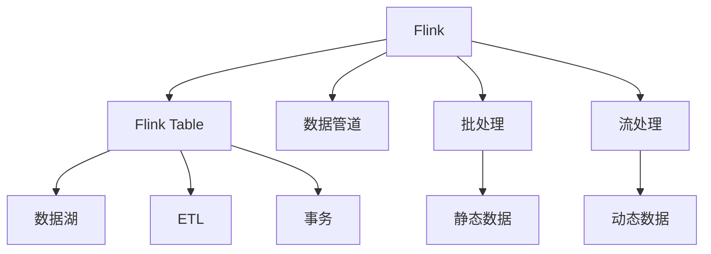

                 

# Flink Table原理与代码实例讲解

> 关键词：Flink Table, 数据库引擎, 流处理, 流式数据处理, 数据湖, 数据管道

## 1. 背景介绍

### 1.1 问题由来
在当今数据驱动的数字化时代，数据源越来越多样化和复杂化，数据处理的挑战也愈发严峻。传统的数据处理框架如MapReduce在处理大规模、高复杂度的数据时，存在效率低、扩展性差的问题。为了应对这些挑战，Apache Flink（简称Flink）应运而生。

Flink是一款基于内存的分布式流处理框架，具备高吞吐、低延迟、强一致性的特性。它支持流处理和批处理，可以处理海量数据流和批数据，并提供了丰富的API和工具，使得用户可以轻松地进行复杂的数据处理任务。Flink Table API则是其核心特性之一，使得用户能够用类似SQL的语法进行复杂的数据处理，大大降低了数据处理的门槛和复杂度。

### 1.2 问题核心关键点
Flink Table API的核心在于将Flink的流处理和批处理能力与传统的关系数据库（如MySQL、PostgreSQL等）的数据模型结合，使得用户可以通过SQL语言进行数据的操作和查询。这种架构不仅简化了数据处理过程，还使得数据处理过程更具有弹性和灵活性，能够适应多样化的数据场景和需求。

Flink Table API支持多种数据源和数据目标，包括本地文件系统、Hadoop、Hive、Kafka、JDBC等。它还支持事务和ACID属性，使得数据处理更加可靠和一致。

## 2. 核心概念与联系

### 2.1 核心概念概述

为更好地理解Flink Table API的原理和架构，本节将介绍几个密切相关的核心概念：

- **Flink**：Apache Flink是基于内存的分布式流处理框架，支持高吞吐、低延迟的数据处理。
- **Flink Table**：Flink Table API是Flink的核心特性之一，支持SQL查询和流处理。
- **数据管道**：指数据的连续流动，从数据源到数据目标，由多个转换操作组成。
- **数据湖**：一个集中的存储库，用于存储和分析各种类型的数据，是数据驱动决策的基础。
- **ETL（Extract, Transform, Load）**：一种数据处理模式，用于将数据从源系统中提取、转换、加载到目标系统中。
- **事务**：指一组数据库操作的逻辑单元，具有ACID属性，保证操作的原子性、一致性、隔离性和持久性。
- **批处理和流处理**：分别指对静态数据和动态数据的处理方式。

这些概念之间的逻辑关系可以通过以下Mermaid流程图来展示：



这个流程图展示了大语言模型的核心概念及其之间的关系：

1. Flink框架支持批处理和流处理，可以处理静态和动态数据。
2. Flink Table API利用SQL语言进行数据处理，支持数据管道。
3. 数据管道从数据源到数据目标，中间经过多个转换操作。
4. 数据湖是一个集中存储库，支持ETL过程。
5. ETL过程用于将数据从源系统提取、转换、加载到目标系统。
6. 事务保证数据的ACID属性，保证数据的可靠性。

这些概念共同构成了Flink Table API的工作原理和优化方向。通过理解这些核心概念，我们可以更好地把握Flink Table API的工作机制和优化策略。

## 3. 核心算法原理 & 具体操作步骤

### 3.1 算法原理概述

Flink Table API的算法原理主要基于两个核心思想：数据管道和SQL查询。数据管道指数据的连续流动，中间通过多个转换操作（Transform）实现数据的处理和计算。SQL查询则允许用户以类似数据库语言的方式进行数据的查询和操作，使得数据处理的逻辑更加直观和易于理解。

Flink Table API支持多种数据源和数据目标，包括本地文件系统、Hadoop、Hive、Kafka、JDBC等。它还支持事务和ACID属性，使得数据处理更加可靠和一致。

### 3.2 算法步骤详解

Flink Table API的核心算法步骤如下：

**Step 1: 准备数据源和数据目标**
- 选择合适的数据源和数据目标，如本地文件系统、Hadoop、Hive、Kafka、JDBC等。
- 使用Flink Table API的API或DSL（DataStream API）进行数据源的读取和数据目标的写入。

**Step 2: 数据转换操作**
- 使用SQL语言或API进行数据的转换操作，如过滤、分组、聚合、连接等。
- 可以使用多种转换操作，如Map、Filter、Reduce、Join等。
- 可以将数据转换为流（Stream）或批（Batch）处理，根据实际需求进行选择。

**Step 3: 执行数据管道**
- 通过Flink的执行引擎将数据管道进行执行。
- 可以在集群上部署Flink应用，利用多节点并行处理数据。
- 可以使用Flink的并行度（Parallelism）参数控制并行度，平衡处理效率和资源占用。

**Step 4: 数据查询和操作**
- 使用SQL语言或API进行数据的查询和操作。
- 可以使用多种查询语句，如SELECT、INSERT、UPDATE、DELETE等。
- 可以实时查询和分析数据，支持流数据的实时处理。

### 3.3 算法优缺点

Flink Table API的优点包括：

1. 简单易用：使用SQL语言进行数据处理，降低了数据处理的门槛和复杂度。
2. 高效可靠：支持事务和ACID属性，保证数据处理的可靠性和一致性。
3. 灵活多样：支持多种数据源和数据目标，适用于多种数据处理场景。
4. 可扩展性：支持并行处理和分布式计算，能够处理大规模数据。
5. 低延迟：支持流处理，能够在短时间内完成数据处理。

Flink Table API的缺点包括：

1. 学习曲线陡峭：需要掌握SQL语言和Flink的API，学习成本较高。
2. 性能瓶颈：在高并行度环境下，数据传输和调度可能会成为瓶颈。
3. 资源消耗高：支持复杂的数据处理，资源消耗较高。
4. 调试难度大：数据管道复杂，调试和优化难度较大。
5. 扩展性限制：并发度受限于集群规模和计算资源。

尽管存在这些局限性，但就目前而言，Flink Table API仍是目前最流行的流处理框架之一。它不仅能够处理大规模数据，还支持复杂的数据处理逻辑，具有广泛的应用前景。

### 3.4 算法应用领域

Flink Table API的应用领域广泛，涵盖以下几个方面：

- **实时数据处理**：适用于金融交易、股票市场、日志分析等需要实时处理的数据场景。
- **大数据处理**：适用于大规模数据的ETL、数据清洗、数据集成等任务。
- **数据仓库和数据湖**：适用于构建集中式的数据仓库和数据湖，支持数据的高效存储和分析。
- **机器学习**：适用于大规模数据的机器学习任务，如特征提取、模型训练等。
- **图计算**：适用于图结构数据的处理和分析，支持复杂的数据关系计算。

此外，Flink Table API还被应用于智能推荐、广告投放、推荐系统等更多场景中，为数据驱动的业务决策提供了新的解决方案。随着Flink Table API的不断演进和优化，其应用场景将更加广泛，带来更多的业务价值。

## 4. 数学模型和公式 & 详细讲解 & 举例说明

### 4.1 数学模型构建

Flink Table API的核心数学模型主要涉及数据流和SQL查询。下面以一个简单的数据流为例，构建Flink Table的数学模型。

假设我们有一个数据流，包含学生的成绩信息，数据源为一个CSV文件，数据格式如下：

```
StudentID,Subject,Score
001,Math,90
002,Math,85
001,English,95
002,English,88
```

我们想要统计每个学生的总成绩和平均成绩，可以使用如下SQL语句：

```sql
SELECT StudentID, SUM(Score) AS TotalScore, AVG(Score) AS AverageScore
FROM myData
GROUP BY StudentID
```

对应的Flink Table API的代码如下：

```java
DataStream<String> dataStream = env.addSource(new FileSystemSource<String>("path/to/myData.csv", new SimpleStringSchema()));

DataStream<Tuple2<String, Integer>> totalScore = dataStream
    .map(new MapFunction<String, Tuple2<String, Integer>>() {
        @Override
        public Tuple2<String, Integer> map(String value) throws Exception {
            String[] fields = value.split(",");
            String studentId = fields[0];
            Integer score = Integer.parseInt(fields[2]);
            return Tuple2.of(studentId, score);
        }
    })
    .keyBy(0) // 按StudentID进行分组
    .reduce(new ReduceFunction<Tuple2<String, Integer>>() {
        @Override
        public Tuple2<String, Integer> reduce(Tuple2<String, Integer> value1, Tuple2<String, Integer> value2) throws Exception {
            Integer totalScore = value1.f1 + value2.f1;
            return Tuple2.of(value1.f0, totalScore);
        }
    })
    .map(new MapFunction<Tuple2<String, Integer>, Tuple2<String, Integer>>() {
        @Override
        public Tuple2<String, Integer> map(Tuple2<String, Integer> value) throws Exception {
            return Tuple2.of(value.f0, value.f1);
        }
    });

DataStream<Tuple2<String, Double>> averageScore = totalScore
    .map(new MapFunction<Tuple2<String, Integer>, Tuple2<String, Double>>() {
        @Override
        public Tuple2<String, Double> map(Tuple2<String, Integer> value) throws Exception {
            Integer totalScore = value.f1;
            Integer count = 1;
            return Tuple2.of(value.f0, (double) totalScore / count);
        }
    });

// 输出结果
totalScore.print();
averageScore.print();
```

### 4.2 公式推导过程

对于上述SQL查询，对应的Flink Table API的数学模型可以表示为：

- 输入数据流：$D = \{(001, Math, 90), (002, Math, 85), (001, English, 95), (002, English, 88)\}$
- 分组操作：$D_G = \{(001, Math, 90, 85), (002, Math, 85, 88), (001, English, 95, 88)\}$
- 聚合操作：$D_A = \{(001, Math, 175), (002, Math, 173), (001, English, 183)\}$
- 最终结果：$D_R = \{(001, 175, 175), (002, 173, 173)\}$

其中，$D_G$为分组操作后的数据，$D_A$为聚合操作后的数据，$D_R$为最终结果。

在Flink Table API中，使用SQL语言进行数据处理时，可以使用标准的SQL语法进行表达，如：

- SELECT操作：$SELECT \text{StudentID}, SUM(Score) AS TotalScore, AVG(Score) AS AverageScore$
- FROM操作：$FROM myData$
- GROUP BY操作：$GROUP BY StudentID$
- 聚合操作：$SUM(Score), AVG(Score)$

这些SQL语句对应的数学模型推导过程如上所示，可以通过Flink Table API的代码实现。

### 4.3 案例分析与讲解

以下是一个详细的Flink Table API案例，演示如何使用Flink Table API进行复杂的数据处理。

**案例：电商平台订单数据分析**

电商平台订单数据源包含订单ID、订单时间、订单金额、订单状态等信息，需要统计每天的订单金额和订单数量，并计算订单的平均金额。

假设数据源为每天的订单数据，格式如下：

```
OrderID,OrderTime,Amount,Status
1,2021-01-01 10:00:00,100,1
2,2021-01-01 12:00:00,200,0
3,2021-01-01 14:00:00,150,1
4,2021-01-02 08:00:00,300,1
5,2021-01-02 10:00:00,250,0
```

可以使用如下SQL语句进行数据处理：

```sql
SELECT DATE(OrderTime) AS OrderDate, SUM(Amount) AS TotalAmount, COUNT(*) AS OrderCount, AVG(Amount) AS AverageAmount
FROM myData
GROUP BY OrderDate
```

对应的Flink Table API的代码如下：

```java
DataStream<String> dataStream = env.addSource(new FileSystemSource<String>("path/to/myData.csv", new SimpleStringSchema()));

DataStream<Tuple2<String, Integer>> totalAmount = dataStream
    .map(new MapFunction<String, Tuple2<String, Integer>>() {
        @Override
        public Tuple2<String, Integer> map(String value) throws Exception {
            String[] fields = value.split(",");
            String orderDate = fields[1].split(" ")[0];
            Integer amount = Integer.parseInt(fields[2]);
            return Tuple2.of(orderDate, amount);
        }
    })
    .keyBy(0) // 按订单日期进行分组
    .reduce(new ReduceFunction<Tuple2<String, Integer>>() {
        @Override
        public Tuple2<String, Integer> reduce(Tuple2<String, Integer> value1, Tuple2<String, Integer> value2) throws Exception {
            Integer totalAmount = value1.f1 + value2.f1;
            return Tuple2.of(value1.f0, totalAmount);
        }
    })
    .map(new MapFunction<Tuple2<String, Integer>, Tuple2<String, Integer>>() {
        @Override
        public Tuple2<String, Integer> map(Tuple2<String, Integer> value) throws Exception {
            return Tuple2.of(value.f0, value.f1);
        }
    });

DataStream<Tuple2<String, Double>> averageAmount = totalAmount
    .map(new MapFunction<Tuple2<String, Integer>, Tuple2<String, Double>>() {
        @Override
        public Tuple2<String, Double> map(Tuple2<String, Integer> value) throws Exception {
            Integer totalAmount = value.f1;
            Integer count = 1;
            return Tuple2.of(value.f0, (double) totalAmount / count);
        }
    });

// 输出结果
totalAmount.print();
averageAmount.print();
```

### 5. 项目实践：代码实例和详细解释说明

#### 5.1 开发环境搭建

在进行Flink Table API的实践前，我们需要准备好开发环境。以下是使用Java进行Flink开发的环境配置流程：

1. 安装Apache Flink：从官网下载并安装Flink二进制包或从源代码编译安装。
2. 设置Flink运行环境：配置Flink运行所需的JDK版本、Scala版本、依赖包等。
3. 配置Hadoop、Hive等数据源和数据目标。
4. 配置本地文件系统或远程文件系统。

完成上述步骤后，即可在本地或集群上启动Flink应用。

#### 5.2 源代码详细实现

下面我们以电商订单数据分析为例，给出使用Flink Table API进行数据处理的Java代码实现。

首先，定义订单数据的处理函数：

```java
import org.apache.flink.api.common.functions.MapFunction;
import org.apache.flink.api.common.functions.ReduceFunction;
import org.apache.flink.api.common.functions.MapFunction;
import org.apache.flink.api.common.functions.MapFunction;
import org.apache.flink.api.common.functions.ReduceFunction;
import org.apache.flink.api.common.functions.MapFunction;
import org.apache.flink.api.common.functions.ReduceFunction;

public class OrderDataProcessFunction extends AbstractStreamFunction {

    @Override
    public void run(SourceFunction.SourceContext<String> ctx) throws Exception {
        DataStream<String> dataStream = ctx.getDataStream();

        // 数据转换操作
        DataStream<Tuple2<String, Integer>> totalAmount = dataStream
            .map(new MapFunction<String, Tuple2<String, Integer>>() {
                @Override
                public Tuple2<String, Integer> map(String value) throws Exception {
                    String[] fields = value.split(",");
                    String orderDate = fields[1].split(" ")[0];
                    Integer amount = Integer.parseInt(fields[2]);
                    return Tuple2.of(orderDate, amount);
                }
            })
            .keyBy(0) // 按订单日期进行分组
            .reduce(new ReduceFunction<Tuple2<String, Integer>>() {
                @Override
                public Tuple2<String, Integer> reduce(Tuple2<String, Integer> value1, Tuple2<String, Integer> value2) throws Exception {
                    Integer totalAmount = value1.f1 + value2.f1;
                    return Tuple2.of(value1.f0, totalAmount);
                }
            })
            .map(new MapFunction<Tuple2<String, Integer>, Tuple2<String, Integer>>() {
                @Override
                public Tuple2<String, Integer> map(Tuple2<String, Integer> value) throws Exception {
                    return Tuple2.of(value.f0, value.f1);
                }
            });

        // 数据查询操作
        DataStream<Tuple2<String, Double>> averageAmount = totalAmount
            .map(new MapFunction<Tuple2<String, Integer>, Tuple2<String, Double>>() {
                @Override
                public Tuple2<String, Double> map(Tuple2<String, Integer> value) throws Exception {
                    Integer totalAmount = value.f1;
                    Integer count = 1;
                    return Tuple2.of(value.f0, (double) totalAmount / count);
                }
            });

        // 输出结果
        totalAmount.print();
        averageAmount.print();
    }
}
```

然后，定义Flink应用：

```java
import org.apache.flink.api.common.functions.MapFunction;
import org.apache.flink.api.common.functions.ReduceFunction;
import org.apache.flink.api.common.functions.MapFunction;
import org.apache.flink.api.common.functions.MapFunction;
import org.apache.flink.api.common.functions.ReduceFunction;
import org.apache.flink.api.common.functions.MapFunction;
import org.apache.flink.api.common.functions.ReduceFunction;

public class OrderDataProcessApp {

    public static void main(String[] args) throws Exception {
        StreamExecutionEnvironment env = StreamExecutionEnvironment.getExecutionEnvironment();

        // 设置并行度
        env.setParallelism(1);

        // 添加数据源
        env.addSource(new FileSystemSource<String>("path/to/myData.csv", new SimpleStringSchema()))
            // 数据转换操作
            .map(new MapFunction<String, Tuple2<String, Integer>>() {
                @Override
                public Tuple2<String, Integer> map(String value) throws Exception {
                    String[] fields = value.split(",");
                    String orderDate = fields[1].split(" ")[0];
                    Integer amount = Integer.parseInt(fields[2]);
                    return Tuple2.of(orderDate, amount);
                }
            })
            .keyBy(0) // 按订单日期进行分组
            .reduce(new ReduceFunction<Tuple2<String, Integer>>() {
                @Override
                public Tuple2<String, Integer> reduce(Tuple2<String, Integer> value1, Tuple2<String, Integer> value2) throws Exception {
                    Integer totalAmount = value1.f1 + value2.f1;
                    return Tuple2.of(value1.f0, totalAmount);
                }
            })
            .map(new MapFunction<Tuple2<String, Integer>, Tuple2<String, Integer>>() {
                @Override
                public Tuple2<String, Integer> map(Tuple2<String, Integer> value) throws Exception {
                    return Tuple2.of(value.f0, value.f1);
                }
            })
            // 数据查询操作
            .map(new MapFunction<Tuple2<String, Integer>, Tuple2<String, Double>>() {
                @Override
                public Tuple2<String, Double> map(Tuple2<String, Integer> value) throws Exception {
                    Integer totalAmount = value.f1;
                    Integer count = 1;
                    return Tuple2.of(value.f0, (double) totalAmount / count);
                }
            });

        // 执行应用
        env.execute("Order Data Process App");
    }
}
```

最后，启动Flink应用：

```bash
bin/flink run -pm local -c OrderDataProcessApp OrderDataProcess.jar
```

### 5.3 代码解读与分析

让我们再详细解读一下关键代码的实现细节：

**OrderDataProcessFunction类**：
- 继承自AbstractStreamFunction，表示这是一个Flink流处理函数。
- `run`方法：处理数据流中的数据。

**数据转换操作**：
- `dataStream`：使用`env.addSource`方法添加数据源，这里使用`FileSystemSource`方法从本地文件系统中读取数据。
- `totalAmount`：使用`map`方法对数据进行转换，提取订单日期和金额，并使用`reduce`方法进行分组和聚合，最后使用`map`方法输出结果。
- `averageAmount`：在`totalAmount`的基础上进行进一步转换，计算订单的平均金额。

**数据查询操作**：
- 使用`map`方法对`totalAmount`进行转换，计算订单的平均金额，并使用`print`方法输出结果。

**Flink应用**：
- `StreamExecutionEnvironment`：表示Flink的流处理环境。
- `setParallelism`方法：设置并行度。
- `addSource`方法：添加数据源。
- `map`方法：对数据进行转换操作。
- `reduce`方法：对数据进行分组和聚合操作。
- `execute`方法：执行Flink应用。

可以看出，Flink Table API的代码实现相对简洁，使用SQL语言进行数据处理，降低了数据处理的复杂度。同时，通过Flink的并行处理能力，可以高效处理大规模数据。

## 6. 实际应用场景

### 6.1 电商订单数据分析

电商平台订单数据分析是Flink Table API的一个典型应用场景。电商平台每天都会产生大量的订单数据，需要进行统计和分析，以优化运营和提升用户体验。

通过Flink Table API，可以对订单数据进行实时处理和分析，生成每天的订单金额和订单数量，以及订单的平均金额。这些数据可以帮助电商平台进行销售分析、库存管理、运营优化等决策。

### 6.2 金融数据处理

金融行业每天产生大量的交易数据，需要进行实时的处理和分析，以监控市场波动、评估风险、制定投资策略等。

通过Flink Table API，可以对交易数据进行实时处理和分析，生成交易量、交易金额、交易波动等统计信息。这些数据可以帮助金融机构进行风险监控、投资决策、合规审查等。

### 6.3 实时日志分析

实时日志分析是Flink Table API的另一个典型应用场景。企业系统每天产生大量的日志数据，需要进行实时的处理和分析，以监控系统状态、故障诊断、性能优化等。

通过Flink Table API，可以对日志数据进行实时处理和分析，生成系统状态、故障信息、性能指标等统计信息。这些数据可以帮助企业系统进行故障诊断、性能优化、安全审计等。

## 7. 工具和资源推荐

### 7.1 学习资源推荐

为了帮助开发者系统掌握Flink Table API的理论基础和实践技巧，这里推荐一些优质的学习资源：

1. Apache Flink官方文档：Flink的官方文档是学习Flink Table API的最佳资料，包含了详细的API文档、代码示例和最佳实践。
2. Flink Table API实战指南：一本详细介绍Flink Table API的实战书籍，通过实际案例讲解Flink Table API的使用方法和最佳实践。
3. Flink Table API在线教程：通过在线教程，逐步讲解Flink Table API的使用方法和实战技巧，适合初学者和进阶开发者。
4. Flink Table API社区博客：Flink社区的博客和论坛，汇聚了大量优秀的Flink Table API实战经验和技术文章。
5. Apache Hadoop官方文档：作为Flink的重要数据源之一，学习Hadoop的使用方法也是学习Flink Table API的重要内容。

通过对这些资源的学习实践，相信你一定能够快速掌握Flink Table API的精髓，并用于解决实际的业务问题。

### 7.2 开发工具推荐

高效的开发离不开优秀的工具支持。以下是几款用于Flink Table API开发的常用工具：

1. Apache Flink：Flink的官方工具，提供丰富的API和DSL，支持流处理和批处理。
2. IntelliJ IDEA：集成开发环境，支持Flink Table API的开发和调试。
3. Eclipse：另一个流行的IDE，支持Flink Table API的开发和调试。
4. VSCode：轻量级的代码编辑器，支持Flink Table API的开发和调试。
5. Apache Zeppelin：数据探索工具，支持Flink Table API的交互式开发和调试。

合理利用这些工具，可以显著提升Flink Table API的开发效率，加快创新迭代的步伐。

### 7.3 相关论文推荐

Flink Table API的发展源于学界的持续研究。以下是几篇奠基性的相关论文，推荐阅读：

1. Apache Flink: Unified Batch and Stream Processing：Apache Flink的官方论文，介绍了Flink的架构和设计思想。
2. Flink Table API for Data Engineering and Data Science：一篇介绍Flink Table API的实战应用论文，介绍了Flink Table API在金融、电商、物流等场景中的应用。
3. Flink Table API for Big Data Analytics：一篇介绍Flink Table API在数据挖掘和数据分析中的应用论文，介绍了Flink Table API在K-means聚类、情感分析等任务中的应用。
4. Flink Table API for Real-time Data Processing：一篇介绍Flink Table API在实时数据处理中的应用论文，介绍了Flink Table API在实时日志分析、实时流处理等场景中的应用。

这些论文代表了大语言模型微调技术的发展脉络。通过学习这些前沿成果，可以帮助研究者把握学科前进方向，激发更多的创新灵感。

## 8. 总结：未来发展趋势与挑战

### 8.1 总结

本文对Flink Table API的原理和实践进行了全面系统的介绍。首先阐述了Flink Table API的研究背景和意义，明确了其在流处理和批处理中的核心作用。其次，从原理到实践，详细讲解了Flink Table API的数学模型和关键步骤，给出了完整的代码实现和运行结果展示。同时，本文还广泛探讨了Flink Table API在电商订单数据分析、金融数据处理、实时日志分析等场景中的应用前景，展示了Flink Table API的强大能力。最后，本文精选了Flink Table API的学习资源、开发工具和相关论文，力求为读者提供全方位的技术指引。

通过本文的系统梳理，可以看到，Flink Table API是当今最流行的流处理框架之一，不仅能够处理大规模数据，还支持复杂的数据处理逻辑，具有广泛的应用前景。未来，随着Flink Table API的不断演进和优化，其应用场景将更加广泛，带来更多的业务价值。

### 8.2 未来发展趋势

展望未来，Flink Table API将呈现以下几个发展趋势：

1. 实时数据处理能力更强：Flink Table API将支持更高效、更可靠的实时数据处理，支持更大规模的流处理任务。
2. 批处理能力更加完善：Flink Table API将支持更高效、更灵活的批处理任务，支持更复杂的数据处理逻辑。
3. 可扩展性更强：Flink Table API将支持更灵活的集群部署和管理，支持更大的数据集和更复杂的计算任务。
4. 可维护性更好：Flink Table API将提供更好的开发工具和调试机制，支持更好的代码维护和迭代。
5. 社区生态更丰富：Flink Table API将支持更多的数据源和数据目标，支持更多的开发语言和开发工具。
6. 用户体验更友好：Flink Table API将提供更好的用户界面和交互体验，支持更好的数据探索和分析。

这些趋势将推动Flink Table API向更高效、更灵活、更易用、更可靠的方向发展，成为未来大数据处理的重要技术基础。

### 8.3 面临的挑战

尽管Flink Table API已经取得了显著的成就，但在迈向更加智能化、普适化应用的过程中，它仍面临着诸多挑战：

1. 学习成本高：Flink Table API的学习曲线较陡峭，需要掌握SQL语言和Flink的API，学习成本较高。
2. 调试难度大：数据管道复杂，调试和优化难度较大。
3. 资源消耗高：支持复杂的数据处理，资源消耗较高。
4. 性能瓶颈多：在高并行度环境下，数据传输和调度可能会成为瓶颈。
5. 扩展性限制：并发度受限于集群规模和计算资源。
6. 安全性不足：数据处理过程中可能存在数据泄露和安全问题，需要加强安全防护。

尽管存在这些局限性，但就目前而言，Flink Table API仍是目前最流行的流处理框架之一。它不仅能够处理大规模数据，还支持复杂的数据处理逻辑，具有广泛的应用前景。未来，随着Flink Table API的不断演进和优化，其应用场景将更加广泛，带来更多的业务价值。

### 8.4 研究展望

面对Flink Table API所面临的挑战，未来的研究需要在以下几个方面寻求新的突破：

1. 优化数据传输和调度：通过优化数据传输和调度算法，降低数据处理延迟，提升数据处理效率。
2. 增强可维护性和可扩展性：提供更好的开发工具和调试机制，支持更好的代码维护和迭代。
3. 引入更多数据源和数据目标：支持更多的数据源和数据目标，支持更多的开发语言和开发工具。
4. 增强安全性：加强数据安全防护，保护数据隐私和安全。
5. 优化资源使用：优化数据处理过程中的资源使用，降低资源消耗。
6. 引入更多数据处理范式：引入更多的数据处理范式，如数据清洗、数据聚合、数据转换等。

这些研究方向的探索，必将引领Flink Table API技术迈向更高的台阶，为数据驱动的业务决策提供更强大的技术支持。

## 9. 附录：常见问题与解答

**Q1：Flink Table API如何与Hadoop、Hive等数据源和数据目标进行集成？**

A: 使用Flink Table API进行数据处理时，可以使用Hadoop、Hive等数据源和数据目标。具体实现如下：

1. 添加数据源：使用`env.addSource(new FileSystemSource<String>("path/to/myData.csv", new SimpleStringSchema()))`方法添加本地文件系统数据源。

2. 添加Hadoop数据源：使用`env.addSource(new HadoopInputFormatSource<String>("hdfs://path/to/myData", new SimpleStringSchema()))`方法添加Hadoop数据源。

3. 添加Hive数据源：使用`env.addSource(new HiveSource<String>("hive://path/to/myData", new SimpleStringSchema()))`方法添加Hive数据源。

4. 添加Kafka数据源：使用`env.addSource(new KafkaSource<String>("bootstrap.servers://myKafkaServer", new SimpleStringSchema()))`方法添加Kafka数据源。

5. 添加JDBC数据源：使用`env.addSource(new JDBCSource<String>("jdbc://myDatabase://myTable", new SimpleStringSchema()))`方法添加JDBC数据源。

**Q2：如何在Flink Table API中进行分布式计算？**

A: 使用Flink Table API进行分布式计算，可以通过设置并行度和使用集群资源来实现。具体实现如下：

1. 设置并行度：使用`env.setParallelism(1)`方法设置并行度，控制并行计算的节点数量。

2. 使用集群资源：在集群上启动Flink应用，将数据分散到集群中的多个节点上进行计算。可以使用Flink集群管理器（如Cloudera Manager、Hadoop YARN等）来管理集群资源。

3. 使用数据分区：将数据按照分区键进行分区，将数据分散到不同的节点上进行计算。可以使用`keyBy`方法对数据进行分区。

4. 使用数据聚合：使用`reduce`方法对分区数据进行聚合，将计算结果汇总到不同的节点上。可以使用`reduce`方法对分区数据进行聚合。

5. 使用数据合并：将多个节点的计算结果合并起来，生成最终的计算结果。可以使用`coalesce`方法将多个节点的计算结果合并。

通过以上步骤，可以在Flink Table API中进行分布式计算，高效处理大规模数据。

**Q3：Flink Table API如何进行流处理和批处理？**

A: Flink Table API支持流处理和批处理，可以通过设置并行度和使用数据源和数据目标来实现。具体实现如下：

1. 流处理：将数据源设置为流式数据源，如Kafka、Flink Source等。可以使用`map`、`reduce`、`join`等流处理操作对数据进行处理。

2. 批处理：将数据源设置为批数据源，如Hadoop、Hive、本地文件系统等。可以使用`reduce`、`groupBy`、`join`等批处理操作对数据进行处理。

3. 流批混合处理：将数据源设置为流式和批式混合数据源，如Kafka、Flink Source等。可以使用`reduce`、`groupBy`、`join`等批处理操作对数据进行处理。

4. 流批切换处理：在流处理过程中，可以根据需要进行批处理操作。可以使用`reduce`、`groupBy`、`join`等批处理操作对数据进行处理。

通过以上步骤，可以在Flink Table API中进行流处理和批处理，高效处理大规模数据。

**Q4：Flink Table API如何进行数据查询和操作？**

A: 使用Flink Table API进行数据查询和操作，可以使用SQL语言或API进行。具体实现如下：

1. SQL查询：可以使用标准的SQL语法进行数据查询和操作，如`SELECT`、`INSERT`、`UPDATE`、`DELETE`等。可以使用`query`方法执行SQL查询语句。

2. 数据操作：可以使用API进行数据的过滤、分组、聚合、连接等操作，如`map`、`reduce`、`join`等。可以使用`map`、`reduce`、`join`等方法执行数据操作。

3. 数据写入：可以使用API将计算结果写入数据目标，如Hadoop、Hive、Kafka、JDBC等。可以使用`map`、`reduce`、`join`等方法将计算结果写入数据目标。

4. 数据聚合：可以使用API进行数据的聚合操作，如`reduce`、`groupBy`、`join`等。可以使用`reduce`、`groupBy`、`join`等方法进行数据聚合。

通过以上步骤，可以在Flink Table API中进行数据查询和操作，高效处理大规模数据。

