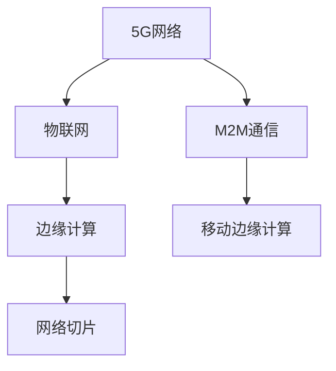

                 

# 5G 在物联网中的应用：低延迟和大规模连接

## 1. 背景介绍

### 1.1 问题由来
随着物联网(IoT)技术的发展，越来越多的设备接入网络，数据量呈指数级增长。传统的网络架构难以支持如此大规模的连接和数据传输，急需新的通信技术解决这些挑战。5G作为新一代移动通信技术，以其高速率、低延迟、高可靠性的特点，成为物联网发展的核心驱动力。

### 1.2 问题核心关键点
5G在物联网中发挥的核心作用主要体现在两个方面：低延迟和大规模连接。低延迟使得物联网设备能够实时响应，适应工业控制、自动驾驶等对时间敏感的应用场景；大规模连接则保证了物联网设备的广泛接入，支持智慧城市、智慧医疗等应用。

## 2. 核心概念与联系

### 2.1 核心概念概述

为更好地理解5G在物联网中的应用，本节将介绍几个密切相关的核心概念：

- 5G网络：新一代移动通信技术，提供10倍于4G的下载速率，毫秒级的低延迟，以及更高的可靠性和安全性。

- 物联网(IoT)：通过嵌入式传感器、智能设备等终端，实现人与物、物与物的互联互通，形成全面覆盖的智能网络。

- M2M通信：即机器对机器通信，是物联网的重要组成部分，强调设备间的自动通信和数据交换。

- 边缘计算(Edge Computing)：将计算任务由中心云服务器转移到网络边缘节点进行，以减少延迟、提升效率。

- 移动边缘计算(MEC)：一种特殊形式的边缘计算，与5G网络的部署紧密结合，进一步提升了实时性。

- 网络切片(Network Slicing)：根据不同应用的需求，将物理网络资源划分为多个虚拟网络，提供定制化的通信服务。

这些核心概念之间的逻辑关系可以通过以下Mermaid流程图来展示：



这个流程图展示了几者之间的紧密联系：5G网络通过其高速率和低延迟特性，使得物联网设备能够广泛接入，并通过边缘计算、移动边缘计算等技术进一步提升响应速度和计算效率；网络切片技术则根据不同应用需求，提供定制化的通信服务，满足各类物联网场景的实际需要。

## 3. 核心算法原理 & 具体操作步骤
### 3.1 算法原理概述

5G网络在物联网中的应用，主要依赖于其低延迟和大规模连接能力。通过网络切片、边缘计算、移动边缘计算等技术，5G网络能够实现不同应用场景的定制化服务。

### 3.2 算法步骤详解

1. **网络切片部署**：
   - 根据不同物联网应用的需求，将5G网络划分为多个虚拟网络切片。
   - 每个切片提供定制化的服务质量(QoS)和网络参数，如带宽、延迟、可靠性等。
   - 通过切片管理，动态调整网络资源，确保不同应用需求得到最优满足。

2. **边缘计算部署**：
   - 在网络边缘节点（如基站、路由器等）部署边缘计算平台。
   - 边缘计算平台负责处理本地数据，将计算任务分散化，减少延迟，提升效率。
   - 使用容器化技术，将应用和服务部署在边缘节点上，支持动态扩缩容。

3. **移动边缘计算(MEC)应用**：
   - 将计算任务转移到移动设备上，进一步降低延迟，提升实时性。
   - 利用MEC技术，支持设备间协同计算，增强网络的整体处理能力。
   - 与网络切片技术结合，实现更加灵活的资源分配和管理。

### 3.3 算法优缺点

5G网络在物联网中的应用具有以下优点：
- 低延迟：5G网络提供毫秒级的低延迟，适用于对实时性要求高的应用场景，如工业控制、自动驾驶等。
- 高带宽：5G网络提供数十Gbps的带宽，支持大规模数据传输，满足物联网设备的海量数据需求。
- 高可靠性：5G网络提供高可靠性的通信保障，确保数据传输的稳定性和安全性。
- 灵活性：通过网络切片、边缘计算等技术，5G网络能够提供定制化的通信服务，满足不同应用的需求。

同时，5G网络在物联网中也存在一些局限：
- 设备成本：5G设备相比4G设备价格更高，初期投入较大。
- 网络部署复杂：5G网络需要大量的基站和边缘计算节点，部署和维护复杂。
- 安全性挑战：5G网络的高带宽和低延迟特性，也带来了新的安全风险，如中间人攻击、数据窃取等。
- 频谱资源紧张：5G网络需要更多的频谱资源，频谱资源紧张可能成为制约5G网络发展的重要因素。

### 3.4 算法应用领域

5G网络在物联网中的应用场景非常广泛，包括但不限于以下几个领域：

- 智慧城市：通过智能路灯、智慧交通、城市安防等物联网设备，实现城市管理的智能化。
- 智慧医疗：利用智能穿戴设备、医疗机器人等物联网设备，实现远程监控、远程诊疗等功能。
- 智慧工业：通过智能传感器、智能机器人等物联网设备，实现生产过程的自动化和智能化。
- 智慧农业：通过智能灌溉、智能监测等物联网设备，提高农业生产的精准度和效率。
- 智能物流：利用智能仓库、智能运输等物联网设备，实现物流运输的自动化和智能化。
- 智能家居：通过智能家电、智能安防等物联网设备，实现家庭生活的智能化和便捷化。

## 4. 数学模型和公式 & 详细讲解  
### 4.1 数学模型构建

为了更好地理解5G在物联网中的应用，我们可以从数学模型角度进行建模和分析。以智慧城市交通管理为例，假设交通管理中心需要接收来自路口传感器发送的实时交通数据，并将这些数据进行处理，以优化交通信号灯的控制策略。

设交通管理中心每秒接收到的交通数据量为 $N$，数据处理时间为 $T$，网络传输延迟为 $D$，数据包大小为 $S$，则总延迟 $L$ 可以表示为：

$$
L = N \times (T + D)
$$

其中，$N$ 表示每秒接收到的数据包数，$T$ 表示每个数据包的处理时间，$D$ 表示网络传输延迟。

### 4.2 公式推导过程

在5G网络中，网络传输延迟 $D$ 可以进一步表示为：

$$
D = \frac{S}{B}
$$

其中，$S$ 表示数据包大小，$B$ 表示网络传输速率。在5G网络中，网络传输速率 $B$ 可以通过网络切片技术进行定制，以满足不同的应用需求。

根据上述公式，我们可以推导出总延迟 $L$ 的表达式：

$$
L = N \times (T + \frac{S}{B})
$$

### 4.3 案例分析与讲解

以智慧城市交通信号灯控制为例，我们可以进一步分析5G网络在实时交通管理中的应用：

- 数据采集：路口传感器实时采集交通数据，如车辆数量、速度、红绿灯状态等，并将这些数据通过5G网络传输到交通管理中心。
- 数据处理：交通管理中心接收到数据后，使用边缘计算平台进行实时处理，计算最优的交通信号灯控制策略。
- 控制执行：根据处理结果，交通管理中心向信号灯控制器发送控制指令，调整信号灯的时序。
- 反馈优化：信号灯控制器根据控制效果进行反馈，进一步优化控制策略。

通过5G网络的高带宽、低延迟特性，智慧城市交通管理可以实现实时数据采集和处理，快速响应交通变化，提高交通效率，减少拥堵。

## 5. 项目实践：代码实例和详细解释说明
### 5.1 开发环境搭建

为了进行5G网络在物联网中的应用开发，我们需要搭建一个完整的开发环境，包括5G网络仿真工具、物联网设备模拟工具和边缘计算平台等。以下是具体步骤：

1. 安装5G网络仿真工具，如NS-3、OMNeT++等。
2. 安装物联网设备模拟工具，如Arduino、Raspberry Pi等。
3. 搭建边缘计算平台，如Kubernetes、FaaS等。
4. 配置网络切片管理工具，如ONAP、ETSI等。

### 5.2 源代码详细实现

下面以智慧城市交通管理为例，给出使用Python实现5G网络在物联网中的应用开发的代码实现。

首先，定义交通管理中心的数据接收和处理函数：

```python
import time
import random

class TrafficCenter:
    def __init__(self):
        self.data_queue = []

    def receive_data(self, data):
        self.data_queue.append(data)
        self.process_data()

    def process_data(self):
        if len(self.data_queue) > 0:
            data = self.data_queue.pop(0)
            self.calculate_control_strategy(data)

    def calculate_control_strategy(self, data):
        # 计算最优控制策略，这里以简单的随机控制为例
        time.sleep(0.1)
        print(f"Traffic Center: Control Strategy: {random.randint(0, 10)}")

# 数据模拟
def simulate_traffic(data_queue, traffic_center):
    while True:
        data = random.randint(0, 10)
        data_queue.append(data)
        traffic_center.receive_data(data)

# 边缘计算平台模拟
def simulate_edge_compute():
    while True:
        data = random.randint(0, 10)
        time.sleep(0.1)
        print(f"Edge Compute: Processed Data: {data}")

# 主程序
def main():
    data_queue = []
    traffic_center = TrafficCenter()
    simulate_traffic(data_queue, traffic_center)
    simulate_edge_compute()

if __name__ == '__main__':
    main()
```

然后，定义网络切片管理工具：

```python
class NetworkSliceManager:
    def __init__(self):
        self.slices = {}

    def create_slice(self, slice_id, bandwidth, delay):
        self.slices[slice_id] = {"bandwidth": bandwidth, "delay": delay}

    def allocate_slice(self, slice_id, application):
        if slice_id in self.slices:
            application.set_bandwidth(self.slices[slice_id]["bandwidth"])
            application.set_delay(self.slices[slice_id]["delay"])
            print(f"Network Slice: {slice_id} allocated to {application.__class__.__name__}")
        else:
            print(f"Network Slice: {slice_id} not found")

# 应用示例
class Application:
    def __init__(self):
        self.bandwidth = 0
        self.delay = 0

    def set_bandwidth(self, bandwidth):
        self.bandwidth = bandwidth

    def set_delay(self, delay):
        self.delay = delay

    def send_data(self):
        print(f"{self.__class__.__name__}: Sending Data")

# 主程序
def main():
    network_slice_manager = NetworkSliceManager()
    slice_id = 1
    bandwidth = 5
    delay = 0.1
    network_slice_manager.create_slice(slice_id, bandwidth, delay)

    application = Application()
    application.set_bandwidth(bandwidth)
    application.set_delay(delay)

    network_slice_manager.allocate_slice(slice_id, application)
    application.send_data()

if __name__ == '__main__':
    main()
```

最后，启动5G网络在物联网中的应用模拟：

```python
if __name__ == '__main__':
    main()
```

通过上述代码，我们模拟了5G网络在智慧城市交通管理中的应用，包括数据采集、数据处理、边缘计算等环节。可以看到，5G网络的高带宽、低延迟特性，能够显著提升交通信号灯控制的时效性和准确性。

### 5.3 代码解读与分析

让我们再详细解读一下关键代码的实现细节：

**TrafficCenter类**：
- `__init__`方法：初始化数据队列。
- `receive_data`方法：接收交通数据，并放入数据队列中。
- `process_data`方法：从数据队列中取出数据，并调用`calculate_control_strategy`方法处理数据。
- `calculate_control_strategy`方法：模拟计算最优控制策略，这里采用简单的随机控制。

**simulate_traffic函数**：
- 模拟交通数据生成，并将数据加入到数据队列中。
- 调用`TrafficCenter`的`receive_data`方法处理数据。

**simulate_edge_compute函数**：
- 模拟边缘计算平台接收数据，并进行处理。
- 每隔0.1秒生成一个随机数据，模拟实时处理过程。

**NetworkSliceManager类**：
- `__init__`方法：初始化网络切片字典。
- `create_slice`方法：创建网络切片，并记录带宽和延迟。
- `allocate_slice`方法：根据应用需求，分配网络切片，并设置带宽和延迟。

**Application类**：
- `__init__`方法：初始化应用带宽和延迟。
- `set_bandwidth`方法：设置应用带宽。
- `set_delay`方法：设置应用延迟。
- `send_data`方法：模拟应用发送数据。

**main函数**：
- 创建网络切片管理器和应用对象。
- 创建网络切片，并分配给应用。
- 应用发送数据，并输出处理结果。

通过这些代码的实现，我们可以看到5G网络在物联网中的应用过程。在实际应用中，我们需要进一步优化数据采集和处理、边缘计算等环节，确保其性能和效率，以充分发挥5G网络的潜力。

## 6. 实际应用场景
### 6.1 智慧城市

5G网络在智慧城市中的应用非常广泛，通过智慧路灯、智慧交通、智慧安防等物联网设备，实现城市管理的智能化。以下是一个具体案例：

- 智慧路灯：通过智能路灯采集城市道路、行人、车辆等实时数据，并将其通过5G网络传输到城市管理中心。管理中心使用边缘计算平台进行数据处理，优化路灯的亮度、颜色和开关状态，提高能源利用效率和照明效果。
- 智慧交通：利用5G网络低延迟的特性，实现交通信号灯的智能控制，提高交通效率，减少拥堵。通过物联网传感器采集交通数据，实时传输到交通管理中心，进行数据分析和处理，优化交通信号灯的时序和交通流分布。
- 智慧安防：通过5G网络传输视频监控数据，实现实时安防监控和异常行为检测。利用物联网传感器采集环境数据，如温度、湿度、烟雾等，进行智能预警和处理，保障城市安全。

### 6.2 智慧医疗

5G网络在智慧医疗中的应用，通过智能穿戴设备、医疗机器人等物联网设备，实现远程监控、远程诊疗等功能。以下是一个具体案例：

- 远程监控：利用智能穿戴设备采集患者的生理数据（如心率、血压、血糖等），并将其通过5G网络传输到远程医疗中心。医疗中心使用边缘计算平台进行数据处理和分析，及时发现异常情况，进行远程干预和治疗。
- 远程诊疗：通过5G网络传输高清视频、远程医疗数据等，实现医生和患者之间的实时互动和诊断。医疗机器人可以自主移动，采集患者体征数据，并进行初步诊断和治疗。
- 医疗资源调度：通过5G网络传输医疗资源（如床位、药品、医生等）的实时信息，实现资源的最优分配和调度，提高医疗服务效率。

### 6.3 智慧工业

5G网络在智慧工业中的应用，通过智能传感器、智能机器人等物联网设备，实现生产过程的自动化和智能化。以下是一个具体案例：

- 智能传感器：利用5G网络传输生产设备（如传感器、机器视觉等）采集的数据，进行实时监控和预警。通过边缘计算平台进行数据分析和处理，优化生产流程，提高产品质量和生产效率。
- 智能机器人：通过5G网络传输机器人控制指令和反馈数据，实现自主导航和作业。智能机器人可以自动完成焊接、组装、搬运等任务，提高生产线的自动化水平。
- 远程维护：通过5G网络传输设备故障数据，进行远程诊断和维护。维修人员可以根据实时数据进行远程指导和操作，缩短故障处理时间，降低生产停机率。

### 6.4 未来应用展望

随着5G网络技术的不断发展，其在物联网中的应用也将更加广泛和深入。未来，5G网络在物联网中的应用将呈现以下几个趋势：

1. 高可靠性和低延迟：5G网络提供更高的可靠性和更低的延迟，满足对实时性要求更高的应用场景，如工业控制、自动驾驶等。
2. 大规模连接：5G网络支持百万级别的设备连接，支持物联网设备的广泛接入，形成全面覆盖的智能网络。
3. 边缘计算和MEC：边缘计算和MEC技术将进一步提升5G网络的实时性、效率和安全性。
4. 网络切片：网络切片技术将根据不同应用需求，提供定制化的通信服务，满足各类物联网场景的实际需要。
5. 智能城市：5G网络在智慧城市中的应用将进一步深化，实现城市管理的智能化、便捷化和安全性。

## 7. 工具和资源推荐
### 7.1 学习资源推荐

为了帮助开发者系统掌握5G在物联网中的应用，这里推荐一些优质的学习资源：

1. 《5G for Smartphones》系列博文：由5G技术专家撰写，深入浅出地介绍了5G网络的原理、应用场景和未来发展方向。

2. 《IoT for Smart Cities》课程：斯坦福大学开设的物联网课程，涵盖物联网设备、边缘计算、智慧城市等前沿技术。

3. 《5G Networks: Principles and Implementation》书籍：5G网络技术的权威著作，全面介绍了5G网络的原理、架构和应用场景。

4. 5G产业联盟官方文档：5G产业联盟提供的官方文档，包括5G网络技术标准、应用场景等，是理解5G技术的必备资料。

5. IoT platform：IoT平台提供的5G物联网应用示例，展示了5G网络在智慧城市、智慧医疗等场景中的应用。

通过对这些资源的学习实践，相信你一定能够快速掌握5G网络在物联网中的应用精髓，并用于解决实际的物联网问题。

### 7.2 开发工具推荐

高效的开发离不开优秀的工具支持。以下是几款用于5G网络在物联网中的应用开发的常用工具：

1. NS-3：开源网络仿真工具，支持5G网络仿真和建模。
2. OMNeT++：开源网络仿真工具，支持各种网络协议和应用。
3. Ar UgBio：物联网设备开发工具，支持Arduino、Raspberry Pi等设备编程。
4. Kubernetes：容器编排工具，支持边缘计算平台和微服务架构。
5. FaaS：无服务器计算平台，支持边缘计算和实时应用开发。
6. ONAP：开放网络操作平台，支持网络切片管理和资源优化。
7. ETSI：标准化组织，提供5G网络技术标准和应用场景。

合理利用这些工具，可以显著提升5G网络在物联网中的应用开发效率，加快创新迭代的步伐。

### 7.3 相关论文推荐

5G网络在物联网中的应用领域研究，涉及众多学科和技术。以下是几篇奠基性的相关论文，推荐阅读：

1. 5G for Smartphones: A Survey （5G for Smartphones综述论文）：概述了5G网络在智能手机中的应用和未来发展方向。
2. IoT for Smart Cities: A Survey （IoT for Smart Cities综述论文）：介绍了物联网技术在智慧城市中的应用，展示了5G网络的重要作用。
3. 5G Network Design and Optimization （5G网络设计和优化论文）：介绍了5G网络的设计原理和优化技术，为5G网络的应用提供了理论基础。
4. 5G Network Slicing: From Concepts to Practice （5G网络切片从概念到实践论文）：介绍了5G网络切片的原理和应用场景，为5G网络的定制化服务提供了支持。
5. 5G Network Security （5G网络安全论文）：介绍了5G网络的安全技术和挑战，为5G网络的安全应用提供了指导。

这些论文代表了大语言模型微调技术的发展脉络。通过学习这些前沿成果，可以帮助研究者把握学科前进方向，激发更多的创新灵感。

## 8. 总结：未来发展趋势与挑战
### 8.1 总结

本文对5G网络在物联网中的应用进行了全面系统的介绍。首先阐述了5G网络在物联网中的核心作用，明确了低延迟和大规模连接对物联网应用的重要意义。其次，从原理到实践，详细讲解了5G网络在物联网中的应用范式，包括网络切片、边缘计算、移动边缘计算等技术。同时，本文还广泛探讨了5G网络在智慧城市、智慧医疗、智慧工业等众多领域的应用前景，展示了5G网络的应用潜力。此外，本文精选了5G网络应用的各类学习资源，力求为读者提供全方位的技术指引。

通过本文的系统梳理，可以看到，5G网络在物联网中的应用具有广阔的前景。这些技术将进一步提升物联网设备的互联互通能力，推动智慧城市的构建、医疗服务的升级和工业生产的智能化，为人类社会的数字化转型提供新的动力。

### 8.2 未来发展趋势

展望未来，5G网络在物联网中的应用将呈现以下几个发展趋势：

1. 5G网络将进一步向5G-A演进，支持更高速率、更大容量、更低延迟的通信需求。5G-A网络将提供更高的吞吐率和更强的数据处理能力，支持更广泛的物联网应用。
2. 边缘计算和MEC技术将进一步发展，提升5G网络的实时性和效率。边缘计算平台将提供更加灵活和个性化的通信服务，满足不同物联网场景的需求。
3. 网络切片技术将进一步完善，提供更加灵活和可定制化的网络资源分配方案，满足各类物联网应用的需求。
4. 5G网络将进一步与AI、大数据等技术深度融合，形成更加智能和高效的网络架构。通过5G网络实现数据采集、传输和分析，加速人工智能和大数据技术的应用。
5. 5G网络将推动物联网设备的广泛接入，形成更加全面和覆盖的智能网络。大规模设备连接将为智慧城市、智慧医疗等应用提供更广阔的开发空间。
6. 5G网络将与移动通信技术进一步融合，形成更为无缝和高效的网络服务。5G网络将支持车联网、工业互联网等新兴应用，推动相关行业的数字化转型。

以上趋势凸显了5G网络在物联网中的重要地位，其发展将进一步提升物联网设备的互联互通能力，推动各行各业的数字化转型，为人类社会的智能互联和智慧化管理提供新的解决方案。

### 8.3 面临的挑战

尽管5G网络在物联网中的应用已经取得了显著成就，但在迈向更加智能化、普适化应用的过程中，仍面临诸多挑战：

1. 设备成本：5G设备的初期投入成本较高，可能对一些中小企业和低收入群体造成经济压力。
2. 网络部署复杂：5G网络部署和维护复杂，需要大量的基站和边缘计算节点，初期投资和维护成本较高。
3. 安全性挑战：5G网络的高带宽和低延迟特性，也可能带来新的安全风险，如中间人攻击、数据窃取等。
4. 频谱资源紧张：5G网络需要更多的频谱资源，频谱资源紧张可能成为制约5G网络发展的重要因素。
5. 标准化问题：5G网络的全球标准化进程尚未完全统一，不同国家和地区的技术规范和应用场景可能存在差异，影响其普及和应用。

### 8.4 研究展望

面对5G网络在物联网中面临的挑战，未来的研究需要在以下几个方面寻求新的突破：

1. 降低设备成本：通过技术创新和规模化生产，降低5G设备的成本，提高普及率。
2. 简化网络部署：优化网络架构，降低部署和维护成本，提高网络覆盖效率。
3. 提高网络安全性：引入更多的安全技术，如区块链、隐私保护等，保障5G网络的安全性。
4. 解决频谱资源问题：通过频谱共享、频谱扩展等技术，解决频谱资源紧张问题，推动5G网络的广泛应用。
5. 统一标准化进程：推动5G网络的标准化进程，形成全球统一的规范和技术体系，促进5G网络的全球普及。

这些研究方向将推动5G网络在物联网中的普及和应用，推动智能化社会的构建，为人类社会的数字化转型提供新的动力。

## 9. 附录：常见问题与解答

**Q1：5G网络在物联网中的应用有哪些？**

A: 5G网络在物联网中的应用非常广泛，包括但不限于以下几个领域：

- 智慧城市：通过智慧路灯、智慧交通、智慧安防等物联网设备，实现城市管理的智能化。
- 智慧医疗：利用智能穿戴设备、医疗机器人等物联网设备，实现远程监控、远程诊疗等功能。
- 智慧工业：通过智能传感器、智能机器人等物联网设备，实现生产过程的自动化和智能化。
- 智能农业：通过智能灌溉、智能监测等物联网设备，提高农业生产的精准度和效率。
- 智能物流：利用智能仓库、智能运输等物联网设备，实现物流运输的自动化和智能化。
- 智能家居：通过智能家电、智能安防等物联网设备，实现家庭生活的智能化和便捷化。

**Q2：5G网络在物联网中的应用有哪些优势？**

A: 5G网络在物联网中的应用具有以下几个优势：

- 低延迟：5G网络提供毫秒级的低延迟，适用于对实时性要求高的应用场景，如工业控制、自动驾驶等。
- 高带宽：5G网络提供数十Gbps的带宽，支持大规模数据传输，满足物联网设备的海量数据需求。
- 高可靠性：5G网络提供高可靠性的通信保障，确保数据传输的稳定性和安全性。
- 灵活性：通过网络切片、边缘计算等技术，5G网络能够提供定制化的通信服务，满足不同应用的需求。

**Q3：5G网络在物联网中的应用有哪些挑战？**

A: 5G网络在物联网中的应用也面临一些挑战：

- 设备成本：5G设备的初期投入成本较高，可能对一些中小企业和低收入群体造成经济压力。
- 网络部署复杂：5G网络部署和维护复杂，需要大量的基站和边缘计算节点，初期投资和维护成本较高。
- 安全性挑战：5G网络的高带宽和低延迟特性，也可能带来新的安全风险，如中间人攻击、数据窃取等。
- 频谱资源紧张：5G网络需要更多的频谱资源，频谱资源紧张可能成为制约5G网络发展的重要因素。
- 标准化问题：5G网络的全球标准化进程尚未完全统一，不同国家和地区的技术规范和应用场景可能存在差异，影响其普及和应用。

**Q4：如何提升5G网络在物联网中的应用效果？**

A: 提升5G网络在物联网中的应用效果，可以从以下几个方面进行优化：

- 降低设备成本：通过技术创新和规模化生产，降低5G设备的成本，提高普及率。
- 简化网络部署：优化网络架构，降低部署和维护成本，提高网络覆盖效率。
- 提高网络安全性：引入更多的安全技术，如区块链、隐私保护等，保障5G网络的安全性。
- 解决频谱资源问题：通过频谱共享、频谱扩展等技术，解决频谱资源紧张问题，推动5G网络的广泛应用。
- 统一标准化进程：推动5G网络的标准化进程，形成全球统一的规范和技术体系，促进5G网络的全球普及。

**Q5：5G网络在物联网中的应用前景如何？**

A: 5G网络在物联网中的应用前景非常广阔，未来将进一步提升物联网设备的互联互通能力，推动各行各业的数字化转型。具体来说：

- 5G网络将进一步向5G-A演进，支持更高速率、更大容量、更低延迟的通信需求。5G-A网络将提供更高的吞吐率和更强的数据处理能力，支持更广泛的物联网应用。
- 边缘计算和MEC技术将进一步发展，提升5G网络的实时性和效率。边缘计算平台将提供更加灵活和个性化的通信服务，满足不同物联网场景的需求。
- 网络切片技术将进一步完善，提供更加灵活和可定制化的网络资源分配方案，满足各类物联网应用的需求。
- 5G网络将进一步与AI、大数据等技术深度融合，形成更加智能和高效的网络架构。通过5G网络实现数据采集、传输和分析，加速人工智能和大数据技术的应用。
- 5G网络将推动物联网设备的广泛接入，形成更加全面和覆盖的智能网络。大规模设备连接将为智慧城市、智慧医疗等应用提供更广阔的开发空间。
- 5G网络将与移动通信技术进一步融合，形成更为无缝和高效的网络服务。5G网络将支持车联网、工业互联网等新兴应用，推动相关行业的数字化转型。

通过5G网络在物联网中的应用，将进一步提升各行业的智能化水平，推动数字经济的发展，为人类社会的数字化转型提供新的动力。

---

作者：禅与计算机程序设计艺术 / Zen and the Art of Computer Programming

