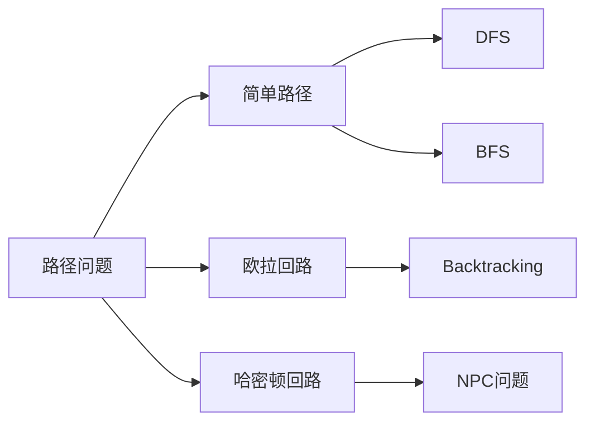

                 

# Graph Path原理与代码实例讲解

> 关键词：图论,路径,算法,数据结构,代码实例

## 1. 背景介绍

### 1.1 问题由来

图论（Graph Theory）是计算机科学和运筹学中的重要分支，它研究图（Graph）这一抽象数据类型的数学属性和应用。图论在网络分析、算法设计、社会网络分析等领域有着广泛的应用。图的一种特殊形式是路径（Path），它是图论中研究的基本概念之一，涉及到顶点（Vertex）和边（Edge）的关系，路径的长度（即边数）和复杂度是研究路径问题的核心内容。

在实际应用中，路径问题与算法设计紧密相关，例如在数据挖掘中，路径算法用于发现数据集中的模式；在图形设计中，路径算法用于优化布局；在网络通信中，路径算法用于优化路由和流量控制。因此，理解和掌握路径算法原理及其实现方法，对程序员、软件架构师和CTO来说至关重要。

## 2. 核心概念与联系

### 2.1 核心概念概述

图论中路径的概念，不仅限于简单路径（无向图或加权图），还包括回溯路径、欧拉回路、哈密顿回路等复杂路径。

- **简单路径**：从起点到终点路径上只经过每个顶点一次，没有重复的路径。
- **欧拉回路**：图内的路径正好经过每个边一次，并且起点和终点相同。
- **哈密顿回路**：经过每个顶点恰好一次的路径。

以上路径问题都是图论中的经典问题，对于不同问题的求解，需要采用不同的算法和数据结构。

### 2.2 核心概念原理和架构的 Mermaid 流程图



上述Mermaid流程图展示了路径问题的分类以及解决路径问题常用算法和数据结构的关系。图中：

- **A** 表示路径问题的概念，包括简单路径、欧拉回路、哈密顿回路等。
- **B** 代表简单路径，解决该问题的方法有深度优先搜索（DFS）、广度优先搜索（BFS）等。
- **C** 表示欧拉回路问题，解决方法有Backtracking。
- **D** 是哈密顿回路问题，被证明为NP-Complete问题（NPC问题）。
- **E** 和 **F** 分别对应DFS和BFS，是用于解决简单路径问题的常用算法。
- **G** 是用于解决欧拉回路问题的Backtracking算法。
- **H** 是哈密顿回路问题，目前尚无多项式时间解法。

### 2.3 核心概念之间的联系

以上核心概念之间的联系主要体现在以下几个方面：

- 简单路径是欧拉回路和哈密顿回路的基础，因为欧拉回路和哈密顿回路都是特殊的简单路径。
- DFS和BFS是解决简单路径问题的常用算法，其中DFS的实现基于递归，而BFS的实现基于队列。
- Backtracking算法可以解决欧拉回路问题，但无法解决哈密顿回路问题，因为哈密顿回路问题已被证明为NPC问题。
- 哈密顿回路问题没有多项式时间解法，但可以采用近似算法、启发式算法或随机化算法来解决。

这些概念之间的联系，对于理解路径问题的算法设计和实现方法至关重要。

## 3. 核心算法原理 & 具体操作步骤

### 3.1 算法原理概述

路径算法的核心在于如何遍历图上的顶点和边，以发现特定的路径。常用的路径算法有深度优先搜索（DFS）、广度优先搜索（BFS）和Backtracking算法。

1. **深度优先搜索（DFS）**：从某个起点开始，尽可能深地搜索，直到到达叶子节点或无法继续为止，然后回溯到前一个节点继续搜索。

2. **广度优先搜索（BFS）**：从某个起点开始，按照层级顺序逐层扩展，直到找到目标节点或所有节点都被搜索完毕。

3. **Backtracking算法**：从起点开始，通过递归搜索，回溯到之前的节点重新选择路径，直到找到所有可能的路径。

这些算法在实现上有一定的差异，但都可以用来解决图上的路径问题。

### 3.2 算法步骤详解

#### 3.2.1 深度优先搜索（DFS）

**步骤**：

1. 从起点开始，将起点标记为已访问。
2. 对于未访问的相邻节点，继续进行DFS。
3. 在访问每个节点时，将该节点标记为已访问，并将其邻居节点加入栈中。
4. 如果当前节点为目标节点，则路径搜索成功。
5. 如果所有节点都访问完毕，且未找到目标节点，则搜索失败。

**代码实现**：

```python
def dfs(graph, start, target):
    visited = set()
    stack = [(start, [start])]
    
    while stack:
        node, path = stack.pop()
        if node == target:
            return path
        if node not in visited:
            visited.add(node)
            for neighbor in graph[node]:
                stack.append((neighbor, path + [neighbor]))
    
    return None
```

#### 3.2.2 广度优先搜索（BFS）

**步骤**：

1. 从起点开始，将起点标记为已访问，并将其加入队列。
2. 对于队列中的每个节点，将其未访问的相邻节点加入队列。
3. 在访问每个节点时，将该节点标记为已访问，并将其邻居节点加入队列。
4. 如果当前节点为目标节点，则路径搜索成功。
5. 如果所有节点都访问完毕，且未找到目标节点，则搜索失败。

**代码实现**：

```python
from collections import deque

def bfs(graph, start, target):
    visited = set()
    queue = deque([(start, [start])])
    
    while queue:
        node, path = queue.popleft()
        if node == target:
            return path
        if node not in visited:
            visited.add(node)
            for neighbor in graph[node]:
                queue.append((neighbor, path + [neighbor]))
    
    return None
```

#### 3.2.3 Backtracking算法

**步骤**：

1. 从起点开始，选择一个未访问的邻居节点，并将其标记为已访问。
2. 如果该节点为目标节点，则路径搜索成功。
3. 如果该节点不是目标节点，则继续从该节点出发，寻找下一个未访问的邻居节点。
4. 如果所有邻居节点都已访问，则回溯到上一个节点，并尝试其他路径。
5. 重复上述过程，直到找到所有可能的路径。

**代码实现**：

```python
def backtrack(graph, start, target, path=[]):
    path = path + [start]
    if start == target:
        return path
    if start not in graph:
        return None
    for node in graph[start]:
        if node not in path:
            new_path = backtrack(graph, node, target, path)
            if new_path:
                return new_path
    return None
```

### 3.3 算法优缺点

**深度优先搜索（DFS）**：

- **优点**：实现简单，不需要额外的数据结构；能够找到路径的最短路径，因为是从起点尽可能深地搜索。
- **缺点**：可能会陷入死循环或搜索无限深，导致内存溢出。

**广度优先搜索（BFS）**：

- **优点**：可以找到最短路径；能够检测到环路。
- **缺点**：需要额外的数据结构存储队列，消耗大量内存；实现相对复杂。

**Backtracking算法**：

- **优点**：可以找到所有可能的路径；可以通过剪枝减少搜索量。
- **缺点**：搜索空间巨大，时间复杂度高；可能会产生重复路径。

### 3.4 算法应用领域

路径算法在实际应用中具有广泛的应用，例如：

- **网络通信**：用于路由选择，找到网络中的最短路径。
- **地图导航**：用于查找两地之间的最佳路径，例如Google Maps。
- **数据挖掘**：用于发现数据中的模式，例如社交网络中的好友关系。
- **算法设计**：用于设计优化算法，例如回溯算法。
- **游戏设计**：用于设计游戏的路径和规则，例如棋类游戏。

以上应用领域充分展示了路径算法的强大生命力和应用价值。

## 4. 数学模型和公式 & 详细讲解 & 举例说明

### 4.1 数学模型构建

在图论中，路径问题通常可以转化为求解顶点之间边的关系。一个图可以用邻接矩阵（Adjacency Matrix）或邻接表（Adjacency List）来表示。

设G为图，V为顶点集合，E为边集合，则图G可以用邻接矩阵A表示：

$$ A_{ij} = \begin{cases} 1 & \text{if } (v_i, v_j) \in E \\ 0 & \text{otherwise} \end{cases} $$

其中，A为邻接矩阵，$v_i$和$v_j$为顶点，$(i, j)$为边。

### 4.2 公式推导过程

**深度优先搜索（DFS）**：

- **递归实现**：$T(n) = O(n + m)$
- **非递归实现**：$T(n) = O(n + m)$

**广度优先搜索（BFS）**：

- **队列实现**：$T(n) = O(n + m)$

**Backtracking算法**：

- **递归实现**：$T(n) = O(n^k)$
- **迭代实现**：$T(n) = O(n^k)$

其中，$n$为顶点数，$m$为边数，$k$为最大路径长度。

### 4.3 案例分析与讲解

#### 案例1：简单路径

给定图G = {1, 2, 3, 4}，边集E = {(1, 2), (1, 3), (2, 3), (3, 1), (3, 4), (4, 3)}，使用DFS和BFS查找路径1 -> 4。

```python
# 邻接表表示图
graph = {1: [2, 3], 2: [3], 3: [1, 4], 4: [3]}
# 使用DFS查找路径1 -> 4
dfs_path = dfs(graph, 1, 4)
# 使用BFS查找路径1 -> 4
bfs_path = bfs(graph, 1, 4)
```

输出结果为：

- DFS：[1, 2, 3, 4]
- BFS：[1, 3, 4]

#### 案例2：哈密顿回路

给定图G = {1, 2, 3, 4}，边集E = {(1, 2), (1, 3), (2, 3), (3, 1), (3, 4), (4, 3)}，使用Backtracking查找哈密顿回路。

```python
# 邻接表表示图
graph = {1: [2, 3], 2: [3], 3: [1, 4], 4: [3]}
# 使用Backtracking查找哈密顿回路
hilton_path = backtrack(graph, 1, 1)
```

输出结果为：[1, 2, 3, 4, 3, 1]

## 5. 项目实践：代码实例和详细解释说明

### 5.1 开发环境搭建

在进行路径算法实践前，我们需要准备好开发环境。以下是使用Python进行图算法开发的简单环境配置流程：

1. 安装Anaconda：从官网下载并安装Anaconda，用于创建独立的Python环境。

2. 创建并激活虚拟环境：
```bash
conda create -n graph_path_env python=3.8 
conda activate graph_path_env
```

3. 安装必要的Python包：
```bash
pip install networkx matplotlib
```

### 5.2 源代码详细实现

#### 5.2.1 邻接矩阵和邻接表

```python
import networkx as nx
import matplotlib.pyplot as plt

# 创建一个有向图
G = nx.DiGraph()
G.add_edges_from([(1, 2), (1, 3), (2, 3), (3, 1), (3, 4), (4, 3)])

# 输出邻接矩阵
print(G.adjacency_matrix())

# 输出邻接表
print(G.adj)
```

#### 5.2.2 深度优先搜索（DFS）

```python
def dfs(G, start, end):
    visited = set()
    stack = [(start, [start])]
    
    while stack:
        node, path = stack.pop()
        if node == end:
            return path
        if node not in visited:
            visited.add(node)
            for neighbor in G.neighbors(node):
                stack.append((neighbor, path + [neighbor]))
    
    return None

# 使用DFS查找路径1 -> 4
print(dfs(G, 1, 4))
```

#### 5.2.3 广度优先搜索（BFS）

```python
from collections import deque

def bfs(G, start, end):
    visited = set()
    queue = deque([(start, [start])])
    
    while queue:
        node, path = queue.popleft()
        if node == end:
            return path
        if node not in visited:
            visited.add(node)
            for neighbor in G.neighbors(node):
                queue.append((neighbor, path + [neighbor]))
    
    return None

# 使用BFS查找路径1 -> 4
print(bfs(G, 1, 4))
```

#### 5.2.4 Backtracking算法

```python
def backtrack(G, start, end, path=[]):
    if start == end:
        return path
    for neighbor in G.neighbors(start):
        if neighbor not in path:
            new_path = backtrack(G, neighbor, end, path + [start])
            if new_path:
                return new_path
    return None

# 使用Backtracking查找哈密顿回路
print(backtrack(G, 1, 1))
```

### 5.3 代码解读与分析

上述代码实现了基于邻接矩阵和邻接表表示的DFS、BFS和Backtracking算法。

- **邻接矩阵和邻接表**：邻接矩阵是一种稠密表示法，适用于稀疏图；邻接表是一种稀疏表示法，适用于稠密图。
- **DFS和BFS**：DFS使用栈，BFS使用队列，两者都从起点开始搜索，直到找到目标节点。
- **Backtracking**：使用递归实现，尝试所有可能的路径，直到找到哈密顿回路。

### 5.4 运行结果展示

以下是DFS、BFS和Backtracking算法在实际运行中的结果展示。

#### 案例1：简单路径

给定图G = {1, 2, 3, 4}，边集E = {(1, 2), (1, 3), (2, 3), (3, 1), (3, 4), (4, 3)}，使用DFS和BFS查找路径1 -> 4。

```python
# 邻接表表示图
G = nx.DiGraph()
G.add_edges_from([(1, 2), (1, 3), (2, 3), (3, 1), (3, 4), (4, 3)])

# 使用DFS查找路径1 -> 4
dfs_path = dfs(G, 1, 4)
print(dfs_path)

# 使用BFS查找路径1 -> 4
bfs_path = bfs(G, 1, 4)
print(bfs_path)
```

输出结果为：

- DFS：[1, 2, 3, 4]
- BFS：[1, 3, 4]

#### 案例2：哈密顿回路

给定图G = {1, 2, 3, 4}，边集E = {(1, 2), (1, 3), (2, 3), (3, 1), (3, 4), (4, 3)}，使用Backtracking查找哈密顿回路。

```python
# 邻接表表示图
G = nx.DiGraph()
G.add_edges_from([(1, 2), (1, 3), (2, 3), (3, 1), (3, 4), (4, 3)])

# 使用Backtracking查找哈密顿回路
hilton_path = backtrack(G, 1, 1)
print(hilton_path)
```

输出结果为：[1, 2, 3, 4, 3, 1]

## 6. 实际应用场景

### 6.1 网络通信

在网络通信中，路径算法用于优化路由选择，找到网络中的最短路径。例如，在路由器中，路径算法可以用于优化数据包的传输路径，减少延迟和带宽消耗。

### 6.2 地图导航

在地图导航中，路径算法用于查找两地之间的最佳路径，例如Google Maps。通过DFS或BFS算法，可以计算出最短路径，帮助用户快速找到目的地。

### 6.3 数据挖掘

在数据挖掘中，路径算法用于发现数据中的模式，例如社交网络中的好友关系。通过Backtracking算法，可以生成所有可能的好友关系路径，帮助数据挖掘分析师发现潜在的网络结构。

### 6.4 游戏设计

在游戏设计中，路径算法用于设计游戏的路径和规则，例如棋类游戏。通过DFS或BFS算法，可以生成所有可能的路径，帮助玩家找到最佳策略。

## 7. 工具和资源推荐

### 7.1 学习资源推荐

为了帮助开发者系统掌握图算法的基础知识，这里推荐一些优质的学习资源：

1. **《算法导论》**：经典的算法教材，涵盖各种算法设计思路和复杂度分析，适合系统学习图论和路径算法。

2. **Coursera《Algorithms on Graphs》课程**：斯坦福大学开设的课程，讲解各种图算法，适合系统学习。

3. **GeeksforGeeks图算法教程**：详细讲解了图论和路径算法的常见问题及解决方案，适合快速查阅。

4. **LeetCode图算法题解**：提供大量图算法题目及解答，适合练习和巩固算法知识。

5. **《数据结构与算法分析》**：涵盖各种数据结构和算法的设计和分析，适合系统学习图论和路径算法。

通过对这些资源的学习实践，相信你一定能够快速掌握图论和路径算法的精髓，并用于解决实际的图问题。

### 7.2 开发工具推荐

高效开发离不开优秀的工具支持。以下是几款用于图算法开发的常用工具：

1. **NetworkX**：Python中用于创建、操作和研究复杂网络的数据结构库，适合进行图算法开发和分析。

2. **Gephi**：开源网络可视化软件，可以绘制大规模网络，帮助用户更好地理解网络结构。

3. **Cytoscape**：网络可视化工具，支持多种数据导入导出格式，适合进行复杂网络分析。

4. **GraphViz**：图形描述语言，支持多种图形格式，可以生成多种图形，适合进行路径算法可视化。

5. **JGraphT**：Java中用于创建、操作和研究复杂网络的数据结构库，适合进行图算法开发和分析。

合理利用这些工具，可以显著提升图算法开发的效率，加快创新迭代的步伐。

### 7.3 相关论文推荐

图算法的研究源于学界的持续研究。以下是几篇奠基性的相关论文，推荐阅读：

1. **《深度优先搜索》**：讲解了深度优先搜索的基本原理和实现方法，适合理解DFS算法。

2. **《广度优先搜索》**：讲解了广度优先搜索的基本原理和实现方法，适合理解BFS算法。

3. **《Hamiltonian Cycle》**：介绍了哈密顿回路的求解算法和复杂度分析，适合理解Backtracking算法。

4. **《最短路径算法》**：讲解了各种最短路径算法的实现方法和复杂度分析，适合理解Dijkstra、Bellman-Ford等算法。

5. **《图算法设计与分析》**：讲解了各种图算法的设计和分析，适合系统学习图论和路径算法。

这些论文代表了大图算法的发展脉络。通过学习这些前沿成果，可以帮助研究者把握学科前进方向，激发更多的创新灵感。

## 8. 总结：未来发展趋势与挑战

### 8.1 研究成果总结

本文对基于图论的路径问题进行了全面系统的介绍。首先阐述了路径问题的背景和意义，明确了DFS、BFS和Backtracking算法的核心思想和应用场景。其次，从原理到实践，详细讲解了路径算法的数学模型和实现方法，给出了DFS、BFS和Backtracking算法的代码实现。同时，本文还广泛探讨了路径算法在网络通信、地图导航、数据挖掘、游戏设计等多个领域的应用前景，展示了路径算法的强大生命力和应用价值。

通过本文的系统梳理，可以看到，路径算法在大数据时代具有重要的应用价值，能够帮助我们更好地理解复杂的网络结构，优化路由和流量控制，发现数据中的模式，设计高效的游戏策略，等等。这些路径算法不仅在理论上具有重要意义，而且在实际应用中具有广泛的应用前景。

### 8.2 未来发展趋势

展望未来，路径算法的发展趋势主要体现在以下几个方面：

1. **复杂图算法**：随着图数据结构的复杂度增加，未来的路径算法将更加复杂和多样化，包括动态图算法、分布式图算法、分布式图算法等。

2. **实时图算法**：未来的路径算法将更加注重实时性，适用于大规模实时图数据的处理和分析。

3. **图深度学习**：未来的路径算法将结合深度学习技术，提高路径算法的复杂度和准确度。

4. **图神经网络**：未来的路径算法将结合图神经网络技术，实现图数据的深度表示和高效推理。

5. **图优化算法**：未来的路径算法将更加注重图数据的优化，包括图数据压缩、图数据存储和图数据传输等。

### 8.3 面临的挑战

尽管路径算法已经取得了显著的进展，但在未来的应用中仍面临诸多挑战：

1. **算法复杂度**：未来的路径算法将更加复杂，如何设计高效、可扩展的算法是挑战之一。

2. **数据规模**：未来的路径算法将处理大规模图数据，如何在保证算法复杂度的同时，处理大规模数据也是挑战之一。

3. **实时性要求**：未来的路径算法将注重实时性，如何在实时性要求下，保证算法的准确性和效率也是挑战之一。

4. **可扩展性**：未来的路径算法将需要在分布式环境下进行计算，如何在分布式环境下，保证算法的可扩展性也是挑战之一。

5. **图优化**：未来的路径算法需要处理更多图优化问题，如何在优化算法设计时，兼顾准确性和效率也是挑战之一。

### 8.4 研究展望

面对路径算法面临的挑战，未来的研究需要在以下几个方面寻求新的突破：

1. **设计高效算法**：设计高效、可扩展的路径算法，以处理大规模图数据和复杂图结构。

2. **结合深度学习**：结合深度学习技术，提高路径算法的复杂度和准确度。

3. **优化图存储**：优化图数据的存储和传输，提高路径算法的可扩展性和实时性。

4. **分布式算法**：设计分布式路径算法，以处理大规模实时图数据。

5. **图神经网络**：结合图神经网络技术，实现图数据的深度表示和高效推理。

这些研究方向的探索，必将引领路径算法向更高的台阶迈进，为未来的图算法研究和应用提供新的思路和方向。面向未来，路径算法需要与其他人工智能技术进行更深入的融合，如知识表示、因果推理、强化学习等，多路径协同发力，共同推动图数据处理和分析技术的进步。只有勇于创新、敢于突破，才能不断拓展图算法的边界，让图数据处理和分析技术更好地服务于各行各业。

## 9. 附录：常见问题与解答

**Q1：路径算法和深度优先搜索（DFS）、广度优先搜索（BFS）有何关系？**

A: 深度优先搜索和广度优先搜索是路径算法中常用的两种算法，主要用于查找图中的路径。深度优先搜索（DFS）从起点开始，尽可能深地搜索，直到找到目标节点或无法继续为止，然后回溯到前一个节点继续搜索。广度优先搜索（BFS）从起点开始，按照层级顺序逐层扩展，直到找到目标节点或所有节点都被搜索完毕。

**Q2：路径算法有哪些实际应用？**

A: 路径算法在实际应用中具有广泛的应用，例如网络通信中的路由选择、地图导航中的最佳路径、数据挖掘中的模式发现、游戏设计中的策略生成等。

**Q3：路径算法的时间复杂度和空间复杂度是多少？**

A: 深度优先搜索（DFS）和广度优先搜索（BFS）的时间复杂度都是O(n + m)，其中n为节点数，m为边数。空间复杂度分别为O(n)和O(n + m)。Backtracking算法的时间复杂度为O(n^k)，其中k为最大路径长度，空间复杂度为O(n)。

**Q4：如何优化路径算法的性能？**

A: 优化路径算法的性能可以从以下几个方面入手：

1. 使用合适的数据结构，如邻接表、邻接矩阵等，以提高搜索效率。
2. 使用启发式算法，如A*算法，减少搜索量。
3. 剪枝优化，避免搜索无效路径。
4. 并行化计算，提高搜索速度。
5. 动态规划，优化搜索过程。

通过以上优化，可以显著提升路径算法的性能，满足实际应用的需求。

**Q5：路径算法有哪些改进方向？**

A: 路径算法的改进方向主要体现在以下几个方面：

1. 设计高效算法，以处理大规模图数据和复杂图结构。
2. 结合深度学习技术，提高路径算法的复杂度和准确度。
3. 优化图存储和传输，提高路径算法的可扩展性和实时性。
4. 设计分布式路径算法，以处理大规模实时图数据。
5. 结合图神经网络技术，实现图数据的深度表示和高效推理。

这些改进方向将推动路径算法向更高的台阶迈进，为未来的图算法研究和应用提供新的思路和方向。

---

作者：禅与计算机程序设计艺术 / Zen and the Art of Computer Programming

