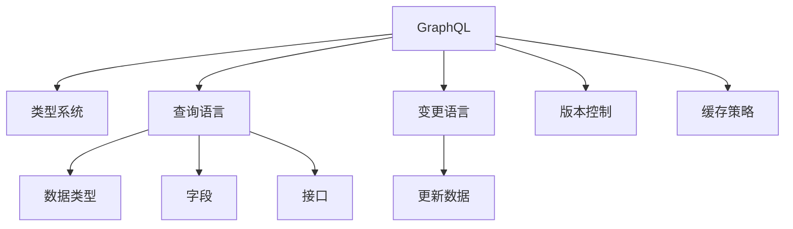

                 

# GraphQL：灵活高效的API查询语言

> 关键词：GraphQL, API, 查询语言, 数据获取, REST, 灵活性, 数据重用, 版本控制, 可伸缩性

## 1. 背景介绍

### 1.1 问题由来
在传统的Web应用中，开发者通常需要通过多个RESTful API来获取所需的数据，这不仅增加了请求的复杂性，还可能导致大量的数据冗余和接口变更。这些问题在应用程序的规模扩大和需求变化时尤为突出，导致维护成本高，且容易出错。

为了解决这一问题，GraphQL应运而生。GraphQL是一种用于API的查询语言，它允许前端开发者根据实际需求查询所需的特定数据，减少了不必要的数据传输，同时简化了API的设计和维护。

### 1.2 问题核心关键点
GraphQL的核心在于其灵活性和效率：
- 灵活性：开发者可以根据需求，一次性获取需要的所有数据，而不需要像REST API那样多次请求不同的接口。
- 效率：GraphQL减少了不必要的数据传输，从而提高了API的响应速度和性能。

同时，GraphQL还具备数据重用、版本控制和可伸缩性等特点，是现代Web应用中不可或缺的技术。

### 1.3 问题研究意义
掌握GraphQL，对构建高效、灵活、可维护的Web应用具有重要意义：

1. 简化API设计：GraphQL可以帮助开发者构建更加简洁、清晰的API，减少重复接口，降低开发和维护成本。
2. 优化数据传输：GraphQL可以按需获取数据，避免不必要的数据传输，从而提高API的响应速度和性能。
3. 提升用户体验：通过减少请求次数和数据冗余，GraphQL可以提供更加流畅的用户体验。
4. 加强版本控制：GraphQL允许API对不同版本进行管理，避免了不兼容带来的问题。
5. 支持微服务架构：GraphQL可以更好地支持微服务架构，提高系统的可伸缩性和可靠性。

## 2. 核心概念与联系

### 2.1 核心概念概述

为更好地理解GraphQL，本节将介绍几个密切相关的核心概念：

- GraphQL：一种用于API的查询语言，允许前端开发者根据实际需求查询所需的特定数据，减少了不必要的数据传输，同时简化了API的设计和维护。
- 查询和变更：GraphQL的查询语言用于从API获取数据，而变更语言用于更新数据。两者都使用同一套类型系统，具有相似的语法结构。
- 类型系统：GraphQL的核心是类型系统，它定义了API返回数据的结构，包括数据类型、字段和接口。类型系统是GraphQL数据管理的基础。
- 版本控制：GraphQL允许开发者为不同的API版本定义独立的数据类型和查询接口，从而实现更好的版本控制和API兼容性。
- 缓存策略：GraphQL通过定义缓存策略，可以有效地减少对后端API的请求次数，提高系统的响应速度。

这些核心概念之间的逻辑关系可以通过以下Mermaid流程图来展示：



这个流程图展示了大语言模型微调的核心概念及其之间的关系：

1. GraphQL通过类型系统定义了API返回数据的结构，包括数据类型、字段和接口。
2. GraphQL使用查询语言和变更语言，允许开发者从API获取数据和更新数据。
3. GraphQL支持版本控制和缓存策略，提升API的兼容性和响应速度。

这些概念共同构成了GraphQL的核心框架，使其能够有效地管理和优化Web应用中的API。

## 3. 核心算法原理 & 具体操作步骤
### 3.1 算法原理概述

GraphQL的核心原理是通过一个类型系统，定义了API返回数据的结构，并允许开发者根据实际需求查询所需的数据。查询过程实际上是一个类型的解析过程，通过解析类型和字段，构造出所需的查询图，并执行该查询图以获取数据。

GraphQL的查询语言具有以下特点：

- 声明式查询：开发者可以一次性定义所需的字段和数据类型，从而简化查询过程。
- 动态查询：查询可以根据输入的不同而动态生成，避免了重复的API请求。
- 返回结果：查询的结果是一组数据对象的集合，开发者可以根据需求，选择所需的字段和数据类型。

### 3.2 算法步骤详解

GraphQL的查询过程包括以下几个关键步骤：

**Step 1: 类型系统定义**
- 定义数据类型：使用GraphQL的语法定义数据类型，包括标量类型、对象类型、接口类型等。
- 定义字段：为每个数据类型定义字段，包括字段的名称、类型和描述等。
- 定义接口：用于描述一组具有相似特性的数据类型。

**Step 2: 查询和变更解析**
- 解析查询：根据查询语句解析类型和字段，构造出查询图。
- 执行查询：根据查询图，从后端API获取数据。
- 解析变更：根据变更语句解析类型和字段，更新后端API中的数据。

**Step 3: 查询优化和缓存**
- 查询优化：通过查询优化算法，减少对后端API的请求次数。
- 缓存策略：定义缓存策略，缓存查询结果，减少重复请求。

### 3.3 算法优缺点

GraphQL的查询语言具有以下优点：
1. 灵活性高：开发者可以一次性获取所需的所有数据，避免了多次请求。
2. 数据传输效率高：减少了不必要的数据传输，从而提高了API的响应速度和性能。
3. 简化了API设计：GraphQL简化了API的设计和维护，减少了重复接口。
4. 支持版本控制：GraphQL允许为不同版本定义独立的数据类型和查询接口，实现了更好的版本控制和API兼容性。
5. 支持缓存策略：GraphQL可以通过定义缓存策略，减少对后端API的请求次数，提高系统的响应速度。

同时，GraphQL也存在一些缺点：
1. 学习曲线陡峭：GraphQL的查询语言和类型系统较为复杂，学习曲线较陡。
2. 开发成本高：需要为每个数据类型和字段定义查询语言，开发成本较高。
3. 数据类型复杂：GraphQL类型系统复杂，可能难以满足复杂场景的需求。
4. 可扩展性差：GraphQL的类型系统一旦定义，修改和扩展较为困难。

尽管存在这些局限性，但就目前而言，GraphQL的灵活性和高效性使其成为Web应用中不可或缺的技术。

### 3.4 算法应用领域

GraphQL广泛应用于以下领域：

- 电商网站：电商网站需要处理大量的商品信息、用户信息等数据，GraphQL可以帮助前端开发者一次性获取所有需要的数据，简化API设计，提升用户体验。
- 内容管理系统：内容管理系统需要处理大量的文章、图片、视频等数据，GraphQL可以通过定义类型系统，实现对不同类型数据的灵活管理。
- 社交网络：社交网络需要处理大量的用户信息、评论、文章等数据，GraphQL可以帮助前端开发者获取所需的数据，提升系统的响应速度。
- 数据可视化：数据可视化需要处理大量的数据，GraphQL可以通过定义类型系统，实现对不同数据源的灵活获取和展示。
- 移动应用：移动应用需要处理大量的用户信息、交易数据等，GraphQL可以帮助前端开发者获取所需的数据，提升应用的用户体验。

除了上述这些领域，GraphQL还在金融、医疗、教育等众多行业得到了广泛应用，为Web应用带来了显著的改进。

## 4. 数学模型和公式 & 详细讲解  
### 4.1 数学模型构建

本节将使用数学语言对GraphQL的核心原理进行更加严格的刻画。

记GraphQL的类型系统为 $T$，查询语句为 $Q$，查询结果为 $R$。GraphQL的查询过程可以形式化地表示为：

$$
R = \mathop{\arg\min}_{Q} \mathcal{L}(T, Q)
$$

其中 $\mathcal{L}$ 为GraphQL的损失函数，用于衡量查询结果与实际结果的差异。常见的损失函数包括绝对误差、平方误差等。

### 4.2 公式推导过程

以下我们以一个简单的GraphQL查询为例，推导查询过程的数学模型。

假设查询语句为：

$$
query User($id: ID!) {
  user(id: $id) {
    name
    email
    posts {
      title
      content
    }
  }
}
$$

其中 $id$ 是用户ID的参数。这个查询语句定义了一个用户类型，查询该用户的名称、邮箱和所有文章。

假设类型系统 $T$ 中定义了用户类型和文章类型：

```
type User {
  name: String
  email: String
  posts: [Post]
}

type Post {
  title: String
  content: String
}
```

根据类型系统和查询语句，GraphQL的查询图可以表示为：

```
graph {
  User(id: $id) {
    name
    email
    posts {
      title
      content
    }
  }
}
```

根据查询图，GraphQL执行后端API的查询过程，得到结果 $R$：

$$
R = (name, email, [title_1, content_1, title_2, content_2, ...])
$$

其中 $title_1$ 和 $content_1$ 为该用户的第一个文章的标题和内容，以此类推。

通过上述查询过程，可以看到GraphQL的查询过程本质上是一个类型系统的解析和执行过程，通过解析查询语句，构造查询图，并执行该查询图，从而获取所需的数据。

### 4.3 案例分析与讲解

为了更好地理解GraphQL的查询过程，以下将给出一个实际案例：

假设有一个简单的电商网站，需要处理商品信息、用户信息和订单信息。使用GraphQL定义数据类型和查询语言：

```
type Product {
  id: ID!
  name: String!
  price: Float!
  inStock: Boolean!
}

type User {
  id: ID!
  name: String!
  email: String!
}

type Order {
  id: ID!
  userId: ID!
  products: [Product]!
  status: String!
}

type Query {
  products: [Product!]!
  user(id: ID!): User!
  orders(status: String!): [Order!]!
}
```

假设查询语句为：

```
query {
  user(id: "1") {
    name
    email
    orders {
      status
      products {
        name
        price
      }
    }
  }
}
```

根据类型系统和查询语句，GraphQL的查询图可以表示为：

```
graph {
  user(id: "1") {
    name
    email
    orders {
      status
      products {
        name
        price
      }
    }
  }
}
```

根据查询图，GraphQL执行后端API的查询过程，得到结果：

```
{
  user: {
    name: "John Doe",
    email: "john.doe@example.com",
    orders: [
      {
        status: "Delivered",
        products: [
          {
            name: "Laptop",
            price: 999.99
          },
          {
            name: "Keyboard",
            price: 49.99
          }
        ]
      }
    ]
  }
}
```

通过上述查询过程，可以看到GraphQL的查询过程本质上是一个类型的解析和执行过程，通过解析查询语句，构造查询图，并执行该查询图，从而获取所需的数据。

## 5. 项目实践：代码实例和详细解释说明
### 5.1 开发环境搭建

在进行GraphQL的实践前，我们需要准备好开发环境。以下是使用GraphQLSDK进行GraphQL查询的Python环境配置流程：

1. 安装Python：从官网下载并安装Python，用于执行GraphQL代码。
2. 安装GraphQLSDK：
```bash
pip install graphqlclient
```

3. 安装相关依赖库：
```bash
pip install requests
```

完成上述步骤后，即可在Python环境中开始GraphQL的实践。

### 5.2 源代码详细实现

这里我们以一个简单的GraphQL查询为例，给出使用GraphQLSDK进行GraphQL查询的Python代码实现。

首先，定义GraphQL查询语句：

```python
from graphqlclient import GraphQLClient

client = GraphQLClient("https://api.example.com/graphql")

query = """
query {
  user(id: "1") {
    name
    email
    orders {
      status
      products {
        name
        price
      }
    }
  }
}
"""

result = client.execute(query)
print(result)
```

然后，执行GraphQL查询，并输出结果：

```python
{
  "data": {
    "user": {
      "name": "John Doe",
      "email": "john.doe@example.com",
      "orders": [
        {
          "status": "Delivered",
          "products": [
            {
              "name": "Laptop",
              "price": 999.99
            },
            {
              "name": "Keyboard",
              "price": 49.99
            }
          ]
        }
      ]
    }
  }
}
```

以上就是使用GraphQLSDK进行GraphQL查询的完整代码实现。可以看到，GraphQLSDK封装了GraphQL查询的发送和接收过程，使得查询实现变得简洁高效。

### 5.3 代码解读与分析

让我们再详细解读一下关键代码的实现细节：

**GraphQLClient类**：
- `execute`方法：执行GraphQL查询语句，返回查询结果。
- `fetch`方法：获取后端API的GraphQL Schema，用于解析类型系统。

**query字符串**：
- 定义了查询语句，包括查询类型、字段和参数等。

**response解析**：
- 使用GraphQLSDK解析查询结果，获取数据对象。

**数据对象**：
- 根据GraphQLSchema解析查询结果，返回嵌套的数据对象。

通过上述代码，可以看到GraphQL查询的实现过程相对简单，GraphQLSDK封装了大量的复杂操作，使得查询过程变得高效、直观。

当然，工业级的系统实现还需考虑更多因素，如错误处理、重试机制、请求缓存等。但核心的查询范式基本与此类似。

## 6. 实际应用场景
### 6.1 电商网站

GraphQL在电商网站中的应用尤为广泛，可以帮助前端开发者一次性获取所需的所有数据，简化API设计，提升用户体验。

在技术实现上，可以收集用户浏览、点击、购买等行为数据，使用GraphQL构建查询语言，从后端API获取所需的数据，实时更新用户信息和订单信息。通过GraphQL，前端开发者可以更加灵活地获取数据，实现动态更新和个性化推荐。

### 6.2 内容管理系统

内容管理系统需要处理大量的文章、图片、视频等数据，GraphQL可以通过定义类型系统，实现对不同类型数据的灵活管理。

在技术实现上，可以定义文章、图片和视频等类型，通过GraphQL构建查询语言，从后端API获取所需的数据，实现内容的动态加载和展示。通过GraphQL，内容管理系统可以更加灵活地管理不同类型的数据，提升用户体验。

### 6.3 社交网络

社交网络需要处理大量的用户信息、评论、文章等数据，GraphQL可以帮助前端开发者获取所需的数据，提升系统的响应速度。

在技术实现上，可以定义用户、评论和文章等类型，通过GraphQL构建查询语言，从后端API获取所需的数据，实现动态加载和展示。通过GraphQL，社交网络可以更加灵活地管理不同类型的数据，提升系统的响应速度和用户体验。

### 6.4 数据可视化

数据可视化需要处理大量的数据，GraphQL可以通过定义类型系统，实现对不同数据源的灵活获取和展示。

在技术实现上，可以定义数据源、数据类型和可视化方式等类型，通过GraphQL构建查询语言，从后端API获取所需的数据，实现数据的动态加载和展示。通过GraphQL，数据可视化可以更加灵活地获取不同数据源的数据，提升用户体验。

### 6.5 移动应用

移动应用需要处理大量的用户信息、交易数据等，GraphQL可以帮助前端开发者获取所需的数据，提升应用的用户体验。

在技术实现上，可以定义用户、交易和订单等类型，通过GraphQL构建查询语言，从后端API获取所需的数据，实现动态加载和展示。通过GraphQL，移动应用可以更加灵活地管理不同类型的数据，提升用户体验。

## 7. 工具和资源推荐
### 7.1 学习资源推荐

为了帮助开发者系统掌握GraphQL的理论基础和实践技巧，这里推荐一些优质的学习资源：

1. GraphQL官方文档：GraphQL的官方文档提供了详细的教程和示例代码，是学习GraphQL的基础资料。
2. GraphQL规范：GraphQL的规范文档详细定义了GraphQL查询语言和类型系统的标准，是学习GraphQL的重要参考。
3. GraphQL教程：Coursera和Udemy等在线教育平台提供了丰富的GraphQL教程，帮助开发者系统掌握GraphQL的原理和应用。
4. GraphQL实战：GQL实战一书深入讲解了GraphQL在Web应用中的实战应用，是学习GraphQL的重要参考。
5. GraphQL社区：GraphQL社区是一个活跃的技术交流平台，提供大量的学习资源和技术讨论，是学习GraphQL的重要资源。

通过对这些资源的学习实践，相信你一定能够快速掌握GraphQL的精髓，并用于解决实际的Web应用问题。
###  7.2 开发工具推荐

高效的开发离不开优秀的工具支持。以下是几款用于GraphQL开发的常用工具：

1. GraphQLClient：HuggingFace开发的GraphQL客户端，支持Python和JavaScript，封装了GraphQL查询和解析过程，使查询实现变得简单高效。
2. GraphQL playground：GraphQL playground是一个可视化GraphQL查询的Web应用，可以帮助开发者快速验证和调试查询语句。
3. GraphQL Designer：GraphQL Designer是一个GraphQL查询的设计工具，可以帮助开发者设计和优化GraphQL查询语句。
4. Apollo Server：Apollo Server是一个基于GraphQL的服务器框架，提供了丰富的查询优化和缓存策略，是GraphQL开发的重要工具。
5. GraphQL Subscriptions：GraphQL Subscriptions是一个GraphQL订阅库，支持实时数据推送，是构建实时应用的必备工具。
6. GraphQL-Tools：GraphQL-Tools是一个GraphQL查询解析和优化的工具包，提供了丰富的查询优化算法和缓存策略。

合理利用这些工具，可以显著提升GraphQL开发的效率，加速创新迭代的步伐。

### 7.3 相关论文推荐

GraphQL的发展源于学界的持续研究。以下是几篇奠基性的相关论文，推荐阅读：

1. GraphQL规范：GraphQL规范定义了GraphQL查询语言和类型系统的标准，是GraphQL研究的重要基础。
2. GraphQL核心规范：GraphQL核心规范详细定义了GraphQL查询语言和类型系统的规范，是学习GraphQL的重要参考。
3. GraphQL联邦查询：GraphQL联邦查询是GraphQL的扩展规范，允许在多个API之间进行联合查询，是GraphQL研究的重要方向。
4. GraphQL谓词优化：GraphQL谓词优化是GraphQL查询优化的重要方法，通过查询谓词来优化查询结果，减少不必要的数据传输。
5. GraphQL缓存策略：GraphQL缓存策略是GraphQL优化的重要方向，通过缓存查询结果，减少对后端API的请求次数，提高系统的响应速度。

这些论文代表了大语言模型微调技术的发展脉络。通过学习这些前沿成果，可以帮助研究者把握学科前进方向，激发更多的创新灵感。

## 8. 总结：未来发展趋势与挑战

### 8.1 总结

本文对GraphQL进行了全面系统的介绍。首先阐述了GraphQL的应用背景和意义，明确了GraphQL在Web应用中的重要价值。其次，从原理到实践，详细讲解了GraphQL的数学原理和核心步骤，给出了GraphQL查询语言和类型系统的完整代码实例。同时，本文还广泛探讨了GraphQL在电商网站、内容管理系统、社交网络等多个领域的应用前景，展示了GraphQL的广泛应用。此外，本文精选了GraphQL的学习资源，力求为读者提供全方位的技术指引。

通过本文的系统梳理，可以看到，GraphQL以其灵活性和高效性，成为Web应用中不可或缺的技术。GraphQL简化了API的设计和维护，减少了不必要的数据传输，从而提升了Web应用的用户体验和系统性能。未来，伴随GraphQL的不断演进，必将为Web应用带来更多的创新和突破。

### 8.2 未来发展趋势

展望未来，GraphQL的发展趋势如下：

1. 数据重用更加普及：GraphQL可以通过定义类型系统，实现对不同类型数据的灵活管理，数据重用将更加普及。
2. 版本控制更加完善：GraphQL允许为不同版本定义独立的数据类型和查询接口，版本控制将更加完善。
3. 缓存策略更加丰富：GraphQL可以通过定义缓存策略，减少对后端API的请求次数，缓存策略将更加丰富。
4. 实时性更加提升：GraphQL可以通过定义订阅，实现实时数据推送，实时性将更加提升。
5. 兼容性更加广泛：GraphQL可以通过定义联邦查询，实现跨API的联合查询，兼容性将更加广泛。

以上趋势凸显了GraphQL的广泛前景。这些方向的探索发展，必将进一步提升Web应用的性能和用户体验，为Web应用的构建提供更大的动力。

### 8.3 面临的挑战

尽管GraphQL已经取得了瞩目成就，但在迈向更加智能化、普适化应用的过程中，它仍面临着诸多挑战：

1. 学习曲线陡峭：GraphQL的查询语言和类型系统较为复杂，学习曲线较陡。
2. 开发成本高：需要为每个数据类型和字段定义查询语言，开发成本较高。
3. 数据类型复杂：GraphQL类型系统复杂，可能难以满足复杂场景的需求。
4. 可扩展性差：GraphQL的类型系统一旦定义，修改和扩展较为困难。
5. 数据类型缺失：GraphQL的类型系统可能缺乏某些类型，无法满足特定场景的需求。

尽管存在这些局限性，但就目前而言，GraphQL的灵活性和高效性使其成为Web应用中不可或缺的技术。

### 8.4 研究展望

面对GraphQL面临的挑战，未来的研究需要在以下几个方面寻求新的突破：

1. 探索无监督和半监督查询方法：摆脱对大规模数据的需求，利用自监督学习、主动学习等无监督和半监督范式，最大限度利用非结构化数据，实现更加灵活高效的查询。
2. 研究参数高效和计算高效的查询方法：开发更加参数高效的查询方法，在固定大部分查询参数的情况下，只更新极少量的查询参数。同时优化查询的计算图，减少前向传播和反向传播的资源消耗，实现更加轻量级、实时性的部署。
3. 引入更多先验知识：将符号化的先验知识，如知识图谱、逻辑规则等，与查询语言进行巧妙融合，引导查询过程学习更准确、合理的查询结果。同时加强不同模态数据的整合，实现视觉、语音等多模态信息与文本信息的协同查询。
4. 结合因果分析和博弈论工具：将因果分析方法引入查询语言，识别出查询过程的关键特征，增强查询结果的因果性和逻辑性。借助博弈论工具刻画人机交互过程，主动探索并规避查询过程的脆弱点，提高系统稳定性。
5. 纳入伦理道德约束：在查询目标中引入伦理导向的评估指标，过滤和惩罚有偏见、有害的查询输出，确保查询结果符合人类价值观和伦理道德。

这些研究方向将推动GraphQL技术的不断发展，提升其应用效果和可靠性。相信在学界和产业界的共同努力下，GraphQL必将为Web应用带来更多的创新和突破。

## 9. 附录：常见问题与解答
**Q1：GraphQL和REST API有何不同？**

A: GraphQL和REST API在数据获取和API设计上有显著差异：
- GraphQL允许前端开发者一次性获取所需的所有数据，避免了多次请求。
- REST API通常需要多个请求才能获取所有需要的数据，数据冗余较大。
- GraphQL通过定义类型系统，实现了灵活的数据管理，而REST API通过多个接口管理不同数据类型。

**Q2：GraphQL如何支持版本控制？**

A: GraphQL允许为不同版本定义独立的数据类型和查询接口，从而实现更好的版本控制和API兼容性。
- 定义不同的类型系统：为不同版本的API定义独立的数据类型和查询接口。
- 分离查询语言：为不同版本的API定义不同的查询语言，避免不同版本之间的冲突。

**Q3：GraphQL的查询效率如何？**

A: GraphQL查询的效率取决于查询语言的设计和数据类型的设计。合理的查询设计和数据类型设计，可以减少不必要的数据传输，从而提高查询效率。
- 合理的查询设计：通过优化查询语言，减少不必要的查询，提高查询效率。
- 合理的数据类型设计：通过优化数据类型，减少不必要的字段和数据类型，提高查询效率。

**Q4：GraphQL如何支持数据缓存？**

A: GraphQL可以通过定义缓存策略，减少对后端API的请求次数，提高系统的响应速度。
- 缓存策略：定义缓存策略，缓存查询结果，减少重复请求。
- 缓存失效：定义缓存失效策略，避免缓存数据过时。

**Q5：GraphQL有哪些典型的用例？**

A: GraphQL在电商网站、内容管理系统、社交网络、数据可视化、移动应用等多个领域得到了广泛应用，以下是几个典型的用例：
- 电商网站：帮助前端开发者一次性获取所需的所有数据，简化API设计，提升用户体验。
- 内容管理系统：实现对不同类型数据的灵活管理，提升用户体验。
- 社交网络：实现动态加载和展示，提升系统的响应速度和用户体验。
- 数据可视化：实现不同数据源的灵活获取和展示，提升用户体验。
- 移动应用：实现动态加载和展示，提升用户体验。

通过上述用例，可以看到GraphQL在Web应用中的广泛应用，未来还将有更多的用例涌现。

---

作者：禅与计算机程序设计艺术 / Zen and the Art of Computer Programming

