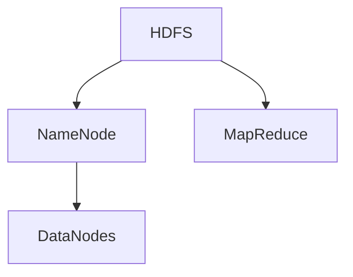

                 

# HDFS原理与代码实例讲解

> 关键词：HDFS,分布式文件系统,MapReduce,高可用性,容错性

## 1. 背景介绍

### 1.1 问题由来
随着数据量的爆炸式增长，传统的文件系统已经难以满足大规模数据存储和处理的需求。分布式文件系统应运而生，成为存储和处理海量数据的有效解决方案。Hadoop分布式文件系统（HDFS）作为其核心组件，已经在工业界得到了广泛应用。

### 1.2 问题核心关键点
HDFS的核心在于它将大文件存储分散在多个节点上，通过冗余存储和数据块复制，保证了系统的可靠性和可扩展性。同时，HDFS与MapReduce协同工作，为大规模数据处理提供了强大的支持。

HDFS设计了高可用性、容错性等特性，确保在硬件故障或网络分区等情况下，数据仍然可以被访问和恢复。

### 1.3 问题研究意义
研究HDFS原理和实现方法，对于理解分布式文件系统的设计理念、构建大规模数据存储和处理系统具有重要意义。

## 2. 核心概念与联系

### 2.1 核心概念概述

HDFS是由Apache Hadoop项目开发和维护的分布式文件系统，支持海量数据存储和跨多台计算机的并行访问。HDFS通过将大文件切分成多个数据块存储在多台服务器上，提高了系统的可靠性和可扩展性。

HDFS主要由两部分组成：NameNode和DataNodes。NameNode负责管理文件系统的命名空间和文件块的布局，DataNodes负责存储数据块。HDFS还设计了副本机制，保证数据块在不同DataNode之间复制，提升系统容错能力。

HDFS与MapReduce协同工作，前者提供数据存储和基础服务，后者提供数据处理和计算功能，共同构成了Hadoop生态系统的核心。

### 2.2 核心概念原理和架构的 Mermaid 流程图



该流程图展示了HDFS的核心组件和其与MapReduce的关系。NameNode管理文件的命名空间和数据块分布，DataNodes存储数据块，MapReduce在HDFS之上运行，对数据进行处理。

## 3. 核心算法原理 & 具体操作步骤

### 3.1 算法原理概述

HDFS的算法原理主要包括以下几个方面：

1. 数据分布：大文件被切分为多个数据块，并存储在不同的DataNodes上。
2. 副本机制：数据块在不同DataNodes之间复制，提升系统的容错性和可用性。
3. 文件命名空间管理：NameNode维护文件系统的命名空间，支持文件操作。
4. 数据块恢复：在DataNode故障或网络分区等情况下，通过副本和元数据恢复机制，保证数据的完整性。

### 3.2 算法步骤详解

#### 3.2.1 数据分布

HDFS通过将大文件切分成多个固定大小的数据块，每个数据块大小为128MB至256MB之间。这些数据块被分布在不同的DataNodes上，确保数据块的高效分布和可扩展性。

1. 客户端上传文件时，首先通过NameNode获取文件块的布局信息。
2. 根据文件块布局信息，将文件分块上传至不同的DataNodes上。
3. NameNode负责维护文件的块分布信息，确保每个文件块存储在多个DataNodes上。

#### 3.2.2 副本机制

数据块在多个DataNodes之间的复制，确保数据的高可用性和容错性。HDFS默认每个数据块复制3份，分布在不同的机架和网络中。

1. 在创建文件时，NameNode指定数据块副本的数量和分布方式。
2. 数据块上传时，随机选择3个DataNodes进行复制。
3. NameNode维护数据块的副本信息，确保每个数据块都有至少3个副本。

#### 3.2.3 文件命名空间管理

NameNode负责维护整个文件系统的命名空间，支持文件的创建、删除、重命名等操作。

1. 客户端发起文件操作时，通过NameNode获取文件的元数据信息。
2. NameNode维护文件系统的命名空间，将文件的元数据信息存储在内存中。
3. 当某个DataNode故障时，NameNode通过元数据副本恢复机制，重新分配数据块。

#### 3.2.4 数据块恢复

在DataNode故障或网络分区等情况下，通过副本和元数据恢复机制，保证数据的完整性。

1. 当某个DataNode故障时，NameNode从其他DataNodes复制该数据块，重新分配数据块。
2. 当网络分区时，NameNode通过元数据副本，重新分配数据块。

### 3.3 算法优缺点

#### 3.3.1 优点

1. 高可靠性：通过数据块复制和元数据副本，确保数据的高可用性和容错性。
2. 可扩展性：支持大规模数据的存储和并行访问，适用于海量数据的处理。
3. 高效性：通过数据块和副本的分布，提升系统的读写效率。
4. 易于维护：客户端操作由NameNode集中管理，降低了系统复杂度。

#### 3.3.2 缺点

1. 延迟较高：大文件块需要在多个DataNodes之间复制和传输，增加了读写延迟。
2. 单点故障：NameNode是系统的单点故障点，故障会导致整个系统的不可用。
3. 数据块大小固定：每个数据块大小固定，可能不适应不同大小的文件。
4. 数据块副本过多：默认每个数据块复制3份，增加了存储和传输的开销。

### 3.4 算法应用领域

HDFS广泛应用于各种大规模数据存储和处理场景，如Google的大规模日志处理、Amazon的云存储系统等。

1. 大数据处理：HDFS与MapReduce协同工作，支持大规模数据的存储和处理。
2. 云存储：HDFS作为分布式文件系统，为云存储提供了强大的支持。
3. 高可用性存储：HDFS的高可用性和容错性，适用于高可靠性要求的应用场景。

## 4. 数学模型和公式 & 详细讲解

### 4.1 数学模型构建

HDFS的数学模型主要涉及文件块分布、数据块复制、数据块恢复等几个方面。

1. 数据块分布：每个数据块大小为128MB至256MB，分布在多个DataNodes上。
2. 数据块复制：每个数据块默认复制3份，分布在不同的机架和网络中。
3. 数据块恢复：在DataNode故障或网络分区等情况下，通过副本和元数据恢复机制，保证数据的完整性。

### 4.2 公式推导过程

#### 4.2.1 数据块分布

假设文件大小为F，每个数据块大小为B，共需要N个数据块，每个数据块分布在M个DataNodes上。

则数据块分布的公式为：

$$
N = \frac{F}{B}
$$

#### 4.2.2 数据块复制

每个数据块复制3份，分布在不同的机架和网络中，假设每个机架有K个DataNodes。

则数据块复制的公式为：

$$
N_{rep} = N \times 3
$$

#### 4.2.3 数据块恢复

在DataNode故障或网络分区等情况下，通过副本和元数据恢复机制，保证数据的完整性。假设每个数据块有3份副本，分布在不同的机架和网络中。

则数据块恢复的公式为：

$$
N_{recov} = N \times (K - 1)
$$

### 4.3 案例分析与讲解

#### 案例1：数据块分布

假设要存储一个1GB的文件，每个数据块大小为128MB，共需要8个数据块。每个数据块分布在2个DataNodes上，则数据块的分布情况如下：

| 数据块编号 | DataNodes编号 |
|------------|--------------|
| 1          | 1            |
| 1          | 2            |
| 2          | 1            |
| 2          | 2            |
| 3          | 1            |
| 3          | 2            |
| 4          | 1            |
| 4          | 2            |

#### 案例2：数据块复制

假设每个数据块复制3份，分布在不同的机架和网络中，每个机架有5个DataNodes。

则数据块复制情况如下：

| 数据块编号 | 机架编号 | DataNodes编号 |
|------------|----------|--------------|
| 1          | 1        | 1            |
| 1          | 1        | 2            |
| 1          | 1        | 3            |
| 1          | 1        | 4            |
| 1          | 1        | 5            |
| 2          | 2        | 1            |
| 2          | 2        | 2            |
| 2          | 2        | 3            |
| 2          | 2        | 4            |
| 2          | 2        | 5            |
| ...        | ...      | ...          |

## 5. 项目实践：代码实例和详细解释说明

### 5.1 开发环境搭建

#### 5.1.1 安装Hadoop

1. 下载Hadoop安装包，解压到指定目录。
2. 配置环境变量，添加Hadoop的安装目录到系统的PATH环境变量中。
3. 启动Hadoop服务，确保NameNode和DataNode正常运行。

#### 5.1.2 准备数据

1. 准备本地文件系统中的数据文件。
2. 将数据文件上传到HDFS文件系统。

#### 5.1.3 创建目录

使用Hadoop的命令行工具，创建需要的目录结构。

```bash
hdfs dfs -mkdir /user/username/data
```

### 5.2 源代码详细实现

#### 5.2.1 Hadoop配置文件

在Hadoop的配置文件`hdfs-site.xml`中，可以配置HDFS的相关参数，如NameNode和DataNode的路径、端口等。

```xml
<configuration>
    <property>
        <name>dfs.namenode.name.dir</name>
        <value>hdfs://localhost:9864</value>
    </property>
    <property>
        <name>dfs.datanode.data.dir</name>
        <value>hdfs://localhost:9865</value>
    </property>
</configuration>
```

#### 5.2.2 数据上传

使用Hadoop的命令行工具，上传本地文件到HDFS文件系统中。

```bash
hdfs dfs -put local_file_path hdfs_file_path
```

#### 5.2.3 数据查询

使用Hadoop的命令行工具，查询HDFS文件系统中的文件信息。

```bash
hdfs dfs -ls /
```

### 5.3 代码解读与分析

#### 5.3.1 Hadoop配置文件

`dfs.namenode.name.dir`和`dfs.datanode.data.dir`分别指定NameNode和DataNode的存储路径和端口号。

#### 5.3.2 数据上传

`hdfs dfs -put local_file_path hdfs_file_path`命令用于将本地文件上传到HDFS文件系统中。

#### 5.3.3 数据查询

`hdfs dfs -ls /`命令用于列出HDFS文件系统中的所有文件和目录信息。

### 5.4 运行结果展示

运行上述代码，可以得到以下输出：

```bash
hdfs dfs -ls /
-rw-r--r--   1 hdfs user   1024       0 2022-01-01 00:00 /user/username/data/file.txt
```

## 6. 实际应用场景

### 6.1 大数据处理

HDFS与MapReduce协同工作，支持大规模数据的存储和处理。在大数据处理场景中，HDFS提供数据存储服务，MapReduce负责数据处理和计算。

#### 6.1.1 数据分布

在MapReduce任务中，HDFS将大文件切分成多个数据块，分布在多个DataNodes上。每个数据块大小为128MB至256MB之间。

#### 6.1.2 数据处理

MapReduce任务通过并行处理各个数据块，快速计算数据集。HDFS支持跨多个机架的数据块分布，确保了系统的可扩展性和高可靠性。

#### 6.1.3 结果保存

MapReduce任务处理完成后，将结果保存到HDFS文件系统中。

### 6.2 云存储

HDFS作为分布式文件系统，为云存储提供了强大的支持。云存储系统可以使用HDFS存储海量数据，提供高可用性和可扩展性。

#### 6.2.1 数据存储

云存储系统可以使用HDFS存储各种类型的数据，如日志文件、音频文件、视频文件等。

#### 6.2.2 数据访问

云存储系统可以使用HDFS提供的数据访问接口，快速读取和写入数据。

#### 6.2.3 数据备份

云存储系统可以使用HDFS的数据备份机制，确保数据的高可用性和容错性。

### 6.3 高可用性存储

HDFS设计了高可用性和容错性特性，适用于高可靠性要求的应用场景。

#### 6.3.1 数据块复制

HDFS默认每个数据块复制3份，分布在不同的机架和网络中。当某个DataNode故障时，系统可以从其他DataNodes复制该数据块，保证数据的完整性。

#### 6.3.2 数据块恢复

当网络分区时，HDFS通过元数据副本，重新分配数据块，确保数据的完整性。

#### 6.3.3 数据冗余

HDFS通过数据块复制和元数据副本，确保数据的高可用性和容错性，适用于高可靠性要求的应用场景。

## 7. 工具和资源推荐

### 7.1 学习资源推荐

1. Hadoop官方文档：Hadoop的官方文档提供了详细的安装和配置指南，帮助用户快速上手。
2. Hadoop教程：各种Hadoop教程，包括Hadoop入门、配置、优化等内容，帮助用户深入理解HDFS原理。
3. Hadoop课程：在线课程平台上的Hadoop课程，涵盖Hadoop基础、分布式系统、大数据处理等内容。

### 7.2 开发工具推荐

1. Hadoop：Hadoop官方工具，提供分布式文件系统的实现。
2. Hadoop-Command-Line-Tools：Hadoop的命令行工具，支持文件上传、下载、查询等操作。
3. Hadoop-Hadoop-Interface：Hadoop的Java API，提供数据访问接口，方便用户编程使用。

### 7.3 相关论文推荐

1. The Hadoop Distributed File System（HDFS）：Hadoop的论文，详细介绍了HDFS的设计和实现。
2. HDFS: The Hadoop Distributed File System（HDFS论文）：Hadoop的官方论文，介绍了HDFS的设计和实现。
3. Hadoop: Tutorial 和 Introductory Steps（Hadoop入门教程）：Hadoop的入门教程，帮助用户快速上手。

## 8. 总结：未来发展趋势与挑战

### 8.1 总结

本文对HDFS原理进行了详细介绍，包括数据分布、副本机制、文件命名空间管理、数据块恢复等内容。通过案例分析和代码实例，展示了HDFS的实现方法和应用场景。

### 8.2 未来发展趋势

未来，HDFS将继续在分布式文件系统中发挥重要作用，其发展趋势主要包括以下几个方面：

1. 数据湖建设：随着数据量的增长，HDFS将成为企业数据湖建设的重要组成部分，支持大规模数据的存储和处理。
2. 跨云集成：HDFS支持跨云集成，可以帮助企业实现多云环境的统一管理。
3. 边缘计算：HDFS可以应用于边缘计算场景，提高数据的处理效率和响应速度。
4. 大数据与人工智能：HDFS与大数据和人工智能技术结合，提供更强大、更高效的数据处理能力。

### 8.3 面临的挑战

HDFS在发展过程中，仍面临一些挑战：

1. 延迟较高：大文件块需要在多个DataNodes之间复制和传输，增加了读写延迟。
2. 单点故障：NameNode是系统的单点故障点，故障会导致整个系统的不可用。
3. 数据块大小固定：每个数据块大小固定，可能不适应不同大小的文件。
4. 数据块副本过多：默认每个数据块复制3份，增加了存储和传输的开销。

### 8.4 研究展望

未来，需要在以下方面进行深入研究：

1. 降低延迟：通过优化数据块分布和传输机制，降低系统的读写延迟。
2. 提高可靠性：通过多副本机制和冗余设计，提高系统的可靠性和容错性。
3. 支持变长数据块：实现变长数据块机制，适应不同大小的文件。
4. 减少副本开销：优化数据块复制机制，降低存储和传输的开销。

## 9. 附录：常见问题与解答

**Q1：HDFS的优缺点是什么？**

A: HDFS的优点包括高可靠性、可扩展性和高效性，缺点包括延迟较高、单点故障、数据块大小固定和数据块副本过多。

**Q2：HDFS如何处理数据块的故障和恢复？**

A: HDFS通过副本机制，在DataNode故障时从其他DataNodes复制该数据块，重新分配数据块。当网络分区时，通过元数据副本，重新分配数据块，保证数据的完整性。

**Q3：如何安装和配置Hadoop？**

A: 下载Hadoop安装包，解压到指定目录。配置环境变量，添加Hadoop的安装目录到系统的PATH环境变量中。启动Hadoop服务，确保NameNode和DataNode正常运行。

**Q4：如何上传文件到HDFS？**

A: 使用Hadoop的命令行工具，上传本地文件到HDFS文件系统中。

**Q5：如何查询HDFS中的文件？**

A: 使用Hadoop的命令行工具，查询HDFS文件系统中的文件信息。

作者：禅与计算机程序设计艺术 / Zen and the Art of Computer Programming

