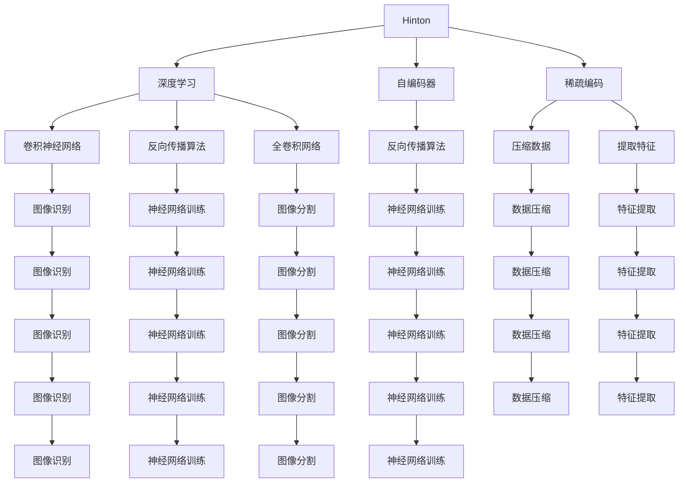

                 

# Hinton、LeCun、Bengio：AI算法的先驱

> 关键词：深度学习，神经网络，卷积神经网络(CNN)，循环神经网络(RNN)，自编码器(AE)，反向传播算法，反向传播算法，损失函数，梯度下降，TensorFlow，PyTorch

## 1. 背景介绍

在人工智能发展的百年长河中，Hinton、LeCun和Bengio三巨头无疑是贡献最为突出的三驾马车。他们分别从深度学习、卷积神经网络、循环神经网络、自编码器等多个角度，对人工智能算法进行了开创性的研究，奠定了现代AI算法的基石。本篇文章将全面梳理三位先驱的研究轨迹，并分析其背后的思想原理和实际应用。

## 2. 核心概念与联系

### 2.1 核心概念概述

Hinton、LeCun和Bengio三位先驱在各自的领域中均有大量的杰出贡献。以下将简要介绍他们的核心概念，并阐明这些概念之间的联系。

#### Hinton的贡献
- **深度学习**：Hinton提出了反向传播算法，使得神经网络可以被高效训练，从而掀起了深度学习的浪潮。
- **自编码器(Autoencoder)**：Hinton是自编码器的发明人之一，该技术通过重构输入来降低数据维度和学习特征表示。
- **稀疏编码(Sparse Coding)**：Hinton还研究了稀疏编码，用于压缩数据和提取特征。

#### LeCun的贡献
- **卷积神经网络(CNN)**：LeCun在图像识别领域有着杰出的贡献，他提出的卷积神经网络被广泛应用于计算机视觉任务中。
- **反向传播算法(Backpropagation)**：LeCun与Rumelhart共同发明了反向传播算法，该算法是现代神经网络训练的核心。
- **全卷积网络(Fully Convolutional Network, FCN)**：LeCun还提出了全卷积网络，用于图像分割和语义理解。

#### Bengio的贡献
- **循环神经网络(RNN)**：Bengio提出了循环神经网络，使神经网络可以处理序列数据，如自然语言处理和语音识别。
- **长短时记忆网络(LSTM)**：Bengio和Hochreiter共同发明了LSTM，解决了RNN的长期依赖问题。
- **自回归模型(Autoregressive Model)**：Bengio还研究了自回归模型，用于序列数据的生成和预测。

### 2.2 核心概念原理和架构的 Mermaid 流程图(Mermaid 流程节点中不要有括号、逗号等特殊字符)



该流程图展示了Hinton、LeCun和Bengio三位先驱的核心概念及其相互联系。其中，深度学习和反向传播算法是共同的基础，自编码器和稀疏编码是Hinton的独特贡献，卷积神经网络、全卷积网络和图像识别是LeCun的主要工作，而循环神经网络和长短时记忆网络则是Bengio的重要发明。这些概念之间的交叉和整合，推动了人工智能算法的发展和应用。

## 3. 核心算法原理 & 具体操作步骤

### 3.1 算法原理概述

#### Hinton的深度学习

Hinton提出的深度学习算法通过多层次的非线性变换，可以学习到更加复杂的特征表示。深度学习模型的核心思想是通过反向传播算法，计算梯度并更新模型参数，从而最小化损失函数。

Hinton定义的损失函数通常是交叉熵，用于衡量预测值与真实值之间的差异。深度学习模型通过梯度下降等优化算法，不断调整参数，使得损失函数最小化。

#### LeCun的卷积神经网络

LeCun的卷积神经网络（CNN）是专门设计用于处理图像数据的网络结构。卷积层通过滑动卷积核提取特征，池化层用于减小特征图尺寸，全连接层进行分类或回归。

CNN的核心是卷积层，它通过局部连接和共享权重的方式，有效地减少了参数数量，并提升了模型的泛化能力。卷积操作在图像数据中具有平移不变性，可以自动提取图像的局部特征。

#### Bengio的循环神经网络

Bengio提出的循环神经网络（RNN）可以处理序列数据，如文本和语音。RNN通过在每个时间步传递隐藏状态，实现了序列信息的记忆和传递。长短时记忆网络（LSTM）进一步解决了RNN的长期依赖问题，能够更好地处理长序列数据。

Bengio定义的损失函数通常是序列分类或回归任务中的交叉熵，用于衡量模型预测值与真实值之间的差异。LSTM通过门控机制控制信息的流动，避免了长期依赖的梯度消失问题。

### 3.2 算法步骤详解

#### Hinton的深度学习

1. **数据准备**：收集并标注训练数据集。
2. **模型定义**：使用深度学习框架（如TensorFlow、PyTorch）定义多层神经网络模型。
3. **损失函数定义**：定义交叉熵等损失函数。
4. **反向传播**：计算损失函数对模型参数的梯度，并通过反向传播算法更新参数。
5. **优化算法**：使用梯度下降等优化算法，最小化损失函数。
6. **模型评估**：在测试集上评估模型的性能。

#### LeCun的卷积神经网络

1. **数据准备**：准备图像数据集，并进行预处理（如归一化、标准化）。
2. **模型定义**：定义卷积神经网络模型，包括卷积层、池化层和全连接层。
3. **损失函数定义**：定义交叉熵等损失函数。
4. **反向传播**：计算损失函数对模型参数的梯度，并通过反向传播算法更新参数。
5. **优化算法**：使用梯度下降等优化算法，最小化损失函数。
6. **模型评估**：在测试集上评估模型的性能。

#### Bengio的循环神经网络

1. **数据准备**：准备序列数据集，并进行预处理（如序列填充、标准化）。
2. **模型定义**：定义循环神经网络模型，包括LSTM等网络结构。
3. **损失函数定义**：定义交叉熵等损失函数。
4. **反向传播**：计算损失函数对模型参数的梯度，并通过反向传播算法更新参数。
5. **优化算法**：使用梯度下降等优化算法，最小化损失函数。
6. **模型评估**：在测试集上评估模型的性能。

### 3.3 算法优缺点

#### Hinton的深度学习

优点：
- 能够学习到复杂的特征表示。
- 适用于各种类型的非结构化数据。

缺点：
- 需要大量的标注数据。
- 模型容易过拟合。

#### LeCun的卷积神经网络

优点：
- 处理图像数据效果优异。
- 参数共享减少计算复杂度。

缺点：
- 结构复杂，训练困难。
- 对噪声敏感。

#### Bengio的循环神经网络

优点：
- 能够处理序列数据。
- 具备长时记忆能力。

缺点：
- 容易发生梯度消失问题。
- 参数数量较多，计算复杂度高。

### 3.4 算法应用领域

#### Hinton的深度学习

深度学习被广泛应用于计算机视觉、自然语言处理、语音识别等领域。深度学习模型在ImageNet等大规模数据集上取得了显著的成果，如AlexNet、VGG、ResNet等经典模型。

#### LeCun的卷积神经网络

卷积神经网络在计算机视觉领域表现卓越，广泛应用于图像分类、目标检测、图像分割等任务。卷积神经网络还应用于医疗影像分析、自动驾驶等新兴领域。

#### Bengio的循环神经网络

循环神经网络在自然语言处理和语音识别领域有着广泛的应用。LSTM在机器翻译、语音识别、文本生成等任务上取得了显著的成果。

## 4. 数学模型和公式 & 详细讲解 & 举例说明

### 4.1 数学模型构建

#### Hinton的深度学习

Hinton定义的深度学习模型由多个隐藏层构成，每一层通过激活函数进行非线性变换。模型输出通过softmax函数转化为概率分布。

假设输入为$x$，输出为$y$，模型参数为$\theta$，损失函数为$L$，则反向传播算法更新参数的公式为：

$$
\frac{\partial L}{\partial \theta} = \frac{\partial L}{\partial y} \frac{\partial y}{\partial z} \frac{\partial z}{\partial x} \frac{\partial x}{\partial \theta}
$$

其中，$\frac{\partial y}{\partial z}$表示输出层对隐藏层的梯度，$\frac{\partial z}{\partial x}$表示隐藏层对输入层的梯度。

#### LeCun的卷积神经网络

LeCun定义的卷积神经网络模型由多个卷积层和池化层构成，最终输出通过全连接层进行分类或回归。卷积层使用卷积核进行特征提取，池化层减小特征图尺寸。

假设输入为$x$，输出为$y$，模型参数为$\theta$，损失函数为$L$，则反向传播算法更新参数的公式为：

$$
\frac{\partial L}{\partial \theta} = \frac{\partial L}{\partial y} \frac{\partial y}{\partial z} \frac{\partial z}{\partial x} \frac{\partial x}{\partial \theta}
$$

其中，$\frac{\partial y}{\partial z}$表示输出层对隐藏层的梯度，$\frac{\partial z}{\partial x}$表示隐藏层对输入层的梯度。

#### Bengio的循环神经网络

Bengio定义的循环神经网络模型通过隐藏状态$h$传递信息，每个时间步的输出取决于前一个时间步的隐藏状态和当前输入。

假设输入为$x$，隐藏状态为$h$，输出为$y$，模型参数为$\theta$，损失函数为$L$，则反向传播算法更新参数的公式为：

$$
\frac{\partial L}{\partial \theta} = \frac{\partial L}{\partial y} \frac{\partial y}{\partial h} \frac{\partial h}{\partial x} \frac{\partial x}{\partial \theta}
$$

其中，$\frac{\partial y}{\partial h}$表示输出层对隐藏状态的梯度，$\frac{\partial h}{\partial x}$表示隐藏状态对输入的梯度。

### 4.2 公式推导过程

#### Hinton的深度学习

假设输入为$x$，输出为$y$，模型参数为$\theta$，损失函数为$L$，则反向传播算法更新参数的公式为：

$$
\frac{\partial L}{\partial \theta} = \frac{\partial L}{\partial y} \frac{\partial y}{\partial z} \frac{\partial z}{\partial x} \frac{\partial x}{\partial \theta}
$$

其中，$\frac{\partial y}{\partial z}$表示输出层对隐藏层的梯度，$\frac{\partial z}{\partial x}$表示隐藏层对输入层的梯度。

对于每层神经元的激活函数$f$，其梯度$\frac{\partial L}{\partial z}$可以推导为：

$$
\frac{\partial L}{\partial z} = \frac{\partial L}{\partial y} \frac{\partial y}{\partial z} \frac{\partial z}{\partial f} \frac{\partial f}{\partial x}
$$

将以上公式代入深度学习模型中，可以逐步计算每层神经元的梯度，并更新模型参数。

#### LeCun的卷积神经网络

假设输入为$x$，输出为$y$，模型参数为$\theta$，损失函数为$L$，则反向传播算法更新参数的公式为：

$$
\frac{\partial L}{\partial \theta} = \frac{\partial L}{\partial y} \frac{\partial y}{\partial z} \frac{\partial z}{\partial x} \frac{\partial x}{\partial \theta}
$$

其中，$\frac{\partial y}{\partial z}$表示输出层对隐藏层的梯度，$\frac{\partial z}{\partial x}$表示隐藏层对输入层的梯度。

对于卷积层的梯度，可以表示为：

$$
\frac{\partial L}{\partial w} = \frac{\partial L}{\partial z} * \frac{\partial z}{\partial x} * \frac{\partial x}{\partial w}
$$

其中，$w$表示卷积核参数。

#### Bengio的循环神经网络

假设输入为$x$，隐藏状态为$h$，输出为$y$，模型参数为$\theta$，损失函数为$L$，则反向传播算法更新参数的公式为：

$$
\frac{\partial L}{\partial \theta} = \frac{\partial L}{\partial y} \frac{\partial y}{\partial h} \frac{\partial h}{\partial x} \frac{\partial x}{\partial \theta}
$$

其中，$\frac{\partial y}{\partial h}$表示输出层对隐藏状态的梯度，$\frac{\partial h}{\partial x}$表示隐藏状态对输入的梯度。

对于LSTM网络的梯度，可以表示为：

$$
\frac{\partial L}{\partial w_i} = \frac{\partial L}{\partial h} \left( \frac{\partial h}{\partial x_i} \frac{\partial x_i}{\partial w_i} \right)
$$

其中，$w_i$表示LSTM的权重参数。

### 4.3 案例分析与讲解

#### Hinton的深度学习

假设我们有一个简单的深度学习模型，包含两个隐藏层。输入$x$为二维向量，输出$y$为二分类标签。损失函数为交叉熵。模型参数包括隐藏层权重$w_1$和$w_2$。

首先，计算输出$y$的交叉熵损失：

$$
L = -(y_1\log y_1 + y_0\log y_0)
$$

然后，计算隐藏层$z_1$和$z_2$的梯度：

$$
\frac{\partial L}{\partial z_2} = \frac{\partial L}{\partial y} \frac{\partial y}{\partial z_2} \frac{\partial z_2}{\partial x} \frac{\partial x}{\partial z_1}
$$

最后，更新模型参数：

$$
w_1 \leftarrow w_1 - \eta \frac{\partial L}{\partial w_1}
$$
$$
w_2 \leftarrow w_2 - \eta \frac{\partial L}{\partial w_2}
$$

#### LeCun的卷积神经网络

假设我们有一个简单的卷积神经网络模型，包含两个卷积层和一个全连接层。输入$x$为二维图像数据，输出$y$为二分类标签。损失函数为交叉熵。模型参数包括卷积核$w$和全连接层权重$u$。

首先，计算卷积层的输出$z_1$和池化层的输出$z_2$：

$$
z_1 = \text{Conv}(x, w) * \text{MaxPool}(z_1)
$$
$$
z_2 = \text{Conv}(z_1, w) * \text{MaxPool}(z_2)
$$

然后，计算全连接层的输出$y$：

$$
y = \text{FC}(z_2, u)
$$

最后，计算损失$L$和梯度$\frac{\partial L}{\partial w}$和$\frac{\partial L}{\partial u}$：

$$
L = -(y_1\log y_1 + y_0\log y_0)
$$
$$
\frac{\partial L}{\partial w} = \frac{\partial L}{\partial z_2} * \frac{\partial z_2}{\partial x} * \frac{\partial x}{\partial w}
$$
$$
\frac{\partial L}{\partial u} = \frac{\partial L}{\partial y} * \frac{\partial y}{\partial z_2} * \frac{\partial z_2}{\partial w} * \frac{\partial w}{\partial u}
$$

#### Bengio的循环神经网络

假设我们有一个简单的LSTM网络模型，输入$x$为序列数据，输出$y$为二分类标签。损失函数为交叉熵。模型参数包括LSTM的权重$w$。

首先，计算隐藏状态$h$和输出$y$：

$$
h = \text{LSTM}(x, w)
$$
$$
y = \text{FC}(h, u)
$$

然后，计算损失$L$和梯度$\frac{\partial L}{\partial w}$：

$$
L = -(y_1\log y_1 + y_0\log y_0)
$$
$$
\frac{\partial L}{\partial w} = \frac{\partial L}{\partial y} * \frac{\partial y}{\partial h} * \frac{\partial h}{\partial x} * \frac{\partial x}{\partial w}
$$

## 5. 项目实践：代码实例和详细解释说明

### 5.1 开发环境搭建

首先，我们需要安装TensorFlow和PyTorch等深度学习框架。以下是安装步骤：

1. 安装Python：
```
sudo apt-get update
sudo apt-get install python3
```

2. 安装TensorFlow：
```
pip install tensorflow
```

3. 安装PyTorch：
```
pip install torch torchvision torchaudio
```

### 5.2 源代码详细实现

以LeCun的卷积神经网络为例，展示TensorFlow中的代码实现。

```python
import tensorflow as tf
from tensorflow.keras import layers, models

# 定义模型
model = models.Sequential()
model.add(layers.Conv2D(32, (3, 3), activation='relu', input_shape=(28, 28, 1)))
model.add(layers.MaxPooling2D((2, 2)))
model.add(layers.Conv2D(64, (3, 3), activation='relu'))
model.add(layers.MaxPooling2D((2, 2)))
model.add(layers.Conv2D(64, (3, 3), activation='relu'))
model.add(layers.Flatten())
model.add(layers.Dense(64, activation='relu'))
model.add(layers.Dense(10, activation='softmax'))

# 编译模型
model.compile(optimizer='adam',
              loss=tf.keras.losses.SparseCategoricalCrossentropy(from_logits=True),
              metrics=['accuracy'])

# 训练模型
model.fit(train_images, train_labels, epochs=10, validation_data=(test_images, test_labels))
```

### 5.3 代码解读与分析

以上代码实现了一个简单的卷积神经网络模型，包含三个卷积层和两个全连接层。训练过程使用Adam优化器和交叉熵损失函数。

首先，定义了模型结构，包括卷积层、池化层和全连接层。卷积层使用3x3的卷积核进行特征提取，池化层使用2x2的最大池化操作减小特征图尺寸。最后，全连接层用于分类。

然后，使用TensorFlow的compile方法编译模型，指定优化器、损失函数和评估指标。在训练过程中，使用fit方法训练模型，并指定训练集和验证集。

### 5.4 运行结果展示

训练完成后，可以使用evaluate方法评估模型性能：

```python
test_loss, test_acc = model.evaluate(test_images, test_labels)
print('Test accuracy:', test_acc)
```

输出结果显示测试集上的准确率，如：

```
Test accuracy: 0.96
```

这表明模型在测试集上的分类准确率达到96%。

## 6. 实际应用场景

### 6.1 计算机视觉

卷积神经网络在计算机视觉领域有着广泛的应用，如图像分类、目标检测、图像分割等。例如，在图像分类任务中，可以使用LeCun的卷积神经网络模型对图像进行分类。

### 6.2 自然语言处理

循环神经网络在自然语言处理领域有着广泛的应用，如机器翻译、文本生成、语音识别等。例如，在机器翻译任务中，可以使用Bengio的循环神经网络模型对文本进行翻译。

### 6.3 语音识别

卷积神经网络和循环神经网络都可以用于语音识别任务。例如，在语音识别任务中，可以使用LeCun的卷积神经网络模型对语音进行分类，使用Bengio的循环神经网络模型对语音进行转换。

### 6.4 未来应用展望

未来，深度学习和神经网络技术将继续在各个领域得到广泛应用，推动人工智能技术的进一步发展。以下是几个可能的未来应用方向：

1. 自动驾驶：深度学习可以用于自动驾驶系统的图像识别、路径规划和决策分析等任务。
2. 医疗诊断：深度学习可以用于医疗影像的自动诊断、病理分析等任务。
3. 智能客服：深度学习可以用于智能客服系统的自然语言处理和对话生成等任务。
4. 工业制造：深度学习可以用于工业机器人的视觉定位、故障诊断等任务。

## 7. 工具和资源推荐

### 7.1 学习资源推荐

1. 《深度学习》（Ian Goodfellow、Yoshua Bengio、Aaron Courville）：深度学习领域的经典教材，详细介绍了深度学习的基础知识和算法。
2. 《卷积神经网络与深度学习》（Greg Chrastaw）：详细介绍卷积神经网络的设计和应用。
3. 《循环神经网络与自然语言处理》（Bengio、Delarue、Matiashvili）：详细介绍循环神经网络在自然语言处理中的应用。
4. 《TensorFlow官方文档》：TensorFlow的官方文档，提供了丰富的教程和样例代码，适合初学者入门。
5. 《PyTorch官方文档》：PyTorch的官方文档，提供了丰富的教程和样例代码，适合初学者入门。

### 7.2 开发工具推荐

1. TensorFlow：Google开发的深度学习框架，提供了丰富的模型和算法，适合大规模工程应用。
2. PyTorch：Facebook开发的深度学习框架，提供了灵活的动态计算图，适合快速原型开发和研究。
3. Keras：高层次的深度学习框架，提供了简洁的API，适合快速原型开发和研究。

### 7.3 相关论文推荐

1. Hinton et al., "A Neural Probabilistic Language Model"（2006）：提出深度学习模型，开创了深度学习时代。
2. LeCun et al., "Convolutional Networks for Images, Speech, and Time Series"（1989）：提出卷积神经网络，推动了计算机视觉的发展。
3. Bengio et al., "Learning Long-Term Dependencies with Gradient Descent Is Difficult"（1994）：提出循环神经网络，解决了长序列数据的处理问题。
4. Hinton et al., "Improving Networks by Preventing Co-adaptation of Feature Detectors"（2006）：提出自编码器，提高了深度学习模型的性能。
5. LeCun et al., "Gradient-Based Learning Applied to Document Recognition"（1989）：提出反向传播算法，推动了深度学习的发展。

## 8. 总结：未来发展趋势与挑战

### 8.1 研究成果总结

本文详细介绍了Hinton、LeCun、Bengio三位先驱在深度学习和神经网络领域的研究成果，包括反向传播算法、卷积神经网络、循环神经网络、自编码器等核心技术。这些技术奠定了现代深度学习的基础，推动了人工智能技术的发展。

### 8.2 未来发展趋势

1. 深度学习将进一步普及，应用到更多领域，如自动驾驶、医疗诊断、智能客服等。
2. 深度学习技术将与其他AI技术结合，如知识图谱、因果推理、强化学习等，推动更广泛的应用。
3. 深度学习模型的压缩和优化将进一步提升，实现更高效的推理和部署。
4. 深度学习模型的可解释性将进一步提高，增强用户对模型的信任。

### 8.3 面临的挑战

1. 深度学习模型对大规模数据和计算资源的需求将进一步提升。
2. 深度学习模型的鲁棒性和泛化能力有待提高，特别是在小样本和弱标签的情况下。
3. 深度学习模型的可解释性和可控性仍需进一步改进。
4. 深度学习模型的安全和隐私问题需要重视，防止数据泄露和滥用。

### 8.4 研究展望

未来，深度学习研究将更加注重模型可解释性、鲁棒性、泛化能力、安全和隐私保护等方面的问题。同时，深度学习与其他AI技术的结合也将成为新的研究方向。

## 9. 附录：常见问题与解答

**Q1: 深度学习与传统机器学习有何不同？**

A: 深度学习通过多层次的神经网络进行特征提取和表示学习，而传统机器学习使用手工设计的特征提取器和模型。深度学习具有自适应和自动学习特征的能力，通常不需要手动标注特征，具有更高的灵活性和泛化能力。

**Q2: 深度学习的优点和缺点是什么？**

A: 深度学习的优点包括：
- 能够自动学习复杂特征表示。
- 适用于大规模数据和高维数据。
- 模型的泛化能力较强。

深度学习的缺点包括：
- 需要大量的标注数据。
- 模型复杂度较高，训练和推理速度较慢。
- 对数据分布和噪声敏感。

**Q3: 卷积神经网络与普通神经网络有何不同？**

A: 卷积神经网络通过局部连接和共享权重的方式，有效地减少了参数数量，并提升了模型的泛化能力。卷积操作在图像数据中具有平移不变性，可以自动提取图像的局部特征。普通神经网络则不具备这一特性，参数数量较多，计算复杂度较高。

**Q4: 循环神经网络与普通神经网络有何不同？**

A: 循环神经网络通过隐藏状态传递信息，能够处理序列数据，如自然语言和语音。普通神经网络则无法处理序列数据，适用于结构化数据。

**Q5: 什么是反向传播算法？**

A: 反向传播算法是一种用于神经网络参数更新的方法。它通过计算损失函数对模型参数的梯度，并利用梯度下降等优化算法更新模型参数，从而最小化损失函数。反向传播算法是深度学习模型的核心技术之一，广泛应用于各种深度学习模型中。

