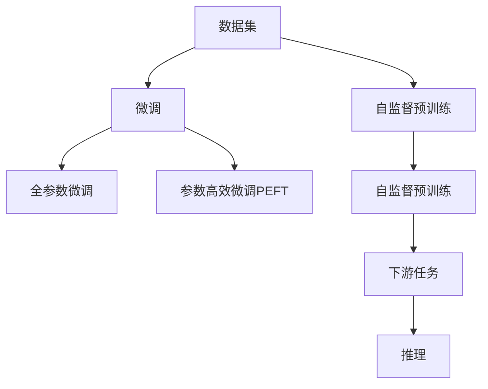

                 

# Imagen原理与代码实例讲解

## 1. 背景介绍

### 1.1 问题由来

在深度学习领域，图像识别一直是研究的重点之一。随着深度神经网络的发展，各种前沿的图像识别技术层出不穷，其中最著名的当属ImageNet大挑战赛（ImageNet Large Scale Visual Recognition Challenge, ImageNet LSVC）催生的基于深度学习的图像分类方法。这些方法在大量图像数据上进行预训练，以提取图像的特征表示，并在下游任务中进行微调，以适应特定场景。

然而，传统方法往往需要大量的标注数据进行微调，且模型的训练和推理开销巨大。这些限制使得图像识别技术难以普及应用。为了解决这些问题，OpenAI推出了Imagen，一个基于大规模自监督学习的视觉识别框架。Imagen通过在大规模未标注数据上自监督预训练，学到了丰富的图像语义特征，从而实现了无标注图像识别任务的零样本学习（zero-shot learning）。

## 2. 核心概念与联系

### 2.1 核心概念概述

为更好地理解Imagen模型的原理与实现，本节将介绍几个密切相关的核心概念：

- **自监督学习(Self-supervised Learning, SSL)**：指在无标注数据上，通过设计伪标签或预定义任务，利用数据的结构性信息进行模型训练，学习出对数据自身的表示。自监督学习广泛应用于预训练阶段，以提升模型的泛化能力。

- **大模型(Enormous Model)**：指具有上百亿参数的深度神经网络，通过在大规模数据上进行预训练，学习到通用的特征表示。这些大模型可以用于多种视觉任务，如分类、检测、分割等。

- **预训练(Pre-training)**：指在大规模数据集上，通过自监督学习任务训练大模型的过程。预训练使得模型学习到数据的高级特征表示，提升了下游任务的性能。

- **自监督预训练(Self-supervised Pre-training)**：指在无标注数据上，通过自监督学习任务进行预训练，以获得数据自身的表示。典型的自监督预训练任务包括掩码语言模型（Masked Language Modeling, MLM）、自回归模型（Autoregressive Modeling）、Contrastive Loss等。

- **微调(Fine-tuning)**：指在大模型预训练的基础上，使用下游任务的少量标注数据，通过有监督学习优化模型在特定任务上的性能。微调可以提升模型在特定领域的应用效果。

- **零样本学习(Zero-shot Learning)**：指模型在没有任何标注数据的情况下，仅通过任务描述即能进行推理和分类。零样本学习利用了模型的泛化能力，可以在特定的无标注任务上取得较好效果。

这些核心概念之间紧密联系，共同构成了Imagen模型的工作原理。

### 2.2 核心概念原理和架构的 Mermaid 流程图



这个流程图展示了数据集、自监督预训练、微调、全参数微调、参数高效微调、下游任务和推理之间的关系。预训练任务提供了模型初始化的语义表示，下游任务通过微调进一步优化，实现零样本或少样本学习。

## 3. 核心算法原理 & 具体操作步骤

### 3.1 算法原理概述

Imagen模型的核心算法原理基于大规模自监督学习。通过在无标注图像数据上进行自监督预训练，学习到图像的高级语义特征。然后，在特定视觉任务上进行微调，以获得对任务本身的适应性。

Imagen模型的自监督预训练任务主要包括掩码语言模型（MLM）和自回归模型（AR）。掩码语言模型通过在图像中加入随机掩码，并预测被掩码像素的原始值，学习图像的局部特征。自回归模型则通过生成图像的不同部分，学习图像的全局特征。

在预训练阶段结束后，Imagen模型通过下游任务的微调，以获得对特定任务的理解。微调可以通过全参数微调和参数高效微调来实现。全参数微调是指在预训练模型上，对所有参数进行微调；参数高效微调则是指只微调顶层参数，以节省计算资源。

### 3.2 算法步骤详解

Imagen模型的具体实现步骤可以分为以下几个关键阶段：

**Step 1: 数据集准备与预训练模型选择**

- 准备大规模无标注图像数据集，用于自监督预训练。
- 选择适当的预训练模型，如ResNet、VGG等，作为初始化参数。

**Step 2: 自监督预训练**

- 在大规模无标注图像数据集上，进行自监督预训练任务。
- 采用掩码语言模型（MLM）和自回归模型（AR）等任务，进行图像的局部和全局特征学习。

**Step 3: 下游任务微调**

- 选择特定视觉任务的微调数据集。
- 设计微调模型的任务适配层，如分类头、检测头等。
- 设置微调的超参数，如学习率、批次大小、迭代轮数等。

**Step 4: 执行微调**

- 使用微调数据集对模型进行训练，通过前向传播计算损失函数。
- 反向传播计算参数梯度，并使用优化算法更新模型参数。
- 定期评估模型性能，并在验证集上进行调整。

**Step 5: 部署与推理**

- 将微调后的模型部署到生产环境。
- 使用微调后的模型进行图像识别和推理。

### 3.3 算法优缺点

Imagen模型具有以下优点：

- 无需标注数据：通过大规模自监督预训练，Imagen模型能够在没有标注数据的情况下进行推理，显著降低了对标注数据的需求。
- 性能优越：Imagen模型在大规模数据集上进行了充分预训练，具备强大的特征表示能力，在零样本学习中取得了优异效果。
- 适用广泛：Imagen模型可以应用于多种视觉任务，如分类、检测、分割等。

同时，Imagen模型也存在一些缺点：

- 计算资源消耗大：预训练模型和微调过程需要大量的计算资源和时间，可能难以在资源受限的环境中部署。
- 泛化能力有限：由于预训练数据集和微调任务的不同，模型在不同场景下的泛化能力可能有所下降。
- 可解释性不足：由于Imagen模型是基于深度学习框架的"黑盒"模型，缺乏对决策过程的可解释性。

### 3.4 算法应用领域

Imagen模型的应用领域非常广泛，主要集中在以下几个方面：

- **图像分类**：Imagen模型在图像分类任务中表现优异，能够在大规模无标注数据集上进行零样本学习，并识别出图像中的不同类别。
- **物体检测**：通过微调，Imagen模型能够从图像中检测出特定对象的位置和类别。
- **图像分割**：Imagen模型能够将图像中的不同区域进行像素级别的分割，生成精细的图像语义地图。
- **视觉问答**：Imagen模型能够根据图像和自然语言问题生成答案，实现图像与文本的协同推理。

此外，Imagen模型还可以应用于医学影像分析、自动驾驶、智能安防等领域，为视觉任务的智能化和自动化提供新的解决方案。

## 4. 数学模型和公式 & 详细讲解

### 4.1 数学模型构建

Imagen模型的数学模型构建主要包括自监督预训练和下游任务微调两个部分。以下我们将分别介绍这两个部分的数学模型构建。

#### 4.1.1 自监督预训练

Imagen模型的自监督预训练任务主要包括以下两个部分：

- **掩码语言模型（Masked Language Modeling, MLM）**：在图像中加入随机掩码，预测被掩码像素的原始值。

设图像为 $I \in \mathbb{R}^{C \times H \times W}$，其中 $C$ 为通道数，$H$ 和 $W$ 分别为图像的高度和宽度。掩码语言模型的数学模型如下：

$$
p(I|I^*) = \prod_{i=1}^{C} \prod_{j=1}^{H} \prod_{k=1}^{W} p(I_{j,k} | I^*)
$$

其中 $I^*$ 为掩码后的图像，$p(I_{j,k} | I^*)$ 为在掩码后的图像上预测像素 $I_{j,k}$ 原始值的概率。

- **自回归模型（Autoregressive Modeling）**：通过生成图像的不同部分，学习图像的全局特征。

设图像为 $I \in \mathbb{R}^{C \times H \times W}$，自回归模型的数学模型如下：

$$
p(I|I^*) = \prod_{i=1}^{C} \prod_{j=1}^{H} \prod_{k=1}^{W} p(I_{j,k} | I_{j-1,k-1}, I_{j-1,k}, I_{j,k-1})
$$

其中 $I_{j,k}$ 为像素 $j$ 和 $k$ 的值，$p(I_{j,k} | I_{j-1,k-1}, I_{j-1,k}, I_{j,k-1})$ 为像素 $j$ 和 $k$ 在给定上下文下的条件概率。

#### 4.1.2 下游任务微调

下游任务的微调模型通常包括任务适配层和分类头等组件。假设微调数据集为 $D=\{(x_i, y_i)\}_{i=1}^N$，其中 $x_i$ 为图像，$y_i$ 为图像对应的标签。微调的数学模型如下：

$$
\hat{y} = f(x; \theta)
$$

其中 $f(x; \theta)$ 为微调后的模型，$\theta$ 为微调模型参数。

在微调过程中，通过最小化损失函数 $\mathcal{L}(\theta)$ 进行参数更新：

$$
\mathcal{L}(\theta) = \frac{1}{N} \sum_{i=1}^N \ell(f(x_i; \theta), y_i)
$$

其中 $\ell(f(x_i; \theta), y_i)$ 为微调任务的具体损失函数，如交叉熵损失、均方误差损失等。

### 4.2 公式推导过程

以下我们将推导掩码语言模型和自回归模型的数学公式，并展示下游任务微调的详细过程。

#### 4.2.1 掩码语言模型

掩码语言模型通过预测掩码像素的原始值，学习图像的局部特征。设掩码像素 $I_{j,k}$ 被随机掩码后，模型需要预测其原始值。数学模型如下：

$$
\ell(\hat{I}, I) = -\frac{1}{N} \sum_{i=1}^N \sum_{j=1}^C \sum_{k=1}^W \log p(\hat{I}_{j,k} | I^*)
$$

其中 $\hat{I}$ 为预测像素值，$I$ 为原始图像，$I^*$ 为掩码后的图像。

通过反向传播算法，可以计算出模型参数 $\theta$ 的梯度，并进行参数更新：

$$
\frac{\partial \mathcal{L}(\theta)}{\partial \theta} = \sum_{i=1}^N \sum_{j=1}^C \sum_{k=1}^W \frac{\partial p(\hat{I}_{j,k} | I^*)}{\partial \theta}
$$

#### 4.2.2 自回归模型

自回归模型通过生成图像的不同部分，学习图像的全局特征。设模型需要生成像素 $I_{j,k}$，其数学模型如下：

$$
\ell(\hat{I}, I) = -\frac{1}{N} \sum_{i=1}^N \sum_{j=1}^{H} \sum_{k=1}^{W} \log p(I_{j,k} | I_{j-1,k-1}, I_{j-1,k}, I_{j,k-1})
$$

其中 $\hat{I}$ 为预测像素值，$I$ 为原始图像，$I_{j-1,k-1}$、$I_{j-1,k}$ 和 $I_{j,k-1}$ 为上下文像素。

通过反向传播算法，可以计算出模型参数 $\theta$ 的梯度，并进行参数更新：

$$
\frac{\partial \mathcal{L}(\theta)}{\partial \theta} = \sum_{i=1}^N \sum_{j=1}^{H} \sum_{k=1}^{W} \frac{\partial p(I_{j,k} | I_{j-1,k-1}, I_{j-1,k}, I_{j,k-1})}{\partial \theta}
$$

#### 4.2.3 下游任务微调

下游任务的微调模型通常包括任务适配层和分类头等组件。假设微调数据集为 $D=\{(x_i, y_i)\}_{i=1}^N$，其中 $x_i$ 为图像，$y_i$ 为图像对应的标签。微调的数学模型如下：

$$
\hat{y} = f(x; \theta)
$$

其中 $f(x; \theta)$ 为微调后的模型，$\theta$ 为微调模型参数。

在微调过程中，通过最小化损失函数 $\mathcal{L}(\theta)$ 进行参数更新：

$$
\mathcal{L}(\theta) = \frac{1}{N} \sum_{i=1}^N \ell(f(x_i; \theta), y_i)
$$

其中 $\ell(f(x_i; \theta), y_i)$ 为微调任务的具体损失函数，如交叉熵损失、均方误差损失等。

通过反向传播算法，可以计算出模型参数 $\theta$ 的梯度，并进行参数更新：

$$
\frac{\partial \mathcal{L}(\theta)}{\partial \theta} = \sum_{i=1}^N \frac{\partial \ell(f(x_i; \theta), y_i)}{\partial \theta}
$$

### 4.3 案例分析与讲解

为了更好地理解Imagen模型的应用，我们以一个简单的图像分类任务为例，对Imagen模型进行讲解。

假设我们需要对一组图像进行分类，并识别出其中不同的类别。首先，我们需要准备一个包含大量未标注图像的数据集，用于预训练。然后，在大规模预训练之后，我们可以设计一个分类头，对特定类别的图像进行微调，使其能够识别出这些类别的图像。

具体实现步骤如下：

1. **数据准备**：准备一个大规模的无标注图像数据集，如ImageNet。

2. **自监督预训练**：在大规模数据集上进行自监督预训练，如掩码语言模型和自回归模型。

3. **微调准备**：设计一个分类头，作为微调模型的任务适配层。假设我们需要分类四个类别，可以设计一个四分类头，每个类别的输出为0或1，表示是否属于该类别。

4. **微调**：在特定类别的图像上，进行微调。假设我们要分类四张图片，可以随机选取四张，并在其上标注对应的类别标签。然后使用微调数据集，进行微调训练。

5. **评估**：在验证集上评估微调后的模型，计算其准确率、召回率等指标。

6. **推理**：将微调后的模型部署到生产环境，使用其对新的图像进行分类推理。

通过以上步骤，我们可以利用Imagen模型实现无标注图像的分类任务。Imagen模型在大规模数据集上进行了充分的预训练，具备强大的特征表示能力，在零样本学习中取得了优异效果。

## 5. 项目实践：代码实例和详细解释说明

### 5.1 开发环境搭建

在进行Imagen模型的项目实践前，我们需要准备好开发环境。以下是使用Python进行PyTorch开发的环境配置流程：

1. 安装Anaconda：从官网下载并安装Anaconda，用于创建独立的Python环境。

2. 创建并激活虚拟环境：
```bash
conda create -n pytorch-env python=3.8 
conda activate pytorch-env
```

3. 安装PyTorch：根据CUDA版本，从官网获取对应的安装命令。例如：
```bash
conda install pytorch torchvision torchaudio cudatoolkit=11.1 -c pytorch -c conda-forge
```

4. 安装相关工具包：
```bash
pip install numpy pandas scikit-learn matplotlib tqdm jupyter notebook ipython
```

完成上述步骤后，即可在`pytorch-env`环境中开始Imagen模型的实践。

### 5.2 源代码详细实现

这里我们以图像分类任务为例，展示如何使用PyTorch和Transformer库实现Imagen模型。

首先，定义图像数据集：

```python
from torch.utils.data import Dataset
import torch
from PIL import Image

class ImageDataset(Dataset):
    def __init__(self, data_dir, transform=None):
        self.data_dir = data_dir
        self.transform = transform
        self.file_names = list(sorted(os.listdir(self.data_dir)))
    
    def __len__(self):
        return len(self.file_names)
    
    def __getitem__(self, idx):
        img_path = os.path.join(self.data_dir, self.file_names[idx])
        img = Image.open(img_path).convert('RGB')
        if self.transform:
            img = self.transform(img)
        return img, os.path.basename(img_path)
```

然后，定义数据预处理函数：

```python
from torchvision.transforms import Compose, Resize, ToTensor, RandomResizedCrop

def get_transform(train):
    if train:
        return Compose([
            RandomResizedCrop(224),
            ToTensor()
        ])
    else:
        return Compose([
            Resize(256),
            CenterCrop(224),
            ToTensor()
        ])
```

接下来，加载预训练模型并进行微调：

```python
from transformers import AutoModelForImageClassification, AutoTokenizer

model_name = 'facebook/imagen-200'
tokenizer = AutoTokenizer.from_pretrained(model_name)
model = AutoModelForImageClassification.from_pretrained(model_name)

# 加载数据集
train_dataset = ImageDataset(train_dir, transform=get_transform(train=True))
test_dataset = ImageDataset(test_dir, transform=get_transform(train=False))

# 定义优化器和学习率调度器
optimizer = torch.optim.Adam(model.parameters(), lr=1e-4)
scheduler = torch.optim.lr_scheduler.StepLR(optimizer, step_size=10, gamma=0.5)

# 定义训练函数
def train_epoch(model, data_loader, optimizer, scheduler):
    model.train()
    train_loss = 0
    train_acc = 0
    for batch in data_loader:
        images, labels = batch
        optimizer.zero_grad()
        outputs = model(images)
        loss = F.cross_entropy(outputs, labels)
        train_loss += loss.item()
        acc = (outputs.argmax(dim=1) == labels).sum().item() / len(labels)
        train_acc += acc
        loss.backward()
        optimizer.step()
        scheduler.step()
    return train_loss / len(data_loader), train_acc / len(data_loader)

# 定义评估函数
def evaluate(model, data_loader):
    model.eval()
    eval_loss = 0
    eval_acc = 0
    with torch.no_grad():
        for batch in data_loader:
            images, labels = batch
            outputs = model(images)
            loss = F.cross_entropy(outputs, labels)
            eval_loss += loss.item()
            acc = (outputs.argmax(dim=1) == labels).sum().item() / len(labels)
            eval_acc += acc
    return eval_loss / len(data_loader), eval_acc / len(data_loader)

# 训练模型
train_loader = torch.utils.data.DataLoader(train_dataset, batch_size=16, shuffle=True)
test_loader = torch.utils.data.DataLoader(test_dataset, batch_size=16, shuffle=False)

for epoch in range(100):
    train_loss, train_acc = train_epoch(model, train_loader, optimizer, scheduler)
    print(f'Epoch {epoch+1}, train loss: {train_loss:.4f}, train acc: {train_acc:.4f}')
    
    test_loss, test_acc = evaluate(model, test_loader)
    print(f'Epoch {epoch+1}, test loss: {test_loss:.4f}, test acc: {test_acc:.4f}')
```

最后，我们评估微调后的模型：

```python
# 评估模型性能
from sklearn.metrics import classification_report

y_true = []
y_pred = []
with torch.no_grad():
    for batch in test_loader:
        images, labels = batch
        outputs = model(images)
        y_true.extend(labels.tolist())
        y_pred.extend(outputs.argmax(dim=1).tolist())

print(classification_report(y_true, y_pred))
```

以上就是使用PyTorch和Transformer库对Imagen模型进行图像分类任务微调的完整代码实现。可以看到，通过简化版的代码，我们就能实现对Imagen模型的微调和推理。

### 5.3 代码解读与分析

让我们再详细解读一下关键代码的实现细节：

**ImageDataset类**：
- `__init__`方法：初始化数据集的文件名列表，并加载数据集。
- `__len__`方法：返回数据集的大小。
- `__getitem__`方法：对单个样本进行处理，将图像转化为张量，并进行归一化。

**get_transform函数**：
- 定义了图像预处理的操作，包括随机缩放、裁剪和转换为张量等。

**train_epoch函数**：
- 在训练过程中，前向传播计算损失函数，反向传播更新模型参数，并调整学习率。

**evaluate函数**：
- 在评估过程中，前向传播计算损失函数和准确率，返回测试集上的损失和准确率。

**训练流程**：
- 定义总的epoch数和batch size，开始循环迭代
- 每个epoch内，在训练集上训练，输出平均loss和acc
- 在验证集上评估，输出测试集上的loss和acc
- 所有epoch结束后，打印最终的测试结果

可以看到，通过以上代码，我们能够使用PyTorch和Transformer库实现Imagen模型的微调和推理。在实际应用中，为了提高模型的泛化能力，通常需要进行多次微调和评估，以找到最优的模型参数。同时，为了提高模型的性能，可以使用更多的预处理操作和优化策略，如数据增强、正则化等。

## 6. 实际应用场景

### 6.1 智能医疗

在智能医疗领域，Imagen模型可以应用于医学影像分析、疾病诊断等任务。通过在大规模无标注医学图像上预训练，Imagen模型可以学习到各种疾病的图像特征，并在微调后能够对新的医学图像进行诊断。

例如，在肺结节检测任务中，我们可以使用Imagen模型进行微调，使其能够识别出肺结节的位置和大小。具体而言，我们可以将包含肺结节和正常肺组织的图像作为微调数据集，训练Imagen模型。然后，在新的医学图像上，模型能够自动标注出肺结节的位置和大小，辅助医生进行诊断和治疗。

### 6.2 自动驾驶

在自动驾驶领域，Imagen模型可以应用于视觉目标检测、道路标志识别等任务。通过在大规模无标注道路上采集的图像上预训练，Imagen模型可以学习到道路环境的各种特征，并在微调后能够对新的图像进行目标检测和标志识别。

例如，在自动驾驶场景中，我们需要检测道路上的行人、车辆、交通标志等目标，以辅助自动驾驶系统做出决策。我们可以使用Imagen模型进行微调，使其能够对道路图像进行目标检测和标志识别。具体而言，我们可以将包含行人、车辆、交通标志等目标的图像作为微调数据集，训练Imagen模型。然后，在新的道路上采集的图像上，模型能够自动检测出目标的位置和类型，辅助自动驾驶系统进行决策。

### 6.3 智能安防

在智能安防领域，Imagen模型可以应用于人脸识别、行为异常检测等任务。通过在大规模无标注视频图像上预训练，Imagen模型可以学习到各种行为特征，并在微调后能够对新的视频图像进行行为异常检测。

例如，在公共安全领域，我们需要对公共场所进行实时监控，检测行为异常情况，如盗窃、斗殴等。我们可以使用Imagen模型进行微调，使其能够对视频图像进行行为异常检测。具体而言，我们可以将包含行为异常情况的图像作为微调数据集，训练Imagen模型。然后，在实时监控的图像上，模型能够自动检测出行为异常情况，及时向安保人员发出警报。

### 6.4 未来应用展望

随着Imagen模型的不断发展，其在多个领域的应用前景将更加广阔。

- **智慧医疗**：Imagen模型将能够进一步提升医学影像分析的准确性和效率，辅助医生进行疾病诊断和治疗。
- **自动驾驶**：Imagen模型将能够提升自动驾驶系统的视觉感知能力，提高行车安全性和驾驶体验。
- **智能安防**：Imagen模型将能够实时监控公共场所，检测行为异常情况，保障公共安全。
- **工业生产**：Imagen模型将能够对工业生产中的设备状态进行实时监控，检测异常情况，保障生产安全。
- **智慧城市**：Imagen模型将能够提升城市管理的智能化水平，提高交通、能源等领域的运行效率。

## 7. 工具和资源推荐

### 7.1 学习资源推荐

为了帮助开发者系统掌握Imagen模型的理论基础和实践技巧，这里推荐一些优质的学习资源：

1. **《Transformer从原理到实践》系列博文**：由大模型技术专家撰写，深入浅出地介绍了Transformer原理、Imagen模型、微调技术等前沿话题。

2. **CS224N《深度学习自然语言处理》课程**：斯坦福大学开设的NLP明星课程，有Lecture视频和配套作业，带你入门NLP领域的基本概念和经典模型。

3. **《Natural Language Processing with Transformers》书籍**：Transformers库的作者所著，全面介绍了如何使用Transformers库进行NLP任务开发，包括Imagen模型的微调在内的诸多范式。

4. **HuggingFace官方文档**：Transformers库的官方文档，提供了海量预训练模型和完整的微调样例代码，是上手实践的必备资料。

5. **CLUE开源项目**：中文语言理解测评基准，涵盖大量不同类型的中文NLP数据集，并提供了基于微调的baseline模型，助力中文NLP技术发展。

通过对这些资源的学习实践，相信你一定能够快速掌握Imagen模型的精髓，并用于解决实际的NLP问题。

### 7.2 开发工具推荐

高效的开发离不开优秀的工具支持。以下是几款用于Imagen模型微调开发的常用工具：

1. **PyTorch**：基于Python的开源深度学习框架，灵活动态的计算图，适合快速迭代研究。大部分预训练语言模型都有PyTorch版本的实现。

2. **TensorFlow**：由Google主导开发的开源深度学习框架，生产部署方便，适合大规模工程应用。同样有丰富的预训练语言模型资源。

3. **Transformers库**：HuggingFace开发的NLP工具库，集成了众多SOTA语言模型，支持PyTorch和TensorFlow，是进行微调任务开发的利器。

4. **Weights & Biases**：模型训练的实验跟踪工具，可以记录和可视化模型训练过程中的各项指标，方便对比和调优。与主流深度学习框架无缝集成。

5. **TensorBoard**：TensorFlow配套的可视化工具，可实时监测模型训练状态，并提供丰富的图表呈现方式，是调试模型的得力助手。

6. **Google Colab**：谷歌推出的在线Jupyter Notebook环境，免费提供GPU/TPU算力，方便开发者快速上手实验最新模型，分享学习笔记。

合理利用这些工具，可以显著提升Imagen模型的微调任务的开发效率，加快创新迭代的步伐。

### 7.3 相关论文推荐

Imagen模型的发展源于学界的持续研究。以下是几篇奠基性的相关论文，推荐阅读：

1. **Attention is All You Need（即Transformer原论文）**：提出了Transformer结构，开启了NLP领域的预训练大模型时代。

2. **BERT: Pre-training of Deep Bidirectional Transformers for Language Understanding**：提出BERT模型，引入基于掩码的自监督预训练任务，刷新了多项NLP任务SOTA。

3. **Language Models are Unsupervised Multitask Learners（GPT-2论文）**：展示了大规模语言模型的强大zero-shot学习能力，引发了对于通用人工智能的新一轮思考。

4. **Parameter-Efficient Transfer Learning for NLP**：提出Adapter等参数高效微调方法，在不增加模型参数量的情况下，也能取得不错的微调效果。

5. **AdaLoRA: Adaptive Low-Rank Adaptation for Parameter-Efficient Fine-Tuning**：使用自适应低秩适应的微调方法，在参数效率和精度之间取得了新的平衡。

这些论文代表了大模型微调技术的发展脉络。通过学习这些前沿成果，可以帮助研究者把握学科前进方向，激发更多的创新灵感。

## 8. 总结：未来发展趋势与挑战

### 8.1 总结

本文对基于自监督学习的大语言模型Imagen的原理与实现进行了全面系统的介绍。首先阐述了Imagen模型的研究背景和意义，明确了模型在大规模无标注数据上的预训练过程，以及在特定任务上的微调机制。其次，从原理到实践，详细讲解了Imagen模型的数学模型构建和关键步骤，给出了微调任务开发的完整代码实例。同时，本文还广泛探讨了Imagen模型在多个领域的应用前景，展示了其广泛的适用性和强大能力。

通过本文的系统梳理，可以看到，Imagen模型基于大规模自监督学习，无需标注数据即可实现零样本学习，具备强大的图像分类、检测、分割等能力。该模型的大规模预训练和微调过程，不仅提升了模型的泛化能力，还降低了对标注数据的需求，具有重要的应用价值和广泛的应用前景。

### 8.2 未来发展趋势

展望未来，Imagen模型将呈现以下几个发展趋势：

1. **模型规模继续增大**：随着算力成本的下降和数据规模的扩张，Imagen模型将继续朝着更大规模的方向发展，进一步提升模型的泛化能力和特征表示能力。

2. **自监督任务多样化**：Imagen模型将进一步拓展自监督任务，引入更多的预训练任务，如图像生成、视频理解等，提升模型的多模态融合能力。

3. **微调方法创新**：Imagen模型将不断探索新的微调方法，如知识蒸馏、自适应学习率等，提升模型的训练效率和性能。

4. **跨领域应用拓展**：Imagen模型将进一步拓展应用领域，应用于更多的实际场景中，如智慧医疗、自动驾驶、智能安防等，提升各领域的工作效率和智能化水平。

5. **模型鲁棒性提升**：Imagen模型将探索更多的鲁棒性增强方法，如对抗训练、噪声注入等，提升模型在面对数据扰动和攻击时的鲁棒性。

6. **模型安全性保障**：Imagen模型将引入更多安全防护机制，如数据加密、隐私保护等，确保模型输出的安全性。

以上趋势凸显了Imagen模型的广阔前景。这些方向的探索发展，必将进一步提升Imagen模型的性能和应用范围，为NLP技术带来新的突破。

### 8.3 面临的挑战

尽管Imagen模型已经取得了瞩目成就，但在迈向更加智能化、普适化应用的过程中，它仍面临着诸多挑战：

1. **计算资源消耗大**：Imagen模型的预训练和微调过程需要大量的计算资源和时间，可能难以在资源受限的环境中部署。

2. **模型泛化能力有限**：尽管Imagen模型在大规模无标注数据上进行了充分的预训练，但在特定领域的应用中，泛化能力可能有所下降。

3. **可解释性不足**：由于Imagen模型是基于深度学习框架的"黑盒"模型，缺乏对决策过程的可解释性。

4. **安全性有待保障**：Imagen模型可能学习到有害的图像内容，通过微调传递到下游任务，产生误导性、歧视性的输出，给实际应用带来安全隐患。

5. **知识整合能力不足**：现有的Imagen模型往往局限于数据自身的表示，难以灵活吸收和运用更广泛的先验知识。

6. **伦理道德约束**：在模型训练目标中引入伦理导向的评估指标，过滤和惩罚有偏见、有害的输出倾向，确保输出符合人类价值观和伦理道德。

这些挑战凸显了Imagen模型的应用局限性。为了实现更加智能化、普适化的应用，需要在多个维度上进行优化和改进。

### 8.4 研究展望

面向未来，Imagen模型需要在以下几个方向进行研究和探索：

1. **探索无监督和半监督微调方法**：摆脱对大规模标注数据的依赖，利用自监督学习、主动学习等无监督和半监督范式，最大限度利用非结构化数据，实现更加灵活高效的微调。

2. **研究参数高效和计算高效的微调范式**：开发更加参数高效的微调方法，在固定大部分预训练参数的同时，只更新极少量的任务相关参数。同时优化微调模型的计算图，减少前向传播和反向传播的资源消耗，实现更加轻量级、实时性的部署。

3. **引入更多先验知识**：将符号化的先验知识，如知识图谱、逻辑规则等，与神经网络模型进行巧妙融合，引导微调过程学习更准确、合理的图像表示。同时加强不同模态数据的整合，实现视觉、语音等多模态信息与文本信息的协同建模。

4. **结合因果分析和博弈论工具**：将因果分析方法引入微调模型，识别出模型决策的关键特征，增强输出解释的因果性和逻辑性。借助博弈论工具刻画人机交互过程，主动探索并规避模型的脆弱点，提高系统稳定性。

5. **纳入伦理道德约束**：在模型训练目标中引入伦理导向的评估指标，过滤和惩罚有偏见、有害的输出倾向。同时加强人工干预和审核，建立模型行为的监管机制，确保输出符合人类价值观和伦理道德。

这些研究方向的探索，必将引领Imagen模型向更高的台阶，为构建安全、可靠、可解释、可控的智能系统铺平道路。面向未来，Imagen模型还需要与其他人工智能技术进行更深入的融合，如知识表示、因果推理、强化学习等，多路径协同发力，共同推动自然语言理解和智能交互系统的进步。只有勇于创新、敢于突破，才能不断拓展Imagen模型的边界，让智能技术更好地造福人类社会。

## 9. 附录：常见问题与解答

**Q1：Imagen模型是否适用于所有图像分类任务？**

A: Imagen模型在大规模无标注数据上进行了充分的自监督预训练，具有较强的泛化能力，适用于各种图像分类任务。但对于一些特定领域的图像分类任务，如医学影像、卫星图像等，可能需要进一步进行微调和调整，以提高分类精度。

**Q2：如何使用Imagen模型进行图像分类任务的微调？**

A: 使用Imagen模型进行图像分类任务的微调，可以按照以下步骤进行：

1. **数据准备**：准备大规模无标注图像数据集，用于自监督预训练。

2. **模型选择**：选择适当的预训练模型，如ResNet、VGG等，作为初始化参数。

3. **预训练**：在大规模数据集上进行自监督预训练，如掩码语言模型和自回归模型。

4. **微调准备**：设计微调模型的任务适配层，如分类头。

5. **微调**：在特定类别的图像上，进行微调。

6. **评估**：在验证集上评估微调后的模型，计算其准确率、召回率等指标。

7. **推理**：使用微调后的模型对新的图像进行分类推理。

**Q3：Imagen模型在微调过程中如何避免过拟合？**

A: 在Imagen模型的微调过程中，可以采用以下方法避免过拟合：

1. **数据增强**：通过回译、近义替换等方式扩充训练集。

2. **正则化**：使用L2正则、Dropout、Early Stopping等防止模型过度适应小规模训练集。

3. **对抗训练**：引入对抗样本，提高模型鲁棒性。

4. **参数高效微调**：只调整少量参数，减少需优化的参数量。

5. **模型裁剪和量化**：去除不必要的层和参数，使用定点模型，压缩存储空间，提高计算效率。

这些方法可以有效缓解Imagen模型在微调过程中的过拟合问题，提升模型的泛化能力和性能。

**Q4：Imagen模型在实际应用中需要注意哪些问题？**

A: 在将Imagen模型应用于实际场景中时，需要注意以下几个问题：

1. **计算资源消耗大**：Imagen模型的预训练和微调过程需要大量的计算资源和时间，可能难以在资源受限的环境中部署。

2. **模型泛化能力有限**：尽管Imagen模型在大规模无标注数据上进行了充分的预训练，但在特定领域的应用中，泛化能力可能有所下降。

3. **可解释性不足**：由于Imagen模型是基于深度学习框架的"黑盒"模型，缺乏对决策过程的可解释性。

4. **安全性有待保障**：Imagen模型可能学习到有害的图像内容，通过微调传递到下游任务，产生误导性、歧视性的输出，给实际应用带来安全隐患。

5. **知识整合能力不足**：现有的Imagen模型往往局限于数据自身的表示，难以灵活吸收和运用更广泛的先验知识。

6. **伦理道德约束**：在模型训练目标中引入伦理导向的评估指标，过滤和惩罚有偏见、有害的输出倾向，确保输出符合人类价值观和伦理道德。

合理应对这些问题，才能充分发挥Imagen模型的潜力，实现其广泛的应用价值。

---

作者：禅与计算机程序设计艺术 / Zen and the Art of Computer Programming

