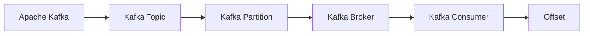
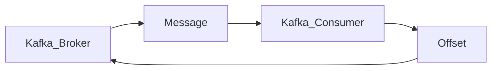

                 

# Kafka Consumer原理与代码实例讲解

> 关键词：Kafka, Consumer, Message Queue, Event-driven Architecture, Stream Processing, Topic, Partition, Broker

## 1. 背景介绍

在分布式系统中，消息队列成为了一个非常常见的组件。它可以帮助异步处理消息，实现系统的解耦合、高可用、高扩展性和消息的持久化存储。Apache Kafka作为一个高效、可扩展的消息队列平台，已经广泛应用在金融、电商、物流等众多领域。其中，Kafka消费者（Kafka Consumer）是消息队列中不可或缺的一部分，它用于从Kafka集群中订阅和消费消息，满足实时数据处理、流处理的需求。

本博客将详细讲解Kafka Consumer的原理与代码实例，帮助读者深入理解Kafka消费器的机制与实现。

## 2. 核心概念与联系

### 2.1 核心概念概述

为了深入理解Kafka Consumer，首先需要了解一些关键概念：

- **Apache Kafka**：一个开源的分布式流处理平台，用于高吞吐量、低延迟、高可靠性的消息传输。

- **Kafka Topic**：Kafka中的一个数据主题，可以理解为数据库的表或消息通道，存储着不同类型的消息。

- **Kafka Partition**：Kafka Topic下的数据分区，每个分区可以独立存储、消费消息，是Kafka中的基本数据单位。

- **Kafka Broker**：Kafka集群中的节点，用于存储和处理消息，同时提供客户端和消费器的连接服务。

- **Kafka Consumer**：用于从Kafka Topic的分区中订阅和消费消息的客户端。

- **Offset**：Kafka中的消费偏移量，表示消费者已经消费的消息数量，用于记录消费进度。

这些概念通过以下Mermaid流程图展示了它们之间的联系：



### 2.2 核心概念原理和架构

Kafka Consumer基于事件驱动架构，通过订阅Topic中的分区，从Broker节点接收消息，并将其处理、存储或转发到下游系统。Kafka Consumer的核心架构如图：



Kafka Consumer在接收到消息后，会先读取消息元数据，包括Topic、Partition、Offset等信息，然后进行消息消费处理。处理完成后，会将消费的Offset发送到Broker节点，用于记录消费进度。

## 3. 核心算法原理 & 具体操作步骤

### 3.1 算法原理概述

Kafka Consumer的消费过程主要包括订阅、拉取、处理、提交Offset等步骤。

- **订阅**：消费者通过指定Topic、Partition等参数，向Broker订阅相应的消息分区。

- **拉取**：消费者从Broker拉取指定分区中的最新消息。

- **处理**：消费者根据业务逻辑处理接收到的消息。

- **提交Offset**：消费者将处理结果提交到Broker，更新消费偏移量。

### 3.2 算法步骤详解

以下是Kafka Consumer的核心操作流程：

1. **创建KafkaConsumer实例**：
   - 导入KafkaConsumer类
   ```python
   from kafka import KafkaConsumer
   ```
   - 实例化KafkaConsumer，指定Topic、Broker、Group ID等参数
   ```python
   consumer = KafkaConsumer('topic_name',
                            bootstrap_servers='broker_list',
                            group_id='group_id')
   ```

2. **订阅分区**：
   - 指定要订阅的分区
   ```python
   consumer.subscribe(['topic_name/partition_id'])
   ```

3. **拉取消息**：
   - 通过`poll()`方法从分区中拉取消息，返回一个`Records`对象，其中包含多个消费的消息
   ```python
   records = consumer.poll(timeout_ms=1000)
   ```

4. **处理消息**：
   - 根据消息内容进行处理，例如解析JSON格式的消息
   ```python
   for record in records:
       if record.key is not None:
           print(f"Received message for {record.topic}: {record.key}")
       else:
           print(f"Received message for {record.topic}: {record.value}")
   ```

5. **提交Offset**：
   - 使用`commit()`方法提交消费的偏移量
   ```python
   for record in records:
       consumer.commit同步记录
   ```

### 3.3 算法优缺点

#### 优点：
- 高吞吐量：Kafka Consumer可以实现高并发、低延迟的消费。
- 可扩展性：通过分布式部署，可以轻松扩展系统规模。
- 容错性：消费者可以在Broker节点故障或网络中断时，自动重试和追回已丢失的消息。

#### 缺点：
- 对硬件要求高：需要高吞吐量的服务器、高性能的网络设备。
- 复杂度高：需要配置和管理多个Broker节点和消费者实例。
- 延迟性：尽管可以处理高吞吐量的数据，但无法实现毫秒级的延迟。

### 3.4 算法应用领域

Kafka Consumer广泛应用于实时数据处理、流处理、分布式事务等场景：

- 金融领域：实时清算、风控、反欺诈等。
- 电商领域：实时订单处理、库存管理、用户行为分析等。
- 物流领域：实时物流追踪、配送管理、订单分析等。
- 新闻媒体：实时新闻采集、数据分析、推送等。

## 4. 数学模型和公式 & 详细讲解 & 举例说明

### 4.1 数学模型构建

Kafka Consumer的数学模型主要涉及消费者、消息、分区和Offset等概念。以下是数学模型的构建：

- 设T为Kafka Topic，P为T的分区，则P可表示为：
  $$
  P = \{p_1, p_2, ..., p_n\}
  $$
  其中$n$为分区数量。

- 设$C$为Kafka Consumer集合，$G$为$C$的Group ID，则$G$可表示为：
  $$
  G = \{g_1, g_2, ..., g_m\}
  $$
  其中$m$为消费者数量。

- 设$M$为消息集合，$O$为Offset集合，则$O$可表示为：
  $$
  O = \{o_1, o_2, ..., o_k\}
  $$
  其中$k$为Offset数量。

### 4.2 公式推导过程

1. **订阅公式**：
   消费者订阅Topic $T$ 中的分区 $P$，则订阅公式为：
   $$
   S = \bigcup_{p \in P} \bigcup_{g \in G} \bigcup_{c \in C} c
   $$
   其中 $S$ 表示订阅的集合。

2. **拉取公式**：
   消费者从Topic $T$ 的分区 $P$ 拉取消息，则拉取公式为：
   $$
   L = \bigcup_{p \in P} \bigcup_{g \in G} \bigcup_{c \in C} c
   $$
   其中 $L$ 表示拉取的消息集合。

3. **处理公式**：
   消费者处理消息 $M$，则处理公式为：
   $$
   H = \bigcup_{m \in M} \bigcup_{o \in O} o
   $$
   其中 $H$ 表示处理结果的Offset集合。

### 4.3 案例分析与讲解

以一个具体的KafkaConsumer实例为例，假设有以下参数配置：

- Topic: orders
- Broker: broker1:9092,broker2:9092,broker3:9092
- Group ID: my_group
- Partition: 1
- Commit Sync: every record

则订阅、拉取和处理的过程如下：

1. **订阅**：
   ```python
   consumer = KafkaConsumer('orders',
                            bootstrap_servers='broker1:9092,broker2:9092,broker3:9092',
                            group_id='my_group')
   consumer.subscribe(['orders/1'])
   ```

2. **拉取**：
   ```python
   records = consumer.poll(timeout_ms=1000)
   ```

3. **处理**：
   ```python
   for record in records:
       if record.key is not None:
           print(f"Received message for {record.topic}: {record.key}")
       else:
           print(f"Received message for {record.topic}: {record.value}")
   ```

4. **提交Offset**：
   ```python
   for record in records:
       consumer.commit(同步记录)
   ```

## 5. 项目实践：代码实例和详细解释说明

### 5.1 开发环境搭建

在进行Kafka Consumer项目实践前，需要先搭建好开发环境。以下是搭建开发环境的详细步骤：

1. **安装Kafka**：
   - 从官网下载安装Kafka，解压后进入bin目录
   - 运行启动命令
   ```bash
   bin/kafka-server-start.sh config/server.properties
   ```

2. **创建Topic**：
   ```bash
   bin/kafka-topics.sh --create --bootstrap-server localhost:9092 --topic topic_name --partitions 3 --replication-factor 2
   ```

3. **安装Python环境**：
   - 安装Anaconda或Miniconda
   - 创建虚拟环境
   ```bash
   conda create -n py36 python=3.6
   source activate py36
   ```

4. **安装依赖包**：
   ```bash
   pip install kafka-python
   ```

### 5.2 源代码详细实现

以下是使用Python实现Kafka Consumer的完整代码示例：

```python
from kafka import KafkaConsumer
from kafka.errors import KafkaError

consumer = KafkaConsumer('topic_name',
                         bootstrap_servers='broker_list',
                         group_id='group_id')

consumer.subscribe(['topic_name/partition_id'])

while True:
    try:
        records = consumer.poll(timeout_ms=1000)
        for record in records:
            if record.key is not None:
                print(f"Received message for {record.topic}: {record.key}")
            else:
                print(f"Received message for {record.topic}: {record.value}")
        
        # 提交Offset
        consumer.commit(同步记录)
    except KafkaError as e:
        print(f"Error occurred: {e}")
```

### 5.3 代码解读与分析

1. **KafkaConsumer实例创建**：
   - 使用KafkaConsumer类创建实例，指定Topic、Broker、Group ID等参数。

2. **订阅Topic**：
   - 调用`subscribe()`方法，指定要订阅的分区。

3. **拉取消息**：
   - 调用`poll()`方法，从分区中拉取消息，并遍历处理接收到的消息。

4. **处理消息**：
   - 根据消息内容进行处理，例如打印接收到的消息。

5. **提交Offset**：
   - 调用`commit()`方法，提交消费的偏移量。

### 5.4 运行结果展示

运行上述代码后，即可在控制台看到拉取的Kafka消息及其内容。例如：

```
Received message for topic_name: {'order_id': 12345, 'amount': 1000, 'product': 'Apple'}
```

## 6. 实际应用场景

### 6.1 实时消息处理

Kafka Consumer广泛应用于实时消息处理场景，如实时数据监控、告警系统、日志分析等。

- **数据监控**：通过订阅Kafka Topic，实时接收系统产生的监控数据，快速发现异常并进行告警。
- **日志分析**：将日志信息发送到Kafka Topic，实时分析日志内容，进行业务审计、错误定位等。

### 6.2 分布式事务

Kafka Consumer在分布式事务中也发挥着重要作用。

- **事务消息**：通过事务消息机制，消费者可以保证消息的顺序处理，确保数据一致性。

### 6.3 流处理

Kafka Consumer是流处理系统的基础组件，如Apache Flink、Apache Storm等。

- **流处理**：通过订阅Kafka Topic，实时接收数据流，进行流式计算和分析。

## 7. 工具和资源推荐

### 7.1 学习资源推荐

1. **Kafka官方文档**：
   - 提供详细的Kafka文档和API说明，是学习Kafka的最佳资源。

2. **《Kafka: The Definitive Guide》**：
   - 深入讲解Kafka架构、配置、使用等，适合进阶学习。

3. **Kafka教程**：
   - 在Kafka官网或第三方网站提供的教程，帮助初学者快速上手。

4. **Kafka实战**：
   - 实战经验分享，介绍Kafka在企业中的具体应用案例。

### 7.2 开发工具推荐

1. **KafkaConsole**：
   - 可视化管理Kafka Topic、Partition等，方便监控和管理。

2. **KafkaManager**：
   - 提供Kafka集群监控、管理、配置等功能，提升Kafka管理的效率。

3. **Kafkazookeeper**：
   - 可视化管理Kafka的Zookeeper集群，提供集群的可视化监控和管理。

4. **Kafka Streams**：
   - 基于Kafka的流式处理库，提供Kafka消息的实时处理和分析功能。

### 7.3 相关论文推荐

1. **Scalable and Fault-tolerant Publish-subscribe Message Broker**：
   - 论文提出了Kafka的架构设计，阐述了Kafka的可靠性、可扩展性等特性。

2. **Apache Kafka: the scalable streaming platform**：
   - 详细介绍Kafka的架构、功能、配置等，是Kafka的核心文档。

3. **Event-Driven Architecture with Kafka**：
   - 讨论了Kafka在事件驱动架构中的应用，提供了实际应用案例。

## 8. 总结：未来发展趋势与挑战

### 8.1 总结

本文详细讲解了Kafka Consumer的原理与代码实例，帮助读者深入理解Kafka消费器的机制与实现。Kafka Consumer是Kafka系统中非常重要的一部分，它负责订阅、拉取、处理和提交Offset等关键任务，是实现消息队列的核心组件。

### 8.2 未来发展趋势

未来，Kafka Consumer将面临以下几个发展趋势：

1. **增强处理能力**：随着硬件的不断升级，Kafka Consumer的处理能力将进一步提升，支持更高的吞吐量和更低的延迟。

2. **改进消费模式**：Kafka Consumer将进一步优化消费模式，支持更多的消费模式，如订阅模式、轮询模式、自动重试等。

3. **支持流式处理**：Kafka Consumer将进一步支持流式处理，支持更多的流处理框架和库，提升流处理能力。

4. **增强可扩展性**：Kafka Consumer将进一步提升可扩展性，支持更多的消费者实例，实现更大规模的分布式处理。

5. **改进安全性和可靠性**：Kafka Consumer将进一步改进安全性和可靠性，支持更多的安全机制，增强系统的稳定性。

### 8.3 面临的挑战

尽管Kafka Consumer已经取得了不错的进展，但仍然面临以下挑战：

1. **性能瓶颈**：随着数据量的增加，Kafka Consumer的处理性能可能面临瓶颈，需要进一步优化处理能力。

2. **消息丢失**：在处理过程中，可能会出现消息丢失的情况，需要改进系统的可靠性。

3. **资源消耗**：Kafka Consumer的高吞吐量带来了高资源消耗，需要进一步优化资源使用。

4. **系统复杂性**：Kafka Consumer的系统架构相对复杂，需要进一步简化系统设计和提升可维护性。

### 8.4 研究展望

未来，Kafka Consumer的研究方向主要集中在以下几个方面：

1. **提升处理能力**：进一步提升Kafka Consumer的处理能力和吞吐量，支持更多的并发处理。

2. **改进消费模式**：改进Kafka Consumer的消费模式，支持更多的消费方式，提升系统的灵活性和可扩展性。

3. **增强可靠性**：增强Kafka Consumer的可靠性和稳定性，减少消息丢失，提高系统的健壮性。

4. **优化资源使用**：优化Kafka Consumer的资源使用，提升系统的效率和性能。

5. **增强可扩展性**：增强Kafka Consumer的可扩展性，支持更多的消费者实例，实现更大规模的分布式处理。

## 9. 附录：常见问题与解答

### 9.1 常见问题与解答

**Q1: 如何使用Kafka Consumer订阅Topic？**

A: 创建KafkaConsumer实例，调用`subscribe()`方法指定要订阅的Topic。

**Q2: 如何处理Kafka Consumer拉取的消息？**

A: 使用`for`循环遍历拉取的消息，根据业务逻辑进行处理。

**Q3: 如何提交Kafka Consumer的Offset？**

A: 调用`commit()`方法提交Offset，记录消费进度。

**Q4: KafkaConsumer实例如何退出？**

A: 调用`close()`方法关闭KafkaConsumer实例，释放资源。

通过以上章节的详细介绍，相信读者已经对Kafka Consumer的原理与代码实例有了深入的了解。Kafka Consumer作为Kafka系统的重要组成部分，可以帮助开发者实现高并发、低延迟、高可靠性的消息处理，适用于多种实时数据处理、流处理等场景。未来，随着技术的不断进步，Kafka Consumer将进一步提升性能、稳定性和可靠性，成为企业数据处理的核心组件。

---

作者：禅与计算机程序设计艺术 / Zen and the Art of Computer Programming

