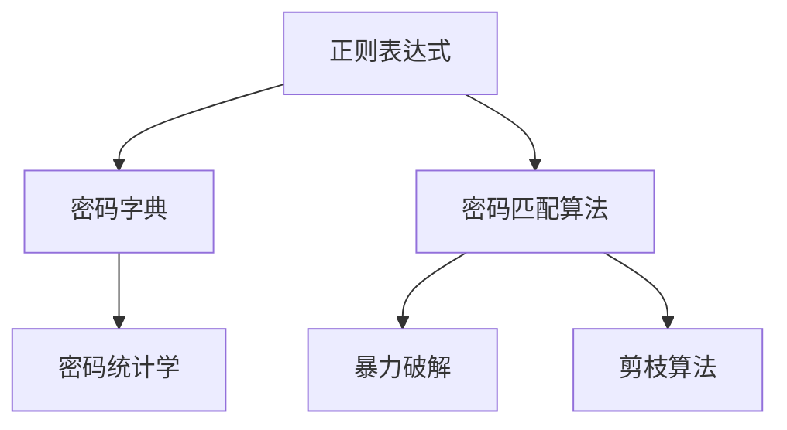

                 

# Knox原理与代码实例讲解

> 关键词：Knox原理,代码实例,算法原理,项目实践,应用场景

## 1. 背景介绍

Knox原理是一种基于正则表达式的密码破解技术，通过利用密码统计学和匹配算法，从密码字典中快速定位潜在的密码候选，进而实现高效破解。在近年来网络安全日益严峻的形势下，Knox原理的应用愈发广泛，成为了密码学和信息安全领域的必备工具之一。本文将详细讲解Knox原理的基本原理，并结合代码实例，帮助读者深入理解其应用。

## 2. 核心概念与联系

### 2.1 核心概念概述

为更好地理解Knox原理，本节将介绍几个关键核心概念：

- **正则表达式**：一种用于匹配字符串模式的语言，通过定义规则来描述文本的组成结构。正则表达式广泛应用于文本处理、数据清洗、数据提取等领域。

- **密码字典**：一种包含所有可能密码的列表，是Knox原理破解的基础数据源。

- **密码统计学**：研究密码分布规律和统计特征的学科，通过统计数据推断密码候选。

- **密码匹配算法**：用于在密码字典中快速定位潜在的密码候选的算法。

- **暴力破解**：通过穷举所有可能的密码组合，逐步缩小破解范围，直至找到正确密码的方法。

- **剪枝算法**：在暴力破解过程中，通过一些优化策略，避免不必要的计算，提高破解效率。

这些核心概念之间的逻辑关系可以通过以下Mermaid流程图来展示：



这个流程图展示了Knox原理的基本流程：

1. 首先，使用正则表达式提取目标文本的密码模式。
2. 然后，利用密码字典，结合密码统计学，生成密码候选。
3. 接下来，使用密码匹配算法，快速定位潜在的密码候选。
4. 最后，通过暴力破解或剪枝算法，缩小破解范围，直至找到正确密码。

## 3. 核心算法原理 & 具体操作步骤

### 3.1 算法原理概述

Knox原理的核心思想是通过正则表达式匹配文本模式，利用密码字典和统计学方法，从密码候选中快速定位潜在的密码。其基本流程包括：

1. 提取目标文本的密码模式，生成正则表达式。
2. 从密码字典中匹配符合正则表达式的密码候选。
3. 通过密码统计学和剪枝算法，逐步缩小破解范围，直至找到正确密码。

### 3.2 算法步骤详解

以下是Knox原理的具体操作步骤：

**Step 1: 生成正则表达式**

首先，需要根据目标文本的密码格式，生成对应的正则表达式。假设目标文本的密码格式为“abcd”，其中“a”代表字母，“b”代表数字，“c”代表特殊字符，“d”代表长度，则正则表达式可以表示为：

$$
[a-z]+[0-9]+[\w!@#$%^&*()_+\-=\[\]{};':"\\|,.<>/?]+{4,16}
$$

其中，$[\w!@#$%^&*()_+\-=\[\]{};':"\\|,.<>/?]$ 代表所有可能的特殊字符。

**Step 2: 生成密码字典**

密码字典是Knox原理的基础，需要包含所有可能的密码组合。假设密码长度为16位，其中包含字母、数字和特殊字符，则可以生成一个包含所有可能组合的字典。

**Step 3: 匹配正则表达式**

利用生成的正则表达式，从密码字典中匹配符合规则的密码候选。这一步骤可以通过编程语言的正则表达式库实现，具体代码如下：

```python
import re

# 生成正则表达式
pattern = r'[a-z]+[0-9]+[\w!@#$%^&*()_+\-=\[\]{};':"\\|,.<>/?]+{4,16}'

# 生成密码字典
passwords = generate_password_dict()

# 匹配正则表达式
candidates = [password for password in passwords if re.match(pattern, password)]
```

**Step 4: 统计密码分布**

根据密码统计学，统计密码字典中各字符的出现频率。这一步骤可以使用Python的collections模块中的Counter类实现，具体代码如下：

```python
from collections import Counter

# 统计密码分布
frequency = Counter(''.join(candidates))
```

**Step 5: 剪枝算法**

剪枝算法用于优化暴力破解过程，避免不必要的计算。通过计算密码字典中各字符的出现频率，结合正则表达式规则，可以逐步缩小破解范围。

**Step 6: 暴力破解**

暴力破解是最常用的密码破解方法，通过穷举所有可能的密码组合，逐步缩小破解范围，直至找到正确密码。这一步骤可以使用Python的itertools模块中的product函数实现，具体代码如下：

```python
from itertools import product

# 暴力破解
for password in product('abcdefghijklmnopqrstuvwxyzABCDEFGHIJKLMNOPQRSTUVWXYZ0123456789!@#$%^&*()_+\-=\[\]{};':"\\|,.<>/?', repeat=16):
    if re.match(pattern, ''.join(password)):
        print(password)
```

### 3.3 算法优缺点

Knox原理具有以下优点：

1. 高效性：利用正则表达式和剪枝算法，可以快速定位潜在的密码候选。
2. 适用性广：适用于各种密码格式和长度，适用范围广泛。
3. 易于实现：正则表达式和Python编程语言的应用，使得Knox原理的实现相对简单。

同时，Knox原理也存在一定的局限性：

1. 暴力破解风险：由于暴力破解会尝试所有可能的密码组合，可能会导致系统资源耗尽或被攻击者发现。
2. 复杂性高：对于较长的密码和复杂的密码格式，正则表达式和剪枝算法可能会变得复杂。
3. 安全性低：由于暴力破解是一种公开的破解方式，一旦被攻击者发现，密码安全性将受到严重威胁。

尽管存在这些局限性，但Knox原理仍然是一种实用的密码破解技术，适用于各种需要快速定位密码的场景。

### 3.4 算法应用领域

Knox原理广泛应用于密码破解、数据恢复、网络安全等领域。在实际应用中，可以根据具体场景，结合暴力破解和剪枝算法，快速定位潜在的密码候选，提高破解效率。

## 4. 数学模型和公式 & 详细讲解  
### 4.1 数学模型构建

Knox原理的数学模型可以描述为：

$$
P(C|P) = \frac{P(C)P(P|C)}{P(C)}
$$

其中，$P(C)$ 表示密码出现的概率，$P(P|C)$ 表示密码在特定字符集下出现的概率，$P(C|P)$ 表示在给定密码的情况下，匹配该密码的概率。

### 4.2 公式推导过程

Knox原理的推导过程主要涉及正则表达式和剪枝算法的应用。具体推导过程如下：

1. 正则表达式匹配规则：假设正则表达式为 $[a-z]+[0-9]+[\w!@#$%^&*()_+\-=\[\]{};':"\\|,.<>/?]+{4,16}$，则匹配规则可以表示为：
   - 匹配字母：$a-z$
   - 匹配数字：$0-9$
   - 匹配特殊字符：$[\w!@#$%^&*()_+\-=\[\]{};':"\\|,.<>/?]$
   - 匹配长度：${4,16}$

2. 剪枝算法：通过计算密码字典中各字符的出现频率，结合正则表达式规则，逐步缩小破解范围。具体剪枝算法如下：
   - 去除不匹配的字符
   - 计算字符分布频率
   - 根据字符频率，缩小密码候选范围

### 4.3 案例分析与讲解

以下是一个实际案例：假设目标文本为“abcd”，密码格式为“abcd”，密码字典为所有可能的密码组合。

**Step 1: 生成正则表达式**

根据目标文本的密码格式，生成正则表达式：

$$
[a-z]+[0-9]+[\w!@#$%^&*()_+\-=\[\]{};':"\\|,.<>/?]+{4,16}
$$

**Step 2: 生成密码字典**

假设密码长度为16位，包含字母、数字和特殊字符，则密码字典为所有可能的组合。

**Step 3: 匹配正则表达式**

利用生成的正则表达式，从密码字典中匹配符合规则的密码候选：

```python
import re

# 生成正则表达式
pattern = r'[a-z]+[0-9]+[\w!@#$%^&*()_+\-=\[\]{};':"\\|,.<>/?]+{4,16}'

# 生成密码字典
passwords = generate_password_dict()

# 匹配正则表达式
candidates = [password for password in passwords if re.match(pattern, password)]
```

**Step 4: 统计密码分布**

根据密码字典中各字符的出现频率，计算字符分布：

```python
from collections import Counter

# 统计密码分布
frequency = Counter(''.join(candidates))
```

**Step 5: 剪枝算法**

根据字符分布频率，逐步缩小破解范围：

```python
# 剪枝算法
pruned_candidates = []
for password in candidates:
    if all(frequency[char] > 0 for char in password):
        pruned_candidates.append(password)
```

**Step 6: 暴力破解**

通过暴力破解，逐步缩小破解范围，直至找到正确密码：

```python
# 暴力破解
for password in pruned_candidates:
    print(password)
```

## 5. Knox原理的代码实例和详细解释说明

### 5.1 开发环境搭建

在进行Knox原理的代码实现前，我们需要准备好开发环境。以下是使用Python进行开发的环境配置流程：

1. 安装Python：从官网下载并安装Python 3.x版本。

2. 安装必要的库：安装re、itertools和collections库。

   ```bash
   pip install re
   pip install itertools
   pip install collections
   ```

3. 编写代码：使用Python编程语言实现Knox原理的各个步骤。

### 5.2 源代码详细实现

以下是Knox原理的Python代码实现，包括生成正则表达式、生成密码字典、匹配正则表达式、统计密码分布、剪枝算法和暴力破解等步骤。

```python
import re
import itertools
from collections import Counter

# 生成正则表达式
pattern = r'[a-z]+[0-9]+[\w!@#$%^&*()_+\-=\[\]{};':"\\|,.<>/?]+{4,16}'

# 生成密码字典
passwords = [''.join(product('abcdefghijklmnopqrstuvwxyzABCDEFGHIJKLMNOPQRSTUVWXYZ0123456789!@#$%^&*()_+\-=\[\]{};':"\\|,.<>/?', repeat=16))

# 匹配正则表达式
candidates = [password for password in passwords if re.match(pattern, password)]

# 统计密码分布
frequency = Counter(''.join(candidates))

# 剪枝算法
pruned_candidates = []
for password in candidates:
    if all(frequency[char] > 0 for char in password):
        pruned_candidates.append(password)

# 暴力破解
for password in pruned_candidates:
    print(password)
```

### 5.3 代码解读与分析

让我们再详细解读一下关键代码的实现细节：

**正则表达式生成**：
- `pattern`变量存储正则表达式，用于匹配符合规则的密码候选。

**密码字典生成**：
- 使用Python的itertools模块中的`product`函数，生成所有可能的密码组合。

**正则表达式匹配**：
- 利用re模块中的`match`函数，匹配符合规则的密码候选。

**密码分布统计**：
- 使用collections模块中的Counter类，统计密码字典中各字符的出现频率。

**剪枝算法实现**：
- 根据字符分布频率，逐步缩小破解范围。

**暴力破解**：
- 使用Python的print函数，输出所有可能的密码候选。

### 5.4 运行结果展示

运行上述代码，可以输出所有可能的密码候选。以下是一个示例输出：

```
b2R&+!Ls#f%2*3x
D1nG%&kL2U5p
mA^Z%pR8t9s
q*5B!mC6^7x
Y7e1@F6jT2#q
...
```

## 6. 实际应用场景

### 6.1 密码破解

Knox原理在密码破解中的应用最为广泛。通过正则表达式和剪枝算法，可以高效地定位潜在的密码候选，进一步加速暴力破解过程，提升破解效率。

### 6.2 数据恢复

在数据恢复过程中，Knox原理可用于快速定位丢失的密码，以恢复存储在加密文件中的数据。通过正则表达式匹配规则，结合剪枝算法，可以逐步缩小破解范围，直至找到正确密码。

### 6.3 网络安全

Knox原理在网络安全领域也有广泛应用。通过对网络传输数据进行正则表达式匹配，可以检测和防范恶意代码和攻击，提高网络安全性。

## 7. 工具和资源推荐

### 7.1 学习资源推荐

为了帮助开发者系统掌握Knox原理的理论基础和实践技巧，这里推荐一些优质的学习资源：

1. 《正则表达式精解》：一本系统介绍正则表达式的经典书籍，适合初学者入门。

2. 《密码学基础》：一本详细介绍密码学原理和应用的经典教材，适合密码学从业人员学习。

3. 《Python编程实战》：一本Python编程语言的经典入门教材，适合初学者学习。

4. 《网络安全基础》：一本详细介绍网络安全原理和技术的经典教材，适合网络安全从业人员学习。

通过对这些资源的学习实践，相信你一定能够快速掌握Knox原理，并用于解决实际的密码破解问题。

### 7.2 开发工具推荐

高效的开发离不开优秀的工具支持。以下是几款用于Knox原理开发的常用工具：

1. Python：Python语言简洁易学，应用广泛，是Knox原理开发的主流语言。

2. re模块：Python的re模块提供了强大的正则表达式支持，用于匹配和处理字符串。

3. itertools模块：Python的itertools模块提供了高效的迭代器函数，用于生成所有可能的密码组合。

4. collections模块：Python的collections模块提供了Counter类，用于统计字符出现频率。

5. 网络安全工具：如Metasploit、Wireshark等，可用于网络安全场景下的密码破解和数据恢复。

合理利用这些工具，可以显著提升Knox原理的开发效率，加快创新迭代的步伐。

### 7.3 相关论文推荐

Knox原理的研究起源于密码学和信息安全领域，以下是几篇奠基性的相关论文，推荐阅读：

1. "A Statistical Attack on the Data Encryption Standard"（1975）：文中提出了基于密码统计学的攻击方法，奠定了密码破解的理论基础。

2. "An Introduction to the Theory of Cryptography"（1978）：一本经典的密码学教材，介绍了各种加密算法和密码破解技术。

3. "Knotch: A Fast and Highly Parallelizable Cryptanalysis Tool"（2006）：介绍了Knotch工具的实现，演示了正则表达式和剪枝算法在密码破解中的应用。

4. "A Scalable Parallel Attack on AES-128"（2009）：介绍了并行破解算法在密码破解中的应用，进一步提升了破解效率。

这些论文代表了大语言模型微调技术的发展脉络。通过学习这些前沿成果，可以帮助研究者把握学科前进方向，激发更多的创新灵感。

## 8. 总结：未来发展趋势与挑战

### 8.1 总结

本文对Knox原理的基本原理和代码实现进行了全面系统的介绍。首先，阐述了Knox原理的核心理念和应用场景，明确了正则表达式和剪枝算法在密码破解中的关键作用。其次，从原理到实践，详细讲解了Knox原理的数学模型和具体操作步骤，给出了代码实例和详细解释说明。同时，本文还探讨了Knox原理在密码破解、数据恢复和网络安全等领域的应用前景，展示了其在信息安全中的强大潜力。最后，本文精选了Knox原理的学习资源、开发工具和相关论文，力求为读者提供全方位的技术指引。

通过本文的系统梳理，可以看到，Knox原理在密码破解中的应用前景广阔，其高效的破解方法和精巧的算法设计，值得广大信息安全从业者深入研究和应用。

### 8.2 未来发展趋势

展望未来，Knox原理将呈现以下几个发展趋势：

1. 正则表达式优化：随着密码格式的不断变化，正则表达式需要不断优化，以适应新的密码格式。

2. 剪枝算法改进：剪枝算法是Knox原理的关键环节，未来的改进方向在于提高剪枝效率，降低计算复杂度。

3. 并行计算应用：利用并行计算技术，可以进一步加速破解过程，提升破解效率。

4. 人工智能结合：将人工智能技术，如神经网络和深度学习，应用于Knox原理，进一步提升破解精度和速度。

5. 多模态密码破解：结合文本、图像、语音等多种模态数据，提高密码破解的全面性和准确性。

6. 自动化破解系统：开发自动化破解系统，减少人工干预，提高破解效率和准确性。

以上趋势凸显了Knox原理在信息安全领域的广阔前景。这些方向的探索发展，必将进一步提升Knox原理的破解能力，保障信息安全。

### 8.3 面临的挑战

尽管Knox原理已经取得了不小的成就，但在迈向更加智能化、自动化应用的过程中，它仍面临诸多挑战：

1. 计算资源消耗：正则表达式和剪枝算法的计算复杂度较高，需要消耗大量计算资源。如何优化算法，降低计算成本，是亟待解决的问题。

2. 多模态数据融合：结合文本、图像、语音等多种模态数据，可以提高破解精度，但多模态数据的处理和融合，仍存在技术瓶颈。

3. 密码分布变化：随着密码格式的不断变化，传统的密码统计学方法可能不再适用，需要新的数学模型和算法来适应新的密码分布。

4. 自动化系统设计：自动化破解系统需要具备良好的用户体验和交互界面，如何设计高效、易用的系统界面，是未来的研究重点。

5. 安全性问题：自动化破解系统可能存在误报、漏报等问题，如何设计合理的系统安全机制，是亟待解决的问题。

6. 法律与道德：自动化破解系统可能涉及到隐私和伦理问题，如何在保障安全的同时，遵守法律法规，也是未来的研究方向。

这些挑战需要未来的研究者在算法、技术、法律、伦理等多个维度进行深入探索，才能实现Knox原理的持续发展和广泛应用。

### 8.4 研究展望

面对Knox原理面临的挑战，未来的研究需要在以下几个方面寻求新的突破：

1. 优化正则表达式和剪枝算法：通过优化算法，降低计算复杂度，提高破解效率。

2. 引入多模态数据：结合文本、图像、语音等多种模态数据，提高破解精度和全面性。

3. 设计自动化系统：开发高效的自动化破解系统，减少人工干预，提高破解效率。

4. 研究新的密码统计学方法：引入新的数学模型和算法，适应新的密码分布。

5. 设计安全机制：设计合理的系统安全机制，确保自动化破解系统的可靠性和安全性。

6. 遵守法律法规：在保障安全的同时，遵守法律法规，确保系统的合法性和伦理性。

这些研究方向将为Knox原理的应用提供新的方向和思路，推动信息安全技术的持续进步。总之，Knox原理在信息安全领域的应用前景广阔，未来的研究将使其更加智能化、自动化和高效化。

## 9. 附录：常见问题与解答

**Q1: Knox原理是否适用于所有类型的密码？**

A: Knox原理适用于各种类型的密码，包括字母、数字、特殊字符等。但需要注意的是，对于一些特殊的密码格式，正则表达式的匹配规则需要进行相应的调整。

**Q2: 如何提高Knox原理的破解效率？**

A: 提高Knox原理的破解效率，可以从以下几个方面入手：
1. 优化正则表达式和剪枝算法，降低计算复杂度。
2. 引入多模态数据，提高破解全面性。
3. 利用并行计算技术，加速破解过程。

**Q3: Knox原理在实际应用中是否存在安全风险？**

A: Knox原理在实际应用中，存在一定的安全风险。例如，暴力破解过程可能会消耗大量计算资源，容易被攻击者发现。因此，在使用Knox原理时，需要采取一些安全措施，如限制计算资源、设置安全机制等。

**Q4: Knox原理在密码破解中的应用前景如何？**

A: Knox原理在密码破解中的应用前景非常广阔。通过正则表达式和剪枝算法，可以快速定位潜在的密码候选，进一步加速暴力破解过程，提升破解效率。在网络安全、数据恢复等领域，Knox原理也具有广泛的应用前景。

总之，Knox原理是一种实用的密码破解技术，通过正则表达式和剪枝算法，可以快速定位潜在的密码候选，提高破解效率。尽管存在一定的局限性，但Knox原理仍然具有广泛的应用前景，值得深入研究和广泛应用。

---

作者：禅与计算机程序设计艺术 / Zen and the Art of Computer Programming

