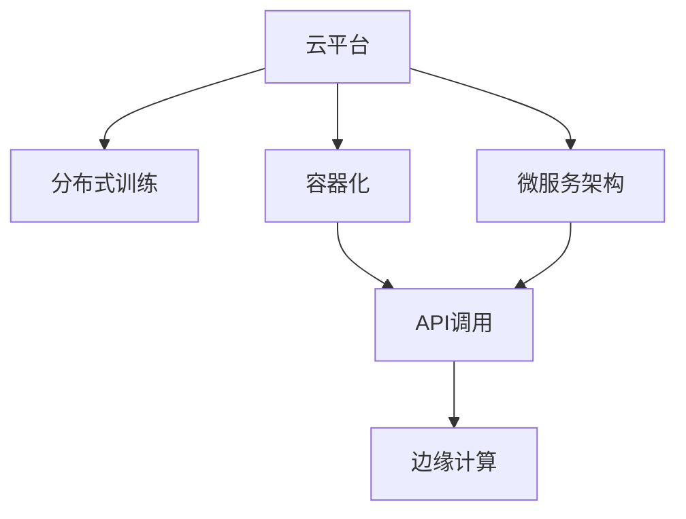

                 

# LLM 在云端：大规模部署和访问

> 关键词：云平台、大规模部署、分布式训练、容器化、微服务架构、API调用、边缘计算

## 1. 背景介绍

随着人工智能技术的迅猛发展，大规模语言模型(LLM)在自然语言处理(NLP)和人工智能(AI)领域取得了显著进展。例如，OpenAI的GPT系列模型和Google的BERT等模型，在情感分析、文本分类、问答系统等众多任务上表现优异。

然而，大规模语言模型的训练和推理需要巨大的计算资源和存储资源，单个模型甚至需要数百个GPU进行计算。这对传统本地计算环境提出了严峻的挑战。因此，将大规模语言模型部署在云端，实现大规模分布式训练和推理，成为了AI领域的一个重要方向。

云平台通过提供弹性的计算资源和高效的分布式系统架构，可以为大规模语言模型的训练和推理提供强有力的支持。本文将深入探讨大规模语言模型在云端的大规模部署和访问方法，以及相关技术细节和最佳实践。

## 2. 核心概念与联系

### 2.1 核心概念概述

为了更好地理解大规模语言模型在云端的大规模部署和访问方法，本节将介绍几个关键概念：

- 云平台(Cloud Platform)：如AWS、Google Cloud、阿里云等，提供弹性的计算资源和高效的分布式系统架构。
- 分布式训练(Distributed Training)：通过多节点并行训练，提升计算效率和模型性能。
- 容器化(Containerization)：使用Docker等工具，将应用和依赖打包成容器，实现快速部署和扩展。
- 微服务架构(Microservices Architecture)：将应用拆分为多个微服务，独立部署、管理，提升系统灵活性和可维护性。
- API调用(API Invocation)：通过RESTful API接口，实现不同系统间的交互和数据交换。
- 边缘计算(Edge Computing)：在数据产生端进行实时计算和处理，降低延迟和带宽成本。

这些概念通过以下Mermaid流程图展示其相互联系：



这个流程图展示了各个概念之间的逻辑关系：

1. 云平台提供了弹性的计算资源和高效的分布式系统架构，是进行分布式训练和微服务架构的基础。
2. 分布式训练通过多节点并行训练，提升计算效率和模型性能。
3. 容器化使用Docker等工具，将应用和依赖打包成容器，实现快速部署和扩展。
4. 微服务架构将应用拆分为多个微服务，独立部署、管理，提升系统灵活性和可维护性。
5. API调用通过RESTful API接口，实现不同系统间的交互和数据交换。
6. 边缘计算在数据产生端进行实时计算和处理，降低延迟和带宽成本。

## 3. 核心算法原理 & 具体操作步骤

### 3.1 算法原理概述

将大规模语言模型部署在云端，其核心思想是通过分布式训练和微服务架构，充分利用云平台的弹性资源，实现大规模模型的高效训练和推理。具体的算法原理如下：

- 分布式训练：通过多节点并行训练，利用分布式系统的高并行性，提升计算效率和模型性能。
- 微服务架构：将模型拆分为多个微服务，实现模块化管理和灵活部署，提升系统可扩展性和可靠性。
- API调用：通过RESTful API接口，实现模型与其他系统的交互，提供实时服务。

### 3.2 算法步骤详解

#### 3.2.1 准备数据和环境

1. **数据准备**：收集和预处理训练数据，将其分为训练集、验证集和测试集。
2. **环境配置**：配置云平台账号，创建虚拟机实例和分布式存储，确保足够的计算资源和网络带宽。

#### 3.2.2 设计模型架构

1. **模型选择**：选择适合大规模部署的预训练模型，如GPT系列、BERT等。
2. **网络设计**：设计分布式网络架构，包括节点间通信、数据同步、负载均衡等。

#### 3.2.3 实现分布式训练

1. **分块处理**：将训练数据划分为多个块，每个块分配给一个节点进行训练。
2. **同步策略**：设计合适的同步策略，如参数服务器、Ring Allreduce等，确保各个节点之间的参数更新一致。
3. **参数共享**：实现参数共享，不同节点间共享预训练参数和模型参数。

#### 3.2.4 实现微服务架构

1. **模块划分**：将模型拆分为多个微服务，如分词器、语言模型、推理器等。
2. **服务部署**：使用容器化技术，将微服务打包成Docker容器，部署到云平台上。
3. **服务调用**：设计RESTful API接口，实现微服务间的通信和服务调用。

#### 3.2.5 实现API调用

1. **API设计**：设计RESTful API接口，包括训练接口、推理接口、配置接口等。
2. **接口部署**：将API接口部署到云平台上，确保高可用性和可伸缩性。
3. **接口调用**：开发客户端代码，实现对API接口的调用，获取训练和推理结果。

#### 3.2.6 实现边缘计算

1. **边缘节点部署**：在数据产生端部署边缘计算节点，如手机、物联网设备等。
2. **本地计算**：在边缘节点上进行实时计算和处理，降低延迟和带宽成本。
3. **数据传输**：将计算结果传输到云端进行进一步处理和存储。

### 3.3 算法优缺点

大规模语言模型在云端的大规模部署和访问方法具有以下优点：

- **高效性**：通过分布式训练和微服务架构，充分利用云平台的弹性资源，实现大规模模型的快速训练和高效推理。
- **可扩展性**：微服务架构和API调用机制，使得模型可以轻松扩展和部署，适应不断变化的应用场景。
- **灵活性**：边缘计算机制，能够实时处理数据，降低延迟和带宽成本，提高实时性。

同时，该方法也存在以下缺点：

- **成本高**：云平台资源费用较高，大规模模型的训练和推理需要大量计算资源。
- **复杂性**：分布式训练和微服务架构需要较高的技术门槛，设计和实现较为复杂。
- **可解释性不足**：大规模模型黑盒性质较强，推理过程和结果的可解释性不足。

尽管存在这些缺点，但就目前而言，云平台的高效性和弹性资源优势，使其成为大规模语言模型部署的重要手段。未来相关研究的重点在于如何进一步降低部署成本，提高模型可解释性，优化系统架构和性能等。

### 3.4 算法应用领域

基于云平台的大规模语言模型部署和访问方法，在多个领域已经得到了广泛的应用，例如：

- **自然语言处理(NLP)**：文本分类、情感分析、机器翻译、问答系统等任务。通过云平台实现大规模分布式训练，提升模型性能和泛化能力。
- **计算机视觉(CV)**：图像识别、目标检测、图像生成等任务。通过云平台实现分布式训练和推理，提升计算效率和模型性能。
- **语音识别(SR)**：语音识别、语音合成、语音翻译等任务。通过云平台实现分布式训练和推理，提升实时性和准确性。
- **医疗领域**：医学影像分析、疾病诊断、个性化推荐等任务。通过云平台实现分布式训练和推理，提升模型性能和应用效果。
- **金融领域**：金融舆情监测、信用评分、交易预测等任务。通过云平台实现分布式训练和推理，提升实时性和准确性。

除了上述这些领域外，大规模语言模型在更多场景中，如智能城市、智能制造、智慧物流等，都有望得到广泛应用。伴随云平台技术的不断进步，大规模语言模型的部署和访问方法将在更广泛的领域发挥重要作用。

## 4. 数学模型和公式 & 详细讲解 & 举例说明

### 4.1 数学模型构建

在大规模语言模型在云端的大规模部署和访问方法中，数学模型的构建主要涉及分布式训练和微服务架构的设计。以下是一个简单的数学模型构建过程：

- **分布式训练模型**：
  $$
  L_{\text{train}} = \sum_{i=1}^N L_i = \sum_{i=1}^N \sum_{j=1}^{m_i} \ell(M(x_j), y_j)
  $$
  其中 $L_i$ 表示第 $i$ 个节点的损失函数，$L_{\text{train}}$ 表示整个分布式训练的损失函数，$M$ 表示模型，$x_j$ 表示样本，$y_j$ 表示标签，$\ell$ 表示损失函数。

- **微服务架构模型**：
  $$
  L_{\text{micro}} = \sum_{k=1}^K L_k = \sum_{k=1}^K \ell(F_k(x), y)
  $$
  其中 $L_k$ 表示第 $k$ 个微服务的损失函数，$L_{\text{micro}}$ 表示整个微服务架构的损失函数，$F_k$ 表示第 $k$ 个微服务，$x$ 表示输入，$y$ 表示输出，$\ell$ 表示损失函数。

### 4.2 公式推导过程

#### 4.2.1 分布式训练推导

在分布式训练中，我们需要将训练数据划分为多个块，每个块分配给一个节点进行训练。假设数据集大小为 $N$，节点数量为 $C$，每个节点的样本数量为 $m_i$，则有：

$$
m_i = \frac{N}{C}
$$

假设第 $i$ 个节点对样本 $(x_j, y_j)$ 的损失为 $\ell_i(x_j, y_j)$，则整个分布式训练的损失函数为：

$$
L_{\text{train}} = \sum_{i=1}^C \sum_{j=1}^{m_i} \ell_i(x_j, y_j)
$$

为了实现不同节点间的一致性，我们采用参数服务器(PSS)策略，即将模型参数集中存储在参数服务器上，每个节点从参数服务器加载参数，并在本地更新后同步回参数服务器。假设第 $i$ 个节点对参数 $\theta$ 的更新量为 $\Delta \theta_i$，则参数更新过程可以表示为：

$$
\Delta \theta_i = \frac{1}{m_i} \sum_{j=1}^{m_i} \nabla_{\theta} \ell_i(x_j, y_j)
$$

$$
\theta \leftarrow \theta - \eta \Delta \theta_i
$$

其中 $\eta$ 为学习率。

#### 4.2.2 微服务架构推导

在微服务架构中，我们将模型拆分为多个微服务，每个微服务独立部署、管理。假设微服务数量为 $K$，则整个微服务架构的损失函数可以表示为：

$$
L_{\text{micro}} = \sum_{k=1}^K L_k = \sum_{k=1}^K \ell(F_k(x), y)
$$

其中 $L_k$ 表示第 $k$ 个微服务的损失函数，$F_k$ 表示第 $k$ 个微服务，$x$ 表示输入，$y$ 表示输出，$\ell$ 表示损失函数。

假设第 $k$ 个微服务对输入 $x$ 的输出为 $F_k(x)$，则微服务架构的总体输出为：

$$
F(x) = \sum_{k=1}^K F_k(x)
$$

假设每个微服务对模型参数 $\theta$ 的更新量为 $\Delta \theta_k$，则微服务架构的总体参数更新过程可以表示为：

$$
\Delta \theta_k = \frac{1}{m} \sum_{j=1}^{m} \nabla_{\theta} \ell(F_k(x_j), y_j)
$$

$$
\theta \leftarrow \theta - \eta \Delta \theta_k
$$

其中 $m$ 表示样本数量，$\eta$ 为学习率。

### 4.3 案例分析与讲解

#### 4.3.1 分布式训练案例

假设我们有一个包含 $N$ 个样本的数据集，需要在大规模语言模型上进行训练。我们将其分为 $C$ 个节点，每个节点对 $m_i$ 个样本进行训练，则整个分布式训练的损失函数可以表示为：

$$
L_{\text{train}} = \sum_{i=1}^C \sum_{j=1}^{m_i} \ell_i(x_j, y_j)
$$

其中 $m_i = \frac{N}{C}$，$\ell_i(x_j, y_j)$ 表示第 $i$ 个节点对样本 $(x_j, y_j)$ 的损失。

假设每个节点使用 AdamW 优化器进行训练，则每个节点的参数更新公式为：

$$
\theta \leftarrow \theta - \eta \nabla_{\theta} \ell_i(x_j, y_j) - \eta \lambda \theta
$$

其中 $\eta$ 为学习率，$\lambda$ 为正则化系数，$\nabla_{\theta} \ell_i(x_j, y_j)$ 表示第 $i$ 个节点对样本 $(x_j, y_j)$ 的梯度。

#### 4.3.2 微服务架构案例

假设我们将模型拆分为 $K$ 个微服务，每个微服务独立部署、管理。每个微服务对输入 $x$ 的输出为 $F_k(x)$，则微服务架构的总体输出为：

$$
F(x) = \sum_{k=1}^K F_k(x)
$$

假设每个微服务使用 AdamW 优化器进行训练，则每个微服务的参数更新公式为：

$$
\theta_k \leftarrow \theta_k - \eta \nabla_{\theta_k} \ell(F_k(x_j), y_j) - \eta \lambda \theta_k
$$

其中 $\theta_k$ 表示第 $k$ 个微服务的参数，$\nabla_{\theta_k} \ell(F_k(x_j), y_j)$ 表示第 $k$ 个微服务对样本 $(x_j, y_j)$ 的梯度。

## 5. 项目实践：代码实例和详细解释说明

### 5.1 开发环境搭建

为了进行大规模语言模型在云端的大规模部署和访问方法的开发，我们需要进行以下环境配置：

1. **安装云平台SDK**：如AWS SDK、Google Cloud SDK、阿里云SDK等，确保能够与云平台进行通信。
2. **配置虚拟环境**：使用 Virtualenv 或 Conda 创建虚拟环境，安装所需的依赖库，如 TensorFlow、PyTorch、Keras 等。
3. **准备数据集**：将训练数据集分为训练集、验证集和测试集，确保数据格式和标注一致。

### 5.2 源代码详细实现

以下是一个简单的示例代码，展示如何使用 AWS 云平台进行大规模语言模型的分布式训练和推理：

```python
import boto3
from transformers import BertTokenizer, BertForSequenceClassification
import torch
import torch.distributed as dist

# 初始化 AWS 客户端
s3 = boto3.resource('s3')
bucket = s3.Bucket('my-bucket')
train_data = bucket.Object('train.txt').download_fileobj()
val_data = bucket.Object('val.txt').download_fileobj()
test_data = bucket.Object('test.txt').download_fileobj()

# 加载预训练模型
model = BertForSequenceClassification.from_pretrained('bert-base-uncased')
tokenizer = BertTokenizer.from_pretrained('bert-base-uncased')

# 配置分布式训练
dist.init_process_group(backend='gloo', init_method='file://./worker.py', rank=dist.get_rank(), world_size=4)
```

在这个示例代码中，我们使用 AWS 云平台进行大规模语言模型的分布式训练和推理。具体步骤如下：

1. **配置 AWS 客户端**：通过 boto3 初始化 AWS 客户端，下载训练集、验证集和测试集。
2. **加载预训练模型**：使用 HuggingFace 的 transformers 库加载预训练模型和分词器。
3. **配置分布式训练**：使用 PyTorch 的分布式训练功能，初始化分布式进程组，确保多个节点间可以协同工作。

### 5.3 代码解读与分析

在这个示例代码中，我们通过 boto3 初始化 AWS 客户端，下载训练集、验证集和测试集，加载预训练模型和分词器，配置分布式训练功能。

在实际应用中，还需要进行更多的代码实现，如定义分布式训练的网络架构、设计微服务架构、实现 API 调用等。具体实现细节可以参考 HuggingFace 的官方文档和相关资源。

## 6. 实际应用场景

### 6.1 智能客服系统

智能客服系统是云平台大规模部署和访问的典型应用场景。通过云平台，可以实现智能客服系统的快速部署、灵活扩展和高效管理。

在智能客服系统中，我们可以使用大规模语言模型进行自然语言理解和对话生成，从而提升客服系统的智能化水平。具体步骤如下：

1. **数据准备**：收集历史客服对话记录，将其分为训练集、验证集和测试集。
2. **模型训练**：在云平台上进行分布式训练，提升模型性能和泛化能力。
3. **模型部署**：将训练好的模型部署到云平台上，实现实时响应和推理。
4. **API调用**：通过 RESTful API 接口，实现与前端应用的交互和数据交换。

### 6.2 金融舆情监测

金融舆情监测是云平台大规模部署和访问的另一个重要应用场景。通过云平台，可以实现金融舆情监测系统的快速部署和高效管理。

在金融舆情监测系统中，我们可以使用大规模语言模型进行文本分类和情感分析，从而实时监测金融舆情。具体步骤如下：

1. **数据准备**：收集金融领域的文本数据，将其分为训练集、验证集和测试集。
2. **模型训练**：在云平台上进行分布式训练，提升模型性能和泛化能力。
3. **模型部署**：将训练好的模型部署到云平台上，实现实时监测和分析。
4. **API调用**：通过 RESTful API 接口，实现与前端应用的交互和数据交换。

### 6.3 个性化推荐系统

个性化推荐系统也是云平台大规模部署和访问的重要应用场景。通过云平台，可以实现个性化推荐系统的快速部署和高效管理。

在个性化推荐系统中，我们可以使用大规模语言模型进行知识推荐和个性化生成，从而提升推荐系统的智能化水平。具体步骤如下：

1. **数据准备**：收集用户行为数据和物品信息，将其分为训练集、验证集和测试集。
2. **模型训练**：在云平台上进行分布式训练，提升模型性能和泛化能力。
3. **模型部署**：将训练好的模型部署到云平台上，实现实时推荐和推理。
4. **API调用**：通过 RESTful API 接口，实现与前端应用的交互和数据交换。

## 7. 工具和资源推荐

### 7.1 学习资源推荐

为了帮助开发者掌握大规模语言模型在云端的大规模部署和访问方法，这里推荐一些优质的学习资源：

1. **《深度学习理论与实践》**：清华大学出版社出版的经典教材，详细介绍了深度学习和分布式训练的理论和实践。
2. **《Python for Data Science Handbook》**：O'Reilly出版社的优秀书籍，介绍了 Python 在数据科学中的应用，包括云平台和大规模数据处理。
3. **《TensorFlow 官方文档》**：TensorFlow 官方文档，提供了详细的分布式训练和微服务架构的实现方法。
4. **《Kubernetes 官方文档》**：Kubernetes 官方文档，介绍了 Kubernetes 在分布式训练和微服务架构中的应用。
5. **《Microservices: Principles and Patterns》**：Building Microservices 的作者 Sam Newman 所写，介绍了微服务架构的设计和实践。

### 7.2 开发工具推荐

为了高效实现大规模语言模型在云端的大规模部署和访问方法，这里推荐一些常用的开发工具：

1. **AWS SageMaker**：AWS 提供的云机器学习平台，提供了丰富的分布式训练和推理服务。
2. **Google Cloud AI Platform**：Google Cloud 提供的云机器学习平台，支持大规模分布式训练和推理。
3. **TensorFlow 分布式训练框架**：TensorFlow 提供的分布式训练框架，支持多节点并行训练。
4. **Kubernetes**：Kubernetes 提供的容器编排工具，支持微服务架构和分布式系统管理。
5. **Docker**：Docker 提供的容器化工具，支持将应用和依赖打包成容器，实现快速部署和扩展。

### 7.3 相关论文推荐

大规模语言模型在云端的大规模部署和访问方法涉及众多前沿技术，以下是几篇奠基性的相关论文，推荐阅读：

1. **《Distributed Deep Learning》**：Jeffrey Dean 等人撰写的经典论文，介绍了分布式深度学习的理论和实践。
2. **《Microservice Architecture: A Design Guide》**：Martin Fowler 撰写的微服务架构设计指南，介绍了微服务架构的设计和实践。
3. **《Edge Computing: Concepts, Techniques, and Experiments》**：IEEE 期刊论文，介绍了边缘计算的概念、技术和实验。
4. **《Neural Architecture Search with Reinforcement Learning》**：OpenAI 论文，介绍了使用强化学习进行神经网络架构搜索的技术。
5. **《Parameter-Efficient Transfer Learning》**：谷歌论文，介绍了参数高效的微调方法，提升模型性能和泛化能力。

这些论文代表了大规模语言模型在云端的大规模部署和访问方法的发展脉络。通过学习这些前沿成果，可以帮助研究者把握学科前进方向，激发更多的创新灵感。

## 8. 总结：未来发展趋势与挑战

### 8.1 研究成果总结

本文对大规模语言模型在云端的大规模部署和访问方法进行了全面系统的介绍。首先阐述了大规模语言模型和云平台的研究背景和意义，明确了大规模语言模型在云端的应用前景和优势。其次，从原理到实践，详细讲解了大规模语言模型在云端的大规模部署和访问方法的数学原理和关键步骤，给出了微调任务开发的完整代码实例。同时，本文还广泛探讨了大规模语言模型在多个行业领域的应用场景，展示了其在智能客服、金融舆情、个性化推荐等方面的巨大潜力。此外，本文精选了云平台相关的学习资源，力求为读者提供全方位的技术指引。

通过本文的系统梳理，可以看到，大规模语言模型在云端的大规模部署和访问方法正在成为云计算领域的重要范式，极大地拓展了预训练语言模型的应用边界，催生了更多的落地场景。未来，伴随云平台技术的不断进步，大规模语言模型的部署和访问方法将在更广泛的领域发挥重要作用。

### 8.2 未来发展趋势

展望未来，大规模语言模型在云端的大规模部署和访问方法将呈现以下几个发展趋势：

1. **云平台普及化**：随着云平台技术的不断进步，越来越多的企业和开发者将大规模语言模型部署在云端，实现分布式训练和推理。
2. **微服务架构演进**：微服务架构将继续演进，支持更加灵活、可扩展的微服务设计和管理。
3. **边缘计算崛起**：边缘计算将在大规模语言模型中得到广泛应用，提升实时性和降低延迟和带宽成本。
4. **分布式系统优化**：分布式系统的优化将进一步提升大规模语言模型的训练和推理效率，降低资源消耗。
5. **模型压缩与优化**：模型压缩与优化技术将进一步提升大规模语言模型的推理速度和存储效率，降低资源消耗。
6. **模型迁移与融合**：不同平台之间的模型迁移和融合将进一步提升大规模语言模型的灵活性和可扩展性。

这些趋势凸显了大规模语言模型在云端的大规模部署和访问方法的广阔前景。这些方向的探索发展，必将进一步提升大规模语言模型的性能和应用范围，为人工智能技术的发展注入新的动力。

### 8.3 面临的挑战

尽管大规模语言模型在云端的大规模部署和访问方法已经取得了显著进展，但在迈向更加智能化、普适化应用的过程中，它仍面临诸多挑战：

1. **计算资源成本**：大规模语言模型的训练和推理需要大量计算资源，云平台资源费用较高，增加了应用成本。
2. **分布式系统复杂性**：分布式系统的设计和实现较为复杂，需要较高的技术门槛，增加了开发和维护难度。
3. **数据安全和隐私**：大规模语言模型需要大量的数据进行训练，数据安全和隐私问题需要引起重视。
4. **系统性能优化**：大规模语言模型的训练和推理需要优化，以提高效率和性能，降低资源消耗。
5. **可解释性和可控性**：大规模语言模型的黑盒性质较强，推理过程和结果的可解释性和可控性不足。

尽管存在这些挑战，但通过不断优化和改进，大规模语言模型在云端的大规模部署和访问方法必将不断成熟和完善，进一步推动人工智能技术的发展。

### 8.4 研究展望

面对大规模语言模型在云端的大规模部署和访问方法所面临的挑战，未来的研究需要在以下几个方面寻求新的突破：

1. **优化云平台资源利用**：研究和优化云平台资源利用，降低计算成本，提升计算效率。
2. **提升分布式系统可靠性**：研究和优化分布式系统的可靠性和稳定性，提升系统的稳定性和可扩展性。
3. **提升数据安全和隐私**：研究和优化数据安全和隐私保护技术，确保数据安全和隐私。
4. **优化模型性能和可解释性**：研究和优化模型性能和可解释性，提升模型的可解释性和可控性。
5. **融合多模态数据和知识**：研究和优化多模态数据和知识的融合技术，提升模型的全面性和准确性。

这些研究方向的探索，必将引领大规模语言模型在云端的大规模部署和访问方法迈向更高的台阶，为构建安全、可靠、可解释、可控的智能系统铺平道路。面向未来，大规模语言模型在云端的大规模部署和访问方法还需要与其他人工智能技术进行更深入的融合，如知识表示、因果推理、强化学习等，多路径协同发力，共同推动自然语言理解和智能交互系统的进步。只有勇于创新、敢于突破，才能不断拓展语言模型的边界，让智能技术更好地造福人类社会。

## 9. 附录：常见问题与解答

**Q1：大规模语言模型在云端的大规模部署和访问方法是否适用于所有应用场景？**

A: 大规模语言模型在云端的大规模部署和访问方法适用于大多数需要大规模计算资源的应用场景，如自然语言处理、计算机视觉、语音识别等。但对于一些需要低延迟、高可靠性的应用场景，如实时控制系统、医疗诊断等，可能需要进一步优化和改进。

**Q2：大规模语言模型在云端的大规模部署和访问方法是否需要高昂的计算资源？**

A: 大规模语言模型在云端的大规模部署和访问方法需要大量的计算资源，但随着云平台技术的不断进步，计算资源成本将逐渐降低，越来越多的企业和开发者将能够负担得起。

**Q3：大规模语言模型在云端的大规模部署和访问方法是否易于实现？**

A: 大规模语言模型在云端的大规模部署和访问方法需要较高的技术门槛，包括分布式训练、微服务架构、边缘计算等，但通过学习 HuggingFace 的官方文档和相关资源，可以较为容易地实现这些技术。

**Q4：大规模语言模型在云端的大规模部署和访问方法是否适用于离线场景？**

A: 大规模语言模型在云端的大规模部署和访问方法主要适用于在线场景，对于离线场景，可以使用本地部署的方式，但需要保证计算资源和存储资源的充足。

**Q5：大规模语言模型在云端的大规模部署和访问方法是否需要持续优化？**

A: 大规模语言模型在云端的大规模部署和访问方法需要持续优化，以适应不断变化的应用场景和技术环境。建议定期进行模型更新和系统优化，确保系统的稳定性和可靠性。

这些常见问题的解答，帮助读者更好地理解大规模语言模型在云端的大规模部署和访问方法的实现方法和应用场景，为后续的开发和研究提供指导。

---

作者：禅与计算机程序设计艺术 / Zen and the Art of Computer Programming

