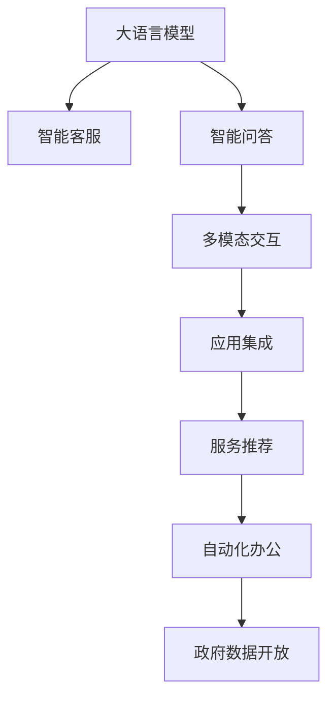

                 

# LLM 在公共服务领域：高效便民的新方式

> 关键词：大语言模型,智能客服,公共服务,智能问答,多模态交互,应用集成,服务推荐,自动化办公,政府数据开放

## 1. 背景介绍

### 1.1 问题由来

随着人工智能技术的快速发展和普及，大语言模型（Large Language Models, LLMs）在各行各业中展现出巨大的潜力。在公共服务领域，LLMs为提升服务质量、优化用户体验、增强政府治理能力提供了新的解决方案。然而，LLMs的应用也面临诸多挑战，如数据的隐私保护、模型的可解释性、系统的稳定性和安全性等。本文旨在探讨LLMs在公共服务领域的应用，提出有效的解决方案，为政府和企业提供借鉴。

### 1.2 问题核心关键点

- **数据隐私**：公共服务领域的数据涉及敏感信息，如何保护数据隐私是关键问题。
- **模型可解释性**：公众和政府需要了解LLMs的决策过程，确保系统的透明性和可解释性。
- **系统稳定性**：LLMs系统需要在高并发、大数据量等环境下稳定运行，确保服务质量。
- **安全性**：确保LLMs系统不受恶意攻击，保障数据和服务的可信度。

## 2. 核心概念与联系

### 2.1 核心概念概述

- **大语言模型（LLM）**：指通过大规模无标签数据进行预训练的语言模型，如GPT、BERT等。具备强大的自然语言理解和生成能力，能够进行多轮对话、文本摘要、情感分析等多种任务。
- **智能客服**：利用LLMs技术实现自动化的客户服务，提升响应速度和准确性。
- **智能问答系统**：通过LLMs构建的智能问答系统，为用户提供24/7的服务，解决用户疑难问题。
- **多模态交互**：将文本、语音、图像等多模态数据与LLMs结合，提供更丰富的服务形式。
- **应用集成**：将LLMs与其他政府和企业应用系统集成，实现信息共享和协同工作。
- **服务推荐**：通过分析用户行为和偏好，推荐最适合的服务和信息，提高用户体验。
- **自动化办公**：利用LLMs进行文档处理、信息检索、数据分析等自动化办公任务，提升工作效率。
- **政府数据开放**：政府部门通过开放数据接口，供企业和公众使用，促进数据共享和创新。

这些概念之间的逻辑关系可以通过以下Mermaid流程图来展示：



这个流程图展示了大语言模型在公共服务领域的应用场景，通过将大语言模型与各种服务相结合，能够提升服务的效率和质量。

## 3. 核心算法原理 & 具体操作步骤

### 3.1 算法原理概述

LLMs在公共服务领域的应用主要基于监督学习和无监督学习两种范式。监督学习通过大量标注数据训练LLM，使其能够理解特定领域的语言和知识。无监督学习则通过分析大量非结构化数据，提取通用语言模式和知识结构，适应不同的应用场景。

### 3.2 算法步骤详解

1. **数据收集与预处理**：收集公共服务领域的相关数据，包括用户查询、反馈、政府公告等。对数据进行清洗和标注，准备训练和测试集。
2. **模型训练**：使用监督学习或无监督学习的方法，训练LLM模型。对于监督学习，选择合适的损失函数和优化器，如交叉熵损失、Adam等。对于无监督学习，使用自监督任务，如掩码语言模型、文本生成等。
3. **模型评估与微调**：在测试集上评估模型性能，根据评估结果进行微调，优化模型参数，提升模型表现。
4. **应用集成与部署**：将训练好的LLM模型集成到公共服务系统中，部署到服务器或云平台，提供服务。

### 3.3 算法优缺点

#### 优点：

- **高效处理多轮对话**：LLMs能够理解上下文信息，进行多轮对话，提升用户体验。
- **快速响应与自动化处理**：自动化的客服和问答系统，可以24/7无间断地提供服务，提升响应速度和处理能力。
- **多模态数据处理**：支持语音、图像等多模态数据处理，提供更丰富的服务形式。
- **信息共享与协同**：通过应用集成，实现跨部门、跨系统的信息共享和协同工作，提升政府和企业的工作效率。
- **数据驱动的决策支持**：利用数据驱动的推荐系统，提供个性化的服务推荐，提高用户满意度。
- **自动化办公**：利用LLMs进行文档处理、数据分析等任务，提升办公效率和准确性。
- **数据开放与创新**：通过开放政府数据接口，促进数据共享和创新，提升公共服务水平。

#### 缺点：

- **数据隐私与安全问题**：涉及大量敏感信息，数据隐私和安全问题需高度重视。
- **模型可解释性不足**：LLMs作为黑盒模型，其决策过程难以解释，影响公众和政府的信任。
- **系统稳定性**：在处理高并发、大数据量时，系统稳定性需要特别关注。
- **计算资源消耗大**：大规模的预训练和微调需要大量的计算资源，可能对基础设施提出较高要求。
- **依赖高质量数据**：模型的性能高度依赖于标注数据的质量和数量，获取高质量数据成本较高。

### 3.4 算法应用领域

- **智能客服**：在银行、电信、电商等行业，利用LLMs构建智能客服系统，提升客户服务效率和满意度。
- **智能问答**：在医疗、教育、政府等领域，利用LLMs构建智能问答系统，解决用户疑难问题，提升服务水平。
- **多模态交互**：在交通、旅游、智慧城市等领域，利用LLMs进行多模态交互，提供更便捷、智能的服务体验。
- **应用集成**：在政府和企业中，利用LLMs进行应用集成，实现跨部门、跨系统的信息共享和协同工作。
- **服务推荐**：在电商、在线服务等领域，利用LLMs进行服务推荐，提高用户满意度和转化率。
- **自动化办公**：在政府和企业中，利用LLMs进行自动化办公任务，提升办公效率和准确性。
- **政府数据开放**：在政府中，通过开放数据接口，促进数据共享和创新，提升公共服务水平。

## 4. 数学模型和公式 & 详细讲解 & 举例说明

### 4.1 数学模型构建

假设我们有一个监督学习任务，训练数据集为 $D=\{(x_i,y_i)\}_{i=1}^N$，其中 $x_i$ 为输入，$y_i$ 为标签。我们希望构建一个二分类模型 $M_{\theta}(x)$，其中 $\theta$ 为模型参数。模型的损失函数为：

$$
\mathcal{L}(\theta) = \frac{1}{N} \sum_{i=1}^N \ell(M_{\theta}(x_i),y_i)
$$

其中 $\ell$ 为损失函数，如交叉熵损失。

### 4.2 公式推导过程

对于二分类任务，交叉熵损失函数为：

$$
\ell(M_{\theta}(x_i),y_i) = -y_i\log M_{\theta}(x_i) - (1-y_i)\log(1-M_{\theta}(x_i))
$$

代入损失函数中，得：

$$
\mathcal{L}(\theta) = -\frac{1}{N} \sum_{i=1}^N [y_i\log M_{\theta}(x_i)+(1-y_i)\log(1-M_{\theta}(x_i))]
$$

通过反向传播算法，可以计算出模型参数 $\theta$ 的梯度，使用优化器进行参数更新，最小化损失函数 $\mathcal{L}(\theta)$。

### 4.3 案例分析与讲解

以智能客服系统为例，我们可以将用户查询作为输入 $x_i$，系统生成的回复作为输出 $y_i$。通过收集大量历史数据，训练LLM模型 $M_{\theta}(x)$，使其能够理解用户查询，并生成合适的回复。模型的训练过程如下：

1. 收集用户查询和回复数据，进行数据清洗和标注。
2. 使用交叉熵损失函数，训练LLM模型 $M_{\theta}(x)$。
3. 在测试集上评估模型性能，根据评估结果进行微调。
4. 将训练好的模型部署到智能客服系统中，提供服务。

## 5. 项目实践：代码实例和详细解释说明

### 5.1 开发环境搭建

1. **环境准备**：安装Python、PyTorch、TensorFlow等深度学习框架，以及相关的LLM模型库。
2. **数据准备**：收集并处理公共服务领域的数据，准备训练和测试集。
3. **模型训练**：选择合适的预训练模型，使用监督学习或无监督学习的方法，训练LLM模型。
4. **模型评估与微调**：在测试集上评估模型性能，根据评估结果进行微调。
5. **应用部署**：将训练好的LLM模型部署到公共服务系统中，提供服务。

### 5.2 源代码详细实现

以下是一个简单的智能客服系统的实现示例：

```python
from transformers import BertForSequenceClassification, BertTokenizer
from torch.utils.data import DataLoader, Dataset
from sklearn.metrics import accuracy_score
import torch.nn.functional as F

class CustomDataset(Dataset):
    def __init__(self, data, tokenizer):
        self.data = data
        self.tokenizer = tokenizer
    
    def __len__(self):
        return len(self.data)
    
    def __getitem__(self, index):
        text = self.data[index]
        return self.tokenizer(text, return_tensors='pt')['input_ids']

class CustomModel(BertForSequenceClassification):
    def __init__(self, num_labels=2):
        super().__init__()
        self.num_labels = num_labels
    
    def forward(self, input_ids, attention_mask=None):
        outputs = super().forward(input_ids, attention_mask=attention_mask)
        return outputs[0]

# 数据准备
tokenizer = BertTokenizer.from_pretrained('bert-base-uncased')
train_data = ['用户查询1', '用户查询2', ...]
train_labels = [0, 1, ...]
train_dataset = CustomDataset(train_data, tokenizer)

# 模型训练
model = CustomModel(num_labels=2)
optimizer = torch.optim.Adam(model.parameters(), lr=2e-5)
criterion = torch.nn.CrossEntropyLoss()
device = torch.device('cuda' if torch.cuda.is_available() else 'cpu')
model.to(device)

for epoch in range(5):
    model.train()
    for batch in DataLoader(train_dataset, batch_size=8):
        input_ids = batch.to(device)
        labels = train_labels.to(device)
        optimizer.zero_grad()
        outputs = model(input_ids)
        loss = criterion(outputs, labels)
        loss.backward()
        optimizer.step()
    
    model.eval()
    with torch.no_grad():
        test_data = [测试数据]
        test_labels = [测试标签]
        test_dataset = CustomDataset(test_data, tokenizer)
        test_loader = DataLoader(test_dataset, batch_size=8)
        test_preds = []
        for batch in test_loader:
            input_ids = batch.to(device)
            outputs = model(input_ids)
            test_preds.append(outputs.argmax(dim=1).tolist())
        test_preds = torch.tensor(test_preds, dtype=torch.long)
        test_labels = torch.tensor(test_labels, dtype=torch.long)
        accuracy = accuracy_score(test_labels, test_preds)
        print(f'Epoch {epoch+1}, Accuracy: {accuracy:.3f}')

# 应用部署
model.eval()
with torch.no_grad():
    for batch in test_loader:
        input_ids = batch.to(device)
        outputs = model(input_ids)
        print(f'输入: {batch[0].tolist()}, 输出: {outputs.tolist()}')
```

### 5.3 代码解读与分析

上述代码实现了一个简单的二分类智能客服系统，主要步骤如下：

1. **数据准备**：定义了数据处理类 `CustomDataset`，用于将用户查询转换为模型可用的格式。
2. **模型定义**：定义了一个基于BERT的自定义模型 `CustomModel`，用于处理用户查询和生成回复。
3. **模型训练**：使用交叉熵损失函数，在训练集上进行模型训练。
4. **模型评估**：在测试集上评估模型性能，计算准确率。
5. **应用部署**：将训练好的模型部署到智能客服系统中，提供服务。

## 6. 实际应用场景

### 6.1 智能客服

智能客服系统能够通过LLMs理解用户查询，生成合适的回复，提升客户服务效率和满意度。例如，银行客服系统可以处理各种金融咨询，保险公司客服系统可以处理理赔申请，电商客服系统可以处理订单处理等。

### 6.2 智能问答

智能问答系统能够通过LLMs回答用户疑难问题，提升服务水平。例如，政府智能问答系统可以回答政策法规、办事流程等问题，医疗智能问答系统可以回答疾病诊断、治疗方案等问题。

### 6.3 多模态交互

多模态交互系统能够通过LLMs处理语音、图像等多模态数据，提供更便捷、智能的服务体验。例如，智慧城市中的交通导航系统可以处理语音指令和图像识别，智慧医疗中的诊断系统可以处理医学影像和电子病历。

### 6.4 应用集成

应用集成系统能够通过LLMs实现跨部门、跨系统的信息共享和协同工作。例如，政府部门之间的政务协同平台可以处理跨部门业务，企业内部的协作系统可以处理跨部门任务。

### 6.5 服务推荐

服务推荐系统能够通过LLMs分析用户行为和偏好，推荐最适合的服务和信息，提高用户满意度。例如，电商平台的推荐系统可以推荐商品和优惠信息，新闻媒体的推荐系统可以推荐相关文章和视频。

### 6.6 自动化办公

自动化办公系统能够通过LLMs处理文档、数据等自动化办公任务，提升办公效率和准确性。例如，政府企业的自动化办公平台可以处理文档扫描、信息检索、数据分析等任务。

### 6.7 政府数据开放

政府数据开放平台能够通过LLMs处理开放数据接口，促进数据共享和创新。例如，政府的数据开放平台可以提供公共服务数据，企业可以基于这些数据进行创新应用开发。

## 7. 工具和资源推荐

### 7.1 学习资源推荐

- **深度学习书籍**：《深度学习》(花书)、《自然语言处理综论》等。
- **在线课程**：Coursera、Udacity上的深度学习、自然语言处理课程。
- **在线论坛**：Kaggle、Stack Overflow等。

### 7.2 开发工具推荐

- **深度学习框架**：PyTorch、TensorFlow等。
- **LLM模型库**：Hugging Face Transformers、OpenAI GPT等。
- **应用集成平台**：AWS、Google Cloud、Microsoft Azure等。

### 7.3 相关论文推荐

- **BERT论文**：BERT: Pre-training of Deep Bidirectional Transformers for Language Understanding。
- **GPT-3论文**：Language Models are Unsupervised Multitask Learners。
- **LLM应用论文**：BERT-based Text Classification with Transfer Learning，BERT for Sequence Generation等。

## 8. 总结：未来发展趋势与挑战

### 8.1 研究成果总结

LLM在公共服务领域的应用已经取得了显著的成果，提升了服务效率和用户体验。然而，数据隐私、模型可解释性、系统稳定性等挑战仍需进一步解决。

### 8.2 未来发展趋势

1. **数据隐私保护**：通过差分隐私、联邦学习等技术，保护数据隐私和安全。
2. **模型可解释性**：引入可解释性模型，如LIME、SHAP等，提升模型的透明度和可信度。
3. **系统稳定性**：使用分布式训练、负载均衡等技术，提高系统的稳定性和扩展性。
4. **计算资源优化**：利用云计算、边缘计算等技术，优化计算资源消耗。
5. **数据质量提升**：利用数据增强、数据清洗等技术，提高数据质量和标注数据的数量。

### 8.3 面临的挑战

- **数据隐私问题**：公共服务领域的数据涉及敏感信息，数据隐私和安全问题需高度重视。
- **模型可解释性不足**：LLMs作为黑盒模型，其决策过程难以解释，影响公众和政府的信任。
- **系统稳定性**：在处理高并发、大数据量时，系统稳定性需要特别关注。
- **计算资源消耗大**：大规模的预训练和微调需要大量的计算资源，可能对基础设施提出较高要求。
- **依赖高质量数据**：模型的性能高度依赖于标注数据的质量和数量，获取高质量数据成本较高。

### 8.4 研究展望

未来的研究需要在以下几个方面寻求新的突破：

1. **数据隐私保护**：通过差分隐私、联邦学习等技术，保护数据隐私和安全。
2. **模型可解释性**：引入可解释性模型，如LIME、SHAP等，提升模型的透明度和可信度。
3. **系统稳定性**：使用分布式训练、负载均衡等技术，提高系统的稳定性和扩展性。
4. **计算资源优化**：利用云计算、边缘计算等技术，优化计算资源消耗。
5. **数据质量提升**：利用数据增强、数据清洗等技术，提高数据质量和标注数据的数量。

总之，LLMs在公共服务领域的应用前景广阔，但需要解决数据隐私、模型可解释性等诸多挑战，才能真正实现大规模落地应用。

## 9. 附录：常见问题与解答

**Q1：LLMs在公共服务领域的应用有哪些？**

A: LLMs在公共服务领域的应用包括智能客服、智能问答、多模态交互、应用集成、服务推荐、自动化办公、政府数据开放等。

**Q2：LLMs在应用过程中如何保护数据隐私？**

A: 通过差分隐私、联邦学习等技术，保护数据隐私和安全。

**Q3：LLMs的系统稳定性如何保障？**

A: 使用分布式训练、负载均衡等技术，提高系统的稳定性和扩展性。

**Q4：LLMs的计算资源消耗如何优化？**

A: 利用云计算、边缘计算等技术，优化计算资源消耗。

**Q5：LLMs如何提高模型可解释性？**

A: 引入可解释性模型，如LIME、SHAP等，提升模型的透明度和可信度。

---

作者：禅与计算机程序设计艺术 / Zen and the Art of Computer Programming

