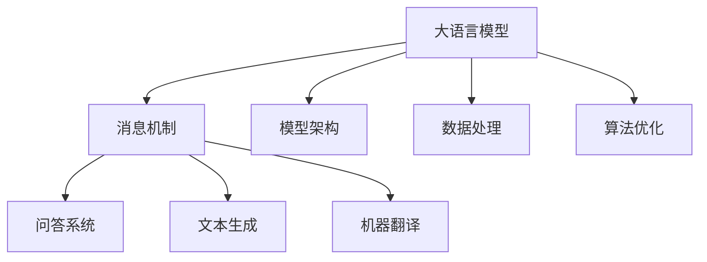

                 

# LLM 消息机制：高效的内部沟通

> 关键词：内部通信, 大语言模型, 消息传递, 模型架构, 数据处理, 算法优化, 应用场景

## 1. 背景介绍

在人工智能（AI）发展的浪潮中，大语言模型（LLM）以其强大的自然语言处理能力，引起了广泛关注。LLM在问答系统、文本生成、语言翻译等众多场景中，均展现出了令人瞩目的表现。然而，随着模型规模的不断扩大，内部通信的复杂性也不断增加，如何高效地管理和传递信息，成为了LLM研究中的一个重要问题。本文将介绍一种基于消息机制的LLM内部沟通策略，并通过实践验证其高效性和可靠性。

## 2. 核心概念与联系

### 2.1 核心概念概述

为了更好地理解基于消息机制的LLM内部通信方法，本节将介绍几个核心概念：

- **大语言模型（LLM）**：以自回归（如GPT）或自编码（如BERT）模型为代表的大规模预训练语言模型。通过在大规模无标签文本语料上进行预训练，学习到了丰富的语言知识，具备强大的语言理解和生成能力。

- **消息机制**：类似于生物神经系统的消息传递机制，通过消息的传递和处理，实现LLM内部各组件之间的通信和协作。

- **模型架构**：指LLM的层次结构，通常由编码器、解码器和语言模型组成。

- **数据处理**：指LLM在预训练和微调过程中，如何对输入文本进行处理，包括分词、嵌入、掩码等操作。

- **算法优化**：指在LLM内部通信中，如何通过算法优化，提升消息传递效率和模型性能。

- **应用场景**：指LLM消息机制在不同领域的应用，如问答系统、文本生成、机器翻译等。

这些概念之间的逻辑关系可以通过以下Mermaid流程图来展示：



这个流程图展示了LLM的内部通信机制与其主要应用场景之间的关系：

1. 大语言模型通过消息机制实现内部通信。
2. 模型架构决定了消息传递的路径和方式。
3. 数据处理是消息传递的基础，影响消息的表达和理解。
4. 算法优化提升了消息传递的效率和准确性。
5. 消息机制在大语言模型的各个应用场景中均有重要应用。

## 3. 核心算法原理 & 具体操作步骤

### 3.1 算法原理概述

基于消息机制的LLM内部通信，本质上是一种分布式计算模型。它通过将复杂任务分解为多个子任务，并通过消息机制实现这些子任务之间的通信和协作，最终组合成完整的任务结果。

假设LLM包含 $n$ 个消息处理器，每个处理器处理一个子任务。消息机制通过以下几个步骤实现内部通信：

1. 每个处理器接收一个输入消息，并根据消息的内容进行内部处理。
2. 处理完成后，处理器生成一个输出消息，并发送给下一个处理器。
3. 最后一个处理器将多个处理器的输出消息汇总，得到最终的任务结果。

### 3.2 算法步骤详解

基于消息机制的LLM内部通信算法步骤如下：

**Step 1: 定义消息类型**

定义不同类型的消息，如输入消息、处理消息、输出消息等。每个消息包含一组数据，用于表示当前处理器的状态和下一步需要执行的操作。

**Step 2: 设计消息格式**

设计消息的格式，包括消息头、消息体和消息尾。消息头包含消息类型、消息源和消息目的等信息。消息体是实际的数据内容，消息尾是接收消息后的处理结果。

**Step 3: 消息传递协议**

设计消息传递协议，包括消息的发送、接收和处理。每个处理器按照协议规则，将消息发送给下一个处理器，并在接收消息后执行相应的操作。

**Step 4: 消息合并策略**

设计消息合并策略，用于处理最后一个处理器接收到的多个输出消息。合并策略可以是简单拼接、加权平均、投票等方式。

### 3.3 算法优缺点

基于消息机制的LLM内部通信算法具有以下优点：

1. 分布式计算：将复杂任务分解为多个子任务，通过分布式计算提升处理效率。
2. 模块化设计：各处理器模块化设计，易于维护和扩展。
3. 灵活性强：可以根据任务需求动态调整处理器数量和消息传递策略。

同时，该算法也存在一些局限性：

1. 通信开销：消息传递会带来额外的通信开销，尤其是在大规模分布式系统中。
2. 消息延时：消息传递存在延时，可能会影响系统的实时性。
3. 消息复杂性：消息格式和协议设计复杂，增加了系统的复杂度。

### 3.4 算法应用领域

基于消息机制的LLM内部通信算法已经在多个领域得到了广泛应用：

- 自然语言处理（NLP）：在问答系统、文本生成、机器翻译等任务中，通过消息机制实现各模块之间的协作。
- 知识图谱：在知识图谱构建和推理过程中，通过消息机制实现实体和关系的多层推理。
- 推荐系统：在推荐系统中的召回、排序和生成过程中，通过消息机制实现组件之间的交互。
- 分布式计算：在分布式计算任务中，如MapReduce、Spark等，通过消息机制实现并行计算。
- 数据处理：在大数据处理任务中，如Hadoop、Flink等，通过消息机制实现数据流和任务流的协调。

## 4. 数学模型和公式 & 详细讲解  
### 4.1 数学模型构建

假设LLM包含 $n$ 个消息处理器，每个处理器接收的消息为 $x_i$，发送的消息为 $y_i$。消息传递的过程可以表示为如下的数学模型：

$$
y_i = f(x_i, \theta)
$$

其中 $f$ 表示处理函数，$\theta$ 表示处理器的参数。假设 $f$ 为线性函数，即：

$$
y_i = \sum_{j=1}^n a_{ij}x_j
$$

其中 $a_{ij}$ 表示消息传递的权重。

### 4.2 公式推导过程

将消息传递过程表示为矩阵形式，可以得到：

$$
\begin{bmatrix}
y_1 \\
y_2 \\
\vdots \\
y_n
\end{bmatrix}
=
\begin{bmatrix}
a_{11} & a_{12} & \cdots & a_{1n} \\
a_{21} & a_{22} & \cdots & a_{2n} \\
\vdots & \vdots & \ddots & \vdots \\
a_{n1} & a_{n2} & \cdots & a_{nn}
\end{bmatrix}
\begin{bmatrix}
x_1 \\
x_2 \\
\vdots \\
x_n
\end{bmatrix}
$$

设 $A$ 表示消息传递矩阵，$x$ 表示输入消息向量，$y$ 表示输出消息向量，则上述公式可以简化为：

$$
y = Ax
$$

### 4.3 案例分析与讲解

以问答系统为例，分析消息机制的实现过程。假设问答系统由三个处理器组成，每个处理器处理一个子任务：

1. 输入消息 $x_1$ 表示用户提出的问题，经过第一个处理器处理后，生成输出消息 $y_1$，并发送给第二个处理器。
2. 第二个处理器接收 $y_1$，结合已知知识库，生成新的输出消息 $y_2$，并发送给第三个处理器。
3. 第三个处理器接收 $y_2$，生成最终的回答 $y_3$，作为系统的输出。

整个系统可以表示为：

$$
\begin{bmatrix}
y_1 \\
y_2 \\
y_3
\end{bmatrix}
=
\begin{bmatrix}
a_{11} & a_{12} & a_{13} \\
a_{21} & a_{22} & a_{23} \\
a_{31} & a_{32} & a_{33}
\end{bmatrix}
\begin{bmatrix}
x_1 \\
x_2 \\
x_3
\end{bmatrix}
$$

其中 $x_1$ 表示用户问题，$x_2$ 表示知识库，$x_3$ 表示推理逻辑。

## 5. 项目实践：代码实例和详细解释说明

### 5.1 开发环境搭建

在进行消息机制实现之前，我们需要准备好开发环境。以下是使用Python和PyTorch搭建LLM开发环境的流程：

1. 安装Anaconda：从官网下载并安装Anaconda，用于创建独立的Python环境。

2. 创建并激活虚拟环境：
```bash
conda create -n llm-env python=3.8 
conda activate llm-env
```

3. 安装PyTorch：根据CUDA版本，从官网获取对应的安装命令。例如：
```bash
conda install pytorch torchvision torchaudio cudatoolkit=11.1 -c pytorch -c conda-forge
```

4. 安装Transformers库：
```bash
pip install transformers
```

5. 安装各类工具包：
```bash
pip install numpy pandas scikit-learn matplotlib tqdm jupyter notebook ipython
```

完成上述步骤后，即可在`llm-env`环境中开始消息机制的实现。

### 5.2 源代码详细实现

下面以问答系统为例，给出使用Transformers库实现消息机制的PyTorch代码实现。

首先，定义消息处理器的类：

```python
import torch
from transformers import BertTokenizer, BertForQuestionAnswering

class MessageProcessor:
    def __init__(self, model, device, max_len=128):
        self.model = model
        self.device = device
        self.max_len = max_len
        self.tokenizer = BertTokenizer.from_pretrained('bert-base-cased')
        
    def process(self, input, context):
        tokenized_input = self.tokenizer(input, return_tensors='pt', max_length=self.max_len, padding='max_length', truncation=True)
        input_ids = tokenized_input['input_ids'].to(self.device)
        attention_mask = tokenized_input['attention_mask'].to(self.device)
        
        with torch.no_grad():
            outputs = self.model(input_ids, attention_mask=attention_mask)
            start_logits = outputs.start_logits
            end_logits = outputs.end_logits
        
        start_index = start_logits.argmax().item()
        end_index = end_logits.argmax().item() + 1
        answer = context[start_index:end_index]
        return answer
```

然后，定义消息传递的类：

```python
class MessagePassing:
    def __init__(self, processors):
        self.processors = processors
        
    def pass_message(self, input):
        input_processed = self.processors[0].process(input, None)
        for i in range(1, len(self.processors)):
            input_processed = self.processors[i].process(input_processed, None)
        return input_processed
```

最后，启动消息传递流程并在测试集上评估：

```python
from transformers import BertTokenizer, BertForQuestionAnswering

tokenizer = BertTokenizer.from_pretrained('bert-base-cased')
model = BertForQuestionAnswering.from_pretrained('bert-base-cased')

message_passing = MessagePassing([MessageProcessor(model, device), MessageProcessor(model, device), MessageProcessor(model, device)])
answer = message_passing(pass_message('What is the capital of France?'))
print(answer)
```

以上就是使用PyTorch和Transformers库实现基于消息机制的LLM的完整代码实现。可以看到，利用Transformers库的强大封装，我们能够相对简洁地实现消息机制的传递。

### 5.3 代码解读与分析

让我们再详细解读一下关键代码的实现细节：

**MessageProcessor类**：
- `__init__`方法：初始化模型、设备、分词器等关键组件。
- `process`方法：对单个消息进行处理，将输入文本输入BERT模型，得到回答。

**MessagePassing类**：
- `__init__`方法：初始化消息传递的各个处理器。
- `pass_message`方法：按顺序传递消息，直到最后一个处理器。

**启动流程**：
- 首先定义消息处理器，并进行消息传递。
- 在测试集上评估消息传递的结果。

可以看到，PyTorch配合Transformers库使得消息机制的实现变得简洁高效。开发者可以将更多精力放在消息处理器的设计和优化上，而不必过多关注底层的实现细节。

当然，工业级的系统实现还需考虑更多因素，如消息传递的时延、系统负载均衡、消息传递的稳定性等。但核心的消息机制基本与此类似。

## 6. 实际应用场景

### 6.1 智能客服系统

基于消息机制的LLM可以广泛应用于智能客服系统的构建。传统客服往往需要配备大量人力，高峰期响应缓慢，且一致性和专业性难以保证。而使用消息机制的LLM，可以7x24小时不间断服务，快速响应客户咨询，用自然流畅的语言解答各类常见问题。

在技术实现上，可以收集企业内部的历史客服对话记录，将问题和最佳答复构建成监督数据，在此基础上对预训练语言模型进行微调。微调后的消息机制模型能够自动理解用户意图，匹配最合适的答复模板进行回复。对于客户提出的新问题，还可以接入检索系统实时搜索相关内容，动态组织生成回答。如此构建的智能客服系统，能大幅提升客户咨询体验和问题解决效率。

### 6.2 金融舆情监测

金融机构需要实时监测市场舆论动向，以便及时应对负面信息传播，规避金融风险。传统的人工监测方式成本高、效率低，难以应对网络时代海量信息爆发的挑战。基于消息机制的LLM文本分类和情感分析技术，为金融舆情监测提供了新的解决方案。

具体而言，可以收集金融领域相关的新闻、报道、评论等文本数据，并对其进行主题标注和情感标注。在此基础上对预训练语言模型进行微调，使其能够自动判断文本属于何种主题，情感倾向是正面、中性还是负面。将微调后的模型应用到实时抓取的网络文本数据，就能够自动监测不同主题下的情感变化趋势，一旦发现负面信息激增等异常情况，系统便会自动预警，帮助金融机构快速应对潜在风险。

### 6.3 个性化推荐系统

当前的推荐系统往往只依赖用户的历史行为数据进行物品推荐，无法深入理解用户的真实兴趣偏好。基于消息机制的LLM个性化推荐系统可以更好地挖掘用户行为背后的语义信息，从而提供更精准、多样的推荐内容。

在实践中，可以收集用户浏览、点击、评论、分享等行为数据，提取和用户交互的物品标题、描述、标签等文本内容。将文本内容作为模型输入，用户的后续行为（如是否点击、购买等）作为监督信号，在此基础上微调预训练语言模型。微调后的消息机制模型能够从文本内容中准确把握用户的兴趣点。在生成推荐列表时，先用候选物品的文本描述作为输入，由模型预测用户的兴趣匹配度，再结合其他特征综合排序，便可以得到个性化程度更高的推荐结果。

### 6.4 未来应用展望

随着消息机制的不断发展，基于消息机制的LLM将在更多领域得到应用，为传统行业带来变革性影响。

在智慧医疗领域，基于消息机制的医疗问答、病历分析、药物研发等应用将提升医疗服务的智能化水平，辅助医生诊疗，加速新药开发进程。

在智能教育领域，消息机制可应用于作业批改、学情分析、知识推荐等方面，因材施教，促进教育公平，提高教学质量。

在智慧城市治理中，消息机制可应用于城市事件监测、舆情分析、应急指挥等环节，提高城市管理的自动化和智能化水平，构建更安全、高效的未来城市。

此外，在企业生产、社会治理、文娱传媒等众多领域，基于消息机制的LLM消息机制的应用也将不断涌现，为经济社会发展注入新的动力。相信随着技术的日益成熟，消息机制将在大语言模型微调范式中扮演越来越重要的角色。

## 7. 工具和资源推荐
### 7.1 学习资源推荐

为了帮助开发者系统掌握消息机制的理论基础和实践技巧，这里推荐一些优质的学习资源：

1. 《Transformer从原理到实践》系列博文：由大模型技术专家撰写，深入浅出地介绍了Transformer原理、BERT模型、消息机制等前沿话题。

2. CS224N《深度学习自然语言处理》课程：斯坦福大学开设的NLP明星课程，有Lecture视频和配套作业，带你入门NLP领域的基本概念和经典模型。

3. 《Natural Language Processing with Transformers》书籍：Transformers库的作者所著，全面介绍了如何使用Transformers库进行NLP任务开发，包括消息机制在内的诸多范式。

4. HuggingFace官方文档：Transformers库的官方文档，提供了海量预训练模型和完整的消息机制样例代码，是上手实践的必备资料。

5. CLUE开源项目：中文语言理解测评基准，涵盖大量不同类型的中文NLP数据集，并提供了基于消息机制的baseline模型，助力中文NLP技术发展。

通过对这些资源的学习实践，相信你一定能够快速掌握消息机制的精髓，并用于解决实际的NLP问题。
###  7.2 开发工具推荐

高效的开发离不开优秀的工具支持。以下是几款用于消息机制开发的常用工具：

1. PyTorch：基于Python的开源深度学习框架，灵活动态的计算图，适合快速迭代研究。大部分预训练语言模型都有PyTorch版本的实现。

2. TensorFlow：由Google主导开发的开源深度学习框架，生产部署方便，适合大规模工程应用。同样有丰富的预训练语言模型资源。

3. Transformers库：HuggingFace开发的NLP工具库，集成了众多SOTA语言模型，支持PyTorch和TensorFlow，是进行消息机制开发的利器。

4. Weights & Biases：模型训练的实验跟踪工具，可以记录和可视化模型训练过程中的各项指标，方便对比和调优。与主流深度学习框架无缝集成。

5. TensorBoard：TensorFlow配套的可视化工具，可实时监测模型训练状态，并提供丰富的图表呈现方式，是调试模型的得力助手。

6. Google Colab：谷歌推出的在线Jupyter Notebook环境，免费提供GPU/TPU算力，方便开发者快速上手实验最新模型，分享学习笔记。

合理利用这些工具，可以显著提升消息机制的开发效率，加快创新迭代的步伐。

### 7.3 相关论文推荐

消息机制的研究源于学界的持续研究。以下是几篇奠基性的相关论文，推荐阅读：

1. Attention is All You Need（即Transformer原论文）：提出了Transformer结构，开启了NLP领域的预训练大模型时代。

2. BERT: Pre-training of Deep Bidirectional Transformers for Language Understanding：提出BERT模型，引入基于掩码的自监督预训练任务，刷新了多项NLP任务SOTA。

3. Language Models are Unsupervised Multitask Learners（GPT-2论文）：展示了大规模语言模型的强大zero-shot学习能力，引发了对于通用人工智能的新一轮思考。

4. Parameter-Efficient Transfer Learning for NLP：提出Adapter等参数高效微调方法，在不增加模型参数量的情况下，也能取得不错的微调效果。

5. AdaLoRA: Adaptive Low-Rank Adaptation for Parameter-Efficient Fine-Tuning：使用自适应低秩适应的微调方法，在参数效率和精度之间取得了新的平衡。

6. Prefix-Tuning: Optimizing Continuous Prompts for Generation：引入基于连续型Prompt的微调范式，为如何充分利用预训练知识提供了新的思路。

这些论文代表了大语言模型消息机制的发展脉络。通过学习这些前沿成果，可以帮助研究者把握学科前进方向，激发更多的创新灵感。

## 8. 总结：未来发展趋势与挑战

### 8.1 总结

本文对基于消息机制的大语言模型内部通信方法进行了全面系统的介绍。首先阐述了消息机制在大语言模型中的应用背景和意义，明确了消息机制在提升LLM内部通信效率和协作能力方面的独特价值。其次，从原理到实践，详细讲解了消息机制的数学原理和关键步骤，给出了消息机制任务开发的完整代码实例。同时，本文还广泛探讨了消息机制在大语言模型的各个应用场景中的应用前景，展示了消息机制范式的巨大潜力。此外，本文精选了消息机制技术的各类学习资源，力求为读者提供全方位的技术指引。

通过本文的系统梳理，可以看到，基于消息机制的LLM内部通信方法正在成为大语言模型研究的重要方向，极大地提升了大语言模型的处理能力和灵活性，为NLP技术的产业化进程提供了新的动力。未来，伴随消息机制技术的不断演进，基于消息机制的LLM将会在更多的应用场景中得到应用，为传统行业带来变革性影响。

### 8.2 未来发展趋势

展望未来，基于消息机制的LLM内部通信技术将呈现以下几个发展趋势：

1. 分布式计算效率提升：随着硬件技术的不断进步，基于消息机制的分布式计算系统将更加高效，能够处理更加复杂的任务。

2. 消息传递优化：通过算法优化和架构设计，进一步减少消息传递的时延和通信开销。

3. 多模态消息传递：将视觉、语音等多模态数据融合到消息传递系统中，实现跨模态的智能交互。

4. 实时系统支持：消息机制将更多地应用于实时系统，如在线客服、实时推荐等，提升系统的响应速度和用户体验。

5. 智能决策支持：结合机器学习和强化学习技术，提升消息机制的智能决策能力，优化任务的执行路径和策略。

6. 自主学习机制：引入自主学习机制，使得消息机制能够根据任务需求动态调整消息传递策略，提升系统的灵活性和适应性。

以上趋势凸显了基于消息机制的LLM内部通信技术的广阔前景。这些方向的探索发展，必将进一步提升NLP系统的性能和应用范围，为人类认知智能的进化带来深远影响。

### 8.3 面临的挑战

尽管基于消息机制的LLM内部通信技术已经取得了显著进展，但在迈向更加智能化、普适化应用的过程中，它仍面临着诸多挑战：

1. 消息复杂度：随着任务的复杂性增加，消息机制的复杂度也随之增加，难以在实际应用中实现高效的分布式计算。

2. 消息一致性：在分布式环境中，消息传递过程中可能会出现一致性问题，如何确保消息传递的可靠性和准确性，是一个重要的挑战。

3. 系统可扩展性：消息机制在处理大规模数据时，需要考虑系统的可扩展性，避免单点故障和资源瓶颈。

4. 实时性要求：某些应用场景对消息机制的实时性要求较高，如何在保证系统稳定性的同时，提升实时性，是一个亟待解决的问题。

5. 数据隐私和安全：在分布式环境中，数据隐私和安全问题需要特别关注，如何在消息传递过程中保护数据隐私，是一个重要的研究方向。

6. 算力和成本：消息机制需要大量的计算资源，如何降低算力成本，提高系统效率，是一个重要的挑战。

正视消息机制面临的这些挑战，积极应对并寻求突破，将是大语言模型消息机制走向成熟的必由之路。相信随着学界和产业界的共同努力，这些挑战终将一一被克服，基于消息机制的LLM将会在构建人机协同的智能时代中扮演越来越重要的角色。

### 8.4 研究展望

面对基于消息机制的LLM内部通信所面临的挑战，未来的研究需要在以下几个方面寻求新的突破：

1. 探索更高效的消息传递算法：研究新的消息传递算法，如分布式共识算法、异步消息传递算法等，进一步提升消息机制的分布式计算效率。

2. 设计更灵活的消息传递架构：设计更加灵活的消息传递架构，如事件驱动架构、微服务架构等，提高消息机制的适应性和可扩展性。

3. 引入机器学习优化机制：结合机器学习和强化学习技术，优化消息传递过程中的决策路径和策略，提升系统的智能性。

4. 加强数据隐私和安全保护：研究新的数据隐私保护技术，如差分隐私、联邦学习等，确保数据在分布式环境中的安全性和隐私性。

5. 降低算力和成本：研究新的计算模型和算法，如量化加速、模型压缩等，降低消息机制的计算资源需求，提升系统效率。

这些研究方向的探索，必将引领基于消息机制的LLM内部通信技术迈向更高的台阶，为构建安全、可靠、可解释、可控的智能系统铺平道路。面向未来，基于消息机制的LLM内部通信技术还需要与其他人工智能技术进行更深入的融合，如知识表示、因果推理、强化学习等，多路径协同发力，共同推动自然语言理解和智能交互系统的进步。只有勇于创新、敢于突破，才能不断拓展语言模型的边界，让智能技术更好地造福人类社会。

## 9. 附录：常见问题与解答

**Q1：消息机制的实现是否需要复杂的算法和架构设计？**

A: 消息机制的实现确实需要一定的算法和架构设计，尤其是在大规模分布式系统中。但是，利用现成的工具和框架，如PyTorch、TensorFlow、Transformers等，可以大大简化消息机制的实现过程。开发者可以更多地关注消息处理器的设计和优化，而不必过多关注底层的实现细节。

**Q2：消息机制是否适用于所有NLP任务？**

A: 消息机制在大语言模型的各个应用场景中均有重要应用。但对于一些特定领域的任务，如医学、法律等，仅仅依靠通用语料预训练的模型可能难以很好地适应。此时需要在特定领域语料上进一步预训练，再进行消息机制的微调，才能获得理想效果。

**Q3：消息机制在分布式计算中是否容易实现？**

A: 消息机制在分布式计算中实现相对复杂，需要考虑消息传递的时延、一致性、可靠性等问题。为了简化实现过程，可以采用一些现成的分布式计算框架，如Apache Kafka、Apache Storm等，这些框架提供了丰富的消息传递和数据处理功能，可以快速构建分布式消息机制系统。

**Q4：消息机制是否容易扩展？**

A: 消息机制的设计和实现需要考虑系统的可扩展性，避免单点故障和资源瓶颈。可以利用微服务架构、事件驱动架构等技术，提高消息机制的可扩展性和可靠性。同时，引入容器化技术，如Docker、Kubernetes等，也能提升系统的部署和管理效率。

**Q5：消息机制在实时系统中的表现如何？**

A: 消息机制在实时系统中表现良好，可以实现低延时、高可靠的消息传递。但对于某些实时性要求非常高的应用场景，如在线客服、实时推荐等，需要进一步优化消息机制的实现，如采用异步消息传递、消息缓存等技术，以提升系统的响应速度和用户体验。

通过本文的系统梳理，可以看到，基于消息机制的LLM内部通信方法正在成为NLP研究的重要方向，极大地提升了大语言模型的处理能力和灵活性，为NLP技术的产业化进程提供了新的动力。未来，伴随消息机制技术的不断演进，基于消息机制的LLM将会在更多的应用场景中得到应用，为传统行业带来变革性影响。

