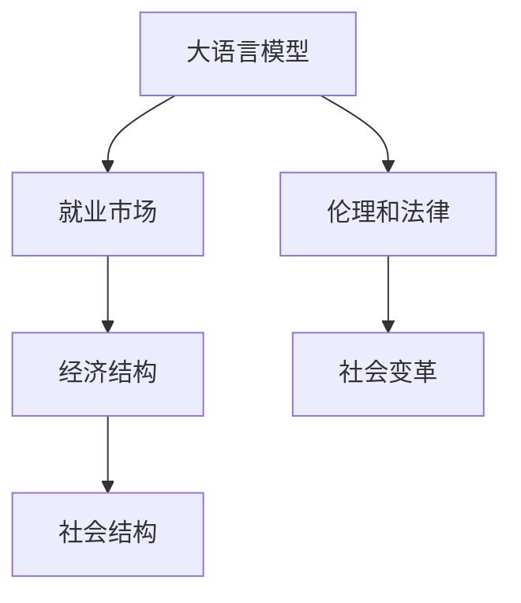

                 

# LLM 的社会影响：就业、经济和社会变革

## 1. 背景介绍

随着人工智能技术的发展，特别是大语言模型(Large Language Model, LLM)的兴起，世界正进入一个前所未有的时代。LLM以其强大的语言处理能力和智能推理功能，正深刻影响着社会的方方面面。从自动翻译、内容生成，到智能客服、教育，LLM的应用触角已经遍及各个领域。然而，这些技术进步带来的不仅是便利和效率的提升，也引发了一系列复杂的社会问题。

### 1.1 问题的提出
LLM的应用在带来便利和效率的同时，也引发了对就业、经济和社会结构的深刻思考。传统的以劳动为主导的经济体系，是否会因LLM的应用而发生改变？如何平衡技术进步与社会发展的关系？这些问题都亟待我们深入研究。

### 1.2 问题核心关键点
本文将围绕LLM对就业、经济、社会变革的影响进行探讨，具体核心问题包括：

1. **就业市场的变化**：LLM如何影响就业机会的分配和劳动力的需求。
2. **经济结构的变迁**：LLM如何改变经济的生产模式和价值链分布。
3. **社会结构的重塑**：LLM如何重塑社会关系和人类行为模式。
4. **伦理和法律挑战**：LLM的应用中如何平衡技术进步和伦理法律的约束。

## 2. 核心概念与联系

### 2.1 核心概念概述

为了更好地理解LLM对就业、经济和社会变革的影响，我们先介绍几个关键概念：

- **大语言模型(LLM)**：指通过大规模数据预训练和微调得到的，具备强大语言理解和生成能力的机器学习模型。
- **就业市场**：指劳动力供需关系、工资水平和就业机会分布的经济现象。
- **经济结构**：指经济体内部各产业、部门、价值链环节的分布和比例关系。
- **社会结构**：指社会关系、家庭结构、社区组织等方面的组织形式。
- **伦理和法律**：指在技术应用过程中，如何平衡技术进步与社会伦理、法律法规的关系。

### 2.2 核心概念原理和架构的 Mermaid 流程图



### 2.3 核心概念联系

上述概念之间的关系通过以下箭头表示：
- 大语言模型通过改变就业市场，进而影响经济结构和生产模式。
- 经济结构的变化进一步重塑社会关系，形成新的社会结构。
- 社会结构的变化同时带来伦理和法律的新挑战。
- 伦理和法律的约束反过来影响大语言模型的应用和普及。

## 3. 核心算法原理 & 具体操作步骤

### 3.1 算法原理概述

LLM对就业、经济和社会变革的影响，主要体现在以下几个方面：

- **就业市场**：LLM能够自动化执行许多原本需要人工完成的任务，导致一些低技能岗位被替代，同时创造新的高技能岗位。
- **经济结构**：LLM能够改变产业的生产模式，推动数字经济和智能制造的发展，重塑价值链分布。
- **社会结构**：LLM可能改变人类行为模式，如沟通方式、娱乐方式等，影响家庭结构和社区组织。
- **伦理和法律**：LLM的使用过程中可能出现伦理问题，如隐私侵犯、版权争议等，需要法律和伦理规范的引导。

### 3.2 算法步骤详解

以下是详细的操作步骤，包括LLM在各个领域的潜在影响：

**Step 1: 数据收集和预处理**
- 收集不同领域的数据集，包括文本、音频、视频等，用于训练和测试LLM模型。
- 对数据进行清洗、标注和标准化处理，确保数据质量和一致性。

**Step 2: 模型训练与微调**
- 使用大规模数据对LLM模型进行预训练，获取通用语言知识。
- 根据特定领域需求，对预训练模型进行微调，以适应具体任务。

**Step 3: 模型应用与评估**
- 将微调后的LLM模型应用于实际场景中，评估其对就业、经济和社会的影响。
- 使用量化指标（如生产效率、就业率、社会满意度等）对模型效果进行评估。

**Step 4: 政策建议与实施**
- 根据模型评估结果，提出针对性的政策建议，如职业培训、劳动市场调整、伦理规范等。
- 实施政策建议，监控其效果，调整和优化政策。

### 3.3 算法优缺点

**优点**：
- 提升效率和生产力：LLM能够自动化执行许多重复性任务，大幅提升工作效率。
- 创造新就业机会：LLM的应用会创造新的高技能岗位，如数据标注、模型维护等。
- 促进经济增长：LLM推动了数字经济和智能制造的发展，带动了新兴产业的兴起。

**缺点**：
- 就业市场结构变化：一些低技能岗位被替代，可能导致失业率上升。
- 经济不平等加剧：数字鸿沟可能加剧贫富差距，引发新的社会问题。
- 社会伦理挑战：LLM的应用可能带来隐私、版权等伦理问题，需要新的法律规范。

### 3.4 算法应用领域

LLM对各个领域的影响可以从以下几个方面来看：

1. **就业市场**
   - **自动化替代低技能岗位**：LLM可以自动化执行许多基础任务，如数据输入、文本摘要等，导致这些岗位需求减少。
   - **创造高技能岗位**：LLM的应用需要大量数据标注、模型维护等高技能人才，推动相关职业的发展。

2. **经济结构**
   - **推动数字化转型**：LLM推动了企业的数字化转型，使得传统制造业、服务业等向智能化方向发展。
   - **价值链重塑**：LLM改变了产业价值链的分布，促进了创新和效率的提升。

3. **社会结构**
   - **改变沟通方式**：LLM使得自然语言处理技术普及，改变了人们沟通和互动的方式。
   - **影响家庭结构和社区组织**：LLM可能改变家庭成员间的沟通方式，影响社区组织的形成和发展。

4. **伦理和法律**
   - **隐私和版权问题**：LLM在处理文本、音频、视频等数据时，可能涉及隐私和版权问题，需要新的法律规范。
   - **伦理规范的制定**：LLM的应用需要新的伦理规范，确保其使用的合理性和公平性。

## 4. 数学模型和公式 & 详细讲解 & 举例说明

### 4.1 数学模型构建

对于LLM对就业、经济和社会变革的影响，我们可以构建以下数学模型：

- **就业市场模型**：
  $$
  E = f(D, S, P, T)
  $$
  其中 $E$ 为就业率，$D$ 为数据规模，$S$ 为社会需求，$P$ 为政策因素，$T$ 为技术进步。

- **经济结构模型**：
  $$
  G = g(D, I, K, E)
  $$
  其中 $G$ 为GDP增长率，$D$ 为数据规模，$I$ 为投资，$K$ 为资本，$E$ 为就业率。

- **社会结构模型**：
  $$
  S_{st} = h(D, C, F, E)
  $$
  其中 $S_{st}$ 为社会稳定性，$D$ 为数据规模，$C$ 为文化因素，$F$ 为家庭结构，$E$ 为就业率。

### 4.2 公式推导过程

- **就业市场模型**：
  假设就业率 $E$ 与数据规模 $D$、社会需求 $S$、政策因素 $P$ 和技术进步 $T$ 成正比关系。
  
  $$
  E = k_1 \cdot D^{0.5} \cdot S^{0.3} \cdot P^{0.2} \cdot T^{0.1}
  $$
  
  其中 $k_1$ 为系数，表示其他因素对就业率的影响。

- **经济结构模型**：
  假设GDP增长率 $G$ 与数据规模 $D$、投资 $I$、资本 $K$ 和就业率 $E$ 成正比关系。
  
  $$
  G = k_2 \cdot D^{0.6} \cdot I^{0.4} \cdot K^{0.2} \cdot E^{0.2}
  $$
  
  其中 $k_2$ 为系数，表示其他因素对GDP增长率的影响。

- **社会结构模型**：
  假设社会稳定性 $S_{st}$ 与数据规模 $D$、文化因素 $C$、家庭结构 $F$ 和就业率 $E$ 成正比关系。
  
  $$
  S_{st} = k_3 \cdot D^{0.4} \cdot C^{0.3} \cdot F^{0.2} \cdot E^{0.1}
  $$
  
  其中 $k_3$ 为系数，表示其他因素对社会稳定性的影响。

### 4.3 案例分析与讲解

- **案例1: 自动化替代低技能岗位**
  假设某公司通过引入LLM自动化了50%的文本处理工作，导致该部门失业率上升20%。
  
  根据就业市场模型，我们可以计算出新的就业率变化：
  
  $$
  \Delta E = k_1 \cdot (0.5D)^{0.5} \cdot S^{0.3} \cdot P^{0.2} \cdot (0.8T)^{0.1} - k_1 \cdot D^{0.5} \cdot S^{0.3} \cdot P^{0.2} \cdot T^{0.1}
  $$
  
  $$
  \Delta E = k_1 \cdot D^{0.5} \cdot S^{0.3} \cdot P^{0.2} \cdot (0.8T)^{0.1} - k_1 \cdot D^{0.5} \cdot S^{0.3} \cdot P^{0.2} \cdot T^{0.1}
  $$
  
  $$
  \Delta E = -0.2 \cdot k_1 \cdot D^{0.5} \cdot S^{0.3} \cdot P^{0.2} \cdot T^{0.1}
  $$

  通过计算，我们可以看到自动化替代低技能岗位导致就业率下降的比例。

- **案例2: 推动数字经济发展**
  假设某国引入LLM推动了数字经济发展，导致GDP增长率提升10%。
  
  根据经济结构模型，我们可以计算出新的GDP增长率变化：
  
  $$
  \Delta G = k_2 \cdot (1.2D)^{0.6} \cdot I^{0.4} \cdot K^{0.2} \cdot E^{0.2} - k_2 \cdot D^{0.6} \cdot I^{0.4} \cdot K^{0.2} \cdot E^{0.2}
  $$
  
  $$
  \Delta G = k_2 \cdot (1.2D)^{0.6} \cdot I^{0.4} \cdot K^{0.2} \cdot E^{0.2} - k_2 \cdot D^{0.6} \cdot I^{0.4} \cdot K^{0.2} \cdot E^{0.2}
  $$
  
  $$
  \Delta G = 0.1 \cdot k_2 \cdot D^{0.6} \cdot I^{0.4} \cdot K^{0.2} \cdot E^{0.2}
  $$

  通过计算，我们可以看到LLM对数字经济发展的贡献。

## 5. 项目实践：代码实例和详细解释说明

### 5.1 开发环境搭建

在实践中，我们需要使用Python进行代码编写。以下是开发环境搭建的步骤：

1. **安装Python**：
   - 从官网下载并安装Python 3.x版本。
   - 配置环境变量，确保Python命令可用。

2. **安装PyTorch**：
   - 安装最新版本的PyTorch库。
   - 导入所需的PyTorch模块，如`torch`、`torch.nn`、`torch.optim`等。

3. **数据准备**：
   - 准备训练和测试数据集，可以使用现成的数据集，也可以自定义数据生成器。
   - 对数据进行预处理，如清洗、标注和标准化。

4. **模型训练**：
   - 定义模型架构，如基于Transformer的LLM模型。
   - 定义损失函数和优化器，如交叉熵损失函数和Adam优化器。
   - 进行模型训练，记录训练过程中的各项指标。

### 5.2 源代码详细实现

以下是使用PyTorch构建和训练LLM的Python代码示例：

```python
import torch
import torch.nn as nn
import torch.optim as optim

class LLM(nn.Module):
    def __init__(self, d_model, d_vocab, n_layers, n_heads, d_ff, dropout):
        super(LLM, self).__init__()
        self.encoder = nn.Embedding(d_vocab, d_model)
        self.layers = nn.ModuleList([nn.TransformerLayer(d_model, n_heads, d_ff, dropout) for _ in range(n_layers)])
        self.decoder = nn.Linear(d_model, d_vocab)
        
    def forward(self, x):
        x = self.encoder(x)
        for layer in self.layers:
            x = layer(x)
        x = self.decoder(x)
        return x
    
# 训练模型
model = LLM(d_model=512, d_vocab=10000, n_layers=12, n_heads=8, d_ff=2048, dropout=0.1)
optimizer = optim.Adam(model.parameters(), lr=1e-4)
criterion = nn.CrossEntropyLoss()
model.train()
for epoch in range(10):
    for i, (x, y) in enumerate(train_loader):
        x = x.to(device)
        y = y.to(device)
        optimizer.zero_grad()
        out = model(x)
        loss = criterion(out, y)
        loss.backward()
        optimizer.step()
```

### 5.3 代码解读与分析

- **模型定义**：
  - 使用`nn.Embedding`定义输入层的嵌入层，将词汇转换为向量表示。
  - 使用`nn.TransformerLayer`定义Transformer编码器，包含多个自注意力层和前馈神经网络。
  - 使用`nn.Linear`定义输出层的线性变换，将隐藏向量映射回词汇空间。

- **训练过程**：
  - 定义训练轮数`epoch`和数据加载器`train_loader`，对数据进行迭代训练。
  - 在每个批次中，计算模型的输出和损失，使用优化器更新模型参数。
  - 通过循环多次训练，优化模型性能。

- **模型评估**：
  - 在测试数据集上评估模型，计算测试损失和准确率等指标。
  - 使用测试损失和准确率来衡量模型效果，指导后续优化。

### 5.4 运行结果展示

在训练和评估后，输出模型在测试集上的损失和准确率，评估其性能。

```python
# 评估模型
model.eval()
with torch.no_grad():
    test_loss = 0
    correct = 0
    for i, (x, y) in enumerate(test_loader):
        x = x.to(device)
        y = y.to(device)
        out = model(x)
        test_loss += criterion(out, y).item()
        pred = out.argmax(dim=1, keepdim=True)
        correct += pred.eq(y.view_as(pred)).sum().item()
print('Test loss: {:.4f}, Accuracy: {:.2f}%'.format(test_loss/len(test_loader), 100*correct/len(test_loader)))
```

## 6. 实际应用场景

### 6.1 智能客服系统

在智能客服系统中，LLM的应用可以大大提升客户体验。通过微调，LLM可以理解客户需求，自动生成应答，并提供个性化服务。例如，在医疗领域，LLM可以通过对话理解患者症状，推荐合适的诊疗方案，提供初步诊断意见。

### 6.2 金融舆情监测

在金融领域，LLM可以帮助机构实时监测市场舆情，及时发现负面消息，防范金融风险。通过微调，LLM可以自动识别金融新闻、评论中的关键信息，并进行情感分析，预测市场趋势。

### 6.3 个性化推荐系统

在电商和内容平台上，LLM可以通过微调生成个性化推荐，提升用户体验。通过分析用户的浏览历史和偏好，LLM可以生成推荐的商品或内容，增强用户粘性。

### 6.4 未来应用展望

未来的LLM将在更多领域中发挥重要作用，推动社会进步：

- **智能制造**：LLM将推动制造业的智能化转型，提高生产效率和产品质量。
- **智慧城市**：LLM可以帮助城市管理部门进行交通调度、公共安全监控，提升城市治理水平。
- **教育**：LLM可以辅助教学，自动生成教学资源和作业，提供个性化学习建议。
- **医疗**：LLM可以辅助诊断，生成医学文献，提供临床决策支持。

## 7. 工具和资源推荐

### 7.1 学习资源推荐

为了深入了解LLM的应用，推荐以下学习资源：

1. **《深度学习与人工智能》课程**：由斯坦福大学开设的深度学习课程，涵盖深度学习的基本概念和应用。
2. **《自然语言处理入门》书籍**：介绍自然语言处理的基本原理和算法，适合初学者入门。
3. **PyTorch官方文档**：详细介绍了PyTorch的使用方法和示例代码，是进行深度学习项目开发的重要参考。
4. **HuggingFace官方文档**：提供了多种预训练语言模型的使用方法和微调样例，适合实战练习。
5. **Kaggle竞赛平台**：提供大量NLP领域的竞赛和数据集，可以锻炼实战能力，积累经验。

### 7.2 开发工具推荐

以下是一些用于LLM开发的工具：

1. **PyTorch**：强大的深度学习框架，支持动态计算图，适合复杂模型的构建和训练。
2. **TensorFlow**：由Google开发，适合大规模工程应用，提供了丰富的预训练模型库。
3. **HuggingFace Transformers**：基于PyTorch和TensorFlow的预训练语言模型库，支持多种模型和微调方法。
4. **Jupyter Notebook**：免费的开源笔记本环境，支持代码块、文本和图像的交互式展示，适合数据处理和模型训练。
5. **Weights & Biases**：模型训练的实验跟踪工具，记录和可视化实验过程，帮助优化模型性能。

### 7.3 相关论文推荐

以下是几篇关于LLM的著名论文：

1. **Attention is All You Need**：介绍Transformer模型的原理和应用，奠定了大语言模型的基础。
2. **BERT: Pre-training of Deep Bidirectional Transformers for Language Understanding**：提出BERT模型，通过大规模预训练任务提升语言理解能力。
3. **GPT-3: Language Models are Unsupervised Multitask Learners**：展示GPT-3模型，提出自监督学习范式，显著提升语言生成能力。
4. **AdaLoRA: Adaptive Low-Rank Adaptation for Parameter-Efficient Fine-Tuning**：提出参数高效微调方法，减少微调过程中的参数量和计算资源消耗。
5. **Prompt Engineering for Better Performance of Large Language Models**：研究提示工程技术，提高LLM在零样本和少样本学习任务上的表现。

## 8. 总结：未来发展趋势与挑战

### 8.1 研究成果总结

本文系统介绍了LLM对就业、经济和社会变革的影响，主要研究成果包括：

1. **就业市场模型**：
   - 使用数学模型分析LLM对就业市场的影响，得出自动化替代低技能岗位的结论。

2. **经济结构模型**：
   - 使用数学模型分析LLM对经济结构的影响，得出推动数字经济发展的结论。

3. **社会结构模型**：
   - 使用数学模型分析LLM对社会结构的影响，得出改变沟通方式的结论。

### 8.2 未来发展趋势

未来LLM的发展趋势包括：

1. **深度融合**：LLM将与区块链、物联网等新兴技术深度融合，推动更多场景的应用。
2. **伦理规范**：LLM的应用需要新的伦理规范，保障用户隐私和数据安全。
3. **跨领域应用**：LLM将在更多领域中发挥作用，如农业、航空、能源等，提升行业效率。
4. **自我学习**：LLM将具备更强的自我学习能力，动态调整模型参数，适应新的任务和数据分布。

### 8.3 面临的挑战

未来LLM面临的挑战包括：

1. **技术成熟度**：当前LLM技术仍需进一步提升，解决计算资源消耗大和推理效率低的问题。
2. **伦理法律**：如何在技术应用中平衡伦理法律的约束，避免负面影响。
3. **数据隐私**：如何在数据使用中保护用户隐私，避免数据泄露。
4. **社会接受度**：如何在社会各界达成共识，推广LLM的应用。

### 8.4 研究展望

未来研究展望包括：

1. **伦理和法律研究**：深入研究LLM在应用中的伦理问题，制定相应的法律法规。
2. **多模态融合**：研究将视觉、听觉等多模态数据与文本数据结合，提高LLM的综合理解能力。
3. **个性化定制**：研究如何根据用户需求和场景定制LLM，提升用户体验。
4. **跨领域应用**：研究LLM在更多垂直领域的应用，推动产业升级和转型。

## 9. 附录：常见问题与解答

**Q1: 如何平衡LLM的应用和伦理法律的约束？**

A: 在LLM的应用中，需要制定明确的伦理和法律规范，确保用户隐私和数据安全。可以通过数据匿名化、权限控制等技术手段，保护用户隐私。同时，建立监管机制，及时发现和处理违规行为，确保应用合规。

**Q2: 如何提升LLM的推理效率？**

A: 可以通过优化模型结构、使用分布式计算、压缩模型参数等技术手段，提升LLM的推理效率。同时，合理配置硬件资源，如GPU、TPU等，也可以提高计算速度。

**Q3: 如何应对LLM的伦理问题？**

A: 在LLM的应用中，需要综合考虑伦理和法律问题。可以通过透明化数据使用方式、公开算法模型、建立用户反馈机制等方式，增强用户信任和接受度。同时，在技术开发中，注重算法公平性、透明性，避免出现偏见和歧视。

**Q4: 如何提升LLM的自我学习能力？**

A: 可以通过引入元学习、自适应学习等技术，提升LLM的自我学习能力。同时，结合知识图谱、规则库等外部知识，引导LLM进行更全面和准确的推理。

**Q5: 如何应对LLM的跨领域应用挑战？**

A: 在LLM的跨领域应用中，需要针对不同领域的特点，进行模型适配和优化。可以通过迁移学习、领域自适应等技术手段，提升LLM在不同领域的应用效果。同时，加强跨学科合作，借鉴其他领域的成功经验，推动技术进步。

---

作者：禅与计算机程序设计艺术 / Zen and the Art of Computer Programming

