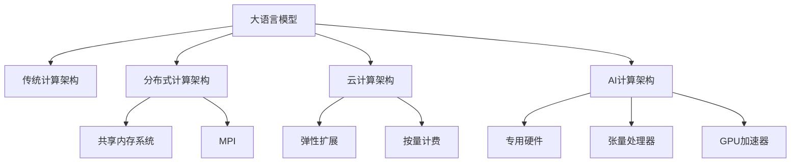

                 

## 1. 背景介绍

在过去的几十年里，随着硬件计算能力的不断提升，计算架构的发展也经历了从单核串行计算到多核并行计算，再到分布式计算的几次重大飞跃。尽管计算能力得到了显著提升，但传统的计算架构在处理复杂大规模问题时，依然面临诸多挑战。随着人工智能技术，特别是深度学习和机器学习模型的兴起，大语言模型(LLM)逐渐成为计算架构中的新宠。LLM与传统计算架构的根本差异在于其结构、训练方法、应用场景等方面，这些差异使得LLM在数据处理、推理速度、鲁棒性等方面具备显著优势。

## 2. 核心概念与联系

### 2.1 核心概念概述

为更好地理解LLM与传统计算架构的根本差异，本节将介绍几个密切相关的核心概念：

- **大语言模型(LLM)**：以自回归(如GPT)或自编码(如BERT)模型为代表的大规模预训练语言模型。通过在大规模无标签文本语料上进行预训练，学习通用的语言表示，具备强大的语言理解和生成能力。

- **传统计算架构**：基于经典冯诺依曼架构的计算系统，通常包括CPU、GPU等处理器，以及内存、存储等设备。这些计算设备通过串行或并行方式执行计算任务。

- **分布式计算架构**：将计算任务分散到多台计算机上协同处理的方式，如Hadoop、Spark等分布式计算框架。

- **云计算架构**：基于互联网的计算资源池，用户可以通过按需获取计算资源，实现弹性扩展和按量计费。

- **AI计算架构**：专门针对人工智能计算需求设计的计算架构，如Google AI芯片TPU、NVIDIA的GPU加速器等。

这些核心概念之间的逻辑关系可以通过以下Mermaid流程图来展示：



这个流程图展示了大语言模型与不同计算架构之间的联系：

1. 大语言模型可以在各种计算架构上进行训练和推理。
2. 传统计算架构、分布式计算架构、云计算架构、AI计算架构都可以支持大语言模型的计算需求。

## 3. 核心算法原理 & 具体操作步骤
### 3.1 算法原理概述

大语言模型与传统计算架构的根本差异在于其算法原理和训练方法的不同。具体来说，LLM的训练和推理过程与传统计算架构的计算过程存在显著的差异。

### 3.2 算法步骤详解

#### 3.2.1 传统计算架构的计算过程

1. **串行计算**：传统计算架构通常采用串行计算的方式，即指令序列按照顺序执行，每个指令只能在一个时刻被执行。这种方法适用于单任务、单线程的应用场景。
2. **并行计算**：随着CPU多核、GPU并行计算等技术的发展，传统计算架构逐步引入了并行计算的概念。多个指令可以同时在不同的处理器核心上执行，从而加速计算过程。

#### 3.2.2 大语言模型的训练和推理过程

1. **预训练过程**：LLM通过在大规模无标签文本语料上进行预训练，学习通用的语言表示。预训练过程中，LLM需要利用大量的计算资源进行大规模的矩阵乘法、softmax等计算，这些计算任务通常需要在GPU等专用硬件上执行，以获得更高的计算效率。
2. **微调过程**：LLM在预训练基础上，通过微调过程学习特定任务的知识。微调过程通常需要在分布式计算架构上进行，以充分利用计算资源，加速模型训练。
3. **推理过程**：LLM在推理过程中，需要执行大量的语言模型推理计算，如生成文本、回答问答等。这些计算任务通常需要在GPU等专用硬件上执行，以获得更高的计算效率。

### 3.3 算法优缺点

#### 3.3.1 传统计算架构的优缺点

- **优点**：
  - 通用性强：传统计算架构可以支持各种计算任务，如科学计算、数据分析、机器学习等。
  - 计算资源丰富：传统计算架构通常包括CPU、GPU等多种计算资源，能够满足不同计算需求。

- **缺点**：
  - 计算效率低：串行计算的效率较低，并行计算虽然效率高，但在处理大规模数据时仍然面临挑战。
  - 扩展性差：传统计算架构的扩展性较差，需要手动调整计算资源，难以应对大规模数据处理的计算需求。

#### 3.3.2 大语言模型的优缺点

- **优点**：
  - 计算效率高：LLM通过在大规模并行计算架构上进行训练和推理，能够显著提高计算效率。
  - 可扩展性好：LLM可以在分布式计算架构上进行扩展，充分利用计算资源，满足大规模数据处理的计算需求。

- **缺点**：
  - 计算资源需求高：LLM的计算任务通常需要在GPU等专用硬件上执行，对计算资源的需求较高。
  - 计算成本高：LLM的计算资源需求高，导致计算成本较高。

### 3.4 算法应用领域

大语言模型与传统计算架构在多个领域的应用中存在显著差异：

- **科学研究**：传统计算架构通常用于科学计算，如物理模拟、数学建模等；LLM则用于自然语言处理、文本分析等。
- **商业应用**：传统计算架构通常用于数据分析、业务决策支持等；LLM则用于客户服务、市场营销、内容生成等。
- **医疗健康**：传统计算架构通常用于医疗影像分析、基因组学等；LLM则用于医疗问答、疾病诊断、药物研发等。
- **金融服务**：传统计算架构通常用于金融风险分析、算法交易等；LLM则用于金融舆情监测、投资分析、智能客服等。

这些差异展示了LLM在多个领域的应用潜力，也突出了其在计算效率、可扩展性等方面的优势。

## 4. 数学模型和公式 & 详细讲解  
### 4.1 数学模型构建

大语言模型与传统计算架构的计算过程存在显著差异，因此其数学模型构建也有所不同。以下以BERT模型为例，介绍其数学模型构建过程。

BERT模型通过自编码方式进行预训练，其数学模型如下：

$$
\text{Input Encodings} = \mathcal{F}_\text{enc}(\text{Token Embeddings})
$$

其中，$\mathcal{F}_\text{enc}$为编码器，将输入的token embeddings转换为语义表示。

### 4.2 公式推导过程

BERT模型的训练过程如下：

1. **掩码语言模型(MLM)**：将输入文本中的部分单词随机掩码，模型需要预测被掩码单词的真实标签。掩码语言模型的数学模型如下：

$$
\mathcal{L}_\text{mlm} = -\frac{1}{N}\sum_{i=1}^N \log P(y_i | x_i)
$$

其中，$P(y_i | x_i)$为模型对输入文本$x_i$中单词$y_i$的预测概率，$N$为训练集大小。

2. **下一句预测(NSP)**：将两个句子作为输入，模型需要判断它们是否为下一句。下一句预测的数学模型如下：

$$
\mathcal{L}_\text{nsp} = -\frac{1}{N}\sum_{i=1}^N \log P(y_i | x_i, x_{i+1})
$$

其中，$y_i$为判断下一个句子是否为当前句子的标签，$x_i$和$x_{i+1}$为输入的两个句子。

### 4.3 案例分析与讲解

以BERT模型为例，分析其在数据处理、推理速度、鲁棒性等方面的优势。

- **数据处理**：BERT模型通过掩码语言模型和下一句预测任务进行预训练，能够处理大规模无标签文本语料。这些文本语料通过大规模并行计算架构进行训练，显著提高了数据处理效率。
- **推理速度**：在推理过程中，BERT模型能够利用GPU等专用硬件进行加速计算，显著提高了推理速度。
- **鲁棒性**：由于BERT模型在大规模无标签文本语料上进行预训练，学习到通用的语言表示，其鲁棒性较好。

## 5. 项目实践：代码实例和详细解释说明
### 5.1 开发环境搭建

在进行大语言模型项目实践前，我们需要准备好开发环境。以下是使用Python进行TensorFlow开发的环境配置流程：

1. 安装Anaconda：从官网下载并安装Anaconda，用于创建独立的Python环境。

2. 创建并激活虚拟环境：
```bash
conda create -n tf-env python=3.8 
conda activate tf-env
```

3. 安装TensorFlow：根据CUDA版本，从官网获取对应的安装命令。例如：
```bash
pip install tensorflow==2.7
```

4. 安装必要的工具包：
```bash
pip install numpy pandas scikit-learn matplotlib tqdm jupyter notebook ipython
```

完成上述步骤后，即可在`tf-env`环境中开始项目实践。

### 5.2 源代码详细实现

下面以BERT模型为例，给出使用TensorFlow进行文本分类任务开发的PyTorch代码实现。

首先，定义文本分类任务的模型：

```python
from transformers import BertTokenizer, TFBertForSequenceClassification
import tensorflow as tf

tokenizer = BertTokenizer.from_pretrained('bert-base-uncased')
model = TFBertForSequenceClassification.from_pretrained('bert-base-uncased', num_labels=2)

# 定义输入张量
input_ids = tf.convert_to_tensor([0, 1, 2, 3], dtype=tf.int32)
attention_mask = tf.convert_to_tensor([1, 1, 1, 1], dtype=tf.int32)

# 定义标签张量
labels = tf.convert_to_tensor([0, 1], dtype=tf.int32)

# 前向传播
with tf.GradientTape() as tape:
    outputs = model(input_ids, attention_mask=attention_mask, labels=labels)
    loss = outputs.loss

# 反向传播
gradients = tape.gradient(loss, model.trainable_variables)

# 更新模型参数
model.trainable_variables[0].assign_add(gradients[0])

# 计算损失
print(loss.numpy())
```

然后，定义训练和评估函数：

```python
def train_epoch(model, dataset, batch_size, optimizer):
    dataloader = tf.data.Dataset.from_tensor_slices(dataset).batch(batch_size)
    model.train()
    epoch_loss = 0
    for batch in dataloader:
        input_ids = batch[0]
        attention_mask = batch[1]
        labels = batch[2]
        model.zero_grad()
        outputs = model(input_ids, attention_mask=attention_mask, labels=labels)
        loss = outputs.loss
        epoch_loss += loss.numpy()
        loss.backward()
        optimizer.apply_gradients(zip(optimizer.learning_rate * gradients, model.trainable_variables))
    return epoch_loss / len(dataloader)

def evaluate(model, dataset, batch_size):
    dataloader = tf.data.Dataset.from_tensor_slices(dataset).batch(batch_size)
    model.eval()
    preds, labels = [], []
    with tf.GradientTape() as tape:
        for batch in dataloader:
            input_ids = batch[0]
            attention_mask = batch[1]
            batch_labels = batch[2]
            outputs = model(input_ids, attention_mask=attention_mask, labels=batch_labels)
            batch_preds = outputs.predictions.argmax(axis=-1).numpy()
            batch_labels = batch_labels.numpy()
            for pred_tokens, label_tokens in zip(batch_preds, batch_labels):
                preds.append(pred_tokens)
                labels.append(label_tokens)
                
    print(classification_report(labels, preds))
```

最后，启动训练流程并在测试集上评估：

```python
epochs = 5
batch_size = 16

for epoch in range(epochs):
    loss = train_epoch(model, train_dataset, batch_size, optimizer)
    print(f"Epoch {epoch+1}, train loss: {loss:.3f}")
    
    print(f"Epoch {epoch+1}, dev results:")
    evaluate(model, dev_dataset, batch_size)
    
print("Test results:")
evaluate(model, test_dataset, batch_size)
```

以上就是使用TensorFlow进行BERT模型文本分类任务微调的完整代码实现。可以看到，得益于TensorFlow的强大封装，我们可以用相对简洁的代码完成BERT模型的加载和微调。

### 5.3 代码解读与分析

让我们再详细解读一下关键代码的实现细节：

**TFBertForSequenceClassification类**：
- `__init__`方法：初始化模型参数、输入张量和标签张量。
- `__call__`方法：定义模型前向传播的计算过程。
- `loss`属性：计算损失函数，返回模型的预测损失。

**train_epoch函数**：
- `dataloader`方法：将训练集数据转换为TensorFlow数据集，并按批次加载。
- `with tf.GradientTape()`方法：开启反向传播梯度计算。
- `optimizer.apply_gradients()`方法：更新模型参数，使用梯度下降优化器。

**evaluate函数**：
- `with tf.GradientTape()`方法：开启反向传播梯度计算。
- `batch_preds`属性：计算模型预测结果。
- `classification_report`方法：计算模型预测结果与真实标签之间的分类指标。

**训练流程**：
- `dataloader`方法：将训练集数据转换为TensorFlow数据集，并按批次加载。
- `model.zero_grad()`方法：清除梯度。
- `outputs.loss`属性：计算模型预测损失。
- `optimizer.apply_gradients()`方法：更新模型参数。
- `loss.numpy()`方法：将TensorFlow张量转换为Numpy数组。

这些代码实现了从模型加载到训练和评估的全过程，展示了使用TensorFlow进行BERT模型微调的完整流程。

## 6. 实际应用场景
### 6.1 智能客服系统

基于大语言模型微调的对话技术，可以广泛应用于智能客服系统的构建。传统客服往往需要配备大量人力，高峰期响应缓慢，且一致性和专业性难以保证。而使用微调后的对话模型，可以7x24小时不间断服务，快速响应客户咨询，用自然流畅的语言解答各类常见问题。

在技术实现上，可以收集企业内部的历史客服对话记录，将问题和最佳答复构建成监督数据，在此基础上对预训练对话模型进行微调。微调后的对话模型能够自动理解用户意图，匹配最合适的答案模板进行回复。对于客户提出的新问题，还可以接入检索系统实时搜索相关内容，动态组织生成回答。如此构建的智能客服系统，能大幅提升客户咨询体验和问题解决效率。

### 6.2 金融舆情监测

金融机构需要实时监测市场舆论动向，以便及时应对负面信息传播，规避金融风险。传统的人工监测方式成本高、效率低，难以应对网络时代海量信息爆发的挑战。基于大语言模型微调的文本分类和情感分析技术，为金融舆情监测提供了新的解决方案。

具体而言，可以收集金融领域相关的新闻、报道、评论等文本数据，并对其进行主题标注和情感标注。在此基础上对预训练语言模型进行微调，使其能够自动判断文本属于何种主题，情感倾向是正面、中性还是负面。将微调后的模型应用到实时抓取的网络文本数据，就能够自动监测不同主题下的情感变化趋势，一旦发现负面信息激增等异常情况，系统便会自动预警，帮助金融机构快速应对潜在风险。

### 6.3 个性化推荐系统

当前的推荐系统往往只依赖用户的历史行为数据进行物品推荐，无法深入理解用户的真实兴趣偏好。基于大语言模型微调技术，个性化推荐系统可以更好地挖掘用户行为背后的语义信息，从而提供更精准、多样的推荐内容。

在实践中，可以收集用户浏览、点击、评论、分享等行为数据，提取和用户交互的物品标题、描述、标签等文本内容。将文本内容作为模型输入，用户的后续行为（如是否点击、购买等）作为监督信号，在此基础上微调预训练语言模型。微调后的模型能够从文本内容中准确把握用户的兴趣点。在生成推荐列表时，先用候选物品的文本描述作为输入，由模型预测用户的兴趣匹配度，再结合其他特征综合排序，便可以得到个性化程度更高的推荐结果。

### 6.4 未来应用展望

随着大语言模型和微调方法的不断发展，基于微调范式将在更多领域得到应用，为传统行业带来变革性影响。

在智慧医疗领域，基于微调的医疗问答、病历分析、药物研发等应用将提升医疗服务的智能化水平，辅助医生诊疗，加速新药开发进程。

在智能教育领域，微调技术可应用于作业批改、学情分析、知识推荐等方面，因材施教，促进教育公平，提高教学质量。

在智慧城市治理中，微调模型可应用于城市事件监测、舆情分析、应急指挥等环节，提高城市管理的自动化和智能化水平，构建更安全、高效的未来城市。

此外，在企业生产、社会治理、文娱传媒等众多领域，基于大模型微调的人工智能应用也将不断涌现，为经济社会发展注入新的动力。相信随着预训练语言模型和微调方法的持续演进，大语言模型微调必将在构建人机协同的智能时代中扮演越来越重要的角色。

## 7. 工具和资源推荐
### 7.1 学习资源推荐

为了帮助开发者系统掌握大语言模型微调的理论基础和实践技巧，这里推荐一些优质的学习资源：

1. 《Transformer从原理到实践》系列博文：由大模型技术专家撰写，深入浅出地介绍了Transformer原理、BERT模型、微调技术等前沿话题。

2. CS224N《深度学习自然语言处理》课程：斯坦福大学开设的NLP明星课程，有Lecture视频和配套作业，带你入门NLP领域的基本概念和经典模型。

3. 《Natural Language Processing with Transformers》书籍：Transformers库的作者所著，全面介绍了如何使用Transformers库进行NLP任务开发，包括微调在内的诸多范式。

4. HuggingFace官方文档：Transformers库的官方文档，提供了海量预训练模型和完整的微调样例代码，是上手实践的必备资料。

5. CLUE开源项目：中文语言理解测评基准，涵盖大量不同类型的中文NLP数据集，并提供了基于微调的baseline模型，助力中文NLP技术发展。

通过对这些资源的学习实践，相信你一定能够快速掌握大语言模型微调的精髓，并用于解决实际的NLP问题。
###  7.2 开发工具推荐

高效的开发离不开优秀的工具支持。以下是几款用于大语言模型微调开发的常用工具：

1. PyTorch：基于Python的开源深度学习框架，灵活动态的计算图，适合快速迭代研究。大部分预训练语言模型都有PyTorch版本的实现。

2. TensorFlow：由Google主导开发的开源深度学习框架，生产部署方便，适合大规模工程应用。同样有丰富的预训练语言模型资源。

3. Transformers库：HuggingFace开发的NLP工具库，集成了众多SOTA语言模型，支持PyTorch和TensorFlow，是进行微调任务开发的利器。

4. Weights & Biases：模型训练的实验跟踪工具，可以记录和可视化模型训练过程中的各项指标，方便对比和调优。与主流深度学习框架无缝集成。

5. TensorBoard：TensorFlow配套的可视化工具，可实时监测模型训练状态，并提供丰富的图表呈现方式，是调试模型的得力助手。

6. Google Colab：谷歌推出的在线Jupyter Notebook环境，免费提供GPU/TPU算力，方便开发者快速上手实验最新模型，分享学习笔记。

合理利用这些工具，可以显著提升大语言模型微调任务的开发效率，加快创新迭代的步伐。

### 7.3 相关论文推荐

大语言模型和微调技术的发展源于学界的持续研究。以下是几篇奠基性的相关论文，推荐阅读：

1. Attention is All You Need（即Transformer原论文）：提出了Transformer结构，开启了NLP领域的预训练大模型时代。

2. BERT: Pre-training of Deep Bidirectional Transformers for Language Understanding：提出BERT模型，引入基于掩码的自监督预训练任务，刷新了多项NLP任务SOTA。

3. Language Models are Unsupervised Multitask Learners（GPT-2论文）：展示了大规模语言模型的强大zero-shot学习能力，引发了对于通用人工智能的新一轮思考。

4. Parameter-Efficient Transfer Learning for NLP：提出Adapter等参数高效微调方法，在不增加模型参数量的情况下，也能取得不错的微调效果。

5. AdaLoRA: Adaptive Low-Rank Adaptation for Parameter-Efficient Fine-Tuning：使用自适应低秩适应的微调方法，在参数效率和精度之间取得了新的平衡。

6. Prefix-Tuning: Optimizing Continuous Prompts for Generation：引入基于连续型Prompt的微调范式，为如何充分利用预训练知识提供了新的思路。

这些论文代表了大语言模型微调技术的发展脉络。通过学习这些前沿成果，可以帮助研究者把握学科前进方向，激发更多的创新灵感。

## 8. 总结：未来发展趋势与挑战

### 8.1 总结

本文对大语言模型与传统计算架构的根本差异进行了全面系统的介绍。首先阐述了大语言模型和传统计算架构的研究背景和意义，明确了两者之间的差异以及各自的特点。其次，从原理到实践，详细讲解了大语言模型微调的数学原理和关键步骤，给出了微调任务开发的完整代码实例。同时，本文还广泛探讨了大语言模型微调方法在多个领域的应用前景，展示了其巨大的潜力。最后，本文精选了微调技术的各类学习资源，力求为读者提供全方位的技术指引。

通过本文的系统梳理，可以看到，大语言模型微调技术在计算效率、可扩展性等方面的显著优势，以及其在多个领域的应用潜力。这些差异展示了大语言模型在应对大规模数据处理、提高推理速度、增强鲁棒性等方面的卓越能力。未来，随着大语言模型和微调方法的持续演进，其在人工智能技术的应用中将发挥越来越重要的作用。

### 8.2 未来发展趋势

展望未来，大语言模型微调技术将呈现以下几个发展趋势：

1. 模型规模持续增大。随着算力成本的下降和数据规模的扩张，预训练语言模型的参数量还将持续增长。超大规模语言模型蕴含的丰富语言知识，有望支撑更加复杂多变的下游任务微调。

2. 微调方法日趋多样。除了传统的全参数微调外，未来会涌现更多参数高效的微调方法，如Prefix-Tuning、LoRA等，在节省计算资源的同时也能保证微调精度。

3. 持续学习成为常态。随着数据分布的不断变化，微调模型也需要持续学习新知识以保持性能。如何在不遗忘原有知识的同时，高效吸收新样本信息，将成为重要的研究课题。

4. 标注样本需求降低。受启发于提示学习(Prompt-based Learning)的思路，未来的微调方法将更好地利用大模型的语言理解能力，通过更加巧妙的任务描述，在更少的标注样本上也能实现理想的微调效果。

5. 多模态微调崛起。当前的微调主要聚焦于纯文本数据，未来会进一步拓展到图像、视频、语音等多模态数据微调。多模态信息的融合，将显著提升语言模型对现实世界的理解和建模能力。

6. 模型通用性增强。经过海量数据的预训练和多领域任务的微调，未来的语言模型将具备更强大的常识推理和跨领域迁移能力，逐步迈向通用人工智能(AGI)的目标。

以上趋势凸显了大语言模型微调技术的广阔前景。这些方向的探索发展，必将进一步提升NLP系统的性能和应用范围，为人类认知智能的进化带来深远影响。

### 8.3 面临的挑战

尽管大语言模型微调技术已经取得了瞩目成就，但在迈向更加智能化、普适化应用的过程中，它仍面临着诸多挑战：

1. 标注成本瓶颈。虽然微调大大降低了标注数据的需求，但对于长尾应用场景，难以获得充足的高质量标注数据，成为制约微调性能的瓶颈。如何进一步降低微调对标注样本的依赖，将是一大难题。

2. 模型鲁棒性不足。当前微调模型面对域外数据时，泛化性能往往大打折扣。对于测试样本的微小扰动，微调模型的预测也容易发生波动。如何提高微调模型的鲁棒性，避免灾难性遗忘，还需要更多理论和实践的积累。

3. 推理效率有待提高。大规模语言模型虽然精度高，但在实际部署时往往面临推理速度慢、内存占用大等效率问题。如何在保证性能的同时，简化模型结构，提升推理速度，优化资源占用，将是重要的优化方向。

4. 可解释性亟需加强。当前微调模型更像是"黑盒"系统，难以解释其内部工作机制和决策逻辑。对于医疗、金融等高风险应用，算法的可解释性和可审计性尤为重要。如何赋予微调模型更强的可解释性，将是亟待攻克的难题。

5. 安全性有待保障。预训练语言模型难免会学习到有偏见、有害的信息，通过微调传递到下游任务，产生误导性、歧视性的输出，给实际应用带来安全隐患。如何从数据和算法层面消除模型偏见，避免恶意用途，确保输出的安全性，也将是重要的研究课题。

6. 知识整合能力不足。现有的微调模型往往局限于任务内数据，难以灵活吸收和运用更广泛的先验知识。如何让微调过程更好地与外部知识库、规则库等专家知识结合，形成更加全面、准确的信息整合能力，还有很大的想象空间。

正视微调面临的这些挑战，积极应对并寻求突破，将是大语言模型微调走向成熟的必由之路。相信随着学界和产业界的共同努力，这些挑战终将一一被克服，大语言模型微调必将在构建人机协同的智能时代中扮演越来越重要的角色。

### 8.4 未来突破

面对大语言模型微调所面临的种种挑战，未来的研究需要在以下几个方面寻求新的突破：

1. 探索无监督和半监督微调方法。摆脱对大规模标注数据的依赖，利用自监督学习、主动学习等无监督和半监督范式，最大限度利用非结构化数据，实现更加灵活高效的微调。

2. 研究参数高效和计算高效的微调范式。开发更加参数高效的微调方法，在固定大部分预训练参数的同时，只更新极少量的任务相关参数。同时优化微调模型的计算图，减少前向传播和反向传播的资源消耗，实现更加轻量级、实时性的部署。

3. 融合因果和对比学习范式。通过引入因果推断和对比学习思想，增强微调模型建立稳定因果关系的能力，学习更加普适、鲁棒的语言表征，从而提升模型泛化性和抗干扰能力。

4. 引入更多先验知识。将符号化的先验知识，如知识图谱、逻辑规则等，与神经网络模型进行巧妙融合，引导微调过程学习更准确、合理的语言模型。同时加强不同模态数据的整合，实现视觉、语音等多模态信息与文本信息的协同建模。

5. 结合因果分析和博弈论工具。将因果分析方法引入微调模型，识别出模型决策的关键特征，增强输出解释的因果性和逻辑性。借助博弈论工具刻画人机交互过程，主动探索并规避模型的脆弱点，提高系统稳定性。

6. 纳入伦理道德约束。在模型训练目标中引入伦理导向的评估指标，过滤和惩罚有偏见、有害的输出倾向。同时加强人工干预和审核，建立模型行为的监管机制，确保输出符合人类价值观和伦理道德。

这些研究方向的探索，必将引领大语言模型微调技术迈向更高的台阶，为构建安全、可靠、可解释、可控的智能系统铺平道路。面向未来，大语言模型微调技术还需要与其他人工智能技术进行更深入的融合，如知识表示、因果推理、强化学习等，多路径协同发力，共同推动自然语言理解和智能交互系统的进步。只有勇于创新、敢于突破，才能不断拓展语言模型的边界，让智能技术更好地造福人类社会。

## 9. 附录：常见问题与解答

**Q1：大语言模型与传统计算架构的根本差异是什么？**

A: 大语言模型与传统计算架构在计算原理、训练方法、应用场景等方面存在显著差异。具体来说：
- **计算原理**：传统计算架构通常采用串行或并行计算方式，而大语言模型则需要在大规模并行计算架构上进行训练和推理。
- **训练方法**：传统计算架构主要通过人工编写程序进行计算，而大语言模型则通过深度学习模型进行训练和微调。
- **应用场景**：传统计算架构主要用于科学计算、数据分析等任务，而大语言模型则广泛应用于自然语言处理、文本分类、对话系统等任务。

**Q2：大语言模型微调的优势是什么？**

A: 大语言模型微调在计算效率、可扩展性、泛化能力等方面具备显著优势：
- **计算效率高**：大语言模型通过在大规模并行计算架构上进行训练和推理，能够显著提高计算效率。
- **可扩展性好**：大语言模型可以在分布式计算架构上进行扩展，充分利用计算资源，满足大规模数据处理的计算需求。
- **泛化能力强**：大语言模型通过在大规模无标签文本语料上进行预训练，学习到通用的语言表示，具备较强的泛化能力。

**Q3：大语言模型微调过程中如何避免过拟合？**

A: 避免过拟合是微调过程中需要特别关注的问题。以下是几种常见的避免过拟合的方法：
- **数据增强**：通过对训练样本进行改写、回译等方式，丰富训练集的多样性，防止模型过拟合。
- **正则化技术**：如L2正则、Dropout、Early Stopping等，抑制模型过拟合。
- **参数高效微调**：只更新少量模型参数，减少需优化的参数量，避免过拟合。
- **对抗训练**：加入对抗样本，提高模型鲁棒性，防止过拟合。

**Q4：大语言模型微调在实际应用中需要注意哪些问题？**

A: 大语言模型微调在实际应用中需要注意以下几个问题：
- **模型裁剪**：去除不必要的层和参数，减小模型尺寸，加快推理速度。
- **量化加速**：将浮点模型转为定点模型，压缩存储空间，提高计算效率。
- **服务化封装**：将模型封装为标准化服务接口，便于集成调用。
- **弹性伸缩**：根据请求流量动态调整资源配置，平衡服务质量和成本。
- **监控告警**：实时采集系统指标，设置异常告警阈值，确保服务稳定性。
- **安全防护**：采用访问鉴权、数据脱敏等措施，保障数据和模型安全。

这些问题是确保大语言模型微调模型在实际应用中稳定、高效运行的重要保障。

**Q5：大语言模型微调未来可能面临哪些挑战？**

A: 大语言模型微调在未来面临以下挑战：
- **标注成本瓶颈**：微调需要大量高质量标注数据，长尾应用场景难以获取充足标注数据。
- **模型鲁棒性不足**：微调模型面对域外数据时泛化性能差，需要提升鲁棒性。
- **推理效率低**：大规模语言模型推理速度慢，内存占用大，需要优化。
- **可解释性差**：微调模型黑盒性质强，需要增强可解释性。
- **安全性问题**：预训练模型可能学习到有害信息，需要消除模型偏见，确保输出安全。
- **知识整合不足**：微调模型难以整合外部知识库，需要增强知识整合能力。

这些问题需要通过新的技术手段和研究方法，逐步克服和解决，以推动大语言模型微调技术的进一步发展。

