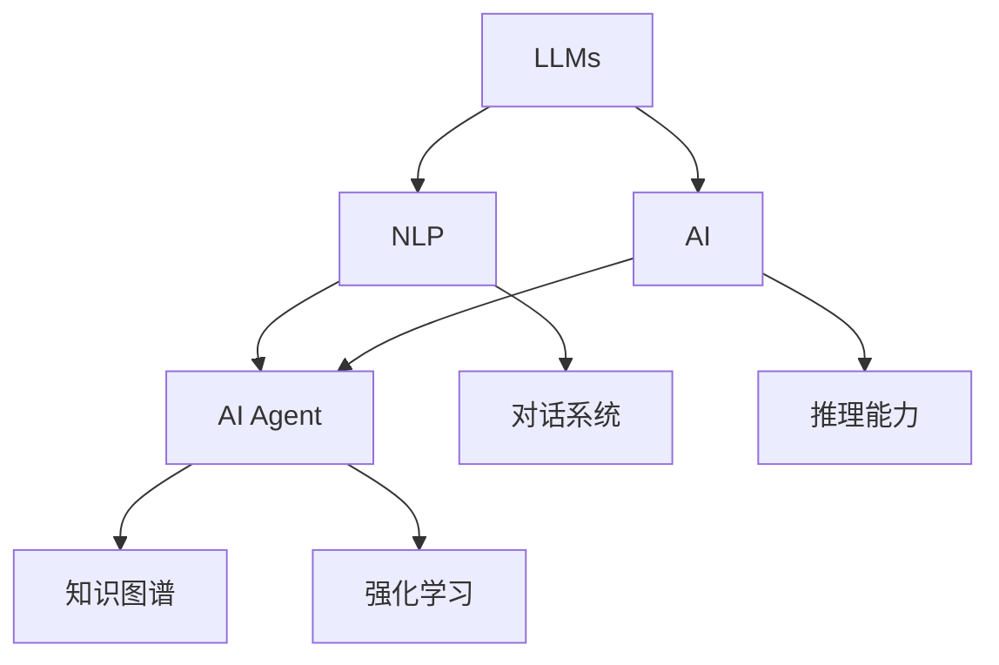

                 

# LLM在AI Agent中的角色

> 关键词：大语言模型(Large Language Models, LLMs), AI Agent, 自然语言处理(NLP), 人工智能(AI), 推理能力, 对话系统, 智能决策, 强化学习, 知识图谱

## 1. 背景介绍

### 1.1 问题由来
近年来，随着人工智能技术的飞速发展，大语言模型（LLMs）在自然语言处理（NLP）和人工智能（AI）领域取得了显著进展。这些模型通过大规模语料预训练，获得了强大的语言理解和生成能力，能够执行各种复杂的语言相关任务。然而，为了将这些模型应用于更具体的智能决策和交互任务，AI Agent应运而生，它作为智能系统的核心，负责接收输入、理解上下文、做出决策并执行相应的动作。

LLM作为AI Agent的决策支持工具，将海量语言知识转化为结构化信息，从而帮助AI Agent在复杂多变的环境中作出更加合理、智能的决策。这一角色定位不仅拓展了LLM的应用场景，也为AI Agent提供了新的设计思路和功能增强方法。

### 1.2 问题核心关键点
1. **数据与知识整合**：LLM能够整合多种数据源和知识库，为AI Agent提供全面的信息支持。
2. **推理能力提升**：LLM通过大规模语料训练，具备了强大的语言推理能力，有助于AI Agent进行因果关系推断和逻辑推理。
3. **跨领域应用**：LLM在多个领域中预训练的知识，能够提升AI Agent在不同场景下的泛化能力。
4. **自适应性**：LLM能够在实际应用中自适应，根据上下文和环境信息不断优化其推理逻辑。
5. **语义处理**：LLM的语义理解能力，能够使AI Agent更加精确地处理自然语言输入，提高决策准确性。

### 1.3 问题研究意义
研究LLM在AI Agent中的角色，有助于理解如何将通用的大模型应用到特定任务中，提升AI Agent的智能水平。通过这一研究，可以：

1. **降低开发成本**：利用LLM的预训练知识，减少从头开发所需的成本和时间。
2. **提高决策质量**：LLM丰富的语言知识支持，能够帮助AI Agent做出更加合理、精确的决策。
3. **拓展应用范围**：LLM的多领域知识覆盖，为AI Agent提供了更广泛的应用场景和功能支持。
4. **提升系统鲁棒性**：LLM的自适应性和泛化能力，提升了AI Agent在复杂环境下的稳定性和鲁棒性。
5. **增强用户互动**：LLM强大的语言生成能力，能够使AI Agent与用户进行自然流畅的互动，提升用户体验。

## 2. 核心概念与联系

### 2.1 核心概念概述

为了更好地理解LLM在AI Agent中的应用，我们首先介绍几个核心概念：

- **大语言模型（LLMs）**：以自回归（如GPT）或自编码（如BERT）模型为代表的大规模预训练语言模型。通过在大规模无标签文本语料上进行预训练，学习通用的语言知识。

- **自然语言处理（NLP）**：涉及计算机与人类语言交互的领域，包括文本分类、信息抽取、机器翻译等任务。

- **人工智能（AI）**：研究如何让计算机模拟或扩展人类智能的科学，涵盖机器学习、强化学习等多个分支。

- **AI Agent**：在特定环境中感知、推理、决策和行动的智能实体，具备一定的感知能力、决策能力和行动能力。

- **推理能力**：指AI Agent根据已有知识，推断出新知识或执行决策的能力。

- **对话系统**：模拟人类对话的AI系统，能够理解和生成自然语言，进行多轮交互。

- **知识图谱**：结构化表示知识的有向图，将实体、属性和关系等知识组织起来，方便推理和查询。

- **强化学习**：通过与环境交互，智能体不断调整策略以最大化预期回报的过程。

这些概念之间的逻辑关系可以通过以下Mermaid流程图来展示：



这个流程图展示了LLM与AI Agent之间的连接，通过NLP技术，LLM与AI Agent的交互能力得以加强，推理能力得到提升，从而更好地执行任务。同时，LLM与知识图谱和强化学习的结合，使AI Agent在复杂环境中具备更强的适应能力和决策能力。

## 3. 核心算法原理 & 具体操作步骤
### 3.1 算法原理概述

LLM在AI Agent中的角色，是通过将语言理解和生成能力嵌入到AI Agent的决策和交互过程中实现的。具体而言，LLM作为AI Agent的决策支持系统，提供语言模型、知识库和推理框架，帮助AI Agent更好地处理自然语言输入，进行因果关系推断和逻辑推理，从而提升决策质量和用户互动体验。

形式化地，假设AI Agent的任务为 $T$，其决策过程为 $D$，知识库为 $K$，推理引擎为 $R$。LLM通过预训练获得的语言模型 $M_{\theta}$，将自然语言输入 $I$ 转化为结构化信息 $E$，输入到推理引擎 $R$ 中，最终输出决策结果 $O$。其流程可以表示为：

$$
O = R(D(E), K)
$$

其中，$E = M_{\theta}(I)$，$D$ 是AI Agent的决策规则集。

### 3.2 算法步骤详解

基于LLM在AI Agent中的角色，其具体操作步骤可以总结如下：

**Step 1: 数据与知识准备**
- 收集与任务相关的数据集，进行标注和预处理。
- 整合知识图谱、专家规则库等外部知识源，构建知识库 $K$。

**Step 2: 模型选择与初始化**
- 选择合适的预训练语言模型 $M_{\theta}$，并根据任务需求对其进行微调。
- 初始化推理引擎 $R$，如基于规则的系统、基于神经网络的系统等。

**Step 3: 语言理解与推理**
- 将自然语言输入 $I$ 输入到LLM中，通过预训练模型 $M_{\theta}$ 转化为结构化信息 $E$。
- 将结构化信息 $E$ 与知识库 $K$ 中的知识进行整合，形成新的知识图谱或规则集。

**Step 4: 决策与执行**
- 将整合后的知识图谱或规则集作为输入，输入到推理引擎 $R$ 中。
- 根据推理引擎的输出，执行相应的动作或决策。

**Step 5: 反馈与迭代**
- 收集执行结果和用户反馈，更新知识库 $K$ 和推理规则 $D$。
- 重复执行以上步骤，不断迭代优化AI Agent的决策和推理能力。

### 3.3 算法优缺点

基于LLM在AI Agent中的角色的算法，具有以下优点：

1. **高效的信息处理**：LLM强大的语言理解和生成能力，使得AI Agent能够高效处理自然语言输入，提高决策效率。
2. **提升推理能力**：通过与知识库和推理引擎的结合，LLM能够帮助AI Agent进行因果关系推断和逻辑推理，提升决策准确性。
3. **跨领域应用**：LLM的多领域知识覆盖，为AI Agent提供了更广泛的应用场景和功能支持。
4. **自适应性强**：LLM的自适应性和泛化能力，使AI Agent能够根据环境变化进行动态调整。
5. **提高用户体验**：LLM的自然语言生成能力，使AI Agent与用户进行自然流畅的互动，提升用户体验。

同时，该方法也存在以下局限性：

1. **数据依赖性强**：预训练数据和任务数据的质量直接影响AI Agent的决策效果。
2. **推理过程复杂**：LLM与推理引擎的结合，增加了决策过程的复杂性，需要更多的计算资源和时间。
3. **泛化能力有限**：尽管LLM在预训练阶段学习了通用的语言知识，但不同领域的数据差异较大，其泛化能力有限。
4. **资源消耗高**：LLM的参数量和计算复杂度较高，需要高性能的计算资源支持。
5. **可解释性不足**：LLM的决策过程较为复杂，难以对其推理逻辑进行解释和调试。

尽管存在这些局限性，但LLM在AI Agent中的应用，展示了其强大的语言处理和推理能力，为AI Agent提供了有力的决策支持。

### 3.4 算法应用领域

基于LLM在AI Agent中的角色的算法，已经在多个领域得到了应用，包括但不限于：

- **智能客服**：AI Agent通过与LLM结合，能够自动理解用户意图，提供精准的服务和建议。
- **金融理财**：AI Agent通过LLM的金融知识支持，能够进行风险评估、投资建议等。
- **医疗健康**：AI Agent通过LLM的医学知识支持，能够进行病情诊断、治疗方案推荐等。
- **智能交通**：AI Agent通过LLM的交通知识支持，能够进行路况预测、路径规划等。
- **智能家居**：AI Agent通过LLM的智能家居知识支持，能够进行智能设备控制、家庭安全等。

## 4. 数学模型和公式 & 详细讲解  
### 4.1 数学模型构建

在本节中，我们将使用数学语言对LLM在AI Agent中的决策过程进行更加严格的刻画。

假设AI Agent的任务为 $T$，其输入为自然语言文本 $I$，决策结果为 $O$。知识库 $K$ 包含 $N$ 个实体-属性对 $(E_i, A_i)$，推理引擎 $R$ 通过推理规则 $D$ 执行推理操作。LLM的预训练模型 $M_{\theta}$ 将输入 $I$ 转化为结构化信息 $E$，推理引擎 $R$ 根据知识库 $K$ 和推理规则 $D$ 输出决策结果 $O$。其数学模型可以表示为：

$$
O = R(D(E), K)
$$

其中，$E = M_{\theta}(I)$。

### 4.2 公式推导过程

以二分类任务为例，假设AI Agent的任务是判断一条新闻是否为负面新闻。

**Step 1: 输入处理**
- 将新闻文本 $I$ 输入到预训练模型 $M_{\theta}$ 中，得到结构化信息 $E = M_{\theta}(I)$。

**Step 2: 知识库整合**
- 将新闻文本 $I$ 与知识库 $K$ 中的相关实体和属性进行匹配，更新推理引擎 $R$ 的推理规则 $D$。

**Step 3: 决策推理**
- 将更新后的推理规则 $D$ 和结构化信息 $E$ 输入到推理引擎 $R$ 中，进行推理操作，得到决策结果 $O$。

在实际应用中，LLM的预训练模型 $M_{\theta}$ 可以使用BERT、GPT等模型，其推理引擎 $R$ 可以是基于规则的系统、基于神经网络的系统等。

### 4.3 案例分析与讲解

以下是一个基于LLM在AI Agent中应用的具体案例分析：

**案例：智能客服系统**

在智能客服系统中，AI Agent通过与LLM结合，能够自动理解用户意图，提供精准的服务和建议。具体实现步骤如下：

1. **数据与知识准备**
   - 收集用户的客服对话记录，标注用户意图和问题。
   - 整合知识库 $K$，包含常见问题及其答案、业务流程等。

2. **模型选择与初始化**
   - 选择合适的预训练语言模型 $M_{\theta}$，如BERT、GPT等。
   - 初始化推理引擎 $R$，如基于规则的系统、基于神经网络的系统等。

3. **语言理解与推理**
   - 将用户输入的自然语言文本 $I$ 输入到预训练模型 $M_{\theta}$ 中，得到结构化信息 $E$。
   - 将结构化信息 $E$ 与知识库 $K$ 中的知识进行整合，更新推理引擎 $R$ 的推理规则 $D$。

4. **决策与执行**
   - 根据推理引擎 $R$ 的输出，生成相应的客服回复。
   - 执行回复生成操作，与用户进行互动。

5. **反馈与迭代**
   - 收集用户反馈，更新知识库 $K$ 和推理规则 $D$。
   - 重复执行以上步骤，不断迭代优化AI Agent的决策和推理能力。

## 5. 项目实践：代码实例和详细解释说明
### 5.1 开发环境搭建

在进行LLM在AI Agent中的应用实践前，我们需要准备好开发环境。以下是使用Python进行PyTorch开发的环境配置流程：

1. 安装Anaconda：从官网下载并安装Anaconda，用于创建独立的Python环境。

2. 创建并激活虚拟环境：
```bash
conda create -n llm-agent-env python=3.8 
conda activate llm-agent-env
```

3. 安装PyTorch：根据CUDA版本，从官网获取对应的安装命令。例如：
```bash
conda install pytorch torchvision torchaudio cudatoolkit=11.1 -c pytorch -c conda-forge
```

4. 安装Transformers库：
```bash
pip install transformers
```

5. 安装各类工具包：
```bash
pip install numpy pandas scikit-learn matplotlib tqdm jupyter notebook ipython
```

完成上述步骤后，即可在`llm-agent-env`环境中开始项目实践。

### 5.2 源代码详细实现

下面我以基于BERT的智能客服系统为例，给出使用Transformers库进行LLM在AI Agent中的应用的PyTorch代码实现。

首先，定义智能客服系统的数据处理函数：

```python
from transformers import BertTokenizer
from torch.utils.data import Dataset
import torch

class CustomerServiceDataset(Dataset):
    def __init__(self, texts, intents, tokenizer, max_len=128):
        self.texts = texts
        self.intents = intents
        self.tokenizer = tokenizer
        self.max_len = max_len
        
    def __len__(self):
        return len(self.texts)
    
    def __getitem__(self, item):
        text = self.texts[item]
        intent = self.intents[item]
        
        encoding = self.tokenizer(text, return_tensors='pt', max_length=self.max_len, padding='max_length', truncation=True)
        input_ids = encoding['input_ids'][0]
        attention_mask = encoding['attention_mask'][0]
        
        # 将意图标签转换为数字
        label = intent2id[intent]
        
        return {'input_ids': input_ids, 
                'attention_mask': attention_mask,
                'labels': label}

# 意图与id的映射
intent2id = {'unknown': 0, 'help': 1, 'order': 2, 'complaint': 3}
id2intent = {v: k for k, v in intent2id.items()}

# 创建dataset
tokenizer = BertTokenizer.from_pretrained('bert-base-cased')

train_dataset = CustomerServiceDataset(train_texts, train_intents, tokenizer)
dev_dataset = CustomerServiceDataset(dev_texts, dev_intents, tokenizer)
test_dataset = CustomerServiceDataset(test_texts, test_intents, tokenizer)
```

然后，定义模型和优化器：

```python
from transformers import BertForTokenClassification, AdamW

model = BertForTokenClassification.from_pretrained('bert-base-cased', num_labels=len(intent2id))

optimizer = AdamW(model.parameters(), lr=2e-5)
```

接着，定义训练和评估函数：

```python
from torch.utils.data import DataLoader
from tqdm import tqdm
from sklearn.metrics import classification_report

device = torch.device('cuda') if torch.cuda.is_available() else torch.device('cpu')
model.to(device)

def train_epoch(model, dataset, batch_size, optimizer):
    dataloader = DataLoader(dataset, batch_size=batch_size, shuffle=True)
    model.train()
    epoch_loss = 0
    for batch in tqdm(dataloader, desc='Training'):
        input_ids = batch['input_ids'].to(device)
        attention_mask = batch['attention_mask'].to(device)
        labels = batch['labels'].to(device)
        model.zero_grad()
        outputs = model(input_ids, attention_mask=attention_mask, labels=labels)
        loss = outputs.loss
        epoch_loss += loss.item()
        loss.backward()
        optimizer.step()
    return epoch_loss / len(dataloader)

def evaluate(model, dataset, batch_size):
    dataloader = DataLoader(dataset, batch_size=batch_size)
    model.eval()
    preds, labels = [], []
    with torch.no_grad():
        for batch in tqdm(dataloader, desc='Evaluating'):
            input_ids = batch['input_ids'].to(device)
            attention_mask = batch['attention_mask'].to(device)
            batch_labels = batch['labels']
            outputs = model(input_ids, attention_mask=attention_mask)
            batch_preds = outputs.logits.argmax(dim=2).to('cpu').tolist()
            batch_labels = batch_labels.to('cpu').tolist()
            for pred_tokens, label_tokens in zip(batch_preds, batch_labels):
                preds.append(pred_tokens[:len(label_tokens)])
                labels.append(label_tokens)
                
    print(classification_report(labels, preds))
```

最后，启动训练流程并在测试集上评估：

```python
epochs = 5
batch_size = 16

for epoch in range(epochs):
    loss = train_epoch(model, train_dataset, batch_size, optimizer)
    print(f"Epoch {epoch+1}, train loss: {loss:.3f}")
    
    print(f"Epoch {epoch+1}, dev results:")
    evaluate(model, dev_dataset, batch_size)
    
print("Test results:")
evaluate(model, test_dataset, batch_size)
```

以上就是使用PyTorch对BERT进行智能客服系统微调的完整代码实现。可以看到，得益于Transformers库的强大封装，我们可以用相对简洁的代码完成BERT模型的加载和微调。

### 5.3 代码解读与分析

让我们再详细解读一下关键代码的实现细节：

**CustomerServiceDataset类**：
- `__init__`方法：初始化文本、意图标签、分词器等关键组件。
- `__len__`方法：返回数据集的样本数量。
- `__getitem__`方法：对单个样本进行处理，将文本输入编码为token ids，将意图标签转换为数字，并对其进行定长padding，最终返回模型所需的输入。

**intent2id和id2intent字典**：
- 定义了意图与数字id之间的映射关系，用于将预测结果解码回真实的意图。

**训练和评估函数**：
- 使用PyTorch的DataLoader对数据集进行批次化加载，供模型训练和推理使用。
- 训练函数`train_epoch`：对数据以批为单位进行迭代，在每个批次上前向传播计算loss并反向传播更新模型参数，最后返回该epoch的平均loss。
- 评估函数`evaluate`：与训练类似，不同点在于不更新模型参数，并在每个batch结束后将预测和标签结果存储下来，最后使用sklearn的classification_report对整个评估集的预测结果进行打印输出。

**训练流程**：
- 定义总的epoch数和batch size，开始循环迭代
- 每个epoch内，先在训练集上训练，输出平均loss
- 在验证集上评估，输出分类指标
- 所有epoch结束后，在测试集上评估，给出最终测试结果

可以看到，PyTorch配合Transformers库使得BERT微调的代码实现变得简洁高效。开发者可以将更多精力放在数据处理、模型改进等高层逻辑上，而不必过多关注底层的实现细节。

当然，工业级的系统实现还需考虑更多因素，如模型的保存和部署、超参数的自动搜索、更灵活的任务适配层等。但核心的微调范式基本与此类似。

## 6. 实际应用场景
### 6.1 智能客服系统

基于LLM在AI Agent中的应用，智能客服系统能够提供精准的服务和建议，提升客户满意度。具体而言，LLM能够自动理解用户意图，匹配最合适的回复模板，并在需要时查询知识库或执行其他操作，从而实现高效、个性化的客户服务。

在技术实现上，可以收集企业内部的历史客服对话记录，将问题和最佳答复构建成监督数据，在此基础上对预训练模型进行微调。微调后的模型能够自动理解用户意图，匹配最合适的回复模板，并在需要时查询知识库或执行其他操作，从而实现高效、个性化的客户服务。

### 6.2 金融理财

在金融理财领域，LLM可以用于风险评估、投资建议等。通过整合金融领域的知识库，LLM能够帮助AI Agent进行复杂的多条件推理，评估投资组合的风险和收益，提供个性化的投资建议。

### 6.3 医疗健康

在医疗健康领域，LLM可以用于病情诊断、治疗方案推荐等。通过整合医学领域的知识库，LLM能够帮助AI Agent进行复杂的病历分析，根据患者的历史记录和当前症状，提供精准的诊断和治疗建议。

### 6.4 未来应用展望

随着LLM在AI Agent中的应用不断拓展，未来的应用场景将更加多样化。例如：

- **智能交通**：LLM可以用于路况预测、路径规划等。通过整合交通领域的知识库，LLM能够帮助AI Agent进行复杂的交通推理，提供个性化的出行方案。
- **智能家居**：LLM可以用于智能设备控制、家庭安全等。通过整合家居领域的知识库，LLM能够帮助AI Agent进行复杂的设备管理，提供个性化的家庭服务。
- **智能教育**：LLM可以用于智能作业批改、学情分析、知识推荐等。通过整合教育领域的知识库，LLM能够帮助AI Agent进行复杂的教育推理，提供个性化的学习建议。

## 7. 工具和资源推荐
### 7.1 学习资源推荐

为了帮助开发者系统掌握LLM在AI Agent中的应用，这里推荐一些优质的学习资源：

1. 《Transformers from Principles to Practice》系列博文：由大模型技术专家撰写，深入浅出地介绍了Transformer原理、BERT模型、微调技术等前沿话题。

2. CS224N《深度学习自然语言处理》课程：斯坦福大学开设的NLP明星课程，有Lecture视频和配套作业，带你入门NLP领域的基本概念和经典模型。

3. 《Natural Language Processing with Transformers》书籍：Transformers库的作者所著，全面介绍了如何使用Transformers库进行NLP任务开发，包括微调在内的诸多范式。

4. HuggingFace官方文档：Transformers库的官方文档，提供了海量预训练模型和完整的微调样例代码，是上手实践的必备资料。

5. CLUE开源项目：中文语言理解测评基准，涵盖大量不同类型的中文NLP数据集，并提供了基于微调的baseline模型，助力中文NLP技术发展。

通过对这些资源的学习实践，相信你一定能够快速掌握LLM在AI Agent中的应用，并用于解决实际的NLP问题。
###  7.2 开发工具推荐

高效的开发离不开优秀的工具支持。以下是几款用于LLM在AI Agent中的应用开发的常用工具：

1. PyTorch：基于Python的开源深度学习框架，灵活动态的计算图，适合快速迭代研究。大部分预训练语言模型都有PyTorch版本的实现。

2. TensorFlow：由Google主导开发的开源深度学习框架，生产部署方便，适合大规模工程应用。同样有丰富的预训练语言模型资源。

3. Transformers库：HuggingFace开发的NLP工具库，集成了众多SOTA语言模型，支持PyTorch和TensorFlow，是进行LLM在AI Agent中的应用开发的利器。

4. Weights & Biases：模型训练的实验跟踪工具，可以记录和可视化模型训练过程中的各项指标，方便对比和调优。与主流深度学习框架无缝集成。

5. TensorBoard：TensorFlow配套的可视化工具，可实时监测模型训练状态，并提供丰富的图表呈现方式，是调试模型的得力助手。

6. Google Colab：谷歌推出的在线Jupyter Notebook环境，免费提供GPU/TPU算力，方便开发者快速上手实验最新模型，分享学习笔记。

合理利用这些工具，可以显著提升LLM在AI Agent中的应用开发效率，加快创新迭代的步伐。

### 7.3 相关论文推荐

LLM在AI Agent中的应用源于学界的持续研究。以下是几篇奠基性的相关论文，推荐阅读：

1. Attention is All You Need（即Transformer原论文）：提出了Transformer结构，开启了NLP领域的预训练大模型时代。

2. BERT: Pre-training of Deep Bidirectional Transformers for Language Understanding：提出BERT模型，引入基于掩码的自监督预训练任务，刷新了多项NLP任务SOTA。

3. Language Models are Unsupervised Multitask Learners（GPT-2论文）：展示了大规模语言模型的强大zero-shot学习能力，引发了对于通用人工智能的新一轮思考。

4. Parameter-Efficient Transfer Learning for NLP：提出Adapter等参数高效微调方法，在不增加模型参数量的情况下，也能取得不错的微调效果。

5. Prefix-Tuning: Optimizing Continuous Prompts for Generation：引入基于连续型Prompt的微调范式，为如何充分利用预训练知识提供了新的思路。

6. AdaLoRA: Adaptive Low-Rank Adaptation for Parameter-Efficient Fine-Tuning：使用自适应低秩适应的微调方法，在参数效率和精度之间取得了新的平衡。

这些论文代表了大语言模型在AI Agent中的应用的发展脉络。通过学习这些前沿成果，可以帮助研究者把握学科前进方向，激发更多的创新灵感。

## 8. 总结：未来发展趋势与挑战

### 8.1 总结

本文对LLM在AI Agent中的应用进行了全面系统的介绍。首先阐述了LLM和AI Agent的研究背景和意义，明确了LLM在AI Agent决策支持系统中的关键角色。其次，从原理到实践，详细讲解了LLM在AI Agent中的决策支持过程，给出了LLM在智能客服、金融理财、医疗健康等多个行业领域的应用实例。同时，本文还广泛探讨了LLM在AI Agent中的应用前景，展示了LLM在智能决策和推理方面的巨大潜力。

通过本文的系统梳理，可以看到，LLM在AI Agent中的应用拓展了预训练语言模型的应用场景，提升了AI Agent的智能水平。随着LLM在多个领域的应用不断深入，AI Agent将变得更加智能和灵活，为各行各业提供更加精准、高效的智能服务。

### 8.2 未来发展趋势

展望未来，LLM在AI Agent中的应用将呈现以下几个发展趋势：

1. **模型规模持续增大**：随着算力成本的下降和数据规模的扩张，预训练语言模型的参数量还将持续增长。超大规模语言模型蕴含的丰富语言知识，有望支撑更加复杂多变的AI Agent决策支持。

2. **跨领域知识融合**：LLM在预训练阶段学习了多领域的语言知识，未来将更好地与领域特定的知识库进行融合，提升AI Agent在不同场景下的泛化能力。

3. **自适应性和动态调整**：LLM的自适应性和动态调整能力，使AI Agent能够根据环境变化进行动态优化，提升系统稳定性和鲁棒性。

4. **多模态信息整合**：LLM的多模态信息整合能力，将使AI Agent具备更全面的感知能力，提升智能决策的准确性。

5. **强化学习结合**：LLM与强化学习的结合，将使AI Agent具备更强的自主学习和适应能力，进一步提升决策质量和用户体验。

以上趋势凸显了LLM在AI Agent中的应用前景。这些方向的探索发展，必将进一步提升AI Agent的智能水平，为更多行业提供强大的决策支持。

### 8.3 面临的挑战

尽管LLM在AI Agent中的应用取得了显著进展，但在迈向更加智能化、普适化应用的过程中，仍面临诸多挑战：

1. **数据依赖性强**：预训练数据和任务数据的质量直接影响AI Agent的决策效果。如何获取高质量数据，并构建有效的数据集，是一个重要的问题。

2. **推理过程复杂**：LLM与推理引擎的结合，增加了决策过程的复杂性，需要更多的计算资源和时间。如何优化推理过程，提高决策效率，是亟需解决的问题。

3. **泛化能力有限**：尽管LLM在预训练阶段学习了通用的语言知识，但不同领域的数据差异较大，其泛化能力有限。如何提升LLM在不同领域的应用效果，是未来的研究方向。

4. **资源消耗高**：LLM的参数量和计算复杂度较高，需要高性能的计算资源支持。如何优化资源使用，降低计算成本，是实现大规模应用的关键。

5. **可解释性不足**：LLM的决策过程较为复杂，难以对其推理逻辑进行解释和调试。如何提升模型的可解释性，增强系统的透明度和可信度，是未来需要关注的问题。

6. **安全性有待保障**：预训练语言模型可能学习到有偏见、有害的信息，通过微调传递到AI Agent中，带来安全隐患。如何保证模型的安全性，避免恶意用途，是重要的研究方向。

7. **多模态信息整合**：多模态信息的整合和处理，增加了决策过程的复杂性，需要更多的计算资源和时间。如何优化多模态信息的整合，提高决策效率，是亟需解决的问题。

这些挑战凸显了LLM在AI Agent中的应用仍需更多的理论和实践突破。只有不断优化数据、模型、推理引擎和计算资源，才能真正实现LLM在AI Agent中的高效、智能应用。

### 8.4 研究展望

面向未来，LLM在AI Agent中的应用需要更多的探索和创新：

1. **无监督和半监督学习**：探索无监督和半监督学习范式，降低对大规模标注数据的依赖，利用自监督学习、主动学习等方法，提升LLM在AI Agent中的泛化能力。

2. **参数高效和计算高效的微调方法**：开发更加参数高效的微调方法，在固定大部分预训练参数的情况下，只更新极少量的任务相关参数。同时优化推理过程的计算图，减少前向传播和反向传播的资源消耗，实现更加轻量级、实时性的部署。

3. **因果学习和推理**：引入因果学习和推理的思想，增强LLM在AI Agent中的决策能力和解释能力。通过引入因果推断和对比学习，提升模型建立稳定因果关系的能力，学习更加普适、鲁棒的语言表征。

4. **知识表示与整合**：将符号化的先验知识，如知识图谱、逻辑规则等，与神经网络模型进行巧妙融合，引导微调过程学习更准确、合理的语言模型。同时加强不同模态数据的整合，实现视觉、语音等多模态信息与文本信息的协同建模。

5. **自适应学习与动态调整**：开发自适应学习算法，使AI Agent能够根据环境变化进行动态调整，提升系统的灵活性和适应能力。

6. **多任务学习与知识迁移**：探索多任务学习范式，使LLM在AI Agent中具备更强的跨任务迁移能力，提升模型的通用性和泛化能力。

7. **安全与可信**：在模型训练目标中引入伦理导向的评估指标，过滤和惩罚有偏见、有害的输出倾向。加强人工干预和审核，建立模型行为的监管机制，确保输出符合人类价值观和伦理道德。

这些研究方向将推动LLM在AI Agent中的应用不断深入，为构建更加智能、可信、安全的智能系统铺平道路。面向未来，LLM在AI Agent中的应用将展现出更加广阔的前景和潜力。

## 9. 附录：常见问题与解答
**Q1: 大语言模型在AI Agent中的角色是什么？**

A: 大语言模型在AI Agent中主要担任决策支持系统的角色。通过将语言理解和生成能力嵌入到AI Agent的决策和交互过程中，帮助AI Agent更好地处理自然语言输入，进行因果关系推断和逻辑推理，从而提升决策质量和用户互动体验。

**Q2: 大语言模型在AI Agent中的应用有哪些？**

A: 大语言模型在AI Agent中的应用广泛，包括但不限于智能客服、金融理财、医疗健康、智能交通、智能家居、智能教育等多个领域。这些应用场景中，大语言模型能够提供精准的决策支持，提升AI Agent的智能水平和用户体验。

**Q3: 大语言模型在AI Agent中应用时，如何提高决策效率？**

A: 提高决策效率的方法包括数据增强、知识库整合、推理规则优化、多任务学习等。数据增强可以通过回译、近义替换等方式扩充训练集，提高模型泛化能力。知识库整合可以将不同领域的知识进行整合，提升模型推理能力。推理规则优化可以通过优化推理过程，减少计算资源消耗，提高决策效率。多任务学习可以提升模型的泛化能力，提高决策效率。

**Q4: 大语言模型在AI Agent中应用时，如何保证模型的安全性？**

A: 保证模型安全性的方法包括数据清洗、模型监控、人工干预等。数据清洗可以过滤掉可能含有偏见、有害信息的训练数据，减少模型风险。模型监控可以实时监测模型的输出，发现异常情况及时干预。人工干预可以在模型输出异常时，提供人工审核和纠正，确保模型输出符合伦理道德。

**Q5: 大语言模型在AI Agent中应用时，如何提高模型的可解释性？**

A: 提高模型可解释性的方法包括引入因果分析、博弈论工具、知识图谱等。引入因果分析可以增强模型推理过程的逻辑性和透明性。博弈论工具可以模拟人机交互过程，分析模型决策的稳定性和安全性。知识图谱可以提供结构化知识支持，帮助理解模型推理过程。

通过上述问题的解答，可以看到，大语言模型在AI Agent中的应用前景广阔，但也面临诸多挑战。只有在数据、模型、推理引擎和计算资源等多个方面进行优化，才能真正实现其高效、智能的应用。

