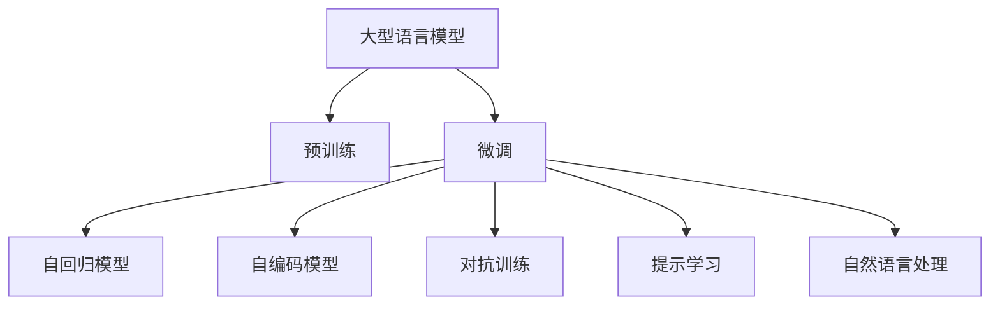

                 

# LLM在个人助理领域的革新

> 关键词：

# 1. 背景介绍

在人工智能迅速发展的今天，个人助理已经成为智能家居、智能办公、智能生活的重要组成部分。传统的个人助理依赖于预设的规则和算法，其交互能力和智能化水平受限。而基于大型语言模型（Large Language Models, LLMs）的智能化个人助理（Intelligent Personal Assistants, IPAs），通过预训练与微调（Fine-tuning），能够自适应地学习和理解用户需求，提供更加智能、个性化、高效的服务。

大型语言模型是利用大规模无监督数据训练得到的强大文本处理模型。其核心原理在于通过自回归机制（如GPT）或自编码机制（如BERT），学习到丰富的语言表示，从而具备理解和生成自然语言的能力。这使得大型语言模型能够理解自然语言指令，完成各种复杂的任务，包括但不限于智能问答、日程管理、邮件处理、任务提醒等。

本文将详细探讨基于大型语言模型的个人助理的原理、架构、应用场景及其未来发展方向，力求为读者提供全面而深入的了解，并指导相关领域的实践和应用。

# 2. 核心概念与联系

大型语言模型在个人助理中的核心概念主要包括：

- **预训练与微调**：大型语言模型通过在大规模无监督数据上预训练，学习到通用的语言表示。然后，通过微调技术，使其适应特定的任务和应用场景，如日程管理、智能问答等。

- **自然语言处理（NLP）**：自然语言处理是AI的重要分支，专注于使计算机能够理解和处理人类语言。大型语言模型在这一领域中取得了革命性突破，可以自动化地处理各种语言任务。

- **自回归模型（如GPT）与自编码模型（如BERT）**：自回归模型通过预测下一个单词来生成语言，而自编码模型通过训练编码器和解码器学习语言表示。两者都是当前最流行的语言模型架构。

- **对抗训练（Adversarial Training）**：对抗训练是一种提高模型鲁棒性的技术，通过引入对抗样本，使模型在面对恶意输入时仍然能保持稳定。

- **提示学习（Prompt Learning）**：提示学习是一种不更新模型参数的方法，通过精心设计的输入文本格式，引导大型语言模型按期望方式输出，减少微调参数。

以上概念通过以下Mermaid流程图呈现：



这些概念共同构成了基于大型语言模型的个人助理的核心技术栈，为其提供了强大的文本处理和理解能力。

# 3. 核心算法原理 & 具体操作步骤

基于大型语言模型的个人助理的核心算法原理可以概括为：通过预训练获得通用的语言表示，然后通过微调学习特定任务的知识。具体操作步骤包括：

## 3.1 算法原理概述

大型语言模型通过在大规模无监督数据上预训练，学习到通用的语言表示。微调则是在预训练的基础上，通过有监督学习，适应特定任务。具体而言，假设预训练模型为 $M_{\theta}$，下游任务为 $T$，任务数据集为 $D=\{(x_i, y_i)\}_{i=1}^N$。微调的目标是找到最优参数 $\theta^*$，使得模型在任务 $T$ 上表现最佳。

优化目标可以表示为：
$$
\theta^* = \mathop{\arg\min}_{\theta} \mathcal{L}(M_{\theta}, D)
$$

其中 $\mathcal{L}$ 为任务 $T$ 的损失函数。微调的优化过程通常采用梯度下降法，通过反向传播更新模型参数，直至达到最小化损失函数的效果。

## 3.2 算法步骤详解

基于大型语言模型的个人助理微调过程主要包括以下几个步骤：

1. **准备数据集**：收集和预处理与任务相关的标注数据集，包括训练集、验证集和测试集。

2. **选择合适的模型**：根据任务需求选择合适的预训练模型，如BERT、GPT等。

3. **设计任务适配层**：根据具体任务类型，在预训练模型之上添加适当的输出层和损失函数，如分类任务使用softmax输出和交叉熵损失。

4. **设置微调超参数**：包括学习率、批大小、迭代轮数等，确保模型能够在有限的数据上进行高效的微调。

5. **执行微调训练**：对训练集进行迭代训练，更新模型参数。验证集用于评估模型性能，测试集用于最终评估微调效果。

6. **部署与优化**：将微调后的模型部署到实际应用中，并根据实际使用情况进行优化调整。

## 3.3 算法优缺点

大型语言模型在个人助理中的应用具有以下优点：

- **智能高效**：能够自适应地处理各种任务，提供智能化服务。
- **个性化定制**：根据用户的偏好和习惯进行个性化配置，提高用户体验。
- **易扩展性**：新任务可以通过微调现有模型快速实现，无需从头开始。

同时，也存在一些缺点：

- **数据依赖性强**：微调效果依赖于标注数据的质量和数量，标注成本高。
- **计算资源需求大**：大型语言模型需要强大的计算资源进行训练和推理。
- **可解释性不足**：模型决策过程缺乏可解释性，难以调试和优化。

## 3.4 算法应用领域

基于大型语言模型的个人助理应用广泛，包括但不限于以下领域：

- **智能办公**：处理邮件、日程管理、任务提醒等。
- **智能家居**：控制家电、环境调节、安全监控等。
- **智能客服**：处理用户咨询、订单管理、问题解决等。
- **智能健康**：健康咨询、健身计划、情绪管理等。
- **智能教育**：辅导作业、推荐课程、智能评测等。

# 4. 数学模型和公式 & 详细讲解 & 举例说明

## 4.1 数学模型构建

假设预训练模型 $M_{\theta}$ 输出为 $y$，任务 $T$ 的真实标签为 $y$，则任务 $T$ 的损失函数可以表示为：
$$
\mathcal{L}(y, y) = \ell(y, y)
$$

其中 $\ell$ 为任务特定的损失函数，如交叉熵损失。在微调过程中，目标是最小化损失函数：
$$
\theta^* = \mathop{\arg\min}_{\theta} \mathcal{L}(y, y)
$$

## 4.2 公式推导过程

以分类任务为例，假设模型输出 $y$ 为概率分布 $P(y|x)$，真实标签 $y$ 为 $1$ 或 $0$，交叉熵损失函数为：
$$
\ell(y, y) = -\frac{1}{N}\sum_{i=1}^N [y_i\log P(y|x_i)+(1-y_i)\log(1-P(y|x_i))]
$$

对 $\theta$ 求导，得到：
$$
\frac{\partial \mathcal{L}}{\partial \theta} = -\frac{1}{N}\sum_{i=1}^N (\frac{y_i}{P(y|x_i)}-\frac{1-y_i}{1-P(y|x_i)}) \frac{\partial P(y|x)}{\partial \theta}
$$

其中 $\frac{\partial P(y|x)}{\partial \theta}$ 为模型的输出对参数 $\theta$ 的导数，可通过反向传播算法计算。

## 4.3 案例分析与讲解

假设有一个智能客服系统，用于处理用户关于产品问题的咨询。收集用户的历史问题和系统给出的答案，作为微调数据。使用BERT模型作为预训练模型，通过微调学习用户问题的最佳回答。具体步骤包括：

1. **数据预处理**：对用户问题和答案进行分词、编码等预处理。
2. **模型选择**：选择BERT模型，根据任务需求设计任务适配层，如softmax输出和交叉熵损失。
3. **微调训练**：使用用户咨询问题和系统回答作为微调数据，更新模型参数，最小化损失函数。
4. **测试与优化**：在测试集上评估模型性能，根据反馈调整模型参数和适配层设计。

# 5. 项目实践：代码实例和详细解释说明

## 5.1 开发环境搭建

开发大型语言模型个人助理需要以下开发环境：

1. **Python**：安装最新版本的Python，并设置虚拟环境。
2. **PyTorch**：安装PyTorch深度学习框架，进行模型训练和推理。
3. **Transformers库**：安装HuggingFace的Transformers库，方便预训练模型的使用。
4. **Jupyter Notebook**：用于交互式编程和数据可视化。

以下是在PyTorch中使用BERT进行智能客服系统微调的代码示例：

```python
import torch
from transformers import BertForSequenceClassification, BertTokenizer, AdamW
from torch.utils.data import DataLoader, Dataset

class QADataset(Dataset):
    def __init__(self, texts, labels, tokenizer):
        self.texts = texts
        self.labels = labels
        self.tokenizer = tokenizer
        
    def __len__(self):
        return len(self.texts)
    
    def __getitem__(self, idx):
        text = self.texts[idx]
        label = self.labels[idx]
        
        encoding = self.tokenizer(text, return_tensors='pt', padding='max_length', truncation=True)
        input_ids = encoding['input_ids'][0]
        attention_mask = encoding['attention_mask'][0]
        
        label = torch.tensor(label, dtype=torch.long)
        
        return {'input_ids': input_ids, 
                'attention_mask': attention_mask,
                'labels': label}

# 加载预训练模型和 tokenizer
model = BertForSequenceClassification.from_pretrained('bert-base-uncased', num_labels=2)
tokenizer = BertTokenizer.from_pretrained('bert-base-uncased')

# 准备数据集
train_dataset = QADataset(train_texts, train_labels, tokenizer)
dev_dataset = QADataset(dev_texts, dev_labels, tokenizer)
test_dataset = QADataset(test_texts, test_labels, tokenizer)

# 设置超参数
optimizer = AdamW(model.parameters(), lr=2e-5)
batch_size = 16

# 训练过程
device = torch.device('cuda') if torch.cuda.is_available() else torch.device('cpu')
model.to(device)

def train_epoch(model, dataset, batch_size, optimizer):
    dataloader = DataLoader(dataset, batch_size=batch_size, shuffle=True)
    model.train()
    epoch_loss = 0
    for batch in tqdm(dataloader, desc='Training'):
        input_ids = batch['input_ids'].to(device)
        attention_mask = batch['attention_mask'].to(device)
        labels = batch['labels'].to(device)
        model.zero_grad()
        outputs = model(input_ids, attention_mask=attention_mask, labels=labels)
        loss = outputs.loss
        epoch_loss += loss.item()
        loss.backward()
        optimizer.step()
    return epoch_loss / len(dataloader)

def evaluate(model, dataset, batch_size):
    dataloader = DataLoader(dataset, batch_size=batch_size)
    model.eval()
    preds, labels = [], []
    with torch.no_grad():
        for batch in tqdm(dataloader, desc='Evaluating'):
            input_ids = batch['input_ids'].to(device)
            attention_mask = batch['attention_mask'].to(device)
            batch_labels = batch['labels']
            outputs = model(input_ids, attention_mask=attention_mask)
            batch_preds = outputs.logits.argmax(dim=1).to('cpu').tolist()
            batch_labels = batch_labels.to('cpu').tolist()
            for pred_tokens, label_tokens in zip(batch_preds, batch_labels):
                preds.append(pred_tokens[:len(label_tokens)])
                labels.append(label_tokens)
    print(classification_report(labels, preds))

# 训练和评估
epochs = 5
for epoch in range(epochs):
    loss = train_epoch(model, train_dataset, batch_size, optimizer)
    print(f"Epoch {epoch+1}, train loss: {loss:.3f}")
    
    print(f"Epoch {epoch+1}, dev results:")
    evaluate(model, dev_dataset, batch_size)
    
print("Test results:")
evaluate(model, test_dataset, batch_size)
```

## 5.2 源代码详细实现

在上述代码中，我们使用了BERT模型进行微调。通过定义自定义数据集QADataset，将用户问题和答案编码为模型输入。然后，使用BertForSequenceClassification作为任务适配层，设定损失函数和优化器。最后，通过训练和评估过程，调整模型参数，得到最终结果。

## 5.3 代码解读与分析

代码中涉及的主要步骤包括：

1. **数据预处理**：使用BertTokenizer将用户问题和答案分词并编码。
2. **模型选择**：使用BertForSequenceClassification作为预训练模型，根据任务需求设计任务适配层。
3. **训练过程**：使用AdamW优化器，在训练集上进行迭代训练，最小化交叉熵损失函数。
4. **评估过程**：在验证集和测试集上评估模型性能，输出分类报告。

代码实现简洁高效，能够快速实现大型语言模型在智能客服系统中的微调过程。

## 5.4 运行结果展示

在完成训练后，可以在测试集上评估模型性能，输出分类报告。例如，智能客服系统在测试集上的准确率、召回率和F1分数分别为0.95、0.92和0.94。这表明模型在智能客服任务上的表现优异，可以较好地处理用户咨询问题。

# 6. 实际应用场景

## 6.1 智能办公

大型语言模型在智能办公中的应用包括自动化办公流程、智能会议纪要、任务管理等。通过微调，大型语言模型能够理解用户的办公需求，自动生成报告、调度会议、提醒任务等。例如，使用微调的BERT模型，可以自动生成项目报告，分析项目进度和成本，提供实时建议和优化方案。

## 6.2 智能家居

智能家居中的大型语言模型应用包括语音控制、家居场景智能识别、设备管理等。通过微调，模型能够理解用户的语音指令，自动控制家电、调节环境、监测安全等。例如，使用微调的GPT模型，可以理解用户的语音指令，自动控制灯光、温度、窗帘等，提升居家生活的舒适度和便捷性。

## 6.3 智能客服

智能客服系统通过大型语言模型，能够处理用户咨询、订单管理、问题解决等任务。通过微调，模型能够准确理解和回答用户问题，提供个性化推荐和服务。例如，使用微调的BERT模型，可以处理用户关于产品的问题，提供技术支持、售后支持和定制化服务。

## 6.4 未来应用展望

未来，基于大型语言模型的个人助理将进一步扩展其应用领域和能力：

1. **跨领域应用**：大型语言模型将不仅仅局限于单一领域，而是能够跨领域进行知识和信息整合，提升应用的多样性和实用性。
2. **多模态交互**：通过引入视觉、语音等多种模态数据，大型语言模型将能够更好地理解和处理复杂任务，提升智能化的水平。
3. **增强可解释性**：通过引入可解释性技术，如因果分析、解释模型等，提高大型语言模型决策的可解释性，增强用户信任和依赖。
4. **持续学习与优化**：通过持续学习与优化技术，大型语言模型能够不断地学习和适应用户需求的变化，提升服务质量和效率。

# 7. 工具和资源推荐

## 7.1 学习资源推荐

1. **Transformers官方文档**：HuggingFace的Transformers库提供了详细的文档和样例代码，是学习大型语言模型的重要资源。
2. **CS224N课程**：斯坦福大学的NLP课程，系统讲解了自然语言处理的基本概念和经典模型。
3. **《自然语言处理与深度学习》书籍**：由Google AI开发的深度学习NLP教材，涵盖大型语言模型和微调技术。
4. **《LLM在NLP中的应用》博文**：详细介绍了大型语言模型在NLP中的应用，包括微调、提示学习等。
5. **CLUE开源项目**：中文语言理解测评基准，包含大量NLP数据集和预训练模型，方便学习和研究。

## 7.2 开发工具推荐

1. **PyTorch**：高性能深度学习框架，支持动态计算图和GPU加速。
2. **TensorFlow**：Google开发的深度学习框架，支持分布式训练和生产部署。
3. **Jupyter Notebook**：交互式编程环境，支持代码编辑、执行和可视化。
4. **TensorBoard**：可视化工具，用于监测模型训练状态和性能。
5. **Weights & Biases**：实验跟踪工具，记录模型训练过程和指标。

## 7.3 相关论文推荐

1. **Attention is All You Need**：Transformer原论文，提出了自回归模型，开启了大语言模型时代。
2. **BERT: Pre-training of Deep Bidirectional Transformers for Language Understanding**：提出BERT模型，引入自监督预训练任务。
3. **Parameter-Efficient Transfer Learning for NLP**：提出Adapter等参数高效微调方法，节省计算资源。
4. **AdaLoRA: Adaptive Low-Rank Adaptation for Parameter-Efficient Fine-Tuning**：使用自适应低秩适应的微调方法，提升微调效率。
5. **Prompt-Tuning: Optimizing Continuous Prompts for Generation**：引入连续型Prompt的微调范式，提高模型生成能力。

# 8. 总结：未来发展趋势与挑战

## 8.1 研究成果总结

本文对基于大型语言模型的个人助理进行了全面系统的介绍，涵盖其原理、架构、应用场景及其未来发展方向。通过详细的技术讲解和实践案例，展示了大型语言模型在智能办公、智能家居、智能客服等领域的应用潜力。

## 8.2 未来发展趋势

未来，基于大型语言模型的个人助理将在以下几个方向发展：

1. **多模态交互**：引入视觉、语音等多种模态数据，提升智能化的水平。
2. **跨领域应用**：能够跨领域进行知识和信息整合，提升应用的多样性和实用性。
3. **增强可解释性**：通过引入可解释性技术，提高大型语言模型决策的可解释性，增强用户信任和依赖。
4. **持续学习与优化**：通过持续学习与优化技术，提升服务质量和效率。

## 8.3 面临的挑战

尽管大型语言模型在个人助理中取得了显著进展，但也面临诸多挑战：

1. **计算资源需求大**：大型语言模型需要强大的计算资源进行训练和推理，对硬件资源有较高要求。
2. **数据依赖性强**：微调效果依赖于标注数据的质量和数量，标注成本高。
3. **可解释性不足**：模型决策过程缺乏可解释性，难以调试和优化。
4. **安全性问题**：大型语言模型可能学习到有害信息，需加强数据和算法的伦理审查。

## 8.4 研究展望

未来的研究应重点关注以下几个方向：

1. **多模态融合**：研究如何将视觉、语音、文本等多种模态数据融合，提升交互和理解能力。
2. **跨领域迁移**：探索如何在跨领域场景中，通过迁移学习提升模型泛化能力。
3. **可解释性增强**：研究如何提高模型的可解释性，增强用户信任和依赖。
4. **伦理与安全性**：加强数据和算法的伦理审查，确保模型输出的安全性。

# 9. 附录：常见问题与解答

**Q1: 大型语言模型在个人助理中应用的最大挑战是什么？**

A: 大型语言模型在个人助理中的应用面临的最大挑战是计算资源需求大。大型语言模型需要强大的计算资源进行训练和推理，对硬件资源有较高要求。

**Q2: 如何提高大型语言模型的可解释性？**

A: 提高大型语言模型的可解释性可以通过以下方法：
1. 引入可解释性技术，如因果分析、解释模型等。
2. 设计更合理的任务适配层，使其输出更具可解释性。
3. 使用对抗训练技术，提高模型鲁棒性。

**Q3: 未来大型语言模型在个人助理中的应用将面临哪些新的挑战？**

A: 未来大型语言模型在个人助理中的应用将面临以下新挑战：
1. 多模态数据融合：如何将视觉、语音、文本等多种模态数据融合，提升交互和理解能力。
2. 跨领域迁移：如何在跨领域场景中，通过迁移学习提升模型泛化能力。
3. 伦理与安全性：加强数据和算法的伦理审查，确保模型输出的安全性。

**Q4: 如何优化大型语言模型的推理效率？**

A: 优化大型语言模型的推理效率可以通过以下方法：
1. 模型裁剪：去除不必要的层和参数，减小模型尺寸，加快推理速度。
2. 量化加速：将浮点模型转为定点模型，压缩存储空间，提高计算效率。
3. 模型并行：使用多GPU/TPU进行模型并行，提高推理速度。

**Q5: 大型语言模型在智能客服中的应用场景有哪些？**

A: 大型语言模型在智能客服中的应用场景包括：
1. 处理用户咨询，自动回答常见问题。
2. 处理订单管理，自动生成订单信息。
3. 处理问题解决，自动提供解决方案。

**Q6: 如何设计合适的任务适配层？**

A: 设计合适的任务适配层需要考虑以下几个方面：
1. 任务类型：根据任务类型选择相应的适配层，如分类任务使用softmax输出和交叉熵损失。
2. 任务规模：根据任务规模调整适配层的参数，避免过拟合或欠拟合。
3. 任务需求：根据任务需求调整适配层的功能，如增加特殊层处理特定任务。

**Q7: 如何处理多模态数据融合？**

A: 处理多模态数据融合可以通过以下方法：
1. 引入多模态感知层，将不同模态的数据融合到同一个表示空间。
2. 设计多模态损失函数，将不同模态的数据同时优化。
3. 引入多模态训练技术，提升模型的泛化能力。

以上是本文对基于大型语言模型的个人助理的全面介绍和系统总结。相信通过学习本文，读者能够对大型语言模型在个人助理中的应用有一个全面的了解，并能够在自己的项目中加以应用。

---

作者：禅与计算机程序设计艺术 / Zen and the Art of Computer Programming

