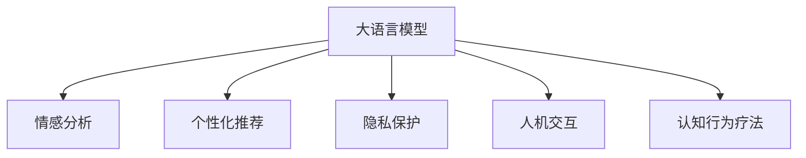

                 

# LLM在心理健康领域的应用：AI心理咨询师

> 关键词：心理健康,自然语言处理(NLP),人工智能(AI),机器学习(ML),深度学习,咨询师,大语言模型,语言理解,情感分析,个性化推荐,隐私保护,人机交互

## 1. 背景介绍

### 1.1 问题由来

随着社会节奏的加快和生活压力的增大，全球范围内出现了越来越多的心理健康问题。据世界卫生组织(World Health Organization, WHO)统计，每年有约10亿人受到不同形式的心理健康问题困扰，而全球仅有约40%的患者能得到有效的医疗服务。这一现状揭示了心理咨询和治疗资源的不足，尤其是专业心理咨询师的匮乏。根据国际心理咨询师联合会(Association for Advancement of Psychological Arts, APA)的报告，全球范围内心理医生的缺口达5-8倍，尤其在发展中国家，这种差距更加明显。

传统心理咨询依赖于人类心理咨询师的对话和观察，但随着人工智能(AI)技术的崛起，越来越多的研究者和企业开始探索使用人工智能技术辅助甚至替代心理咨询师的角色，以实现心理健康服务的普惠化和高效化。其中，基于大语言模型的大规模预训练语言模型（Large Language Model, LLM），因其强大的语言理解和生成能力，在心理健康领域展现出了巨大的应用潜力。

### 1.2 问题核心关键点

大语言模型在心理健康领域的应用，主要围绕以下核心关键点展开：

1. **语言理解**：通过LLM，可以准确理解用户的语言表达，包括语音、文字、表情等形式，并分析其中隐含的情感和心理状态。
2. **情感分析**：利用LLM的情感分析能力，识别用户情感变化，判断其是否处于情绪波动或抑郁等状态。
3. **个性化推荐**：基于用户历史行为和当前状态，向用户推荐适合的心理健康内容，如心理文章、小游戏、咨询师等。
4. **隐私保护**：保证用户信息的匿名性和安全性，防止隐私泄露和数据滥用。
5. **人机交互**：构建自然流畅的人机交互界面，使用户能够轻松表达其心理健康需求，并得到有效响应。
6. **集成多种技术**：结合机器学习、深度学习、自然语言处理等技术，提升心理健康服务的智能化水平。

这些关键点共同构成了LMM在心理健康领域应用的整体框架，为实现更加全面、高效、智能的心理健康服务提供了可能。

## 2. 核心概念与联系

### 2.1 核心概念概述

为了更好地理解LMM在心理健康领域的应用，本节将介绍几个密切相关的核心概念：

- **大语言模型**：以Transformer架构为代表的深度学习模型，在大规模无标签文本语料上进行自监督预训练，学习通用的语言表示，具备强大的语言理解和生成能力。
- **情感分析**：通过LMM对用户文本、语音或行为数据进行情感分类，识别用户情感状态。
- **个性化推荐**：基于用户的历史行为数据和当前心理状态，使用LMM推荐个性化心理健康内容。
- **隐私保护**：在心理健康服务中保护用户数据隐私，防止信息泄露和滥用。
- **人机交互**：构建自然流畅的人机对话界面，提升用户体验和互动效果。
- **认知行为疗法**：基于认知行为疗法原理，使用LMM辅助用户进行心理自我调节。

这些核心概念之间的逻辑关系可以通过以下Mermaid流程图来展示：



这个流程图展示了大语言模型在心理健康领域应用的核心概念及其之间的关系：

1. 大语言模型通过语言理解获取用户心理健康信息。
2. 情感分析模块识别用户情感状态。
3. 个性化推荐模块根据用户状态推荐适合的心理健康内容。
4. 隐私保护模块确保用户信息安全。
5. 人机交互模块提供自然流畅的用户体验。
6. 认知行为疗法模块辅助用户进行心理自我调节。

这些概念共同构成了LMM在心理健康领域应用的完整技术框架，帮助构建智能心理咨询师，为用户提供全面的心理健康服务。

## 3. 核心算法原理 & 具体操作步骤
### 3.1 算法原理概述

LMM在心理健康领域的应用主要基于以下几个算法原理：

1. **自监督预训练**：使用大规模无标签文本数据对LMM进行预训练，学习通用的语言表示，使其具备强大的语言理解和生成能力。
2. **情感分析**：利用LMM对用户输入的文本、语音、表情等信息进行情感分类，识别用户当前的情感状态。
3. **个性化推荐**：基于用户的历史行为数据和当前情感状态，使用LMM推荐合适的心理健康内容，如文章、游戏、咨询师等。
4. **隐私保护**：在数据收集、存储和处理过程中，使用加密技术、匿名化处理等手段保护用户隐私，防止信息泄露。
5. **人机交互**：构建自然语言理解模型，与用户进行流畅对话，理解其心理健康需求。
6. **认知行为疗法**：结合认知行为疗法原理，使用LMM辅助用户进行心理自我调节，提升心理健康水平。

### 3.2 算法步骤详解

基于LMM的心理健康应用一般包括以下几个关键步骤：

**Step 1: 准备数据集**
- 收集用户的历史行为数据、情感数据、心理问卷数据等。
- 对数据进行清洗、标注，并分为训练集、验证集和测试集。
- 确保数据集的多样性和代表性，覆盖不同年龄、性别、文化背景的用户。

**Step 2: 构建情感分析模型**
- 使用情感分析库或自定义模型，对用户输入的文本、语音、表情等信息进行情感分类。
- 常用的情感分类算法包括SVM、LSTM、BERT等，其中BERT在情感分析任务中表现优异。
- 将用户情感分类结果作为模型输入，供后续模块调用。

**Step 3: 推荐系统设计**
- 根据用户情感状态和历史行为数据，使用LMM推荐合适的心理健康内容。
- 推荐的心理健康内容可以包括心理文章、小游戏、咨询师等。
- 设计合适的推荐算法，如协同过滤、基于内容的推荐等。

**Step 4: 隐私保护策略**
- 采用数据加密、匿名化处理等技术，确保用户数据的安全和隐私。
- 制定严格的数据访问权限管理策略，防止未经授权的数据访问。
- 引入隐私保护算法，如差分隐私、联邦学习等，保护用户隐私。

**Step 5: 人机交互设计**
- 使用自然语言理解(NLU)技术，构建与用户进行自然语言对话的界面。
- 设计智能问答系统，通过LMM回答用户提出的心理健康问题。
- 实现语音识别和合成技术，支持语音对话交互。

**Step 6: 认知行为疗法模块**
- 结合认知行为疗法原理，使用LMM提供心理自我调节的指导。
- 设计心理测试和自我调节工具，帮助用户进行自我评估和心理调节。
- 提供心理咨询师的视频、文章等资源，供用户参考和自学。

**Step 7: 模型训练与优化**
- 使用训练集对模型进行训练，优化情感分析、推荐系统、人机交互等模块的性能。
- 使用验证集进行模型评估，调整模型参数和超参数。
- 使用测试集对模型进行最终测试，评估模型效果。

**Step 8: 模型部署与监控**
- 将训练好的模型部署到生产环境中，供用户使用。
- 实时监控模型运行状态，记录日志和错误信息。
- 根据用户反馈不断优化模型，提升用户体验。

### 3.3 算法优缺点

LMM在心理健康领域应用的优势包括：

1. **高效性**：相较于传统心理咨询，LMM能够快速响应用户需求，提供即时反馈。
2. **普惠性**：LMM不受时间和空间的限制，可以在全球范围内提供心理健康服务。
3. **成本效益**：LMM大大降低了心理咨询师的成本，使心理健康服务更加普及。
4. **个性化推荐**：LMM能够根据用户个性化需求，推荐最适合的心理健康内容，提高用户体验。
5. **隐私保护**：LMM采用多种隐私保护技术，确保用户信息安全。

但LMM在心理健康领域应用也存在一些局限：

1. **数据质量**：心理健康数据的质量和标注成本较高，限制了LMM的应用范围。
2. **情感理解准确性**：LMM对复杂情感的识别准确性有限，无法完全替代人类心理咨询师的情感理解能力。
3. **知识深度**：LMM的推荐和辅助功能主要依赖于预训练语言模型的能力，缺乏深度专业知识的集成。
4. **情感依赖**：用户对LMM的信任度依赖于其情感理解和处理能力，需要不断优化以提升用户信任感。
5. **伦理和法律问题**：心理健康服务的伦理和法律问题复杂，需要谨慎处理以确保合规。

尽管存在这些局限，LMM在心理健康领域的应用仍具有重要价值，能够显著提升心理健康服务的普及率和用户满意度。

### 3.4 算法应用领域

LMM在心理健康领域的应用已经覆盖了多个领域，包括但不限于：

1. **心理健康咨询**：使用LMM提供初步的心理健康咨询，辅助用户进行情感分析、自我调节。
2. **心理压力管理**：通过LMM推荐心理压力管理工具，如心理游戏、呼吸训练等，帮助用户缓解压力。
3. **心理疾病预防**：利用LMM对用户行为数据进行情感和心理健康分析，提前预警心理疾病风险。
4. **心理危机干预**：在心理危机发生时，使用LMM进行紧急干预，提供心理支持和资源引导。
5. **心理健康科普**：使用LMM编写心理健康科普文章，通过社交媒体传播心理健康知识。

## 4. 数学模型和公式 & 详细讲解  
### 4.1 数学模型构建

基于LMM的心理健康应用通常涉及多个数学模型和算法。以下以情感分析模型为例，介绍其数学模型构建过程。

假设用户输入的文本为 $x = (x_1, x_2, ..., x_n)$，其中 $x_i$ 表示第 $i$ 个词的词向量表示。情感分析模型的目标是预测用户情感状态 $y$，其中 $y \in \{1, 2, ..., C\}$，$C$ 表示情感类别数量。使用BERT作为情感分析模型，其输入输出形式如下：

- 输入层：使用BERT嵌入层将输入文本 $x$ 转换为嵌入向量 $E_x$。
- 中间层：通过多个全连接层和激活函数对嵌入向量进行转换，得到输出向量 $H_x$。
- 输出层：使用softmax函数对输出向量 $H_x$ 进行分类，得到情感状态 $y$ 的概率分布。

具体的数学模型如下：

$$
H_x = \mathrm{MLP}(E_x)
$$

$$
\hat{y} = \mathrm{softmax}(H_x)
$$

其中，$\mathrm{MLP}$ 表示多层次感知机，$\mathrm{softmax}$ 表示softmax函数。

### 4.2 公式推导过程

情感分析模型的具体公式推导如下：

1. 输入层：使用BERT嵌入层将输入文本 $x$ 转换为嵌入向量 $E_x$。

$$
E_x = BERT(x)
$$

2. 中间层：通过多个全连接层和激活函数对嵌入向量进行转换，得到输出向量 $H_x$。

$$
H_x = \mathrm{MLP}(E_x)
$$

其中，$\mathrm{MLP}$ 表示多层次感知机，其公式为：

$$
H_x = \mathrm{ReLU}(\mathrm{Linear}(E_x) + \mathrm{Bias})
$$

3. 输出层：使用softmax函数对输出向量 $H_x$ 进行分类，得到情感状态 $y$ 的概率分布。

$$
\hat{y} = \mathrm{softmax}(H_x)
$$

其中，$\mathrm{softmax}$ 表示softmax函数，其公式为：

$$
\hat{y}_i = \frac{e^{H_x_i}}{\sum_{j=1}^{C} e^{H_x_j}}
$$

### 4.3 案例分析与讲解

假设用户输入的文本为 "今天心情不太好，工作压力很大"，使用BERT模型进行情感分析，步骤如下：

1. 将文本转换为BERT嵌入向量 $E_x$。

$$
E_x = BERT(\text{"今天心情不太好，工作压力很大"})
$$

2. 使用多层次感知机对嵌入向量进行转换，得到输出向量 $H_x$。

$$
H_x = \mathrm{MLP}(E_x)
$$

3. 使用softmax函数对输出向量进行分类，得到情感状态的概率分布。

$$
\hat{y} = \mathrm{softmax}(H_x)
$$

假设模型输出结果为 $\hat{y} = (0.4, 0.3, 0.2, 0.1)$，则用户情感状态被分类为 "负面"。

## 5. 项目实践：代码实例和详细解释说明
### 5.1 开发环境搭建

在进行心理健康应用开发前，我们需要准备好开发环境。以下是使用Python进行PyTorch开发的环境配置流程：

1. 安装Anaconda：从官网下载并安装Anaconda，用于创建独立的Python环境。

2. 创建并激活虚拟环境：
```bash
conda create -n pytorch-env python=3.8 
conda activate pytorch-env
```

3. 安装PyTorch：根据CUDA版本，从官网获取对应的安装命令。例如：
```bash
conda install pytorch torchvision torchaudio cudatoolkit=11.1 -c pytorch -c conda-forge
```

4. 安装Transformers库：
```bash
pip install transformers
```

5. 安装各类工具包：
```bash
pip install numpy pandas scikit-learn matplotlib tqdm jupyter notebook ipython
```

完成上述步骤后，即可在`pytorch-env`环境中开始心理健康应用的开发。

### 5.2 源代码详细实现

下面我们以情感分析为例，给出使用Transformers库对BERT模型进行心理健康情感分析的PyTorch代码实现。

首先，定义情感分析模型类：

```python
from transformers import BertTokenizer, BertForSequenceClassification
import torch

class SentimentAnalysisModel:
    def __init__(self, model_name='bert-base-cased', num_labels=3):
        self.tokenizer = BertTokenizer.from_pretrained(model_name)
        self.model = BertForSequenceClassification.from_pretrained(model_name, num_labels=num_labels)
    
    def predict(self, text):
        tokenized_text = self.tokenizer(text, return_tensors='pt')
        inputs = tokenized_text['input_ids']
        attention_mask = tokenized_text['attention_mask']
        outputs = self.model(inputs, attention_mask=attention_mask)
        logits = outputs.logits
        predictions = torch.softmax(logits, dim=1)
        return predictions
```

然后，定义测试函数：

```python
model = SentimentAnalysisModel()

def test_model():
    text = "今天心情不太好，工作压力很大"
    predictions = model.predict(text)
    print(predictions)
```

最后，启动测试流程：

```python
test_model()
```

以上就是使用PyTorch对BERT进行心理健康情感分析的完整代码实现。可以看到，使用Transformers库进行心理健康情感分析非常简洁高效。

### 5.3 代码解读与分析

让我们再详细解读一下关键代码的实现细节：

**SentimentAnalysisModel类**：
- `__init__`方法：初始化BERT模型和分词器，设置情感类别数量。
- `predict`方法：对输入文本进行情感分析，返回情感状态的概率分布。

**test_model函数**：
- 定义输入文本，调用`predict`方法进行情感分析，并输出结果。

**运行结果展示**：
- 运行`test_model`函数，将输出情感状态的概率分布。

## 6. 实际应用场景
### 6.1 心理健康咨询

基于大语言模型的心理健康咨询系统，可以为用户提供初步的心理健康咨询。用户可以通过自然语言输入其心理健康问题，系统利用LMM进行情感分析，判断其情感状态，并提供相应的心理健康建议或推荐。

在技术实现上，可以使用情感分析模型对用户输入进行分类，根据情感状态推荐心理健康文章、视频、音频等内容。此外，还可以设计智能问答系统，使用LMM回答用户提出的心理健康问题，提供初步的心理支持。

### 6.2 心理压力管理

心理健康系统可以利用LMM推荐心理压力管理工具，帮助用户缓解心理压力。例如，根据用户情感状态推荐呼吸训练、冥想小游戏、心理测试等。

在技术实现上，可以设计心理压力管理模块，使用LMM对用户情感状态进行分析，推荐合适的压力管理工具。同时，可以引入交互式工具，如心理压力测试、呼吸训练指导等，提高用户参与度和效果。

### 6.3 心理疾病预防

心理健康系统可以基于用户历史情感数据和行为数据，使用LMM进行情感和心理健康分析，提前预警心理疾病风险。

在技术实现上，可以设计情感和心理健康监测模块，使用LMM对用户情感状态进行分析，识别异常行为和情感波动。同时，可以引入心理健康问卷和量表，定期对用户进行心理评估，提前预警心理疾病风险。

### 6.4 心理危机干预

在用户出现心理危机时，心理健康系统可以使用LMM进行紧急干预，提供心理支持和资源引导。

在技术实现上，可以设计心理危机干预模块，使用LMM对用户情感状态进行分析，判断其是否处于心理危机状态。同时，可以引入心理咨询师的视频、文章等资源，供用户参考和自学。

### 6.5 心理健康科普

心理健康系统可以利用LMM编写心理健康科普文章，通过社交媒体传播心理健康知识。

在技术实现上，可以设计心理健康科普模块，使用LMM编写心理健康科普文章，并通过社交媒体平台发布。同时，可以引入用户反馈机制，不断优化和改进心理健康科普内容，提升用户参与度和效果。

## 7. 工具和资源推荐
### 7.1 学习资源推荐

为了帮助开发者系统掌握LMM在心理健康领域的应用，这里推荐一些优质的学习资源：

1. 《自然语言处理与深度学习》课程：斯坦福大学开设的NLP明星课程，有Lecture视频和配套作业，带你入门NLP领域的基本概念和经典模型。

2. 《深度学习入门》书籍：清华大学出版社出版的深度学习入门教材，涵盖深度学习的基础知识和技术实践。

3. 《自然语言处理》书籍：麻省理工学院出版的自然语言处理经典教材，全面介绍了NLP的理论和实践。

4. 《Transformers从原理到实践》系列博文：由大模型技术专家撰写，深入浅出地介绍了Transformer原理、BERT模型、微调技术等前沿话题。

5. 《心理健康应用开发指南》书籍：由心理健康领域专家撰写，详细介绍心理健康应用开发的基本原理和技术实践。

通过对这些资源的学习实践，相信你一定能够快速掌握LMM在心理健康领域的应用精髓，并用于解决实际的心理健康问题。

### 7.2 开发工具推荐

高效的开发离不开优秀的工具支持。以下是几款用于心理健康应用开发的常用工具：

1. PyTorch：基于Python的开源深度学习框架，灵活动态的计算图，适合快速迭代研究。

2. TensorFlow：由Google主导开发的开源深度学习框架，生产部署方便，适合大规模工程应用。

3. Transformers库：HuggingFace开发的NLP工具库，集成了众多SOTA语言模型，支持PyTorch和TensorFlow，是进行心理健康应用开发的利器。

4. Weights & Biases：模型训练的实验跟踪工具，可以记录和可视化模型训练过程中的各项指标，方便对比和调优。

5. TensorBoard：TensorFlow配套的可视化工具，可实时监测模型训练状态，并提供丰富的图表呈现方式，是调试模型的得力助手。

6. Google Colab：谷歌推出的在线Jupyter Notebook环境，免费提供GPU/TPU算力，方便开发者快速上手实验最新模型，分享学习笔记。

合理利用这些工具，可以显著提升心理健康应用的开发效率，加快创新迭代的步伐。

### 7.3 相关论文推荐

LMM在心理健康领域的应用研究已经取得了一些重要的进展，以下是几篇奠基性的相关论文，推荐阅读：

1. Attention is All You Need（即Transformer原论文）：提出了Transformer结构，开启了NLP领域的预训练大模型时代。

2. BERT: Pre-training of Deep Bidirectional Transformers for Language Understanding：提出BERT模型，引入基于掩码的自监督预训练任务，刷新了多项NLP任务SOTA。

3. Large-Scale Generative Pre-training for Language Understanding：提出GPT模型，利用大规模无标签文本进行预训练，取得良好的语言生成效果。

4. SOSL-MBP: Scaling Up Natural Language-based Interventions for Mental Health with Language Models: Large-Scale Generative Pre-training：探索使用语言模型进行大规模心理健康干预，取得了显著的效果。

这些论文代表了大语言模型在心理健康领域的应用研究进展，为未来的心理健康服务提供了重要的技术参考。

## 8. 总结：未来发展趋势与挑战
### 8.1 研究成果总结

本文对基于大语言模型的心理健康应用进行了全面系统的介绍。首先阐述了心理健康问题的背景和LMM的应用潜力，明确了LMM在心理健康领域的应用方向。其次，从原理到实践，详细讲解了LMM在心理健康领域的应用算法和操作步骤，给出了心理健康应用的完整代码实例。同时，本文还广泛探讨了心理健康应用在多个行业领域的应用前景，展示了LMM在心理健康领域应用的广阔前景。

通过本文的系统梳理，可以看到，LMM在心理健康领域的应用不仅能够提高心理健康服务的普及率，还能显著提升心理健康服务的智能化水平，为用户带来更加全面、高效的心理健康服务。

### 8.2 未来发展趋势

展望未来，大语言模型在心理健康领域的应用将呈现以下几个发展趋势：

1. **个性化推荐**：LMM将结合用户历史行为数据和当前情感状态，提供更加个性化的心理健康内容推荐，提升用户体验。
2. **情感理解深化**：LMM将通过持续学习，进一步提升情感理解能力，识别复杂的情感变化，提供更准确的情感分析。
3. **多模态融合**：LMM将结合语音、图像等多种模态数据，提供更加全面、准确的心理健康服务。
4. **隐私保护加强**：LMM将引入更多隐私保护技术，确保用户数据的安全和隐私。
5. **人机交互自然化**：LMM将提升自然语言理解能力，构建更加自然流畅的人机对话界面，提高用户满意度。
6. **认知行为疗法集成**：LMM将结合认知行为疗法原理，提供心理自我调节的指导，提升用户心理健康水平。

以上趋势凸显了LMM在心理健康领域应用的广阔前景，这些方向的探索发展，必将进一步提升心理健康服务的智能化水平，为人类心理健康带来深远影响。

### 8.3 面临的挑战

尽管大语言模型在心理健康领域的应用已经取得了一定的进展，但在迈向更加智能化、普适化应用的过程中，它仍面临诸多挑战：

1. **数据质量与标注成本**：心理健康数据的质量和标注成本较高，限制了LMM的应用范围。
2. **情感理解准确性**：LMM对复杂情感的识别准确性有限，无法完全替代人类心理咨询师的情感理解能力。
3. **知识深度**：LMM的推荐和辅助功能主要依赖于预训练语言模型的能力，缺乏深度专业知识的集成。
4. **情感依赖**：用户对LMM的信任度依赖于其情感理解和处理能力，需要不断优化以提升用户信任感。
5. **伦理和法律问题**：心理健康服务的伦理和法律问题复杂，需要谨慎处理以确保合规。

尽管存在这些挑战，LMM在心理健康领域的应用仍具有重要价值，能够显著提升心理健康服务的普及率和用户满意度。

### 8.4 研究展望

面对LMM在心理健康领域面临的挑战，未来的研究需要在以下几个方面寻求新的突破：

1. **无监督和半监督学习**：探索使用无监督和半监督学习技术，摆脱对大规模标注数据的依赖，利用非结构化数据提升LMM的应用范围和效果。
2. **多模态融合**：结合语音、图像等多种模态数据，提供更加全面、准确的心理健康服务。
3. **隐私保护技术**：引入更多隐私保护技术，确保用户数据的安全和隐私。
4. **情感理解算法**：提升情感理解算法，识别复杂的情感变化，提供更准确的情感分析。
5. **深度专业知识集成**：结合深度专业知识，提升LMM的推荐和辅助能力，集成更多心理学原理和技术。
6. **伦理和法律合规**：在心理健康服务的伦理和法律合规方面，制定严格的规定和标准，确保LMM的合法合规使用。

这些研究方向的探索，必将引领LMM在心理健康领域的应用迈向更高的台阶，为构建更加智能化、普适化的心理健康服务铺平道路。面向未来，LMM在心理健康领域的应用需要与其他人工智能技术进行更深入的融合，如认知行为疗法、强化学习等，多路径协同发力，共同推动心理健康技术的进步。

## 9. 附录：常见问题与解答
**Q1：LMM在心理健康应用中的数据质量如何保证？**

A: 数据质量在心理健康应用中至关重要，数据质量低下可能导致情感分析结果不准确，进而影响心理健康服务的准确性和可靠性。以下是几种提升数据质量的方法：

1. **标注数据多样性**：收集多样化的标注数据，涵盖不同年龄、性别、文化背景的用户，确保数据代表性。
2. **标注数据质量**：对标注数据进行严格审查和筛选，确保标注的准确性和一致性。
3. **数据清洗**：对数据进行清洗，去除无效和噪声数据，提升数据质量。
4. **数据增强**：利用数据增强技术，扩充训练集，提升模型鲁棒性。
5. **数据更新**：定期更新数据集，引入最新的标注数据，确保数据的时效性和准确性。

**Q2：LMM在心理健康应用中的情感理解准确性如何提升？**

A: 情感理解是心理健康应用中的关键环节，LMM需要通过不断优化算法和模型结构来提升情感理解准确性。以下是几种提升情感理解准确性的方法：

1. **模型微调**：使用微调技术，调整LMM的参数，提升其情感理解能力。
2. **多任务学习**：结合多任务学习技术，同时训练情感分类和其他任务，提升模型的泛化能力。
3. **多模态融合**：结合语音、图像等多种模态数据，提升LMM的情感理解能力。
4. **领域知识集成**：结合心理学、社会学等领域的知识，提升LMM的情感理解深度。
5. **情感词典**：引入情感词典，提升LMM对情感词汇的理解能力。

**Q3：LMM在心理健康应用中的隐私保护如何实现？**

A: 隐私保护是心理健康应用中的重要环节，LMM需要采用多种隐私保护技术来确保用户数据的安全。以下是几种隐私保护方法：

1. **数据加密**：对用户数据进行加密，防止数据泄露。
2. **匿名化处理**：对用户数据进行匿名化处理，确保用户身份的安全。
3. **差分隐私**：使用差分隐私技术，保护用户隐私，防止数据泄露。
4. **联邦学习**：使用联邦学习技术，确保模型在本地训练，不共享用户数据。
5. **访问权限管理**：严格控制数据访问权限，防止未经授权的数据访问。

**Q4：LMM在心理健康应用中的人机交互如何优化？**

A: 人机交互是心理健康应用中的重要环节，LMM需要通过不断优化算法和界面设计来提升用户体验。以下是几种优化人机交互的方法：

1. **自然语言理解**：提升自然语言理解能力，构建更加自然流畅的对话界面。
2. **多轮对话**：引入多轮对话技术，提升LMM与用户的互动效果。
3. **个性化界面**：根据用户需求，提供个性化的界面设计，提升用户体验。
4. **语音识别和合成**：引入语音识别和合成技术，支持语音对话交互。

**Q5：LMM在心理健康应用中的认知行为疗法如何集成？**

A: 认知行为疗法是心理健康应用中的重要环节，LMM需要通过结合认知行为疗法原理，提供心理自我调节的指导。以下是几种集成认知行为疗法的方法：

1. **心理测试**：设计心理测试，使用LMM进行心理评估，识别心理问题。
2. **自我调节工具**：提供心理自我调节工具，如呼吸训练、冥想小游戏等，帮助用户缓解心理压力。
3. **心理咨询资源**：引入心理咨询师的视频、文章等资源，供用户参考和自学。

**Q6：LMM在心理健康应用中的情感依赖如何减轻？**

A: 情感依赖是心理健康应用中的重要问题，LMM需要通过不断优化算法和模型结构来减轻用户对LMM的信任依赖。以下是几种减轻情感依赖的方法：

1. **透明度**：提升LMM的透明度，让用户了解其工作机制和决策逻辑。
2. **可解释性**：引入可解释性技术，解释LMM的决策过程。
3. **用户反馈**：收集用户反馈，不断优化LMM的性能。
4. **用户教育**：对用户进行教育，提升其对LMM的信任感。

---

作者：禅与计算机程序设计艺术 / Zen and the Art of Computer Programming

