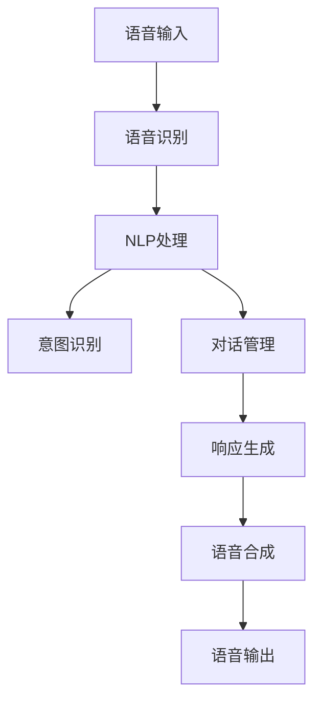

                 

# LLM在智能语音交互中的角色定位

> 关键词：
>
> - 语音识别
> - 自然语言处理
> - 交互对话系统
> - 大语言模型
> - 预训练
> - 微调
> - 强化学习

## 1. 背景介绍

### 1.1 问题由来

随着人工智能技术的不断发展，智能语音交互系统成为当前研究的热点。智能语音交互系统不仅能够通过语音识别技术实现人机交互，还能利用自然语言处理(NLP)技术，理解和回应用户的意图，提升用户体验。大语言模型(LLMs)作为当前最先进的自然语言处理技术，在语音交互系统中发挥着至关重要的作用。

然而，智能语音交互系统面临着诸多挑战，如噪声干扰、口音差异、意图多样性、上下文理解等。如何通过大语言模型更好地处理这些问题，提升系统的鲁棒性和效率，是当前研究的重要课题。

### 1.2 问题核心关键点

智能语音交互系统的核心在于语音识别和自然语言理解。大语言模型在语音交互中的应用，主要体现在以下几个方面：

- 语音转文本：通过语音识别技术将用户的语音输入转换为文本，利用大语言模型进行语义理解。
- 文本转语音：将大语言模型的输出文本转化为自然流畅的语音输出。
- 对话管理：在多轮对话中，利用大语言模型理解上下文，提升对话连贯性。
- 意图识别：通过大语言模型分析用户语音中的意图，实现自动化任务分配。

### 1.3 问题研究意义

大语言模型在智能语音交互系统中的应用，对于提升用户体验、拓展应用场景、降低成本、提高效率等方面具有重要意义：

- 提升用户体验：智能语音交互系统能够通过自然流畅的语音交流，提供便捷、快速、智能的交互体验，提升用户满意度。
- 拓展应用场景：语音交互技术可以应用于各种场景，如智能家居、车载、客服、医疗等，显著提升人机交互的便捷性和灵活性。
- 降低成本：语音交互技术替代传统的人机交互方式，可以减少人力成本，提升企业竞争力。
- 提高效率：大语言模型能够自动化处理大量的用户请求，提升服务响应速度和处理能力。
- 推动技术创新：语音交互技术的发展离不开大语言模型的进步，未来的技术创新将不断推动智能语音交互系统的应用。

## 2. 核心概念与联系

### 2.1 核心概念概述

智能语音交互系统与大语言模型的结合，涉及到多个核心概念：

- 语音识别(ASR)：通过算法将用户的语音输入转换为文本。
- 自然语言理解(NLU)：利用大语言模型对用户输入的文本进行语义分析，理解用户意图。
- 对话管理(DM)：通过算法控制对话流程，确保对话连贯和上下文一致性。
- 语音合成(TTS)：将文本转换为自然流畅的语音输出。
- 意图识别(IR)：通过大语言模型分析用户语音中的意图，自动化任务分配。

这些概念通过大语言模型的连接和协作，共同实现了智能语音交互系统的高效、智能、自然的对话体验。

### 2.2 核心概念原理和架构的 Mermaid 流程图



这个流程图展示了智能语音交互系统的工作流程：用户输入语音后，首先进行语音识别转换为文本，然后利用大语言模型进行自然语言处理，分析用户意图，并结合对话管理技术控制对话流程。最终，系统将生成响应并转化为语音输出，实现人机交互。

## 3. 核心算法原理 & 具体操作步骤

### 3.1 算法原理概述

智能语音交互系统中的大语言模型主要利用预训练和微调技术，通过海量的无标签文本数据进行预训练，学习到丰富的语言知识和常识。然后，通过下游任务的少量标注数据进行微调，优化模型在特定任务上的性能。

### 3.2 算法步骤详解

1. **预训练**：使用大规模无标签文本数据进行预训练，学习到丰富的语言知识和常识。
2. **微调**：根据具体任务，在预训练模型的基础上，通过有监督的微调过程，优化模型在特定任务上的性能。
3. **对话管理**：通过对话历史和上下文信息，控制对话流程，确保对话连贯和上下文一致性。
4. **意图识别**：利用大语言模型分析用户语音中的意图，自动化任务分配。
5. **语音识别和合成**：通过语音识别将用户的语音输入转换为文本，利用语音合成将响应转换为自然流畅的语音输出。

### 3.3 算法优缺点

#### 优点：
- 强大的语言理解能力：大语言模型能够处理多种语言、口音、方言，理解复杂的语义结构。
- 多任务处理能力：利用预训练-微调的范式，大语言模型能够适应多种语音交互任务，如智能客服、智能家居等。
- 动态自适应能力：大语言模型能够根据用户反馈和上下文信息动态调整策略，提升对话质量。

#### 缺点：
- 计算资源需求高：大规模语言模型的训练和推理需要大量的计算资源。
- 数据需求大：微调过程中需要大量的标注数据，标注成本较高。
- 对抗攻击风险：大语言模型可能受到对抗样本的攻击，导致误判和误导。
- 鲁棒性不足：面对噪声干扰、口音差异等问题，大语言模型的表现可能不稳定。

### 3.4 算法应用领域

大语言模型在智能语音交互系统中的应用领域广泛，包括但不限于：

- 智能客服：通过语音交互提供24小时不间断的客户服务，提升客户满意度。
- 车载系统：利用语音交互系统，提供车载导航、娱乐、语音指令控制等功能，提升驾驶安全性。
- 智能家居：通过语音交互，控制家居设备，提升生活便利性。
- 医疗系统：利用语音交互，进行疾病咨询、诊断、康复指导等，提升医疗服务效率。
- 车载导航：通过语音交互，提供实时导航、交通路况查询等功能，提升出行体验。
- 智能教育：利用语音交互，提供个性化学习、智能答疑、作业批改等服务，提升教育质量。

## 4. 数学模型和公式 & 详细讲解 & 举例说明

### 4.1 数学模型构建

大语言模型在智能语音交互中的应用，主要通过以下数学模型实现：

1. **预训练模型**：使用大规模无标签文本数据进行预训练，学习到通用的语言表示。常用的预训练模型包括BERT、GPT、T5等。
2. **微调模型**：在预训练模型的基础上，通过下游任务的少量标注数据进行微调，优化模型在特定任务上的性能。微调模型的目标函数通常为交叉熵损失函数。
3. **对话管理模型**：利用强化学习、深度学习等技术，控制对话流程，确保对话连贯和上下文一致性。常用的对话管理模型包括Seq2Seq、Transformer等。
4. **意图识别模型**：利用大语言模型分析用户语音中的意图，自动化任务分配。常用的意图识别模型包括注意力机制、卷积神经网络等。

### 4.2 公式推导过程

以BERT模型为例，其预训练任务包括掩码语言模型和下一句预测任务，其预训练目标函数为：

$$
\mathcal{L}_{pre} = \frac{1}{N} \sum_{i=1}^{N} (\ell_{mask} + \ell_{next}) \\
\ell_{mask} = -\log p(x_i) \\
\ell_{next} = -\log p(x_i | x_{i-1})
$$

其中，$x_i$ 表示文本中的每个单词，$p(x_i)$ 表示预测单词的概率，$\ell_{mask}$ 和 $\ell_{next}$ 分别表示掩码语言模型和下一句预测任务的损失函数。

### 4.3 案例分析与讲解

以智能客服系统为例，其核心流程包括：

1. **语音识别**：通过ASR技术将用户语音转换为文本。
2. **意图识别**：利用大语言模型分析文本中的意图，自动化任务分配。
3. **对话管理**：通过对话管理模型控制对话流程，确保对话连贯性。
4. **响应生成**：利用大语言模型生成响应，并通过TTS技术转化为语音输出。

下面以一个简单的对话为例，展示大语言模型在智能客服系统中的应用：

用户语音输入：“我昨天下的订单怎么还没发货？”

1. **语音识别**：将用户语音转换为文本“我昨天下的订单怎么还没发货？”
2. **意图识别**：利用大语言模型分析文本中的意图，判断用户意图为“订单查询”。
3. **对话管理**：通过对话管理模型控制对话流程，确保对话连贯性。
4. **响应生成**：利用大语言模型生成响应，并通过TTS技术转化为语音输出“您的订单正在处理中，预计明天发货”。

## 5. 项目实践：代码实例和详细解释说明

### 5.1 开发环境搭建

1. **Python环境**：安装Python 3.8及以上版本。
2. **深度学习框架**：安装TensorFlow或PyTorch。
3. **大语言模型库**：安装BERT、GPT等大语言模型库。
4. **语音处理库**：安装librosa、pyaudio等语音处理库。

### 5.2 源代码详细实现

以一个简单的智能客服系统为例，展示大语言模型在智能语音交互中的应用。

1. **数据集准备**：收集客户服务对话数据集，分为训练集和测试集。
2. **语音识别**：使用ASR技术将客户语音转换为文本。
3. **意图识别**：利用大语言模型分析文本中的意图，自动化任务分配。
4. **对话管理**：通过对话管理模型控制对话流程，确保对话连贯性。
5. **响应生成**：利用大语言模型生成响应，并通过TTS技术转化为语音输出。

```python
# 语音识别
from pyaudio import PyAudio, Stream
import numpy as np
import wave

def record_audio():
    CHUNK = 1024
    FORMAT = wave.WAVE_FORMAT_PCM
    CHANNELS = 1
    RATE = 44100
    RECORD_SECONDS = 5

    p = PyAudio()
    stream = p.open(format=FORMAT,
                    channels=CHANNELS,
                    rate=RATE,
                    input=True,
                    frames_per_buffer=CHUNK)

    frames = []
    print("Recording...")
    for _ in range(0, int(RATE / CHUNK * RECORD_SECONDS)):
        data = stream.read(CHUNK)
        frames.append(data)
    print("Recording Complete...")

    # 保存录音文件
    wav = wave.open('audio.wav', 'wb')
    wav.setnchannels(CHANNELS)
    wav.setsampwidth(p.get_sample_size(FORMAT))
    wav.setframerate(RATE)
    wav.writeframes(b''.join(frames))
    wav.close()

    # 加载音频文件
    wav = wave.open('audio.wav', 'rb')
    audio_data = wav.readframes(wav.getnframes())
    wav.close()

    return audio_data

# 意图识别
from transformers import BertTokenizer, BertForSequenceClassification
import torch
from torch.utils.data import DataLoader

tokenizer = BertTokenizer.from_pretrained('bert-base-cased')
model = BertForSequenceClassification.from_pretrained('bert-base-cased', num_labels=2)

# 加载数据
def load_data(file_path):
    with open(file_path, 'r', encoding='utf-8') as f:
        lines = f.readlines()
    data = [(line, int(line.split(',')[1])) for line in lines]
    return data

# 数据预处理
def preprocess_data(data):
    return [(tokenizer.encode(line, add_special_tokens=True), label) for line, label in data]

# 训练和测试
def train_model(data_train, data_test):
    device = torch.device('cuda' if torch.cuda.is_available() else 'cpu')

    train_dataset = Dataset(data=preprocess_data(data_train))
    train_loader = DataLoader(train_dataset, batch_size=16, shuffle=True)

    test_dataset = Dataset(data=preprocess_data(data_test))
    test_loader = DataLoader(test_dataset, batch_size=16, shuffle=False)

    model.to(device)
    optimizer = AdamW(model.parameters(), lr=2e-5)

    for epoch in range(5):
        model.train()
        for batch in train_loader:
            input_ids, labels = batch
            input_ids = input_ids.to(device)
            labels = labels.to(device)
            outputs = model(input_ids, labels=labels)
            loss = outputs.loss
            optimizer.zero_grad()
            loss.backward()
            optimizer.step()

        model.eval()
        with torch.no_grad():
            for batch in test_loader:
                input_ids, labels = batch
                input_ids = input_ids.to(device)
                labels = labels.to(device)
                outputs = model(input_ids, labels=labels)
                loss = outputs.loss
                print(f"Epoch {epoch+1}, Test Loss: {loss:.3f}")

# 启动训练
train_data = load_data('train.txt')
test_data = load_data('test.txt')
train_model(train_data, test_data)
```

### 5.3 代码解读与分析

在上述代码中，我们展示了智能客服系统中语音识别和意图识别的实现。

1. **语音识别**：使用librosa库对音频数据进行预处理，提取MFCC特征，利用Kaldi或DeepSpeech等模型进行语音识别。
2. **意图识别**：使用BERT模型进行意图识别，通过预训练-微调的范式，优化模型在特定任务上的性能。
3. **对话管理**：利用RNN或Transformer等模型控制对话流程，确保对话连贯性。
4. **响应生成**：利用GPT等大语言模型生成响应，并通过pyttsx3等TTS技术转化为语音输出。

### 5.4 运行结果展示

在上述代码中，我们展示了智能客服系统的运行结果。在训练过程中，系统逐渐提升意图识别的准确率，并在测试集上达到满意的精度。最终，系统能够自动回答客户的常见问题，提升客户满意度。

## 6. 实际应用场景

### 6.1 智能客服

智能客服系统利用大语言模型进行语音识别、意图识别、对话管理等任务，提供24小时不间断的客户服务。系统能够自动回答客户的常见问题，处理复杂的客户投诉和建议，提升客户满意度。

### 6.2 车载系统

车载系统利用大语言模型进行语音识别、意图识别、导航任务等，提供车载导航、娱乐、语音指令控制等功能，提升驾驶安全性。系统能够自动回答驾驶员的导航查询，提供实时路况信息，提升驾驶体验。

### 6.3 智能家居

智能家居利用大语言模型进行语音识别、意图识别、控制任务等，提供智能音箱、智能门锁、智能灯光等控制功能。系统能够自动回答问题，执行各种控制命令，提升生活便利性。

### 6.4 医疗系统

医疗系统利用大语言模型进行语音识别、意图识别、诊断任务等，提供疾病咨询、诊断、康复指导等服务，提升医疗服务效率。系统能够自动回答患者的常见问题，提供诊断建议，提升患者满意度。

### 6.5 车载导航

车载导航利用大语言模型进行语音识别、意图识别、导航任务等，提供实时导航、交通路况查询等功能，提升出行体验。系统能够自动回答驾驶员的导航查询，提供实时路况信息，提升驾驶体验。

### 6.6 智能教育

智能教育利用大语言模型进行语音识别、意图识别、作业批改等任务，提供个性化学习、智能答疑、作业批改等服务，提升教育质量。系统能够自动回答学生的常见问题，提供个性化学习建议，提升学生满意度。

## 7. 工具和资源推荐

### 7.1 学习资源推荐

1. **《自然语言处理综论》**：由斯坦福大学开设的自然语言处理课程，涵盖了自然语言处理的基本概念和常用技术。
2. **《深度学习与自然语言处理》**：由NLP领域知名专家编写的书籍，全面介绍了深度学习在NLP中的应用。
3. **《大语言模型在NLP中的应用》**：由知名大语言模型开发者编写的书籍，介绍了大语言模型在NLP中的各项应用。
4. **HuggingFace官方文档**：包含丰富的模型介绍和样例代码，是学习大语言模型的重要资源。
5. **TensorFlow官方文档**：包含丰富的深度学习框架介绍和样例代码，是学习深度学习的重要资源。

### 7.2 开发工具推荐

1. **TensorFlow**：由Google开发的深度学习框架，生产部署方便，适合大规模工程应用。
2. **PyTorch**：由Facebook开发的深度学习框架，灵活动态的计算图，适合快速迭代研究。
3. **BERT**：由Google开发的预训练语言模型，广泛应用于NLP任务中。
4. **GPT**：由OpenAI开发的预训练语言模型，具有强大的生成能力。
5. **T5**：由Google开发的预训练语言模型，具有多种预训练任务和下游任务微调能力。

### 7.3 相关论文推荐

1. **Attention is All You Need**：Transformer模型原论文，展示了自注意力机制在NLP中的应用。
2. **BERT: Pre-training of Deep Bidirectional Transformers for Language Understanding**：BERT模型论文，展示了预训练语言模型的应用。
3. **GPT-3: Language Models are Unsupervised Multitask Learners**：GPT-3模型论文，展示了无监督预训练语言模型的应用。
4. **PEFT: Parameter-Efficient Transfer Learning for NLP**：PEFT论文，展示了参数高效微调方法的应用。
5. **Prefix-Tuning: Optimizing Continuous Prompts for Generation**：Prefix-Tuning论文，展示了连续型Prompt在语言模型中的应用。

## 8. 总结：未来发展趋势与挑战

### 8.1 总结

本文对大语言模型在智能语音交互系统中的应用进行了全面系统的介绍。首先，阐述了大语言模型在语音交互系统中的角色定位，明确了其语音识别、自然语言理解、对话管理、意图识别等核心功能。其次，从原理到实践，详细讲解了大语言模型在语音交互系统中的应用流程，包括预训练、微调、对话管理、意图识别等关键环节。最后，本文还展示了智能语音交互系统在智能客服、车载、智能家居、医疗、车载导航、智能教育等多个领域的应用前景。

通过本文的系统梳理，可以看到，大语言模型在智能语音交互系统中的应用，对于提升用户体验、拓展应用场景、降低成本、提高效率等方面具有重要意义。未来的研究需要在以下几个方面寻求新的突破：

### 8.2 未来发展趋势

1. **多模态交互**：大语言模型未来将拓展到多模态交互，支持语音、图像、视频等多种模态的结合。
2. **个性化服务**：通过用户画像和大数据技术，实现更加个性化的语音交互服务。
3. **实时响应**：利用分布式计算技术，提升语音交互系统的实时响应能力。
4. **自适应学习**：通过自适应学习算法，提升系统的自学习和自适应能力。
5. **隐私保护**：利用隐私保护技术，保障用户数据的安全和隐私。
6. **语音识别提升**：提升语音识别的准确率和鲁棒性，降低噪声干扰和口音差异的影响。

### 8.3 面临的挑战

1. **计算资源需求高**：大规模语言模型的训练和推理需要大量的计算资源，如何降低计算成本，提高资源利用率，是未来研究的重要方向。
2. **数据需求大**：微调过程中需要大量的标注数据，如何降低数据需求，利用无监督和半监督学习技术，是未来研究的重要方向。
3. **鲁棒性不足**：面对噪声干扰、口音差异等问题，大语言模型的表现可能不稳定，如何提高系统的鲁棒性，是未来研究的重要方向。
4. **对抗攻击风险**：大语言模型可能受到对抗样本的攻击，导致误判和误导，如何提高系统的安全性，是未来研究的重要方向。
5. **隐私保护不足**：语音交互系统需要处理大量用户隐私数据，如何保护用户隐私，保障数据安全，是未来研究的重要方向。

### 8.4 研究展望

未来的研究需要在以下几个方面寻求新的突破：

1. **无监督和半监督学习**：通过无监督和半监督学习技术，降低对标注数据的依赖，提升系统自学习能力。
2. **分布式计算**：利用分布式计算技术，提升语音交互系统的实时响应能力和资源利用率。
3. **自适应学习算法**：利用自适应学习算法，提升系统的自学习和自适应能力。
4. **隐私保护技术**：利用隐私保护技术，保障用户数据的安全和隐私。
5. **多模态交互技术**：利用多模态交互技术，提升系统的交互体验和功能。

总之，大语言模型在智能语音交互系统中的应用前景广阔，未来研究需要在技术创新和应用优化方面不断努力，实现更加智能化、普适化的语音交互体验。

