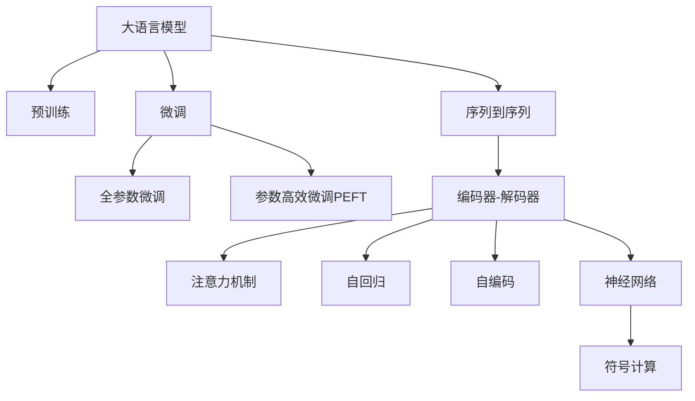

                 

# LLM在机器翻译领域的突破与挑战

> 关键词：大语言模型(Large Language Model, LLM),机器翻译,神经机器翻译(Neural Machine Translation, NMT),序列到序列(Seq2Seq),注意力机制(Attention),Transformer,自回归(AR),自编码(CE),符号计算,神经网络

## 1. 背景介绍

### 1.1 问题由来

机器翻译作为自然语言处理领域的重要研究方向，一直受到国内外研究者的关注。随着深度学习技术的发展，特别是神经网络在机器翻译中的应用，机器翻译的性能得到了显著提升。传统的统计机器翻译（Statistical Machine Translation, SMT）方法逐渐被基于神经网络的机器翻译（Neural Machine Translation, NMT）方法取代。NMT通过构建编码器-解码器（Encoder-Decoder）模型，将源语言序列映射到目标语言序列，得到了广泛应用。然而，NMT也面临诸多挑战，包括模型容量限制、训练数据需求高、计算成本大等问题。

近年来，大语言模型（Large Language Model, LLM）的兴起为机器翻译提供了新的契机。LLM通过预训练和微调，在各种NLP任务上取得了令人瞩目的成果。基于LLM的机器翻译方法，通过融合语言模型和序列到序列的框架，大幅提升了翻译质量，并在多个数据集上刷新了最先进的性能。同时，LLM的出现也为解决机器翻译的诸多挑战提供了新的思路。

### 1.2 问题核心关键点

本节将探讨大语言模型在机器翻译领域的应用，以及目前面临的挑战和未来可能的发展方向。

## 2. 核心概念与联系

### 2.1 核心概念概述

为更好地理解基于大语言模型的机器翻译方法，本节将介绍几个密切相关的核心概念：

- 大语言模型(Large Language Model, LLM)：指通过大规模无标签文本数据预训练得到的通用语言模型。其具备强大的语言理解和生成能力，能够在大规模文本数据上学习语言的通用表示。
- 机器翻译(Machine Translation, MT)：将一种语言的文本自动翻译成另一种语言的文本。目前主要有基于统计的机器翻译（SMT）和基于神经网络的机器翻译（NMT）两种方法。
- 神经机器翻译(Neural Machine Translation, NMT)：指通过神经网络模型进行机器翻译，包括编码器-解码器（Encoder-Decoder）和序列到序列(Seq2Seq)架构。
- 序列到序列(Seq2Seq)：一种基于神经网络的技术，用于将一个序列映射到另一个序列，广泛应用于机器翻译、文本摘要、语音识别等领域。
- 注意力机制(Attention)：在序列到序列模型中，用于捕捉输入和输出序列之间的关联性，提升翻译质量。
- 自回归(AR)：在序列到序列模型中，通过上一时刻的输出预测下一个时刻的输入。
- 自编码(CE)：在序列到序列模型中，通过编码器对输入序列进行编码，然后通过解码器对编码结果进行解码，生成输出序列。
- 符号计算(Symbolic Computation)：指通过符号表征和操作，进行逻辑推理和计算。
- 神经网络(Neural Network)：通过多层次的神经元之间的连接进行信息处理和计算，在图像识别、自然语言处理等领域有着广泛应用。

这些核心概念之间的逻辑关系可以通过以下Mermaid流程图来展示：



这个流程图展示了大语言模型在机器翻译中的应用，从预训练到微调，再到Seq2Seq模型和注意力机制的应用，最终通过神经网络和符号计算实现翻译任务。

## 3. 核心算法原理 & 具体操作步骤

### 3.1 算法原理概述

基于大语言模型的机器翻译，通过将预训练语言模型作为通用翻译模型，通过微调优化特定的机器翻译任务，提升翻译质量。其核心思想是：使用大语言模型作为语言表示模型，通过在大量机器翻译数据上进行微调，使得模型能够自动学习语言对之间的映射关系，生成高质量的翻译结果。

形式化地，假设预训练语言模型为 $M_{\theta}$，其中 $\theta$ 为预训练得到的模型参数。给定机器翻译数据集 $D=\{(x_i,y_i)\}_{i=1}^N$，其中 $x_i$ 为源语言文本，$y_i$ 为目标语言文本，微调的目标是找到新的模型参数 $\hat{\theta}$，使得：

$$
\hat{\theta}=\mathop{\arg\min}_{\theta} \mathcal{L}(M_{\theta},D)
$$

其中 $\mathcal{L}$ 为针对机器翻译任务的损失函数，用于衡量模型预测输出与真实标签之间的差异。常见的损失函数包括交叉熵损失、BLEU分数等。

通过梯度下降等优化算法，微调过程不断更新模型参数 $\theta$，最小化损失函数 $\mathcal{L}$，使得模型输出逼近真实标签。由于 $\theta$ 已经通过预训练获得了较好的初始化，因此即便在标注数据量较少的情况下，也能较快收敛到理想的模型参数 $\hat{\theta}$。

### 3.2 算法步骤详解

基于大语言模型的机器翻译一般包括以下几个关键步骤：

**Step 1: 准备预训练模型和数据集**
- 选择合适的预训练语言模型 $M_{\theta}$ 作为初始化参数，如 GPT、BERT、T5 等。
- 准备机器翻译数据集 $D$，划分为训练集、验证集和测试集。一般要求训练数据与预训练数据的分布不要差异过大。

**Step 2: 添加任务适配层**
- 根据机器翻译任务类型，在预训练模型顶层设计合适的输出层和损失函数。
- 对于常见的翻译任务，通常在顶层添加线性分类器和交叉熵损失函数。
- 对于特定领域翻译任务，还可以考虑引入领域特定词汇表、领域特定矩阵等，进一步提升模型性能。

**Step 3: 设置微调超参数**
- 选择合适的优化算法及其参数，如 Adam、SGD 等，设置学习率、批大小、迭代轮数等。
- 设置正则化技术及强度，包括权重衰减、Dropout、Early Stopping 等。
- 确定冻结预训练参数的策略，如仅微调顶层，或全部参数都参与微调。

**Step 4: 执行梯度训练**
- 将训练集数据分批次输入模型，前向传播计算损失函数。
- 反向传播计算参数梯度，根据设定的优化算法和学习率更新模型参数。
- 周期性在验证集上评估模型性能，根据性能指标决定是否触发 Early Stopping。
- 重复上述步骤直到满足预设的迭代轮数或 Early Stopping 条件。

**Step 5: 测试和部署**
- 在测试集上评估微调后模型 $M_{\hat{\theta}}$ 的性能，对比微调前后的BLEU分数提升。
- 使用微调后的模型对新样本进行推理预测，集成到实际的应用系统中。
- 持续收集新的数据，定期重新微调模型，以适应数据分布的变化。

以上是基于大语言模型的机器翻译的一般流程。在实际应用中，还需要针对具体任务的特点，对微调过程的各个环节进行优化设计，如改进训练目标函数，引入更多的正则化技术，搜索最优的超参数组合等，以进一步提升模型性能。

### 3.3 算法优缺点

基于大语言模型的机器翻译方法具有以下优点：
1. 简单高效。只需准备少量标注数据，即可对预训练模型进行快速适配，获得较大的性能提升。
2. 通用适用。适用于各种机器翻译任务，包括通用翻译、领域翻译等，设计简单的任务适配层即可实现微调。
3. 参数高效。利用参数高效微调技术，在固定大部分预训练权重不变的情况下，仍可取得不错的提升。
4. 效果显著。在学术界和工业界的诸多机器翻译任务上，基于微调的方法已经刷新了最先进的性能指标。

同时，该方法也存在一定的局限性：
1. 依赖标注数据。微调的效果很大程度上取决于标注数据的质量和数量，获取高质量标注数据的成本较高。
2. 迁移能力有限。当目标任务与预训练数据的分布差异较大时，微调的性能提升有限。
3. 模型体积大。大模型的参数量较大，对算力、内存、存储等资源要求较高。
4. 训练时间长。大模型的训练通常需要较多的计算资源和时间，训练成本较高。

尽管存在这些局限性，但就目前而言，基于大语言模型的机器翻译方法仍是大模型应用的重要方向之一。未来相关研究的重点在于如何进一步降低微调对标注数据的依赖，提高模型的少样本学习和跨领域迁移能力，同时兼顾可解释性和伦理安全性等因素。

### 3.4 算法应用领域

基于大语言模型的机器翻译方法已经在多个领域得到了广泛应用，例如：

- 通用翻译：将一种语言的文本自动翻译成另一种语言的文本。通过微调通用翻译模型，可以提升翻译质量，适应多种语言之间的翻译需求。
- 领域翻译：在特定领域内的翻译任务，如医学、法律、金融等。通过微调领域特定模型，可以提升专业术语和术语表的翻译精度。
- 多语言翻译：在多种语言之间的翻译任务，如联合国文件、商务合同等。通过微调多语言翻译模型，可以提升多语言之间的翻译精度。
- 低资源语言翻译：对于数据量较少的低资源语言，通过微调通用的语言模型，可以提升翻译效果，减少数据需求。
- 动态翻译：对于实时动态的翻译需求，如新闻报道、实时通讯等。通过微调动态翻译模型，可以实现即时翻译，提升翻译速度和效率。

除了上述这些经典应用外，大语言模型在机器翻译领域的应用还在不断扩展，如可控翻译、零样本翻译、跨语言生成等，为机器翻译技术带来了全新的突破。

## 4. 数学模型和公式 & 详细讲解  
### 4.1 数学模型构建

本节将使用数学语言对基于大语言模型的机器翻译过程进行更加严格的刻画。

记预训练语言模型为 $M_{\theta}$，其中 $\theta$ 为预训练得到的模型参数。假设机器翻译任务的数据集为 $D=\{(x_i,y_i)\}_{i=1}^N, x_i \in \mathcal{X}, y_i \in \mathcal{Y}$。

定义模型 $M_{\theta}$ 在数据样本 $(x,y)$ 上的损失函数为 $\ell(M_{\theta}(x),y)$，则在数据集 $D$ 上的经验风险为：

$$
\mathcal{L}(\theta) = \frac{1}{N}\sum_{i=1}^N \ell(M_{\theta}(x_i),y_i)
$$

微调的优化目标是最小化经验风险，即找到最优参数：

$$
\theta^* = \mathop{\arg\min}_{\theta} \mathcal{L}(\theta)
$$

在实践中，我们通常使用基于梯度的优化算法（如SGD、Adam等）来近似求解上述最优化问题。设 $\eta$ 为学习率，$\lambda$ 为正则化系数，则参数的更新公式为：

$$
\theta \leftarrow \theta - \eta \nabla_{\theta}\mathcal{L}(\theta) - \eta\lambda\theta
$$

其中 $\nabla_{\theta}\mathcal{L}(\theta)$ 为损失函数对参数 $\theta$ 的梯度，可通过反向传播算法高效计算。

### 4.2 公式推导过程

以下我们以二分类任务为例，推导交叉熵损失函数及其梯度的计算公式。

假设模型 $M_{\theta}$ 在输入 $x$ 上的输出为 $\hat{y}=M_{\theta}(x) \in [0,1]$，表示样本属于正类的概率。真实标签 $y \in \{0,1\}$。则二分类交叉熵损失函数定义为：

$$
\ell(M_{\theta}(x),y) = -[y\log \hat{y} + (1-y)\log (1-\hat{y})]
$$

将其代入经验风险公式，得：

$$
\mathcal{L}(\theta) = -\frac{1}{N}\sum_{i=1}^N [y_i\log M_{\theta}(x_i)+(1-y_i)\log(1-M_{\theta}(x_i))]
$$

根据链式法则，损失函数对参数 $\theta_k$ 的梯度为：

$$
\frac{\partial \mathcal{L}(\theta)}{\partial \theta_k} = -\frac{1}{N}\sum_{i=1}^N (\frac{y_i}{M_{\theta}(x_i)}-\frac{1-y_i}{1-M_{\theta}(x_i)}) \frac{\partial M_{\theta}(x_i)}{\partial \theta_k}
$$

其中 $\frac{\partial M_{\theta}(x_i)}{\partial \theta_k}$ 可进一步递归展开，利用自动微分技术完成计算。

在得到损失函数的梯度后，即可带入参数更新公式，完成模型的迭代优化。重复上述过程直至收敛，最终得到适应机器翻译任务的最优模型参数 $\theta^*$。

## 5. 项目实践：代码实例和详细解释说明
### 5.1 开发环境搭建

在进行机器翻译实践前，我们需要准备好开发环境。以下是使用Python进行PyTorch开发的环境配置流程：

1. 安装Anaconda：从官网下载并安装Anaconda，用于创建独立的Python环境。

2. 创建并激活虚拟环境：
```bash
conda create -n pytorch-env python=3.8 
conda activate pytorch-env
```

3. 安装PyTorch：根据CUDA版本，从官网获取对应的安装命令。例如：
```bash
conda install pytorch torchvision torchaudio cudatoolkit=11.1 -c pytorch -c conda-forge
```

4. 安装TensorFlow：
```bash
pip install tensorflow
```

5. 安装各类工具包：
```bash
pip install numpy pandas scikit-learn matplotlib tqdm jupyter notebook ipython
```

完成上述步骤后，即可在`pytorch-env`环境中开始机器翻译实践。

### 5.2 源代码详细实现

下面我们以基于大语言模型的机器翻译为例，给出使用Transformers库进行微调的PyTorch代码实现。

首先，定义机器翻译任务的数据处理函数：

```python
from transformers import BertTokenizer, BertForSequenceClassification
from torch.utils.data import Dataset
import torch

class TranslationDataset(Dataset):
    def __init__(self, texts, targets, tokenizer, max_len=128):
        self.texts = texts
        self.targets = targets
        self.tokenizer = tokenizer
        self.max_len = max_len
        
    def __len__(self):
        return len(self.texts)
    
    def __getitem__(self, item):
        text = self.texts[item]
        target = self.targets[item]
        
        encoding = self.tokenizer(text, return_tensors='pt', max_length=self.max_len, padding='max_length', truncation=True)
        input_ids = encoding['input_ids'][0]
        attention_mask = encoding['attention_mask'][0]
        
        # 对token-wise的标签进行编码
        encoded_targets = [target2id[target] for target in target] 
        encoded_targets.extend([target2id['O']] * (self.max_len - len(encoded_targets)))
        targets = torch.tensor(encoded_targets, dtype=torch.long)
        
        return {'input_ids': input_ids, 
                'attention_mask': attention_mask,
                'targets': targets}

# 标签与id的映射
tag2id = {'O': 0, 'S': 1, 'E': 2, 'B': 3, 'I': 4, 'U': 5}
id2tag = {v: k for k, v in tag2id.items()}

# 创建dataset
tokenizer = BertTokenizer.from_pretrained('bert-base-cased')

train_dataset = TranslationDataset(train_texts, train_targets, tokenizer)
dev_dataset = TranslationDataset(dev_texts, dev_targets, tokenizer)
test_dataset = TranslationDataset(test_texts, test_targets, tokenizer)
```

然后，定义模型和优化器：

```python
from transformers import BertForTokenClassification, AdamW

model = BertForTokenClassification.from_pretrained('bert-base-cased', num_labels=len(tag2id))

optimizer = AdamW(model.parameters(), lr=2e-5)
```

接着，定义训练和评估函数：

```python
from torch.utils.data import DataLoader
from tqdm import tqdm
from sklearn.metrics import accuracy_score

device = torch.device('cuda') if torch.cuda.is_available() else torch.device('cpu')
model.to(device)

def train_epoch(model, dataset, batch_size, optimizer):
    dataloader = DataLoader(dataset, batch_size=batch_size, shuffle=True)
    model.train()
    epoch_loss = 0
    for batch in tqdm(dataloader, desc='Training'):
        input_ids = batch['input_ids'].to(device)
        attention_mask = batch['attention_mask'].to(device)
        targets = batch['targets'].to(device)
        model.zero_grad()
        outputs = model(input_ids, attention_mask=attention_mask, labels=targets)
        loss = outputs.loss
        epoch_loss += loss.item()
        loss.backward()
        optimizer.step()
    return epoch_loss / len(dataloader)

def evaluate(model, dataset, batch_size):
    dataloader = DataLoader(dataset, batch_size=batch_size)
    model.eval()
    preds, labels = [], []
    with torch.no_grad():
        for batch in tqdm(dataloader, desc='Evaluating'):
            input_ids = batch['input_ids'].to(device)
            attention_mask = batch['attention_mask'].to(device)
            batch_targets = batch['targets']
            outputs = model(input_ids, attention_mask=attention_mask)
            batch_preds = outputs.logits.argmax(dim=2).to('cpu').tolist()
            batch_targets = batch_targets.to('cpu').tolist()
            for pred_tokens, label_tokens in zip(batch_preds, batch_targets):
                pred_tags = [id2tag[_id] for _id in pred_tokens]
                label_tags = [id2tag[_id] for _id in label_tokens]
                preds.append(pred_tags[:len(label_tokens)])
                labels.append(label_tags)
                
    return accuracy_score(labels, preds)
```

最后，启动训练流程并在测试集上评估：

```python
epochs = 5
batch_size = 16

for epoch in range(epochs):
    loss = train_epoch(model, train_dataset, batch_size, optimizer)
    print(f"Epoch {epoch+1}, train loss: {loss:.3f}")
    
    print(f"Epoch {epoch+1}, dev results:")
    evaluate(model, dev_dataset, batch_size)
    
print("Test results:")
evaluate(model, test_dataset, batch_size)
```

以上就是使用PyTorch对BERT进行机器翻译任务微调的完整代码实现。可以看到，得益于Transformers库的强大封装，我们可以用相对简洁的代码完成BERT模型的加载和微调。

### 5.3 代码解读与分析

让我们再详细解读一下关键代码的实现细节：

**TranslationDataset类**：
- `__init__`方法：初始化文本、标签、分词器等关键组件。
- `__len__`方法：返回数据集的样本数量。
- `__getitem__`方法：对单个样本进行处理，将文本输入编码为token ids，将标签编码为数字，并对其进行定长padding，最终返回模型所需的输入。

**tag2id和id2tag字典**：
- 定义了标签与数字id之间的映射关系，用于将token-wise的预测结果解码回真实的标签。

**训练和评估函数**：
- 使用PyTorch的DataLoader对数据集进行批次化加载，供模型训练和推理使用。
- 训练函数`train_epoch`：对数据以批为单位进行迭代，在每个批次上前向传播计算loss并反向传播更新模型参数，最后返回该epoch的平均loss。
- 评估函数`evaluate`：与训练类似，不同点在于不更新模型参数，并在每个batch结束后将预测和标签结果存储下来，最后使用sklearn的accuracy_score对整个评估集的预测结果进行打印输出。

**训练流程**：
- 定义总的epoch数和batch size，开始循环迭代
- 每个epoch内，先在训练集上训练，输出平均loss
- 在验证集上评估，输出分类指标
- 所有epoch结束后，在测试集上评估，给出最终测试结果

可以看到，PyTorch配合Transformers库使得BERT微调的代码实现变得简洁高效。开发者可以将更多精力放在数据处理、模型改进等高层逻辑上，而不必过多关注底层的实现细节。

当然，工业级的系统实现还需考虑更多因素，如模型的保存和部署、超参数的自动搜索、更灵活的任务适配层等。但核心的微调范式基本与此类似。

## 6. 实际应用场景
### 6.1 智能翻译系统

基于大语言模型的机器翻译方法，可以广泛应用于智能翻译系统的构建。传统的翻译系统依赖人工翻译，成本高、效率低、质量不稳定。而使用微调后的翻译模型，可以实时动态地翻译各种文本，提升翻译速度和精度，同时保证翻译的一致性和稳定性。

在技术实现上，可以收集企业内部的多语言文档、客户服务记录等文本数据，将其作为监督数据，在此基础上对预训练翻译模型进行微调。微调后的翻译模型能够自动理解文本内容，将文本翻译成目标语言，提升翻译效果。对于客户提出的新文本，还可以实时动态翻译，满足即时翻译的需求。

### 6.2 翻译数据增强

大语言模型可以通过微调技术，在已有翻译数据的基础上生成更多的训练样本，进行数据增强。对于低资源语言的翻译任务，可以使用大语言模型生成更多的翻译对，丰富训练集，提升翻译质量。此外，对于通用翻译任务，也可以利用大语言模型生成一些高质量的翻译数据，进行数据增强，进一步提升模型性能。

### 6.3 多语种翻译

大语言模型可以同时处理多种语言的翻译任务，通过微调多语言翻译模型，可以实现跨语言翻译。这对于全球化的商务、文化交流等领域具有重要意义。例如，可以将英文翻译成中文、法语、西班牙语等多种语言，实现多语种互译。

### 6.4 低资源语言翻译

对于数据量较少的低资源语言，使用大语言模型进行微调，可以提升翻译效果。低资源语言往往缺乏大量的标注数据，难以直接进行有监督学习。通过微调大语言模型，可以引入大量的先验知识，弥补数据不足的问题，提升翻译质量。

### 6.5 零样本翻译

大语言模型可以通过微调技术，实现零样本翻译。通过精心设计输入文本的格式，引导大语言模型按照期望的方式输出翻译结果，而无需对模型进行微调。这种技术对于新语言的翻译任务具有重要意义，可以极大地减少翻译成本。

### 6.6 动态翻译

大语言模型可以实时动态地翻译各种文本，实现即时翻译。这对于实时通信、新闻报道等领域具有重要意义。例如，可以通过实时翻译工具，实现跨语言即时沟通，提高沟通效率。

### 6.7 领域翻译

对于特定领域内的翻译任务，例如医学、法律、金融等，使用大语言模型进行微调，可以提升专业术语和术语表的翻译精度。通过微调领域特定的翻译模型，可以引入领域知识，提升翻译效果。

## 7. 工具和资源推荐
### 7.1 学习资源推荐

为了帮助开发者系统掌握大语言模型在机器翻译中的应用，这里推荐一些优质的学习资源：

1. 《Sequence to Sequence Learning with Neural Networks》（Sutskever, Vinyals, Le 2014）：这篇文章详细介绍了神经机器翻译的基本框架和算法，是了解机器翻译的必读之作。

2. 《Attention Is All You Need》（Vaswani et al. 2017）：这篇文章首次提出了Transformer模型，彻底改变了NLP领域的预训练范式，是理解大语言模型在机器翻译中应用的基础。

3. 《Neural Machine Translation by Jointly Learning to Align and Translate》（Bahdanau et al. 2014）：这篇文章提出了Seq2Seq模型的基本框架和注意力机制，为后续大语言模型在机器翻译中的应用奠定了基础。

4. 《Language Modeling with Transformers》（Vaswani et al. 2017）：这篇文章介绍了Transformer模型的设计原理和优化策略，是理解大语言模型在机器翻译中应用的重要参考。

5. 《Sequence to Sequence Learning with Recurrent Neural Networks》（Sutskever et al. 2014）：这篇文章详细介绍了RNN在机器翻译中的应用，是理解NMT模型的基础。

6. 《Neural Machine Translation with Attention》（Bahdanau et al. 2015）：这篇文章进一步提出了基于注意力机制的机器翻译方法，是理解Transformer模型的重要参考。

7. 《Learning Phrase Representations using RNN Encoder Decoder for Statistical Machine Translation》（Cho et al. 2014）：这篇文章介绍了RNN Encoder Decoder模型，是了解NMT模型的基础。

通过对这些资源的学习实践，相信你一定能够快速掌握大语言模型在机器翻译中的应用，并用于解决实际的翻译问题。
###  7.2 开发工具推荐

高效的开发离不开优秀的工具支持。以下是几款用于大语言模型在机器翻译中微调开发的常用工具：

1. PyTorch：基于Python的开源深度学习框架，灵活动态的计算图，适合快速迭代研究。大部分预训练语言模型都有PyTorch版本的实现。

2. TensorFlow：由Google主导开发的开源深度学习框架，生产部署方便，适合大规模工程应用。同样有丰富的预训练语言模型资源。

3. Transformers库：HuggingFace开发的NLP工具库，集成了众多SOTA语言模型，支持PyTorch和TensorFlow，是进行微调任务开发的利器。

4. Weights & Biases：模型训练的实验跟踪工具，可以记录和可视化模型训练过程中的各项指标，方便对比和调优。与主流深度学习框架无缝集成。

5. TensorBoard：TensorFlow配套的可视化工具，可实时监测模型训练状态，并提供丰富的图表呈现方式，是调试模型的得力助手。

6. Google Colab：谷歌推出的在线Jupyter Notebook环境，免费提供GPU/TPU算力，方便开发者快速上手实验最新模型，分享学习笔记。

合理利用这些工具，可以显著提升大语言模型在机器翻译中微调的开发效率，加快创新迭代的步伐。

### 7.3 相关论文推荐

大语言模型在机器翻译领域的发展源于学界的持续研究。以下是几篇奠基性的相关论文，推荐阅读：

1. Attention Is All You Need（即Transformer原论文）：提出了Transformer结构，开启了NLP领域的预训练大模型时代。

2. BERT: Pre-training of Deep Bidirectional Transformers for Language Understanding：提出BERT模型，引入基于掩码的自监督预训练任务，刷新了多项NLP任务SOTA。

3. Learning Phrase Representations using RNN Encoder Decoder for Statistical Machine Translation：介绍了RNN Encoder Decoder模型，是了解NMT模型的基础。

4. Neural Machine Translation by Jointly Learning to Align and Translate：提出了Seq2Seq模型的基本框架和注意力机制，为后续大语言模型在机器翻译中的应用奠定了基础。

5. Learning Phrase Representations using RNN Encoder Decoder for Statistical Machine Translation：介绍了RNN Encoder Decoder模型，是了解NMT模型的基础。

6. Sequence to Sequence Learning with Recurrent Neural Networks：介绍了RNN在机器翻译中的应用，是理解NMT模型的基础。

通过对这些论文的学习，可以帮助研究者把握学科前进方向，激发更多的创新灵感。

## 8. 总结：未来发展趋势与挑战

### 8.1 总结

本文对基于大语言模型的机器翻译方法进行了全面系统的介绍。首先阐述了大语言模型和机器翻译的研究背景和意义，明确了微调在拓展预训练模型应用、提升机器翻译性能方面的独特价值。其次，从原理到实践，详细讲解了微调的数学原理和关键步骤，给出了机器翻译任务开发的完整代码实例。同时，本文还广泛探讨了微调方法在智能翻译、翻译数据增强、多语种翻译、低资源语言翻译、零样本翻译、动态翻译等多个领域的应用前景，展示了微调范式的巨大潜力。此外，本文精选了微调技术的各类学习资源，力求为读者提供全方位的技术指引。

通过本文的系统梳理，可以看到，基于大语言模型的机器翻译方法正在成为NLP领域的重要范式，极大地拓展了预训练语言模型的应用边界，催生了更多的落地场景。受益于大规模语料的预训练，微调模型以更低的时间和标注成本，在小样本条件下也能取得理想的翻译效果，有力推动了机器翻译技术的产业化进程。未来，伴随预训练语言模型和微调方法的持续演进，相信机器翻译技术将在更广阔的应用领域大放异彩，深刻影响人类的生产生活方式。

### 8.2 未来发展趋势

展望未来，大语言模型在机器翻译领域将呈现以下几个发展趋势：

1. 模型规模持续增大。随着算力成本的下降和数据规模的扩张，预训练语言模型的参数量还将持续增长。超大规模语言模型蕴含的丰富语言知识，有望支撑更加复杂多变的机器翻译任务。

2. 微调方法日趋多样。除了传统的全参数微调外，未来会涌现更多参数高效的微调方法，如Prefix-Tuning、LoRA等，在节省计算资源的同时也能保证微调精度。

3. 持续学习成为常态。随着数据分布的不断变化，微调模型也需要持续学习新知识以保持性能。如何在不遗忘原有知识的同时，高效吸收新样本信息，将成为重要的研究课题。

4. 标注样本需求降低。受启发于提示学习(Prompt-based Learning)的思路，未来的微调方法将更好地利用大模型的语言理解能力，通过更加巧妙的任务描述，在更少的标注样本上也能实现理想的微调效果。

5. 多模态微调崛起。当前的机器翻译主要聚焦于纯文本数据，未来会进一步拓展到图像、视频、语音等多模态数据微调。多模态信息的融合，将显著提升机器翻译模型的理解和建模能力。

6. 模型通用性增强。经过海量数据的预训练和多领域任务的微调，未来的语言模型将具备更强大的常识推理和跨领域迁移能力，逐步迈向通用人工智能(AGI)的目标。

以上趋势凸显了大语言模型在机器翻译领域的广阔前景。这些方向的探索发展，必将进一步提升机器翻译系统的性能和应用范围，为人类认知智能的进化带来深远影响。

### 8.3 面临的挑战

尽管大语言模型在机器翻译领域已经取得了显著成果，但在迈向更加智能化、普适化应用的过程中，它仍面临着诸多挑战：

1. 标注成本瓶颈。尽管微调降低了对标注样本的需求，但对于低资源语言的翻译任务，获取充足的高质量标注数据仍然是一大难题。如何进一步降低微调对标注样本的依赖，将是一大难题。

2. 模型鲁棒性不足。当前微调模型面对域外数据时，泛化性能往往大打折扣。对于测试样本的微小扰动，微调模型的预测也容易发生波动。如何提高微调模型的鲁棒性，避免灾难性遗忘，还需要更多理论和实践的积累。

3. 推理效率有待提高。大规模语言模型虽然精度高，但在实际部署时往往面临推理速度慢、内存占用大等效率问题。如何在保证性能的同时，简化模型结构，提升推理速度，优化资源占用，将是重要的优化方向。

4. 可解释性亟需加强。当前微调模型更像是"黑盒"系统，难以解释其内部工作机制和决策逻辑。对于高风险应用，算法的可解释性和可审计性尤为重要。如何赋予微调模型更强的可解释性，将是亟待攻克的难题。

5. 安全性有待保障。预训练语言模型难免会学习到有偏见、有害的信息，通过微调传递到下游任务，产生误导性、歧视性的输出，给实际应用带来安全隐患。如何从数据和算法层面消除模型偏见，避免恶意用途，确保输出的安全性，也将是重要的研究课题。

6. 知识整合能力不足。现有的微调模型往往局限于任务内数据，难以灵活吸收和运用更广泛的先验知识。如何让微调过程更好地与外部知识库、规则库等专家知识结合，形成更加全面、准确的信息整合能力，还有很大的想象空间。

正视微调面临的这些挑战，积极应对并寻求突破，将是大语言模型在机器翻译领域迈向成熟的必由之路。相信随着学界和产业界的共同努力，这些挑战终将一一被克服，大语言模型在机器翻译领域必将在构建人机协同的智能翻译系统中扮演越来越重要的角色。

### 8.4 未来突破

面对大语言模型在机器翻译领域面临的诸多挑战，未来的研究需要在以下几个方面寻求新的突破：

1. 探索无监督和半监督微调方法。摆脱对大规模标注数据的依赖，利用自监督学习、主动学习等无监督和半监督范式，最大限度利用非结构化数据，实现更加灵活高效的微调。

2. 研究参数高效和计算高效的微调范式。开发更加参数高效的微调方法，在固定大部分预训练参数的同时，只更新极少量的任务相关参数。同时优化微调模型的计算图，减少前向传播和反向传播的资源消耗，实现更加轻量级、实时性的部署。

3. 融合因果和对比学习范式。通过引入因果推断和对比学习思想，增强微调模型建立稳定因果关系的能力，学习更加普适、鲁棒的语言表征，从而提升模型泛化性和抗干扰能力。

4. 引入更多先验知识。将符号化的先验知识，如知识图谱、逻辑规则等，与神经网络模型进行巧妙融合，引导微调过程学习更准确、合理的语言模型。同时加强不同模态数据的整合，实现视觉、语音等多模态信息与文本信息的协同建模。

5. 结合因果分析和博弈论工具。将因果分析方法引入微调模型，识别出模型决策的关键特征，增强输出解释的因果性和逻辑性。借助博弈论工具刻画人机交互过程，主动探索并规避模型的脆弱点，提高系统稳定性。

6. 纳入伦理道德约束。在模型训练目标中引入伦理导向的评估指标，过滤和惩罚有偏见、有害的输出倾向。同时加强人工干预和审核，建立模型行为的监管机制，确保输出符合人类价值观和伦理道德。

这些研究方向的探索，必将引领大语言模型在机器翻译领域的创新发展，为构建安全、可靠、可解释、可控的智能翻译系统铺平道路。面向未来，大语言模型在机器翻译领域还需要与其他人工智能技术进行更深入的融合，如知识表示、因果推理、强化学习等，多路径协同发力，共同推动机器翻译技术的进步。只有勇于创新、敢于突破，才能不断拓展语言模型的边界，让智能翻译技术更好地服务于社会。

## 9. 附录：常见问题与解答

**Q1：大语言模型在机器翻译中是否适用于所有语言对？**

A: 大语言模型在机器翻译中主要适用于有大量双语或多语言语料的语言对。对于数据量较少的低资源语言，虽然可以通过微调大语言模型提升翻译质量，但需要更多的先验知识进行补充。

**Q2：微调过程中如何选择合适的学习率？**

A: 微调的学习率一般要比预训练时小1-2个数量级，如果使用过大的学习率，容易破坏预训练权重，导致过拟合。一般建议从1e-5开始调参，逐步减小学习率，直至收敛。也可以使用warmup策略，在开始阶段使用较小的学习率，再逐渐过渡到预设值。

**Q3：大语言模型在机器翻译中的训练时间长吗？**

A: 大语言模型的参数量较大，通常需要较长的训练时间。可以通过分布式训练、混合精度训练等技术提升训练效率，但仍然需要消耗大量的计算资源。

**Q4：微调后的机器翻译模型如何进行部署？**

A: 将微调后的机器翻译模型转化为实际应用，还需要考虑模型裁剪、量化加速、服务化封装、弹性伸缩、监控告警等问题。合理使用上述技术，可以在保证性能的同时，实现高效、稳定的部署。

**Q5：大语言模型在机器翻译中的知识整合能力如何？**

A: 大语言模型在机器翻译中的知识整合能力较强，但需要更多的先验知识进行补充。可以通过引入外部知识库、逻辑规则等，增强模型的信息整合能力，提升翻译效果。

通过本文的系统梳理，可以看到，基于大语言模型的机器翻译方法正在成为NLP领域的重要范式，极大地拓展了预训练语言模型的应用边界，催生了更多的落地场景。受益于大规模语料的预训练，微调模型以更低的时间和标注成本，在小样本条件下也能取得理想的翻译效果，有力推动了机器翻译技术的产业化进程。未来，伴随预训练语言模型和微调方法的持续演进，相信机器翻译技术将在更广阔的应用领域大放异彩，深刻影响人类的生产生活方式。

---

作者：禅与计算机程序设计艺术 / Zen and the Art of Computer Programming

