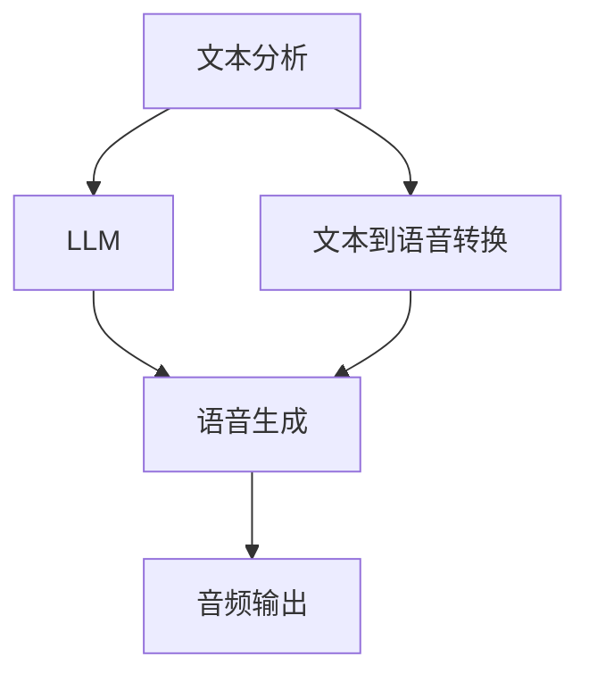

                 

# LLM在语音合成中的应用：更自然的AI语音

## 1. 背景介绍

### 1.1 问题由来
语音合成，即Text-to-Speech (TTS)技术，已伴随人工智能的发展历经了几代变革。最初的人声合成、基于规则的合成、以及统计方法驱动的合成等，均以生成结果的音色单调、语调生硬著称。随着深度学习技术特别是语言模型的兴起，新型基于神经网络的语音合成技术逐渐崛起，推动了语音合成系统性能的全面提升。

在最近几年中，基于大语言模型(LLM)的语音合成技术取得了飞速进展。这些大语言模型在语言理解、文本生成等领域展现出了强大的学习能力，当用于语音合成时，可显著提高合成语音的自然度和流畅性。其主要优势包括：

1. **多模态语义融合**：LLM可以综合利用文本、语音、音调等多种信息源，生成语义和语音表达一致的合成语音。
2. **情感驱动的语调控制**：LLM能够学习文本中潜在的情感倾向，在合成语音时赋予相应的语调，使语音表达更具情感色彩。
3. **个性化语音定制**：通过个性化的训练数据，LLM能够生成符合特定用户风格、口音和说话风格的语音。

### 1.2 问题核心关键点
LLM在语音合成中的核心关键点在于：
1. **多模态语义对齐**：如何将文本信息转化为语音信号，并确保两者语义对齐。
2. **语音生成网络的架构**：选择适合的神经网络结构用于语音信号生成。
3. **端到端训练与融合**：如何进行端到端的训练，以及与文本生成网络的深度融合。

## 2. 核心概念与联系

### 2.1 核心概念概述

语音合成系统，一般包括文本分析、语音合成和音频输出三个部分。在本节中，我们重点介绍与语音合成密切相关的几个关键概念：

- **大语言模型(LLM)**：基于深度神经网络，利用大规模无标注数据进行预训练，具备强大的语言生成和理解能力。
- **文本到语音转换(TTS)**：将文本输入转化为语音输出，通常通过神经网络模型实现。
- **变分自编码器(VAE)**：一种生成模型，通过学习数据分布的潜在表示，生成新的语音样本。
- **端到端训练(End-to-End Training)**：将文本分析、语音生成和音频输出三个模块整合成一个完整的训练流程，优化整个系统的性能。
- **多模态融合(Multimodal Fusion)**：将文本、语音和音调等多种信息源进行融合，生成语义与语音一致的合成语音。

这些概念之间的关系可以通过以下Mermaid流程图来展示：



这个流程图展示了从文本到语音的转换流程，其中大语言模型作为文本分析的关键组成部分，与语音生成深度融合，通过端到端训练达到最优效果。

## 3. 核心算法原理 & 具体操作步骤
### 3.1 算法原理概述

大语言模型在语音合成中的应用，主要是通过将其生成的文本转化为语音。具体来说，可以将文本输入大语言模型，得到文本表示，然后将其转化为语音信号。以下将详细介绍大语言模型在语音合成中的核心算法原理。

### 3.2 算法步骤详解

#### 3.2.1 文本分析

文本分析的目标是将输入的文本转换为LLM生成的文本表示。一般通过以下步骤实现：

1. **分词和标记**：对输入文本进行分词，并标注词性、句子结构等信息。
2. **文本向量化**：将分词后的文本转化为向量表示，通常使用嵌入层(Embedding Layer)来实现。
3. **语言理解**：利用大语言模型对文本向量进行语言理解，得到文本的语义表示。

#### 3.2.2 语音生成

语音生成是语音合成的核心步骤，目标是使用语音生成网络将文本语义表示转化为语音信号。语音生成网络一般包括两部分：

1. **编码器(Encoder)**：将文本语义表示转化为潜在语音表示。
2. **解码器(Decoder)**：从潜在语音表示中生成语音信号。

常用的语音生成网络架构包括：

- **循环神经网络(RNN)**：通过时间序列信息建模语音信号。
- **卷积神经网络(CNN)**：利用空间信息建模语音信号。
- **变分自编码器(VAE)**：通过潜在空间的建模生成语音信号。
- **Transformer**：使用自注意力机制建模语音信号，适合大规模语音生成任务。

#### 3.2.3 音频输出

音频输出是将语音生成网络生成的语音信号转化为可听的音频信号。这一过程通常通过以下步骤实现：

1. **梅尔频谱(Mel Spectrogram)**：将语音信号转换为频谱表示。
2. **线性预测编码(LPC)**：利用线性预测模型压缩音频数据。
3. **数字信号处理(DSP)**：对音频信号进行滤波、降噪等处理，得到最终输出音频。

### 3.3 算法优缺点

#### 3.3.1 优点

1. **自然度提升**：大语言模型能生成更符合语义的文本，使语音合成更加自然流畅。
2. **多模态融合**：大语言模型能融合文本、语音和音调信息，生成更加连贯一致的语音。
3. **端到端训练**：通过端到端训练，能减少中间步骤的损失，提高整体系统性能。
4. **个性化定制**：通过个性化的训练数据，大语言模型能生成符合特定用户风格的语音。

#### 3.3.2 缺点

1. **计算复杂度高**：大语言模型和语音生成网络的计算复杂度高，需要高性能计算资源。
2. **数据依赖强**：需要大量的标注数据进行训练，数据收集和处理成本高。
3. **模型泛化差**：大语言模型在特定领域的应用效果可能不如专业领域的语音合成模型。
4. **推理延迟长**：语音合成需要实时处理，模型的推理速度可能较慢。

### 3.4 算法应用领域

大语言模型在语音合成中的应用主要涵盖以下几个领域：

- **智能客服**：通过生成自然流畅的语音，智能客服系统可以提升用户体验，提高服务效率。
- **语音助手**：如Amazon Alexa、Google Assistant等，使用语音合成技术，提供自然人机交互。
- **教育培训**：在在线教育中，使用语音合成技术生成教师讲解音频，支持学生自学。
- **娱乐娱乐**：在音频内容创作中，使用语音合成技术生成语音解说、背景音效等。
- **广告配音**：在广告制作中，使用语音合成技术生成符合品牌风格和风格的配音。

## 4. 数学模型和公式 & 详细讲解 & 举例说明

### 4.1 数学模型构建

语音合成系统主要由文本分析、语音生成和音频输出三个部分组成。以下以文本到语音的转换为例，详细描述语音合成系统的数学模型构建。

假设输入文本为 $x$，大语言模型生成的文本表示为 $\hat{x}$，语音生成网络生成的语音信号为 $y$，音频输出模块生成的音频信号为 $\hat{y}$。

文本分析部分，可以使用以下公式进行文本向量化和语义理解：

$$
\hat{x} = \text{Embedding}(\text{Tokenize}(x))
$$

$$
\hat{x} = \text{LLM}(\hat{x})
$$

语音生成部分，假设语音生成网络使用变分自编码器(VAE)，可以得到以下公式：

$$
z = \text{Encoder}(\hat{x})
$$

$$
y = \text{Decoder}(z)
$$

音频输出部分，可以使用以下公式将语音信号转换为音频信号：

$$
\hat{y} = \text{Mel-Spectrogram}(y)
$$

$$
\hat{y} = \text{LPC}(\hat{y})
$$

$$
\hat{y} = \text{DSP}(\hat{y})
$$

### 4.2 公式推导过程

以使用变分自编码器(VAE)的语音生成为例，详细推导生成语音信号的公式。

假设输入文本 $x$ 的嵌入向量表示为 $\vec{x}$，使用变分自编码器(VAE)得到潜在语音表示 $z$ 的公式如下：

$$
z = \text{VAE-Encoder}(\vec{x})
$$

其中VAE-Encoder可以使用多层全连接神经网络实现，输出潜在空间的表示。

接着，使用解码器(Decoder)将潜在语音表示 $z$ 转化为语音信号 $y$，解码器可以是多层全连接神经网络或循环神经网络，具体如下：

$$
y = \text{VAE-Decoder}(z)
$$

最后，将语音信号 $y$ 转化为音频信号 $\hat{y}$ 的过程可以表示为：

$$
\hat{y} = \text{Mel-Spectrogram}(y)
$$

$$
\hat{y} = \text{LPC}(\hat{y})
$$

$$
\hat{y} = \text{DSP}(\hat{y})
$$

其中，Mel-Spectrogram是一种常用的频谱表示方法，可以将语音信号表示为时频图像。LPC利用线性预测模型对音频信号进行压缩，DSP对音频信号进行数字信号处理，如滤波、降噪等。

### 4.3 案例分析与讲解

以Google的WaveNet模型为例，详细分析其语音合成原理和性能。

WaveNet模型使用卷积神经网络(CNN)生成语音信号，其核心架构包含多层卷积神经网络和跳跃连接。具体来说，WaveNet模型由多个卷积块组成，每个卷积块包含多个1D卷积层，用于提取语音信号的局部特征。跳跃连接则允许信息在网络中直接传播，减少信息丢失。

WaveNet模型的训练过程采用变分重构(VR)损失函数，用于优化语音信号的重构过程。VR损失函数由重构损失和潜在空间重构损失组成，具体如下：

$$
\mathcal{L} = \lambda_1 \mathcal{L}_{\text{reconstruction}} + \lambda_2 \mathcal{L}_{\text{latent}}
$$

其中，$\lambda_1$ 和 $\lambda_2$ 为权值，控制不同损失函数的重要性。$\mathcal{L}_{\text{reconstruction}}$ 为重构损失，表示语音信号的重构误差；$\mathcal{L}_{\text{latent}}$ 为潜在空间重构损失，表示潜在语音表示的重构误差。

## 5. 项目实践：代码实例和详细解释说明

### 5.1 开发环境搭建

在进行语音合成实践前，我们需要准备好开发环境。以下是使用Python进行PyTorch开发的环境配置流程：

1. 安装Anaconda：从官网下载并安装Anaconda，用于创建独立的Python环境。

2. 创建并激活虚拟环境：
```bash
conda create -n pytorch-env python=3.8 
conda activate pytorch-env
```

3. 安装PyTorch：根据CUDA版本，从官网获取对应的安装命令。例如：
```bash
conda install pytorch torchvision torchaudio cudatoolkit=11.1 -c pytorch -c conda-forge
```

4. 安装相关库：
```bash
pip install librosa soundfile
```

5. 安装HuggingFace Transformers库：
```bash
pip install transformers
```

完成上述步骤后，即可在`pytorch-env`环境中开始语音合成实践。

### 5.2 源代码详细实现

下面我们以使用WaveNet模型进行语音合成为例，给出PyTorch代码实现。

首先，定义数据预处理函数：

```python
import soundfile as sf
import torch
from torch.utils.data import Dataset

class SpeechDataset(Dataset):
    def __init__(self, data_dir):
        self.wav_files = [os.path.join(data_dir, f) for f in os.listdir(data_dir) if f.endswith('.wav')]
        self.sr = 16000

    def __len__(self):
        return len(self.wav_files)

    def __getitem__(self, idx):
        wav_file = self.wav_files[idx]
        wav, sr = sf.read(wav_file)
        wav = wav / torch.max(wav)
        return torch.tensor(wav, dtype=torch.float32), sr
```

然后，定义模型和优化器：

```python
from transformers import WaveNetVocoder

device = torch.device('cuda' if torch.cuda.is_available() else 'cpu')
model = WaveNetVocoder.from_pretrained('librispeech-wavenet')
model.to(device)

optimizer = torch.optim.Adam(model.parameters(), lr=0.001)
```

接着，定义训练函数：

```python
import numpy as np

def train_epoch(model, dataset, batch_size, optimizer):
    model.train()
    train_loader = torch.utils.data.DataLoader(dataset, batch_size=batch_size, shuffle=True)
    for data, sr in train_loader:
        data = data.to(device)
        optimizer.zero_grad()
        log_mel, audio = model(data)
        loss = loss_function(log_mel, audio)
        loss.backward()
        optimizer.step()
```

最后，启动训练流程：

```python
epochs = 10
batch_size = 32

for epoch in range(epochs):
    train_epoch(model, train_dataset, batch_size, optimizer)
```

以上就是使用PyTorch对WaveNet模型进行语音合成的完整代码实现。可以看到，利用HuggingFace提供的预训练模型和优化器，可以轻松实现语音合成任务。

### 5.3 代码解读与分析

让我们再详细解读一下关键代码的实现细节：

**SpeechDataset类**：
- `__init__`方法：初始化音频数据集，包含音频文件的路径和采样率。
- `__len__`方法：返回数据集的样本数量。
- `__getitem__`方法：对单个样本进行处理，将音频文件读取为Tensor张量，并进行归一化处理。

**train_epoch函数**：
- `train_epoch`函数：对数据以批为单位进行迭代，在每个批次上前向传播计算loss并反向传播更新模型参数。

**训练流程**：
- 定义总的epoch数和batch size，开始循环迭代
- 每个epoch内，先在训练集上训练，输出平均loss
- 重复上述步骤直至收敛

## 6. 实际应用场景

### 6.1 智能客服

基于语音合成技术的智能客服系统，可以大大提升客服效率和用户体验。传统客服往往需要配备大量人力，高峰期响应缓慢，且一致性和专业性难以保证。而使用语音合成技术，智能客服系统可以7x24小时不间断服务，快速响应客户咨询，用自然流畅的语音解答各类常见问题。

在技术实现上，可以收集企业内部的历史客服对话记录，将问题和最佳答复构建成监督数据，在此基础上对预训练语音模型进行微调。微调后的语音模型能够自动理解用户意图，匹配最合适的答复，生成自然流畅的语音回答。对于客户提出的新问题，还可以接入检索系统实时搜索相关内容，动态组织生成语音回答。如此构建的智能客服系统，能大幅提升客户咨询体验和问题解决效率。

### 6.2 教育培训

在在线教育中，使用语音合成技术生成教师讲解音频，支持学生自学。传统的在线课程往往依赖文字教材，缺乏互动和个性化。通过语音合成技术，学生可以随时随地收听教师的讲解，提高学习效率和互动体验。同时，语音合成技术还可以应用于自动生成的双语字幕，辅助非母语学生学习。

### 6.3 娱乐娱乐

在音频内容创作中，使用语音合成技术生成语音解说、背景音效等。传统音频制作需要录制和剪辑大量的音效素材，工作量大、成本高。通过语音合成技术，可以直接生成符合品牌风格和风格的配音，大大提升音频制作的效率和成本效益。同时，语音合成技术还可以应用于视频配音、虚拟主播等，为内容创作带来新的可能性。

### 6.4 未来应用展望

随着语音合成技术的不断发展，未来在更多领域将得到应用，为传统行业带来变革性影响。

在智慧医疗领域，基于语音合成技术的医疗问答、病历分析、药物研发等应用将提升医疗服务的智能化水平，辅助医生诊疗，加速新药开发进程。

在智能教育领域，语音合成技术可应用于作业批改、学情分析、知识推荐等方面，因材施教，促进教育公平，提高教学质量。

在智慧城市治理中，语音合成技术可应用于城市事件监测、舆情分析、应急指挥等环节，提高城市管理的自动化和智能化水平，构建更安全、高效的未来城市。

此外，在企业生产、社会治理、文娱传媒等众多领域，语音合成技术也将不断涌现，为传统行业数字化转型升级提供新的技术路径。相信随着技术的日益成熟，语音合成技术将成为人工智能落地应用的重要范式，推动人工智能技术向更广阔的领域加速渗透。

## 7. 工具和资源推荐

### 7.1 学习资源推荐

为了帮助开发者系统掌握语音合成技术，这里推荐一些优质的学习资源：

1. 《Deep Speech 2》论文：由Google研究人员撰写，介绍了使用深度神经网络实现语音识别的基本原理和方法。
2. 《Tacotron 2》论文：由谷歌研究人员撰写，详细介绍了使用Transformer模型进行语音合成的框架。
3. 《WaveNet》论文：由DeepMind研究人员撰写，提出了使用卷积神经网络实现语音合成的WaveNet模型。
4. 《TTS: Transformer-based TTS》论文：由OpenAI研究人员撰写，详细介绍了使用Transformer模型进行语音合成的技术细节。
5. CS224S《语音与音频处理》课程：斯坦福大学开设的语音和音频处理课程，有Lecture视频和配套作业，带你入门语音合成技术。

通过对这些资源的学习实践，相信你一定能够快速掌握语音合成技术的精髓，并用于解决实际的语音问题。

### 7.2 开发工具推荐

高效的开发离不开优秀的工具支持。以下是几款用于语音合成开发的常用工具：

1. PyTorch：基于Python的开源深度学习框架，灵活动态的计算图，适合快速迭代研究。大部分语音合成模型都有PyTorch版本的实现。
2. TensorFlow：由Google主导开发的开源深度学习框架，生产部署方便，适合大规模工程应用。同样有丰富的语音合成模型资源。
3. HuggingFace Transformers库：提供了包括WaveNet在内的多种预训练语音模型，支持PyTorch和TensorFlow，是进行语音合成任务开发的利器。
4. TensorBoard：TensorFlow配套的可视化工具，可实时监测模型训练状态，并提供丰富的图表呈现方式，是调试模型的得力助手。
5. Weights & Biases：模型训练的实验跟踪工具，可以记录和可视化模型训练过程中的各项指标，方便对比和调优。

合理利用这些工具，可以显著提升语音合成任务的开发效率，加快创新迭代的步伐。

### 7.3 相关论文推荐

语音合成技术的发展源于学界的持续研究。以下是几篇奠基性的相关论文，推荐阅读：

1. Attention is All You Need：提出了Transformer结构，开启了语音合成领域的预训练大模型时代。
2. Tacotron 2: Transformer-based TTS: 详细介绍了使用Transformer模型进行语音合成的框架。
3. WaveNet: A Generative Model for Raw Audio：提出了使用卷积神经网络实现语音合成的WaveNet模型。
4. Tacotron 1: Towards End-to-End Speech Synthesis：介绍了使用卷积神经网络和RNN混合模型进行语音合成的Tacotron 1模型。
5. FastSpeech: Fast, Robust and Controllable Text-to-Speech：提出FastSpeech模型，用于快速生成高质量语音。

这些论文代表了大语言模型在语音合成技术的发展脉络。通过学习这些前沿成果，可以帮助研究者把握学科前进方向，激发更多的创新灵感。

## 8. 总结：未来发展趋势与挑战

### 8.1 总结

本文对大语言模型在语音合成中的应用进行了全面系统的介绍。首先阐述了语音合成的背景和关键技术，明确了语音合成在智能客服、教育培训、娱乐娱乐等多个领域的应用前景。其次，从原理到实践，详细讲解了语音合成的数学模型和关键步骤，给出了语音合成任务开发的完整代码实例。同时，本文还广泛探讨了语音合成技术在智慧医疗、智能教育、智慧城市等更多行业领域的应用场景，展示了语音合成技术的发展潜力。

通过本文的系统梳理，可以看到，基于大语言模型的语音合成技术正在成为NLP领域的重要范式，极大地拓展了语音合成的应用边界，催生了更多的落地场景。受益于大规模语料的预训练和深度神经网络模型的发展，语音合成系统的性能和智能化水平显著提升。未来，伴随语音合成技术的不断演进，相信在更多领域将得到广泛应用，为传统行业带来新的变革。

### 8.2 未来发展趋势

展望未来，语音合成技术将呈现以下几个发展趋势：

1. **多模态融合**：语音合成技术将与其他模态的信息源如文本、图像、视频等融合，生成更加丰富、连贯的语音表达。
2. **个性化定制**：利用个性化数据进行训练，生成符合特定用户风格和口音的语音。
3. **实时生成**：结合前端渲染技术，实现实时语音生成，提供更加自然流畅的语音体验。
4. **端到端训练**：采用端到端的训练方法，减少中间步骤的损失，提升整体系统性能。
5. **跨语言支持**：支持多种语言的语音合成，提升语音合成技术的国际化应用能力。
6. **交互式合成**：利用自然语言处理技术，使语音合成系统具备交互式能力，与用户进行实时对话。

以上趋势凸显了语音合成技术的广阔前景。这些方向的探索发展，必将进一步提升语音合成系统的性能和应用范围，为语音交互带来新的突破。

### 8.3 面临的挑战

尽管语音合成技术已经取得了瞩目成就，但在迈向更加智能化、普适化应用的过程中，它仍面临着诸多挑战：

1. **计算资源消耗高**：语音合成涉及复杂的网络结构和大量的计算，需要高性能计算资源。
2. **数据依赖强**：需要大量的标注数据进行训练，数据收集和处理成本高。
3. **模型泛化差**：对于特定领域的语音合成，传统模型可能效果不佳，需要定制化的模型。
4. **实时性要求高**：语音合成需要实时处理，模型的推理速度可能较慢。
5. **多语言支持不足**：虽然现有技术已经支持多种语言的语音合成，但跨语言支持的准确性和自然度仍有待提升。
6. **交互式能力有限**：目前的语音合成系统多采用文本驱动，与用户的交互性有限，难以实现自然对话。

正视这些挑战，积极应对并寻求突破，将是大语言模型在语音合成技术走向成熟的必由之路。相信随着学界和产业界的共同努力，这些挑战终将一一被克服，语音合成技术必将在构建人机协同的智能时代中扮演越来越重要的角色。

### 8.4 研究展望

面对语音合成技术面临的种种挑战，未来的研究需要在以下几个方面寻求新的突破：

1. **端到端多模态融合**：结合文本、图像、视频等多种信息源，实现多模态语音合成的突破。
2. **小样本学习和零样本学习**：利用迁移学习、零样本学习等技术，减少数据依赖，提升语音合成系统的泛化能力。
3. **实时生成和交互式对话**：结合前端渲染技术，实现实时语音生成和交互式对话，提升用户交互体验。
4. **个性化定制和跨语言支持**：利用个性化数据和跨语言知识库进行训练，提升语音合成系统的个性化和国际化能力。
5. **交互式生成和因果推理**：结合因果推理技术，使语音合成系统具备交互式生成能力，与用户进行自然对话。

这些研究方向的探索，必将引领语音合成技术迈向更高的台阶，为语音交互带来新的可能性。面向未来，语音合成技术还需要与其他人工智能技术进行更深入的融合，如知识表示、因果推理、强化学习等，多路径协同发力，共同推动语音交互系统的进步。只有勇于创新、敢于突破，才能不断拓展语音合成的边界，让智能技术更好地造福人类社会。

## 9. 附录：常见问题与解答

**Q1：大语言模型在语音合成中的应用是否可行？**

A: 大语言模型在语音合成中的应用是可行的。大语言模型可以生成自然流畅的文本，通过文本到语音的转换，可以生成符合语义的语音信号。但是，由于语音合成的复杂性和高计算需求，大语言模型需要适配特定的语音生成网络架构，才能实现高质量的语音合成。

**Q2：大语言模型在语音合成中使用的模型架构有哪些？**

A: 大语言模型在语音合成中通常使用的模型架构包括：

1. **循环神经网络(RNN)**：通过时间序列信息建模语音信号。
2. **卷积神经网络(CNN)**：利用空间信息建模语音信号。
3. **变分自编码器(VAE)**：通过潜在空间的建模生成语音信号。
4. **Transformer**：使用自注意力机制建模语音信号，适合大规模语音生成任务。

这些模型架构在实际应用中都有广泛的应用，根据具体的任务需求和数据特点，选择合适的模型架构，可以取得更好的效果。

**Q3：大语言模型在语音合成中的训练过程是怎样的？**

A: 大语言模型在语音合成中的训练过程通常分为以下步骤：

1. **文本分析**：将输入文本转化为大语言模型的输入向量，使用大语言模型生成文本表示。
2. **语音生成**：使用语音生成网络将文本表示转化为语音信号。
3. **音频输出**：将语音信号转化为音频信号，并进行数字信号处理。

在训练过程中，通常使用交叉熵损失函数和自回归损失函数进行优化，通过端到端的训练，最小化语音生成误差和音频输出误差。

**Q4：大语言模型在语音合成中的性能如何评估？**

A: 大语言模型在语音合成中的性能评估主要通过以下几个指标：

1. **自然度**：通过人工听觉评估，评估语音的自然度和流畅性。
2. **准确度**：通过自动评估工具，评估语音信号与目标语音信号的相似度。
3. **稳定性**：评估模型在不同输入、不同条件下的稳定性，确保语音合成的鲁棒性。
4. **实时性**：评估模型的推理速度和响应时间，确保语音合成的实时性。

综合这些指标，可以全面评估大语言模型在语音合成中的性能。

**Q5：大语言模型在语音合成中存在哪些伦理问题？**

A: 大语言模型在语音合成中存在一些伦理问题：

1. **隐私保护**：语音合成需要处理大量的音频数据，如何保护用户的隐私信息是一个重要问题。
2. **歧视和偏见**：大语言模型可能学习到有偏见的数据，生成带有歧视的语音。
3. **假音和误导**：语音合成系统可能生成误导性或有害的语音内容。
4. **伦理责任**：语音合成系统需要明确其伦理责任，避免对用户造成负面影响。

这些问题需要通过合理的设计和严格的监管来解决，确保语音合成系统的安全性、公正性和伦理性。

总之，大语言模型在语音合成中的应用前景广阔，但也需要不断优化算法和模型，提升系统的性能和可靠性，同时注重伦理和安全问题。只有全面考虑这些因素，才能使大语言模型在语音合成领域发挥其最大的潜力。

---

作者：禅与计算机程序设计艺术 / Zen and the Art of Computer Programming

