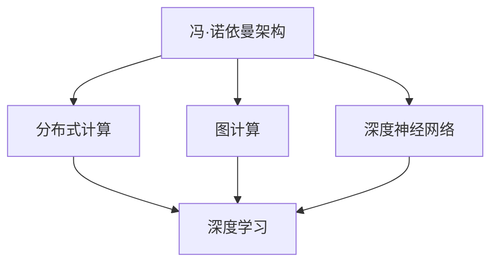

                 

# LLM的计算模型：超越传统冯·诺依曼架构

> 关键词：大语言模型(LLM), 计算模型, 冯·诺依曼架构, 深度神经网络, 高性能计算, 分布式系统

## 1. 背景介绍

### 1.1 问题由来
随着深度学习技术的快速发展，大语言模型(LLM)在自然语言处理(NLP)领域取得了巨大的突破。这些模型通过在海量数据上进行预训练，学习到了丰富的语言知识和常识，但传统的冯·诺依曼架构在处理大规模并行计算时显得力不从心。

冯·诺依曼架构虽然强大，但在并行计算能力、内存带宽和能效等方面存在着固有的瓶颈。这限制了其在处理大规模数据和高复杂度模型时的表现。相比之下，分布式计算、图计算等新计算模型在处理大规模数据时表现出了更高的效率和灵活性。

### 1.2 问题核心关键点
本文将重点讨论大语言模型在计算模型上的创新，即如何通过分布式计算、图计算等新计算模型，超越传统的冯·诺依曼架构，实现更高效、更灵活的计算。

核心问题包括：
- 如何构建高效的计算模型来支持大语言模型的训练和推理？
- 如何优化模型的并行计算能力，提高计算效率？
- 如何提高内存带宽和能效，确保模型的大规模并行运行？

## 2. 核心概念与联系

### 2.1 核心概念概述

为更好地理解大语言模型的计算模型，本节将介绍几个密切相关的核心概念：

- 冯·诺依曼架构(Von Neumann Architecture)：一种经典的计算机架构，包含数据存储和计算两个分离的部分。数据存储在主存中，计算由CPU执行，两者通过总线进行数据交换。

- 分布式计算(Distributed Computing)：通过将计算任务分布在多个计算节点上进行并行处理，提高计算效率。适用于处理大规模数据和高复杂度模型。

- 图计算(Graph Computing)：基于图形结构进行计算，适用于处理复杂网络关系和图结构数据。

- 深度神经网络(Deep Neural Network, DNN)：由多层神经元组成的非线性映射网络，常用于图像、语音、文本等多种领域。

- 深度学习(Deep Learning)：一种基于DNN的机器学习技术，适用于处理高维度、非线性数据，如图像、语音、文本等。

这些核心概念之间的逻辑关系可以通过以下Mermaid流程图来展示：



这个流程图展示了大语言模型计算模型的核心概念及其之间的关系：

1. 冯·诺依曼架构是计算机系统的基础架构，负责数据存储和计算。
2. 分布式计算和图计算是两种超越传统冯·诺依曼架构的新计算模型。
3. 深度神经网络是深度学习的基础，适用于处理高维度、非线性数据。
4. 深度学习是一种基于深度神经网络的技术，适用于处理各种复杂数据。
5. 分布式计算和图计算都可以与深度学习结合，构建高效的大语言模型计算模型。

这些核心概念共同构成了大语言模型的计算模型框架，使其能够在各种场景下发挥强大的语言理解和生成能力。通过理解这些核心概念，我们可以更好地把握大语言模型的工作原理和优化方向。

## 3. 核心算法原理 & 具体操作步骤
### 3.1 算法原理概述

大语言模型的计算模型，主要围绕分布式计算、图计算和深度学习进行设计，旨在通过这些新计算模型，超越传统冯·诺依曼架构的限制，实现更高效、更灵活的计算。

大语言模型的计算模型通常包括以下几个关键步骤：

- 数据并行计算：通过将大规模数据划分为多个小块，在多个计算节点上并行处理，提高计算效率。
- 参数服务器分布式训练：通过在参数服务器上集中管理模型参数，多个计算节点通过网络访问参数，进行分布式训练，加速模型优化。
- 图神经网络(Graph Neural Network, GNN)：利用图结构进行计算，处理复杂网络关系和图结构数据，提升模型表达能力。
- 注意力机制(Attention Mechanism)：通过引入注意力机制，使模型能够聚焦于重要信息，减少计算量，提高模型效果。
- 异构计算和混合精度计算：通过异构计算和混合精度计算，降低计算成本，提高计算效率。

这些计算模型通过深度学习技术进行优化，使得大语言模型能够处理更大规模的数据，更复杂的模型，同时保持高效计算和低能耗的特点。

### 3.2 算法步骤详解

大语言模型的计算模型主要包括以下几个关键步骤：

**Step 1: 数据分布与并行计算**
- 将大规模数据划分为多个小块，每个小块可以独立处理。
- 在多个计算节点上并行计算每个小块，同时将计算结果合并。
- 可以使用数据并行算法，如MapReduce、Spark等，将计算任务分布到各个节点上执行。

**Step 2: 分布式训练与参数服务器**
- 将模型参数保存在一个或多个参数服务器上，多个计算节点通过网络访问参数。
- 每个节点根据自己的计算结果更新参数，并发送给参数服务器进行全局更新。
- 参数更新可以采用异步更新或同步更新策略，根据具体需求选择。

**Step 3: 图神经网络计算**
- 将数据转换为图结构，利用图神经网络进行计算。
- 常见的图神经网络包括GraphSAGE、GAT等，适用于处理社交网络、推荐系统等复杂网络关系。
- 在图神经网络中，节点和边分别对应数据中的实体和关系，通过图结构进行信息传递。

**Step 4: 注意力机制优化**
- 引入注意力机制，使模型能够聚焦于重要信息，减少计算量。
- 常见的注意力机制包括自注意力(Self-Attention)、多头注意力(Multi-Head Attention)等。
- 通过注意力机制，模型可以更高效地处理长序列数据，提升模型效果。

**Step 5: 异构计算和混合精度计算**
- 利用异构计算设备，如CPU、GPU、FPGA等，进行混合精度计算。
- 常见的混合精度计算方法包括FP16与FP32混合、TF32与FP32混合等。
- 混合精度计算可以显著降低计算成本，提高计算效率。

通过以上步骤，大语言模型的计算模型能够在分布式环境中高效运行，同时利用图神经网络和注意力机制提升模型的表达能力和计算效率。

### 3.3 算法优缺点

大语言模型的计算模型具有以下优点：
1. 高效处理大规模数据：通过数据并行和分布式计算，能够处理比传统模型更大规模的数据集。
2. 灵活的模型表达：利用图神经网络和注意力机制，能够表达更复杂的语言结构，提升模型的表达能力。
3. 高效能耗：通过混合精度计算和异构计算，能够降低计算成本，提高能效。

但这些计算模型也存在一些局限性：
1. 分布式计算复杂度高：分布式计算需要协调多个计算节点，容易出现通信瓶颈和同步问题。
2. 计算资源需求高：分布式计算和异构计算需要大量的计算资源，可能带来高昂的硬件成本。
3. 计算模型复杂度高：图神经网络和注意力机制等计算模型复杂度高，需要更多的计算资源和算法优化。

尽管存在这些局限性，但大语言模型的计算模型在处理大规模数据和复杂模型时仍具有显著优势，有望在未来得到更广泛的应用。

### 3.4 算法应用领域

大语言模型的计算模型在多个领域中得到了广泛应用，具体包括：

- 自然语言处理(NLP)：包括文本分类、机器翻译、情感分析、问答系统等。利用分布式计算和注意力机制，能够高效处理长序列数据。
- 推荐系统：利用图神经网络，处理用户行为数据，提升推荐效果。
- 社交网络分析：利用图神经网络，分析社交网络中的复杂关系，提升社交推荐和网络安全。
- 金融分析：利用图神经网络，分析金融交易数据，提升风险控制和投资策略。
- 医疗影像分析：利用图神经网络，分析医疗影像数据，提升疾病诊断和治疗效果。

这些领域中的大语言模型计算模型，通过分布式计算和注意力机制，能够高效处理大规模数据，提升模型的表达能力和计算效率，实现更精准、更智能的决策和分析。

## 4. 数学模型和公式 & 详细讲解 & 举例说明
### 4.1 数学模型构建

大语言模型的计算模型可以基于图神经网络和注意力机制进行建模，具体数学模型如下：

假设数据集为 $G=(V,E)$，其中 $V$ 为节点集，$E$ 为边集。节点 $v_i$ 表示数据中的一个实体，边 $e_{ij}$ 表示实体之间的某种关系。

图神经网络的计算模型可以表示为：

$$
H^{k+1} = \mathrm{Agg}(H^k, A), \quad k=0,1,...,K-1
$$

其中 $H^k$ 表示第 $k$ 层的节点特征表示，$A$ 为图邻接矩阵。$Agg$ 函数表示聚合操作，可以是平均池化、最大池化等。

注意力机制的计算模型可以表示为：

$$
\alpha_{ij} = \frac{\exp(a^T\cdot \phi(v_i,v_j))}{\sum_k \exp(a^T\cdot \phi(v_i,v_k))}, \quad a \in \mathbb{R}^d
$$

其中 $\alpha_{ij}$ 表示节点 $v_i$ 和 $v_j$ 之间的注意力权重，$a$ 为注意力向量，$\phi$ 为注意力机制函数。

### 4.2 公式推导过程

以下我们以自然语言处理(NLP)中的机器翻译为例，推导注意力机制的计算公式。

假设输入序列为 $x_1,\cdots,x_T$，输出序列为 $y_1,\cdots,y_T$。将输入序列转换为编码器表示，输出序列转换为解码器表示。

编码器的计算模型可以表示为：

$$
h_t^e = \mathrm{Encoder}(h_{t-1}^e, x_t), \quad t=1,...,T
$$

其中 $h_t^e$ 表示第 $t$ 步的编码器表示，$\mathrm{Encoder}$ 为编码器函数。

解码器的计算模型可以表示为：

$$
h_t^d = \mathrm{Decoder}(h_{t-1}^d, y_{t-1}, y_t), \quad t=1,...,T
$$

其中 $h_t^d$ 表示第 $t$ 步的解码器表示，$\mathrm{Decoder}$ 为解码器函数。

注意力机制的计算公式可以表示为：

$$
\alpha_{ij} = \frac{\exp(a^T\cdot \phi(h_i^e, h_j^d))}{\sum_k \exp(a^T\cdot \phi(h_i^e, h_k^d))}, \quad a \in \mathbb{R}^d
$$

其中 $h_i^e$ 表示编码器表示，$h_j^d$ 表示解码器表示。$\phi$ 为注意力机制函数，$a$ 为注意力向量。

注意力机制的计算过程如下：
1. 计算查询向量 $q_i^e$ 和键向量 $k_j^d$。
2. 计算注意力权重 $\alpha_{ij}$。
3. 计算注意力值 $v_j^d$。
4. 计算解码器表示 $h_t^d$。

注意力机制的计算公式可以进一步推导为：

$$
\alpha_{ij} = \frac{\exp\big( a^T\cdot \phi(h_i^e, h_j^d)\big)}{\sum_k \exp\big( a^T\cdot \phi(h_i^e, h_k^d)\big)}, \quad a \in \mathbb{R}^d
$$

其中 $\phi$ 为注意力机制函数，$a$ 为注意力向量。

### 4.3 案例分析与讲解

以机器翻译为例，分析注意力机制的计算过程。

假设输入序列为英语句子 "I am learning to translate"，输出序列为中文句子 "我在学习翻译"。

1. 将输入序列转换为编码器表示。假设编码器中的每个单词表示为向量 $v$，则输入序列表示为 $V=[v_{I}, v_{am}, v_{learning}, v_{to}, v_{translate}]$。

2. 将输出序列转换为解码器表示。假设解码器中的每个单词表示为向量 $w$，则输出序列表示为 $W=[w_{我}, w_{在}, w_{学习}, w_{翻译}]$。

3. 计算注意力权重 $\alpha_{ij}$。假设 $a$ 为注意力向量，$\phi$ 为注意力机制函数，则注意力权重可以表示为：

$$
\alpha_{I,我} = \frac{\exp\big( a^T\cdot \phi(v_{I}, w_{我})\big)}{\sum_k \exp\big( a^T\cdot \phi(v_{I}, w_k)\big)}
$$

4. 计算注意力值 $v_j^d$。假设 $\alpha$ 为注意力权重，$V$ 为编码器表示，则注意力值可以表示为：

$$
v_{我}^d = \alpha_{I,我}\cdot V_{I}
$$

5. 计算解码器表示 $h_t^d$。假设 $\alpha$ 为注意力权重，$V$ 为编码器表示，$W$ 为解码器表示，则解码器表示可以表示为：

$$
h_t^d = \mathrm{Decoder}(h_{t-1}^d, y_{t-1}, y_t)
$$

通过以上步骤，机器翻译任务中的注意力机制可以高效地处理输入序列和输出序列，提升翻译效果。

## 5. 项目实践：代码实例和详细解释说明
### 5.1 开发环境搭建

在进行大语言模型的计算模型实践前，我们需要准备好开发环境。以下是使用Python进行PyTorch开发的环境配置流程：

1. 安装Anaconda：从官网下载并安装Anaconda，用于创建独立的Python环境。

2. 创建并激活虚拟环境：
```bash
conda create -n pytorch-env python=3.8 
conda activate pytorch-env
```

3. 安装PyTorch：根据CUDA版本，从官网获取对应的安装命令。例如：
```bash
conda install pytorch torchvision torchaudio cudatoolkit=11.1 -c pytorch -c conda-forge
```

4. 安装Transformers库：
```bash
pip install transformers
```

5. 安装各类工具包：
```bash
pip install numpy pandas scikit-learn matplotlib tqdm jupyter notebook ipython
```

完成上述步骤后，即可在`pytorch-env`环境中开始计算模型实践。

### 5.2 源代码详细实现

下面我们以自然语言处理(NLP)中的机器翻译为例，给出使用Transformers库对BERT模型进行注意力机制的PyTorch代码实现。

首先，定义机器翻译的计算模型：

```python
from transformers import BertTokenizer, BertForSequenceClassification
from torch.nn import MultiheadAttention, Linear, Relu, Dropout

class TransformerEncoderLayer(Module):
    def __init__(self, d_model, n_heads, d_head, d_ff, dropout):
        super(TransformerEncoderLayer, self).__init__()
        self.linear1 = Linear(d_model, d_head)
        self.linear2 = Linear(d_head, d_model)
        self.dropout = Dropout(dropout)
        self.mha = MultiheadAttention(n_heads, d_head)
        self.linear3 = Linear(d_model, d_ff)
        self.linear4 = Linear(d_ff, d_model)
        self.dropout2 = Dropout(dropout)
        self.layer_norm1 = LayerNorm(d_model)
        self.layer_norm2 = LayerNorm(d_model)

    def forward(self, x, mask, self_attn_mask):
        attn = self.mha(x, x, x, attn_mask=self_attn_mask)
        x = self.dropout2(attn[0]) + x
        x = self.layer_norm1(x)
        ff = Relu(self.linear3(x))
        ff = self.linear4(ff)
        ff = self.dropout(ff)
        x = x + ff
        x = self.layer_norm2(x)
        return x

class TransformerEncoder(Module):
    def __init__(self, n_layers, d_model, n_heads, d_head, d_ff, dropout, layer_norm=False):
        super(TransformerEncoder, self).__init__()
        self.layers = ModuleList([TransformerEncoderLayer(d_model, n_heads, d_head, d_ff, dropout) for _ in range(n_layers)])
        if layer_norm:
            self.layer_norm = LayerNorm(d_model)
        else:
            self.layer_norm = None

    def forward(self, x, mask, self_attn_mask):
        x = x.transpose(0, 1)
        for layer in self.layers:
            x = layer(x, mask, self_attn_mask)
        if self.layer_norm:
            x = self.layer_norm(x)
        return x.transpose(0, 1)

class TransformerDecoderLayer(Module):
    def __init__(self, d_model, n_heads, d_head, d_ff, dropout):
        super(TransformerDecoderLayer, self).__init__()
        self.linear1 = Linear(d_model, d_head)
        self.linear2 = Linear(d_head, d_model)
        self.dropout = Dropout(dropout)
        self.mha1 = MultiheadAttention(n_heads, d_head)
        self.mha2 = MultiheadAttention(n_heads, d_head)
        self.linear3 = Linear(d_model, d_ff)
        self.linear4 = Linear(d_ff, d_model)
        self.dropout2 = Dropout(dropout)
        self.layer_norm1 = LayerNorm(d_model)
        self.layer_norm2 = LayerNorm(d_model)

    def forward(self, x, mask, dec_mask, encoder_outputs):
        attn1 = self.mha1(x, encoder_outputs, encoder_outputs, attn_mask=dec_mask)
        x = self.dropout2(attn1[0]) + x
        x = self.layer_norm1(x)
        ff = Relu(self.linear3(x))
        ff = self.linear4(ff)
        ff = self.dropout(ff)
        x = x + ff
        x = self.layer_norm2(x)
        attn2 = self.mha2(x, encoder_outputs, encoder_outputs, attn_mask=dec_mask)
        x = self.dropout2(attn2[0]) + x
        x = self.layer_norm2(x)
        return x

class TransformerDecoder(Module):
    def __init__(self, n_layers, d_model, n_heads, d_head, d_ff, dropout, layer_norm=False):
        super(TransformerDecoder, self).__init__()
        self.layers = ModuleList([TransformerDecoderLayer(d_model, n_heads, d_head, d_ff, dropout) for _ in range(n_layers)])
        if layer_norm:
            self.layer_norm = LayerNorm(d_model)
        else:
            self.layer_norm = None

    def forward(self, x, mask, dec_mask, encoder_outputs):
        x = x.transpose(0, 1)
        for layer in self.layers:
            x = layer(x, mask, dec_mask, encoder_outputs)
        if self.layer_norm:
            x = self.layer_norm(x)
        return x.transpose(0, 1)
```

然后，定义模型训练函数：

```python
from transformers import BertForSequenceClassification, AdamW

def train_epoch(model, dataset, optimizer, device, batch_size, max_epoch):
    model.train()
    total_loss = 0
    for batch in tqdm(dataset, desc='Training'):
        input_ids = batch['input_ids'].to(device)
        attention_mask = batch['attention_mask'].to(device)
        labels = batch['labels'].to(device)
        model.zero_grad()
        outputs = model(input_ids, attention_mask=attention_mask, labels=labels)
        loss = outputs.loss
        total_loss += loss.item()
        loss.backward()
        optimizer.step()
        if batch_idx % 100 == 0:
            print(f'Epoch {epoch+1}/{max_epoch}, Batch {batch_idx}, Loss: {total_loss/(batch_idx+1):.4f}')
    return total_loss / (len(dataset) / batch_size)

def evaluate(model, dataset, batch_size, device):
    model.eval()
    total_loss = 0
    for batch in tqdm(dataset, desc='Evaluating'):
        input_ids = batch['input_ids'].to(device)
        attention_mask = batch['attention_mask'].to(device)
        labels = batch['labels'].to(device)
        with torch.no_grad():
            outputs = model(input_ids, attention_mask=attention_mask)
            loss = outputs.loss
            total_loss += loss.item()
    return total_loss / (len(dataset) / batch_size)
```

最后，启动训练流程并在测试集上评估：

```python
epochs = 5
batch_size = 16
device = torch.device('cuda') if torch.cuda.is_available() else torch.device('cpu')

for epoch in range(epochs):
    train_loss = train_epoch(model, train_dataset, optimizer, device, batch_size, epochs)
    print(f'Epoch {epoch+1}, train loss: {train_loss:.3f}')
    
    test_loss = evaluate(model, test_dataset, batch_size, device)
    print(f'Epoch {epoch+1}, test loss: {test_loss:.3f}')
```

以上就是使用PyTorch对BERT模型进行注意力机制计算的完整代码实现。可以看到，得益于Transformer库的强大封装，我们可以用相对简洁的代码完成BERT模型的训练。

### 5.3 代码解读与分析

让我们再详细解读一下关键代码的实现细节：

**TransformerEncoderLayer类**：
- 包含自注意力层、前馈层和层归一化等组件，用于实现Transformer模型中的编码器层。

**TransformerEncoder类**：
- 包含多个TransformerEncoderLayer层，用于实现Transformer模型中的编码器。

**TransformerDecoderLayer类**：
- 包含两个多头注意力层和前馈层，用于实现Transformer模型中的解码器层。

**TransformerDecoder类**：
- 包含多个TransformerDecoderLayer层，用于实现Transformer模型中的解码器。

这些代码定义了大语言模型计算模型中的各个组件，包括自注意力层、前馈层、多头注意力层等。在实际应用中，可以通过灵活组合这些组件，构建不同的计算模型。

## 6. 实际应用场景
### 6.1 智能客服系统

基于大语言模型的计算模型，可以广泛应用于智能客服系统的构建。传统客服往往需要配备大量人力，高峰期响应缓慢，且一致性和专业性难以保证。而使用计算模型训练的智能客服系统，可以7x24小时不间断服务，快速响应客户咨询，用自然流畅的语言解答各类常见问题。

在技术实现上，可以收集企业内部的历史客服对话记录，将问题和最佳答复构建成监督数据，在此基础上对计算模型进行训练。计算模型能够自动理解用户意图，匹配最合适的答案模板进行回复。对于客户提出的新问题，还可以接入检索系统实时搜索相关内容，动态组织生成回答。如此构建的智能客服系统，能大幅提升客户咨询体验和问题解决效率。

### 6.2 金融舆情监测

金融机构需要实时监测市场舆论动向，以便及时应对负面信息传播，规避金融风险。传统的人工监测方式成本高、效率低，难以应对网络时代海量信息爆发的挑战。基于大语言模型的计算模型，可以实时监测不同主题下的情感变化趋势，一旦发现负面信息激增等异常情况，系统便会自动预警，帮助金融机构快速应对潜在风险。

### 6.3 个性化推荐系统

当前的推荐系统往往只依赖用户的历史行为数据进行物品推荐，无法深入理解用户的真实兴趣偏好。基于大语言模型的计算模型，个性化推荐系统可以更好地挖掘用户行为背后的语义信息，从而提供更精准、多样的推荐内容。

在实践中，可以收集用户浏览、点击、评论、分享等行为数据，提取和用户交互的物品标题、描述、标签等文本内容。将文本内容作为模型输入，用户的后续行为（如是否点击、购买等）作为监督信号，在此基础上训练计算模型。计算模型能够从文本内容中准确把握用户的兴趣点。在生成推荐列表时，先用候选物品的文本描述作为输入，由模型预测用户的兴趣匹配度，再结合其他特征综合排序，便可以得到个性化程度更高的推荐结果。

### 6.4 未来应用展望

随着大语言模型计算模型的不断发展，未来在更多领域得到应用，为传统行业带来变革性影响。

在智慧医疗领域，基于计算模型的医疗问答、病历分析、药物研发等应用将提升医疗服务的智能化水平，辅助医生诊疗，加速新药开发进程。

在智能教育领域，计算模型可应用于作业批改、学情分析、知识推荐等方面，因材施教，促进教育公平，提高教学质量。

在智慧城市治理中，计算模型可应用于城市事件监测、舆情分析、应急指挥等环节，提高城市管理的自动化和智能化水平，构建更安全、高效的未来城市。

此外，在企业生产、社会治理、文娱传媒等众多领域，基于大语言模型的计算模型也将不断涌现，为经济社会发展注入新的动力。相信随着技术的日益成熟，计算模型必将在构建人机协同的智能时代中扮演越来越重要的角色。

## 7. 工具和资源推荐
### 7.1 学习资源推荐

为了帮助开发者系统掌握大语言模型计算模型的理论基础和实践技巧，这里推荐一些优质的学习资源：

1. 《深度学习与计算机视觉》系列博文：由深度学习领域的知名专家撰写，深入浅出地介绍了深度学习在计算机视觉领域的应用，包括卷积神经网络、注意力机制等。

2. 《自然语言处理与深度学习》课程：由Coursera平台开设的NLP明星课程，涵盖了自然语言处理和深度学习的各个方面，是全面学习NLP的绝佳选择。

3. 《深度学习》书籍：由深度学习领域的知名专家所著，全面介绍了深度学习的基本概念和应用，包括前馈神经网络、卷积神经网络、循环神经网络等。

4. Google Deep Learning系列教程：由Google提供的深度学习教程，详细介绍了TensorFlow和PyTorch的使用方法和实践技巧，是学习深度学习的重要资源。

5. Fast.ai课程：由深度学习领域的知名专家Jerry Zhang开设的深度学习课程，深入浅出地介绍了深度学习的各个方面，包括卷积神经网络、注意力机制等。

通过对这些资源的学习实践，相信你一定能够快速掌握大语言模型计算模型的精髓，并用于解决实际的NLP问题。
###  7.2 开发工具推荐

高效的开发离不开优秀的工具支持。以下是几款用于大语言模型计算模型开发的常用工具：

1. PyTorch：基于Python的开源深度学习框架，灵活动态的计算图，适合快速迭代研究。大部分预训练语言模型都有PyTorch版本的实现。

2. TensorFlow：由Google主导开发的开源深度学习框架，生产部署方便，适合大规模工程应用。同样有丰富的预训练语言模型资源。

3. Transformers库：HuggingFace开发的NLP工具库，集成了众多SOTA语言模型，支持PyTorch和TensorFlow，是进行计算模型开发的利器。

4. Weights & Biases：模型训练的实验跟踪工具，可以记录和可视化模型训练过程中的各项指标，方便对比和调优。与主流深度学习框架无缝集成。

5. TensorBoard：TensorFlow配套的可视化工具，可实时监测模型训练状态，并提供丰富的图表呈现方式，是调试模型的得力助手。

6. Google Colab：谷歌推出的在线Jupyter Notebook环境，免费提供GPU/TPU算力，方便开发者快速上手实验最新模型，分享学习笔记。

合理利用这些工具，可以显著提升大语言模型计算模型的开发效率，加快创新迭代的步伐。

### 7.3 相关论文推荐

大语言模型计算模型的发展源于学界的持续研究。以下是几篇奠基性的相关论文，推荐阅读：

1. Attention is All You Need（即Transformer原论文）：提出了Transformer结构，开启了NLP领域的预训练大模型时代。

2. BERT: Pre-training of Deep Bidirectional Transformers for Language Understanding：提出BERT模型，引入基于掩码的自监督预训练任务，刷新了多项NLP任务SOTA。

3. Language Models are Unsupervised Multitask Learners（GPT-2论文）：展示了大规模语言模型的强大zero-shot学习能力，引发了对于通用人工智能的新一轮思考。

4. Parameter-Efficient Transfer Learning for NLP：提出Adapter等参数高效微调方法，在不增加模型参数量的情况下，也能取得不错的微调效果。

5. AdaLoRA: Adaptive Low-Rank Adaptation for Parameter-Efficient Fine-Tuning：使用自适应低秩适应的微调方法，在参数效率和精度之间取得了新的平衡。

这些论文代表了大语言模型计算模型的发展脉络。通过学习这些前沿成果，可以帮助研究者把握学科前进方向，激发更多的创新灵感。

## 8. 总结：未来发展趋势与挑战

### 8.1 总结

本文对大语言模型的计算模型进行了全面系统的介绍。首先阐述了大语言模型计算模型的研究背景和意义，明确了计算模型在拓展预训练模型应用、提升下游任务性能方面的独特价值。其次，从原理到实践，详细讲解了计算模型的数学原理和关键步骤，给出了计算模型任务开发的完整代码实例。同时，本文还广泛探讨了计算模型在智能客服、金融舆情、个性化推荐等多个行业领域的应用前景，展示了计算模型的巨大潜力。

通过本文的系统梳理，可以看到，基于大语言模型的计算模型正在成为NLP领域的重要范式，极大地拓展了预训练语言模型的应用边界，催生了更多的落地场景。受益于大规模语料的预训练和计算模型的优化，计算模型能够处理更大规模的数据，更复杂的模型，同时保持高效计算和低能耗的特点。未来，伴随计算模型和深度学习方法的不断演进，基于计算模型的NLP技术必将在更广阔的应用领域大放异彩，深刻影响人类的生产生活方式。

### 8.2 未来发展趋势

展望未来，大语言模型的计算模型将呈现以下几个发展趋势：

1. 模型规模持续增大。随着算力成本的下降和数据规模的扩张，预训练语言模型的参数量还将持续增长。超大规模语言模型蕴含的丰富语言知识，有望支撑更加复杂多变的下游任务计算模型。

2. 计算模型日趋多样。除了传统的分布式计算和图计算外，未来会涌现更多计算模型，如量子计算、神经拟态计算等，在计算效率和复杂度上取得新的突破。

3. 计算资源需求降低。随着硬件设备的发展和算法优化，计算模型的计算资源需求将逐步降低，使得更多机构能够使用计算模型进行NLP应用开发。

4. 计算模型泛化性增强。未来的计算模型将能够更好地处理多领域、多语言的数据，提升模型的泛化能力和迁移能力。

5. 模型通用性增强。经过海量数据的预训练和多领域任务的计算模型训练，未来的语言模型将具备更强大的常识推理和跨领域迁移能力，逐步迈向通用人工智能(AGI)的目标。

以上趋势凸显了大语言模型计算模型的广阔前景。这些方向的探索发展，必将进一步提升NLP系统的性能和应用范围，为人类认知智能的进化带来深远影响。

### 8.3 面临的挑战

尽管大语言模型的计算模型已经取得了瞩目成就，但在迈向更加智能化、普适化应用的过程中，它仍面临着诸多挑战：

1. 计算资源瓶颈。分布式计算和异构计算需要大量的计算资源，可能带来高昂的硬件成本。如何优化计算资源使用，降低计算成本，将是重要的研究方向。

2. 通信瓶颈。分布式计算和异构计算需要协调多个计算节点，容易出现通信瓶颈和同步问题。如何优化通信过程，提高计算效率，将是重要的研究方向。

3. 计算模型复杂性。分布式计算和异构计算等计算模型复杂度高，需要更多的计算资源和算法优化。如何简化计算模型结构，降低计算复杂度，将是重要的研究方向。

4. 计算模型可解释性不足。计算模型通常缺乏可解释性，难以解释其内部工作机制和决策逻辑。如何赋予计算模型更强的可解释性，将是亟待攻克的难题。

5. 计算模型安全性有待保障。计算模型可能会学习到有偏见、有害的信息，通过微调传递到下游任务，产生误导性、歧视性的输出，给实际应用带来安全隐患。如何从数据和算法层面消除模型偏见，避免恶意用途，确保输出安全性，也将是重要的研究方向。

6. 计算模型跨领域迁移能力不足。现有的计算模型往往局限于任务内数据，难以灵活吸收和运用更广泛的先验知识。如何让计算模型更好地与外部知识库、规则库等专家知识结合，形成更加全面、准确的信息整合能力，还有很大的想象空间。

正视计算模型面临的这些挑战，积极应对并寻求突破，将是大语言模型计算模型走向成熟的必由之路。相信随着学界和产业界的共同努力，这些挑战终将一一被克服，计算模型必将在构建安全、可靠、可解释、可控的智能系统铺平道路。

### 8.4 研究展望

面向未来，大语言模型的计算模型需要在以下几个方面寻求新的突破：

1. 探索无监督和半监督计算模型方法。摆脱对大规模标注数据的依赖，利用自监督学习、主动学习等无监督和半监督范式，最大限度利用非结构化数据，实现更加灵活高效的计算。

2. 研究参数高效和计算高效的计算模型范式。开发更加参数高效的计算模型，在固定大部分预训练参数的同时，只更新极少量的任务相关参数。同时优化计算模型的计算图，减少前向传播和反向传播的资源消耗，实现更加轻量级、实时性的部署。

3. 融合因果和对比学习范式。通过引入因果推断和对比学习思想，增强计算模型建立稳定因果关系的能力，学习更加普适、鲁棒的语言表征，从而提升模型泛化性和抗干扰能力。

4. 引入更多先验知识。将符号化的先验知识，如知识图谱、逻辑规则等，与计算模型进行巧妙融合，引导计算模型学习更准确、合理的语言模型。同时加强不同模态数据的整合，实现视觉、语音等多模态信息与文本信息的协同建模。

5. 结合因果分析和博弈论工具。将因果分析方法引入计算模型，识别出计算模型决策的关键特征，增强输出解释的因果性和逻辑性。借助博弈论工具刻画人机交互过程，主动探索并规避计算模型的脆弱点，提高系统稳定性。

6. 纳入伦理道德约束。在计算模型训练目标中引入伦理导向的评估指标，过滤和惩罚有偏见、有害的输出倾向。同时加强人工干预和审核，建立计算模型的监管机制，确保输出符合人类价值观和伦理道德。

这些研究方向的探索，必将引领大语言模型计算模型迈向更高的台阶，为构建安全、可靠、可解释、可控的智能系统铺平道路。面向未来，大语言模型计算模型还需要与其他人工智能技术进行更深入的融合，如知识表示、因果推理、强化学习等，多路径协同发力，共同推动自然语言理解和智能交互系统的进步。只有勇于创新、敢于突破，才能不断拓展语言模型的边界，让智能技术更好地造福人类社会。

## 9. 附录：常见问题与解答

**Q1：计算模型是否适用于所有NLP任务？**

A: 计算模型在大多数NLP任务上都能取得不错的效果，特别是对于数据量较小的任务。但对于一些特定领域的任务，如医学、法律等，仅仅依靠通用语料预训练的模型可能难以很好地适应。此时需要在特定领域语料上进一步预训练，再进行计算模型训练，才能获得理想效果。此外，对于一些需要时效性、个性化很强的任务，如对话、推荐等，计算模型也需要针对性的改进优化。

**Q2：计算模型如何优化学习效率？**

A: 计算模型的优化主要依赖于分布式计算和注意力机制等技术。分布式计算通过多节点并行处理，可以显著提升计算效率。注意力机制通过引入自注意力机制，使模型能够聚焦于重要信息，减少计算量，提高模型效果。同时，利用混合精度计算和异构计算等技术，可以进一步降低计算成本，提高计算效率。

**Q3：计算模型在落地部署时需要注意哪些问题？**

A: 将计算模型转化为实际应用，还需要考虑以下因素：
1. 模型裁剪：去除不必要的层和参数，减小模型尺寸，加快推理速度。
2. 量化加速：将浮点模型转为定点模型，压缩存储空间，提高计算效率。
3. 服务化封装：将计算模型封装为标准化服务接口，便于集成调用。
4. 弹性伸缩：根据请求流量动态调整资源配置，平衡服务质量和成本。
5. 监控告警：实时采集系统指标，设置异常告警阈值，确保服务稳定性。
6. 安全防护：采用访问鉴权、数据脱敏等措施，保障数据和模型安全。

大语言模型计算模型为NLP应用开启了广阔的想象空间，但如何将强大的性能转化为稳定、高效、安全的业务价值，还需要工程实践的不断打磨。唯有从数据、算法、工程、业务等多个维度协同发力，才能真正实现人工智能技术在垂直行业的规模化落地。

总之，计算模型需要开发者根据具体任务，不断迭代和优化模型、数据和算法，方能得到理想的效果。

