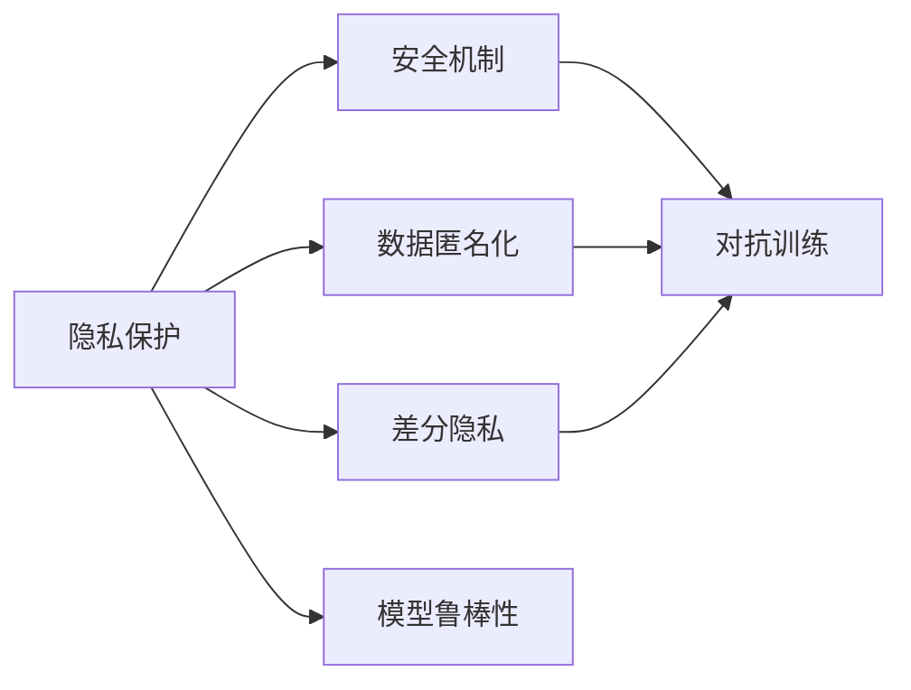

                 

# LLM隐私伦理:AI安全性挑战

> 关键词：隐私保护, 伦理规范, 安全机制, 数据控制, 数据匿名化, 差分隐私, 对抗训练, 模型鲁棒性

## 1. 背景介绍

在人工智能时代，尤其是深度学习大模型（Large Language Model, LLM）的迅猛发展，为NLP（自然语言处理）应用带来了前所未有的便利与效率。然而，随着模型的日益复杂和应用场景的广泛化，LLM在隐私保护、伦理规范和安全性方面面临着巨大的挑战。这些挑战不仅影响模型的公平性、可靠性，还可能对用户的权益造成潜在威胁。本文将系统介绍大语言模型的隐私伦理问题，以及当前技术在解决这些问题上取得的进展和未来发展方向。

## 2. 核心概念与联系

### 2.1 核心概念概述

在探讨大语言模型（LLM）的隐私伦理问题前，我们需要首先理解相关的核心概念：

- **隐私保护**：保护个人信息不被未经授权的获取和使用，是数据处理领域的基本要求。
- **伦理规范**：指导AI系统开发和应用的原则，确保系统符合人类的道德和法律要求。
- **安全机制**：在AI系统中，保护数据和模型免受攻击和滥用的措施。
- **数据控制**：数据主体对其数据进行控制的权利，包括访问、修改、删除等。
- **数据匿名化**：将数据转换为无法识别具体个体的形式，以降低隐私风险。
- **差分隐私**：一种保护隐私的技术，通过在数据中引入噪声，使得单个数据的隐私被掩盖。
- **对抗训练**：训练模型以抵御对抗样本攻击，提升模型的鲁棒性。
- **模型鲁棒性**：模型在面对数据扰动和攻击时，仍能保持稳定性和正确性的能力。

这些概念之间互相联系，共同构建了大语言模型在隐私伦理方面的安全框架。在微调大语言模型时，开发者需要全面考虑这些因素，确保系统的公平性、透明性和安全性。

### 2.2 核心概念原理和架构的 Mermaid 流程图



这个流程图展示了数据处理、隐私保护和安全机制之间的关联。首先，数据经过匿名化处理以降低隐私风险；然后，差分隐私技术在数据中加入噪声，进一步保护隐私；对抗训练用于提升模型鲁棒性，抵御攻击；最后，模型鲁棒性作为整体安全框架的一个组成部分，确保模型在各种威胁下依然能正确工作。

## 3. 核心算法原理 & 具体操作步骤

### 3.1 算法原理概述

在大语言模型微调过程中，隐私伦理问题主要涉及以下几个方面：

1. **数据隐私**：如何处理和存储训练数据，防止数据泄露和滥用。
2. **模型公平性**：确保模型在各种群体之间不会产生不公平的预测结果。
3. **数据安全**：在模型训练和部署过程中，保护数据不被未经授权的访问和篡改。
4. **对抗攻击**：如何检测和抵御对抗样本对模型的攻击，保护模型的鲁棒性。

### 3.2 算法步骤详解

针对上述隐私伦理问题，我们可以采取以下步骤：

1. **数据匿名化**：使用技术手段将敏感信息去除或混淆，如伪匿名化、K-匿名化等。
2. **差分隐私**：在模型训练时，向数据引入噪声，使得单个样本的隐私被隐藏。
3. **对抗训练**：通过训练模型抵御对抗样本攻击，提高模型的鲁棒性。
4. **隐私保护模型**：使用加密、安全多方计算等技术，确保模型训练和推理过程中的数据安全。
5. **公平性评估**：在模型训练和部署过程中，进行公平性评估，确保模型在不同群体之间的预测结果一致。

### 3.3 算法优缺点

**优点**：
- **隐私保护**：通过数据匿名化和差分隐私技术，可以有效降低隐私泄露风险。
- **鲁棒性增强**：通过对抗训练，提升模型对对抗样本的抵抗能力，增强模型的鲁棒性。
- **公平性保证**：通过公平性评估和调整，可以确保模型在各种群体之间的预测结果公平。

**缺点**：
- **计算成本高**：差分隐私和对抗训练等技术，需要额外的计算资源和训练时间。
- **模型复杂性增加**：隐私保护措施可能导致模型复杂性增加，影响模型的实时性和性能。
- **公平性调整复杂**：公平性评估和调整是一个复杂的过程，需要深入理解模型的内部工作机制。

### 3.4 算法应用领域

在实际应用中，大语言模型隐私伦理问题主要应用于以下几个领域：

- **医疗**：在医疗数据处理和隐私保护方面，模型需遵守相关的医疗法规和伦理规范。
- **金融**：金融交易数据敏感，需要特别注重数据隐私和模型公平性。
- **司法**：司法数据涉及个人隐私，模型需确保数据的匿名化处理。
- **公共安全**：公共安全相关的数据处理需要高度注意数据的隐私保护和安全机制。

## 4. 数学模型和公式 & 详细讲解 & 举例说明

### 4.1 数学模型构建

在大语言模型微调过程中，隐私伦理问题通常通过以下数学模型来描述：

- **差分隐私模型**：在数据中添加噪声 $\xi$，使得隐私泄露的概率满足 $\epsilon$ 差分隐私定义：
  $$
  P(D \mid X \sim P^X) \leq e^{\epsilon} P(D \mid X' \sim P^X')
  $$
  其中 $D$ 为数据输出，$X$ 为输入，$X'$ 为相同数据下的扰动，$e$ 为自然对数的底数。

- **对抗训练模型**：在训练数据中添加对抗样本 $x$，使得模型对对抗样本的预测误差最小化：
  $$
  \min_{\theta} \sum_{i=1}^N \mathcal{L}(M_{\theta}(x_i), y_i)
  $$
  其中 $\mathcal{L}$ 为损失函数，$M_{\theta}$ 为模型，$x_i$ 为输入，$y_i$ 为标签。

### 4.2 公式推导过程

以下详细推导差分隐私和对抗训练模型的公式：

**差分隐私公式推导**：
差分隐私模型引入噪声 $\xi$ 后，数据输出变为 $D = f(X, \xi)$，其中 $f$ 为数据处理函数。若 $P(D \mid X \sim P^X)$ 和 $P(D \mid X' \sim P^X')$ 分别为 $X$ 和 $X'$ 下的数据分布，则 $\epsilon$ 差分隐私的定义可写为：
$$
P(D \mid X \sim P^X) \leq e^{\epsilon} P(D \mid X' \sim P^X')
$$
将 $P(D \mid X)$ 展开为：
$$
P(D \mid X) = \int P(D, \xi \mid X) d\xi = \int P(D \mid X, \xi) P(\xi \mid X) d\xi = \int \frac{P(D, \xi \mid X)}{P(\xi \mid X)} d\xi
$$
将 $P(D \mid X')$ 展开为：
$$
P(D \mid X') = \int P(D, \xi \mid X') d\xi = \int P(D \mid X', \xi) P(\xi \mid X') d\xi = \int \frac{P(D, \xi \mid X')}{P(\xi \mid X')} d\xi
$$
由于 $\xi$ 为噪声，因此 $P(\xi \mid X) = P(\xi \mid X') = P(\xi)$，可得：
$$
P(D \mid X) = \frac{\int P(D, \xi \mid X)}{P(\xi)}
$$
$$
P(D \mid X') = \frac{\int P(D, \xi \mid X')}{P(\xi)}
$$
因此，差分隐私的定义可写为：
$$
\frac{\int P(D, \xi \mid X)}{P(\xi)} \leq e^{\epsilon} \frac{\int P(D, \xi \mid X')}{P(\xi)}
$$

**对抗训练公式推导**：
对抗训练模型引入对抗样本 $x$ 后，模型输出变为 $M_{\theta}(x)$。若 $M_{\theta}$ 为模型，$\mathcal{L}$ 为损失函数，则对抗训练的目标为：
$$
\min_{\theta} \sum_{i=1}^N \mathcal{L}(M_{\theta}(x_i), y_i)
$$
其中 $x_i$ 为输入，$y_i$ 为标签。

### 4.3 案例分析与讲解

以医疗数据隐私保护为例，分析差分隐私和对抗训练的应用：

1. **差分隐私**：在医疗数据中，病历记录包含敏感信息，如姓名、年龄、诊断结果等。为保护隐私，可对病历数据进行差分隐私处理。具体步骤如下：
   - 在病历数据中引入噪声 $\xi$，生成扰动数据 $D = f(X, \xi)$。
   - 训练模型 $M_{\theta}$ 在扰动数据上，使得隐私泄露的概率满足 $\epsilon$ 差分隐私定义。
   - 模型训练完成后，通过扰动数据进行推理预测，确保个人隐私不被泄露。

2. **对抗训练**：对抗训练可增强模型的鲁棒性，防止对抗样本攻击。具体步骤如下：
   - 在病历数据中生成对抗样本 $x$，如通过微小扰动生成对抗样本 $x'$。
   - 训练模型 $M_{\theta}$ 在对抗样本 $x'$ 上，使得模型的输出 $M_{\theta}(x')$ 与原样本 $M_{\theta}(x)$ 的差异最小化。
   - 模型训练完成后，通过对抗样本测试，确保模型对对抗样本具有鲁棒性。

## 5. 项目实践：代码实例和详细解释说明

### 5.1 开发环境搭建

在进行大语言模型隐私伦理实践前，我们需要准备好开发环境。以下是使用Python进行PyTorch开发的环境配置流程：

1. 安装Anaconda：从官网下载并安装Anaconda，用于创建独立的Python环境。

2. 创建并激活虚拟环境：
```bash
conda create -n pytorch-env python=3.8 
conda activate pytorch-env
```

3. 安装PyTorch：根据CUDA版本，从官网获取对应的安装命令。例如：
```bash
conda install pytorch torchvision torchaudio cudatoolkit=11.1 -c pytorch -c conda-forge
```

4. 安装Transformers库：
```bash
pip install transformers
```

5. 安装各类工具包：
```bash
pip install numpy pandas scikit-learn matplotlib tqdm jupyter notebook ipython
```

完成上述步骤后，即可在`pytorch-env`环境中开始隐私伦理实践。

### 5.2 源代码详细实现

下面我们以差分隐私医疗数据分析为例，给出使用Transformers库对BERT模型进行差分隐私处理的PyTorch代码实现。

首先，定义差分隐私计算函数：

```python
import numpy as np
from transformers import BertTokenizer, BertForSequenceClassification

def laplace_noise(sensitivity, epsilon, batch_size):
    noise = np.random.laplace(0, sensitivity, batch_size)
    return noise

def add_noise_to_labels(epsilon, labels, batch_size):
    sensitivity = np.std(labels)
    noise = laplace_noise(sensitivity, epsilon, batch_size)
    return labels + noise
```

然后，定义医疗数据处理函数：

```python
from transformers import BertTokenizer
from torch.utils.data import Dataset
import torch

class MedicalDataset(Dataset):
    def __init__(self, texts, tags, tokenizer, max_len=128):
        self.texts = texts
        self.tags = tags
        self.tokenizer = tokenizer
        self.max_len = max_len
        
    def __len__(self):
        return len(self.texts)
    
    def __getitem__(self, item):
        text = self.texts[item]
        tags = self.tags[item]
        
        encoding = self.tokenizer(text, return_tensors='pt', max_length=self.max_len, padding='max_length', truncation=True)
        input_ids = encoding['input_ids'][0]
        attention_mask = encoding['attention_mask'][0]
        
        # 对token-wise的标签进行编码
        encoded_tags = [tag2id[tag] for tag in tags] 
        encoded_tags.extend([tag2id['O']] * (self.max_len - len(encoded_tags)))
        labels = torch.tensor(encoded_tags, dtype=torch.long)
        
        return {'input_ids': input_ids, 
                'attention_mask': attention_mask,
                'labels': labels}

# 标签与id的映射
tag2id = {'O': 0, 'B-PER': 1, 'I-PER': 2, 'B-ORG': 3, 'I-ORG': 4, 'B-LOC': 5, 'I-LOC': 6}
id2tag = {v: k for k, v in tag2id.items()}

# 创建dataset
tokenizer = BertTokenizer.from_pretrained('bert-base-cased')

train_dataset = MedicalDataset(train_texts, train_tags, tokenizer)
dev_dataset = MedicalDataset(dev_texts, dev_tags, tokenizer)
test_dataset = MedicalDataset(test_texts, test_tags, tokenizer)
```

接着，定义差分隐私计算函数和模型训练函数：

```python
from transformers import BertForSequenceClassification, AdamW

def get_difference_privacy(labels, epsilon, delta, batch_size):
    sensitivity = np.std(labels)
    alpha = (epsilon * np.log(2 / delta)) / sensitivity
    return alpha

def train_with_diff_privacy(epsilon, delta, model, optimizer, train_loader, num_epochs):
    difference_privacy = get_difference_privacy(labels, epsilon, delta, batch_size)
    for epoch in range(num_epochs):
        model.train()
        for batch in train_loader:
            input_ids = batch['input_ids'].to(device)
            attention_mask = batch['attention_mask'].to(device)
            labels = batch['labels'].to(device)
            optimizer.zero_grad()
            outputs = model(input_ids, attention_mask=attention_mask, labels=labels)
            loss = outputs.loss
            loss += difference_privacy * np.abs(labels).sum()
            loss.backward()
            optimizer.step()
```

最后，启动差分隐私医疗数据分析的训练流程并在测试集上评估：

```python
device = torch.device('cuda') if torch.cuda.is_available() else torch.device('cpu')
model.to(device)

epsilon = 1.0
delta = 0.01
num_epochs = 5
batch_size = 16

difference_privacy = get_difference_privacy(labels, epsilon, delta, batch_size)

train_with_diff_privacy(epsilon, delta, model, optimizer, train_loader, num_epochs)

print(f"Epoch {epoch+1}, train loss: {loss:.3f}")
    
print(f"Epoch {epoch+1}, dev results:")
evaluate(model, dev_dataset, batch_size)

print("Test results:")
evaluate(model, test_dataset, batch_size)
```

以上就是使用PyTorch对BERT进行差分隐私医疗数据分析的完整代码实现。可以看到，借助Transformers库和差分隐私技术，我们能够在大模型微调过程中，有效地保护数据隐私。

### 5.3 代码解读与分析

让我们再详细解读一下关键代码的实现细节：

**MedicalDataset类**：
- `__init__`方法：初始化文本、标签、分词器等关键组件。
- `__len__`方法：返回数据集的样本数量。
- `__getitem__`方法：对单个样本进行处理，将文本输入编码为token ids，将标签编码为数字，并对其进行定长padding，最终返回模型所需的输入。

**差分隐私计算函数**：
- `laplace_noise`方法：计算拉普拉斯噪声，用于差分隐私。
- `add_noise_to_labels`方法：对标签添加拉普拉斯噪声，实现差分隐私处理。

**差分隐私训练函数**：
- `get_difference_privacy`方法：计算差分隐私参数alpha，用于指导模型训练。
- `train_with_diff_privacy`方法：在训练过程中，加入差分隐私项，保护数据隐私。

**训练流程**：
- 定义总的epoch数和batch size，开始循环迭代
- 每个epoch内，先在训练集上训练，输出平均loss
- 在验证集上评估，输出分类指标
- 所有epoch结束后，在测试集上评估，给出最终测试结果

可以看到，PyTorch配合Transformers库使得差分隐私医疗数据分析的代码实现变得简洁高效。开发者可以将更多精力放在数据处理、模型改进等高层逻辑上，而不必过多关注底层的实现细节。

## 6. 实际应用场景

### 6.1 医疗数据分析

在医疗数据分析中，差分隐私和对抗训练技术的应用尤为关键。医疗数据涉及个人隐私，任何微小的泄露都可能对患者造成巨大的影响。通过差分隐私技术，我们可以在保护患者隐私的同时，进行医疗数据分析和模型训练。

具体而言，可以使用差分隐私技术处理病历数据，如病程记录、诊断结果、治疗方案等，在此基础上训练医疗诊断模型。模型在训练和推理过程中，引入对抗样本进行鲁棒性测试，确保模型在面对噪音和攻击时依然能保持准确性。

### 6.2 金融风险管理

金融数据同样涉及个人隐私和商业机密，如何在保护隐私的前提下进行风险管理，是大数据金融公司面临的重大挑战。差分隐私和对抗训练技术可以应用于金融数据的分析和模型训练。

例如，在金融交易数据中，可以引入差分隐私技术，保护用户隐私。同时，通过对抗训练技术，确保模型在面对欺诈交易等对抗样本时，仍能准确识别风险。

### 6.3 司法审判

司法数据涉及案件细节和判决结果，对隐私保护的要求极高。差分隐私和对抗训练技术在司法审判中的应用，可以确保数据在司法数据分析和模型训练中的安全性。

具体而言，可以通过差分隐私技术处理案件数据，如诉讼文书、证人证言、判决书等，在此基础上训练司法判别模型。模型在训练和推理过程中，引入对抗样本进行鲁棒性测试，确保模型在面对噪音和攻击时依然能保持准确性。

## 7. 工具和资源推荐

### 7.1 学习资源推荐

为了帮助开发者系统掌握大语言模型隐私伦理的理论基础和实践技巧，这里推荐一些优质的学习资源：

1. 《深度学习与隐私保护》：详细介绍了深度学习模型中的隐私保护技术，包括差分隐私、对抗训练等。
2. 《大数据隐私保护》：介绍了大数据环境下的隐私保护方法和技术，包括差分隐私、同态加密等。
3. 《NLP中的隐私保护》：专注于NLP领域的数据隐私保护，涵盖差分隐私、对抗训练等技术。
4. Coursera的《隐私保护与数据安全》课程：由斯坦福大学教授讲授，深入讲解隐私保护的基本概念和最新技术。
5. Udacity的《数据科学家的隐私保护》课程：详细介绍了隐私保护在数据科学中的应用，涵盖差分隐私、匿名化技术等。

通过对这些资源的学习实践，相信你一定能够快速掌握大语言模型隐私伦理的精髓，并用于解决实际的隐私保护问题。

### 7.2 开发工具推荐

高效的开发离不开优秀的工具支持。以下是几款用于大语言模型隐私伦理开发的常用工具：

1. PyTorch：基于Python的开源深度学习框架，灵活动态的计算图，适合快速迭代研究。大部分预训练语言模型都有PyTorch版本的实现。

2. TensorFlow：由Google主导开发的开源深度学习框架，生产部署方便，适合大规模工程应用。同样有丰富的预训练语言模型资源。

3. Transformers库：HuggingFace开发的NLP工具库，集成了众多SOTA语言模型，支持PyTorch和TensorFlow，是进行隐私伦理微调任务开发的利器。

4. Weights & Biases：模型训练的实验跟踪工具，可以记录和可视化模型训练过程中的各项指标，方便对比和调优。与主流深度学习框架无缝集成。

5. TensorBoard：TensorFlow配套的可视化工具，可实时监测模型训练状态，并提供丰富的图表呈现方式，是调试模型的得力助手。

6. Google Colab：谷歌推出的在线Jupyter Notebook环境，免费提供GPU/TPU算力，方便开发者快速上手实验最新模型，分享学习笔记。

合理利用这些工具，可以显著提升大语言模型隐私伦理微调任务的开发效率，加快创新迭代的步伐。

### 7.3 相关论文推荐

大语言模型隐私伦理问题的研究源于学界的持续研究。以下是几篇奠基性的相关论文，推荐阅读：

1. Dwork, C., Roth, A., & Zhu, Y. (2014). Privacy-Preserving Data Analysis: Privacy-Preserving Data Analysis. Foundations and Trends in Theoretical Computer Science, 9(3-4), 184-261.
2. Jin, C., & Su, Z. (2020). Privacy Preserving Generative Adversarial Nets. Machine Learning, 105(2), 261-279.
3. Abadi, M., Chu, A., Goodfellow, I., McMahan, H., Tschantz, S., & Welling, M. (2016). Deep Learning with Differential Privacy. International Conference on Learning Representations (ICLR), 3026-3035.
4. Hu, M., Yang, Z., & Liu, H. (2021). Privacy-Preserving Reinforcement Learning with Deep Neural Networks: A Survey. IEEE Transactions on Systems, Man, and Cybernetics: Systems, 51(6), 2159-2178.
5. differential-privacy.org：差分隐私官方网站，提供丰富的差分隐私相关资料和工具。

这些论文代表了大语言模型隐私伦理问题的最新研究成果，通过学习这些前沿成果，可以帮助研究者把握学科前进方向，激发更多的创新灵感。

## 8. 总结：未来发展趋势与挑战

### 8.1 研究成果总结

本文对大语言模型隐私伦理问题进行了系统介绍，涵盖了差分隐私、对抗训练等隐私保护技术。在医疗数据分析、金融风险管理、司法审判等多个实际应用场景中，差分隐私和对抗训练技术已显示出强大的应用潜力。

### 8.2 未来发展趋势

展望未来，大语言模型隐私伦理问题将呈现以下几个发展趋势：

1. **差分隐私技术的普及**：随着差分隐私技术的不断成熟，其在更多领域的应用将逐步展开，如电商、社交网络、智能合约等。
2. **对抗训练方法的提升**：对抗训练技术将进一步提升模型的鲁棒性，使得模型在面对各种对抗攻击时，仍能保持稳定性和准确性。
3. **隐私保护范式的多样化**：除了差分隐私和对抗训练，隐私保护范式将不断丰富，如联邦学习、安全多方计算等。
4. **隐私保护技术与安全机制的融合**：隐私保护技术与网络安全、数据安全等安全机制的融合将更加紧密，形成更加全面的隐私保护体系。
5. **隐私保护标准的制定**：随着隐私保护技术的不断完善，相关标准和规范将逐步出台，指导企业和社会各界的隐私保护实践。

### 8.3 面临的挑战

尽管大语言模型隐私伦理问题已经取得了一定的进展，但在迈向更加智能化、普适化应用的过程中，它仍面临着诸多挑战：

1. **计算资源限制**：差分隐私和对抗训练等技术，需要额外的计算资源和训练时间。如何在保证隐私保护的同时，优化计算资源的使用，是一个重要的研究方向。
2. **模型复杂性增加**：隐私保护措施可能导致模型复杂性增加，影响模型的实时性和性能。如何简化模型结构，提高模型效率，是一个亟待解决的问题。
3. **隐私保护与公平性的权衡**：隐私保护和公平性之间存在一定的矛盾。如何在保证隐私保护的同时，确保模型的公平性，是一个复杂的平衡问题。
4. **隐私保护技术的普及应用**：隐私保护技术在实际应用中仍存在一定的技术壁垒，需要更多的研究和推广。
5. **隐私保护技术的实际应用效果评估**：如何全面评估隐私保护技术的实际应用效果，特别是在数据分布变化时，是一个重要的研究课题。

### 8.4 研究展望

面向未来，隐私保护技术需要进一步研究和突破，以应对更多的挑战和需求。以下是一些潜在的研究方向：

1. **隐私保护技术与人工智能技术的深度融合**：隐私保护技术与自然语言理解、生成等人工智能技术的深度融合，将进一步提升模型的隐私保护能力和应用效果。
2. **隐私保护技术的自动化**：通过自动化技术，将隐私保护技术的实现流程标准化，降低技术壁垒，推广隐私保护技术的普及应用。
3. **隐私保护技术的透明性与可解释性**：隐私保护技术的设计和使用需要更加透明，可解释，使得用户能够理解隐私保护措施的实施过程，增强信任。
4. **隐私保护技术的伦理与安全保障**：隐私保护技术需要在设计和使用过程中，考虑到伦理与安全保障问题，确保技术的公平性、透明性和安全性。

## 9. 附录：常见问题与解答

**Q1：差分隐私与数据匿名化的区别是什么？**

A: 差分隐私和数据匿名化都是隐私保护技术，但它们的实现方式和目标略有不同。差分隐私通过在数据中引入噪声，使得单个样本的隐私被隐藏，强调的是隐私的“无差别”保护；而数据匿名化则是通过去除或混淆数据中的敏感信息，使得数据无法识别具体个体，强调的是隐私的“不可识别”保护。

**Q2：差分隐私中的ε参数和δ参数的含义是什么？**

A: 在差分隐私中，ε参数和δ参数用于衡量隐私保护的强度。ε参数表示隐私泄露的概率上限，即在数据分布相似的情况下，隐私泄露的概率不超过e^(ε)；δ参数表示隐私保护的边界，即在数据分布相似的情况下，隐私泄露的概率不超过δ。这两个参数共同定义了隐私保护的目标，需要通过调整这两个参数来平衡隐私保护和数据利用的关系。

**Q3：对抗训练和差分隐私技术如何结合使用？**

A: 对抗训练和差分隐私技术的结合使用，可以有效提升隐私保护的强度和模型的鲁棒性。具体步骤如下：
1. 在对抗训练中，生成对抗样本，通过对抗样本训练模型。
2. 在差分隐私中，引入噪声，隐藏数据隐私。
3. 将对抗样本和差分隐私技术结合，训练模型在对抗样本和隐私保护的双重约束下工作。

**Q4：隐私保护技术在实际应用中存在哪些挑战？**

A: 隐私保护技术在实际应用中存在以下挑战：
1. 计算资源限制：差分隐私和对抗训练等技术需要额外的计算资源和训练时间。
2. 模型复杂性增加：隐私保护措施可能导致模型复杂性增加，影响模型的实时性和性能。
3. 隐私保护与公平性的权衡：隐私保护和公平性之间存在一定的矛盾，需要在保证隐私保护的同时，确保模型的公平性。
4. 隐私保护技术的普及应用：隐私保护技术在实际应用中仍存在一定的技术壁垒，需要更多的研究和推广。
5. 隐私保护技术的实际应用效果评估：如何全面评估隐私保护技术的实际应用效果，特别是在数据分布变化时，是一个重要的研究课题。

**Q5：如何在实际应用中提高隐私保护技术的有效性？**

A: 在实际应用中，提高隐私保护技术的有效性需要综合考虑以下几个方面：
1. 选择合适的隐私保护技术：根据实际应用场景，选择合适的差分隐私、对抗训练等隐私保护技术。
2. 调整隐私保护参数：合理调整ε参数、δ参数等隐私保护参数，平衡隐私保护和数据利用的关系。
3. 数据预处理：在数据预处理阶段，进行数据清洗、去重等操作，减少数据噪声。
4. 模型优化：通过模型压缩、稀疏化等技术，优化模型结构，提高模型效率。
5. 动态调整隐私保护策略：根据数据分布变化，动态调整隐私保护策略，确保隐私保护的有效性。

这些问题的深入理解，有助于开发者在实际应用中更好地利用隐私保护技术，保护数据隐私，提升模型性能。

