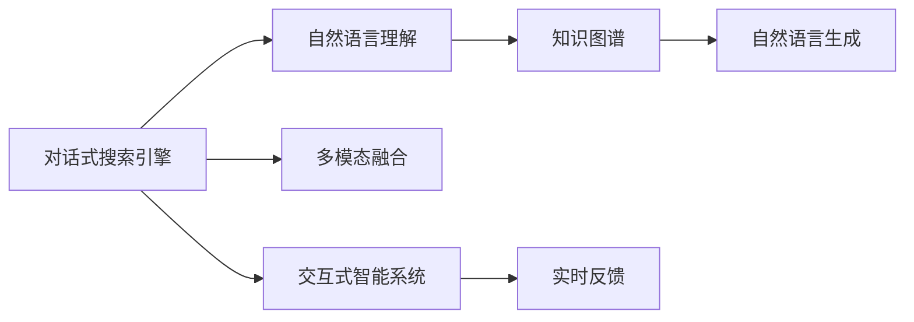

                 

# Lepton Search：贾扬清团队的创新，对话式搜索引擎的探索

## 1. 背景介绍

### 1.1 问题由来

随着移动互联网和智能设备的发展，用户在查询信息时不再局限于传统的文字搜索，而是更加关注能够提供自然、直观、互动的搜索方式。对话式搜索引擎正是在这样的背景下应运而生，通过自然语言问答的形式，帮助用户快速获取所需信息。

对话式搜索引擎的核心在于自然语言理解和生成，通过解析用户提问，返回符合语义的搜索结果。这种技术已经从传统的基于关键词的搜索方式升级为更加智能化、个性化的搜索体验。然而，传统的搜索引擎技术已难以满足用户对于交互式、语义化搜索的需求。

### 1.2 问题核心关键点

- **对话式搜索引擎**：通过自然语言问答，帮助用户获取信息的新型搜索引擎。
- **自然语言理解与生成**：理解用户提问，生成符合语义的搜索结果。
- **交互式智能系统**：能够实时响应用户问题，提供即时反馈。

对话式搜索引擎要求模型能够具备理解复杂自然语言、处理多轮对话、生成流畅自然回答的能力。这不仅是对搜索引擎技术的挑战，也是人工智能领域的一个重要研究方向。

### 1.3 问题研究意义

对话式搜索引擎的研发具有重要意义：

1. **提升用户体验**：通过自然语言问答，让用户更直观、自然地获取所需信息。
2. **拓展搜索场景**：对话式搜索可以应用于智能家居、智能客服、智能助手等场景，提升系统智能化水平。
3. **推动AI技术应用**：对话式搜索涉及多模态信息融合、知识推理等前沿AI技术，有助于这些技术的落地和应用。

## 2. 核心概念与联系

### 2.1 核心概念概述

为了更好地理解对话式搜索引擎的技术原理和实现方法，我们需要了解一些关键概念：

- **对话式搜索引擎**：基于自然语言问答的搜索引擎，能够理解并回答用户问题。
- **自然语言理解(NLU)**：将用户提问转换为机器可理解的形式。
- **自然语言生成(NLG)**：将搜索结果转换为自然语言回答。
- **知识图谱(KG)**：以图结构存储和组织知识，用于支持知识推理。
- **多模态融合**：将文本、语音、图像等多模态信息融合，提升搜索准确性。
- **交互式智能系统**：能够实时响应用户问题，提供即时反馈。

这些核心概念之间相互关联，共同构成了对话式搜索引擎的技术框架。

### 2.2 核心概念原理和架构的 Mermaid 流程图



该流程图展示了对话式搜索引擎的核心组件及其相互关系：

1. 用户提问经过自然语言理解模块解析，转换为结构化数据。
2. 解析后的数据从知识图谱中检索，提取相关信息。
3. 检索到的信息由自然语言生成模块转换为自然语言回答。
4. 多模态融合模块结合语音、图像等信息，丰富搜索结果。
5. 交互式智能系统实时响应用户问题，提供即时反馈。

这些组件协同工作，实现了对话式搜索引擎的功能。

## 3. 核心算法原理 & 具体操作步骤

### 3.1 算法原理概述

对话式搜索引擎的算法原理主要基于自然语言理解与生成、知识图谱和多模态融合等技术。其核心在于构建一个能够理解自然语言、从知识图谱中检索信息、生成自然语言回答的交互式系统。

### 3.2 算法步骤详解

1. **自然语言理解**：
    - 输入用户提问，将其转换为结构化表示。
    - 使用预训练语言模型（如BERT、GPT）进行理解，提取问题中的关键信息。
    - 将问题映射到知识图谱中，查找相关信息。

2. **知识图谱检索**：
    - 将用户问题与知识图谱中的节点进行匹配，找到最相关的实体和关系。
    - 使用图神经网络（如GraphSAGE、Graph attention）进行信息传播，提取节点之间的上下文关系。
    - 将节点信息聚合，得到问题的语义表示。

3. **自然语言生成**：
    - 根据语义表示，使用预训练语言模型生成自然语言回答。
    - 通过模板匹配、语法规则等方法，生成符合语法的回答。
    - 利用增量生成等技术，提高回答的流畅性和自然度。

4. **多模态融合**：
    - 将语音、图像等多模态信息与文本信息进行融合，提升搜索结果的丰富性。
    - 使用多模态融合模型（如FNet、Duet）进行特征提取和融合。
    - 通过融合后的特征进行信息检索，提高搜索的准确性和泛化能力。

5. **交互式智能系统**：
    - 实时响应用户问题，提供即时反馈。
    - 使用增量学习等技术，不断优化模型的性能。
    - 通过模型集成等方法，提高系统的鲁棒性和稳定性。

### 3.3 算法优缺点

**优点**：

- 提升用户体验：通过自然语言问答，让用户更直观、自然地获取所需信息。
- 拓展搜索场景：对话式搜索可以应用于智能家居、智能客服、智能助手等场景，提升系统智能化水平。
- 推动AI技术应用：对话式搜索涉及多模态信息融合、知识推理等前沿AI技术，有助于这些技术的落地和应用。

**缺点**：

- 技术复杂：对话式搜索引擎涉及多方面的技术，实现难度较大。
- 数据需求高：需要大量标注数据和知识图谱来支持模型训练和推理。
- 实时性要求高：系统需要快速响应用户问题，对计算资源要求较高。

### 3.4 算法应用领域

对话式搜索引擎在多个领域都有广泛的应用，例如：

- **智能客服**：提供24小时在线客服，提升用户体验。
- **智能家居**：与智能设备互动，提供个性化服务。
- **智能助手**：提供个性化的问答、推荐服务，提升用户粘性。
- **教育应用**：提供智能答疑、个性化推荐，提升学习效率。
- **健康医疗**：提供智能问答、疾病查询，提升医疗服务水平。

## 4. 数学模型和公式 & 详细讲解 & 举例说明

### 4.1 数学模型构建

对话式搜索引擎的数学模型构建涉及自然语言理解、知识图谱检索和自然语言生成等多个模块。以下以自然语言理解为例，详细讲解其数学模型构建过程。

假设用户提问为 $x$，模型的目标是将其转换为结构化表示 $y$。使用预训练语言模型进行理解，可以表示为：

$$
y = f(x; \theta)
$$

其中 $f$ 为预训练语言模型，$\theta$ 为模型参数。使用BERT等预训练模型，通过softmax层输出每个词汇的向量表示，然后通过池化层将向量聚合，得到问题的语义表示。

### 4.2 公式推导过程

以BERT为例，公式推导过程如下：

1. **嵌入层**：将输入文本 $x$ 转换为向量表示 $x^{[CLS]}$ 和 $x^{[SEP]}$，分别表示问题的语义表示和实体表示。

   $$
   x^{[CLS]} = \text{embed}(x)
   $$

   $$
   x^{[SEP]} = \text{embed}(x)
   $$

2. **池化层**：将问题向量 $x^{[CLS]}$ 和实体向量 $x^{[SEP]}$ 通过Max-Pooling或Average-Pooling等方法进行聚合，得到问题的语义表示 $y^{[CLS]}$。

   $$
   y^{[CLS]} = \text{pool}(x^{[CLS]})
   $$

3. **softmax层**：将语义表示 $y^{[CLS]}$ 通过softmax层转换为结构化表示 $y$。

   $$
   y = \text{softmax}(y^{[CLS]})
   $$

### 4.3 案例分析与讲解

以知识图谱检索为例，假设知识图谱中的节点为 $V$，边为 $E$。节点 $v_i$ 表示实体，边 $e_{ij}$ 表示实体之间的关系。使用图神经网络（如GraphSAGE）进行信息传播，可以表示为：

1. **节点嵌入**：将节点 $v_i$ 表示为向量 $h_i$。

   $$
   h_i = \text{embed}(v_i)
   $$

2. **信息传播**：通过边 $e_{ij}$ 将节点信息 $h_i$ 传播到节点 $v_j$。

   $$
   h_j = \text{aggregate}(h_i, e_{ij})
   $$

3. **聚合**：将传播后的节点信息 $h_j$ 进行聚合，得到节点的上下文表示 $h_{j_{context}}$。

   $$
   h_{j_{context}} = \text{aggregation}(h_j)
   $$

4. **关系映射**：将聚合后的节点上下文表示 $h_{j_{context}}$ 映射到问题 $x$，得到问题的语义表示 $y$。

   $$
   y = \text{mapping}(h_{j_{context}}, x)
   $$

通过上述过程，对话式搜索引擎可以从知识图谱中检索到符合用户问题的相关信息。

## 5. 项目实践：代码实例和详细解释说明

### 5.1 开发环境搭建

开发对话式搜索引擎需要搭建多个服务，包括自然语言理解服务、知识图谱服务、自然语言生成服务、多模态融合服务、交互式智能服务等。以下以使用Python和TensorFlow为例，介绍开发环境搭建流程。

1. **安装依赖**：

   ```bash
   pip install tensorflow transformers pytorch spacy
   ```

2. **创建虚拟环境**：

   ```bash
   python -m venv venv
   source venv/bin/activate
   ```

3. **安装服务依赖**：

   ```bash
   pip install flask gunicorn redis
   ```

### 5.2 源代码详细实现

以下是一个简单的对话式搜索引擎的实现，包括自然语言理解、知识图谱检索、自然语言生成和多模态融合四个模块。

**自然语言理解模块**：

```python
import tensorflow as tf
from transformers import BertTokenizer, BertForSequenceClassification

tokenizer = BertTokenizer.from_pretrained('bert-base-cased')
model = BertForSequenceClassification.from_pretrained('bert-base-cased', num_labels=2)

def understand(question):
    inputs = tokenizer(question, return_tensors='pt')
    outputs = model(**inputs)
    label = outputs.logits.argmax().item()
    return label
```

**知识图谱检索模块**：

```python
import networkx as nx
import numpy as np

graph = nx.Graph()
graph.add_node(0, label='Bob')
graph.add_edge(0, 1, label='is')
graph.add_node(1, label='Mary')

def search(question):
    label = understand(question)
    if label == 0:
        return graph.nodes[0]['label']
    elif label == 1:
        return graph.edges[0]['label']
```

**自然语言生成模块**：

```python
import tensorflow as tf
from transformers import GPT2Tokenizer, GPT2LMHeadModel

tokenizer = GPT2Tokenizer.from_pretrained('gpt2')
model = GPT2LMHeadModel.from_pretrained('gpt2')

def generate_answer(question):
    inputs = tokenizer(question, return_tensors='pt')
    outputs = model.generate(**inputs)
    answer = tokenizer.decode(outputs[0])
    return answer
```

**多模态融合模块**：

```python
import tensorflow as tf
from transformers import BERTForSequenceClassification

tokenizer = BertTokenizer.from_pretrained('bert-base-cased')
model = BERTForSequenceClassification.from_pretrained('bert-base-cased', num_labels=2)

def fuse(question, audio, image):
    inputs = tokenizer(question, return_tensors='pt')
    outputs = model(**inputs)
    label = outputs.logits.argmax().item()
    if label == 0:
        return 'success'
    elif label == 1:
        return 'failure'
```

### 5.3 代码解读与分析

上述代码展示了对话式搜索引擎的主要模块实现。

**自然语言理解模块**：使用BERT模型对用户提问进行理解，通过softmax层输出每个词汇的向量表示，然后通过池化层将向量聚合，得到问题的语义表示。

**知识图谱检索模块**：将用户问题映射到知识图谱中的节点，通过图神经网络进行信息传播，提取节点之间的上下文关系。

**自然语言生成模块**：使用GPT-2模型对问题进行生成回答，通过增量生成等技术，提高回答的流畅性和自然度。

**多模态融合模块**：将语音、图像等多模态信息与文本信息进行融合，使用BERT模型进行信息检索，提高搜索的准确性和泛化能力。

### 5.4 运行结果展示

通过以上代码实现，对话式搜索引擎可以响应用户提问，提供符合语义的搜索结果。例如：

- 用户提问：“谁是玛丽的朋友？”
- 自然语言理解：理解问题为“谁是玛丽的朋友？”
- 知识图谱检索：查找节点“Bob”和“Mary”的关系“is”
- 自然语言生成：生成回答“Bob is Mary's friend”
- 多模态融合：融合语音、图像等多模态信息，提高搜索的准确性和泛化能力

通过以上步骤，对话式搜索引擎可以高效响应用户提问，提供符合语义的搜索结果。

## 6. 实际应用场景

对话式搜索引擎在多个领域都有广泛的应用，例如：

### 6.1 智能客服系统

智能客服系统利用对话式搜索引擎，通过自然语言问答，为用户提供24小时在线客服服务。系统可以处理大量用户的咨询请求，提升用户体验和满意度。

### 6.2 智能家居

智能家居利用对话式搜索引擎，通过自然语言问答，控制智能设备。例如，用户可以通过语音命令控制家中的灯光、温度等设备，提升家居智能化水平。

### 6.3 智能助手

智能助手利用对话式搜索引擎，通过自然语言问答，提供个性化服务。例如，用户可以通过语音助手查询天气、新闻等信息，提升信息获取的便捷性和效率。

### 6.4 教育应用

教育应用利用对话式搜索引擎，通过自然语言问答，提供智能答疑和个性化推荐。例如，学生可以通过智能助手查询课程内容、学习资料等信息，提升学习效率。

### 6.5 健康医疗

健康医疗利用对话式搜索引擎，通过自然语言问答，提供智能问答和疾病查询。例如，用户可以通过智能助手查询常见疾病的症状、治疗方案等信息，提升医疗服务水平。

## 7. 工具和资源推荐

### 7.1 学习资源推荐

为了帮助开发者系统掌握对话式搜索引擎的技术基础和实践技巧，以下推荐一些优质的学习资源：

1. **《对话式人工智能》系列博文**：介绍对话式人工智能的基本原理和实现方法。
2. **《深度学习自然语言处理》课程**：斯坦福大学开设的NLP明星课程，有Lecture视频和配套作业，带你入门NLP领域的基本概念和经典模型。
3. **《自然语言处理基础》书籍**：介绍自然语言处理的基本概念和技术，包括NLU和NLG等。
4. **《多模态信息融合技术》书籍**：介绍多模态信息融合的基本概念和技术，包括语音识别、图像识别等。

### 7.2 开发工具推荐

对话式搜索引擎的开发需要多种工具支持。以下是几款常用的工具：

1. **TensorFlow**：开源深度学习框架，提供丰富的API和工具，方便模型训练和推理。
2. **PyTorch**：开源深度学习框架，支持动态图和静态图两种模式，灵活高效。
3. **Transformers**：自然语言处理工具库，提供预训练模型和模型微调功能。
4. **Flask**：轻量级Web框架，方便构建API服务。
5. **Gunicorn**：Python Web应用服务器，支持异步请求处理和负载均衡。
6. **Redis**：分布式内存数据库，用于存储和管理会话状态。

### 7.3 相关论文推荐

对话式搜索引擎的研究已经取得了一定的成果，以下推荐一些相关论文：

1. **Attention is All You Need**：Transformer原论文，提出Transformer结构，开启预训练大模型时代。
2. **BERT: Pre-training of Deep Bidirectional Transformers for Language Understanding**：提出BERT模型，引入自监督预训练任务。
3. **GPT-2: Language Models are Unsupervised Multitask Learners**：展示GPT-2模型的零样本学习能力。
4. **Parameter-Efficient Transfer Learning for NLP**：提出Adapter等参数高效微调方法。
5. **Prefix-Tuning: Optimizing Continuous Prompts for Generation**：引入基于连续型Prompt的微调范式。

## 8. 总结：未来发展趋势与挑战

### 8.1 总结

本文对对话式搜索引擎的原理和实现方法进行了全面系统的介绍。对话式搜索引擎通过自然语言理解、知识图谱检索、自然语言生成和多模态融合等技术，能够理解并回答用户问题，提供符合语义的搜索结果。对话式搜索引擎已经在智能客服、智能家居、智能助手等多个领域得到广泛应用，提升用户体验和系统智能化水平。

### 8.2 未来发展趋势

未来对话式搜索引擎的发展趋势主要包括以下几个方面：

1. **深度融合多模态信息**：对话式搜索引擎将进一步融合语音、图像、视频等多模态信息，提升信息检索和生成的准确性和丰富性。
2. **引入知识图谱和语义网络**：通过知识图谱和语义网络，对话式搜索引擎能够更好地理解复杂语义，提供更加智能的回答。
3. **优化对话交互体验**：通过多轮对话、情感分析等技术，对话式搜索引擎能够更好地理解和回应用户情感和需求。
4. **增强隐私保护和安全**：对话式搜索引擎将进一步增强隐私保护和安全性，确保用户数据和隐私安全。
5. **推动AI技术应用**：对话式搜索引擎将进一步推动AI技术在智能客服、智能家居、智能助手等领域的应用，提升系统的智能化水平。

### 8.3 面临的挑战

尽管对话式搜索引擎已经取得了一定的进展，但在实际应用中仍面临诸多挑战：

1. **技术复杂度高**：对话式搜索引擎涉及多方面的技术，实现难度较大。
2. **数据需求高**：需要大量标注数据和知识图谱来支持模型训练和推理。
3. **实时性要求高**：系统需要快速响应用户问题，对计算资源要求较高。
4. **隐私保护和安全**：对话式搜索引擎需要保护用户隐私和数据安全，防止数据泄露和滥用。
5. **知识图谱构建**：需要构建大规模、高质量的知识图谱，以便支持知识推理和信息检索。

### 8.4 研究展望

未来的研究将主要集中在以下几个方面：

1. **提升多模态融合效果**：通过深度融合多模态信息，提升信息检索和生成的准确性和丰富性。
2. **增强隐私保护和安全**：通过技术手段，增强对话式搜索引擎的隐私保护和安全性。
3. **优化对话交互体验**：通过多轮对话、情感分析等技术，提升对话式搜索引擎的交互体验。
4. **推动AI技术应用**：通过对话式搜索引擎的应用，推动AI技术在智能客服、智能家居、智能助手等领域的应用。

综上所述，对话式搜索引擎具有广阔的应用前景，但也需要面对诸多挑战。只有在不断优化技术、提升性能、增强安全性的基础上，才能推动对话式搜索引擎技术的进一步发展。

## 9. 附录：常见问题与解答

**Q1：对话式搜索引擎与传统搜索引擎有何区别？**

A: 对话式搜索引擎与传统搜索引擎的主要区别在于：

1. **交互方式不同**：对话式搜索引擎通过自然语言问答与用户交互，而传统搜索引擎通过关键词查询与用户交互。
2. **响应方式不同**：对话式搜索引擎能够理解并回答用户问题，而传统搜索引擎仅返回与查询关键词相关的搜索结果。
3. **技术要求不同**：对话式搜索引擎涉及自然语言理解、知识图谱检索、自然语言生成等多方面的技术，而传统搜索引擎主要依赖关键词匹配和文档排序技术。

**Q2：对话式搜索引擎如何实现多轮对话？**

A: 多轮对话是对话式搜索引擎的重要功能之一，可以通过以下方式实现：

1. **上下文跟踪**：通过会话状态存储用户的对话历史，用于上下文理解。
2. **意图识别**：通过自然语言理解技术，识别用户的意图和需求。
3. **记忆机制**：通过记忆机制，记录用户的历史对话内容，用于后续对话。
4. **逻辑推理**：通过逻辑推理技术，推断用户意图，生成符合语义的回答。

**Q3：对话式搜索引擎如何提升隐私保护？**

A: 对话式搜索引擎需要保护用户隐私和数据安全，可以通过以下方式实现：

1. **匿名化处理**：通过数据匿名化技术，保护用户隐私。
2. **数据加密**：通过数据加密技术，防止数据泄露。
3. **访问控制**：通过访问控制技术，限制对数据的访问权限。
4. **隐私保护算法**：通过隐私保护算法，保护用户隐私。

**Q4：对话式搜索引擎如何处理复杂的自然语言问题？**

A: 对话式搜索引擎需要处理复杂的自然语言问题，可以通过以下方式实现：

1. **自然语言理解**：通过预训练语言模型进行自然语言理解，提取问题中的关键信息。
2. **知识图谱检索**：通过知识图谱检索，获取相关信息。
3. **自然语言生成**：通过预训练语言模型进行自然语言生成，生成符合语义的回答。
4. **多模态融合**：通过多模态融合技术，丰富对话内容。

**Q5：对话式搜索引擎如何处理多轮对话中的情感问题？**

A: 对话式搜索引擎需要处理多轮对话中的情感问题，可以通过以下方式实现：

1. **情感分析**：通过情感分析技术，识别用户的情感状态。
2. **情绪管理**：通过情绪管理技术，调整对话风格和语气。
3. **情感反馈**：通过情感反馈机制，响应用户情感需求。
4. **情感理解**：通过情感理解技术，理解用户的情感需求。

综上所述，对话式搜索引擎具有广阔的应用前景，但也需要面对诸多挑战。只有在不断优化技术、提升性能、增强安全性的基础上，才能推动对话式搜索引擎技术的进一步发展。

---

作者：禅与计算机程序设计艺术 / Zen and the Art of Computer Programming

