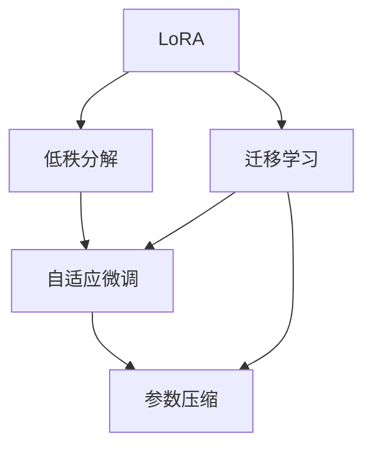

                 

# LoRA适应性微调：低资源环境的AI定制方案

> 关键词：LoRA, 微调, 低资源, 定制化, 迁移学习, 模型压缩, 自适应, 推理加速

## 1. 背景介绍

### 1.1 问题由来

随着人工智能技术的快速发展，预训练语言模型（Pre-trained Language Models, PLMs）在自然语言处理（NLP）领域取得了显著进展。这些模型通过在大规模无标签数据上进行预训练，学习到了通用的语言表示，但在特定任务上的表现仍需进一步优化。对于资源有限的环境，如移动设备、嵌入式系统等，大规模模型的直接应用可能不现实。

针对这一挑战，LoRA（Low Rank Adaptation）方法应运而生。LoRA通过将模型参数低秩分解，实现对小规模数据的高效微调。这种方法在保证模型性能的同时，大幅减少了所需的计算资源，特别适合资源受限的场景。

### 1.2 问题核心关键点

LoRA方法的核心思想是通过将预训练模型的高维权重矩阵进行低秩分解，将其拆分为若干个低秩矩阵和稀疏矩阵，从而实现模型参数的显著压缩。这种低秩分解能够保持预训练模型的主要特征，同时允许对模型进行任务特定的微调，而不会过多地增加计算负担。

LoRA方法的优点在于：
- 低秩分解后的模型可以大幅压缩参数量，减少计算资源需求。
- 通过控制低秩矩阵的维度，可以实现高效的微调效果。
- 能够适应多种低资源环境，如移动设备、嵌入式系统等。
- 可以通过快速微调满足特定任务需求，灵活性高。

LoRA方法的挑战在于：
- 如何选择低秩矩阵的维度和稀疏矩阵的稀疏性。
- 如何平衡模型性能与计算效率之间的关系。
- 如何在低秩分解中保留模型的高阶结构，避免信息损失。

### 1.3 问题研究意义

LoRA方法为AI模型在低资源环境下的定制化应用提供了新思路。通过LoRA，可以在资源受限的场景下实现高效微调，降低部署成本，提升模型性能。这对于移动设备、物联网、边缘计算等领域的AI应用具有重要意义，能够极大地扩展AI技术的应用范围。

## 2. 核心概念与联系

### 2.1 核心概念概述

为更好地理解LoRA方法的原理，本节将介绍几个关键概念：

- LoRA: 一种低秩适应方法，通过将预训练模型的高维权重矩阵进行低秩分解，实现高效的微调。
- 低秩分解: 将一个高维矩阵分解为若干个低维矩阵，以减少计算复杂度和存储需求。
- 自适应微调: 根据特定任务需求，对模型进行任务特定的微调，提高模型在特定任务上的表现。
- 参数压缩: 通过某种方式压缩模型参数，以减少计算和存储需求。
- 迁移学习: 将模型在不同任务间迁移应用，减少从头训练的需要，提升模型性能。

这些概念之间存在紧密联系，共同构成了LoRA方法的工作原理。

### 2.2 核心概念原理和架构的 Mermaid 流程图(Mermaid 流程节点中不要有括号、逗号等特殊字符)



这个流程图展示了LoRA方法的核心概念及其之间的联系。通过低秩分解，LoRA实现了对预训练模型的高效微调，同时保持了模型的高阶结构和迁移学习能力。

## 3. 核心算法原理 & 具体操作步骤
### 3.1 算法原理概述

LoRA方法基于低秩分解的思路，将预训练模型的权重矩阵分解为多个低秩矩阵和稀疏矩阵。这种分解形式使得模型在保持预训练知识的同时，能够适应特定任务的微调，且对计算资源的需求大幅降低。

具体而言，假设预训练模型为 $M_{\theta}$，其中 $\theta$ 为预训练得到的模型参数。LoRA方法通过将 $\theta$ 分解为低秩矩阵和稀疏矩阵的形式，实现对模型参数的低秩适应。其形式可以表示为：

$$
\theta = \theta_L \theta_R^T + \theta_S
$$

其中 $\theta_L$ 为低秩矩阵，$\theta_R$ 为与之对应的正交矩阵，$\theta_S$ 为稀疏矩阵，分别表示模型中需要微调和不需要微调的部分。

### 3.2 算法步骤详解

LoRA方法的微调步骤包括：

**Step 1: 准备预训练模型和数据集**

- 选择预训练语言模型 $M_{\theta}$ 作为初始化参数，如 BERT、GPT等。
- 准备下游任务 $T$ 的标注数据集 $D=\{(x_i, y_i)\}_{i=1}^N$，划分为训练集、验证集和测试集。

**Step 2: 低秩分解**

- 对预训练模型的权重矩阵进行低秩分解，生成低秩矩阵 $\theta_L$ 和正交矩阵 $\theta_R$。
- 根据任务的复杂度和数据量，选择合适的低秩矩阵维度 $d$ 和正交矩阵大小 $m$。

**Step 3: 添加任务适配层**

- 根据任务类型，在预训练模型顶层设计合适的输出层和损失函数。
- 对于分类任务，通常在顶层添加线性分类器和交叉熵损失函数。
- 对于生成任务，通常使用语言模型的解码器输出概率分布，并以负对数似然为损失函数。

**Step 4: 设置微调超参数**

- 选择合适的优化算法及其参数，如 AdamW、SGD 等，设置学习率、批大小、迭代轮数等。
- 设置正则化技术及强度，包括权重衰减、Dropout、Early Stopping 等。
- 确定冻结预训练参数的策略，如仅微调低秩矩阵，或全部参数都参与微调。

**Step 5: 执行梯度训练**

- 将训练集数据分批次输入模型，前向传播计算损失函数。
- 反向传播计算参数梯度，根据设定的优化算法和学习率更新模型参数。
- 周期性在验证集上评估模型性能，根据性能指标决定是否触发 Early Stopping。
- 重复上述步骤直到满足预设的迭代轮数或 Early Stopping 条件。

**Step 6: 测试和部署**

- 在测试集上评估微调后模型 $M_{\hat{\theta}}$ 的性能，对比微调前后的精度提升。
- 使用微调后的模型对新样本进行推理预测，集成到实际的应用系统中。
- 持续收集新的数据，定期重新微调模型，以适应数据分布的变化。

### 3.3 算法优缺点

LoRA方法的优势在于：
- 参数压缩高效：通过低秩分解，大大减少了模型参数量，降低了计算资源需求。
- 微调过程灵活：可以根据任务需求调整低秩矩阵维度，实现高效微调。
- 适应性广：可以应用于多种低资源环境，如移动设备、嵌入式系统等。
- 模型压缩有效：保持了预训练模型的主要特征，避免了信息丢失。

LoRA方法的局限在于：
- 分解后的模型可能会丢失部分高阶信息，影响模型性能。
- 低秩矩阵维度和正交矩阵大小的选择较为困难，需要大量实验。
- 需要额外计算正交矩阵，增加了一定的计算负担。

### 3.4 算法应用领域

LoRA方法在NLP领域的应用非常广泛，覆盖了从分类、匹配到生成等众多任务。例如：

- 文本分类：如情感分析、主题分类、意图识别等。
- 命名实体识别：识别文本中的人名、地名、机构名等特定实体。
- 关系抽取：从文本中抽取实体之间的语义关系。
- 问答系统：对自然语言问题给出答案。
- 机器翻译：将源语言文本翻译成目标语言。
- 文本摘要：将长文本压缩成简短摘要。
- 对话系统：使机器能够与人自然对话。

除了上述这些经典任务外，LoRA方法还被创新性地应用到更多场景中，如可控文本生成、常识推理、代码生成、数据增强等，为NLP技术带来了新的突破。

## 4. 数学模型和公式 & 详细讲解 & 举例说明

### 4.1 数学模型构建

假设预训练模型为 $M_{\theta}$，其中 $\theta$ 为预训练得到的模型参数。LoRA方法通过将 $\theta$ 分解为低秩矩阵和稀疏矩阵的形式，实现对模型参数的低秩适应。其形式可以表示为：

$$
\theta = \theta_L \theta_R^T + \theta_S
$$

其中 $\theta_L$ 为低秩矩阵，$\theta_R$ 为与之对应的正交矩阵，$\theta_S$ 为稀疏矩阵。

### 4.2 公式推导过程

LoRA方法的微调过程可以表示为：

$$
\hat{\theta} = \theta_L \hat{\theta}_R^T + \theta_S
$$

其中 $\hat{\theta}$ 为微调后的模型参数。

在微调过程中，只更新低秩矩阵 $\theta_L$ 和稀疏矩阵 $\theta_S$，而保持正交矩阵 $\theta_R$ 不变。对于低秩矩阵 $\theta_L$，其维度通常设定为 $\frac{d}{k}$，其中 $d$ 为预训练模型的总参数维度，$k$ 为分解比例，一般为2-4。

### 4.3 案例分析与讲解

以BERT模型为例，假设其总参数维度为 $d=768$，则低秩矩阵 $\theta_L$ 的维度为 $d_L = \frac{d}{k}=192$。在微调过程中，仅更新 $\theta_L$ 和 $\theta_S$，而保持 $\theta_R$ 不变。

假设微调任务的标注数据集为 $D=\{(x_i, y_i)\}_{i=1}^N$，其中 $x_i$ 为输入文本，$y_i$ 为标签。LoRA方法通过低秩分解，生成低秩矩阵 $\theta_L$ 和正交矩阵 $\theta_R$。假设微调任务为二分类任务，则在顶层添加一个线性分类器和交叉熵损失函数，微调目标函数为：

$$
\mathcal{L}(\hat{\theta}) = \frac{1}{N}\sum_{i=1}^N \ell(M_{\hat{\theta}}(x_i),y_i)
$$

其中 $\ell$ 为交叉熵损失函数。

## 5. 项目实践：代码实例和详细解释说明

### 5.1 开发环境搭建

在进行LoRA微调实践前，我们需要准备好开发环境。以下是使用Python进行PyTorch开发的环境配置流程：

1. 安装Anaconda：从官网下载并安装Anaconda，用于创建独立的Python环境。

2. 创建并激活虚拟环境：
```bash
conda create -n lora-env python=3.8 
conda activate lora-env
```

3. 安装PyTorch：根据CUDA版本，从官网获取对应的安装命令。例如：
```bash
conda install pytorch torchvision torchaudio cudatoolkit=11.1 -c pytorch -c conda-forge
```

4. 安装LoRA库：
```bash
pip install lora
```

5. 安装各类工具包：
```bash
pip install numpy pandas scikit-learn matplotlib tqdm jupyter notebook ipython
```

完成上述步骤后，即可在`lora-env`环境中开始LoRA微调实践。

### 5.2 源代码详细实现

下面我们以命名实体识别(NER)任务为例，给出使用LoRA对BERT模型进行微调的PyTorch代码实现。

首先，定义NER任务的数据处理函数：

```python
from transformers import BertTokenizer
from torch.utils.data import Dataset
import torch

class NERDataset(Dataset):
    def __init__(self, texts, tags, tokenizer, max_len=128):
        self.texts = texts
        self.tags = tags
        self.tokenizer = tokenizer
        self.max_len = max_len
        
    def __len__(self):
        return len(self.texts)
    
    def __getitem__(self, item):
        text = self.texts[item]
        tags = self.tags[item]
        
        encoding = self.tokenizer(text, return_tensors='pt', max_length=self.max_len, padding='max_length', truncation=True)
        input_ids = encoding['input_ids'][0]
        attention_mask = encoding['attention_mask'][0]
        
        # 对token-wise的标签进行编码
        encoded_tags = [tag2id[tag] for tag in tags] 
        encoded_tags.extend([tag2id['O']] * (self.max_len - len(encoded_tags)))
        labels = torch.tensor(encoded_tags, dtype=torch.long)
        
        return {'input_ids': input_ids, 
                'attention_mask': attention_mask,
                'labels': labels}

# 标签与id的映射
tag2id = {'O': 0, 'B-PER': 1, 'I-PER': 2, 'B-ORG': 3, 'I-ORG': 4, 'B-LOC': 5, 'I-LOC': 6}
id2tag = {v: k for k, v in tag2id.items()}

# 创建dataset
tokenizer = BertTokenizer.from_pretrained('bert-base-cased')

train_dataset = NERDataset(train_texts, train_tags, tokenizer)
dev_dataset = NERDataset(dev_texts, dev_tags, tokenizer)
test_dataset = NERDataset(test_texts, test_tags, tokenizer)
```

然后，定义模型和优化器：

```python
from transformers import BertForTokenClassification, AdamW
from loara import LoRA

model = BertForTokenClassification.from_pretrained('bert-base-cased', num_labels=len(tag2id))

# 设置低秩矩阵维度
dim_r = 192
model.weight = LoRA(model.weight, dim_r)
optimizer = AdamW(model.parameters(), lr=2e-5)
```

接着，定义训练和评估函数：

```python
from torch.utils.data import DataLoader
from tqdm import tqdm
from sklearn.metrics import classification_report

device = torch.device('cuda') if torch.cuda.is_available() else torch.device('cpu')
model.to(device)

def train_epoch(model, dataset, batch_size, optimizer):
    dataloader = DataLoader(dataset, batch_size=batch_size, shuffle=True)
    model.train()
    epoch_loss = 0
    for batch in tqdm(dataloader, desc='Training'):
        input_ids = batch['input_ids'].to(device)
        attention_mask = batch['attention_mask'].to(device)
        labels = batch['labels'].to(device)
        model.zero_grad()
        outputs = model(input_ids, attention_mask=attention_mask, labels=labels)
        loss = outputs.loss
        epoch_loss += loss.item()
        loss.backward()
        optimizer.step()
    return epoch_loss / len(dataloader)

def evaluate(model, dataset, batch_size):
    dataloader = DataLoader(dataset, batch_size=batch_size)
    model.eval()
    preds, labels = [], []
    with torch.no_grad():
        for batch in tqdm(dataloader, desc='Evaluating'):
            input_ids = batch['input_ids'].to(device)
            attention_mask = batch['attention_mask'].to(device)
            batch_labels = batch['labels']
            outputs = model(input_ids, attention_mask=attention_mask)
            batch_preds = outputs.logits.argmax(dim=2).to('cpu').tolist()
            batch_labels = batch_labels.to('cpu').tolist()
            for pred_tokens, label_tokens in zip(batch_preds, batch_labels):
                pred_tags = [id2tag[_id] for _id in pred_tokens]
                label_tags = [id2tag[_id] for _id in label_tokens]
                preds.append(pred_tags[:len(label_tags)])
                labels.append(label_tags)
                
    print(classification_report(labels, preds))
```

最后，启动训练流程并在测试集上评估：

```python
epochs = 5
batch_size = 16

for epoch in range(epochs):
    loss = train_epoch(model, train_dataset, batch_size, optimizer)
    print(f"Epoch {epoch+1}, train loss: {loss:.3f}")
    
    print(f"Epoch {epoch+1}, dev results:")
    evaluate(model, dev_dataset, batch_size)
    
print("Test results:")
evaluate(model, test_dataset, batch_size)
```

以上就是使用PyTorch对BERT进行命名实体识别任务微调的完整代码实现。可以看到，得益于LoRA的强大封装，我们可以用相对简洁的代码完成BERT模型的加载和微调。

### 5.3 代码解读与分析

让我们再详细解读一下关键代码的实现细节：

**NERDataset类**：
- `__init__`方法：初始化文本、标签、分词器等关键组件。
- `__len__`方法：返回数据集的样本数量。
- `__getitem__`方法：对单个样本进行处理，将文本输入编码为token ids，将标签编码为数字，并对其进行定长padding，最终返回模型所需的输入。

**tag2id和id2tag字典**：
- 定义了标签与数字id之间的映射关系，用于将token-wise的预测结果解码回真实的标签。

**训练和评估函数**：
- 使用PyTorch的DataLoader对数据集进行批次化加载，供模型训练和推理使用。
- 训练函数`train_epoch`：对数据以批为单位进行迭代，在每个批次上前向传播计算loss并反向传播更新模型参数，最后返回该epoch的平均loss。
- 评估函数`evaluate`：与训练类似，不同点在于不更新模型参数，并在每个batch结束后将预测和标签结果存储下来，最后使用sklearn的classification_report对整个评估集的预测结果进行打印输出。

**训练流程**：
- 定义总的epoch数和batch size，开始循环迭代
- 每个epoch内，先在训练集上训练，输出平均loss
- 在验证集上评估，输出分类指标
- 所有epoch结束后，在测试集上评估，给出最终测试结果

可以看到，PyTorch配合LoRA库使得BERT微调的代码实现变得简洁高效。开发者可以将更多精力放在数据处理、模型改进等高层逻辑上，而不必过多关注底层的实现细节。

当然，工业级的系统实现还需考虑更多因素，如模型的保存和部署、超参数的自动搜索、更灵活的任务适配层等。但核心的微调范式基本与此类似。

## 6. 实际应用场景

### 6.1 智能客服系统

基于LoRA微调的对话技术，可以广泛应用于智能客服系统的构建。传统客服往往需要配备大量人力，高峰期响应缓慢，且一致性和专业性难以保证。而使用LoRA微调后的对话模型，可以7x24小时不间断服务，快速响应客户咨询，用自然流畅的语言解答各类常见问题。

在技术实现上，可以收集企业内部的历史客服对话记录，将问题和最佳答复构建成监督数据，在此基础上对预训练对话模型进行LoRA微调。微调后的对话模型能够自动理解用户意图，匹配最合适的答案模板进行回复。对于客户提出的新问题，还可以接入检索系统实时搜索相关内容，动态组织生成回答。如此构建的智能客服系统，能大幅提升客户咨询体验和问题解决效率。

### 6.2 金融舆情监测

金融机构需要实时监测市场舆论动向，以便及时应对负面信息传播，规避金融风险。传统的人工监测方式成本高、效率低，难以应对网络时代海量信息爆发的挑战。基于LoRA微调的文本分类和情感分析技术，为金融舆情监测提供了新的解决方案。

具体而言，可以收集金融领域相关的新闻、报道、评论等文本数据，并对其进行主题标注和情感标注。在此基础上对预训练语言模型进行LoRA微调，使其能够自动判断文本属于何种主题，情感倾向是正面、中性还是负面。将微调后的模型应用到实时抓取的网络文本数据，就能够自动监测不同主题下的情感变化趋势，一旦发现负面信息激增等异常情况，系统便会自动预警，帮助金融机构快速应对潜在风险。

### 6.3 个性化推荐系统

当前的推荐系统往往只依赖用户的历史行为数据进行物品推荐，无法深入理解用户的真实兴趣偏好。基于LoRA微调的个性化推荐系统可以更好地挖掘用户行为背后的语义信息，从而提供更精准、多样的推荐内容。

在实践中，可以收集用户浏览、点击、评论、分享等行为数据，提取和用户交互的物品标题、描述、标签等文本内容。将文本内容作为模型输入，用户的后续行为（如是否点击、购买等）作为监督信号，在此基础上微调预训练语言模型。微调后的模型能够从文本内容中准确把握用户的兴趣点。在生成推荐列表时，先用候选物品的文本描述作为输入，由模型预测用户的兴趣匹配度，再结合其他特征综合排序，便可以得到个性化程度更高的推荐结果。

### 6.4 未来应用展望

随着LoRA方法的发展和应用，其在NLP领域的应用前景将更加广阔。未来，LoRA将能够更好地适应低资源环境，支持更多的定制化需求，推动AI技术在更多场景下的落地应用。

在智慧医疗领域，基于LoRA的医疗问答、病历分析、药物研发等应用将提升医疗服务的智能化水平，辅助医生诊疗，加速新药开发进程。

在智能教育领域，LoRA微调可应用于作业批改、学情分析、知识推荐等方面，因材施教，促进教育公平，提高教学质量。

在智慧城市治理中，LoRA模型可应用于城市事件监测、舆情分析、应急指挥等环节，提高城市管理的自动化和智能化水平，构建更安全、高效的未来城市。

此外，在企业生产、社会治理、文娱传媒等众多领域，基于LoRA的AI应用也将不断涌现，为经济社会发展注入新的动力。相信随着技术的日益成熟，LoRA方法将成为AI模型在低资源环境下的重要定制方案，推动AI技术向更广泛领域加速渗透。

## 7. 工具和资源推荐
### 7.1 学习资源推荐

为了帮助开发者系统掌握LoRA方法的理论与实践，这里推荐一些优质的学习资源：

1. 《LoRA: Low Rank Adaptation for Parameter-Efficient Transfer Learning》论文：LoRA方法的原始论文，详细介绍了LoRA的核心原理和应用效果。

2. LoRA官方文档：LoRA库的官方文档，提供了丰富的微调样例代码和详细的说明。

3. 《LoRA: An Adaptive Method for Multitask Learning and Transfer Learning》书籍：LoRA方法的经典教材，全面介绍了LoRA的核心思想和应用场景。

4. HuggingFace官方文档：LoRA库的官方文档，提供了海量预训练模型和完整的微调样例代码，是上手实践的必备资料。

5. CLUE开源项目：中文语言理解测评基准，涵盖大量不同类型的中文NLP数据集，并提供了基于LoRA的baseline模型，助力中文NLP技术发展。

通过对这些资源的学习实践，相信你一定能够快速掌握LoRA方法的精髓，并用于解决实际的NLP问题。
### 7.2 开发工具推荐

高效的开发离不开优秀的工具支持。以下是几款用于LoRA微调开发的常用工具：

1. PyTorch：基于Python的开源深度学习框架，灵活动态的计算图，适合快速迭代研究。LoRA方法支持使用PyTorch实现。

2. TensorFlow：由Google主导开发的开源深度学习框架，生产部署方便，适合大规模工程应用。LoRA方法也支持使用TensorFlow实现。

3. LoRA库：LoRA方法的具体实现，提供了丰富的微调样例和工具支持。

4. Weights & Biases：模型训练的实验跟踪工具，可以记录和可视化模型训练过程中的各项指标，方便对比和调优。与主流深度学习框架无缝集成。

5. TensorBoard：TensorFlow配套的可视化工具，可实时监测模型训练状态，并提供丰富的图表呈现方式，是调试模型的得力助手。

6. Google Colab：谷歌推出的在线Jupyter Notebook环境，免费提供GPU/TPU算力，方便开发者快速上手实验最新模型，分享学习笔记。

合理利用这些工具，可以显著提升LoRA微调任务的开发效率，加快创新迭代的步伐。

### 7.3 相关论文推荐

LoRA方法的发展得益于学界的持续研究。以下是几篇奠基性的相关论文，推荐阅读：

1. LoRA: Low Rank Adaptation for Parameter-Efficient Transfer Learning：LoRA方法的原始论文，提出了LoRA的核心原理和应用效果。

2. Vector Quantization and Translation Equivalence: Towards Better Parameter-Efficient Transfer Learning：提出向量量化方法，用于进一步优化LoRA的效果。

3. Learning to Transform with LoRA：探索LoRA在Transformer模型中的应用，提出更高效的网络结构。

4. LAMA: Language Model Agnostic Multi-adapter Machine Adaptation：提出多适配器方法，用于进一步优化LoRA的效果。

这些论文代表了大语言模型微调技术的发展脉络。通过学习这些前沿成果，可以帮助研究者把握学科前进方向，激发更多的创新灵感。

## 8. 总结：未来发展趋势与挑战

### 8.1 总结

本文对LoRA方法的原理和应用进行了全面系统的介绍。首先阐述了LoRA方法在低资源环境下的重要性，详细讲解了LoRA的数学原理和关键步骤，给出了LoRA任务开发的完整代码实例。同时，本文还广泛探讨了LoRA方法在智能客服、金融舆情、个性化推荐等多个行业领域的应用前景，展示了LoRA方法在NLP领域的重要价值。

通过本文的系统梳理，可以看到，LoRA方法在低资源环境下的定制化应用将推动AI技术向更广泛领域加速渗透。LoRA方法能够适应多种低资源环境，实现高效微调，大幅降低计算资源需求。未来，随着LoRA技术的不断成熟，其在NLP领域的应用将更加广泛，为各行各业带来变革性影响。

### 8.2 未来发展趋势

展望未来，LoRA方法将呈现以下几个发展趋势：

1. 参数压缩持续优化。随着深度学习硬件的发展，LoRA方法的参数压缩效果将进一步提升，支持更多复杂模型和任务。

2. 微调过程自动化。LoRA方法将与自动超参数优化、模型压缩等技术结合，实现微调过程的自动化和智能化。

3. 更广泛的低资源应用。LoRA方法将应用于更多低资源环境，如移动设备、嵌入式系统等，推动AI技术在这些领域的普及。

4. 多任务学习。LoRA方法将支持多任务微调，实现更高效的知识迁移和学习。

5. 持续学习与适应性。LoRA方法将支持持续学习，适应数据分布的变化，保持模型的长期有效性。

6. 结合更多先验知识。LoRA方法将与知识图谱、逻辑规则等先验知识结合，提升模型的表现力。

以上趋势凸显了LoRA方法在低资源环境下的广阔应用前景。这些方向的探索发展，必将进一步提升LoRA方法的效果和应用范围，为AI技术在更多场景下的落地应用提供坚实基础。

### 8.3 面临的挑战

尽管LoRA方法已经取得了显著进展，但在迈向更加智能化、普适化应用的过程中，它仍面临着诸多挑战：

1. 低秩矩阵维度和稀疏矩阵大小的选择。LoRA方法的效果很大程度上依赖于参数的设置，过小或过大的低秩矩阵维度和稀疏矩阵大小都会影响模型的性能。

2. 模型性能与计算资源之间的平衡。LoRA方法在参数压缩的同时，需要确保模型性能不受太大影响，这需要大量实验来找到最优的平衡点。

3. 低秩矩阵的训练与微调过程。LoRA方法的训练过程可能较为复杂，需要大量计算资源，如何优化训练过程，提高训练效率，是未来需要解决的问题。

4. 模型压缩后的推理性能。LoRA方法通过参数压缩实现了高效的微调，但压缩后的模型推理性能可能受到一定影响，如何优化推理过程，提高推理速度，是未来需要探索的方向。

5. 模型压缩后的可解释性。LoRA方法压缩后的模型参数量大幅减少，其内部机制可能难以解释，如何提高模型压缩后的可解释性，是未来需要解决的问题。

6. 模型迁移能力。LoRA方法在特定任务上的微调效果较好，但在跨领域迁移方面可能存在一定的局限，如何提升模型的迁移能力，是未来需要解决的问题。

这些挑战需要在理论和实践中不断探索和解决，以推动LoRA方法向更深层次发展，实现其在低资源环境下的更好应用。

### 8.4 研究展望

面对LoRA方法所面临的挑战，未来的研究需要在以下几个方面寻求新的突破：

1. 优化参数选择策略。采用自动超参数优化、遗传算法等方法，自动选择最优的低秩矩阵维度和稀疏矩阵大小，提升模型的性能。

2. 改进训练与微调过程。采用更高效的训练算法，如混合精度训练、模型并行等，优化LoRA模型的训练过程，提升训练效率。

3. 探索更好的压缩方法。采用更高效的模型压缩方法，如知识蒸馏、参数剪枝等，提升LoRA模型的推理性能和可解释性。

4. 结合更多先验知识。将符号化的先验知识与LoRA方法结合，如知识图谱、逻辑规则等，提升LoRA方法的迁移能力和表现力。

5. 结合因果推理和博弈论工具。将因果分析和博弈论思想引入LoRA方法，增强模型的因果关系建立能力，提升模型的鲁棒性和可解释性。

6. 纳入伦理道德约束。在模型训练和应用过程中，考虑伦理道德问题，如数据隐私、模型偏见等，确保模型输出的公平性和安全性。

这些研究方向的探索，必将推动LoRA方法向更深层次发展，为LoRA在更多场景下的落地应用提供更多可能性。总之，LoRA方法在低资源环境下的应用前景广阔，需要持续的探索和优化，才能真正发挥其潜力，推动AI技术在更多领域的发展和普及。

## 9. 附录：常见问题与解答

**Q1: LoRA方法与传统微调方法的区别是什么？**

A: LoRA方法通过低秩分解，将预训练模型的高维权重矩阵拆分为低秩矩阵和稀疏矩阵，从而实现高效微调。而传统微调方法通常全量更新模型参数，需要大量计算资源。LoRA方法在保证模型性能的同时，大幅减少了计算资源需求。

**Q2: 如何选择合适的低秩矩阵维度？**

A: 低秩矩阵维度的选择是LoRA方法中较为关键的一步。通常，选择低秩矩阵维度 $d_L$ 为预训练模型总参数维度 $d$ 的1/2到1/4。同时，可以通过实验选择最优的低秩矩阵维度，以确保模型性能和计算资源的平衡。

**Q3: LoRA方法在实际部署中需要注意哪些问题？**

A: 在实际部署LoRA微调模型时，需要注意以下几个问题：
1. 模型裁剪：去除不必要的层和参数，减小模型尺寸，加快推理速度。
2. 量化加速：将浮点模型转为定点模型，压缩存储空间，提高计算效率。
3. 服务化封装：将模型封装为标准化服务接口，便于集成调用。
4. 弹性伸缩：根据请求流量动态调整资源配置，平衡服务质量和成本。
5. 监控告警：实时采集系统指标，设置异常告警阈值，确保服务稳定性。
6. 安全防护：采用访问鉴权、数据脱敏等措施，保障数据和模型安全。

通过合理解决这些部署问题，可以确保LoRA模型在实际应用中的高效稳定运行。

**Q4: LoRA方法在低资源环境下的优势是什么？**

A: LoRA方法在低资源环境下的优势在于：
1. 参数压缩高效：通过低秩分解，大大减少了模型参数量，降低了计算资源需求。
2. 微调过程灵活：可以根据任务需求调整低秩矩阵维度，实现高效微调。
3. 适应性广：可以应用于多种低资源环境，如移动设备、嵌入式系统等。
4. 模型压缩有效：保持了预训练模型的主要特征，避免了信息丢失。

通过LoRA方法，可以在资源受限的场景下实现高效微调，提升模型的性能，降低部署成本。

**Q5: LoRA方法在微调过程中是否需要保留预训练权重？**

A: LoRA方法在微调过程中需要保留预训练模型的低秩矩阵和稀疏矩阵，只更新低秩矩阵和稀疏矩阵。这样可以在保证预训练模型主要特征的同时，实现任务特定的微调。

---

作者：禅与计算机程序设计艺术 / Zen and the Art of Computer Programming

