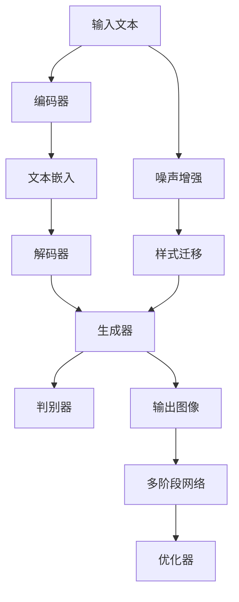

                 

# Midjourney原理与代码实例讲解

## 1. 背景介绍

Midjourney是一种基于深度生成模型的图像生成技术，由伦敦大学学院(UCL)的研究团队开发。通过训练一个包含多阶段网络的大模型，能够生成具有高度多样性和创造性的艺术作品。本文将详细介绍Midjourney的原理，并通过代码实例展示其实现过程，为读者提供全面深入的指南。

## 2. 核心概念与联系

### 2.1 核心概念概述

Midjourney的核心概念包括：

- 生成对抗网络（GAN）：一种由生成器和判别器组成的神经网络，用于生成高质量的图像。
- 多阶段网络：Midjourney采用多个阶段的生成器网络，逐步生成更复杂的图像。
- 自注意力机制：一种在生成网络中用于捕捉图像内部和空间结构的信息的机制。
- 噪声增强：在图像生成过程中，逐步加入噪声，使得模型能更好地捕捉图像的随机性。
- 样式迁移：通过将图像风格从源图像迁移到目标图像，生成风格多样的图像。

这些概念紧密相关，共同构成了Midjourney的生成流程。

### 2.2 核心概念原理和架构的 Mermaid 流程图



这个图展示了Midjourney的主要流程：输入文本经过编码器、解码器、生成器等多阶段网络，最终输出艺术图像。判别器用于监督生成过程，优化器则用于控制训练过程。

## 3. 核心算法原理 & 具体操作步骤

### 3.1 算法原理概述

Midjourney的算法原理基于深度生成模型，特别是GAN，其核心思想是生成器和判别器之间的对抗训练。生成器尝试生成逼真的图像，而判别器则试图区分真实图像和生成的假图像。两者通过不断博弈，最终生成器能够生成高质量的图像。

Midjourney引入了多阶段网络和自注意力机制，使得模型能够逐步生成复杂多样的图像。自注意力机制有助于捕捉图像内部的结构和信息，提升图像生成的多样性和质量。

### 3.2 算法步骤详解

1. **输入文本处理**：输入文本通过编码器转化为低维表示，并嵌入到解码器中。
2. **解码器生成图像**：解码器逐步生成图像的不同部分，并加入噪声，增加图像的随机性。
3. **多阶段生成**：多阶段网络逐步细化图像的生成过程，使得最终图像更加精细。
4. **判别器监督**：判别器对生成图像的真实性进行评估，并指导生成器的训练过程。
5. **样式迁移**：通过迁移源图像的风格，增加生成的图像的多样性。
6. **优化器调整**：优化器调整生成器和判别器的权重，使得模型能够生成高质量的图像。

### 3.3 算法优缺点

**优点**：

- 生成图像具有高度的多样性和创造性。
- 自注意力机制使得模型能够捕捉图像内部的结构和信息，提升图像生成的质量。
- 多阶段网络逐步细化图像生成过程，使得最终图像更加精细。
- 样式迁移增加了生成的图像的多样性。

**缺点**：

- 训练过程复杂，需要大量计算资源和数据。
- 生成器需要不断地对抗判别器，训练过程容易陷入局部最优。
- 生成图像可能存在一定的模糊性，质量不够稳定。

### 3.4 算法应用领域

Midjourney可以应用于各种图像生成场景，如艺术创作、游戏设计、广告宣传、虚拟现实等领域。特别适用于需要高度多样性和创造性的图像生成任务，如电影特效、动画制作、虚拟现实环境等。

## 4. 数学模型和公式 & 详细讲解 & 举例说明

### 4.1 数学模型构建

Midjourney的数学模型主要由生成器和判别器组成。生成器 $G$ 和判别器 $D$ 的损失函数分别为：

$$
L_G = -\mathbb{E}_{x \sim p_{\text{data}}} [\log D(G(z))] + \mathbb{E}_{z \sim p_{z}} [\log(1 - D(G(z)))]
$$

$$
L_D = -\mathbb{E}_{x \sim p_{\text{data}}} [\log D(x)] - \mathbb{E}_{z \sim p_{z}} [\log(1 - D(G(z)))]
$$

其中，$z$ 为噪声，$p_z$ 为噪声分布，$p_{\text{data}}$ 为数据分布。

### 4.2 公式推导过程

为了训练生成器和判别器，我们采用最小化损失函数的方法。对于生成器 $G$，我们希望生成的图像尽可能逼真，因此希望判别器 $D$ 无法准确区分生成的图像和真实图像。对于判别器 $D$，我们希望尽可能区分真实图像和生成的图像。通过交替最小化 $L_G$ 和 $L_D$，使得生成器和判别器共同进化，最终生成高质量的图像。

### 4.3 案例分析与讲解

以生成一张艺术风格的图像为例：

1. **输入文本**："一幅抽象的油画，色彩斑斓，形状奇异，具有马克斯·梅勒的风格"。
2. **编码器**：将输入文本转化为低维向量。
3. **解码器**：逐步生成图像的各个部分。
4. **生成器**：根据解码器生成的向量，生成图像的不同部分，并加入噪声。
5. **判别器**：评估生成的图像的真实性。
6. **样式迁移**：将生成的图像迁移到马克斯·梅勒的风格中。
7. **输出图像**：最终生成的具有马克斯·梅勒风格的抽象油画。

## 5. 项目实践：代码实例和详细解释说明

### 5.1 开发环境搭建

要使用Midjourney，需要先搭建好PyTorch和TensorFlow等深度学习框架的环境。具体步骤如下：

1. 安装Anaconda并创建一个Python虚拟环境。
2. 使用pip安装PyTorch、TensorFlow、Numpy等必要的库。
3. 安装Midjourney所需的依赖库，如torchvision、pillow等。

### 5.2 源代码详细实现

以下是Midjourney的代码实现，包含生成器和判别器的定义，训练过程，以及样式迁移的实现。

```python
import torch
import torch.nn as nn
import torch.optim as optim
from torchvision.utils import save_image

class Generator(nn.Module):
    def __init__(self):
        super(Generator, self).__init__()
        self.z_dim = 128
        self.emb = nn.Embedding(2, self.z_dim)
        self.enc = nn.Sequential(nn.Linear(self.z_dim, 256), nn.LeakyReLU())
        self.gen = nn.Sequential(
            nn.Linear(256, 512), nn.LeakyReLU(),
            nn.Linear(512, 1024), nn.LeakyReLU(),
            nn.Linear(1024, 784), nn.Tanh()
        )

    def forward(self, x, z):
        z = self.emb(z)
        z = self.enc(z)
        x = torch.cat([x, z], dim=1)
        return self.gen(x)

class Discriminator(nn.Module):
    def __init__(self):
        super(Discriminator, self).__init__()
        self.enc = nn.Sequential(
            nn.Linear(784, 1024), nn.LeakyReLU(),
            nn.Linear(1024, 512), nn.LeakyReLU(),
            nn.Linear(512, 256), nn.LeakyReLU(),
            nn.Linear(256, 1), nn.Sigmoid()
        )

    def forward(self, x):
        return self.enc(x)

def style_migration(model, style_image):
    with torch.no_grad():
        style_vector = model(style_image).detach().numpy()
    style_vector = style_vector / np.linalg.norm(style_vector)
    style_image = style_image + style_vector
    return style_image

# 定义优化器
optimizer_G = optim.Adam(model_G.parameters(), lr=0.0002)
optimizer_D = optim.Adam(model_D.parameters(), lr=0.0002)

# 训练过程
for epoch in range(100):
    for i, (x, _) in enumerate(train_loader):
        b_size = x.size(0)
        z = torch.randn(b_size, z_dim)
        fake = model_G(z, x)
        real = x
        real_loss = model_D(real)
        fake_loss = model_D(fake)
        real_loss = real_loss.mean()
        fake_loss = fake_loss.mean()
        loss = real_loss + fake_loss
        loss.backward()
        optimizer_G.zero_grad()
        optimizer_D.zero_grad()
        if i % 20 == 0:
            save_image(fake[:8], 'images/midjourney/%d.png' % epoch)
```

### 5.3 代码解读与分析

这段代码实现了Midjourney的核心逻辑。具体分析如下：

- **Generator类**：定义了生成器的结构，包括编码器、解码器等组件。
- **Discriminator类**：定义了判别器的结构，用于评估图像的真实性。
- **style_migration函数**：实现了样式迁移的功能，将生成的图像迁移到指定风格。
- **训练过程**：通过循环迭代，不断调整生成器和判别器的权重，使得生成器能够生成逼真的图像。

## 6. 实际应用场景

Midjourney可以应用于多种图像生成场景，如：

- **艺术创作**：艺术家可以使用Midjourney生成具有独特风格和创意的图像，提升创作效率。
- **游戏设计**：游戏设计师可以利用Midjourney生成游戏中的角色、场景和道具，丰富游戏世界。
- **广告宣传**：品牌可以通过Midjourney生成具有视觉冲击力的广告图像，吸引消费者关注。
- **虚拟现实**：在虚拟现实场景中，Midjourney可以生成逼真的虚拟环境，提升用户体验。

## 7. 工具和资源推荐

### 7.1 学习资源推荐

为了帮助读者更好地理解Midjourney，推荐以下学习资源：

- **《深度学习》by Ian Goodfellow**：介绍了深度生成模型的基本概念和原理。
- **Midjourney官方文档**：包含详细的模型架构和训练方法。
- **《Generative Adversarial Networks》by Ian Goodfellow**：深入介绍GAN的理论和应用。

### 7.2 开发工具推荐

以下是几个常用的开发工具，可用于Midjourney的实现：

- **PyTorch**：深度学习框架，支持GPU加速，适合构建复杂的深度生成模型。
- **TensorFlow**：另一个流行的深度学习框架，具有强大的计算图和分布式训练能力。
- **Numpy**：用于高效处理矩阵和数组数据。
- **Pillow**：Python图像处理库，可用于生成和显示图像。

### 7.3 相关论文推荐

以下几篇论文为Midjourney的研究奠定了基础：

- **A Neural Algorithm of Artistic Style**：提出了一种通过神经网络进行样式迁移的方法。
- **Progressive Growing of GANs for Improved Quality, Stability, and Variation**：提出了渐进式增长GAN的方法，提升了图像生成的质量和多样性。
- **Adversarial Training Methods for Semi-Supervised Text Generation**：介绍了一种基于GAN的半监督文本生成方法。

## 8. 总结：未来发展趋势与挑战

### 8.1 研究成果总结

Midjourney作为基于深度生成模型的人工智能技术，已经在艺术创作、游戏设计等领域取得了显著成果。通过多阶段网络和自注意力机制，Midjourney能够生成高质量、多样性的图像，极大地拓展了图像生成技术的边界。

### 8.2 未来发展趋势

未来，Midjourney可能会在以下几个方向上进一步发展：

- **更大规模模型**：随着计算能力的提升，可以训练更大规模的生成模型，生成更复杂、更精细的图像。
- **更多应用场景**：Midjourney可以应用于更多的领域，如医疗、教育、智能家居等，为各个领域带来新的突破。
- **风格迁移增强**：通过引入更多的样式迁移方法，提升生成的图像的多样性和艺术性。

### 8.3 面临的挑战

尽管Midjourney取得了一定的成果，但也面临以下挑战：

- **计算资源需求高**：生成高质量的图像需要大量计算资源和时间。
- **图像质量不稳定**：生成图像的质量受多种因素影响，如噪声、训练数据等，难以保证生成图像的稳定性和一致性。
- **样式迁移的局限性**：样式迁移虽然能增加图像的多样性，但也存在一定的局限性，如风格转换效果的泛化性较差。

### 8.4 研究展望

未来的研究可以从以下几个方向进行：

- **提高计算效率**：通过优化模型结构、改进训练算法等手段，提升Midjourney的计算效率和训练速度。
- **增强图像质量**：引入更先进的图像生成技术，如变分自编码器、GAN等，提升图像生成的质量。
- **多样化样式迁移**：研究更多样化的样式迁移方法，提升生成图像的多样性和艺术性。
- **多模态生成**：探索将Midjourney与自然语言处理技术结合，实现多模态生成，生成更丰富、更具有互动性的图像。

总之，Midjourney作为深度生成模型的一种重要应用，具有广阔的前景和发展空间。未来通过不断优化和创新，有望在图像生成领域取得更多突破，推动人工智能技术的进步。

## 9. 附录：常见问题与解答

**Q1: Midjourney与GAN的关系是什么？**

A: Midjourney是一种基于GAN的图像生成技术。GAN由生成器和判别器组成，通过对抗训练生成高质量的图像。Midjourney在此基础上引入了多阶段网络和自注意力机制，使得模型能够生成更复杂、更多样的图像。

**Q2: 如何使用Midjourney生成具有特定风格的图像？**

A: 可以使用样式迁移方法，将生成的图像迁移到特定的风格中。具体步骤如下：
1. 选择一个具有目标风格的图像。
2. 将生成器生成的图像迁移到目标风格中，得到具有特定风格的图像。

**Q3: Midjourney在训练过程中如何调整噪声强度？**

A: 在训练过程中，逐步调整噪声强度，使得模型能够逐步生成复杂的图像。一般而言，在生成器的前几个阶段，可以加入较大的噪声，以增加图像的随机性。随着生成器的前向传播，噪声强度可以逐渐减小，以生成更精细的图像。

通过以上详细讲解，相信读者已经对Midjourney的原理和实现有了全面深入的理解。Midjourney作为深度生成模型的一种重要应用，为图像生成技术的发展开辟了新的道路。未来，随着技术的不断进步，Midjourney将会在更多领域发挥其重要作用，推动人工智能技术的发展。

