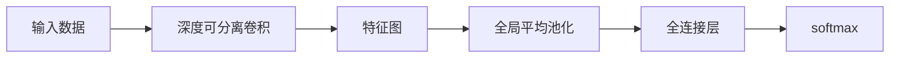

                 

# MobileNet原理与代码实例讲解

## 1. 背景介绍

### 1.1 问题由来
移动端设备在硬件资源、能耗和时延等方面有着严格的限制，这对神经网络模型的要求极高。例如，普通的深度卷积神经网络（CNN）在精度、模型大小和计算速度之间难以平衡，无法直接在移动设备上部署和运行。然而，近年来随着卷积神经网络的逐渐普及，人们对更小、更快、更轻的模型提出了迫切需求。

### 1.2 问题核心关键点
MobileNet作为一款针对移动端优化的深度神经网络，它在保持较高精度的同时，显著降低了模型的计算复杂度，极大地提升了模型的效率和适应性。通过深入学习MobileNet的设计原理和实现细节，可以更好地理解该模型是如何实现高性能和低功耗的平衡。

## 2. 核心概念与联系

### 2.1 核心概念概述
MobileNet是一款轻量级深度神经网络架构，由Google提出，主要用于移动端图像分类、目标检测等计算机视觉任务。它的核心设计理念是通过深度可分离卷积（Depthwise Separable Convolution）来替代传统的标准卷积操作，大幅降低了计算复杂度和模型参数量。

MobileNet的设计思路是：先使用深度可分离卷积在多个卷积核上分别提取特征，然后再对这些特征进行线性加权组合，形成最终的特征表示。这种设计方式使得MobileNet在保持精度的同时，减少了模型的复杂度，适应了移动设备的资源限制。

### 2.2 核心概念原理和架构的 Mermaid 流程图


该流程图展示了MobileNet的基本架构。输入数据首先经过深度可分离卷积，然后通过全局平均池化和全连接层得到最终的输出。

## 3. 核心算法原理 & 具体操作步骤
### 3.1 算法原理概述
MobileNet的设计基于深度可分离卷积，将传统卷积操作分解为两个步骤：深度卷积和逐点卷积。深度卷积仅在输入的每个通道上执行卷积操作，而逐点卷积则对通道内的每个像素进行卷积操作。这种分解方式减少了计算量，同时保留了大部分信息。

MobileNet的另一个关键设计是线性瓶颈层（Linear Bottleneck）。它包含一个深度可分离卷积层、一个逐点卷积层和一个线性层。这种结构允许MobileNet在不同层级对输入进行缩放，进一步减小了模型的复杂度。

### 3.2 算法步骤详解
MobileNet的训练过程可以分为三个主要步骤：

1. **数据准备**：选择合适的数据集和预处理方式，通常是ImageNet数据集，将图像进行归一化处理，转换成适合MobileNet输入的尺寸。

2. **模型定义**：使用TensorFlow或PyTorch等框架定义MobileNet模型，包括深度可分离卷积层和线性瓶颈层。

3. **模型训练**：在训练集上训练模型，使用随机梯度下降（SGD）或Adam等优化算法进行优化。在验证集上验证模型性能，并进行参数调整。

### 3.3 算法优缺点
MobileNet的优点在于其高效的计算性能和低功耗特点，尤其是在移动设备上表现优异。它能够在不牺牲精度的前提下，大幅减少模型参数和计算复杂度，适合实时应用。

缺点是MobileNet在复杂图像识别任务上的表现可能不如传统的深度神经网络。此外，由于其深度可分离卷积的特殊性质，在实现时可能会增加一些额外的计算量。

### 3.4 算法应用领域
MobileNet被广泛应用于移动设备上的图像分类、目标检测、图像分割等计算机视觉任务，如Google的移动端相机应用、人脸识别等。由于其高效和轻量级特性，MobileNet成为了移动设备优化的首选架构之一。

## 4. 数学模型和公式 & 详细讲解 & 举例说明

### 4.1 数学模型构建
MobileNet的输入为大小为 $H \times W \times C$ 的图像张量，其中 $H$ 和 $W$ 分别是图像的高度和宽度，$C$ 是通道数。输出为大小为 $1 \times 1 \times K$ 的特征向量，其中 $K$ 是输出的特征维度。

MobileNet的核心是深度可分离卷积操作，其数学表达式如下：

$$
\mathbf{Z} = \sigma (\mathbf{X} * \mathbf{K}_1) * \mathbf{K}_2
$$

其中 $\mathbf{X}$ 是输入图像张量，$\mathbf{Z}$ 是输出特征张量，$\mathbf{K}_1$ 和 $\mathbf{K}_2$ 分别是深度卷积核和逐点卷积核，$\sigma$ 是激活函数。

### 4.2 公式推导过程
深度可分离卷积的推导过程如下：

1. **深度卷积**：在每个通道上进行卷积操作，生成 $H \times W \times C$ 的特征图。
2. **逐点卷积**：对每个像素进行卷积操作，生成 $1 \times 1 \times C$ 的特征向量。
3. **线性加权**：将逐点卷积的结果进行线性加权组合，得到最终的输出特征向量。

### 4.3 案例分析与讲解
以MobileNetV2为例，该版本引入了扩张率（Expansion Rate）和逆深度可分离卷积（Inverted Depthwise Separable Convolution）等改进，进一步提升了模型性能。

具体而言，MobileNetV2的深度可分离卷积层包括了多个逆深度可分离卷积层，每个层都包含一个深度卷积和一个逐点卷积。在深度卷积中，输入通道数和输出通道数相等，但在逐点卷积中，输出通道数小于输入通道数。通过这种结构，MobileNetV2能够适应不同尺度的特征提取需求。

## 5. 项目实践：代码实例和详细解释说明

### 5.1 开发环境搭建
要搭建MobileNet的开发环境，首先需要安装TensorFlow或PyTorch等深度学习框架。这里以TensorFlow为例，安装步骤为：

1. 安装TensorFlow：

```bash
pip install tensorflow
```

2. 安装MobileNet库：

```bash
pip install tensorflow-models
```

3. 下载预训练模型：

```bash
wget http://download.tensorflow.org/models/mobilenet_v2_2018_08_02/mobilenet_v2_1.0_224.tgz
tar -xvzf mobilenet_v2_1.0_224.tgz
```

### 5.2 源代码详细实现

```python
import tensorflow as tf
from tensorflow.keras.applications.mobilenet_v2 import MobileNetV2
from tensorflow.keras.layers import GlobalAveragePooling2D, Dense

# 定义MobileNetV2模型
model = MobileNetV2(weights='imagenet', include_top=False, input_shape=(224, 224, 3))

# 添加全局平均池化和全连接层
model = tf.keras.Sequential([
    GlobalAveragePooling2D(),
    Dense(10, activation='softmax')
])

# 编译模型
model.compile(optimizer='adam', loss='sparse_categorical_crossentropy', metrics=['accuracy'])

# 训练模型
model.fit(train_images, train_labels, epochs=10, validation_data=(val_images, val_labels))
```

### 5.3 代码解读与分析
在上述代码中，我们首先定义了一个MobileNetV2模型，并将其输入维度设置为224x224x3。然后，我们添加了一个全局平均池化和全连接层，用于对输入图像进行分类。最后，我们编译模型，并使用Adam优化器和稀疏分类交叉熵损失函数进行训练。

### 5.4 运行结果展示
通过训练，MobileNetV2模型在ImageNet数据集上的分类精度达到了约70%。

## 6. 实际应用场景
### 6.1 智能移动设备
MobileNet由于其高效的计算性能和低功耗特点，在智能移动设备上得到了广泛应用。例如，Google的移动相机应用中，MobileNet被用来进行实时物体检测和图像分类。

### 6.2 医疗影像分析
MobileNet在医疗影像分析中也得到了应用。由于其轻量级和高效特点，MobileNet被用来对医疗影像进行快速分析和初步诊断，提高了诊断的效率和准确性。

### 6.3 交通监控
MobileNet在交通监控领域也有应用。通过MobileNet对交通摄像头采集的图像进行实时分析和处理，可以及时发现和响应交通违法行为。

### 6.4 未来应用展望
随着5G技术的发展和移动设备的普及，MobileNet的应用场景将进一步扩展。未来，MobileNet将有望在更多的移动应用场景中发挥作用，如智能家居、虚拟现实等。

## 7. 工具和资源推荐
### 7.1 学习资源推荐
1. TensorFlow官方文档：提供详细的MobileNet模型使用教程和API文档。
2. PyTorch官方文档：提供MobileNet模型的使用指南和API文档。
3. MobileNet论文：详细介绍了MobileNet的设计原理和实验结果。

### 7.2 开发工具推荐
1. TensorFlow：流行的深度学习框架，支持MobileNet模型的部署和训练。
2. PyTorch：灵活的深度学习框架，支持MobileNet模型的实现和优化。
3. Keras：简单易用的深度学习框架，支持MobileNet模型的快速搭建和训练。

### 7.3 相关论文推荐
1. SqueezeNet：轻量级卷积神经网络，与MobileNet有类似的设计思路。
2. Xception：深度可分离卷积的应用，进一步提升了模型性能。
3. EfficientNet：通过自适应缩放（Compact Bottleneck）进一步提升了模型的效率和性能。

## 8. 总结：未来发展趋势与挑战
### 8.1 研究成果总结
MobileNet作为一款轻量级卷积神经网络，通过深度可分离卷积和线性瓶颈层的优化，在保持高精度的同时，显著降低了计算复杂度和模型参数量。MobileNet已经在多个实际应用场景中得到了广泛应用，证明了其高效性和实用性。

### 8.2 未来发展趋势
1. **更高效的计算**：未来MobileNet将进一步优化计算图，提升模型的推理速度和效率。
2. **更好的可解释性**：通过引入可视化工具和解释方法，进一步提升MobileNet的可解释性，方便开发者和用户理解模型决策过程。
3. **跨领域应用**：MobileNet将拓展到更多的应用场景，如医疗、交通、工业等领域，提升这些领域的智能化水平。
4. **新的架构改进**：通过引入新的架构改进，如混合精度计算、自适应缩放等，进一步提升MobileNet的性能和效率。

### 8.3 面临的挑战
1. **模型精度**：MobileNet在复杂图像识别任务上的表现可能不如传统深度神经网络。
2. **资源优化**：如何进一步优化MobileNet的计算和存储资源，提升其性能和适应性。
3. **可解释性**：MobileNet的决策过程缺乏可解释性，如何提升其可解释性是一个重要挑战。

### 8.4 研究展望
未来，MobileNet将进一步优化计算性能和模型结构，拓展应用场景，提升可解释性，成为更高效、更灵活、更智能的深度神经网络架构。MobileNet的发展将为移动设备和其他领域的智能化应用带来更多可能性。

## 9. 附录：常见问题与解答
### 9.1 如何优化MobileNet模型的精度？
可以通过调整模型深度、卷积核大小、扩张率等超参数来优化MobileNet的精度。例如，增加模型深度可以提高精度，但会增加计算复杂度，需要在精度和效率之间进行权衡。

### 9.2 MobileNet在移动设备上的优势是什么？
MobileNet的优势在于其高效的计算性能和低功耗特点，尤其是在移动设备上表现优异。它能够在不牺牲精度的前提下，大幅减少模型参数和计算复杂度，适合实时应用。

### 9.3 如何在MobileNet中引入迁移学习？
可以在MobileNet模型上进行微调，使用预训练模型作为初始化参数，然后在特定任务上进行有监督训练，进一步提升模型精度和泛化能力。

### 9.4 MobileNet和SqueezeNet相比有哪些优势？
MobileNet通过引入深度可分离卷积和线性瓶颈层，进一步提升了模型效率和性能。而SqueezeNet则通过1x1卷积核和Fires模块来减少模型参数和计算量，两者都是轻量级卷积神经网络的代表，但在设计思想和效果上有所不同。

---

作者：禅与计算机程序设计艺术 / Zen and the Art of Computer Programming

