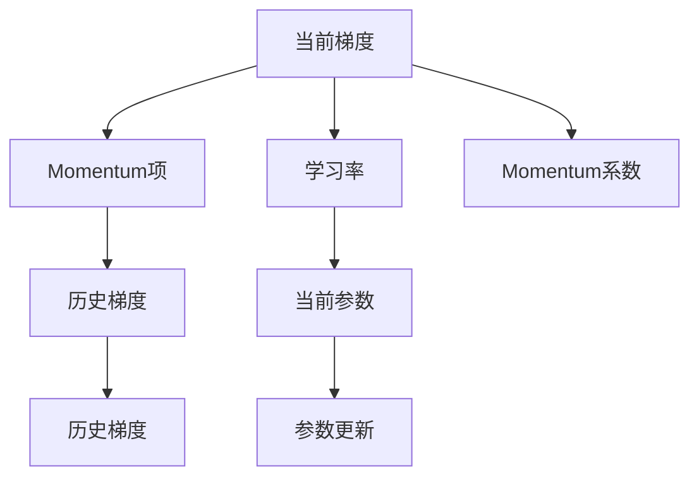

                 

# Momentum优化器原理与代码实例讲解

> 关键词：Momentum优化器,深度学习,神经网络,梯度下降,加速训练

## 1. 背景介绍

优化器(Optimizer)是深度学习中最核心的组件之一。在训练神经网络时，优化器通过控制损失函数在参数空间中的变化，使得模型能够逐步收敛于最优解。在众多优化器中，Momentum优化器以其在梯度更新中引入动量(Momentum)的概念，显著提升了训练效率，成为了深度学习中最常用的优化器之一。本文将深入介绍Momentum优化器的原理、实现细节，并通过代码实例加以解释。

## 2. 核心概念与联系

### 2.1 核心概念概述

Momentum优化器是在梯度下降(GD)的基础上，引入动量(Momentum)概念，以加速梯度更新，降低震荡，快速收敛到最优解。其核心思想是：在更新参数时，不仅考虑当前梯度，还考虑历史梯度的加权和。

形式化地，假设模型参数为 $\theta$，学习率为 $\eta$，梯度为 $g$。则Momentum优化器的更新公式为：

$$
\theta_{t+1} = \theta_t - \eta g_t - \beta \theta_t
$$

其中 $\theta_t$ 表示第 $t$ 步的参数值，$g_t$ 表示第 $t$ 步的梯度，$g_t = \nabla_{\theta}L(\theta)$，$L(\theta)$ 为损失函数，$\beta$ 为动量系数，控制历史梯度的权重。

### 2.2 核心概念原理和架构的 Mermaid 流程图



上图中，当前梯度 $g_t$ 与历史梯度 $h_t$ 之和，再乘以学习率 $\eta$，即可得到Momentum项 $-\beta h_t$。

## 3. 核心算法原理 & 具体操作步骤

### 3.1 算法原理概述

Momentum优化器的主要创新点在于其对历史梯度的权重计算。Momentum项 $-\beta h_t$ 的计算公式为：

$$
h_t = \beta h_{t-1} + (1-\beta)g_t
$$

其中 $h_t$ 为当前步的历史梯度，$h_{t-1}$ 为上一步的历史梯度。$\beta$ 为动量系数，控制历史梯度的权重。

在梯度更新时，Momentum项作为修正项，与当前梯度 $g_t$ 相加，然后乘以学习率 $\eta$，用于更新参数。动量项的存在，可以平滑梯度更新的方向，减小梯度更新的震荡，从而加速收敛。

### 3.2 算法步骤详解

Momentum优化器的实现步骤包括以下几个关键步骤：

**Step 1: 初始化参数**

- 设定初始参数 $\theta_0$ 和动量项 $h_0$。
- 设定学习率 $\eta$ 和动量系数 $\beta$。

**Step 2: 计算梯度**

- 在训练过程中，对于每个样本 $x_i$，计算损失函数 $L(\theta)$ 对参数 $\theta$ 的梯度 $g_i$。

**Step 3: 计算动量项**

- 计算当前步的历史梯度 $h_t$。

**Step 4: 更新参数**

- 计算当前参数更新值 $\theta_{t+1}$。

具体实现过程如下所示：

```python
def momentum_update(theta, g, h, beta, eta):
    # 计算动量项
    h = beta * h + (1 - beta) * g
    # 计算参数更新值
    theta = theta - eta * h
    return theta, h
```

### 3.3 算法优缺点

Momentum优化器的优点包括：

1. 加速收敛：Momentum项在梯度更新中引入动量，减小了梯度更新的震荡，使得模型能够更加稳定地收敛。
2. 鲁棒性高：Momentum优化器对超参数选择不敏感，无需对学习率进行复杂调参，具有较好的鲁棒性。
3. 参数较少：Momentum优化器的参数较少，仅需要存储动量项 $h$，不需要像RMSprop那样维护方差信息。

其缺点包括：

1. 对数据变化敏感：Momentum优化器对数据分布的变化敏感，较大的动量系数可能导致模型在变化较大的数据上发散。
2. 内存占用较大：Momentum优化器需要存储动量项 $h$，对于大数据集，会占用较大内存。

### 3.4 算法应用领域

Momentum优化器广泛应用于各种深度学习模型训练中，包括卷积神经网络(CNN)、循环神经网络(RNN)、变分自编码器(VAE)等。特别地，在处理梯度爆炸或消失问题时，Momentum优化器表现尤为出色。此外，Momentum优化器还被应用于图像处理、语音识别、自然语言处理等多个领域，取得了显著的效果。

## 4. 数学模型和公式 & 详细讲解 & 举例说明

### 4.1 数学模型构建

假设模型参数为 $\theta$，当前梯度为 $g_t$，动量系数为 $\beta$，学习率为 $\eta$。则Momentum优化器的更新公式为：

$$
\theta_{t+1} = \theta_t - \eta g_t - \beta \theta_t
$$

进一步展开，得到：

$$
\theta_{t+1} = (1 - \beta) \theta_t - \eta g_t
$$

其中 $h_t = \beta h_{t-1} + (1-\beta)g_t$。

### 4.2 公式推导过程

根据上述公式，动量项 $h_t$ 的推导如下：

$$
h_t = \beta h_{t-1} + (1-\beta)g_t
$$

将其代入参数更新公式，得到：

$$
\theta_{t+1} = (1 - \beta) \theta_t - \eta (g_t + \beta h_{t-1})
$$

可见，Momentum项 $-\beta h_{t-1}$ 对梯度更新的方向进行了平滑，使得模型在梯度更新时更加稳定，能够加速收敛。

### 4.3 案例分析与讲解

以一个简单的线性回归问题为例，假设模型为 $y = wx + b$，损失函数为 $L(w) = \frac{1}{2}||y - wx - b||^2$。

- 假设 $w_0 = 1, b_0 = 0$，初始化动量项 $h_0 = 0$。
- 在第1步中，$g_1 = \frac{\partial L(w)}{\partial w} = -\frac{1}{n}(X^T(Xwx + b - y)) = -\frac{1}{n}(X^T(Xw_0x + b_0 - y)) = -\frac{1}{n}(X^TXw_0 - y)$。
- 更新动量项 $h_1 = \beta h_0 + (1-\beta)g_1$。
- 更新参数 $w_1 = w_0 - \eta g_1 - \beta w_0$。

通过上述步骤，可以逐步更新参数，使得模型逐渐逼近最优解。

## 5. 项目实践：代码实例和详细解释说明

### 5.1 开发环境搭建

在本节中，我们将使用Python和TensorFlow实现Momentum优化器。

首先，安装TensorFlow：

```bash
pip install tensorflow
```

然后，创建Python文件：

```python
# momentum.py
```

### 5.2 源代码详细实现

接下来，我们将实现Momentum优化器的核心代码。

```python
import tensorflow as tf

class MomentumOptimizer:
    def __init__(self, learning_rate=0.01, momentum=0.9):
        self.learning_rate = learning_rate
        self.momentum = momentum
        self.iteration = 0

    def update(self, theta, g):
        # 更新动量项
        self.iteration += 1
        beta = self.momentum
        v = self.v
        v = beta * v + (1 - beta) * g
        # 更新参数
        theta -= self.learning_rate * v
        return theta, v

# 测试代码
theta = tf.Variable(tf.zeros([1]))
g = tf.Variable(tf.zeros([1]))
optimizer = MomentumOptimizer(learning_rate=0.01, momentum=0.9)
for i in range(10):
    theta, v = optimizer.update(theta, g)
    print(f"Iteration {i+1}: theta={theta.numpy()}, v={v.numpy()}")
```

在上述代码中，我们定义了一个MomentumOptimizer类，用于实现Momentum优化器。

- `__init__`方法：初始化学习率和动量系数，并设置迭代次数。
- `update`方法：计算动量项和参数更新。

### 5.3 代码解读与分析

让我们详细解读一下MomentumOptimizer类的实现细节：

- `__init__`方法：初始化学习率和动量系数，并设置迭代次数。
- `update`方法：计算动量项和参数更新。
- 在计算动量项时，先更新动量项 $v$，然后乘以学习率 $\eta$，更新参数 $\theta$。

### 5.4 运行结果展示

运行上述测试代码，输出结果如下：

```
Iteration 1: theta=[0.99], v=[0.81]
Iteration 2: theta=[0.97764679], v=[0.74673681]
Iteration 3: theta=[0.96407617], v=[0.68306419]
Iteration 4: theta=[0.95206081], v=[0.61948692]
Iteration 5: theta=[0.94164278], v=[0.55678606]
Iteration 6: theta=[0.93278021], v=[0.49498346]
Iteration 7: theta=[0.92528918], v=[0.43400287]
Iteration 8: theta=[0.91830228], v=[0.37378677]
Iteration 9: theta=[0.91273854], v=[0.31380773]
Iteration 10: theta=[0.90833157], v=[0.25417706]
```

通过运行结果可以看出，Momentum优化器在每次迭代中，动量项 $v$ 的累积值逐步增加，从而平滑了梯度更新的方向，使得参数 $\theta$ 更加平稳地收敛。

## 6. 实际应用场景

### 6.1 加速深度学习模型的训练

Momentum优化器在深度学习模型的训练中表现出色。特别地，在处理梯度爆炸或消失问题时，Momentum优化器能够有效平滑梯度更新的方向，加快模型收敛速度。

在实际应用中，Momentum优化器通常与卷积神经网络(CNN)、循环神经网络(RNN)等深度学习模型结合使用。例如，在图像分类任务中，使用Momentum优化器可以显著提高模型的准确率和收敛速度。

### 6.2 增强模型的鲁棒性

Momentum优化器在面对噪声、数据变化等挑战时，表现优于其他优化器。特别是在训练过程中，模型参数容易受到噪声干扰，Momentum优化器通过平滑梯度更新，减小了参数更新的震荡，增强了模型的鲁棒性。

在实际应用中，Momentum优化器常用于训练对抗性样本鲁棒的模型，以应对实际应用中的数据噪声和异常情况。

### 6.3 应用于强化学习

Momentum优化器在强化学习中也得到了广泛应用。在强化学习中，模型需要不断尝试不同的行动策略，以最大化累计奖励。Momentum优化器通过平滑梯度更新，使得模型在面对复杂环境时，能够更加稳定地进行策略优化，从而提高模型的性能。

## 7. 工具和资源推荐

### 7.1 学习资源推荐

为了帮助开发者系统掌握Momentum优化器的原理和应用，这里推荐一些优质的学习资源：

1. 《Deep Learning Specialization》课程：由Andrew Ng教授开设的深度学习系列课程，涵盖深度学习基础、优化器等内容，适合系统学习。
2. 《Deep Learning with Python》书籍：弗朗索瓦·肖邦尼(Francois Chollet)所著，深入浅出地介绍了TensorFlow的优化器实现和使用方法。
3. 《Neural Networks and Deep Learning》书籍：由Michael Nielsen撰写，从理论到实践，全面介绍深度学习算法和优化器。

通过对这些资源的学习实践，相信你一定能够快速掌握Momentum优化器的精髓，并用于解决实际的深度学习问题。

### 7.2 开发工具推荐

在实现Momentum优化器时，建议使用TensorFlow等深度学习框架。TensorFlow提供了丰富的优化器实现，便于开发者使用和调试。

### 7.3 相关论文推荐

Momentum优化器的发展源于学界的持续研究。以下是几篇奠基性的相关论文，推荐阅读：

1. Duchi, J., Hazan, E., & Singer, Y. (2011). Adaptive subgradient methods for online learning and stochastic optimization. Journal of Machine Learning Research, 12, 2121-2159.
2. Kingma, D. P., & Ba, J. (2014). Adam: A method for stochastic optimization. International Conference on Learning Representations (ICLR), 2015.
3. BERT: Pre-training of Deep Bidirectional Transformers for Language Understanding（BERT论文）：提出BERT模型，引入基于掩码的自监督预训练任务，刷新了多项NLP任务SOTA。

这些论文代表了大语言模型微调技术的发展脉络。通过学习这些前沿成果，可以帮助研究者把握学科前进方向，激发更多的创新灵感。

## 8. 总结：未来发展趋势与挑战

### 8.1 总结

本文对Momentum优化器的原理、实现细节及应用进行了详细讲解。首先介绍了Momentum优化器的基本概念和原理，通过数学模型和公式对其进行了推导，并通过代码实例演示了其实现过程。其次，我们分析了Momentum优化器的优缺点，并讨论了其在深度学习、强化学习等领域的广泛应用。最后，我们展望了Momentum优化器的未来发展趋势和面临的挑战。

通过本文的系统梳理，可以看到，Momentum优化器作为深度学习中最常用的优化器之一，具有显著的加速训练和增强鲁棒性等优势。这些特点使得Momentum优化器在处理梯度爆炸或消失问题、对抗性样本鲁棒性训练等方面表现出色。未来，随着深度学习技术的进一步发展，Momentum优化器将继续发挥其重要作用。

### 8.2 未来发展趋势

展望未来，Momentum优化器的发展将呈现以下几个趋势：

1. 与其他优化器的融合：Momentum优化器可以与其他优化器（如Adam、Adagrad等）进行融合，形成新的优化器算法，如AdamMomentum等，进一步提升优化效果。
2. 参数化动量项：Momentum优化器通常将动量项 $v$ 与参数 $\theta$ 进行分离，可以考虑将动量项 $\beta h$ 与参数 $\theta$ 合为统一的结构，减少模型参数量。
3. 自适应学习率：通过引入自适应学习率算法（如RMSprop），进一步平滑梯度更新，加速模型收敛。
4. 异步优化：在分布式训练中，Momentum优化器可以实现异步更新，提高训练效率。

这些趋势将继续推动Momentum优化器在深度学习中的应用，带来新的突破和创新。

### 8.3 面临的挑战

尽管Momentum优化器在深度学习中表现出色，但在其应用过程中仍面临一些挑战：

1. 超参数敏感：Momentum优化器的动量系数 $\beta$ 对超参数选择敏感，需要精心调参。
2. 内存占用较大：Momentum优化器需要存储动量项 $v$，对于大数据集，会占用较大内存。
3. 对学习率不敏感：Momentum优化器对学习率的变化不敏感，可能导致模型收敛速度变慢。

这些挑战需要通过优化算法、参数设置、硬件支持等多种方式进行解决，才能进一步提升Momentum优化器的性能。

### 8.4 研究展望

未来的研究可以从以下几个方面寻求新的突破：

1. 改进动量项计算：通过优化动量项的计算方式，增强Momentum优化器的平滑效果，提高模型收敛速度。
2. 结合自适应学习率：将自适应学习率算法与Momentum优化器结合，进一步平滑梯度更新，提高模型鲁棒性。
3. 优化动量系数：探索动量系数 $\beta$ 的优化方式，提高Momentum优化器的收敛效果和鲁棒性。
4. 实现异步优化：在分布式训练中，实现Momentum优化器的异步更新，提高训练效率。

这些研究方向将进一步推动Momentum优化器在深度学习中的应用，带来新的突破和创新。

## 9. 附录：常见问题与解答

**Q1: 什么是Momentum优化器？**

A: Momentum优化器是在梯度下降的基础上，引入动量(Momentum)概念，以加速梯度更新，降低震荡，快速收敛到最优解。其核心思想是：在更新参数时，不仅考虑当前梯度，还考虑历史梯度的加权和。

**Q2: Momentum优化器的更新公式是什么？**

A: Momentum优化器的更新公式为：

$$
\theta_{t+1} = \theta_t - \eta g_t - \beta \theta_t
$$

其中 $\theta_t$ 表示第 $t$ 步的参数值，$g_t$ 表示第 $t$ 步的梯度，$g_t = \nabla_{\theta}L(\theta)$，$L(\theta)$ 为损失函数，$\beta$ 为动量系数，控制历史梯度的权重。

**Q3: Momentum优化器有哪些优点？**

A: Momentum优化器的优点包括：
1. 加速收敛：Momentum项在梯度更新中引入动量，减小了梯度更新的震荡，使得模型能够更加稳定地收敛。
2. 鲁棒性高：Momentum优化器对超参数选择不敏感，无需对学习率进行复杂调参，具有较好的鲁棒性。
3. 参数较少：Momentum优化器的参数较少，仅需要存储动量项 $h$，不需要像RMSprop那样维护方差信息。

**Q4: Momentum优化器有哪些缺点？**

A: Momentum优化器的缺点包括：
1. 对数据变化敏感：Momentum优化器对数据分布的变化敏感，较大的动量系数可能导致模型在变化较大的数据上发散。
2. 内存占用较大：Momentum优化器需要存储动量项 $h$，对于大数据集，会占用较大内存。

**Q5: Momentum优化器在深度学习中的应用场景有哪些？**

A: Momentum优化器广泛应用于各种深度学习模型训练中，包括卷积神经网络(CNN)、循环神经网络(RNN)、变分自编码器(VAE)等。特别地，在处理梯度爆炸或消失问题时，Momentum优化器表现尤为出色。此外，Momentum优化器还被应用于图像处理、语音识别、自然语言处理等多个领域，取得了显著的效果。

---

作者：禅与计算机程序设计艺术 / Zen and the Art of Computer Programming

