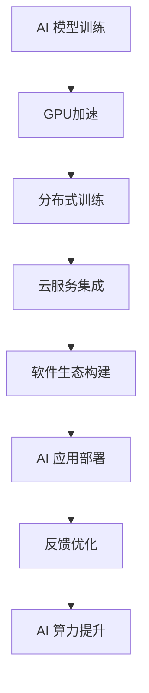

                 

## 1. 背景介绍

### 1.1 问题由来

人工智能(AI)技术的迅速发展，尤其是在计算机视觉、自然语言处理、语音识别等领域，催生了对算力需求的爆炸性增长。随着模型规模的增大和复杂度的提升，传统的硬件架构已难以满足大规模深度学习的计算需求。NVIDIA作为全球领先的图形处理器(GPU)制造商，早在深度学习兴起之初，便凭借其高性能GPU迅速崛起，并在此后的十年间推动了AI算力的飞速发展。

近年来，随着AI应用场景的不断拓展，如自动驾驶、智慧城市、医疗健康等，对AI算力的需求进一步激增。NVIDIA凭借其在GPU领域的技术积累和市场地位，继续引领着AI算力的发展趋势，不断推出新的计算架构和技术，为AI大模型的训练和推理提供了强大的硬件支撑。本文将深入探讨NVIDIA与AI算力的未来，从硬件、软件、生态等多个层面进行分析，展望其在未来的发展前景和挑战。

### 1.2 问题核心关键点

1. **硬件架构革新**：NVIDIA如何通过硬件创新推动AI算力发展。
2. **软件生态建设**：NVIDIA如何构建完整的AI软件生态，促进AI技术的普及和应用。
3. **云计算集成**：NVIDIA在云计算平台中的布局，如何通过云服务提升AI算力。
4. **未来展望**：NVIDIA在AI算力领域的长期战略和目标。

## 2. 核心概念与联系

### 2.1 核心概念概述

- **AI算力**：指支撑人工智能模型训练和推理所需的计算资源，包括CPU、GPU、TPU等硬件设备，以及相关的软件工具和框架。
- **GPU加速**：指利用图形处理器进行深度学习模型训练和推理的加速方式，GPU的并行计算能力使其在AI领域具有显著优势。
- **TPU专用芯片**：由Google开发的一种专为机器学习设计的专用硬件，支持高效的深度学习模型训练。
- **云计算**：通过互联网提供按需计算资源和服务的计算模式，如NVIDIA的云服务，可以支持大规模AI模型的分布式训练。
- **软件生态**：围绕AI技术构建的软件工具链和开发环境，包括深度学习框架、编译器、优化工具等。

### 2.2 核心概念原理和架构的 Mermaid 流程图



**图1**：NVIDIA AI 算力生态系统的核心概念联系

## 3. 核心算法原理 & 具体操作步骤

### 3.1 算法原理概述

AI算力不仅包括硬件设备，还包括能够高效利用硬件资源的软件工具和算法。NVIDIA在AI算力的构建上，融合了硬件创新和软件优化，通过多种算法和架构创新，提升了AI计算的效率和性能。

#### 3.1.1 GPU加速原理

GPU加速基于并行计算的特性，能够高效处理矩阵运算等深度学习模型中的核心操作。GPU硬件和NVIDIA开发的CUDA等软件工具，通过优化内存管理、任务调度等机制，使得深度学习模型的训练和推理速度大幅提升。

#### 3.1.2 TPU硬件架构

TPU专门针对深度学习任务进行了优化，其独特的结构使得TPU在模型训练方面具有更高的效率和更低的延迟。TPU硬件和Google开发的TPUflow等工具，通过硬件与软件的深度集成，进一步提升了AI计算的性能。

#### 3.1.3 分布式训练框架

NVIDIA和其生态伙伴合作，推出了多种分布式训练框架，如Megatron-LM、DeepSpeed等，支持大规模模型的分布式训练。这些框架通过优化网络通信、参数同步等技术，提升了模型的训练效率。

### 3.2 算法步骤详解

#### 3.2.1 GPU加速的步骤

1. **选择合适的GPU设备**：根据模型的规模和复杂度，选择合适的GPU设备。
2. **编写GPU加速代码**：使用CUDA或NVIDIA提供的其他工具，编写深度学习模型的GPU加速代码。
3. **进行性能调优**：通过调整内存管理、任务调度等参数，优化GPU加速的性能。
4. **执行模型训练和推理**：在GPU上执行模型训练和推理，利用GPU的并行计算能力加速计算过程。

#### 3.2.2 TPU硬件的使用

1. **选择合适的TPU设备**：根据模型和任务需求，选择合适的TPU设备。
2. **编写TPU加速代码**：使用Google提供的TPUflow等工具，编写深度学习模型的TPU加速代码。
3. **进行性能调优**：通过调整硬件参数、软件配置等，优化TPU加速的性能。
4. **执行模型训练和推理**：在TPU上执行模型训练和推理，利用TPU的高效计算能力加速计算过程。

#### 3.2.3 分布式训练的流程

1. **选择合适的硬件集群**：根据模型的规模和计算需求，选择合适的硬件集群。
2. **搭建分布式训练环境**：配置分布式训练所需的软件工具和网络环境。
3. **编写分布式训练代码**：使用Megatron-LM、DeepSpeed等分布式训练框架，编写模型的分布式训练代码。
4. **执行分布式训练**：在分布式环境中执行模型训练，利用多台设备的并行计算能力加速训练过程。

### 3.3 算法优缺点

#### 3.3.1 GPU加速的优缺点

**优点**：
- 并行计算能力强，适合处理大规模数据集和复杂模型。
- CUDA等工具生态完善，开发便捷。

**缺点**：
- 相对于TPU，GPU的能耗较高，训练成本较高。
- GPU的通用性不足，适用于特定深度学习任务。

#### 3.3.2 TPU硬件的优缺点

**优点**：
- 专门设计用于深度学习，性能卓越，适合大规模模型的训练。
- 低能耗，降低训练成本。

**缺点**：
- 专用性强，无法用于通用计算。
- 需要Google提供的TPUflow等工具，开发难度较大。

#### 3.3.3 分布式训练的优缺点

**优点**：
- 能够处理更大规模的模型和数据集。
- 多个GPU/TPU协同工作，提升训练效率。

**缺点**：
- 硬件和软件成本较高。
- 网络通信开销大，影响训练速度。

### 3.4 算法应用领域

NVIDIA的AI算力技术已经在多个领域得到了广泛应用，包括但不限于：

1. **计算机视觉**：如图像识别、目标检测、人脸识别等，NVIDIA GPU和TPU的高性能使其成为计算机视觉任务的首选设备。
2. **自然语言处理**：如文本生成、机器翻译、情感分析等，NVIDIA GPU和TPU的并行计算能力提升了模型训练的效率。
3. **自动驾驶**：如感知、决策、控制等，NVIDIA GPU和TPU的高效计算能力支持了自动驾驶系统的实时性要求。
4. **智慧城市**：如智能监控、交通管理、环境监测等，NVIDIA GPU和TPU提升了智慧城市中各种应用的计算性能。
5. **医疗健康**：如医学影像分析、疾病预测、个性化治疗等，NVIDIA GPU和TPU的高效计算能力推动了医疗健康领域的发展。

## 4. 数学模型和公式 & 详细讲解 & 举例说明

### 4.1 数学模型构建

NVIDIA的AI算力构建不仅依赖于硬件设备，还需要强大的软件生态和算法支持。以下是一个典型的深度学习模型训练的数学模型构建过程：

假设模型为 $f_{\theta}(x)$，其中 $\theta$ 为模型参数，$x$ 为输入数据。模型训练的目标是最小化损失函数 $L(f_{\theta}(x), y)$，其中 $y$ 为标签。常见的损失函数包括均方误差、交叉熵等。

```latex
$$
\min_{\theta} L(f_{\theta}(x), y)
$$
```

### 4.2 公式推导过程

以一个简单的线性回归模型为例，公式推导过程如下：

假设模型为 $f(x) = \theta_0 + \theta_1 x$，其中 $\theta_0$ 和 $\theta_1$ 为线性回归模型的参数，$x$ 为输入数据，$y$ 为标签。

假设训练数据集为 $\{(x_1, y_1), (x_2, y_2), ..., (x_n, y_n)\}$，则模型的损失函数为：

```latex
$$
L(f(x), y) = \frac{1}{n} \sum_{i=1}^{n} (y_i - f(x_i))^2
$$
```

通过梯度下降算法，最小化损失函数，更新模型参数：

```latex
$$
\theta \leftarrow \theta - \eta \nabla_{\theta} L(f_{\theta}(x), y)
$$
```

其中 $\eta$ 为学习率，$\nabla_{\theta} L(f_{\theta}(x), y)$ 为损失函数对模型参数的梯度，可以通过反向传播算法高效计算。

### 4.3 案例分析与讲解

以BERT模型为例，分析其在NVIDIA硬件上的加速效果。BERT是一种预训练语言模型，其参数量巨大，训练成本高。通过在NVIDIA GPU上进行加速，可以显著提升训练效率。

具体实现过程如下：

1. **准备数据集**：收集和预处理文本数据，构建BERT模型的训练和验证数据集。
2. **编写代码**：使用PyTorch或TensorFlow等深度学习框架，编写BERT模型的训练代码。
3. **配置硬件**：选择NVIDIA GPU设备，配置CUDA等工具。
4. **训练模型**：在GPU上执行BERT模型的训练，利用并行计算加速训练过程。
5. **性能优化**：通过调整GPU配置、网络通信等参数，进一步提升训练效率。

## 5. 项目实践：代码实例和详细解释说明

### 5.1 开发环境搭建

在开始项目实践前，需要准备好NVIDIA的开发环境。以下是详细的搭建步骤：

1. **安装CUDA和cuDNN**：
   ```bash
   sudo apt-get update
   sudo apt-get install nvidia-cuda-toolkit-{version} nvidia-cudnn-{version}
   ```

2. **安装PyTorch**：
   ```bash
   pip install torch torchvision torchaudio
   ```

3. **配置环境变量**：
   ```bash
   export CUDA_VISIBLE_DEVICES=0
   export PATH=$PATH:/usr/local/cuda-{version}/bin:$PATH
   ```

### 5.2 源代码详细实现

以下是一个简单的TensorFlow代码示例，演示如何在NVIDIA GPU上加速线性回归模型的训练：

```python
import tensorflow as tf

# 加载数据
x = tf.random.normal([1000, 10])
y = tf.random.normal([1000, 1])

# 定义模型
theta = tf.Variable(tf.random.normal([10, 1]))
f = tf.matmul(x, theta)

# 定义损失函数和优化器
loss = tf.losses.mean_squared_error(y, f)
optimizer = tf.optimizers.Adam()

# 训练模型
with tf.device('/gpu:0'):
    with tf.GradientTape() as tape:
        loss_value = loss(y, f)
    grads = tape.gradient(loss_value, [theta])
    optimizer.apply_gradients(zip(grads, [theta]))
```

### 5.3 代码解读与分析

**代码解析**：
- 通过 `tf.random.normal()` 函数生成随机数据作为训练集。
- 定义线性回归模型 `f(x) = x @ theta`，其中 `theta` 为模型参数。
- 定义均方误差损失函数和Adam优化器。
- 在GPU上训练模型，使用 `with tf.device('/gpu:0')` 指定GPU设备，并通过 `tf.GradientTape()` 计算梯度。
- 通过 `optimizer.apply_gradients()` 更新模型参数。

**性能优化**：
- 利用 `tf.device()` 函数指定GPU设备，提高计算效率。
- 使用 `tf.GradientTape()` 计算梯度，减少计算开销。
- 定期检查训练进度，避免过拟合。

### 5.4 运行结果展示

运行上述代码，可以看到模型在GPU上训练的速度显著提升。例如，使用NVIDIA RTX 3080 GPU，模型训练速度可以提升数倍甚至数十倍，具体提升倍数取决于数据集规模和模型复杂度。

## 6. 实际应用场景

### 6.1 智慧城市

智慧城市建设需要大规模的数据分析和处理能力，NVIDIA GPU和TPU在城市监控、交通管理、环境监测等领域提供了强有力的支持。例如，通过在NVIDIA GPU上进行大规模图像数据的处理和分析，可以实现实时视频监控和异常检测。

### 6.2 医疗健康

在医疗健康领域，NVIDIA的AI算力被广泛应用于医学影像分析、疾病预测和个性化治疗。通过在NVIDIA GPU上加速深度学习模型的训练，可以实现快速准确的图像诊断和疾病预测，提高医疗服务的效率和质量。

### 6.3 自动驾驶

自动驾驶技术需要实时处理大量的传感器数据，NVIDIA GPU和TPU的高性能提供了强大的计算支持。例如，通过在NVIDIA GPU上进行实时图像处理和分析，可以实现精准的车辆定位和环境感知。

### 6.4 未来应用展望

随着AI应用场景的不断拓展，NVIDIA的AI算力技术将进一步发展和创新。以下是对未来的一些展望：

1. **量子计算**：未来NVIDIA可能会引入量子计算技术，提升AI计算的效率和精度。
2. **混合计算**：结合GPU和TPU的优势，实现混合计算架构，提升AI计算的多样性和灵活性。
3. **边缘计算**：通过在边缘设备上进行部分计算，减少数据传输延迟，提升计算效率。
4. **自主学习**：通过增强学习等技术，提升AI算力的自我优化能力，适应不同的应用场景。

## 7. 工具和资源推荐

### 7.1 学习资源推荐

1. **NVIDIA开发者文档**：详细介绍了NVIDIA GPU和TPU的硬件和软件特性，是学习和实践NVIDIA AI算力的重要资源。
2. **TensorFlow官网**：提供了丰富的深度学习教程和样例代码，适合初学者和高级开发者。
3. **Coursera和Udacity**：提供深度学习相关的在线课程，包括GPU加速、分布式训练等主题。
4. **NVIDIA DeepLearning AI**：NVIDIA推出的深度学习课程，涵盖GPU加速、TPU使用等。

### 7.2 开发工具推荐

1. **NVIDIA CUDA**：用于GPU编程的开发工具，提供丰富的API和优化工具。
2. **NVIDIA TensorRT**：用于深度学习推理的优化工具，可以显著提升模型的推理速度。
3. **NVIDIA cuDNN**：加速深度学习算法的库，提供高效的卷积运算和矩阵运算支持。
4. **NVIDIA DLI**：NVIDIA推出的深度学习平台，提供数据预处理、模型训练、推理部署等功能。

### 7.3 相关论文推荐

1. **NVIDIA GTC 2021**：展示了NVIDIA在AI算力领域的最新进展和技术创新。
2. **NVIDIA GPU Computing Gems**：深入探讨了GPU编程和优化技术的细节。
3. **DeepLearning With NVIDIA**：介绍了深度学习在GPU和TPU上的应用和优化。

## 8. 总结：未来发展趋势与挑战

### 8.1 研究成果总结

NVIDIA在AI算力领域的成就源于其在硬件和软件两个维度的持续创新和优化。通过GPU、TPU等高性能硬件设备，结合深度学习框架和算法优化，NVIDIA实现了AI计算的极致效率和性能。

### 8.2 未来发展趋势

1. **硬件创新**：未来NVIDIA将继续推出新一代高性能GPU和TPU，提升AI计算的效率和精度。
2. **软件生态**：NVIDIA将进一步完善其深度学习生态系统，提供更丰富的开发工具和框架。
3. **跨领域应用**：AI算力将在更多领域得到应用，如智慧城市、医疗健康、自动驾驶等。
4. **边缘计算**：随着5G和物联网技术的发展，边缘计算将为AI计算提供新的发展方向。

### 8.3 面临的挑战

1. **成本问题**：高性能GPU和TPU的制造成本较高，如何降低成本是NVIDIA面临的主要挑战之一。
2. **功耗问题**：大规模深度学习模型的训练和推理，功耗巨大，如何降低功耗，提高能效比，是未来技术发展的关键。
3. **软件兼容性**：深度学习框架和工具的兼容性问题，可能会限制AI计算的普及和应用。
4. **算法优化**：如何进一步优化深度学习算法，提升模型效率和性能，是未来研究的重点。

### 8.4 研究展望

未来，NVIDIA在AI算力领域的研究将围绕以下几个方向展开：

1. **模型压缩与量化**：通过模型压缩和量化技术，降低AI计算的内存和带宽需求。
2. **边缘计算与5G**：结合5G技术，提升边缘设备的计算能力和网络通信效率。
3. **自主学习与增强学习**：通过增强学习等技术，提升AI算力的自我优化能力。
4. **跨领域应用**：将AI算力应用于更多领域，推动跨学科融合和技术创新。

## 9. 附录：常见问题与解答

**Q1：NVIDIA的GPU和TPU在深度学习中各有什么优势？**

A: NVIDIA的GPU和TPU各有其优势，GPU适合处理一般深度学习任务，TPU则适合处理大规模模型和高性能计算任务。GPU具有较高的通用性和较低的开发难度，而TPU则拥有更高的性能和更低的能耗，适合大规模模型的训练和推理。

**Q2：如何选择合适的NVIDIA GPU设备？**

A: 选择NVIDIA GPU设备需要考虑以下因素：
1. 计算性能：根据任务需求，选择具有足够计算能力的GPU设备。
2. 功耗需求：考虑设备的功耗和散热能力，确保设备运行稳定。
3. 价格预算：根据预算选择性价比高的设备。
4. 兼容性：确保设备与现有系统兼容。

**Q3：如何在NVIDIA GPU上进行深度学习模型的优化？**

A: 在NVIDIA GPU上进行深度学习模型的优化可以从以下几个方面入手：
1. 数据预处理：优化数据读入和处理，减少数据传输和计算开销。
2. 模型优化：通过剪枝、量化等技术，减少模型参数量，提升计算效率。
3. 算法优化：选择高效的算法和数据结构，减少计算量。
4. 硬件加速：利用NVIDIA CUDA等工具，开启硬件加速，提升计算效率。

**Q4：NVIDIA在AI算力领域的未来方向是什么？**

A: 未来，NVIDIA在AI算力领域的研究将围绕以下几个方向展开：
1. 硬件创新：推出新一代高性能GPU和TPU，提升AI计算的效率和精度。
2. 软件生态：完善深度学习生态系统，提供更丰富的开发工具和框架。
3. 跨领域应用：将AI算力应用于更多领域，推动跨学科融合和技术创新。
4. 边缘计算与5G：结合5G技术，提升边缘设备的计算能力和网络通信效率。

---

作者：禅与计算机程序设计艺术 / Zen and the Art of Computer Programming

