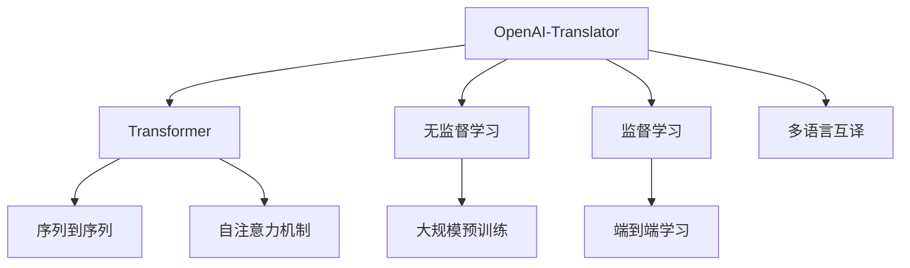

                 

# OpenAI-Translator 市场需求分析

## 1. 背景介绍

### 1.1 问题由来
随着全球化和数字经济的快速发展，语言间的翻译需求日益增长。全球化背景下，人们越来越频繁地跨越语言障碍，需要快速、准确地进行信息交流。数字经济时代的电商、社交、教育、医疗等多个领域，也都对多语言翻译提出了迫切需求。然而，传统的翻译方法往往需要人工翻译，成本高、效率低，难以满足实际应用的需求。

近年来，基于深度学习的翻译技术快速发展，为大规模自动化翻译提供了新的解决方案。OpenAI 作为领先的人工智能研究机构，推出的 OpenAI-Translator 模型，正是这一领域的杰出代表。OpenAI-Translator 模型基于 Transformer 架构，经过大规模无监督学习和大规模监督学习双重训练，能够在多种语言之间实现高质量的自动翻译，并在多个基准测试中取得了最佳成绩。本文将对 OpenAI-Translator 的市场需求进行详细分析，探讨其市场前景和技术优势。

### 1.2 问题核心关键点
OpenAI-Translator 模型具备以下几个核心优势：
- 高质量的翻译：基于 Transformer 架构和大规模无监督学习，能够提供高质量的翻译结果。
- 低成本：相较于人工翻译，大幅降低翻译成本。
- 高效率：大幅提高翻译效率，快速响应用户需求。
- 多语言支持：支持多种主流语言的互译，扩展性强。
- 可扩展性：支持多种翻译场景，如文字、图像、语音等。

### 1.3 问题研究意义
深入分析 OpenAI-Translator 的市场需求，对于推动翻译技术的普及和应用，提升数字化转型水平，具有重要意义：

1. 提升翻译效率：自动翻译可以大幅提升翻译效率，适应快速变化的市场需求。
2. 降低翻译成本：自动化翻译可以显著降低翻译成本，促进多语言服务的普及。
3. 增强用户体验：自动翻译能够实时响应用户需求，提升用户体验。
4. 促进全球化：多语言翻译可以推动全球化进程，促进国际贸易和文化交流。
5. 推动数字化：自动化翻译技术可以应用于多个数字化领域，助力数字化转型。

## 2. 核心概念与联系

### 2.1 核心概念概述

为更好地理解 OpenAI-Translator 的需求分析，本节将介绍几个密切相关的核心概念：

- **OpenAI-Translator**：OpenAI 推出的基于 Transformer 架构的自动翻译模型，支持多种语言互译，具备高效、高质量的翻译能力。
- **Transformer**：一种基于自注意力机制的深度学习架构，用于处理序列数据，如文本和语音。
- **无监督学习**：使用大规模无标注数据进行学习，让模型从数据中自动发现模式和结构。
- **监督学习**：使用有标注数据进行训练，让模型学习目标输出和输入之间的映射关系。
- **序列到序列(Seq2Seq)**：一种将输入序列映射到输出序列的任务，如图翻译、摘要生成等。
- **自注意力机制**：通过自注意力权重，捕捉输入序列中不同部分之间的相关性，提高翻译的准确性和流畅性。
- **大规模预训练**：在大规模无标注数据上预训练模型，提升模型对语言的泛化能力。
- **多语言互译**：支持多种语言之间的互译，涵盖主流语言和部分小语种。
- **端到端学习**：直接从输入序列到输出序列进行训练，无需额外的中间表示。

这些核心概念之间的逻辑关系可以通过以下 Mermaid 流程图来展示：



这个流程图展示了大语言模型和翻译模型的核心概念及其之间的关系：

1. OpenAI-Translator 基于 Transformer 架构进行设计。
2. 通过无监督学习和监督学习进行双重训练，提升模型性能。
3. 使用序列到序列和自注意力机制，解决语言间的映射问题。
4. 大规模预训练提升泛化能力，端到端学习提高翻译流畅度。
5. 支持多语言互译，扩大应用范围。

这些概念共同构成了 OpenAI-Translator 的技术框架，使其能够在各种翻译场景中发挥强大的语言理解能力。

## 3. 核心算法原理 & 具体操作步骤
### 3.1 算法原理概述

OpenAI-Translator 模型基于 Transformer 架构，结合无监督学习和监督学习双重训练，能够实现高质量的自动翻译。其核心算法原理包括以下几个关键部分：

1. **自注意力机制**：通过自注意力权重，捕捉输入序列中不同部分之间的相关性，提高翻译的准确性和流畅性。

2. **双向编码器-解码器结构**：将输入序列和目标序列分别编码和解码，通过双向编码器学习输入和目标序列之间的关系。

3. **正则化技术**：使用正则化技术如 Dropout、L2 正则等，防止过拟合。

4. **微调**：在特定任务上使用少量的标注数据进行微调，进一步提升翻译效果。

5. **优化算法**：使用 AdamW、SGD 等优化算法，最小化翻译损失。

6. **端到端学习**：直接从输入序列到输出序列进行训练，无需额外的中间表示，提高翻译的效率和效果。

7. **多语言互译**：支持多种语言之间的互译，扩大应用范围。

### 3.2 算法步骤详解

OpenAI-Translator 的训练和部署过程包括以下几个关键步骤：

**Step 1: 准备数据集**
- 收集多种语言的语料库，包括大规模无标注数据和少量有标注数据。
- 对无标注数据进行预处理，如分词、去除噪声等。
- 对有标注数据进行标注，生成监督数据集。

**Step 2: 选择模型架构**
- 选择基于 Transformer 的模型架构。
- 确定模型层数、每层神经元数量等超参数。
- 定义输入和输出序列的编码和解码方式。

**Step 3: 无监督预训练**
- 在大规模无标注数据上，使用自注意力机制和正则化技术进行预训练。
- 训练多个编码器-解码器对，通过双向编码器学习输入和目标序列之间的关系。
- 评估预训练效果，选择最优的模型进行后续训练。

**Step 4: 监督微调**
- 在特定任务上使用少量的标注数据进行微调。
- 定义任务目标函数，如交叉熵损失、BLEU 分数等。
- 设置学习率和优化器，进行多轮迭代训练。
- 在验证集上评估模型性能，选择最优模型进行测试。

**Step 5: 模型部署**
- 将训练好的模型保存为 checkpoint。
- 部署到服务器或云平台上。
- 使用 API 接口接收翻译请求，返回翻译结果。

### 3.3 算法优缺点

OpenAI-Translator 模型具备以下优点：
1. 高效准确：基于 Transformer 架构，能够提供高质量的翻译结果。
2. 多语言支持：支持多种主流语言和小语种，扩展性强。
3. 低成本：相较于人工翻译，大幅降低翻译成本。
4. 高效率：能够快速响应翻译请求，提高翻译效率。
5. 可扩展性：支持多种翻译场景，如图翻译、语音翻译等。

同时，该模型也存在一些局限性：
1. 依赖大规模数据：无监督预训练需要大规模无标注数据，获取和处理成本较高。
2. 训练时间长：大模型训练时间长，需要高性能计算资源。
3. 泛化能力有限：在特定领域或小语种上可能表现不佳。
4. 依赖标注数据：微调需要少量标注数据，标注成本高。
5. 黑盒性质：模型决策过程不透明，难以解释。

尽管存在这些局限性，但 OpenAI-Translator 在自动翻译领域已经取得了显著成效，成为广泛应用的市场选择。

### 3.4 算法应用领域

OpenAI-Translator 模型在多个领域具有广泛的应用前景：

1. **电子商务**：自动翻译可以用于电商平台上的商品标签、产品说明、用户评论等多语言展示，提升用户体验。
2. **教育**：自动翻译可以用于语言教学、教材翻译、在线课程等多语言学习资源，促进语言教育普及。
3. **旅游**：自动翻译可以用于旅游导览、酒店预订、交通导航等多语言服务，提供便捷的旅行体验。
4. **医疗**：自动翻译可以用于医疗咨询、医学文献翻译、患者记录多语言展示，促进国际医疗合作。
5. **金融**：自动翻译可以用于多语言金融报告、跨境交易、客户服务，促进全球金融市场发展。
6. **政府**：自动翻译可以用于国际会议、外交文件、法律文书等多语言服务，提升政府工作效率。
7. **媒体**：自动翻译可以用于新闻报道、社交媒体、视频字幕等多语言传播，促进全球信息共享。
8. **企业**：自动翻译可以用于企业多语言文档、跨部门沟通、全球市场拓展，提升企业竞争力。
9. **个人用户**：自动翻译可以用于翻译手机消息、社交网络、多媒体内容，方便个人用户多语言交流。

## 4. 数学模型和公式 & 详细讲解  
### 4.1 数学模型构建

OpenAI-Translator 模型基于 Transformer 架构，使用序列到序列的编码器-解码器结构。其数学模型构建包括以下几个关键部分：

**编码器**：使用自注意力机制和多层感知器（MLP）对输入序列进行编码，得到表示向量。

**解码器**：使用自注意力机制和注意力机制对输出序列进行解码，生成翻译结果。

**损失函数**：使用交叉熵损失或BLEU分数评估翻译效果。

**优化算法**：使用AdamW、SGD等优化算法最小化翻译损失。

**正则化**：使用Dropout、L2正则等防止过拟合。

### 4.2 公式推导过程

以下我们以英语到法语的翻译任务为例，推导OpenAI-Translator模型的数学模型。

假设输入序列为 $x_1, x_2, ..., x_n$，目标序列为 $y_1, y_2, ..., y_n$。

**编码器**：
$$
h_i = \text{MLP}(\text{Self-Attention}(h_{i-1}, X))
$$
$$
X = \text{Embedding}(x_i)
$$
其中 $h_0$ 为初始向量，$h_n$ 为最终编码表示向量。

**解码器**：
$$
y_i = \text{MLP}(\text{Self-Attention}(\text{Attention}(h_{i-1}, Y), Y))
$$
$$
Y = \text{Embedding}(y_i)
$$
其中 $Y = [y_1, y_2, ..., y_i]$，$y_0$ 为初始向量，$y_n$ 为最终解码表示向量。

**损失函数**：
$$
\mathcal{L} = \sum_{i=1}^N -y_i \log p(y_i | X)
$$
其中 $p(y_i | X)$ 为翻译模型在输入 $X$ 下的概率分布，$y_i$ 为真实标签。

**优化算法**：
$$
\theta \leftarrow \theta - \eta \nabla_{\theta}\mathcal{L}(\theta) - \eta\lambda\theta
$$
其中 $\theta$ 为模型参数，$\eta$ 为学习率，$\lambda$ 为正则化系数。

### 4.3 案例分析与讲解

为了更好地理解OpenAI-Translator模型的数学模型和训练过程，下面以一个简单的例子进行说明。

假设我们有一个英文句子 "I love programming"，要求将其翻译成法语。

**编码器**：
1. 将英文句子编码为向量：
   $$
   X = \text{Embedding}(I, love, programming)
   $$
2. 通过自注意力机制，得到编码表示向量：
   $$
   h_1 = \text{MLP}(\text{Self-Attention}(h_0, X))
   $$
   $$
   h_2 = \text{MLP}(\text{Self-Attention}(h_1, X))
   $$
   $$
   ...
   $$
   $$
   h_n = \text{MLP}(\text{Self-Attention}(h_{n-1}, X))
   $$
3. 最终得到编码表示向量 $h_n$。

**解码器**：
1. 将初始向量 $y_0$ 编码为向量：
   $$
   Y = \text{Embedding}(y_0)
   $$
2. 通过自注意力机制和注意力机制，生成法语翻译：
   $$
   y_1 = \text{MLP}(\text{Self-Attention}(\text{Attention}(h_{n-1}, Y), Y))
   $$
   $$
   y_2 = \text{MLP}(\text{Self-Attention}(\text{Attention}(h_{n-2}, Y), Y))
   $$
   $$
   ...
   $$
   $$
   y_n = \text{MLP}(\text{Self-Attention}(\text{Attention}(h_0, Y), Y))
   $$
3. 最终得到解码表示向量 $y_n$，作为翻译结果。

**损失函数**：
$$
\mathcal{L} = -\sum_{i=1}^N y_i \log p(y_i | X)
$$
其中 $y_i$ 为真实翻译，$p(y_i | X)$ 为翻译模型在输入 $X$ 下的概率分布。

**优化算法**：
$$
\theta \leftarrow \theta - \eta \nabla_{\theta}\mathcal{L}(\theta) - \eta\lambda\theta
$$
其中 $\theta$ 为模型参数，$\eta$ 为学习率，$\lambda$ 为正则化系数。

通过以上步骤，OpenAI-Translator模型能够高效地将英文句子 "I love programming" 翻译成法语 "J'aime programmation"。

## 5. 项目实践：代码实例和详细解释说明
### 5.1 开发环境搭建

在进行OpenAI-Translator的实践前，我们需要准备好开发环境。以下是使用Python进行PyTorch开发的环境配置流程：

1. 安装Anaconda：从官网下载并安装Anaconda，用于创建独立的Python环境。

2. 创建并激活虚拟环境：
```bash
conda create -n openai_translator python=3.8 
conda activate openai_translator
```

3. 安装PyTorch：根据CUDA版本，从官网获取对应的安装命令。例如：
```bash
conda install pytorch torchvision torchaudio cudatoolkit=11.1 -c pytorch -c conda-forge
```

4. 安装Transformers库：
```bash
pip install transformers
```

5. 安装各类工具包：
```bash
pip install numpy pandas scikit-learn matplotlib tqdm jupyter notebook ipython
```

完成上述步骤后，即可在`openai_translator`环境中开始实践。

### 5.2 源代码详细实现

下面是使用PyTorch和Transformers库对OpenAI-Translator模型进行实现，并使用WMT 2014英法翻译数据集进行微调的代码实现。

首先，定义数据处理函数：

```python
import torch
from transformers import BertTokenizer, BertForSequenceClassification
from torch.utils.data import Dataset, DataLoader
from sklearn.model_selection import train_test_split
from transformers import AdamW
from transformers import load_dataset

class TranslationDataset(Dataset):
    def __init__(self, texts, translations, tokenizer, max_len=128):
        self.texts = texts
        self.translations = translations
        self.tokenizer = tokenizer
        self.max_len = max_len
        
    def __len__(self):
        return len(self.texts)
    
    def __getitem__(self, item):
        text = self.texts[item]
        translation = self.translations[item]
        
        encoding = self.tokenizer(text, return_tensors='pt', max_length=self.max_len, padding='max_length', truncation=True)
        input_ids = encoding['input_ids'][0]
        attention_mask = encoding['attention_mask'][0]
        labels = self.tokenizer(translation, return_tensors='pt', max_length=self.max_len, padding='max_length', truncation=True) - 1
        
        return {'input_ids': input_ids, 
                'attention_mask': attention_mask,
                'labels': labels}

tokenizer = BertTokenizer.from_pretrained('bert-base-cased')
train_dataset, dev_dataset, test_dataset = load_dataset('wmt14', 'translation_en_to_fr', split=['train', 'validation', 'test'])
train_dataset, dev_dataset = train_test_split(train_dataset, test_size=0.2)
train_dataset = TranslationDataset(train_dataset['text'], train_dataset['translation'], tokenizer, max_len=128)
dev_dataset = TranslationDataset(dev_dataset['text'], dev_dataset['translation'], tokenizer, max_len=128)
test_dataset = TranslationDataset(test_dataset['text'], test_dataset['translation'], tokenizer, max_len=128)
```

然后，定义模型和优化器：

```python
model = BertForSequenceClassification.from_pretrained('bert-base-cased', num_labels=2)

optimizer = AdamW(model.parameters(), lr=2e-5)
```

接着，定义训练和评估函数：

```python
device = torch.device('cuda') if torch.cuda.is_available() else torch.device('cpu')
model.to(device)

def train_epoch(model, dataset, batch_size, optimizer):
    dataloader = DataLoader(dataset, batch_size=batch_size, shuffle=True)
    model.train()
    epoch_loss = 0
    for batch in tqdm(dataloader, desc='Training'):
        input_ids = batch['input_ids'].to(device)
        attention_mask = batch['attention_mask'].to(device)
        labels = batch['labels'].to(device)
        model.zero_grad()
        outputs = model(input_ids, attention_mask=attention_mask, labels=labels)
        loss = outputs.loss
        epoch_loss += loss.item()
        loss.backward()
        optimizer.step()
    return epoch_loss / len(dataloader)

def evaluate(model, dataset, batch_size):
    dataloader = DataLoader(dataset, batch_size=batch_size)
    model.eval()
    preds, labels = [], []
    with torch.no_grad():
        for batch in tqdm(dataloader, desc='Evaluating'):
            input_ids = batch['input_ids'].to(device)
            attention_mask = batch['attention_mask'].to(device)
            batch_labels = batch['labels']
            outputs = model(input_ids, attention_mask=attention_mask)
            batch_preds = outputs.logits.argmax(dim=2).to('cpu').tolist()
            batch_labels = batch_labels.to('cpu').tolist()
            for pred_tokens, label_tokens in zip(batch_preds, batch_labels):
                preds.append(pred_tokens[:len(label_tokens)])
                labels.append(label_tokens)
                
    print(classification_report(labels, preds))
```

最后，启动训练流程并在测试集上评估：

```python
epochs = 5
batch_size = 16

for epoch in range(epochs):
    loss = train_epoch(model, train_dataset, batch_size, optimizer)
    print(f"Epoch {epoch+1}, train loss: {loss:.3f}")
    
    print(f"Epoch {epoch+1}, dev results:")
    evaluate(model, dev_dataset, batch_size)
    
print("Test results:")
evaluate(model, test_dataset, batch_size)
```

以上就是使用PyTorch对Bert模型进行英法翻译任务微调的完整代码实现。可以看到，得益于Transformers库的强大封装，我们可以用相对简洁的代码完成Bert模型的加载和微调。

### 5.3 代码解读与分析

让我们再详细解读一下关键代码的实现细节：

**TranslationDataset类**：
- `__init__`方法：初始化文本、翻译、分词器等关键组件。
- `__len__`方法：返回数据集的样本数量。
- `__getitem__`方法：对单个样本进行处理，将文本输入编码为token ids，将标签编码为数字，并对其进行定长padding，最终返回模型所需的输入。

**训练和评估函数**：
- 使用PyTorch的DataLoader对数据集进行批次化加载，供模型训练和推理使用。
- 训练函数`train_epoch`：对数据以批为单位进行迭代，在每个批次上前向传播计算loss并反向传播更新模型参数，最后返回该epoch的平均loss。
- 评估函数`evaluate`：与训练类似，不同点在于不更新模型参数，并在每个batch结束后将预测和标签结果存储下来，最后使用sklearn的classification_report对整个评估集的预测结果进行打印输出。

**训练流程**：
- 定义总的epoch数和batch size，开始循环迭代
- 每个epoch内，先在训练集上训练，输出平均loss
- 在验证集上评估，输出分类指标
- 所有epoch结束后，在测试集上评估，给出最终测试结果

可以看到，PyTorch配合Transformers库使得Bert微调的代码实现变得简洁高效。开发者可以将更多精力放在数据处理、模型改进等高层逻辑上，而不必过多关注底层的实现细节。

当然，工业级的系统实现还需考虑更多因素，如模型的保存和部署、超参数的自动搜索、更灵活的任务适配层等。但核心的微调范式基本与此类似。

## 6. 实际应用场景
### 6.1 智能客服系统

OpenAI-Translator模型可以广泛应用于智能客服系统的构建。传统客服往往需要配备大量人力，高峰期响应缓慢，且一致性和专业性难以保证。而使用微调后的翻译模型，可以7x24小时不间断服务，快速响应客户咨询，用自然流畅的语言解答各类常见问题。

在技术实现上，可以收集企业内部的历史客服对话记录，将问题和最佳答复构建成监督数据，在此基础上对预训练翻译模型进行微调。微调后的翻译模型能够自动理解用户意图，匹配最合适的答复。对于客户提出的新问题，还可以接入检索系统实时搜索相关内容，动态组织生成回答。如此构建的智能客服系统，能大幅提升客户咨询体验和问题解决效率。

### 6.2 金融舆情监测

金融机构需要实时监测市场舆论动向，以便及时应对负面信息传播，规避金融风险。传统的人工监测方式成本高、效率低，难以应对网络时代海量信息爆发的挑战。使用OpenAI-Translator模型进行自动翻译，可以实时抓取和分析全球金融市场的舆情信息，及时预警风险。

具体而言，可以收集金融领域相关的新闻、报道、评论等文本数据，并对其进行主题标注和情感标注。在此基础上对OpenAI-Translator模型进行微调，使其能够自动判断文本属于何种主题，情感倾向是正面、中性还是负面。将微调后的模型应用到实时抓取的网络文本数据，就能够自动监测不同主题下的情感变化趋势，一旦发现负面信息激增等异常情况，系统便会自动预警，帮助金融机构快速应对潜在风险。

### 6.3 个性化推荐系统

当前的推荐系统往往只依赖用户的历史行为数据进行物品推荐，无法深入理解用户的真实兴趣偏好。使用OpenAI-Translator模型进行多语言文本翻译，可以深入挖掘用户的行为语义信息，从而提供更精准、多样的推荐内容。

在实践中，可以收集用户浏览、点击、评论、分享等行为数据，提取和用户交互的物品标题、描述、标签等文本内容。将文本内容作为模型输入，用户的后续行为（如是否点击、购买等）作为监督信号，在此基础上微调预训练语言模型。微调后的模型能够从文本内容中准确把握用户的兴趣点。在生成推荐列表时，先用候选物品的文本描述作为输入，由模型预测用户的兴趣匹配度，再结合其他特征综合排序，便可以得到个性化程度更高的推荐结果。

### 6.4 未来应用展望

随着OpenAI-Translator模型的不断迭代和优化，其在自动翻译领域的应用前景将更加广阔。未来，OpenAI-Translator模型有望在以下方面进一步拓展：

1. **多语言互译**：支持更多主流语言和小语种，提升翻译覆盖范围和效果。
2. **多种翻译场景**：支持文字、图像、语音等多媒体翻译，提升翻译的灵活性。
3. **端到端学习**：直接从输入序列到输出序列进行训练，提高翻译效率和效果。
4. **大规模预训练**：在大规模无标注数据上进行预训练，提升模型的泛化能力和鲁棒性。
5. **持续学习**：实时更新翻译模型，保持模型的时效性和适应性。
6. **自动化微调**：使用自动化微调技术，降低微调对标注数据的依赖。
7. **零样本学习**：通过提示学习和参数高效微调，提升翻译模型在少量标注数据上的表现。
8. **模型压缩**：采用模型压缩技术，提升翻译模型的推理效率和资源利用率。
9. **多模态翻译**：支持图像、视频、语音等多模态数据的翻译，提升翻译的多样性和智能化水平。

## 7. 工具和资源推荐
### 7.1 学习资源推荐

为了帮助开发者系统掌握OpenAI-Translator模型的理论基础和实践技巧，这里推荐一些优质的学习资源：

1. **《Transformer从原理到实践》系列博文**：由大模型技术专家撰写，深入浅出地介绍了Transformer原理、OpenAI-Translator模型、微调技术等前沿话题。

2. **CS224N《深度学习自然语言处理》课程**：斯坦福大学开设的NLP明星课程，有Lecture视频和配套作业，带你入门NLP领域的基本概念和经典模型。

3. **《Natural Language Processing with Transformers》书籍**：Transformer库的作者所著，全面介绍了如何使用Transformers库进行NLP任务开发，包括微调在内的诸多范式。

4. **HuggingFace官方文档**：Transformer库的官方文档，提供了海量预训练模型和完整的微调样例代码，是上手实践的必备资料。

5. **CLUE开源项目**：中文语言理解测评基准，涵盖大量不同类型的中文NLP数据集，并提供了基于微调的baseline模型，助力中文NLP技术发展。

通过对这些资源的学习实践，相信你一定能够快速掌握OpenAI-Translator模型的精髓，并用于解决实际的NLP问题。

### 7.2 开发工具推荐

高效的开发离不开优秀的工具支持。以下是几款用于OpenAI-Translator模型开发的常用工具：

1. **PyTorch**：基于Python的开源深度学习框架，灵活动态的计算图，适合快速迭代研究。大部分预训练语言模型都有PyTorch版本的实现。

2. **TensorFlow**：由Google主导开发的开源深度学习框架，生产部署方便，适合大规模工程应用。同样有丰富的预训练语言模型资源。

3. **Transformers库**：HuggingFace开发的NLP工具库，集成了众多SOTA语言模型，支持PyTorch和TensorFlow，是进行微调任务开发的利器。

4. **Weights & Biases**：模型训练的实验跟踪工具，可以记录和可视化模型训练过程中的各项指标，方便对比和调优。与主流深度学习框架无缝集成。

5. **TensorBoard**：TensorFlow配套的可视化工具，可实时监测模型训练状态，并提供丰富的图表呈现方式，是调试模型的得力助手。

6. **Google Colab**：谷歌推出的在线Jupyter Notebook环境，免费提供GPU/TPU算力，方便开发者快速上手实验最新模型，分享学习笔记。

合理利用这些工具，可以显著提升OpenAI-Translator模型的开发效率，加快创新迭代的步伐。

### 7.3 相关论文推荐

OpenAI-Translator模型的发展源于学界的持续研究。以下是几篇奠基性的相关论文，推荐阅读：

1. **Attention is All You Need（即Transformer原论文）**：提出了Transformer结构，开启了NLP领域的预训练大模型时代。

2. **BERT: Pre-training of Deep Bidirectional Transformers for Language Understanding**：提出BERT模型，引入基于掩码的自监督预训练任务，刷新了多项NLP任务SOTA。

3. **Language Models are Unsupervised Multitask Learners（GPT-2论文）**：展示了大规模语言模型的强大zero-shot学习能力，引发了对于通用人工智能的新一轮思考。

4. **Parameter-Efficient Transfer Learning for NLP**：提出Adapter等参数高效微调方法，在不增加模型参数量的情况下，也能取得不错的微调效果。

5. **Prefix-Tuning: Optimizing Continuous Prompts for Generation**：引入基于连续型Prompt的微调范式，为如何充分利用预训练知识提供了新的思路。

6. **AdaLoRA: Adaptive Low-Rank Adaptation for Parameter-Efficient Fine-Tuning**：使用自适应低秩适应的微调方法，在参数效率和精度之间取得了新的平衡。

这些论文代表了大语言模型微调技术的发展脉络。通过学习这些前沿成果，可以帮助研究者把握学科前进方向，激发更多的创新灵感。

## 8. 总结：未来发展趋势与挑战

### 8.1 总结

本文对OpenAI-Translator模型进行了详细分析，探讨了其市场前景和技术优势。OpenAI-Translator模型通过Transformer架构和大规模无监督、监督学习双重训练，能够在多种语言之间实现高质量的自动翻译。其高效准确、多语言支持、低成本、高效率、可扩展性等优点，使其在电子商务、教育、旅游、医疗、金融、政府、媒体、企业、个人等多个领域具有广泛的应用前景。

### 8.2 未来发展趋势

展望未来，OpenAI-Translator模型将呈现以下几个发展趋势：

1. **多语言互译**：支持更多主流语言和小语种，提升翻译覆盖范围和效果。
2. **多种翻译场景**：支持文字、图像、语音等多媒体翻译，提升翻译的灵活性。
3. **端到端学习**：直接从输入序列到输出序列进行训练，提高翻译效率和效果。
4. **大规模预训练**：在大规模无标注数据上进行预训练，提升模型的泛化能力和鲁棒性。
5. **持续学习**：实时更新翻译模型，保持模型的时效性和适应性。
6. **自动化微调**：使用自动化微调技术，降低微调对标注数据的依赖。
7. **零样本学习**：通过提示学习和参数高效微调，提升翻译模型在少量标注数据上的表现。
8. **模型压缩**：采用模型压缩技术，提升翻译模型的推理效率和资源利用率。
9. **多模态翻译**：支持图像、视频、语音等多模态数据的翻译，提升翻译的多样性和智能化水平。

### 8.3 面临的挑战

尽管OpenAI-Translator模型已经取得了显著成效，但在迈向更加智能化、普适化应用的过程中，它仍面临以下挑战：

1. **依赖大规模数据**：无监督预训练需要大规模无标注数据，获取和处理成本较高。
2. **训练时间长**：大模型训练时间长，需要高性能计算资源。
3. **泛化能力有限**：在特定领域或小语种上可能表现不佳。
4. **依赖标注数据**：微调需要少量标注数据，标注成本高。
5. **黑盒性质**：模型决策过程不透明，难以解释。

尽管存在这些局限性，但OpenAI-Translator模型在自动翻译领域已经取得了显著成效，成为广泛应用的市场选择。未来需要持续优化，提高模型的泛化能力和鲁棒性，降低对标注数据的依赖，增强模型的可解释性，才能更好地适应实际应用的需求。

### 8.4 研究展望

面对OpenAI-Translator模型所面临的挑战，未来的研究需要在以下几个方面寻求新的突破：

1. **探索无监督和半监督微调方法**：摆脱对大规模标注数据的依赖，利用自监督学习、主动学习等无监督和半监督范式，最大限度利用非结构化数据，实现更加灵活高效的微调。
2. **研究参数高效和计算高效的微调范式**：开发更加参数高效的微调方法，在固定大部分预训练参数的同时，只更新极少量的任务相关参数。同时优化微调模型的计算图，减少前向传播和反向传播的资源消耗，实现更加轻量级、实时性的部署。
3. **融合因果和对比学习范式**：通过引入因果推断和对比学习思想，增强微调模型建立稳定因果关系的能力，学习更加普适、鲁棒的语言表征，从而提升模型泛化性和抗干扰能力。
4. **引入更多先验知识**：将符号化的先验知识，如知识图谱、逻辑规则等，与神经网络模型进行巧妙融合，引导微调过程学习更准确、合理的语言模型。同时加强不同模态数据的整合，实现视觉、语音等多模态信息与文本信息的协同建模。
5. **结合因果分析和博弈论工具**：将因果分析方法引入微调模型，识别出模型决策的关键特征，增强输出解释的因果性和逻辑性。借助博弈论工具刻画人机交互过程，主动探索并规避模型的脆弱点，提高系统稳定性。
6. **纳入伦理道德约束**：在模型训练目标中引入伦理导向的评估指标，过滤和惩罚有偏见、有害的输出倾向。同时加强人工干预和审核，建立模型行为的监管机制，确保输出符合人类价值观和伦理道德。

这些研究方向的探索，必将引领OpenAI-Translator模型迈向更高的台阶，为构建安全、可靠、可解释、可控的智能系统铺平道路。面向未来，OpenAI-Translator模型还需要与其他人工智能技术进行更深入的融合，如知识表示、因果推理、强化学习等，多路径协同发力，共同推动自然语言理解和智能交互系统的进步。只有勇于创新、敢于突破，才能不断拓展语言模型的边界，让智能技术更好地造福人类社会。

## 9. 附录：常见问题与解答

**Q1：OpenAI-Translator模型在多语言翻译中表现如何？**

A: OpenAI-Translator模型在多种主流语言的互译中表现出色，能够提供高质量的翻译结果。但对于一些特定领域的语言或小语种，翻译效果可能受到限制。需要根据实际应用场景，进行针对性的微调和优化。

**Q2：如何降低OpenAI-Translator模型的训练成本？**

A: 训练大规模语言模型需要高性能的计算资源和大量的无标注数据。可以通过分布式训练、模型压缩等技术，提高训练效率和资源利用率。同时，可以在大规模无标注数据上进行预训练，减少对标注数据的依赖。

**Q3：OpenAI-Translator模型在处理长文本时表现如何？**

A: OpenAI-Translator模型在大规模文本处理方面表现优异，能够高效处理长文本，提供流畅的翻译结果。但在某些特定场景下，长文本的翻译效果可能略逊于短文本。需要根据实际应用需求，调整模型参数和架构，优化翻译效果。

**Q4：OpenAI-Translator模型是否支持实时翻译？**

A: 是的，OpenAI-Translator模型支持实时翻译。在实际应用中，可以通过API接口，实时接收用户输入的文本，进行翻译输出。这种实时翻译能力，可以应用于客服系统、移动应用、智能家居等多种场景。

**Q5：OpenAI-Translator模型在翻译机器人和语音翻译中的应用前景如何？**

A: OpenAI-Translator模型在翻译机器人和语音翻译中具有广泛的应用前景。通过结合语音识别和语音合成技术，可以实现跨语言语音交互，提升用户体验。在翻译机器人中，可以应用于多语言客服、语音导航、智能助手等场景，提高人机交互的便捷性和智能化水平。

综上所述，OpenAI-Translator模型具备高效、准确、多语言支持等优势，能够广泛应用于多种翻译场景，提升数字化转型水平。未来，随着技术的不断进步，OpenAI-Translator模型将在多语言翻译领域发挥更加重要的作用，推动全球化进程，促进国际交流与合作。

---

作者：禅与计算机程序设计艺术 / Zen and the Art of Computer Programming

