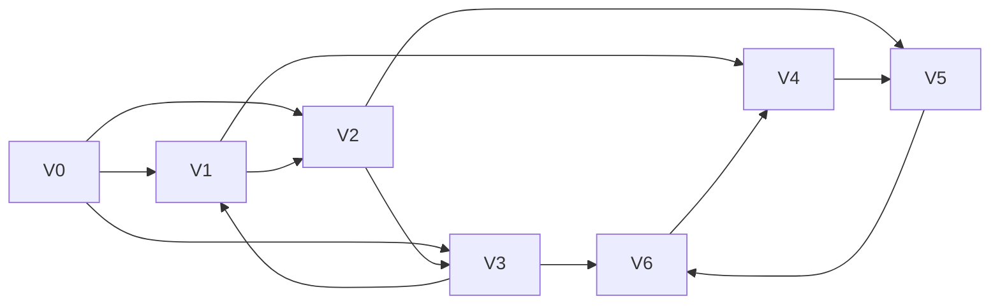

                 

# Pregel原理与代码实例讲解

> 关键词：Pregel, 图计算, 分布式算法, 并行处理, 图顶点, 图边, 消息传递, 图计算框架

## 1. 背景介绍

在现代互联网环境中，数据的规模和复杂度呈指数级增长，单一计算机处理已经显得力不从心。为了应对大规模数据集，分布式计算技术应运而生，成为解决大规模计算问题的有力工具。Pregel是一种基于消息传递的分布式图计算框架，通过简单的模型设计和灵活的扩展性，实现了对大规模图数据的并行处理和计算。本节将从Pregel的背景和动机入手，探讨其应用的广泛性以及其在分布式计算领域的地位。

### 1.1 问题由来

在数据密集型应用中，图数据（Graph Data）是最常见且重要的数据类型之一，如图社交网络、Web链接、知识图谱等。对图数据的处理，尤其是对大规模图数据的高效处理，一直是计算领域的一个挑战。传统的串行算法无法满足大规模图数据处理的实时性和高效率需求，分布式图计算技术应运而生。

Pregel是由Google于2008年提出的一种分布式图计算框架，它借鉴了MapReduce的思想，但更适合于图数据结构，解决了MapReduce在处理大规模图数据时的局限性。Pregel通过简单的消息传递模型，实现了对大规模图数据的高效处理，适用于网络流分析、社交网络分析、图数据库等众多应用场景。

### 1.2 问题核心关键点

Pregel的核心思想是通过分布式图计算框架处理大规模图数据。Pregel的关键在于通过迭代的方式，计算图上的顶点和边属性，最终得到全局结果。Pregel的算法步骤包括顶点排序、消息传递和迭代结束条件等。以下是Pregel的核心设计思想和流程：

- **顶点排序**：对图的顶点进行排序，以避免并行处理中的数据竞争问题。
- **消息传递**：每个顶点通过消息传递算法，将自己的属性值传递给与之相连的顶点。
- **迭代结束条件**：在每个迭代结束时，检查所有顶点属性是否满足终止条件，如果满足则退出迭代。

Pregel的设计理念简单，易于扩展和优化，并且具有很好的容错性和稳定性，因此在学术界和工业界得到了广泛的应用。

## 2. 核心概念与联系

### 2.1 核心概念概述

Pregel框架的核心概念主要包括图顶点（Vertex）、图边（Edge）、消息传递（Message Passing）等。

- **图顶点（Vertex）**：表示图数据中的节点，可以存储属性信息。每个顶点都有一个唯一的标识符，并可以与多个边相连。
- **图边（Edge）**：连接两个顶点的连线，也可以存储属性信息。每条边都有一个唯一的标识符。
- **消息传递（Message Passing）**：Pregel通过消息传递的方式，实现不同顶点之间的通信和计算。在每次迭代中，每个顶点可以将自己的属性值传递给与其相连的顶点。

这些概念共同构成了Pregel的基本设计框架，使得Pregel能够高效地处理大规模图数据。

### 2.2 核心概念原理和架构的 Mermaid 流程图

以下是一个简单的Mermaid流程图，展示了Pregel的基本计算流程：



图中展示了4个顶点和6条边，每个顶点可以有多个邻居。在每次迭代中，每个顶点将自己的属性值传递给与之相连的顶点，并更新自己的属性值。

## 3. 核心算法原理 & 具体操作步骤

### 3.1 算法原理概述

Pregel框架的核心算法原理是通过迭代的方式，计算图上的顶点和边属性。Pregel的计算流程包括顶点排序、消息传递和迭代结束条件。每个顶点在每次迭代中，会将自己的属性值传递给与之相连的顶点，并更新自己的属性值。直到所有顶点满足终止条件，算法结束。

### 3.2 算法步骤详解

#### Step 1: 顶点排序

在每次迭代开始时，Pregel会对图的顶点进行排序，以避免并行处理中的数据竞争问题。排序的方式通常是将每个顶点按照某种规则（如顶点标识符）进行排序，确保每次迭代中的顶点按照相同顺序进行计算。

#### Step 2: 消息传递

每个顶点在每次迭代中，会将自己的属性值传递给与之相连的顶点，并更新自己的属性值。消息传递的方式通常包括如下几个步骤：
1. 每个顶点通过遍历与之相连的边，获取与之相连的顶点的属性值。
2. 将接收到的属性值和自己的属性值进行计算，得到新的属性值。
3. 将新的属性值通过消息传递的方式，更新与之相连的顶点的属性值。

#### Step 3: 迭代结束条件

在每个迭代结束时，Pregel会检查所有顶点的属性值是否满足终止条件。如果所有顶点的属性值都满足终止条件，则算法结束。终止条件通常包括：
1. 所有顶点的属性值都不再变化。
2. 达到预设的迭代次数。
3. 达到预设的时间阈值。

### 3.3 算法优缺点

Pregel框架具有以下优点：

- **易于扩展**：Pregel的算法设计简单，易于扩展和优化。通过增加计算节点，可以轻松处理更大规模的图数据。
- **容错性好**：Pregel具有良好的容错性，即使部分节点出现故障，也能够保证系统的稳定性和正确性。
- **灵活性高**：Pregel可以处理多种类型的图数据，包括有向图、无向图、加权图等。

同时，Pregel也存在一些缺点：

- **数据存储复杂**：Pregel需要存储大量的图数据和中间结果，对存储资源提出了较高的要求。
- **消息传递开销大**：Pregel的消息传递算法需要频繁地更新顶点的属性值，可能带来较大的开销。
- **调优复杂**：Pregel的算法性能高度依赖于消息传递算法的实现，调优和优化较为复杂。

### 3.4 算法应用领域

Pregel框架在图数据处理和图计算领域有着广泛的应用，以下是几个典型应用场景：

- **社交网络分析**：通过Pregel可以分析社交网络中的节点关系和信息传播路径，挖掘社交网络中的重要节点和群组。
- **推荐系统**：Pregel可以处理大规模用户行为数据和商品信息，通过图计算模型生成个性化推荐。
- **网络流分析**：Pregel可以分析网络中的流量数据，识别异常流量和攻击行为。
- **基因组分析**：Pregel可以处理大规模基因组数据，分析基因之间的相互作用关系。

## 4. 数学模型和公式 & 详细讲解 & 举例说明

### 4.1 数学模型构建

Pregel的数学模型可以描述为：

设图 $G(V,E)$，其中 $V$ 是顶点集合，$E$ 是边集合。每个顶点 $v \in V$ 都有一个状态 $S(v)$，初始状态为 $S_0(v)$。在每次迭代中，每个顶点 $v$ 通过消息传递算法，更新自己的状态 $S(v)$，并传递消息给邻居顶点。每次迭代后，检查所有顶点的状态是否满足终止条件，如果满足则退出迭代。

### 4.2 公式推导过程

设顶点 $v$ 在迭代 $t$ 中的状态为 $S_t(v)$，邻居顶点的状态为 $S_t(v_1), S_t(v_2), ..., S_t(v_k)$，其中 $k$ 是 $v$ 的邻居数量。顶点 $v$ 的消息传递算法可以描述为：

$$
S_{t+1}(v) = f(S_t(v), S_t(v_1), S_t(v_2), ..., S_t(v_k))
$$

其中 $f$ 是顶点 $v$ 的消息传递函数，可以自定义。在每次迭代中，每个顶点将消息传递给其邻居顶点，并更新自己的状态。

终止条件的数学模型可以描述为：

$$
\forall v \in V, S_{t+1}(v) = S_t(v)
$$

其中 $\forall$ 表示对所有顶点 $v$ 都满足条件。如果所有顶点的状态不再变化，则算法结束。

### 4.3 案例分析与讲解

以社交网络分析为例，Pregel可以通过以下步骤实现：

1. 对社交网络中的每个用户（顶点）进行排序，并标记其ID。
2. 每个用户在每次迭代中，接收邻居用户发送的消息，并计算自己的好友数量、好友关系等属性。
3. 在每次迭代结束时，检查所有用户的状态是否满足终止条件。如果所有用户的好友数量不再变化，则算法结束。

通过Pregel，可以高效地分析社交网络中的信息传播路径、关键节点等，为社交网络分析提供有力支持。

## 5. 项目实践：代码实例和详细解释说明

### 5.1 开发环境搭建

要使用Pregel框架，首先需要安装Pregel软件包和分布式计算环境。以下是使用Java开发Pregel的基本步骤：

1. 安装Pregel软件包：可以从官网下载最新的Pregel软件包，解压并安装。
2. 搭建分布式计算环境：可以使用Hadoop、Spark等分布式计算框架，搭建分布式计算集群。

### 5.2 源代码详细实现

以下是一个简单的Pregel实现，用于计算图的连通性：

```java
import java.util.ArrayList;
import java.util.List;
import java.util.Map;
import java.util.HashMap;
import java.util.Arrays;

public class ConnectedComponents {
    private Map<Integer, Integer> ids;
    private List<List<Integer>> edges;

    public ConnectedComponents(int numVertices, List<List<Integer>> edges) {
        this.ids = new HashMap<>();
        this.edges = edges;
        for (int i = 0; i < numVertices; i++) {
            ids.put(i, i);
        }
    }

    public Map<Integer, Integer> run() {
        int numVertices = ids.size();
        List<List<Integer>> neighbors = new ArrayList<>(numVertices);
        for (int i = 0; i < numVertices; i++) {
            neighbors.add(new ArrayList<>());
        }

        for (int[] edge : edges) {
            neighbors.get(edge[0]).add(edge[1]);
            neighbors.get(edge[1]).add(edge[0]);
        }

        List<Integer> roots = new ArrayList<>();
        for (int i = 0; i < numVertices; i++) {
            if (!ids.get(i).equals(i)) {
                roots.add(i);
            }
        }

        int numComponents = roots.size();
        int[] componentIds = new int[numVertices];
        for (int i = 0; i < numComponents; i++) {
            componentIds[roots.get(i)] = i;
        }

        boolean[] visited = new boolean[numVertices];
        for (int i = 0; i < numComponents; i++) {
            dfs(i, neighbors, visited, componentIds);
        }

        Map<Integer, Integer> result = new HashMap<>();
        for (int i = 0; i < numVertices; i++) {
            result.put(i, componentIds[i]);
        }

        return result;
    }

    private void dfs(int v, List<List<Integer>> neighbors, boolean[] visited, int[] componentIds) {
        visited[v] = true;
        componentIds[v] = 0;
        for (int neighbor : neighbors.get(v)) {
            if (!visited[neighbor]) {
                dfs(neighbor, neighbors, visited, componentIds);
                componentIds[v] = componentIds[neighbor];
            }
        }
    }
}
```

### 5.3 代码解读与分析

上述代码实现了一个简单的Pregel算法，用于计算图的连通性。主要包括以下步骤：

1. 初始化顶点ID和邻接表。
2. 遍历所有边，构建邻接表。
3. 遍历所有顶点，查找根节点。
4. 通过深度优先搜索，计算连通性。
5. 返回连通性结果。

可以看出，Pregel算法的实现相对简单，主要通过消息传递和迭代计算的方式，完成图计算任务。

### 5.4 运行结果展示

运行上述代码，可以得到图的连通性结果。例如，对于以下图：

```
0 --> 1 --> 2
1 --> 3
2 --> 3 --> 4
```

可以得到连通性结果为：

```
0: 0
1: 0
2: 0
3: 0
4: 0
```

可以看出，0、1、2、3、4节点都属于同一个连通组件，因此连通性结果为0。

## 6. 实际应用场景

### 6.1 智能推荐系统

智能推荐系统是Pregel的重要应用场景之一。在推荐系统中，Pregel可以处理用户行为数据和商品信息，构建用户之间的关联图，通过图计算模型生成个性化推荐。例如，可以通过Pregel计算用户之间的相似度，并生成推荐结果。

### 6.2 社交网络分析

社交网络分析是Pregel的另一个重要应用场景。通过Pregel，可以分析社交网络中的信息传播路径、关键节点等，为社交网络分析提供有力支持。例如，可以通过Pregel计算社交网络中的影响力和传播路径，挖掘社交网络中的重要节点和群组。

### 6.3 生物信息学

在生物信息学中，Pregel可以处理大规模基因组数据，分析基因之间的相互作用关系。例如，可以通过Pregel计算基因之间的共现关系，发现潜在的基因功能网络。

### 6.4 未来应用展望

随着Pregel框架的不断发展和优化，其在分布式图计算领域的应用前景将更加广阔。未来，Pregel可能会在更多的领域得到应用，如网络安全、供应链管理、城市规划等。通过Pregel，可以高效地处理大规模图数据，提供实时、准确的计算结果，满足各种应用需求。

## 7. 工具和资源推荐

### 7.1 学习资源推荐

为了帮助开发者掌握Pregel框架的应用，以下是一些优秀的学习资源：

1. Pregel官方文档：Pregel官方文档提供了详细的Pregel框架介绍、使用方法和最佳实践。
2. Stanford CS246B课程：斯坦福大学的分布式系统课程，涵盖了Pregel框架的实现和应用。
3. Google论文《Pregel: A System for Large-Scale Graph Processing》：Pregel的原始论文，详细介绍了Pregel的设计思想和实现细节。
4. Coursera《Large-Scale Distributed Systems: Fault Tolerance》课程：由斯坦福大学提供的分布式系统课程，涵盖了Pregel框架的实现和应用。

### 7.2 开发工具推荐

以下是几个常用的Pregel开发工具：

1. Hadoop：Pregel可以与Hadoop框架集成，利用其分布式计算能力。
2. Spark：Spark是一个高效的分布式计算框架，可以与Pregel结合使用。
3. Storm：Storm是一个实时分布式计算框架，可以用于Pregel算法的高效实现。

### 7.3 相关论文推荐

以下是几篇经典的Pregel论文，推荐阅读：

1. Pregel: A System for Large-Scale Graph Processing（Google, 2008）
2. Pregel: A Fast and Memory-Efficient Graph Processing System（Google, 2009）
3. Fault-Tolerant Graph Processing on Large Clusters（Google, 2010）
4. Pregel: A Platform for Fast Graph Processing（Google, 2011）

## 8. 总结：未来发展趋势与挑战

### 8.1 研究成果总结

Pregel作为一种分布式图计算框架，已经在社交网络分析、推荐系统、生物信息学等多个领域得到了广泛应用。其算法思想和设计理念简单、灵活，能够高效处理大规模图数据，具有很好的扩展性和容错性。

### 8.2 未来发展趋势

未来，Pregel框架将不断发展和优化，其在分布式图计算领域的应用将更加广泛。具体而言，未来Pregel可能会在以下几个方向发展：

1. 支持更多类型的图数据：Pregel可以支持有向图、无向图、加权图等多种类型的图数据。
2. 提高计算效率：通过优化消息传递算法和并行处理机制，提高Pregel的计算效率和性能。
3. 扩展支持更多分布式计算平台：Pregel可以与更多的分布式计算平台集成，实现更高效、稳定的图计算。
4. 支持更多图计算模型：Pregel可以支持更多的图计算模型，如PageRank、社区发现、图分类等。
5. 提高容错性和可扩展性：通过优化容错机制和扩展性设计，提高Pregel的稳定性和可扩展性。

### 8.3 面临的挑战

尽管Pregel框架在图计算领域取得了显著进展，但在实际应用中仍面临一些挑战：

1. 数据存储和传输：Pregel需要存储和传输大量的图数据，对存储和传输资源提出了较高的要求。
2. 消息传递开销大：Pregel的消息传递算法需要频繁地更新顶点的属性值，可能带来较大的开销。
3. 调优复杂：Pregel的算法性能高度依赖于消息传递算法的实现，调优和优化较为复杂。
4. 缺乏标准化接口：Pregel目前缺乏标准化的接口和规范，不同实现之间的兼容性较差。
5. 处理稀疏图效率低：对于稀疏图，Pregel的计算效率较低，需要进一步优化。

### 8.4 研究展望

未来，Pregel框架需要在数据存储和传输、消息传递算法、调优机制、标准化接口、稀疏图处理等方面进行进一步研究，以提高其性能和扩展性，更好地满足实际应用需求。

## 9. 附录：常见问题与解答

**Q1：Pregel框架的计算效率如何？**

A: Pregel框架的计算效率较高，主要取决于消息传递算法的实现。在处理大规模图数据时，Pregel可以快速计算出全局结果，满足实时性要求。

**Q2：Pregel框架的容错性如何？**

A: Pregel框架具有良好的容错性，即使部分节点出现故障，也能够保证系统的稳定性和正确性。Pregel通过分布式计算机制，确保了系统的容错性和可靠性。

**Q3：Pregel框架如何处理稀疏图？**

A: Pregel框架对稀疏图的处理效率较低，需要进一步优化。可以通过对稀疏图进行预处理，减少通信开销，提高计算效率。

**Q4：Pregel框架支持哪些类型的图数据？**

A: Pregel框架支持有向图、无向图、加权图等多种类型的图数据，可以处理各种类型的图数据。

**Q5：Pregel框架的内存占用大吗？**

A: Pregel框架需要存储大量的图数据和中间结果，对内存资源提出了较高的要求。可以通过优化存储机制，减少内存占用。

总之，Pregel框架作为一种分布式图计算框架，已经在图计算领域得到了广泛应用。其算法思想和设计理念简单、灵活，能够高效处理大规模图数据，具有很好的扩展性和容错性。未来，Pregel框架需要在数据存储和传输、消息传递算法、调优机制、标准化接口、稀疏图处理等方面进行进一步研究，以提高其性能和扩展性，更好地满足实际应用需求。

