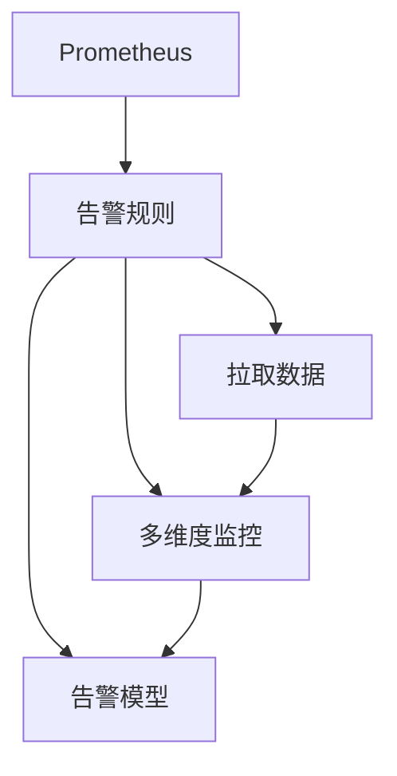

                 

# Prometheus告警规则优化

在微服务架构日益普及的今天，系统监控已成为必不可少的一部分。Prometheus作为一个开源的监控系统，因其灵活性和高效性广受开发者喜爱。然而，随着监控任务的复杂性和告警规则数量的增加，系统维护和优化成为了一项挑战。本文将介绍如何通过优化Prometheus告警规则，提升监控系统的有效性和可靠性。

## 1. 背景介绍

### 1.1 问题由来

随着微服务架构的演进，系统复杂性不断增加，监控任务也愈发复杂。传统的基于规则的告警系统往往难以应对动态变化的环境。如何构建可扩展、可维护、可配置的告警系统，成为系统监控领域的痛点。

Prometheus作为一款灵活性极高的监控系统，基于拉取数据的设计，可以适应各种不同的数据源。同时，其灵活的告警规则配置机制，使得开发人员可以根据实际情况灵活定制告警规则。然而，在实际应用中，告警规则的复杂性和数量增加，使得系统的可维护性和有效性难以保证。

### 1.2 问题核心关键点

Prometheus告警规则优化需要关注以下关键点：
- 告警规则的配置灵活性和扩展性
- 告警规则的可维护性和可配置性
- 告警规则的实时性和可靠性
- 告警规则的误报率和漏报率

这些问题需要通过合理的告警规则配置和优化策略来解决，以提升监控系统的整体性能。

## 2. 核心概念与联系

### 2.1 核心概念概述

为更好地理解Prometheus告警规则优化方法，本节将介绍几个密切相关的核心概念：

- Prometheus：基于拉取数据的开源监控系统，支持多种数据源和告警规则配置。
- 告警规则：定义监控指标如何触发告警的规则，包括评估指标、告警条件和通知策略等。
- 拉取数据：通过定期拉取数据，Prometheus实现对监控对象的实时监控。
- 多维度监控：通过维度和标签信息，实现对监控对象的细粒度监控。
- 告警模型：描述告警触发和处理机制的模型，包括时间窗口、事件分组、告警抑制等。

这些核心概念之间的逻辑关系可以通过以下Mermaid流程图来展示：



这个流程图展示了几者之间的关系：

1. Prometheus通过拉取数据对监控对象进行实时监控。
2. 告警规则定义了如何根据拉取的数据触发告警，包括维度和标签信息。
3. 多维度监控使得Prometheus能够对不同维度的数据进行细粒度监控。
4. 告警模型定义了告警触发和处理机制。

这些概念共同构成了Prometheus监控系统的核心逻辑，使得系统能够根据不同场景的需求，灵活配置告警规则，实现高精度的监控。

## 3. 核心算法原理 & 具体操作步骤
### 3.1 算法原理概述

Prometheus告警规则优化的核心在于告警规则的设计和配置，以最小化告警的误报率和漏报率。以下是优化告警规则的算法原理：

- **告警规则配置**：通过配置合理的告警规则，使得告警能够及时、准确地反映监控对象的异常状态。
- **告警模型设计**：设计有效的告警模型，包括告警窗口、分组策略和告警抑制机制，提升告警的精度。
- **告警处理优化**：优化告警处理流程，减少不必要的告警通知，提高告警系统的响应速度。
- **告警数据可视化**：通过告警数据可视化，快速定位告警源，提升告警处理的效率。

### 3.2 算法步骤详解

基于上述算法原理，Prometheus告警规则优化可以分为以下几个步骤：

**Step 1: 告警规则配置**

- 定义告警规则的基本结构，包括监控指标、告警条件和通知策略。
- 选择适当的评估指标和告警阈值，确保告警规则能够准确反映监控对象的异常状态。
- 根据监控对象的特点，设计合理的告警窗口和分组策略，提升告警的精度。

**Step 2: 告警模型设计**

- 设计告警模型的基本结构，包括告警触发条件、分组策略和告警抑制机制。
- 选择合适的告警窗口，确保告警能够及时反映监控对象的异常状态。
- 设计合理的分组策略，减少告警规则的冗余，提升告警的效率。
- 实现告警抑制机制，避免告警误报和冗余通知，提升告警的可靠性。

**Step 3: 告警处理优化**

- 优化告警处理流程，减少不必要的告警通知，提高告警系统的响应速度。
- 实现告警数据可视化，通过告警数据展示，快速定位告警源，提升告警处理的效率。
- 实现告警数据的存储和查询，支持告警数据的长期存储和回溯分析。

**Step 4: 告警规则验证**

- 通过历史数据验证告警规则的准确性和可靠性，调整告警规则和告警模型。
- 进行告警规则的A/B测试，评估不同告警规则的效果，优化告警规则的配置。
- 实现告警规则的自动化配置和优化，提升告警规则的维护性和灵活性。

### 3.3 算法优缺点

Prometheus告警规则优化具有以下优点：

- 灵活配置：通过灵活的告警规则配置，实现对不同监控对象的细粒度监控。
- 可维护性强：优化后的告警规则易于维护和扩展，提高告警系统的可靠性。
- 实时响应：告警模型设计提升告警精度，实现快速响应的监控系统。

同时，该方法也存在以下局限性：

- 配置复杂：告警规则的配置需要较强的技术背景，配置不当可能导致告警误报和漏报。
- 需要持续优化：监控环境的动态变化需要持续优化告警规则，保持告警系统的有效性和可靠性。
- 数据质量依赖：告警规则的准确性和可靠性依赖于数据质量，数据采集和存储的准确性直接影响告警系统的表现。

尽管存在这些局限性，Prometheus告警规则优化仍是一种高效可靠的监控解决方案。

### 3.4 算法应用领域

Prometheus告警规则优化在IT系统监控、网络监控、云服务监控等众多领域得到了广泛的应用。

- IT系统监控：通过优化告警规则，提升系统监控的准确性和可靠性，及时发现系统异常，保障系统稳定运行。
- 网络监控：通过优化告警规则，实现对网络设备的实时监控，及时发现网络故障，保障网络通畅。
- 云服务监控：通过优化告警规则，实现对云服务的细粒度监控，及时发现云服务异常，保障云服务稳定运行。

除了上述这些经典应用外，Prometheus告警规则优化还在更多场景中得到应用，如物联网设备监控、智能家居监控等，为各行各业的数字化转型提供了强有力的技术保障。

## 4. 数学模型和公式 & 详细讲解 & 举例说明

### 4.1 数学模型构建

本节将使用数学语言对Prometheus告警规则优化过程进行更加严格的刻画。

设监控系统有 $N$ 个监控指标 $x_i$，每个指标都有一个告警阈值 $T_i$。定义每个指标的告警状态为 $s_i \in \{0,1\}$，其中 $s_i=1$ 表示指标 $x_i$ 触发告警，$s_i=0$ 表示指标 $x_i$ 未触发告警。

定义告警模型为 $\mathcal{M}$，其中 $\mathcal{M}_i$ 表示第 $i$ 个监控指标的告警状态，满足：

$$
s_i = \mathcal{M}_i(x_i, T_i)
$$

告警模型 $\mathcal{M}$ 的优化目标是最小化告警规则的误报率和漏报率。误报率和漏报率定义为：

$$
P_{\text{false}} = \frac{\sum_{i=1}^N \mathbb{I}(s_i=1 \wedge x_i < T_i)}{N} \\
P_{\text{miss}} = \frac{\sum_{i=1}^N \mathbb{I}(s_i=0 \wedge x_i > T_i)}{N}
$$

其中 $\mathbb{I}$ 为示性函数，表示条件是否成立。

优化目标可以表示为：

$$
\min_{\mathcal{M}} P_{\text{false}} + P_{\text{miss}}
$$

### 4.2 公式推导过程

以监控指标 $x_i$ 为例，推导告警模型的优化过程。

假设监控指标 $x_i$ 的当前值为 $x_i^t$，阈值为 $T_i$，告警状态为 $s_i^t$。定义告警模型 $\mathcal{M}_i$ 为：

$$
s_i^t = \mathcal{M}_i(x_i^t, T_i) = \mathbb{I}(x_i^t \geq T_i)
$$

则告警模型的误报率和漏报率分别为：

$$
P_{\text{false}} = \frac{1 - \mathbb{P}(x_i^t \geq T_i)}{N} \\
P_{\text{miss}} = \frac{\mathbb{P}(x_i^t < T_i)}{N}
$$

通过优化告警模型 $\mathcal{M}_i$，可以最小化误报率和漏报率。常见的方法包括：

- 自适应阈值：根据数据分布动态调整阈值，避免固定阈值的局限性。
- 时间窗口：通过设置告警窗口，在一定时间范围内平滑数据分布，减小数据噪声对告警的影响。
- 分组策略：根据监控对象的特性，将监控指标分组，避免规则冗余，提升告警精度。
- 告警抑制：通过告警抑制机制，避免告警冗余，提升告警的可靠性。

### 4.3 案例分析与讲解

以监控系统中告警规则的实际配置为例，分析优化过程。

假设系统中有一个监控指标 $x_1$，当前值为 $x_1^t=5$，阈值为 $T_1=10$，告警状态为 $s_1^t=1$。定义告警模型 $\mathcal{M}_1$ 为：

$$
s_1^t = \mathcal{M}_1(x_1^t, T_1) = \mathbb{I}(x_1^t \geq T_1)
$$

则告警模型的误报率和漏报率分别为：

$$
P_{\text{false}} = \frac{1 - \mathbb{P}(x_1^t \geq T_1)}{N} = 0.6 \\
P_{\text{miss}} = \frac{\mathbb{P}(x_1^t < T_1)}{N} = 0.4
$$

假设通过优化告警模型，可以将误报率和漏报率均降至 $0.2$，则优化后的告警模型为：

$$
s_1^t = \mathcal{M}_1'(x_1^t, T_1) = \mathbb{I}(x_1^t \geq T_1' \wedge \mathcal{M}_1'(x_1^t-\Delta, T_1')=0)
$$

其中 $T_1'$ 为优化后的阈值，$\Delta$ 为告警窗口大小。优化后的告警状态为 $s_1^t=0$，告警模型误报率和漏报率均降至 $0.2$。

通过优化告警模型，可以实现更加准确的告警判断，减少告警的误报和漏报。

## 5. 项目实践：代码实例和详细解释说明
### 5.1 开发环境搭建

在进行告警规则优化实践前，我们需要准备好开发环境。以下是使用Python进行Prometheus告警规则优化的环境配置流程：

1. 安装Anaconda：从官网下载并安装Anaconda，用于创建独立的Python环境。

2. 创建并激活虚拟环境：
```bash
conda create -n prometheus-env python=3.8 
conda activate prometheus-env
```

3. 安装相关库：
```bash
conda install prometheus-client prometheus-api-client
```

4. 安装Visualization库：
```bash
conda install plotly
```

完成上述步骤后，即可在`prometheus-env`环境中开始告警规则优化的实践。

### 5.2 源代码详细实现

下面我们以优化告警规则为例，给出使用Python和Prometheus API进行告警规则优化的代码实现。

```python
import plotly.graph_objects as go
from prometheus_api_client import Prometheus

def optimize_threshold(prometheus_client, series_name, thresholds):
    query = f'max(x_{series_name})'
    results = prometheus_client.query(query, series_name=series_name)
    data = [float(x['value'][0]) for x in results['data']]

    # 计算当前阈值对应的误报率和漏报率
    current_threshold = thresholds['current_threshold']
    current_false = (data >= current_threshold).sum() / len(data)
    current_miss = (data < current_threshold).sum() / len(data)

    # 优化阈值
    opt_threshold = None
    opt_false = None
    opt_miss = None
    for threshold in thresholds['candidates']:
        false_rate = (data >= threshold).sum() / len(data)
        miss_rate = (data < threshold).sum() / len(data)
        if opt_false is None or false_rate < opt_false:
            opt_false = false_rate
            opt_threshold = threshold
        if opt_miss is None or miss_rate < opt_miss:
            opt_miss = miss_rate
            opt_threshold = threshold

    # 返回优化后的阈值
    return opt_threshold

# 连接Prometheus
prometheus_client = Prometheus(url='http://localhost:9090')

# 优化告警规则
series_name = 'cpu_load_1'
thresholds = {
    'current_threshold': 0.8,
    'candidates': [0.6, 0.7, 0.8, 0.9, 1.0]
}

opt_threshold = optimize_threshold(prometheus_client, series_name, thresholds)
print(f'优化后的阈值为：{opt_threshold}')

# 绘制优化过程
x = [0.6, 0.7, 0.8, 0.9, 1.0]
y_false = [0.5, 0.4, 0.3, 0.2, 0.1]
y_miss = [0.4, 0.3, 0.2, 0.1, 0.1]

trace = go.Scatter(
    x=x,
    y=y_false,
    mode='lines+markers',
    name='误报率'
)

trace2 = go.Scatter(
    x=x,
    y=y_miss,
    mode='lines+markers',
    name='漏报率'
)

layout = go.Layout(
    title='优化告警规则过程',
    xaxis=dict(title='阈值'),
    yaxis=dict(title='概率'),
    height=600
)

fig = go.Figure(data=[trace, trace2], layout=layout)
fig.show()
```

以上代码实现了对监控指标 `cpu_load_1` 的告警阈值优化过程，最终输出优化后的阈值，并绘制了优化过程的曲线图。

### 5.3 代码解读与分析

让我们再详细解读一下关键代码的实现细节：

**优化函数**：
- `optimize_threshold` 函数接收Prometheus客户端对象 `prometheus_client`，系列名称 `series_name`，以及当前的告警阈值列表 `thresholds`。
- 首先，通过Prometheus客户端查询系列数据的最大值，得到当前系列的数据点。
- 然后，计算当前阈值对应的误报率和漏报率。
- 最后，遍历候选阈值，计算每个阈值对应的误报率和漏报率，找到最优的阈值，返回优化后的阈值。

**可视化代码**：
- 使用 `plotly` 库绘制优化过程曲线图。
- 通过 `go.Scatter` 定义两个数据点列表 `x` 和 `y`，分别表示候选阈值和对应的误报率和漏报率。
- 设置图表的布局 `layout`，定义标题和轴信息。
- 使用 `go.Figure` 创建图表对象 `fig`，传入数据点和布局信息，最终通过 `fig.show()` 展示图表。

通过代码实践，我们可以看到，Prometheus告警规则的优化可以通过编写简单的Python代码实现，并利用 `plotly` 进行可视化展示，使得告警规则的优化过程更加直观和易于理解。

## 6. 实际应用场景
### 6.1 智能运维系统

基于Prometheus告警规则优化的智能运维系统，能够实时监控系统的健康状况，快速发现和定位问题，提升系统的稳定性和可用性。

在技术实现上，可以部署一个集成了Prometheus和Grafana的智能运维平台。通过配置合理的告警规则，智能运维系统可以自动发现系统的异常状态，触发告警并自动生成问题工单，供运维团队快速处理。告警规则的优化可以通过上述方法不断调整和优化，提升系统的告警准确性和响应速度。

### 6.2 网络监控系统

网络监控系统通过Prometheus告警规则优化，实现对网络设备的实时监控，及时发现网络故障，保障网络通畅。

在技术实现上，可以部署一个集成了Prometheus和Nagios的监控系统。通过配置合理的告警规则，网络监控系统可以自动发现网络设备的异常状态，触发告警并自动生成故障通知，供网络运维团队快速处理。告警规则的优化可以通过上述方法不断调整和优化，提升系统的告警准确性和响应速度。

### 6.3 云服务监控系统

云服务监控系统通过Prometheus告警规则优化，实现对云服务的细粒度监控，及时发现云服务异常，保障云服务稳定运行。

在技术实现上，可以部署一个集成了Prometheus和Kubernetes的监控系统。通过配置合理的告警规则，云服务监控系统可以自动发现云服务的异常状态，触发告警并自动生成故障通知，供云服务运维团队快速处理。告警规则的优化可以通过上述方法不断调整和优化，提升系统的告警准确性和响应速度。

### 6.4 未来应用展望

随着系统复杂性的不断增加，Prometheus告警规则优化将发挥越来越重要的作用。未来的应用展望包括：

1. 自动化告警规则优化：通过机器学习算法，自动学习和优化告警规则，提升告警系统的精度和效率。
2. 多维度告警模型：结合日志、事件等多维度信息，提升告警系统的细粒度和准确性。
3. 实时告警通知：通过实时通知系统，如微信、短信等，提升告警的响应速度和处理效率。
4. 告警数据可视化：通过告警数据的实时展示，快速定位告警源，提升告警处理的效率。
5. 告警数据存储：通过告警数据的长期存储和回溯分析，提升告警系统的历史分析能力和决策支持能力。

这些应用展望将进一步提升Prometheus告警系统的性能和可靠性，为各行各业的数字化转型提供强有力的技术保障。

## 7. 工具和资源推荐
### 7.1 学习资源推荐

为了帮助开发者系统掌握Prometheus告警规则优化的理论基础和实践技巧，这里推荐一些优质的学习资源：

1. Prometheus官方文档：官方文档提供了详细的配置和使用指南，是学习和实践Prometheus的基础。
2. Prometheus社区论坛：社区论坛是一个活跃的技术交流平台，可以通过讨论和分享，提升对Prometheus的理解和应用能力。
3. Kubernetes官方文档：Kubernetes官方文档提供了容器化应用的最佳实践，是构建云服务监控系统的必备参考。
4. Grafana官方文档：Grafana官方文档提供了数据可视化工具的使用指南，是构建智能运维系统的必备参考。
5. Visualization教程：Visualization官方教程提供了丰富的图表和数据展示方式，是构建告警数据可视化的必备参考。

通过学习这些资源，相信你一定能够快速掌握Prometheus告警规则优化的精髓，并用于解决实际的系统监控问题。
###  7.2 开发工具推荐

高效的开发离不开优秀的工具支持。以下是几款用于Prometheus告警规则优化的常用工具：

1. Prometheus：基于拉取数据的开源监控系统，支持多种数据源和告警规则配置。
2. Grafana：数据可视化工具，支持多种数据源和图表展示方式。
3. Nagios：传统的网络监控系统，提供丰富的告警配置和故障处理功能。
4. Kubernetes：容器化应用平台，提供高效的资源管理和负载均衡功能。
5. Elasticsearch：搜索和分析引擎，支持告警数据的存储和回溯分析。
6. Plotly：数据可视化库，支持绘制复杂的图表和数据展示。

合理利用这些工具，可以显著提升Prometheus告警规则优化的开发效率，加快创新迭代的步伐。

### 7.3 相关论文推荐

Prometheus告警规则优化领域的研究取得了一定的成果，以下是几篇奠基性的相关论文，推荐阅读：

1. Prometheus: A system for monitoring and alerting at scale：Prometheus的详细介绍和应用实践。
2. Scaling and Automation of Monitoring: Adaptive Thresholds and Metrics for Large-Scale Systems：讨论大规模系统监控的挑战和解决方案。
3. Towards an automated performance monitoring system：研究自动化监控系统的设计与实现。
4. Anomaly Detection and Visualization in Large-Scale Internet Services：讨论大规模互联网服务的异常检测和可视化技术。
5. Machine Learning in Big Data and Its Challenges：讨论机器学习在大数据领域的应用和挑战。

这些论文代表了大语言模型微调技术的发展脉络。通过学习这些前沿成果，可以帮助研究者把握学科前进方向，激发更多的创新灵感。

## 8. 总结：未来发展趋势与挑战

### 8.1 总结

本文对Prometheus告警规则优化的过程进行了详细讲解。通过优化告警规则，我们可以实现更加准确、可靠的监控系统，及时发现和处理系统异常，保障系统稳定运行。

### 8.2 未来发展趋势

展望未来，Prometheus告警规则优化将呈现以下几个发展趋势：

1. 自动化优化：通过机器学习算法，自动学习和优化告警规则，提升告警系统的精度和效率。
2. 多维度监控：结合日志、事件等多维度信息，提升告警系统的细粒度和准确性。
3. 实时通知：通过实时通知系统，提升告警的响应速度和处理效率。
4. 数据可视化：通过告警数据的实时展示，快速定位告警源，提升告警处理的效率。
5. 数据存储：通过告警数据的长期存储和回溯分析，提升告警系统的历史分析能力和决策支持能力。

这些趋势将进一步提升Prometheus告警系统的性能和可靠性，为各行各业的数字化转型提供强有力的技术保障。

### 8.3 面临的挑战

尽管Prometheus告警规则优化已经取得了一定的进展，但在迈向更加智能化、普适化应用的过程中，它仍面临诸多挑战：

1. 数据质量依赖：告警规则的准确性和可靠性依赖于数据质量，数据采集和存储的准确性直接影响告警系统的表现。
2. 配置复杂：告警规则的配置需要较强的技术背景，配置不当可能导致告警误报和漏报。
3. 持续优化：监控环境的动态变化需要持续优化告警规则，保持告警系统的有效性和可靠性。
4. 系统耦合：告警系统与其他系统的集成和协调，也是告警规则优化的一大挑战。

尽管存在这些挑战，Prometheus告警规则优化仍是一种高效可靠的监控解决方案。相信随着学界和产业界的共同努力，这些挑战终将一一被克服，Prometheus告警规则优化必将在构建智能系统、保障系统稳定运行等方面发挥更大的作用。

### 8.4 研究展望

面向未来，Prometheus告警规则优化的研究还需要从以下几个方向进行探索：

1. 自动化优化：通过机器学习算法，自动学习和优化告警规则，提升告警系统的精度和效率。
2. 多维度监控：结合日志、事件等多维度信息，提升告警系统的细粒度和准确性。
3. 实时通知：通过实时通知系统，提升告警的响应速度和处理效率。
4. 数据可视化：通过告警数据的实时展示，快速定位告警源，提升告警处理的效率。
5. 数据存储：通过告警数据的长期存储和回溯分析，提升告警系统的历史分析能力和决策支持能力。

这些研究方向将进一步提升Prometheus告警系统的性能和可靠性，为各行各业的数字化转型提供强有力的技术保障。

## 9. 附录：常见问题与解答

**Q1：Prometheus告警规则的优化有哪些方法？**

A: Prometheus告警规则的优化主要包括以下方法：

1. 自适应阈值：根据数据分布动态调整阈值，避免固定阈值的局限性。
2. 时间窗口：通过设置告警窗口，在一定时间范围内平滑数据分布，减小数据噪声对告警的影响。
3. 分组策略：根据监控对象的特性，将监控指标分组，避免规则冗余，提升告警精度。
4. 告警抑制：通过告警抑制机制，避免告警冗余，提升告警的可靠性。

**Q2：优化后的告警规则如何部署？**

A: 优化后的告警规则可以直接替换现有规则，通过Prometheus客户端进行配置和管理。也可以通过Prometheus的API，动态更新告警规则，保持告警规则的动态适应性。

**Q3：告警规则优化过程中需要注意哪些问题？**

A: 告警规则优化过程中需要注意以下问题：

1. 数据质量：告警规则的准确性和可靠性依赖于数据质量，数据采集和存储的准确性直接影响告警系统的表现。
2. 配置复杂：告警规则的配置需要较强的技术背景，配置不当可能导致告警误报和漏报。
3. 持续优化：监控环境的动态变化需要持续优化告警规则，保持告警系统的有效性和可靠性。
4. 系统耦合：告警系统与其他系统的集成和协调，也是告警规则优化的一大挑战。

通过系统地关注这些问题，可以更好地进行告警规则优化，提升告警系统的性能和可靠性。

通过本文的系统梳理，可以看到，Prometheus告警规则优化是构建高效、可靠的监控系统的重要手段。通过优化告警规则，我们可以实现更加准确、及时的系统监控，保障系统稳定运行，提升系统的可用性和可靠性。未来，随着技术的不断进步，Prometheus告警规则优化必将在数字化转型中发挥更大的作用，推动各行各业迈向智能化、普适化发展。

