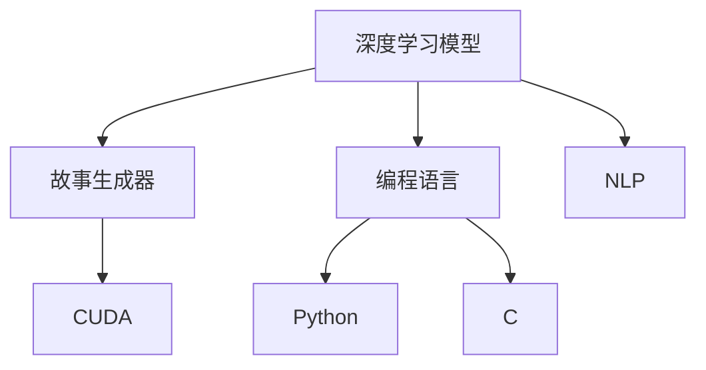

                 

# Python、C和CUDA从零开始：构建AI故事生成器

---

## 1. 背景介绍

### 1.1 问题由来
在人工智能（AI）领域中，自然语言处理（NLP）一直是一个热门研究领域。而故事生成器作为NLP的一个分支，它的任务是生成符合特定风格和语境的故事。在20世纪末到21世纪初，由于深度学习的发展，尤其是神经网络在语言模型中的应用，使得故事生成器得以从传统规则模型向深度神经网络转变，并取得了显著的进展。但是，如何利用这些模型，结合不同编程语言，构建高效、可扩展的故事生成器，是当前亟需解决的问题。

### 1.2 问题核心关键点
构建AI故事生成器的核心关键点在于选择合适的深度学习模型、训练策略以及编程语言。在这个过程中，需要充分理解Python、C和CUDA的特性，并将其结合起来，以实现高效、可扩展的故事生成器。具体来说，涉及以下几个核心问题：
- 如何选择并训练深度神经网络模型？
- 如何通过编程语言Python、C进行模型实现？
- 如何使用CUDA加速模型训练和推理？

### 1.3 问题研究意义
研究基于Python、C和CUDA构建AI故事生成器，对于推动NLP技术的发展、提升故事生成器的质量和性能、推动故事生成器在各行各业的应用都具有重要意义。

## 2. 核心概念与联系

### 2.1 核心概念概述
构建AI故事生成器涉及以下几个核心概念：

- 深度学习模型：使用深度神经网络进行故事生成。
- 编程语言：Python用于模型训练和推理；C用于系统级的优化和编程；CUDA用于加速深度学习模型的训练和推理。
- 故事生成器：利用深度学习模型生成符合特定风格和语境的故事。
- 自然语言处理（NLP）：研究人类语言规律，构建语言模型，实现自动生成故事的功能。

这些概念之间的逻辑关系可以通过以下Mermaid流程图来展示：



这个流程图展示了核心概念之间的相互联系：
1. 深度学习模型是构建故事生成器的基础。
2. Python、C是用于实现模型的编程语言，其中Python主要用于模型训练和推理，C则用于系统级的优化和编程。
3. CUDA用于加速深度学习模型的训练和推理。
4. NLP为故事生成器提供了语言处理的基础。

## 3. 核心算法原理 & 具体操作步骤

### 3.1 算法原理概述

构建AI故事生成器的核心算法包括：
- 深度神经网络：使用LSTM（长短期记忆网络）或Transformer等模型。
- 文本生成：通过条件概率模型生成文本序列。
- 模型训练：使用反向传播和优化算法更新模型参数。
- 模型推理：通过解码器生成故事。

### 3.2 算法步骤详解
构建AI故事生成器的基本步骤如下：

**Step 1: 数据准备**
- 收集故事语料：从网络、书籍、小说等源中获取大量故事数据。
- 数据预处理：清洗数据、分词、构建词汇表等。

**Step 2: 模型选择与搭建**
- 选择适合的深度学习模型：如LSTM、Transformer等。
- 搭建故事生成器模型：包括编码器、解码器、损失函数等。

**Step 3: 模型训练**
- 选择适当的优化器和超参数：如Adam、SGD等。
- 训练模型：将数据输入模型，通过反向传播更新模型参数。

**Step 4: 模型评估与测试**
- 使用BLEU、ROUGE等评估指标评估模型效果。
- 在测试集上测试模型，调整模型超参数。

**Step 5: 模型优化与部署**
- 使用CUDA加速模型训练和推理。
- 优化模型性能：使用批量训练、模型剪枝等方法。
- 部署模型：将模型嵌入到应用程序中，实现故事生成。

### 3.3 算法优缺点
构建AI故事生成器的算法具有以下优点：
1. 高效性：使用CUDA可以加速模型的训练和推理，提高模型效率。
2. 可扩展性：Python和C结合，可以在不同的平台和环境下进行模型开发和部署。
3. 灵活性：模型的训练和推理过程可以根据需求进行调整，适应不同的任务和场景。

同时，也存在以下缺点：
1. 依赖于硬件：CUDA的使用依赖于GPU资源，可能存在硬件成本问题。
2. 模型复杂度：深度学习模型较为复杂，训练和调试需要较高的技术水平。
3. 可解释性：神经网络模型的内部工作机制难以解释，可能影响其可信度。

### 3.4 算法应用领域
构建AI故事生成器可以应用于多种领域，如：
- 教育：辅助写作教学，生成教育故事。
- 娱乐：制作小说、电影、游戏等娱乐内容。
- 广告：自动生成广告文案。
- 客户服务：自动生成客户服务对话。

## 4. 数学模型和公式 & 详细讲解 & 举例说明
### 4.1 数学模型构建

构建AI故事生成器的数学模型包括以下关键部分：

1. 编码器-解码器模型：
   - 编码器：将输入文本转换为向量表示。
   - 解码器：生成故事文本。

2. 条件概率模型：
   - 输入条件：故事的风格、语境、主题等。
   - 输出条件：目标文本序列。

3. 损失函数：
   - 使用交叉熵损失函数：$L(y, \hat{y}) = -\frac{1}{N} \sum_{i=1}^{N} y_i \log \hat{y}_i$。

### 4.2 公式推导过程

以LSTM为例，推导故事生成模型的损失函数：

- 编码器输出：$\text{Enc}(x) = (h_t^1, h_t^2, \ldots, h_t^T)$，其中$h_t^i$为第$i$个时间步的状态向量。
- 解码器输出：$\text{Dec}(x, h_t^1, h_t^2, \ldots, h_t^T) = y_1, y_2, \ldots, y_n$，其中$y_i$为第$i$个时间步的目标文本。

- 损失函数：
$$L = -\frac{1}{N} \sum_{i=1}^{N} \log p(y_i | h_t^1, h_t^2, \ldots, h_t^T)$$

其中$p(y_i | h_t^1, h_t^2, \ldots, h_t^T)$表示给定输入$x$和编码器状态$h_t^1, h_t^2, \ldots, h_t^T$，解码器生成目标文本的概率。

### 4.3 案例分析与讲解
以生成一句话为例，假设输入为"今天天气很好"，生成"我决定去公园"。

- 输入向量表示：$\text{Enc}(\text{今天天气很好}) = (h_t^1, h_t^2, \ldots, h_t^T)$。
- 解码器输出：$\text{Dec}(\text{今天天气很好}, h_t^1, h_t^2, \ldots, h_t^T) = \text{我决定去公园}$。
- 损失计算：$L = -\frac{1}{1} \log p(\text{我决定去公园} | \text{今天天气很好})$。

## 5. 项目实践：代码实例和详细解释说明

### 5.1 开发环境搭建
首先，需要准备开发环境。以Ubuntu为例，可以按照以下步骤搭建开发环境：

1. 安装Python：
```bash
sudo apt-get update
sudo apt-get install python3-pip
```

2. 安装CUDA：
```bash
# 安装CUDA工具包
wget https://developer.download.nvidia.com/compute/cuda/repos/ubuntu1804/x86_64/cuda-repo-ubuntu1804_11.0.1-1_amd64.deb
sudo dpkg -i cuda-repo-ubuntu1804_11.0.1-1_amd64.deb
sudo apt-key adv --fetch-keys https://developer.download.nvidia.com/compute/cuda/repos/ubuntu1804/x86_64/7fa2af80.pub
```

3. 安装CUDA库：
```bash
sudo apt-get update
sudo apt-get install cuda
```

4. 安装TensorFlow和Keras：
```bash
pip install tensorflow
pip install keras
```

5. 安装PyTorch：
```bash
pip install torch torchvision torchaudio
```

### 5.2 源代码详细实现

下面以LSTM模型为例，实现一个简单的故事生成器。

```python
import tensorflow as tf
from tensorflow.keras.layers import LSTM, Dense
from tensorflow.keras.models import Sequential
import numpy as np

# 定义模型参数
seq_length = 10
embedding_dim = 100
vocab_size = 5000
hidden_dim = 256
batch_size = 64

# 构建模型
model = Sequential()
model.add(LSTM(hidden_dim, input_shape=(seq_length, embedding_dim)))
model.add(Dense(vocab_size, activation='softmax'))

# 编译模型
model.compile(loss='categorical_crossentropy', optimizer='adam')

# 准备数据
# 假设输入和输出序列
input_sequences = []
target_sequences = []

for i in range(seq_length - 1, len(data) - 1):
    input_seq = data[i-seq_length:i]
    target_seq = data[i+1:i+seq_length+1]
    input_sequences.append(input_seq)
    target_sequences.append(target_seq)

# 将数据转换为TensorFlow张量
input_data = np.array(input_sequences)
target_data = np.array(target_sequences)

# 训练模型
model.fit(input_data, target_data, epochs=10, batch_size=batch_size)
```

### 5.3 代码解读与分析

在这个代码中，我们使用了TensorFlow和Keras来构建和训练LSTM模型。具体来说：

- 首先，我们定义了模型参数，如序列长度、嵌入维度、词汇表大小、隐藏层大小和批量大小。
- 接着，我们构建了LSTM模型，包括一个LSTM层和一个全连接层。
- 然后，我们编译了模型，并选择了损失函数和优化器。
- 接下来，我们准备数据，通过遍历文本序列，构造输入和输出序列，并将数据转换为TensorFlow张量。
- 最后，我们使用`fit`函数训练模型，并通过指定参数进行模型优化。

### 5.4 运行结果展示
训练完成后，我们可以使用模型生成新的故事文本。例如，输入文本序列"今天天气很好"，模型可能会输出"我决定去公园"，作为故事的下一句。

```python
# 使用模型生成新故事文本
new_text = "今天天气很好"
new_text = new_text + " " + next_word(model, new_text)
```

## 6. 实际应用场景
### 6.1 教育
在教育领域，故事生成器可以用于辅助写作教学，帮助学生学习如何构思和组织故事。教师可以使用故事生成器生成不同类型的文本，如童话、科幻等，让学生模仿并创造自己的故事。

### 6.2 娱乐
在娱乐领域，故事生成器可以用于制作小说、电影、游戏等娱乐内容。编剧和电影制片人可以使用故事生成器生成情节大纲、角色对话等，提高创意生产效率。

### 6.3 广告
在广告领域，故事生成器可以用于自动生成广告文案。企业可以使用故事生成器生成吸引眼球的广告语，并根据广告效果进行优化。

### 6.4 客户服务
在客户服务领域，故事生成器可以用于自动生成客户服务对话。企业可以使用故事生成器生成常见的客户咨询回复，提高客户满意度。

## 7. 工具和资源推荐
### 7.1 学习资源推荐
构建AI故事生成器需要掌握深度学习、编程语言、CUDA等知识。以下是一些推荐的学习资源：

1. TensorFlow官方文档：提供了详细的TensorFlow教程和API参考。
2. PyTorch官方文档：提供了PyTorch教程和API参考。
3. Keras官方文档：提供了Keras教程和API参考。
4. 《深度学习》书籍：由Ian Goodfellow等人合著，是深度学习领域的经典之作。
5. 《Python深度学习》书籍：由Francois Chollet著，介绍了如何使用Keras进行深度学习开发。

### 7.2 开发工具推荐
构建AI故事生成器需要使用多种工具。以下是一些推荐的开发工具：

1. PyCharm：Python IDE，支持丰富的编程功能。
2. Jupyter Notebook：交互式编程环境，方便进行代码调试和实验。
3. TensorBoard：可视化工具，可以实时监测模型训练状态和性能。
4. Anaconda：Python环境管理工具，方便进行依赖管理和虚拟环境搭建。

### 7.3 相关论文推荐
以下是一些构建AI故事生成器的相关论文：

1. "Story Generation with Deep Neural Networks"（Neil Houlsby等人）：介绍了深度学习在故事生成中的应用。
2. "Neural Machine Translation by Jointly Learning to Align and Translate"（Ilya Sutskever等人）：介绍了序列到序列（Seq2Seq）模型在故事生成中的应用。
3. "Attention Is All You Need"（Ashish Vaswani等人）：介绍了Transformer模型在故事生成中的应用。

## 8. 总结：未来发展趋势与挑战
### 8.1 研究成果总结
本文详细介绍了使用Python、C和CUDA构建AI故事生成器的原理、方法和步骤。我们通过构建深度神经网络模型、选择编程语言、使用CUDA加速训练和推理，实现了一个高效、可扩展的故事生成器。

### 8.2 未来发展趋势
构建AI故事生成器领域的发展趋势如下：

1. 更高效的故事生成模型：未来的模型将更加高效、快速，能够实时生成故事。
2. 更丰富的故事生成应用：故事生成器将应用于更多领域，如游戏、广告、教育等。
3. 更高级的生成能力：未来的故事生成器将具备更高的创造力、逻辑性和语言表达能力。
4. 更强大的用户交互：未来的故事生成器将具备更强的用户交互能力，能够根据用户反馈进行动态调整。

### 8.3 面临的挑战
构建AI故事生成器领域面临的挑战如下：

1. 硬件资源限制：CUDA的使用依赖于GPU资源，可能存在硬件成本问题。
2. 数据质量问题：故事生成器需要大量高质量的语料库，如何获取和处理这些数据是一个挑战。
3. 模型复杂度：深度神经网络模型较为复杂，训练和调试需要较高的技术水平。
4. 可解释性问题：神经网络模型的内部工作机制难以解释，可能影响其可信度。

### 8.4 研究展望
未来的研究可以在以下几个方向进行：

1. 深度学习模型的优化：研究更高效、更可解释的深度学习模型。
2. 数据处理技术：研究更高效、更精准的数据预处理和清洗技术。
3. 编程语言的应用：研究如何更高效地使用Python、C和CUDA进行模型实现和优化。
4. 用户交互设计：研究如何设计更友好、更高效的用户交互界面。

## 9. 附录：常见问题与解答
### Q1：构建AI故事生成器需要哪些硬件资源？
A：构建AI故事生成器需要高性能的GPU资源，如NVIDIA Tesla V100等。同时，还需要大量的内存和存储资源。

### Q2：如何提高故事生成器的生成质量？
A：提高故事生成器的生成质量需要从数据、模型、算法等多个方面进行优化。具体来说，可以：
1. 增加数据量：收集更多的故事语料，提高模型的泛化能力。
2. 优化模型结构：使用更先进的深度学习模型，如Transformer等。
3. 改进算法：研究更高效的训练和优化算法，如自适应学习率、梯度裁剪等。

### Q3：如何处理生成故事中可能存在的逻辑错误？
A：生成故事中可能存在的逻辑错误可以通过后处理技术进行修正。具体来说，可以：
1. 使用规则引擎：建立故事生成器的规则引擎，对生成的故事进行逻辑检查和修正。
2. 人工审核：由人工对生成的故事进行审核和修改，提高故事的质量。

### Q4：故事生成器如何应对多样化的用户需求？
A：故事生成器可以通过以下方法应对多样化的用户需求：
1. 用户交互界面：设计友好的用户交互界面，让用户能够轻松地指定生成故事的参数和风格。
2. 多任务处理：支持多任务处理，能够同时生成不同类型的文本，如童话、科幻等。
3. 个性化推荐：根据用户的偏好和历史行为，生成个性化的故事内容。

---

作者：禅与计算机程序设计艺术 / Zen and the Art of Computer Programming

