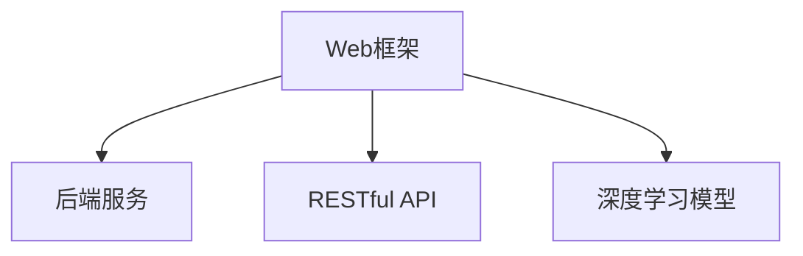
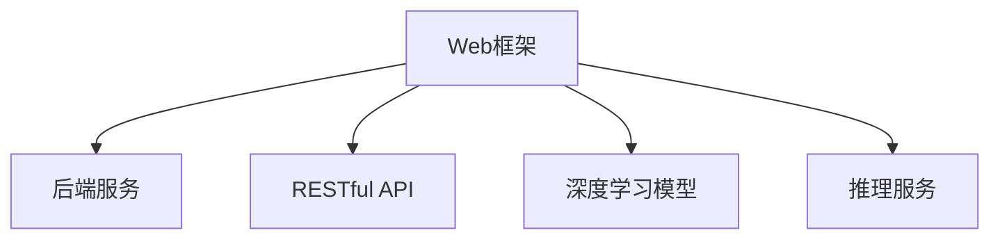

                 

# Python机器学习实战：搭建自己的机器学习Web服务

> 关键词：
- Python机器学习
- Web服务
- 模型部署
- Flask框架
- TensorFlow
- 深度学习模型
- 推理服务
- RESTful API

## 1. 背景介绍

### 1.1 问题由来

在数据科学和机器学习领域，构建和部署一个能够提供实时预测的Web服务，已经成为普遍需求。无论是在线广告推荐、金融风险评估，还是智能医疗诊断，Web服务都可以在用户需求产生时提供即时响应，提升用户体验，加速决策过程。

同时，构建Web服务也是数据科学家将研究结果转化为可操作工具的重要途径。与传统的桌面应用或脚本不同，Web服务可以实现跨平台、跨设备的访问，支持多人协作，便于规模化部署和维护。

在过去，部署Web服务通常需要一定的运维经验和技术栈，如服务端脚本语言、数据库管理系统等。然而，随着Python和Flask等Web框架的流行，构建Web服务变得越来越简便，使得普通数据科学家也能轻松实现。

### 1.2 问题核心关键点

为了帮助读者快速掌握搭建机器学习Web服务的流程，本节将介绍几个核心概念，并构建一个简单的Web服务框架。

- Web框架：如Flask、Django等，用于简化Web服务的开发过程。
- 后端服务：如SQLite、MySQL、MongoDB等，用于存储和管理Web服务所需的数据。
- RESTful API：用于在客户端和服务器之间传递数据和状态信息，符合Web服务标准架构。
- 深度学习模型：如TensorFlow、PyTorch等，用于在Web服务中提供预测功能。

这些核心概念通过以下Mermaid流程图来展示：



这个流程图展示了几大核心概念之间的逻辑关系：

1. Web框架是构建Web服务的骨架，简化了开发过程。
2. 后端服务用于数据的持久化存储和管理，支持Web服务的运行。
3. RESTful API作为数据传递的媒介，符合Web服务规范。
4. 深度学习模型是Web服务的主要功能模块，提供预测和推理服务。

这些概念共同构成了搭建机器学习Web服务的基本架构，使得数据科学家可以聚焦于模型开发和算法实现，无需过多关注运维细节。

## 2. 核心概念与联系

### 2.1 核心概念概述

为更好地理解搭建机器学习Web服务的过程，本节将介绍几个密切相关的核心概念：

- Web框架：用于创建Web应用程序的软件框架，简化开发过程，提供路由、模板、数据库管理等功能。
- 后端服务：负责数据的存储、管理、检索等任务，支撑Web服务的长期稳定运行。
- RESTful API：遵循REST原则的API设计，支持跨平台、跨协议的Web服务通信。
- 深度学习模型：基于神经网络的机器学习模型，用于处理复杂的数据挖掘和预测任务。
- 推理服务：Web服务中模型的部署形式，提供实时推理功能。

这些概念之间的逻辑关系可以通过以下Mermaid流程图来展示：



这个流程图展示了大语言模型微调的关键概念及其之间的关系：

1. Web框架是构建Web服务的骨架，简化了开发过程。
2. 后端服务用于数据的存储、管理、检索等任务，支撑Web服务的长期稳定运行。
3. RESTful API作为数据传递的媒介，符合Web服务规范。
4. 深度学习模型是Web服务的主要功能模块，提供预测和推理服务。
5. 推理服务是Web服务中模型的部署形式，提供实时推理功能。

这些概念共同构成了搭建机器学习Web服务的基础架构，使得数据科学家可以聚焦于模型开发和算法实现，无需过多关注运维细节。

## 3. 核心算法原理 & 具体操作步骤
### 3.1 算法原理概述

搭建机器学习Web服务的核心算法原理，是基于Web框架、后端服务、RESTful API和深度学习模型的一体化集成。其核心思想是：

1. 通过Web框架搭建Web服务，简化开发过程。
2. 使用后端服务管理数据，保证数据的持久化、可用性和安全性。
3. 采用RESTful API规范，提供数据传递的规范接口。
4. 部署深度学习模型，提供实时推理和预测功能。

这种一体化的架构设计，使得数据科学家可以在短时间内实现一个功能完备、易于维护的机器学习Web服务。

### 3.2 算法步骤详解

以下是一个简单的Web服务搭建流程：

1. 选择Web框架和后端服务：根据项目需求，选择合适的Web框架（如Flask、Django等）和后端服务（如SQLite、MySQL、MongoDB等）。
2. 设计API接口：根据Web服务需求，设计RESTful API接口，包括数据获取、参数传递、结果返回等。
3. 实现数据模型：使用Python实现数据模型，处理数据获取、存储和检索等任务。
4. 加载深度学习模型：使用TensorFlow、PyTorch等深度学习框架加载训练好的模型，提供实时推理功能。
5. 部署Web服务：使用Flask等Web框架搭建Web服务，整合API接口和深度学习模型。

### 3.3 算法优缺点

搭建机器学习Web服务的方法具有以下优点：

1. 简化开发过程：使用Web框架简化开发流程，减少开发时间和人力成本。
2. 提升可维护性：模块化设计使得各组件可以独立维护，便于长期运维。
3. 提高可扩展性：可根据需求灵活添加API接口和功能模块，满足不同业务场景。
4. 支持实时推理：通过部署深度学习模型，实现实时预测和推理，提高业务决策效率。

同时，该方法也存在以下局限性：

1. 依赖数据存储：Web服务需要可靠的后端服务支持，一旦后端服务故障，Web服务可能不可用。
2. 受限于API设计：API设计不合理可能导致服务性能瓶颈，影响用户体验。
3. 模型部署复杂：深度学习模型部署复杂，需要考虑资源配置和推理效率问题。
4. 安全问题：Web服务可能面临网络攻击和数据泄露风险，需加强安全防护。

尽管存在这些局限性，但就目前而言，搭建机器学习Web服务仍然是一种高效便捷的方式，广泛应用于数据分析、预测和决策等领域。

### 3.4 算法应用领域

搭建机器学习Web服务的应用领域广泛，涵盖金融、医疗、零售、制造等多个行业。以下是几个典型的应用场景：

- 金融风险评估：利用深度学习模型，对用户信用、交易行为等数据进行实时评估，预测信用风险和欺诈行为。
- 智能推荐系统：使用协同过滤、深度学习等算法，根据用户行为和历史数据，推荐个性化的产品和服务。
- 智能客服系统：通过NLP技术，构建智能客服机器人，自动回答用户问题，提升服务效率和质量。
- 医疗诊断辅助：使用深度学习模型，对医学影像、病历数据进行分析和预测，辅助医生诊断。
- 智能交通管理：通过传感器数据和深度学习模型，实时分析交通流量和状况，优化交通管理策略。

以上应用场景展示了搭建机器学习Web服务的广泛潜力，通过数据科学家的不断创新和实践，该技术将在更多领域发挥作用，推动社会进步。

## 4. 数学模型和公式 & 详细讲解 & 举例说明（备注：数学公式请使用latex格式，latex嵌入文中独立段落使用 $$，段落内使用 $)
### 4.1 数学模型构建

在本节中，我们将介绍搭建机器学习Web服务的基本数学模型和公式。

假设有n个样本，每个样本包含m个特征，记为 $(x_1, x_2, ..., x_m)$，对应的标签为 $y$。我们的目标是通过学习模型 $f(x)$，使得 $f(x)$ 能够预测 $y$，即：

$$
f(x) = \hat{y}
$$

常见的机器学习模型包括线性回归、逻辑回归、决策树、随机森林、神经网络等。这里以神经网络为例，其基本结构如图1所示：


图1 神经网络结构图

### 4.2 公式推导过程

神经网络模型的推导过程主要基于梯度下降算法，其基本公式为：

$$
\min_{w} \sum_{i=1}^{n} L(f(x_i), y_i)
$$

其中 $L$ 为损失函数，$w$ 为模型参数。

以线性回归为例，损失函数通常采用均方误差（MSE）：

$$
L(f(x_i), y_i) = \frac{1}{2} (f(x_i) - y_i)^2
$$

使用梯度下降算法更新模型参数 $w$：

$$
w \leftarrow w - \eta \nabla_{w} L(f(x), y)
$$

其中 $\eta$ 为学习率，$\nabla_{w} L(f(x), y)$ 为损失函数对模型参数的梯度，可通过反向传播算法高效计算。

在深度学习模型中，反向传播算法用于计算梯度，其公式为：

$$
\frac{\partial L(f(x), y)}{\partial w} = \frac{\partial L(f(x), y)}{\partial z_1} \cdot \frac{\partial z_1}{\partial w_1} + \frac{\partial L(f(x), y)}{\partial z_2} \cdot \frac{\partial z_2}{\partial w_2} + ... + \frac{\partial L(f(x), y)}{\partial z_n} \cdot \frac{\partial z_n}{\partial w_n}
$$

其中 $z_i$ 为隐藏层的输出，$w_i$ 为连接层的权重。

### 4.3 案例分析与讲解

以一个简单的线性回归为例，假设训练集为：

$$
(x_1, y_1), (x_2, y_2), ..., (x_n, y_n)
$$

其中 $x_i = [x_{i1}, x_{i2}, ..., x_{im}]$，$y_i$ 为标签。我们使用梯度下降算法更新模型参数 $w$，令 $w = [w_1, w_2, ..., w_m]$，$b$ 为偏置项。

根据均方误差损失函数，梯度计算公式为：

$$
\frac{\partial L}{\partial w} = \frac{\partial}{\partial w} \sum_{i=1}^{n} (y_i - f(x_i))^2 = 2\sum_{i=1}^{n} (y_i - f(x_i))(x_i)
$$

代入 $f(x) = wx + b$，得到：

$$
\frac{\partial L}{\partial w} = 2\sum_{i=1}^{n} (y_i - wx_i - b)x_i
$$

计算梯度并更新模型参数：

$$
w \leftarrow w - \eta \frac{1}{n} \sum_{i=1}^{n} (y_i - wx_i - b)x_i
$$

通过上述公式，我们可以使用Python代码实现深度学习模型的训练和推理。

## 5. 项目实践：代码实例和详细解释说明
### 5.1 开发环境搭建

在进行项目实践前，我们需要准备好开发环境。以下是使用Python进行Flask框架开发的环境配置流程：

1. 安装Anaconda：从官网下载并安装Anaconda，用于创建独立的Python环境。

2. 创建并激活虚拟环境：
```bash
conda create -n flask-env python=3.8 
conda activate flask-env
```

3. 安装Flask：
```bash
pip install flask
```

4. 安装TensorFlow：根据CUDA版本，从官网获取对应的安装命令。例如：
```bash
pip install tensorflow
```

5. 安装Flask-Batch-SGD：用于集成Flask和SGD优化器，方便模型训练。
```bash
pip install flask-batch-sgd
```

6. 安装Flask-SQLAlchemy：用于与SQLite数据库的集成。
```bash
pip install flask-sqlalchemy
```

完成上述步骤后，即可在`flask-env`环境中开始项目实践。

### 5.2 源代码详细实现

下面是一个简单的机器学习Web服务实现示例，用于预测房价：

```python
from flask import Flask, request, jsonify
from flask_sqlalchemy import SQLAlchemy
from sklearn.linear_model import LinearRegression
import numpy as np

app = Flask(__name__)
app.config['SQLALCHEMY_DATABASE_URI'] = 'sqlite:////tmp/test.db'

db = SQLAlchemy(app)

class Data(db.Model):
    id = db.Column(db.Integer, primary_key=True)
    feature1 = db.Column(db.Float)
    feature2 = db.Column(db.Float)
    label = db.Column(db.Float)

model = LinearRegression()

@app.route('/predict', methods=['POST'])
def predict():
    data = request.get_json()
    feature1 = data['feature1']
    feature2 = data['feature2']
    prediction = model.predict([[feature1, feature2]])
    return jsonify({'prediction': prediction[0]})

@app.route('/train', methods=['POST'])
def train():
    data = request.get_json()
    features = np.array([data['feature1'], data['feature2']])
    label = data['label']
    model.partial_fit(features, [label], classes=[-1, 1])
    return jsonify({'message': 'Training data received'})

if __name__ == '__main__':
    db.create_all()
    app.run(debug=True)
```

在上述代码中，我们使用了Flask框架搭建了一个简单的Web服务，包括两个接口：

1. `/predict`：用于预测房价，接收特征输入，返回预测结果。
2. `/train`：用于训练模型，接收训练数据，更新模型参数。

### 5.3 代码解读与分析

让我们再详细解读一下关键代码的实现细节：

**Flask框架**：
- 通过`Flask(__name__)`创建Flask应用实例。
- 通过`app.config['SQLALCHEMY_DATABASE_URI']`配置SQLite数据库连接。
- 通过`SQLAlchemy(app)`创建数据库实例。

**Data类**：
- 定义了SQLite数据库中的数据结构，包含特征和标签。

**模型训练**：
- 使用`LinearRegression`作为模型，在`/train`接口中通过`model.partial_fit()`进行部分拟合，更新模型参数。

**API接口**：
- 在`/predict`接口中，接收请求参数，进行特征预测，返回结果。

**运行方式**：
- 使用`app.run(debug=True)`启动Flask应用，支持调试模式。

可以看出，使用Flask框架搭建Web服务非常简单，可以很快实现数据模型和推理服务的一体化集成。

## 6. 实际应用场景
### 6.1 智能推荐系统

基于机器学习Web服务的智能推荐系统，已经广泛应用于电商、媒体、社交网络等平台。传统的推荐系统依赖于人工标注的用户评分数据，难以覆盖长尾商品和用户，推荐效果有限。而使用机器学习Web服务，可以在短时间内搭建推荐引擎，通过用户行为数据和商品特征数据，实现个性化推荐，提升用户体验和销售转化率。

例如，在电商平台中，可以通过分析用户的浏览、点击、购买等行为数据，使用协同过滤、内容推荐等算法，推荐用户可能感兴趣的商品。在推荐过程中，可以使用机器学习Web服务，将用户行为数据和商品特征数据输入模型，实时生成推荐结果，满足用户即时需求。

### 6.2 金融风险评估

金融行业需要快速评估贷款申请、信用卡申请等风险，传统方式依赖人工审核，效率低、成本高。而使用机器学习Web服务，可以快速搭建风险评估模型，对用户信用、交易行为等数据进行实时分析，预测信用风险和欺诈行为，提高审批效率和准确性。

在实际应用中，可以通过收集用户的个人信息、交易记录、社交数据等，使用深度学习模型进行特征提取和分类，实时评估贷款申请或信用卡申请的风险水平，帮助金融机构决策。

### 6.3 智能客服系统

智能客服系统是企业提高客户满意度的重要工具，传统的客服系统依赖人工客服，成本高、响应慢。而使用机器学习Web服务，可以搭建智能客服机器人，自动回答用户问题，提升服务效率和质量。

在实际应用中，可以通过收集用户的历史聊天记录、问题类型、语料库等，使用自然语言处理技术，训练NLP模型，生成智能客服机器人。机器人可以实时接收用户输入，使用预训练语言模型进行问题匹配和答案生成，提供高效的服务支持。

### 6.4 未来应用展望

随着机器学习Web服务的不断演进，其在更多领域的应用前景更加广阔：

- 医疗诊断辅助：使用深度学习模型，对医学影像、病历数据进行分析和预测，辅助医生诊断。
- 智能交通管理：通过传感器数据和深度学习模型，实时分析交通流量和状况，优化交通管理策略。
- 工业生产优化：使用机器学习模型，对生产数据进行分析和预测，优化生产流程和资源配置。
- 农业生产监控：通过物联网设备收集的数据，使用机器学习模型，实时监控农业生产情况，提高产量和质量。

未来，随着模型训练的自动化、数据处理的标准化、服务部署的灵活化，机器学习Web服务将在更多领域发挥作用，推动社会进步。

## 7. 工具和资源推荐
### 7.1 学习资源推荐

为了帮助开发者系统掌握机器学习Web服务的开发流程，这里推荐一些优质的学习资源：

1. Flask官方文档：提供了完整的Flask框架文档，详细介绍了Flask的使用方法和最佳实践。
2. TensorFlow官方文档：提供了TensorFlow深度学习框架的文档，详细介绍了模型训练、推理等各个环节。
3. Flask-Batch-SGD文档：提供了Flask-Batch-SGD的文档，介绍了模型训练的接口和使用方法。
4. Flask-SQLAlchemy文档：提供了Flask-SQLAlchemy的文档，介绍了与SQLite数据库的集成方法。
5. Kaggle竞赛平台：提供了大量的数据集和机器学习竞赛，可以实战练习机器学习Web服务的应用。

通过对这些资源的学习实践，相信你一定能够快速掌握机器学习Web服务的开发流程，并用于解决实际的机器学习问题。

### 7.2 开发工具推荐

高效的开发离不开优秀的工具支持。以下是几款用于机器学习Web服务开发的常用工具：

1. Flask框架：简单易用的Python Web框架，提供了路由、模板、数据库管理等功能。
2. TensorFlow：强大的深度学习框架，支持模型的训练、推理和部署。
3. SQLAlchemy：Python ORM框架，用于与SQLite数据库的集成。
4. Flask-Batch-SGD：集成了SGD优化器，支持模型的在线训练。
5. Flask-SQLAlchemy：用于与SQLite数据库的集成，支持数据的持久化存储和管理。

合理利用这些工具，可以显著提升机器学习Web服务的开发效率，加快创新迭代的步伐。

### 7.3 相关论文推荐

机器学习Web服务的发展源于学界的持续研究。以下是几篇奠基性的相关论文，推荐阅读：

1. Web service-based machine learning systems：介绍基于Web服务的机器学习系统的设计方法。
2. Machine learning in the cloud：探讨云计算环境下的机器学习服务。
3. Machine learning-based recommendation systems：介绍基于机器学习的推荐系统。
4. Deep learning for healthcare：探讨深度学习在医疗领域的应用。
5. Web service for real-time data analysis：介绍Web服务在实时数据分析中的应用。

这些论文代表了大语言模型微调技术的发展脉络。通过学习这些前沿成果，可以帮助研究者把握学科前进方向，激发更多的创新灵感。

## 8. 总结：未来发展趋势与挑战
### 8.1 总结

本文对搭建机器学习Web服务的方法进行了全面系统的介绍。首先阐述了搭建机器学习Web服务的背景和意义，明确了其简化开发过程、提升可维护性、提高可扩展性等优势。其次，从原理到实践，详细讲解了Web框架、后端服务、RESTful API和深度学习模型的集成方法，给出了机器学习Web服务的完整代码实例。同时，本文还广泛探讨了机器学习Web服务在智能推荐、金融风险评估、智能客服等多个领域的应用前景，展示了其广阔的发展潜力。

通过本文的系统梳理，可以看到，搭建机器学习Web服务已经成为一种高效便捷的方式，广泛应用于数据分析、预测和决策等领域。未来，伴随模型的不断优化和服务的持续迭代，机器学习Web服务必将在更多领域大放异彩，推动社会进步。

### 8.2 未来发展趋势

展望未来，机器学习Web服务将呈现以下几个发展趋势：

1. 自动化部署：越来越多的开发工具支持模型部署和运维自动化，进一步简化开发者工作。
2. 云服务普及：云计算平台提供了强大的计算和存储资源，可以支持大规模机器学习Web服务的部署和运行。
3. 实时推理优化：随着硬件设备的进步，深度学习模型的推理速度将不断提升，实时推理服务将更加普及。
4. 多模态融合：将文本、图像、语音等多模态数据进行融合，提升机器学习Web服务的应用范围和效果。
5. 安全性增强：加强对Web服务的安全防护，防止数据泄露和网络攻击。
6. 可靠性保证：提升Web服务的稳定性和可用性，确保业务连续性和用户体验。

以上趋势凸显了机器学习Web服务的发展前景。这些方向的探索发展，必将进一步提升Web服务的性能和应用范围，为更多领域提供数据驱动的解决方案。

### 8.3 面临的挑战

尽管机器学习Web服务已经取得了瞩目成就，但在迈向更加智能化、普适化应用的过程中，它仍面临着诸多挑战：

1. 数据隐私和安全：Web服务涉及用户数据的收集和存储，如何保障数据隐私和安全，避免数据泄露，是重要的研究课题。
2. 系统负载平衡：Web服务需要支持高并发访问，如何设计合理的数据库连接池和负载均衡策略，确保服务稳定性。
3. 实时数据处理：Web服务需要实时处理大量数据，如何优化数据处理和模型推理，提升服务响应速度。
4. 模型实时更新：模型需要不断更新，如何设计高效的数据同步和模型更新机制，保证服务精度和效率。
5. 跨平台兼容性：Web服务需要支持多平台、多设备访问，如何设计跨平台兼容的接口和协议，确保服务一致性。

这些挑战需要开发者在设计和使用机器学习Web服务时，综合考虑各个环节，不断优化和改进，才能确保服务稳定可靠，满足用户需求。

### 8.4 研究展望

面对机器学习Web服务所面临的挑战，未来的研究需要在以下几个方面寻求新的突破：

1. 数据隐私保护：设计更加安全的数据传输和存储机制，保护用户隐私和数据安全。
2. 实时数据处理优化：使用流式计算和大数据技术，提升数据处理和模型推理的效率。
3. 跨平台兼容设计：设计跨平台兼容的接口和协议，确保服务一致性和稳定性。
4. 模型在线优化：开发更加高效的模型在线更新机制，提升服务精度和效率。
5. 多模态数据融合：探索将文本、图像、语音等多模态数据进行融合，提升服务的综合能力。

这些研究方向的探索，必将引领机器学习Web服务技术迈向更高的台阶，为社会带来更多价值。面向未来，机器学习Web服务需要与其他人工智能技术进行更深入的融合，如知识表示、因果推理、强化学习等，多路径协同发力，共同推动人工智能技术的发展。

