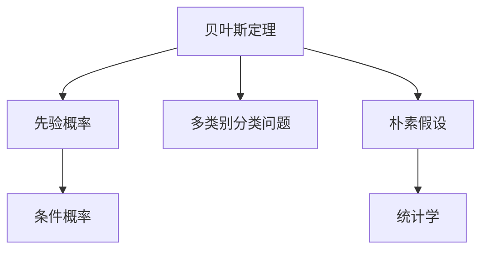

                 

# Python机器学习实战：朴素贝叶斯分类器的原理与实践

> 关键词：朴素贝叶斯分类器,机器学习,Python编程,分类算法,概率模型,统计学,文本分类

## 1. 背景介绍

### 1.1 问题由来

在机器学习领域，分类问题是其中一个重要的研究方向。分类算法可以用于识别图像、文本、音频等多种数据类型的标签。其中，朴素贝叶斯分类器（Naive Bayes Classifier）是一种基于概率统计的简单但有效的分类方法，广泛应用于文本分类、垃圾邮件过滤、情感分析等场景中。

近年来，随着Python编程语言的普及和科学计算库的不断发展，利用Python实现机器学习算法变得更为便捷和高效。因此，在本文中，我们将重点介绍如何使用Python实现朴素贝叶斯分类器，并详细讨论其原理与实践。

### 1.2 问题核心关键点

朴素贝叶斯分类器的核心思想是利用贝叶斯定理，通过先验概率和条件概率来计算后验概率，从而对样本进行分类。具体来说，其核心关键点包括：

- 贝叶斯定理
- 先验概率和条件概率
- 多类别分类问题
- 朴素假设
- Python实现

## 2. 核心概念与联系

### 2.1 核心概念概述

为更好地理解朴素贝叶斯分类器的原理与实践，本节将介绍几个密切相关的核心概念：

- 贝叶斯定理：贝叶斯定理是一种基于条件概率和先验概率的推断方法，常用于计算后验概率。
- 先验概率：在没有任何样本信息的情况下，根据经验得到的某个类别的概率。
- 条件概率：已知某个样本属于某个类别的前提下，某个特征出现的概率。
- 多类别分类问题：需要判断一个样本属于多个类别中的一个的问题。
- 朴素假设：假设样本的各个特征之间是相互独立的。
- 统计学：朴素贝叶斯分类器基于概率统计理论，通过对样本数据的统计分析进行分类。

这些概念之间的逻辑关系可以通过以下Mermaid流程图来展示：



这个流程图展示了一系列相关概念之间的逻辑关系，帮助我们更好地理解朴素贝叶斯分类器的原理。

## 3. 核心算法原理 & 具体操作步骤
### 3.1 算法原理概述

朴素贝叶斯分类器是一种基于概率统计的分类算法，利用贝叶斯定理和朴素假设，通过先验概率和条件概率来计算后验概率，从而对样本进行分类。其基本原理如下：

设有一个样本集 $D$，其中包含 $n$ 个样本，每个样本有 $m$ 个特征 $x_1, x_2, ..., x_m$，分别属于 $k$ 个类别 $c_1, c_2, ..., c_k$。对于一个新的未知样本 $x_{new}$，朴素贝叶斯分类器的目标是最小化其后验概率，从而将其分类到某个类别。

具体来说，对于一个样本 $x$ 属于类别 $c_i$ 的后验概率 $P(c_i|x)$ 可以通过贝叶斯定理计算如下：

$$
P(c_i|x) = \frac{P(c_i) \cdot P(x|c_i)}{P(x)}
$$

其中，$P(c_i)$ 是类别 $c_i$ 的先验概率，$P(x|c_i)$ 是样本 $x$ 在类别 $c_i$ 下条件概率的乘积，$P(x)$ 是样本 $x$ 的先验概率。由于在实际应用中，通常无法直接计算 $P(x)$，因此通常采用最大后验概率（MAP）准则来计算：

$$
\hat{c} = \arg\max_c P(c) \prod_{j=1}^m P(x_j|c)
$$

其中，$\hat{c}$ 是样本 $x$ 分类的结果，$P(c)$ 是类别 $c$ 的先验概率，$P(x_j|c)$ 是样本 $x$ 在类别 $c$ 下特征 $x_j$ 的条件概率。

### 3.2 算法步骤详解

基于朴素贝叶斯分类器的算法步骤通常包括以下几个关键步骤：

**Step 1: 准备数据集**
- 收集并准备分类任务的数据集，包含训练集和测试集。训练集用于模型训练，测试集用于模型评估。
- 将数据集划分为特征集和标签集。特征集包含样本的各个特征，标签集包含样本的分类结果。

**Step 2: 训练模型**
- 使用训练集数据，计算先验概率和条件概率。
- 对于每个类别 $c_i$，计算其先验概率 $P(c_i)$。
- 对于每个类别 $c_i$ 和每个特征 $x_j$，计算其条件概率 $P(x_j|c_i)$。

**Step 3: 模型评估**
- 使用测试集数据，对模型进行评估。
- 对于每个样本 $x_{new}$，计算其各个类别的后验概率 $P(c_i|x_{new})$。
- 选择后验概率最大的类别作为样本的分类结果。

**Step 4: 模型优化**
- 对模型进行优化，提高分类准确率。
- 可以使用交叉验证等技术，优化模型的超参数。
- 可以使用集成学习等技术，提高模型的泛化能力。

### 3.3 算法优缺点

朴素贝叶斯分类器具有以下优点：

- 算法简单，易于实现。
- 对于高维特征集，算法性能表现稳定。
- 对于小样本数据，算法表现优异。
- 算法计算复杂度低，适合大规模数据集。

然而，朴素贝叶斯分类器也存在以下缺点：

- 假设样本的各个特征之间是相互独立的，这在实际中往往不成立。
- 对于噪声较大的数据集，算法表现可能不佳。
- 算法对输入数据的概率分布依赖性较强，分布变化可能导致算法性能下降。

### 3.4 算法应用领域

朴素贝叶斯分类器在多个领域中得到了广泛的应用，例如：

- 文本分类：朴素贝叶斯分类器常用于文本分类任务，如情感分析、主题分类等。
- 垃圾邮件过滤：通过训练朴素贝叶斯分类器，可以自动判断邮件是否为垃圾邮件。
- 情感分析：朴素贝叶斯分类器可以用于情感分析任务，判断文本的情感倾向。
- 推荐系统：朴素贝叶斯分类器可以用于用户行为分析，推荐符合用户兴趣的产品。

除了上述这些经典应用外，朴素贝叶斯分类器还被创新性地应用到更多场景中，如风险评估、图像分类、音频分类等，为各个领域带来了新的突破。

## 4. 数学模型和公式 & 详细讲解 & 举例说明

### 4.1 数学模型构建

朴素贝叶斯分类器的数学模型构建基于贝叶斯定理和多类别分类问题的定义。假设数据集 $D$ 包含 $n$ 个样本，每个样本有 $m$ 个特征 $x_1, x_2, ..., x_m$，分别属于 $k$ 个类别 $c_1, c_2, ..., c_k$。朴素贝叶斯分类器的数学模型可以表示为：

$$
P(c_i|x) = \frac{P(c_i) \cdot P(x_1|c_i) \cdot P(x_2|c_i) \cdot ... \cdot P(x_m|c_i)}{P(x)}
$$

其中，$P(c_i)$ 是类别 $c_i$ 的先验概率，$P(x_j|c_i)$ 是样本 $x$ 在类别 $c_i$ 下特征 $x_j$ 的条件概率。

### 4.2 公式推导过程

朴素贝叶斯分类器的公式推导过程主要基于贝叶斯定理和多类别分类问题的定义。具体推导如下：

设样本 $x$ 属于类别 $c_i$ 的概率为 $P(c_i|x)$，则根据贝叶斯定理，可以表示为：

$$
P(c_i|x) = \frac{P(c_i) \cdot P(x|c_i)}{P(x)}
$$

其中，$P(c_i)$ 是类别 $c_i$ 的先验概率，$P(x|c_i)$ 是样本 $x$ 在类别 $c_i$ 下条件概率的乘积，$P(x)$ 是样本 $x$ 的先验概率。由于在实际应用中，通常无法直接计算 $P(x)$，因此通常采用最大后验概率（MAP）准则来计算：

$$
\hat{c} = \arg\max_c P(c) \prod_{j=1}^m P(x_j|c)
$$

其中，$\hat{c}$ 是样本 $x$ 分类的结果，$P(c)$ 是类别 $c$ 的先验概率，$P(x_j|c)$ 是样本 $x$ 在类别 $c$ 下特征 $x_j$ 的条件概率。

### 4.3 案例分析与讲解

以文本分类为例，朴素贝叶斯分类器可以用于对文本进行分类。假设我们有一个包含新闻文章的数据集，每个文章有三个特征：标题、摘要和发布时间。我们的任务是将文章分类为三个类别：体育、财经和科技。

假设我们收集到了 $n=1000$ 个样本，每个样本有 $m=3$ 个特征。我们定义先验概率为：

$$
P(c_1) = 0.4, P(c_2) = 0.3, P(c_3) = 0.3
$$

对于每个类别 $c_i$ 和每个特征 $x_j$，我们假设其条件概率为：

$$
P(x_{1,j}|c_1) = 0.5, P(x_{1,j}|c_2) = 0.3, P(x_{1,j}|c_3) = 0.2
$$
$$
P(x_{2,j}|c_1) = 0.4, P(x_{2,j}|c_2) = 0.5, P(x_{2,j}|c_3) = 0.3
$$
$$
P(x_{3,j}|c_1) = 0.6, P(x_{3,j}|c_2) = 0.4, P(x_{3,j}|c_3) = 0.5
$$

现在，对于一个新的未知文章 $x_{new}$，我们可以使用朴素贝叶斯分类器进行分类。假设 $x_{new}$ 的特征为 $x_{1,j} = 0.7, x_{2,j} = 0.5, x_{3,j} = 0.6$，则对于每个类别 $c_i$，其后验概率 $P(c_i|x_{new})$ 可以计算如下：

$$
P(c_1|x_{new}) = \frac{0.4 \cdot 0.5 \cdot 0.4 \cdot 0.6}{0.6} \approx 0.2857
$$
$$
P(c_2|x_{new}) = \frac{0.3 \cdot 0.3 \cdot 0.5 \cdot 0.4}{0.6} \approx 0.1667
$$
$$
P(c_3|x_{new}) = \frac{0.3 \cdot 0.2 \cdot 0.3 \cdot 0.5}{0.6} \approx 0.0357
$$

根据最大后验概率准则，我们可以判断 $x_{new}$ 最可能属于类别 $c_1$，即体育类别。

## 5. 项目实践：代码实例和详细解释说明
### 5.1 开发环境搭建

在进行朴素贝叶斯分类器项目实践前，我们需要准备好开发环境。以下是使用Python进行Scikit-Learn库开发的环境配置流程：

1. 安装Anaconda：从官网下载并安装Anaconda，用于创建独立的Python环境。

2. 创建并激活虚拟环境：
```bash
conda create -n sklearn-env python=3.8 
conda activate sklearn-env
```

3. 安装Scikit-Learn库：
```bash
pip install scikit-learn
```

4. 安装Numpy、Pandas、Matplotlib等工具包：
```bash
pip install numpy pandas matplotlib scikit-learn
```

完成上述步骤后，即可在`sklearn-env`环境中开始项目实践。

### 5.2 源代码详细实现

下面我们以文本分类为例，给出使用Scikit-Learn库实现朴素贝叶斯分类器的Python代码实现。

首先，定义数据集和标签：

```python
from sklearn.datasets import fetch_20newsgroups

categories = ['alt.atheism', 'soc.religion.christian', 'comp.graphics', 'sci.med']

train_data = fetch_20newsgroups(subset='train', categories=categories, shuffle=True, random_state=42)
test_data = fetch_20newsgroups(subset='test', categories=categories, shuffle=True, random_state=42)

X_train = train_data.data
y_train = train_data.target
X_test = test_data.data
y_test = test_data.target
```

然后，定义朴素贝叶斯分类器：

```python
from sklearn.naive_bayes import MultinomialNB

clf = MultinomialNB()
clf.fit(X_train, y_train)
```

接着，定义测试函数：

```python
from sklearn.metrics import accuracy_score

y_pred = clf.predict(X_test)

print('Accuracy:', accuracy_score(y_test, y_pred))
```

最后，启动测试流程：

```python
print('Accuracy:', accuracy_score(y_test, y_pred))
```

以上就是使用Scikit-Learn库对朴素贝叶斯分类器进行文本分类任务开发的完整代码实现。可以看到，Scikit-Learn库提供了丰富的机器学习算法和工具，使得朴素贝叶斯分类器的实现变得简洁高效。

### 5.3 代码解读与分析

让我们再详细解读一下关键代码的实现细节：

**fetch_20newsgroups**函数：
- 从Scikit-Learn库中导入`fetch_20newsgroups`函数，用于获取20个新闻组的文本数据集。
- 设置`categories`参数为需要分类的新闻组类别。
- 设置`subset`参数为`train`或`test`，以指定获取训练集或测试集。
- 设置`shuffle`参数为`True`，以打乱数据集顺序。
- 设置`random_state`参数为`42`，以确保数据集的可复现性。

**MultinomialNB**类：
- 从Scikit-Learn库中导入`MultinomialNB`类，用于创建朴素贝叶斯分类器。
- 调用`fit`方法对训练集数据进行拟合，计算先验概率和条件概率。
- 调用`predict`方法对测试集数据进行分类，得到预测结果。

**accuracy_score**函数：
- 从Scikit-Learn库中导入`accuracy_score`函数，用于计算分类器的准确率。
- 使用`y_test`和`y_pred`参数分别表示真实标签和预测标签。
- 打印输出计算得到的准确率。

可以看到，Scikit-Learn库提供了简单易用的API接口，使得朴素贝叶斯分类器的实现变得轻松便捷。开发者可以通过简单的几行代码，完成数据准备、模型训练和评估的全部流程。

当然，工业级的系统实现还需考虑更多因素，如模型的保存和部署、超参数的自动搜索、更灵活的特征工程等。但核心的朴素贝叶斯分类器算法基本与此类似。

## 6. 实际应用场景
### 6.1 新闻分类

朴素贝叶斯分类器常用于新闻分类任务，将新闻文章自动分类为体育、财经、科技等不同类别。通过朴素贝叶斯分类器，可以大幅提高新闻自动分类的效率和准确率，为新闻业态的数字化转型提供技术支撑。

### 6.2 垃圾邮件过滤

朴素贝叶斯分类器可以用于垃圾邮件过滤，自动识别和过滤垃圾邮件。通过训练朴素贝叶斯分类器，对邮件进行特征提取，并计算其各个类别的后验概率，从而判断是否为垃圾邮件。这种自动化的垃圾邮件过滤方法，可以有效减少垃圾邮件的干扰，提升邮件接收的效率和质量。

### 6.3 情感分析

朴素贝叶斯分类器可以用于情感分析任务，判断文本的情感倾向。通过训练朴素贝叶斯分类器，对用户评论、社交媒体等文本数据进行分类，从而了解用户情绪变化，提供更加个性化的服务和推荐。这种自动化的情感分析方法，可以用于舆情监测、市场调研等领域，帮助企业更好地了解用户需求。

### 6.4 未来应用展望

随着朴素贝叶斯分类器的不断优化和应用场景的拓展，其未来的应用前景将更加广阔。

在智慧医疗领域，朴素贝叶斯分类器可以用于病历分类、医学影像识别等任务，为医疗数据分析提供技术支持。

在智能推荐系统领域，朴素贝叶斯分类器可以用于用户行为分析，推荐符合用户兴趣的商品和服务。

在智能客服领域，朴素贝叶斯分类器可以用于意图识别和对话系统，提高客服系统的自动化水平和响应速度。

除了这些经典应用外，朴素贝叶斯分类器还可以拓展到更多场景中，如金融风险评估、安全威胁检测等，为各行各业带来新的突破。

## 7. 工具和资源推荐
### 7.1 学习资源推荐

为了帮助开发者系统掌握朴素贝叶斯分类器的理论基础和实践技巧，这里推荐一些优质的学习资源：

1. 《Python机器学习》书籍：这本书详细介绍了Python在机器学习中的应用，包括朴素贝叶斯分类器的实现和优化。
2. Scikit-Learn官方文档：Scikit-Learn库提供了详细的文档和教程，帮助开发者快速上手朴素贝叶斯分类器。
3. Kaggle竞赛平台：Kaggle是一个著名的数据科学竞赛平台，提供了大量的数据集和模型，开发者可以通过参与竞赛来实践朴素贝叶斯分类器。
4. Coursera《机器学习》课程：Coursera是由斯坦福大学开设的机器学习课程，涵盖了朴素贝叶斯分类器的原理和应用。
5. YouTube机器学习系列视频：YouTube上有许多关于朴素贝叶斯分类器的讲解视频，可以帮助开发者更好地理解其原理和实现。

通过对这些资源的学习实践，相信你一定能够快速掌握朴素贝叶斯分类器的精髓，并用于解决实际的分类问题。

### 7.2 开发工具推荐

高效的开发离不开优秀的工具支持。以下是几款用于朴素贝叶斯分类器开发的常用工具：

1. Scikit-Learn：Scikit-Learn是一个Python机器学习库，提供了丰富的机器学习算法和工具，包括朴素贝叶斯分类器。
2. Jupyter Notebook：Jupyter Notebook是一个交互式的编程环境，支持Python代码的执行和展示，适合进行机器学习实验和分析。
3. TensorBoard：TensorBoard是TensorFlow的可视化工具，可以实时监测模型训练状态，提供详细的图表和分析报告。
4. Weights & Biases：Weights & Biases是一个机器学习实验跟踪工具，可以记录和可视化模型训练过程中的各项指标，方便对比和调优。

合理利用这些工具，可以显著提升朴素贝叶斯分类器的开发效率，加快创新迭代的步伐。

### 7.3 相关论文推荐

朴素贝叶斯分类器的研究始于统计学领域，随着机器学习的发展，逐渐成为机器学习领域的一个重要分支。以下是几篇奠基性的相关论文，推荐阅读：

1. A Tutorial on Naive Bayesian Classifier in Python：介绍了Python实现朴素贝叶斯分类器的基本原理和代码实现。
2. A Survey of Probabilistic Models Applied to Multimedia Tasks：综述了朴素贝叶斯分类器在多媒体领域的应用。
3. Multinomial Naive Bayes Classification for Relevance Feedback in Information Retrieval：介绍朴素贝叶斯分类器在信息检索领域的应用。
4. Naive Bayes Spam Filtering in Python：介绍了Python实现朴素贝叶斯分类器用于垃圾邮件过滤的详细步骤。

这些论文代表了朴素贝叶斯分类器的发展脉络，通过学习这些前沿成果，可以帮助研究者把握学科前进方向，激发更多的创新灵感。

## 8. 总结：未来发展趋势与挑战

### 8.1 总结

本文对朴素贝叶斯分类器的原理与实践进行了全面系统的介绍。首先阐述了朴素贝叶斯分类器的研究背景和意义，明确了其作为一种简单但有效的分类方法的重要价值。其次，从原理到实践，详细讲解了朴素贝叶斯分类器的数学模型和算法步骤，给出了Python实现的完整代码实例。同时，本文还广泛探讨了朴素贝叶斯分类器在多个领域的应用前景，展示了其巨大的潜力。

通过本文的系统梳理，可以看到，朴素贝叶斯分类器在机器学习领域具有广泛的应用，不仅适用于文本分类、垃圾邮件过滤等传统任务，还能够拓展到更多场景中，如情感分析、金融风险评估等，为各行各业带来了新的突破。

### 8.2 未来发展趋势

展望未来，朴素贝叶斯分类器的应用将更加广泛和深入。

1. 算法优化：随着算法的不断优化，朴素贝叶斯分类器将具备更强的泛化能力和分类精度。例如，引入正则化方法、模型融合技术等，进一步提升算法性能。
2. 多模态数据融合：朴素贝叶斯分类器可以与其他模态的数据进行融合，如文本、图像、语音等，提升分类模型的表现。
3. 实时处理：朴素贝叶斯分类器可以用于实时数据处理和在线分类任务，如在线新闻分类、实时垃圾邮件过滤等。
4. 自动化调参：通过自动化调参技术，朴素贝叶斯分类器可以自动优化超参数，提升模型性能。
5. 集成学习：朴素贝叶斯分类器可以与其他分类器进行集成学习，提升分类效果和鲁棒性。

这些发展趋势将使得朴素贝叶斯分类器在更多场景下发挥其强大能力，成为机器学习领域的经典算法之一。

### 8.3 面临的挑战

尽管朴素贝叶斯分类器具有广泛的应用，但在其应用过程中，仍面临以下挑战：

1. 数据依赖性：朴素贝叶斯分类器依赖于高质量的训练数据，数据质量不高可能导致模型性能下降。
2. 假设不合理：朴素贝叶斯分类器假设样本的各个特征之间是相互独立的，这在实际中往往不成立，可能导致模型性能下降。
3. 模型复杂度：朴素贝叶斯分类器的计算复杂度较高，对于高维特征集，计算时间较长。
4. 鲁棒性问题：朴素贝叶斯分类器对于噪声数据和异常数据的鲁棒性不足，可能导致模型性能下降。

这些挑战需要在未来的研究中不断克服，以进一步提升朴素贝叶斯分类器的应用效果和泛化能力。

### 8.4 研究展望

面对朴素贝叶斯分类器所面临的挑战，未来的研究需要在以下几个方面寻求新的突破：

1. 引入先验知识：将符号化的先验知识，如知识图谱、逻辑规则等，与神经网络模型进行巧妙融合，引导朴素贝叶斯分类器学习更准确、合理的语言模型。
2. 拓展应用场景：将朴素贝叶斯分类器拓展到更多场景中，如图像分类、金融风险评估等，为各行各业带来新的突破。
3. 融合其他算法：将朴素贝叶斯分类器与其他算法进行融合，如集成学习、深度学习等，提升分类效果和鲁棒性。
4. 引入模型解释性：增强朴素贝叶斯分类器的模型解释性，使其输出具有更好的可解释性和可理解性。
5. 优化算法性能：通过优化算法性能，进一步提升朴素贝叶斯分类器的泛化能力和分类精度。

这些研究方向的探索，将使得朴素贝叶斯分类器在机器学习领域的应用更加广泛和深入，为构建智能化的信息处理系统提供技术支持。

## 9. 附录：常见问题与解答

**Q1：朴素贝叶斯分类器的先验概率和条件概率如何计算？**

A: 朴素贝叶斯分类器的先验概率和条件概率可以通过训练数据集进行估计。对于先验概率，可以直接使用样本集中各个类别的频率，即类别 $c_i$ 在训练集中出现的频率 $P(c_i)$。对于条件概率，可以计算每个特征 $x_j$ 在各个类别 $c_i$ 下的频率，即类别 $c_i$ 和特征 $x_j$ 同时出现的频率 $P(x_j|c_i)$。

**Q2：朴素贝叶斯分类器如何处理类别不平衡问题？**

A: 朴素贝叶斯分类器对于类别不平衡问题，可以使用加权方法或采样方法进行处理。例如，可以通过调整每个类别的样本权重，使得模型更加关注数量较少的类别；或者使用欠采样或过采样方法，使得各个类别的样本数量大致相同。

**Q3：朴素贝叶斯分类器如何处理高维特征集？**

A: 朴素贝叶斯分类器可以处理高维特征集，但在处理过程中需要注意计算复杂度。可以通过特征选择或特征降维方法，减少特征数量，降低计算复杂度。此外，也可以使用正则化方法，避免模型在训练过程中出现过拟合。

**Q4：朴素贝叶斯分类器在实际应用中可能面临哪些问题？**

A: 在实际应用中，朴素贝叶斯分类器可能面临以下问题：
1. 数据质量不高：数据集中存在噪声或异常值，可能导致模型性能下降。
2. 假设不合理：朴素贝叶斯分类器假设样本的各个特征之间是相互独立的，这在实际中往往不成立，可能导致模型性能下降。
3. 模型复杂度较高：朴素贝叶斯分类器的计算复杂度较高，对于高维特征集，计算时间较长。
4. 鲁棒性问题：朴素贝叶斯分类器对于噪声数据和异常数据的鲁棒性不足，可能导致模型性能下降。

这些问题需要在未来的研究中不断克服，以进一步提升朴素贝叶斯分类器的应用效果和泛化能力。

**Q5：朴素贝叶斯分类器与其他分类器相比，有哪些优势和劣势？**

A: 朴素贝叶斯分类器与其他分类器相比，具有以下优势和劣势：

优势：
1. 算法简单，易于实现。
2. 对于高维特征集，算法性能表现稳定。
3. 对于小样本数据，算法表现优异。
4. 算法计算复杂度低，适合大规模数据集。

劣势：
1. 假设样本的各个特征之间是相互独立的，这在实际中往往不成立。
2. 对于噪声较大的数据集，算法表现可能不佳。
3. 算法对输入数据的概率分布依赖性较强，分布变化可能导致算法性能下降。

这些问题需要在未来的研究中不断克服，以进一步提升朴素贝叶斯分类器的应用效果和泛化能力。

---

作者：禅与计算机程序设计艺术 / Zen and the Art of Computer Programming

