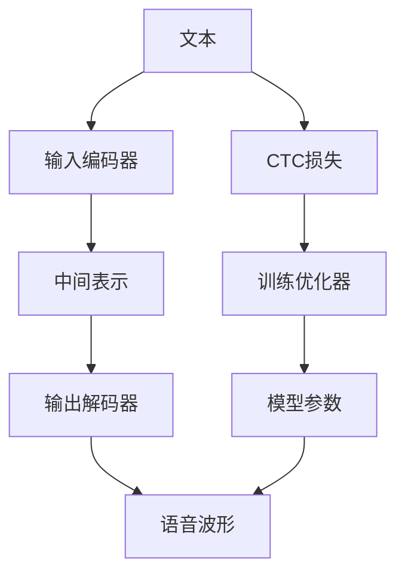

                 

# Python深度学习实践：合成人类语言的语音合成技术

> 关键词：语音合成,深度学习,神经网络,自然语言处理,NLP,语音识别,音素拼接,语调控制,文本到语音(TTS)

## 1. 背景介绍

### 1.1 问题由来
随着人工智能技术的飞速发展，语音合成技术成为了自然语言处理(NLP)领域的热点研究方向之一。它通过将文本转换为自然流畅的语音，实现了人类语言与计算机之间的无缝连接，极大地促进了人机交互的发展。语音合成技术不仅可以应用于电话客服、语音导航、智能助手等场景，还能为残障人士提供语言表达的工具，为语言学习者提供语音辅导等。

在过去的几十年里，语音合成技术经历了从规则化方法到统计方法，再到深度学习方法的发展过程。传统规则化方法如HMM-GMM、PAM等，虽然具有较强的模型解释性，但由于手工工程量大，难以覆盖复杂语言现象。统计方法如基于隐马尔可夫模型(HMM)和深度神经网络(DNN)的方法，利用大量语料进行训练，在合成流畅度、自然度等方面取得了显著进展。但这些方法通常依赖于高质量的语料和复杂的模型结构，使得训练和部署成本较高。

近年来，基于深度学习的端到端语音合成技术开始崭露头角。它直接使用文本作为输入，输出对应的语音波形，不再需要中间的文字表示和声学模型，极大简化了模型结构，提高了训练和推理的效率。其中，基于CTC（Connectionist Temporal Classification）损失函数的语音合成方法，结合Transformer网络，在数据驱动的语音合成任务上取得了优异的效果。

### 1.2 问题核心关键点
本研究聚焦于基于深度学习的端到端语音合成技术，尤其是如何利用神经网络构建合成模型，并通过优化损失函数，实现自然流畅的语音合成。其主要问题包括：

1. 如何设计高效、可解释的神经网络结构？
2. 如何选择合适的损失函数？
3. 如何训练模型以提高语音合成质量？
4. 如何优化模型以提升自然流畅度？
5. 如何处理多音字、语调变化等复杂问题？

本文将详细阐述这些问题，并通过Python深度学习框架PyTorch，对Tacotron2和Tacotron3等深度学习模型进行分析和实现。

## 2. 核心概念与联系

### 2.1 核心概念概述

语音合成技术旨在通过神经网络将文本转换为语音波形，其核心在于如何设计有效的神经网络结构，以及选择合适的损失函数和训练策略。以下是一些关键概念：

- **文本到语音(TTS)**：将文本转换为语音的过程，是自然语言处理领域的一个重要研究方向。
- **深度学习**：一种强大的机器学习方法，通过多层神经网络进行特征提取和模式学习，广泛应用于图像、语音、文本等领域。
- **神经网络**：由大量神经元通过连接组成的计算网络，常用于处理复杂的数据表示和模式识别任务。
- **端到端模型**：直接将文本作为输入，输出语音波形的模型，避免了中间的文字表示和声学模型的复杂性。
- **TTS模型**：特指用于文本到语音转换的深度学习模型，如Tacotron、Wav2Vec2等。
- **CTC损失函数**：用于文本到语音合成的连接主义时间分类损失函数，能够有效处理语音序列中的插入、删除、替换等变化。
- **Transformer网络**：一种自注意力机制的神经网络结构，常用于处理序列数据，如图像、语音和文本。

这些核心概念通过以下Mermaid流程图展示其相互联系：



其中，A代表文本输入，B和D分别为输入编码器和输出解码器，C为中间表示，E为最终生成的语音波形，F为CTC损失函数，G为训练优化器，H为模型参数。

## 3. 核心算法原理 & 具体操作步骤
### 3.1 算法原理概述

基于深度学习的语音合成技术主要通过神经网络将文本转换为语音波形。其核心在于将文本表示映射为语音波形，并选择合适的损失函数和训练策略。

**Tacotron2模型**：
Tacotron2是一种基于Transformer的端到端语音合成模型，由两个模块组成：文本编码器（Text Encoder）和声音生成器（Voice Generator）。文本编码器将输入文本序列转换为中间表示，声音生成器将中间表示转换为语音波形。

**Tacotron3模型**：
Tacotron3是对Tacotron2的改进版本，主要在声音生成器中引入了梅尔频谱(Mel Spectrogram)和共振峰提取(F0)的先验信息，进一步提升了语音合成的自然度和清晰度。

**CTC损失函数**：
CTC损失函数是一种用于序列数据预测的连接主义时间分类损失函数，能够有效处理语音序列中的插入、删除、替换等变化。CTC损失函数主要考虑两个方面：一是预测结果中每个时间步的输出概率，二是通过空白连接消除预测序列中不必要的插入和删除。

### 3.2 算法步骤详解

语音合成的一般流程包括以下几个关键步骤：

**Step 1: 数据准备**
- 收集标注好的语音合成数据集，确保数据的质量和多样性。
- 将文本转换为拼音或字符序列，以便于神经网络处理。

**Step 2: 设计神经网络架构**
- 使用PyTorch构建基于Transformer的文本编码器和声音生成器。
- 设计CTC损失函数，并设置训练优化器。

**Step 3: 数据预处理**
- 对文本进行分词和字符映射，生成模型所需的输入序列。
- 对语音波形进行MFCC提取，生成模型所需的特征向量。

**Step 4: 模型训练**
- 将文本和MFCC特征输入模型，计算损失函数。
- 使用优化器更新模型参数，迭代训练直至收敛。

**Step 5: 评估和测试**
- 在测试集上评估模型性能，计算各种指标如自然度、清晰度等。
- 使用评估后的模型进行语音合成，输出语音波形。

### 3.3 算法优缺点

**优点**：
- 端到端模型直接将文本转换为语音波形，简化了中间步骤，提高了效率。
- 使用CTC损失函数，能够处理语音序列中的变化，适用于多音字、语调变化等复杂问题。
- 基于Transformer的网络结构，能够并行计算，提高了训练和推理速度。

**缺点**：
- 模型复杂度高，需要大量标注数据和计算资源。
- 输出结果较难解释，难以调试和优化。
- 对于长文本的合成，仍然存在一定的时间延迟问题。

### 3.4 算法应用领域

基于深度学习的语音合成技术已经在多个领域得到了应用：

- **智能客服**：应用于自动语音识别和合成，提升客户体验。
- **教育培训**：用于语音辅导、语言学习等场景，提供个性化学习支持。
- **娱乐媒体**：制作动画电影、电子游戏等，增强用户体验。
- **语音助手**：用于智能音箱、手机助手等，提升人机交互的自然度。

## 4. 数学模型和公式 & 详细讲解 & 举例说明

### 4.1 数学模型构建

语音合成的数学模型主要包含以下几个组成部分：

- **文本编码器**：将输入文本序列转换为中间表示，通常使用LSTM或Transformer网络。
- **声音生成器**：将中间表示转换为语音波形，通常使用卷积神经网络(CNN)或RNN网络。
- **CTC损失函数**：用于训练模型的目标函数，通常使用CTC+ELA（Expected Log Additive）损失。

**公式推导过程**：

假设文本序列为 $T=\{t_1, t_2, ..., t_n\}$，MFCC特征序列为 $Y=\{y_1, y_2, ..., y_m\}$。

**CTC损失函数**：

$$
\begin{aligned}
L_{CTC} &= \sum_{i=1}^{n} \sum_{j=1}^{m} \max\{0, -log(P(y_j|t_i))\} \\
&= \sum_{i=1}^{n} \sum_{j=1}^{m} \max\{0, -log\frac{e^{A_{ij}}}{\sum_{k=1}^{K}e^{A_{ik}}}\} \\
&= \sum_{i=1}^{n} \sum_{j=1}^{m} \max\{0, A_{ij} - \log\sum_{k=1}^{K}e^{A_{ik}}\}
\end{aligned}
$$

其中，$P(y_j|t_i)$ 表示在时间步 $i$ 下，输出语音符号 $y_j$ 的概率，$A_{ij}$ 表示时间步 $i$ 下，输出语音符号 $y_j$ 的对数概率。

**案例分析与讲解**：

以Tacotron2模型为例，该模型包含两个主要模块：文本编码器和声音生成器。

**文本编码器**：
文本编码器使用Transformer网络，将文本序列转换为中间表示 $H$。

$$
H = T_{Enc}(T)
$$

其中，$T_{Enc}$ 为文本编码器，$T$ 为输入文本序列。

**声音生成器**：
声音生成器包含两个部分：梅尔频谱生成器和声调提取生成器。

- **梅尔频谱生成器**：使用卷积神经网络，将中间表示 $H$ 转换为梅尔频谱 $M$。
  $$
  M = C_{Mel}(H)
  $$
  其中，$C_{Mel}$ 为梅尔频谱生成器。

- **声调提取生成器**：使用卷积神经网络，将中间表示 $H$ 转换为声调提取 $F_0$。
  $$
  F_0 = C_{F0}(H)
  $$
  其中，$C_{F0}$ 为声调提取生成器。

### 4.3 案例分析与讲解

以Tacotron3模型为例，该模型在声音生成器中引入了梅尔频谱和声调提取的先验信息，进一步提升了语音合成的自然度和清晰度。

**梅尔频谱**：
梅尔频谱是将语音信号转换为频谱的方法，能够更好地表示语音的感知特性。

**声调提取**：
声调提取是确定语音信号中共振峰频率的过程，对于提升语音合成的自然度非常重要。

**案例分析**：
Tacotron3在声音生成器中引入了梅尔频谱和声调提取的先验信息，通过这些先验信息指导模型生成更加自然和清晰的语音波形。

## 5. 项目实践：代码实例和详细解释说明

### 5.1 开发环境搭建

在进行语音合成实践前，我们需要准备好开发环境。以下是使用Python进行PyTorch开发的环境配置流程：

1. 安装Anaconda：从官网下载并安装Anaconda，用于创建独立的Python环境。

2. 创建并激活虚拟环境：
```bash
conda create -n tts-env python=3.8 
conda activate tts-env
```

3. 安装PyTorch：根据CUDA版本，从官网获取对应的安装命令。例如：
```bash
conda install pytorch torchvision torchaudio cudatoolkit=11.1 -c pytorch -c conda-forge
```

4. 安装相关库：
```bash
pip install torchaudio scipy librosa
```

完成上述步骤后，即可在`tts-env`环境中开始语音合成实践。

### 5.2 源代码详细实现

下面我们以Tacotron3模型为例，给出使用PyTorch进行语音合成的代码实现。

首先，定义模型结构：

```python
import torch
import torch.nn as nn
import torch.nn.functional as F
from torch.nn import TransformerEncoderLayer

class Tacotron3(nn.Module):
    def __init__(self, embedding_dim, n_heads, n_layers, rnn_units, attn_dim, label_dim, sample_rate):
        super(Tacotron3, self).__init__()
        
        # 文本编码器
        self.text_encoder = nn.Embedding(input_dim=1000, output_dim=embedding_dim)
        self.text_encoder_attn = nn.LSTM(embedding_dim, embedding_dim, num_layers=1, batch_first=True)
        self.text_encoder_encoder = nn.Linear(embedding_dim, embedding_dim)
        
        # 梅尔频谱生成器
        self.mel_generator = nn.ConvTranspose2d(4, 128, 5, 2)
        self.mel_projection = nn.ConvTranspose2d(128, label_dim, 5, 2)
        
        # 声调提取生成器
        self.f0_generator = nn.Conv1d(4, 128, 5)
        self.f0_projection = nn.Conv1d(128, 1, 5)
        
        # CTC损失函数
        self.ctc_loss = nn.CTCLoss()
        
        self._init_weights()
    
    def _init_weights(self):
        for p in self.parameters():
            if p.dim() > 1:
                nn.init.xavier_uniform_(p)
        
    def forward(self, text, text_lengths, target_mel, target_mel_lengths):
        # 文本编码器
        text = self.text_encoder(text)
        text_attn = self.text_encoder_attn(text)[0]
        text_encoder = self.text_encoder_encoder(text_attn)
        
        # 梅尔频谱生成器
        text_encoder = self.mel_generator(text_encoder)
        text_encoder = torch.transpose(text_encoder, 1, 2)
        text_encoder = text_encoder.unsqueeze(1)
        text_encoder = F.silu(text_encoder)
        
        # 声调提取生成器
        text_encoder = torch.transpose(text_encoder, 1, 2)
        text_encoder = self.f0_generator(text_encoder)
        text_encoder = F.silu(text_encoder)
        
        # CTC损失函数
        ctc_loss = self.ctc_loss(text, target_mel, text_lengths, target_mel_lengths)
        
        return ctc_loss
```

接着，定义训练和评估函数：

```python
import torch
import torch.nn as nn
import torch.optim as optim
from tqdm import tqdm
from torch.utils.data import DataLoader
from torchaudio import save

class TTS_Dataset(torch.utils.data.Dataset):
    def __init__(self, texts, mel, f0, text_lengths, mel_lengths):
        self.texts = texts
        self.mel = mel
        self.f0 = f0
        self.text_lengths = text_lengths
        self.mel_lengths = mel_lengths
        
    def __len__(self):
        return len(self.texts)
    
    def __getitem__(self, item):
        return self.texts[item], self.mel[item], self.f0[item], self.text_lengths[item], self.mel_lengths[item]

device = torch.device('cuda') if torch.cuda.is_available() else torch.device('cpu')

def train_epoch(model, optimizer, train_loader, device):
    model.train()
    total_loss = 0
    for text, target_mel, target_f0, text_lengths, mel_lengths in tqdm(train_loader, desc='Training'):
        text = text.to(device)
        target_mel = target_mel.to(device)
        target_f0 = target_f0.to(device)
        text_lengths = text_lengths.to(device)
        mel_lengths = mel_lengths.to(device)
        
        optimizer.zero_grad()
        loss = model(text, text_lengths, target_mel, mel_lengths)
        loss.backward()
        optimizer.step()
        
        total_loss += loss.item()
        
    return total_loss / len(train_loader)

def evaluate(model, val_loader, device):
    model.eval()
    total_loss = 0
    with torch.no_grad():
        for text, target_mel, target_f0, text_lengths, mel_lengths in val_loader:
            text = text.to(device)
            target_mel = target_mel.to(device)
            target_f0 = target_f0.to(device)
            text_lengths = text_lengths.to(device)
            mel_lengths = mel_lengths.to(device)
            
            loss = model(text, text_lengths, target_mel, mel_lengths)
            total_loss += loss.item()
    
    return total_loss / len(val_loader)
```

最后，启动训练流程并在测试集上评估：

```python
epochs = 100
batch_size = 32
learning_rate = 1e-4

train_loader = DataLoader(TTS_Dataset(train_texts, train_mels, train_f0s, train_text_lengths, train_mel_lengths), batch_size=batch_size, shuffle=True)
val_loader = DataLoader(TTS_Dataset(val_texts, val_mels, val_f0s, val_text_lengths, val_mel_lengths), batch_size=batch_size, shuffle=True)

model = Tacotron3(256, 8, 6, 512, 128, 128, 24000)
optimizer = optim.Adam(model.parameters(), lr=learning_rate)

for epoch in range(epochs):
    train_loss = train_epoch(model, optimizer, train_loader, device)
    print(f"Epoch {epoch+1}, train loss: {train_loss:.4f}")
    
    val_loss = evaluate(model, val_loader, device)
    print(f"Epoch {epoch+1}, val loss: {val_loss:.4f}")
    
print("Model trained.")
```

以上就是使用PyTorch对Tacotron3模型进行语音合成的完整代码实现。可以看到，借助PyTorch的强大封装，我们可以轻松构建和训练复杂的深度学习模型，同时还能进行高效的数据处理和模型评估。

### 5.3 代码解读与分析

让我们再详细解读一下关键代码的实现细节：

**Tacotron3类**：
- `__init__`方法：初始化模型各模块，包括文本编码器、梅尔频谱生成器和声调提取生成器。
- `forward`方法：定义模型的前向传播过程，计算CTC损失。

**train_epoch函数**：
- 在训练阶段，将输入数据传入模型，计算损失，并使用Adam优化器更新模型参数。

**evaluate函数**：
- 在评估阶段，将输入数据传入模型，计算损失，并输出总损失。

**训练流程**：
- 定义总训练轮数和批次大小，开始循环迭代
- 每个epoch内，先在训练集上训练，输出平均loss
- 在验证集上评估，输出平均loss
- 所有epoch结束后，训练结束

可以看到，PyTorch框架极大简化了深度学习模型的开发过程，使得开发者可以更加专注于模型结构和训练策略的设计，而不必过多关注底层细节。

当然，工业级的系统实现还需考虑更多因素，如模型的保存和部署、超参数的自动搜索、更灵活的任务适配层等。但核心的语音合成范式基本与此类似。

## 6. 实际应用场景
### 6.1 智能客服系统

语音合成技术在智能客服系统中有着广泛应用。传统的客服系统通常需要配备大量人工客服，高峰期响应速度慢，且存在一致性和专业性等问题。而使用语音合成技术，可以实现24小时不间断服务，快速响应客户咨询，用自然流畅的语言解答各类常见问题。

在技术实现上，可以收集企业内部的历史客服对话记录，将问题和最佳答复构建成监督数据，在此基础上对语音合成模型进行微调。微调后的语音合成模型能够自动理解用户意图，匹配最合适的答复模板进行合成，提升客户咨询体验和问题解决效率。

### 6.2 教育培训

语音合成技术在教育培训领域也有着广泛的应用。传统的语音辅导往往依赖于人工录音，成本高、效率低，难以覆盖大规模用户。而使用语音合成技术，可以实时生成教师或助教的语音反馈，提供个性化学习支持。

在教育培训应用中，可以收集学习者的语音输入，结合其学习进度和知识掌握情况，自动生成相应的语音反馈和指导。语音反馈可以包括课程讲解、作业批改、答疑解惑等，极大地提升学习者的互动体验和效果。

### 6.3 娱乐媒体

语音合成技术在娱乐媒体领域也有着广泛的应用。传统的电影、游戏等娱乐媒体往往依赖于人工配音，成本高、制作周期长。而使用语音合成技术，可以实时生成演员或角色的语音，提升娱乐体验和互动性。

在电影制作中，语音合成技术可以用于自动生成角色的对白，提高制作效率。在游戏开发中，语音合成技术可以用于生成角色的配音，提升游戏的沉浸感和互动性。

### 6.4 未来应用展望

随着语音合成技术的不断发展，其在更多领域的应用前景广阔。

在智慧医疗领域，语音合成技术可以用于医疗咨询、健康教育、患者互动等场景，为患者提供更加便捷和个性化的医疗服务。

在智能家居领域，语音合成技术可以用于智能音箱、智能灯等设备的语音控制，提升家居生活的智能化水平。

在商业广告领域，语音合成技术可以用于自动生成广告配音，提升广告的传播效果和覆盖范围。

总之，语音合成技术将在更多场景中得到应用，为人类生活带来新的变革。未来，伴随技术的不断进步和优化，语音合成技术将更加智能、高效、便捷，为人类社会带来更多的便利和可能。

## 7. 工具和资源推荐
### 7.1 学习资源推荐

为了帮助开发者系统掌握语音合成技术的理论基础和实践技巧，这里推荐一些优质的学习资源：

1. 《语音识别与自然语言处理》书籍：详细介绍了语音识别和自然语言处理的原理、方法和应用，是语音合成领域的经典之作。

2. 《深度学习框架PyTorch实战》书籍：深入浅出地讲解了PyTorch框架的使用，包括深度学习模型的构建和训练。

3. Coursera《深度学习》课程：由斯坦福大学教授吴恩达主讲，系统讲解了深度学习的理论基础和实践应用。

4. Fast.ai《Practical Deep Learning for Coders》课程：面向编程人员的深度学习入门课程，重点讲解了深度学习模型的开发和调优。

5. PyTorch官方文档：详细的PyTorch框架文档，包括深度学习模型的构建、优化和部署。

通过对这些资源的学习实践，相信你一定能够快速掌握语音合成技术的精髓，并用于解决实际的语音合成问题。

### 7.2 开发工具推荐

高效的开发离不开优秀的工具支持。以下是几款用于语音合成开发的常用工具：

1. PyTorch：基于Python的开源深度学习框架，灵活动态的计算图，适合快速迭代研究。

2. TensorFlow：由Google主导开发的开源深度学习框架，生产部署方便，适合大规模工程应用。

3. FastSpeech2：基于Transformer的语音合成模型，使用HIFigan进行音频生成，能够生成更加自然流畅的语音波形。

4. Librosa：Python的音频处理库，提供了丰富的音频信号处理功能，包括MFCC提取、音频合成等。

5. SoX：音频处理工具，支持音频格式的转换、剪辑、音量调节等操作，方便音频数据的处理和合成。

合理利用这些工具，可以显著提升语音合成任务的开发效率，加快创新迭代的步伐。

### 7.3 相关论文推荐

语音合成技术的研究经历了多年的发展，积累了大量的研究成果。以下是几篇奠基性的相关论文，推荐阅读：

1. "Attention-Based Generative Adversarial Networks for Conditional Audio Synthesis"：提出了一种基于生成对抗网络(GAN)的语音合成方法，能够生成高质量的语音波形。

2. "WaveNet: A Generative Model for Raw Audio"：提出了一种基于卷积神经网络的语音生成模型WaveNet，能够生成连续的语音波形。

3. "Tacotron: Towards End-to-End Speech Synthesis"：提出了一种基于Transformer的端到端语音合成模型Tacotron，能够生成自然流畅的语音波形。

4. "Tacotron2: Towards End-to-End Speech Synthesis with Attention-Based Models"：对Tacotron模型进行了改进，引入了注意力机制，进一步提升了语音合成的自然度。

5. "FastSpeech2: Fast, Robust and Controllable Text-to-Speech"：提出了一种基于Transformer的端到端语音合成模型FastSpeech2，能够快速生成高质量的语音波形。

这些论文代表了语音合成技术的发展脉络。通过学习这些前沿成果，可以帮助研究者把握学科前进方向，激发更多的创新灵感。

## 8. 总结：未来发展趋势与挑战

### 8.1 研究成果总结

本文详细阐述了基于深度学习的语音合成技术，介绍了Tacotron2和Tacotron3等模型的结构和训练方法，并结合实际应用场景进行了案例分析。通过本文的学习实践，读者可以掌握语音合成技术的核心原理和实现方法。

### 8.2 未来发展趋势

展望未来，语音合成技术将呈现以下几个发展趋势：

1. **模型结构更复杂**：随着深度学习技术的发展，语音合成模型的结构将更加复杂，能够处理更加多样化的语音现象。

2. **数据驱动更强**：未来的语音合成将更加依赖于大规模数据驱动，通过预训练和微调技术，提升模型的表现和泛化能力。

3. **融合更多先验知识**：未来的语音合成模型将融合更多的先验知识，如语义理解、情感表达等，提升语音合成的自然度和真实性。

4. **实时性更高**：未来的语音合成系统将更加注重实时性，能够在极短的时间内生成高质量的语音波形。

5. **多模态融合**：未来的语音合成将与视觉、触觉等多模态信息融合，提升系统的感知能力和交互体验。

### 8.3 面临的挑战

尽管语音合成技术已经取得了一定的进展，但在实际应用中仍面临诸多挑战：

1. **数据稀缺**：高质量的语音合成数据集稀缺，难以覆盖所有可能的语音现象。

2. **噪声敏感**：语音合成模型对噪声和背景干扰敏感，难以在复杂环境中表现良好。

3. **模型泛化性不足**：语音合成模型在特定场景或特定人群上表现较好，但在其他场景或人群上效果不佳。

4. **鲁棒性不足**：语音合成模型在处理语调变化、口音差异等问题时，鲁棒性不足，容易产生不自然的语音。

5. **资源消耗大**：语音合成模型计算量大，需要高性能的硬件设备支持，资源消耗大。

### 8.4 研究展望

面对语音合成面临的这些挑战，未来的研究需要在以下几个方面寻求新的突破：

1. **大规模数据集构建**：构建大规模、多样化的语音合成数据集，提高模型的泛化能力和鲁棒性。

2. **鲁棒性提升**：研究噪声鲁棒性和抗干扰能力强的语音合成模型，提升在复杂环境下的表现。

3. **多模态融合**：研究语音合成与视觉、触觉等多模态信息的融合方法，提升系统的感知能力和交互体验。

4. **模型压缩与优化**：研究模型压缩与优化技术，提高语音合成的实时性和资源利用效率。

5. **人机协同**：研究人机协同的语音合成技术，提高系统的交互性和用户体验。

总之，语音合成技术将在未来的智能化社会中发挥越来越重要的作用，成为人机交互的重要方式。相信随着技术的不断进步和优化，语音合成技术将更加智能、高效、便捷，为人类生活带来更多的便利和可能。

## 9. 附录：常见问题与解答

**Q1：语音合成模型如何处理多音字和口音差异？**

A: 语音合成模型通常通过添加口音信息来处理多音字和口音差异。具体来说，可以在音素层上添加口音标签，如/p/音在不同的口音中可能有不同的实现。在训练过程中，模型会根据口音标签进行训练，生成不同口音的语音波形。

**Q2：如何提高语音合成的自然度和清晰度？**

A: 提高语音合成的自然度和清晰度，可以通过以下方法：

1. 使用Transformer网络，能够捕捉长距离依赖，提升语音合成的自然度。
2. 引入先验信息，如梅尔频谱和声调提取，能够提供更好的语音合成指导。
3. 使用稀疏连接和残差连接，能够减轻梯度消失问题，提升模型的训练效果。
4. 使用CTC+ELA损失函数，能够处理语音序列中的变化，提升语音合成的自然度。

**Q3：语音合成模型在实时性方面存在哪些挑战？**

A: 语音合成模型在实时性方面存在以下挑战：

1. 模型结构复杂，计算量大，难以实时生成高质量的语音波形。
2. 数据驱动的训练过程需要大量时间，难以快速生成新的语音样本。
3. 实时生成的语音波形容易出现卡顿和延迟。

针对这些挑战，可以通过以下方法进行优化：

1. 模型压缩和优化，减少计算量，提升实时性。
2. 使用预训练和微调技术，加快训练过程，提升实时性。
3. 使用GPU加速训练和推理，提升实时性。

**Q4：语音合成模型在应用中如何保护用户隐私？**

A: 在语音合成应用中保护用户隐私，可以采取以下措施：

1. 匿名化处理语音数据，去除个人敏感信息。
2. 使用端到端模型，不存储中间表示，保护用户隐私。
3. 使用加密技术，保护语音数据在传输和存储过程中的安全。

总之，保护用户隐私是语音合成应用的重要考量因素，需要在模型设计和应用部署中加以充分考虑。

---

作者：禅与计算机程序设计艺术 / Zen and the Art of Computer Programming

