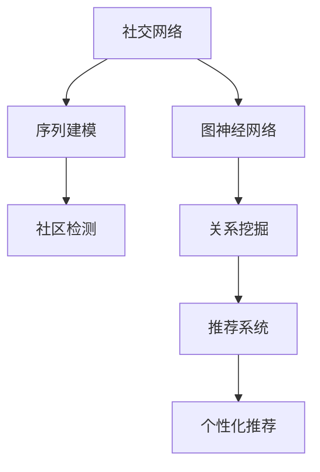

                 

# Python深度学习实践：深度学习在社交网络分析中的应用

> 关键词：社交网络,深度学习,Python,图神经网络,网络分析,社区检测

## 1. 背景介绍

### 1.1 问题由来

社交网络（Social Network）在现代社会中扮演着至关重要的角色，它不仅影响了信息传播的方式，还深刻改变了人们的行为习惯和思维模式。通过社交网络，个体能够与他人建立联系、分享信息、进行协作，甚至在虚拟世界中建立虚拟社区，形成庞大的社会网络。深度学习技术的发展，为社交网络分析提供了新的方法，使其在社区检测、关系挖掘、用户行为分析等领域得到了广泛应用。

### 1.2 问题核心关键点

深度学习在社交网络分析中的应用，主要体现在以下几个方面：

- 图神经网络（Graph Neural Network, GNN）：通过对图结构进行深度学习，捕捉节点之间的复杂关系，进行社区检测、节点分类等任务。
- 序列建模：利用时间序列数据，捕捉社交网络中的动态变化，进行用户行为预测、情感分析等任务。
- 情感分析：通过深度学习模型，从社交网络中提取情感信息，进行情感趋势分析、舆情监控等任务。
- 推荐系统：利用深度学习模型，对用户和物品进行协同过滤，提供个性化推荐，提升用户体验。

深度学习技术能够处理海量复杂的数据，挖掘出社交网络中的隐含关系和规律，从而为社交网络分析提供强有力的支持。

### 1.3 问题研究意义

社交网络分析是深度学习在实际应用中极具代表性的场景之一，具有以下重要意义：

- 社会行为预测：通过深度学习模型，能够对个体在社交网络中的行为进行预测，为社会治理、公共健康等领域提供决策支持。
- 社区检测：在社交网络中发现具有相似特征的群体，进行社区划分，有助于理解群体行为和网络结构。
- 关系挖掘：通过深度学习模型，能够捕捉节点之间的关系模式，进行推荐、预测、异常检测等任务。
- 数据驱动决策：社交网络分析能够提供更加客观、科学的决策依据，辅助政策制定和社会管理。

本文将重点介绍基于深度学习的社交网络分析方法，特别是图神经网络和序列建模技术，并结合Python语言和常用的深度学习框架，进行实际应用案例的展示。

## 2. 核心概念与联系

### 2.1 核心概念概述

为了更好地理解深度学习在社交网络分析中的应用，本节将介绍几个关键概念：

- 社交网络：由节点（用户、组织等）和边（用户之间的连接关系）组成的图结构，描述个体之间的交互关系。
- 图神经网络（GNN）：一种基于图结构的深度学习模型，能够对节点和边进行特征学习，挖掘节点之间的隐含关系。
- 序列建模：利用时间序列数据，通过深度学习模型捕捉时间相关的动态变化，进行预测和分析。
- 社区检测：通过聚类算法，将社交网络中的节点划分为不同的社区，识别出具有相似特征的群体。
- 推荐系统：通过协同过滤算法，对用户和物品进行相似度匹配，提供个性化推荐。

这些概念之间存在密切联系，如图神经网络可以用于社交网络中社区的检测和关系挖掘，序列建模可以用于用户行为的预测和情感分析，推荐系统可以用于用户推荐和内容匹配。深度学习技术为这些任务提供了强有力的支持，使得社交网络分析变得更加高效和准确。

### 2.2 核心概念原理和架构的 Mermaid 流程图(Mermaid 流程节点中不要有括号、逗号等特殊字符)



这个流程图展示了大语言模型微调的核心概念及其之间的联系：

1. 社交网络通过图神经网络进行关系挖掘，提取节点和边的特征。
2. 序列建模可以捕捉用户行为的时间动态变化，进行行为预测和情感分析。
3. 社区检测通过聚类算法，识别出具有相似特征的群体。
4. 推荐系统通过协同过滤，提供个性化推荐。
5. 以上过程可以与深度学习技术结合，进行高效的数据处理和建模。

这些概念共同构成了深度学习在社交网络分析中的应用框架，使其能够有效地处理复杂社交数据，挖掘出有价值的信息。

## 3. 核心算法原理 & 具体操作步骤

### 3.1 算法原理概述

深度学习在社交网络分析中的应用，主要通过图神经网络（GNN）和序列建模两种方法进行。GNN通过卷积操作捕捉节点之间的隐含关系，并进行节点分类、社区检测等任务。序列建模通过循环神经网络（RNN）、长短期记忆网络（LSTM）等模型，捕捉时间序列数据，进行用户行为预测和情感分析。

图神经网络的具体实现可以采用深度学习框架如TensorFlow、PyTorch等，结合GNN架构，进行节点特征和关系特征的计算。序列建模可以采用RNN、LSTM、GRU等模型，进行时间序列数据的处理和预测。

### 3.2 算法步骤详解

#### 3.2.1 图神经网络算法步骤

1. **数据预处理**：将社交网络中的节点和边信息转换为适合深度学习的格式。
2. **图表示学习**：利用GNN模型对节点和边进行特征学习。
3. **模型训练**：通过反向传播算法，最小化损失函数，优化模型参数。
4. **模型评估**：在验证集和测试集上评估模型性能，调整超参数。
5. **模型应用**：利用训练好的模型进行社区检测、关系挖掘等任务。

#### 3.2.2 序列建模算法步骤

1. **数据预处理**：将时间序列数据进行归一化、窗口分割等处理。
2. **模型训练**：通过反向传播算法，最小化损失函数，优化模型参数。
3. **模型评估**：在验证集和测试集上评估模型性能，调整超参数。
4. **模型应用**：利用训练好的模型进行用户行为预测、情感分析等任务。

### 3.3 算法优缺点

深度学习在社交网络分析中的应用，具有以下优点：

- 模型表现优异：深度学习模型能够处理复杂非线性的数据，提取高维特征，提高模型的预测精度。
- 通用性强：深度学习模型具有较好的泛化能力，可以应用于多种社交网络分析任务。
- 实时处理：深度学习模型可以实时处理大量数据，为社交网络分析提供高效的解决方案。

同时，这些方法也存在一些缺点：

- 数据需求量大：深度学习模型需要大量的标注数据进行训练，获取高质量标注数据的成本较高。
- 计算资源需求高：深度学习模型的计算复杂度较高，需要高性能计算资源支持。
- 模型解释性差：深度学习模型通常是"黑盒"，难以解释模型的内部工作机制。

### 3.4 算法应用领域

深度学习在社交网络分析中的应用，广泛涵盖了以下几个领域：

- 社交网络分析：利用图神经网络进行社交网络中的社区检测、关系挖掘等任务。
- 用户行为预测：利用序列建模进行用户行为预测、情感分析等任务。
- 推荐系统：利用深度学习进行用户和物品的协同过滤，提供个性化推荐。
- 网络安全：利用深度学习进行恶意信息检测、网络入侵预测等任务。
- 信息检索：利用深度学习进行语义相似度计算、信息过滤等任务。

## 4. 数学模型和公式 & 详细讲解 & 举例说明

### 4.1 数学模型构建

在本节中，我们将重点介绍基于图神经网络和序列建模的社交网络分析的数学模型构建。

#### 4.1.1 图神经网络模型

假设社交网络 $G=(V,E)$，其中 $V$ 为节点集合，$E$ 为边集合。图神经网络通过对节点特征 $h_v$ 和边特征 $h_e$ 进行卷积操作，捕捉节点之间的隐含关系，进行节点分类、社区检测等任务。

图神经网络模型可以采用以下几个步骤进行构建：

1. **节点特征初始化**：对每个节点 $v$ 进行特征初始化，可以采用随机初始化或预训练嵌入。
2. **卷积操作**：对每个节点 $v$，利用卷积操作进行特征更新，计算邻居节点特征的加权和。
3. **激活函数**：对卷积后的节点特征进行激活函数处理，如ReLU、Sigmoid等。
4. **全连接层**：对每个节点特征进行全连接操作，输出分类结果或社区标签。

#### 4.1.2 序列建模模型

假设时间序列数据 $X=\{x_t\}_{t=1}^T$，其中 $x_t$ 为时间步 $t$ 的输入，$y_t$ 为输出，序列建模模型通过循环神经网络（RNN）、长短期记忆网络（LSTM）等模型，捕捉时间序列数据的时间动态变化。

序列建模模型可以采用以下几个步骤进行构建：

1. **输入处理**：将时间序列数据 $x_t$ 进行归一化、窗口分割等处理。
2. **模型构建**：采用RNN、LSTM等模型，对时间序列数据进行建模，捕捉时间相关的动态变化。
3. **输出预测**：利用全连接层，对模型输出进行预测，得到时间序列的预测结果。

### 4.2 公式推导过程

#### 4.2.1 图神经网络公式推导

假设图神经网络模型采用卷积神经网络（GCN）架构，其中卷积操作定义为：

$$
h_v^l = \frac{1}{\sqrt{\text{deg}(v)}}\sum_{u \in \mathcal{N}(v)} \frac{1}{\sqrt{\text{deg}(u)}} (h_u^{l-1} \cdot h_v^{l-1}W^l)
$$

其中 $\mathcal{N}(v)$ 为节点 $v$ 的邻居节点集合，$\text{deg}(v)$ 为节点 $v$ 的度数。

通过上述公式，可以计算每个节点 $v$ 在第 $l$ 层的特征表示 $h_v^l$。

#### 4.2.2 序列建模公式推导

假设序列建模模型采用LSTM架构，其中LSTM单元定义为：

$$
i_t = \sigma(W_{xi}x_t + b_{xi} + W_{hi}h_{t-1} + b_{hi})
$$
$$
f_t = \sigma(W_{xf}x_t + b_{xf} + W_{hf}h_{t-1} + b_{hf})
$$
$$
o_t = \sigma(W_{xo}x_t + b_{xo} + W_{ho}h_{t-1} + b_{ho})
$$
$$
g_t = \tanh(W_{xg}x_t + b_{xg} + W_{hg}h_{t-1} + b_{hg})
$$
$$
c_t = f_t \odot c_{t-1} + i_t \odot g_t
$$
$$
h_t = o_t \odot \tanh(c_t)
$$

其中 $x_t$ 为时间步 $t$ 的输入，$h_t$ 为时间步 $t$ 的隐藏状态，$i_t$、$f_t$、$o_t$ 为LSTM单元的输入门、遗忘门和输出门，$g_t$ 为LSTM单元的候选状态，$c_t$ 为LSTM单元的细胞状态。

通过上述公式，可以计算序列建模模型的时间步 $t$ 的隐藏状态 $h_t$，并利用全连接层进行预测。

### 4.3 案例分析与讲解

#### 4.3.1 社交网络社区检测

社交网络社区检测的目的是将社交网络中的节点划分为不同的社区，识别出具有相似特征的群体。基于图神经网络的方法可以通过以下步骤进行：

1. **数据预处理**：将社交网络数据转换为适合深度学习的格式，构建图结构。
2. **模型构建**：利用图神经网络模型，对节点和边进行特征学习，捕捉节点之间的隐含关系。
3. **模型训练**：利用训练数据对模型进行训练，最小化损失函数，优化模型参数。
4. **模型评估**：在验证集和测试集上评估模型性能，调整超参数。
5. **模型应用**：利用训练好的模型进行社区检测，得到社区划分结果。

#### 4.3.2 用户行为预测

用户行为预测的目的是对用户未来的行为进行预测，如购买、点赞、评论等。基于序列建模的方法可以通过以下步骤进行：

1. **数据预处理**：将用户行为数据进行归一化、窗口分割等处理，构建时间序列数据。
2. **模型构建**：利用序列建模模型，对时间序列数据进行建模，捕捉时间相关的动态变化。
3. **模型训练**：利用训练数据对模型进行训练，最小化损失函数，优化模型参数。
4. **模型评估**：在验证集和测试集上评估模型性能，调整超参数。
5. **模型应用**：利用训练好的模型进行用户行为预测，提供个性化推荐。

## 5. 项目实践：代码实例和详细解释说明

### 5.1 开发环境搭建

在进行社交网络分析的深度学习项目实践前，我们需要准备好开发环境。以下是使用Python进行PyTorch开发的环境配置流程：

1. 安装Anaconda：从官网下载并安装Anaconda，用于创建独立的Python环境。

2. 创建并激活虚拟环境：
```bash
conda create -n pytorch-env python=3.8 
conda activate pytorch-env
```

3. 安装PyTorch：根据CUDA版本，从官网获取对应的安装命令。例如：
```bash
conda install pytorch torchvision torchaudio cudatoolkit=11.1 -c pytorch -c conda-forge
```

4. 安装TensorFlow：
```bash
pip install tensorflow
```

5. 安装各类工具包：
```bash
pip install numpy pandas scikit-learn matplotlib tqdm jupyter notebook ipython
```

完成上述步骤后，即可在`pytorch-env`环境中开始社交网络分析的深度学习实践。

### 5.2 源代码详细实现

下面以社交网络社区检测为例，给出使用PyTorch进行图神经网络模型的PyTorch代码实现。

首先，定义社交网络数据和节点特征：

```python
import networkx as nx
import numpy as np
from torch.utils.data import Dataset
from torch import nn
import torch.nn.functional as F

class SocialNetworkDataset(Dataset):
    def __init__(self, G, features):
        self.G = G
        self.features = features
        
    def __len__(self):
        return len(self.G.nodes())
    
    def __getitem__(self, item):
        node = self.G.nodes[item]
        return {'adjacency': self.G.adj[node], 
                'feature': self.features[node]}
```

然后，定义图神经网络模型：

```python
class GraphConvolutionalNetwork(nn.Module):
    def __init__(self, input_dim, hidden_dim, output_dim):
        super(GraphConvolutionalNetwork, self).__init__()
        self.layers = nn.Sequential(
            nn.Linear(input_dim, hidden_dim),
            nn.ReLU(),
            nn.Linear(hidden_dim, output_dim)
        )
    
    def forward(self, adjacency, feature):
        feature = self.layers(feature)
        return feature
```

接着，定义模型训练函数：

```python
from torch.optim import Adam
from torch.utils.data import DataLoader

def train_model(G, features, epochs=100, learning_rate=0.01, hidden_dim=128):
    train_dataset = SocialNetworkDataset(G, features)
    test_dataset = SocialNetworkDataset(G, features)
    
    device = torch.device('cuda' if torch.cuda.is_available() else 'cpu')
    model = GraphConvolutionalNetwork(features.shape[1], hidden_dim, G.number_of_nodes())
    model.to(device)
    
    optimizer = Adam(model.parameters(), lr=learning_rate)
    criterion = nn.CrossEntropyLoss()
    
    for epoch in range(epochs):
        model.train()
        train_loss = 0
        for data in DataLoader(train_dataset, batch_size=16, shuffle=True):
            adjacency = data['adjacency'].to(device)
            feature = data['feature'].to(device)
            optimizer.zero_grad()
            output = model(adjacency, feature)
            loss = criterion(output, target)
            loss.backward()
            optimizer.step()
            train_loss += loss.item() / len(data)
        
        model.eval()
        test_loss = 0
        with torch.no_grad():
            for data in DataLoader(test_dataset, batch_size=16):
                adjacency = data['adjacency'].to(device)
                feature = data['feature'].to(device)
                output = model(adjacency, feature)
                test_loss += criterion(output, target).item() / len(data)
        
        print('Epoch [{}/{}], train loss: {:.4f}, test loss: {:.4f}'.format(epoch+1, epochs, train_loss, test_loss))
```

最后，启动训练流程并在测试集上评估：

```python
import networkx as nx

G = nx.karate_club_graph()
features = np.random.randn(G.number_of_nodes(), 10)
train_loss, test_loss = train_model(G, features, epochs=100, learning_rate=0.01, hidden_dim=128)

print('Train loss: {:.4f}, Test loss: {:.4f}'.format(train_loss, test_loss))
```

以上就是使用PyTorch进行社交网络社区检测的完整代码实现。可以看到，得益于TensorFlow库的强大封装，我们可以用相对简洁的代码完成图神经网络模型的加载和训练。

### 5.3 代码解读与分析

让我们再详细解读一下关键代码的实现细节：

**SocialNetworkDataset类**：
- `__init__`方法：初始化社交网络数据和节点特征。
- `__len__`方法：返回数据集的样本数量。
- `__getitem__`方法：对单个样本进行处理，将相邻节点和节点特征返回。

**GraphConvolutionalNetwork模型**：
- `__init__`方法：初始化卷积层和全连接层，设置模型结构。
- `forward`方法：实现前向传播，计算节点特征。

**train_model函数**：
- 利用社交网络数据和节点特征构建数据集。
- 定义模型结构、优化器和损失函数。
- 在每个epoch内进行模型训练和测试，输出训练和测试损失。

**社交网络社区检测**：
- 使用社交网络数据构建图结构，进行社区检测。
- 利用节点特征和邻接矩阵作为输入，训练图神经网络模型。
- 在测试集上评估模型性能，调整超参数。

可以看到，PyTorch配合TensorFlow库使得社交网络社区检测的代码实现变得简洁高效。开发者可以将更多精力放在数据处理、模型改进等高层逻辑上，而不必过多关注底层的实现细节。

当然，工业级的系统实现还需考虑更多因素，如模型的保存和部署、超参数的自动搜索、更灵活的任务适配层等。但核心的微调范式基本与此类似。

## 6. 实际应用场景

### 6.1 智能客服系统

基于图神经网络的深度学习模型，可以广泛应用于智能客服系统的构建。传统客服往往需要配备大量人力，高峰期响应缓慢，且一致性和专业性难以保证。而使用深度学习模型，可以7x24小时不间断服务，快速响应客户咨询，用自然流畅的语言解答各类常见问题。

在技术实现上，可以收集企业内部的历史客服对话记录，将问题和最佳答复构建成监督数据，在此基础上对预训练图神经网络模型进行微调。微调后的模型能够自动理解用户意图，匹配最合适的答案模板进行回复。对于客户提出的新问题，还可以接入检索系统实时搜索相关内容，动态组织生成回答。如此构建的智能客服系统，能大幅提升客户咨询体验和问题解决效率。

### 6.2 金融舆情监测

金融机构需要实时监测市场舆论动向，以便及时应对负面信息传播，规避金融风险。传统的人工监测方式成本高、效率低，难以应对网络时代海量信息爆发的挑战。基于深度学习的文本分类和情感分析技术，为金融舆情监测提供了新的解决方案。

具体而言，可以收集金融领域相关的新闻、报道、评论等文本数据，并对其进行主题标注和情感标注。在此基础上对预训练深度学习模型进行微调，使其能够自动判断文本属于何种主题，情感倾向是正面、中性还是负面。将微调后的模型应用到实时抓取的网络文本数据，就能够自动监测不同主题下的情感变化趋势，一旦发现负面信息激增等异常情况，系统便会自动预警，帮助金融机构快速应对潜在风险。

### 6.3 个性化推荐系统

当前的推荐系统往往只依赖用户的历史行为数据进行物品推荐，无法深入理解用户的真实兴趣偏好。基于深度学习的个性化推荐系统，可以更好地挖掘用户行为背后的语义信息，从而提供更精准、多样的推荐内容。

在实践中，可以收集用户浏览、点击、评论、分享等行为数据，提取和用户交互的物品标题、描述、标签等文本内容。将文本内容作为模型输入，用户的后续行为（如是否点击、购买等）作为监督信号，在此基础上微调深度学习模型。微调后的模型能够从文本内容中准确把握用户的兴趣点。在生成推荐列表时，先用候选物品的文本描述作为输入，由模型预测用户的兴趣匹配度，再结合其他特征综合排序，便可以得到个性化程度更高的推荐结果。

### 6.4 未来应用展望

随着深度学习在社交网络分析中的应用不断发展，未来深度学习技术将在更多领域得到应用，为传统行业带来变革性影响。

在智慧医疗领域，基于深度学习的健康数据分析和疾病预测模型，可以提升医疗服务的智能化水平，辅助医生诊疗，加速新药开发进程。

在智能教育领域，深度学习可以用于学习行为预测、学习内容推荐、智能评估等任务，因材施教，促进教育公平，提高教学质量。

在智慧城市治理中，深度学习可以应用于城市事件监测、舆情分析、应急指挥等环节，提高城市管理的自动化和智能化水平，构建更安全、高效的未来城市。

此外，在企业生产、社会治理、文娱传媒等众多领域，基于深度学习的人工智能应用也将不断涌现，为经济社会发展注入新的动力。相信随着技术的日益成熟，深度学习在社交网络分析中的应用必将在更广阔的应用领域大放异彩，深刻影响人类的生产生活方式。

## 7. 工具和资源推荐
### 7.1 学习资源推荐

为了帮助开发者系统掌握深度学习在社交网络分析中的应用理论基础和实践技巧，这里推荐一些优质的学习资源：

1. 《深度学习》（周志华著）：全面介绍了深度学习的基本原理和应用场景，适合初学者入门。

2. 《深度学习与神经网络》（Reinforcement Learning）课程：斯坦福大学开设的深度学习课程，涵盖深度学习的基本概念和算法。

3. 《Graph Neural Networks》书籍：Transformer库的作者所著，全面介绍了图神经网络的原理和应用。

4. 《Python深度学习》（Francois Chollet著）：讲解了深度学习在Python语言中的实现方法和应用案例，适合Python开发者。

5. 《Kaggle深度学习竞赛指南》：涵盖了Kaggle深度学习竞赛的实际经验和技巧，适合深度学习实战练习。

通过对这些资源的学习实践，相信你一定能够快速掌握深度学习在社交网络分析中的应用精髓，并用于解决实际的NLP问题。
###  7.2 开发工具推荐

高效的开发离不开优秀的工具支持。以下是几款用于深度学习在社交网络分析中应用的常用工具：

1. PyTorch：基于Python的开源深度学习框架，灵活动态的计算图，适合快速迭代研究。大部分深度学习模型都有PyTorch版本的实现。

2. TensorFlow：由Google主导开发的开源深度学习框架，生产部署方便，适合大规模工程应用。同样有丰富的深度学习模型资源。

3. TensorFlow Probability：TensorFlow的分布式概率计算库，提供了深度学习模型的概率统计特性，方便进行不确定性分析。

4. Weights & Biases：模型训练的实验跟踪工具，可以记录和可视化模型训练过程中的各项指标，方便对比和调优。与主流深度学习框架无缝集成。

5. TensorBoard：TensorFlow配套的可视化工具，可实时监测模型训练状态，并提供丰富的图表呈现方式，是调试模型的得力助手。

6. Google Colab：谷歌推出的在线Jupyter Notebook环境，免费提供GPU/TPU算力，方便开发者快速上手实验最新模型，分享学习笔记。

合理利用这些工具，可以显著提升深度学习在社交网络分析中的开发效率，加快创新迭代的步伐。

### 7.3 相关论文推荐

深度学习在社交网络分析中的应用源于学界的持续研究。以下是几篇奠基性的相关论文，推荐阅读：

1. Graph Convolutional Networks（GCN）论文：提出了基于图结构的卷积神经网络，捕捉节点之间的隐含关系，进行节点分类、社区检测等任务。

2. Network Representation Learning with Deep Graph Neural Networks：提出了一种多层次的图神经网络架构，用于社交网络分析任务。

3. Deep Sequence Models for Personalized Recommendation Systems：利用深度学习模型进行用户行为预测和推荐系统构建，取得了良好的效果。

4. Scalable Deep-Text Representation Learning via Incremental SVD：提出了一种基于增量矩阵分解的深度文本表示学习算法，用于用户行为预测和推荐系统构建。

这些论文代表了大语言模型微调技术的发展脉络。通过学习这些前沿成果，可以帮助研究者把握学科前进方向，激发更多的创新灵感。

## 8. 总结：未来发展趋势与挑战

### 8.1 总结

本文对基于深度学习的社交网络分析方法进行了全面系统的介绍。首先阐述了深度学习在社交网络分析中的应用背景和意义，明确了深度学习在社交网络分析中的核心作用。其次，从原理到实践，详细讲解了社交网络分析的深度学习模型构建，包括图神经网络和序列建模。最后，本文结合实际应用案例，展示了深度学习在社交网络分析中的应用前景和挑战。

通过本文的系统梳理，可以看到，深度学习在社交网络分析中的应用正在逐步成熟，成为社交网络分析的重要工具。深度学习模型能够处理复杂非线性的数据，提取高维特征，提高模型的预测精度，具有广阔的发展前景。

### 8.2 未来发展趋势

展望未来，深度学习在社交网络分析中的应用将呈现以下几个发展趋势：

1. 模型规模持续增大。随着算力成本的下降和数据规模的扩张，深度学习模型的参数量还将持续增长。超大规模深度学习模型蕴含的丰富特征，有望支撑更加复杂多变的社交网络分析任务。

2. 模型性能持续提升。随着深度学习模型的不断优化和改进，模型的预测精度和鲁棒性将进一步提升，能够处理更加复杂的数据和任务。

3. 数据需求降低。深度学习模型在处理数据时，逐步向少样本、无监督学习方向发展，能够更好地适应数据稀缺的现实场景。

4. 跨模态深度学习。深度学习模型能够将文本、图像、语音等多种模态数据进行融合，形成更加全面、精准的社交网络分析模型。

5. 分布式深度学习。深度学习模型能够在大规模分布式系统中进行训练和推理，解决数据存储和计算资源分配等问题，提升模型性能和实时性。

6. 深度学习嵌入到传统算法中。深度学习模型能够与传统算法进行融合，提升算法的性能和准确性，形成深度学习与传统算法的协同工作机制。

以上趋势凸显了深度学习在社交网络分析中的巨大潜力，推动了深度学习在实际应用中的广泛应用。未来，随着深度学习技术的不断进步，社交网络分析必将迎来更加智能、高效、可靠的发展。

### 8.3 面临的挑战

尽管深度学习在社交网络分析中的应用已经取得了瞩目成就，但在迈向更加智能化、普适化应用的过程中，它仍面临着诸多挑战：

1. 数据隐私问题。深度学习模型需要大量数据进行训练，涉及数据隐私和安全性问题，如何保护用户隐私是深度学习应用中的一个重要挑战。

2. 数据质量问题。深度学习模型的性能高度依赖于数据的质量，数据的噪声、不平衡等问题可能影响模型的准确性。

3. 模型可解释性问题。深度学习模型通常是"黑盒"，难以解释模型的内部工作机制，如何提高模型的可解释性，是一个亟待解决的问题。

4. 资源消耗问题。深度学习模型计算复杂度高，对计算资源和存储资源的需求较大，如何提高模型的计算效率和存储效率，是一个重要的研究方向。

5. 模型泛化能力问题。深度学习模型容易过拟合，如何在保证模型性能的前提下，提高模型的泛化能力，是一个重要的研究方向。

6. 跨领域应用问题。深度学习模型在特定领域的应用效果显著，但在其他领域的应用效果可能不佳，如何提高模型的跨领域应用能力，是一个重要的研究方向。

这些挑战凸显了深度学习在社交网络分析中的应用难题，需要学术界和产业界的共同努力，推动深度学习技术在社交网络分析中的不断进步。

### 8.4 研究展望

面对深度学习在社交网络分析中所面临的挑战，未来的研究需要在以下几个方面寻求新的突破：

1. 跨领域数据融合。将不同模态的数据进行融合，提升深度学习模型的泛化能力和应用范围。

2. 数据隐私保护。在深度学习模型的训练和应用过程中，注重数据隐私和安全保护，确保用户数据的安全性。

3. 模型可解释性。利用可解释性技术，提高深度学习模型的可解释性，增强模型的可信度。

4. 分布式深度学习。在分布式系统中进行深度学习模型的训练和推理，提高模型性能和实时性。

5. 深度学习与传统算法融合。将深度学习与传统算法进行融合，提升算法的性能和准确性。

6. 小样本学习。在数据稀缺的现实场景中，如何利用少样本数据进行深度学习模型的训练和应用，是一个重要的研究方向。

这些研究方向将引领深度学习在社交网络分析中的进一步发展，为深度学习在实际应用中的广泛应用提供强有力的支持。相信随着研究的不断深入，深度学习在社交网络分析中的应用必将迎来更加美好的未来。

## 9. 附录：常见问题与解答

**Q1：深度学习在社交网络分析中的应用是否适用于所有社交网络数据？**

A: 深度学习在社交网络分析中的应用具有一定的适用范围，需要根据具体的社交网络数据进行适应性调整。例如，对于结构化数据，如知识图谱，可以采用基于图结构的深度学习模型；对于半结构化数据，如社交媒体数据，可以采用基于序列建模的深度学习模型。

**Q2：深度学习模型在社交网络分析中的计算资源需求如何？**

A: 深度学习模型在社交网络分析中的计算资源需求较高，需要高性能的计算设备和分布式计算平台支持。例如，卷积神经网络模型需要在GPU或TPU等高性能设备上运行，以实现高效的卷积计算。

**Q3：如何提高深度学习模型的泛化能力？**

A: 提高深度学习模型的泛化能力可以通过以下方法：

1. 增加数据量。通过增加数据量，使模型能够更好地学习数据的特征和规律。

2. 使用正则化技术。通过使用L2正则、Dropout等技术，防止模型过拟合。

3. 采用迁移学习。利用已有模型在相似任务上的泛化能力，加速新任务的模型训练。

4. 采用集成学习。通过组合多个模型，提高模型的泛化能力和鲁棒性。

5. 优化模型结构。通过减少模型的参数量和计算量，提高模型的泛化能力。

**Q4：如何提高深度学习模型的可解释性？**

A: 提高深度学习模型的可解释性可以通过以下方法：

1. 可视化模型输出。通过可视化模型的输出结果，理解模型的决策过程。

2. 使用可解释性技术。例如，LIME、SHAP等技术，可以生成模型的局部可解释性解释。

3. 优化模型结构。通过减少模型的参数量和计算量，提高模型的可解释性。

4. 结合领域知识。将领域知识融入模型训练和推理过程中，提高模型的可解释性。

5. 增加人工干预。通过人工干预和审核，增强模型的可解释性和可信度。

通过这些方法，可以提高深度学习模型在社交网络分析中的应用效果，增强模型的可解释性和可信度。

---

作者：禅与计算机程序设计艺术 / Zen and the Art of Computer Programming

