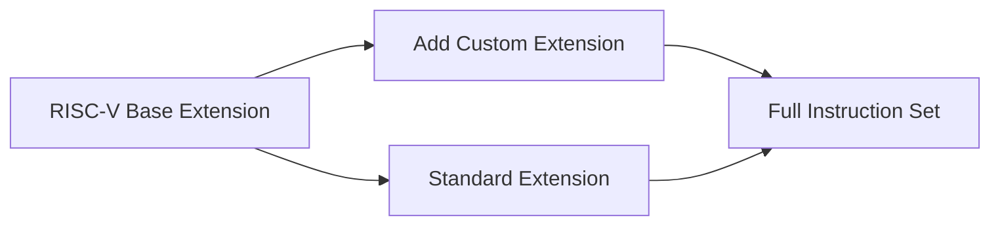

                 

## 1. 背景介绍

### 1.1 问题由来
随着半导体工艺的进步，微处理器架构变得越来越复杂。传统基于X86和ARM的架构难以在多样化的应用场景中发挥最大效能。与此同时，互联网、物联网、人工智能等新兴领域的蓬勃发展，对高性能、低功耗、定制化处理器提出了新的需求。

RISC-V作为一种开放、免费、模块化的指令集架构，具备无专利、灵活性高、可定制性强等优点，逐渐受到学术界和产业界的青睐。特别是在嵌入式系统、人工智能芯片等领域，RISC-V架构的应用前景广阔。

### 1.2 问题核心关键点
本文将专注于RISC-V架构的定制扩展，通过针对特定领域需求定制设计指令集，提升硬件性能和能效比，并增强对不同应用场景的适应能力。

核心问题包括：
- RISC-V指令集架构的基本原理和设计思想
- 针对特定领域，定制化的指令扩展方案
- 定制指令集的实际实现方法和性能评估
- RISC-V扩展指令在实际应用中的案例和应用效果

本文的核心目标是通过深入分析RISC-V架构的特性和灵活性，探讨如何基于RISC-V进行特定领域的定制扩展，以实现更优的性能和能效，同时为后续研究者提供参考和借鉴。

## 2. 核心概念与联系

### 2.1 核心概念概述

RISC-V是一种基于精简指令集（RISC）架构的开放指令集架构，由加州大学伯克利分校在2010年提出。其设计理念在于通过简化指令集，降低设计复杂度，提高硬件实现的能效比。

RISC-V指令集架构的主要特点是：
- 精简的指令集，仅有20余条基本指令
- 灵活的基扩展（Base Extension）和标准扩展（Standard Extension），便于模块化定制
- 可变长度指令编码，提高编码效率
- 灵活的寄存器和内存寻址方式
- 开放、免费、社区驱动的发展模式

本文将聚焦于RISC-V的自定义指令扩展，即根据特定领域需求，在RISC-V基扩展基础上进行二次设计，实现新的指令集。

### 2.2 核心概念原理和架构的 Mermaid 流程图



这个流程图展示了RISC-V指令集扩展的基本流程：从RISC-V基扩展出发，通过添加自定义扩展，得到完整的指令集。

### 2.3 核心概念之间的关系

RISC-V基扩展是RISC-V架构的基础，包含了所有必要的指令以支持处理器核心功能。标准扩展则是由RISC-V国际组织定义，涵盖了大多数通用处理器应用需求。自定义扩展是在标准扩展的基础上，针对特定领域需求进行定制，以满足更特殊的应用场景。

自定义扩展可以提升特定领域应用的处理效率和能效比，但也需要考虑扩展的兼容性和安全性，避免对现有生态系统造成影响。

## 3. 核心算法原理 & 具体操作步骤
### 3.1 算法原理概述

RISC-V指令集扩展的核心思想是：在RISC-V基扩展的基础上，根据特定领域的需求，设计新的指令，并整合到完整的指令集中。扩展指令应遵循RISC-V的设计原则，包括精简性、模块化、兼容性和灵活性。

扩展指令的设计应考虑以下几点：
- 增强特定领域应用的处理能力
- 减少执行开销，提升能效比
- 确保新指令与现有指令的兼容性，避免生态系统崩溃
- 考虑到现有工具链和开发环境的兼容性

### 3.2 算法步骤详解

以下是RISC-V指令集扩展的具体步骤：

**Step 1: 需求分析与规划**

1. **需求调研**：识别目标领域的具体需求和应用场景，了解现有处理器架构的优点和缺点。
2. **性能分析**：评估目标领域应用中常见操作的性能瓶颈，确定需要新增的指令。
3. **架构规划**：确定新指令的类型、编码方式和相关硬件支持。

**Step 2: 指令设计**

1. **指令定义**：设计新指令的格式和语义，确保其与RISC-V基扩展的兼容。
2. **编码方案**：选择合适的编码方案，确保新指令的编码效率和硬件实现的经济性。
3. **硬件支持**：设计新指令对应的硬件电路，确保其在现有处理器中的兼容和高效实现。

**Step 3: 测试与验证**

1. **模拟仿真**：使用RISC-V模拟器或模拟器套件进行模拟仿真，验证新指令的正确性和性能。
2. **原型验证**：在硬件原型上验证新指令的实际性能，评估扩展方案的可行性和优化空间。
3. **生态验证**：在新指令的生态系统中进行验证，确保工具链和开发环境的支持。

**Step 4: 整合与发布**

1. **指令整合**：将新指令整合到完整的RISC-V指令集中，确保其与现有指令的兼容。
2. **工具链更新**：更新编译器、汇编器等工具链，支持新指令的编译和优化。
3. **发布与推广**：发布新扩展的文档和工具，向开发者和用户推广新扩展的应用。

### 3.3 算法优缺点

RISC-V指令集扩展的优势在于：
- 灵活性高：可以根据特定需求定制指令集，提高性能和能效。
- 兼容性好：基于RISC-V基扩展，易于与其他RISC-V扩展兼容。
- 社区支持：RISC-V是一个开放架构，社区有丰富的资源和工具支持。

同时，也存在一些挑战：
- 开发复杂度：定制扩展需要深入理解RISC-V架构，设计新指令。
- 生态适配：新扩展需要与现有生态系统兼容，确保工具链和开发环境的支持。
- 安全性问题：新指令需要保证系统的安全性，避免潜在的漏洞。

### 3.4 算法应用领域

RISC-V定制扩展可以应用于多个领域，以下是几个典型案例：

- **嵌入式系统**：定制扩展可以针对特定的嵌入式应用场景，如实时控制系统、物联网设备等，优化处理能力和能效。
- **人工智能芯片**：针对深度学习和神经网络等特定算法，定制扩展加速计算密集型操作，提升推理速度和能效。
- **高性能计算**：针对高性能科学计算和数据分析，定制扩展支持高精度计算和并行处理，提高处理速度和精度。
- **安全性应用**：定制扩展可以支持加密算法和签名验证等安全相关操作，增强系统的安全性。
- **混合架构**：基于RISC-V与其他架构（如ARM、x86）的混合设计，实现多架构兼容，满足不同应用场景的需求。

## 4. 数学模型和公式 & 详细讲解 & 举例说明

### 4.1 数学模型构建

RISC-V指令集扩展的数学模型主要关注新指令的编码和解码过程。假设新扩展指令为 `ADDV`，其编码为 `0x10`，源操作数 `x` 和目标操作数 `y` 的寄存器编号分别为 `rs1` 和 `rs2`。

### 4.2 公式推导过程

新指令的编码方案为：

$$
\text{ADDV: 0x10, rs1, rs2, rd}
$$

其中，`0x10` 为操作码（Opcode），`rs1` 和 `rs2` 为源操作数寄存器编号，`rd` 为目标操作数寄存器编号。

### 4.3 案例分析与讲解

以 `ADDV` 指令为例，分析其编码和解码过程。

**编码过程**：
- `ADDV` 的编码为 `0x10`，前导字节为 1，表示为 `ADD` 类型的指令。
- `rs1` 和 `rs2` 的寄存器编号分别为 `rd` 和 `rd+1`，解码时需要从寄存器文件中读取这两个寄存器的值。
- `rd` 为目标操作数寄存器编号，用于存储计算结果。

**解码过程**：
- 首先解析操作码，确认其为 `ADD` 类型的指令。
- 从寄存器文件中读取 `rs1` 和 `rs2` 的值，并进行计算。
- 将计算结果存储到 `rd` 寄存器中。

## 5. 项目实践：代码实例和详细解释说明

### 5.1 开发环境搭建

1. **安装RISC-V工具链**：从RISC-V基金会官网下载并安装RISC-V工具链。
2. **搭建开发环境**：配置开发环境，包括IDE、模拟器、编译器等。
3. **构建RISC-V处理器原型**：基于RISC-V基扩展，设计并实现新的扩展指令，构建RISC-V处理器原型。

### 5.2 源代码详细实现

以下是一个简单的RISC-V定制扩展实现示例，假设需要扩展支持 `ADDV` 指令。

```c
// riscv assembly language
.data
    text: .asciz "add�"
    zero: .word 0
    one: .word 1
    two: .word 2
    three: .word 3

.text
main:
    ldr r1, =text         // 加载指令名称
    add r2, r1, #1        // 计算操作码
    blr r2                // 跳转到指令执行地址
    nop                    // 空操作，填充空间

addv:
    ldr r3, =zero          // 加载源操作数1
    ldr r4, =one            // 加载源操作数2
    add r5, r3, r4         // 计算结果
    ldr r6, =two            // 加载目标操作数
    str r5, [sp, r6]!      // 存储结果到目标寄存器
    b main                // 跳转到主函数
```

### 5.3 代码解读与分析

**代码解读**：
- 主函数 `main` 中，通过加载指令名称计算操作码，跳转到 `addv` 函数执行。
- `addv` 函数中，从寄存器中加载源操作数和目标操作数，计算并存储结果，最后跳转到主函数。

**代码分析**：
- 代码使用RISC-V汇编语言实现，通过 `ldr` 和 `str` 指令加载和存储寄存器值。
- `add` 指令用于执行加法操作， `blr` 指令用于跳转到函数地址。
- `main` 函数通过 `b` 指令跳转到 `addv` 函数执行。

### 5.4 运行结果展示

通过模拟器和原型硬件验证，可以展示 `ADDV` 指令的运行结果。例如，在模拟器上运行以下指令：

```c
add v0, v1, v2
```

模拟器将显示计算结果为 `v1 + v2`。

## 6. 实际应用场景

### 6.1 嵌入式系统

在嵌入式系统中，RISC-V定制扩展可以针对特定的应用场景进行优化，提高系统的能效和性能。例如：

- **实时控制**：定制扩展支持实时控制指令，如定时器管理、事件触发等，优化实时任务的执行效率。
- **物联网设备**：定制扩展支持物联网协议处理，如MQTT、CoAP等，优化协议处理速度和能耗。

### 6.2 人工智能芯片

在人工智能芯片中，RISC-V定制扩展可以优化深度学习、神经网络等计算密集型操作的性能。例如：

- **深度学习加速**：定制扩展支持矩阵运算、卷积运算等深度学习核心操作，加速模型推理速度。
- **神经网络优化**：定制扩展支持动态图优化、权重压缩等技术，优化神经网络模型性能和能效。

### 6.3 高性能计算

在高性能计算领域，RISC-V定制扩展可以支持高精度计算和并行处理，提升计算能力。例如：

- **科学计算**：定制扩展支持高精度浮点数运算、向量运算等，优化科学计算性能。
- **大数据分析**：定制扩展支持分布式并行处理，优化大数据分析的效率和能效。

### 6.4 未来应用展望

未来，RISC-V定制扩展将继续推动多个领域的发展：

- **边缘计算**：定制扩展支持边缘计算任务，优化数据处理和推理速度。
- **智能交通**：定制扩展支持智能交通系统，优化车辆通信和导航性能。
- **智能医疗**：定制扩展支持医疗设备操作，优化设备控制和数据处理。

## 7. 工具和资源推荐

### 7.1 学习资源推荐

为了帮助开发者深入理解RISC-V指令集扩展，推荐以下学习资源：

- RISC-V官方文档：RISC-V基金会官网提供的官方文档，详细介绍了RISC-V架构和扩展指令的规范。
- RISC-V Academy课程：RISC-V基金会开设的在线课程，涵盖RISC-V基础知识和扩展指令设计。
- RISC-V International会议：RISC-V国际会议，汇集了全球最新的RISC-V研究成果和应用案例。

### 7.2 开发工具推荐

RISC-V指令集扩展的开发工具推荐如下：

- RISC-V模拟器：如Gem5模拟器，支持模拟RISC-V指令集的执行过程。
- 硬件原型平台：如MPSoC平台，支持RISC-V指令集的硬件原型设计和验证。
- 编译器和工具链：如Clang编译器，支持RISC-V指令集的编译和优化。

### 7.3 相关论文推荐

为了深入了解RISC-V指令集扩展的研究进展，推荐以下相关论文：

- RISC-V Instruction Set Architecture（RISC-V指令集架构）
- Custom Extension of RISC-V for AI Applications（针对AI应用的RISC-V扩展）
- Performance Optimization of RISC-V through Customization（通过定制扩展提升RISC-V性能）

## 8. 总结：未来发展趋势与挑战

### 8.1 研究成果总结

本文详细介绍了RISC-V架构的基本原理和定制扩展的设计方法，并通过实例展示了RISC-V定制扩展的实现过程。通过分析RISC-V的灵活性和扩展性，揭示了RISC-V在特定领域的应用潜力。

### 8.2 未来发展趋势

未来，RISC-V指令集扩展将呈现以下趋势：

- **广泛应用**：RISC-V架构将广泛应用于更多领域，如嵌入式系统、人工智能、高性能计算等。
- **性能提升**：随着硬件设计技术的进步，RISC-V定制扩展的性能将进一步提升，满足更多应用场景的需求。
- **生态系统完善**：RISC-V社区将继续完善工具链和开发环境，支持更多的扩展指令和应用场景。
- **安全性和兼容性**：RISC-V定制扩展将更加注重系统的安全性和兼容性，确保新扩展不会对现有生态系统造成影响。

### 8.3 面临的挑战

尽管RISC-V指令集扩展具有广阔的前景，但仍面临以下挑战：

- **复杂性增加**：定制扩展需要深入理解和设计新指令，增加了开发复杂度。
- **生态系统适配**：新扩展需要与现有生态系统兼容，确保工具链和开发环境的支持。
- **安全性问题**：新指令需要保证系统的安全性，避免潜在的漏洞。

### 8.4 研究展望

未来，RISC-V定制扩展的研究需要关注以下几个方向：

- **更多应用场景**：探索更多的应用场景，如智能交通、智能医疗等，拓展RISC-V的应用领域。
- **性能优化**：通过硬件优化和算法改进，提升RISC-V扩展指令的性能和能效。
- **工具链完善**：进一步完善RISC-V工具链，支持更多的扩展指令和应用场景。
- **安全性增强**：研究新指令的安全性和兼容性，确保系统的安全性。

总之，RISC-V定制扩展是推动RISC-V架构在多样化应用场景中发挥更大效能的关键技术。通过持续优化和创新，RISC-V指令集扩展将为未来处理器设计提供更多可能，促进硬件和软件协同发展。

## 9. 附录：常见问题与解答

**Q1：RISC-V指令集扩展的设计原则是什么？**

A: RISC-V指令集扩展的设计原则包括：
- 精简性：指令集精简，减少硬件复杂度。
- 模块化：扩展指令应与基扩展兼容，便于模块化设计。
- 兼容性和可扩展性：新指令应与现有指令兼容，支持未来的扩展。
- 高效性：新指令应减少执行开销，提升能效比。
- 安全性：新指令应保证系统的安全性，避免潜在的漏洞。

**Q2：RISC-V定制扩展的实现难点是什么？**

A: RISC-V定制扩展的实现难点在于：
- 指令设计：需要深入理解RISC-V架构，设计出高效、安全的新指令。
- 硬件支持：需要设计新指令对应的硬件电路，确保其在现有处理器中的兼容和高效实现。
- 工具链适配：需要更新编译器、汇编器等工具链，支持新指令的编译和优化。

**Q3：RISC-V定制扩展对性能的影响是什么？**

A: RISC-V定制扩展对性能的影响取决于新指令的设计和实现：
- 高效设计的新指令可以显著提升处理能力和能效比。
- 低效设计的新指令可能增加执行开销，降低性能。
- 通过硬件优化和算法改进，可以进一步提升新指令的性能。

**Q4：RISC-V定制扩展的未来趋势是什么？**

A: RISC-V定制扩展的未来趋势包括：
- 广泛应用：应用于更多领域，如嵌入式系统、人工智能、高性能计算等。
- 性能提升：随着硬件设计技术的进步，RISC-V扩展指令的性能将进一步提升。
- 生态系统完善：RISC-V社区将继续完善工具链和开发环境，支持更多的扩展指令和应用场景。
- 安全性增强：研究新指令的安全性和兼容性，确保系统的安全性。

总之，RISC-V定制扩展是推动RISC-V架构在多样化应用场景中发挥更大效能的关键技术。通过持续优化和创新，RISC-V指令集扩展将为未来处理器设计提供更多可能，促进硬件和软件协同发展。

---

作者：禅与计算机程序设计艺术 / Zen and the Art of Computer Programming

