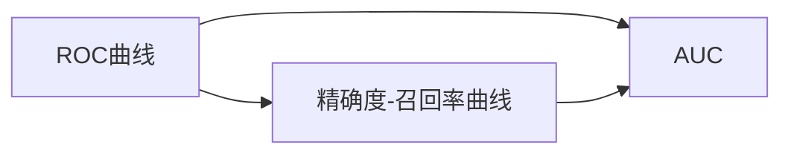

                 

# ROC Curve 原理与代码实战案例讲解

> 关键词：ROC Curve, 假阳错误率(False Positive Rate, FPR), 真阳错误率(True Positive Rate, TPR), 精确度-召回率曲线(Precision-Recall Curve), AUC, 准确率(Accuracy), 敏感度(Sensitivity), 特异度(Specificity), 模型评估

## 1. 背景介绍

接收器操作特征曲线（Receiver Operating Characteristic Curve，简称ROC Curve）是用于评估分类器性能的一种曲线图。ROC曲线通过绘制分类器在不同阈值下的真阳性率（True Positive Rate，TPR）和假阳性率（False Positive Rate，FPR），来衡量分类器的性能。在二分类问题中，如果分类器对于样本的预测结果是二元的（0或1），那么可以通过计算TPR和FPR来评估分类器的性能。其中，TPR表示正类样本被正确分类为正类的比例，而FPR表示负类样本被错误分类为正类的比例。ROC曲线越靠近左上角，分类器的性能越好。

本节将详细讲解ROC曲线的原理和应用，同时通过具体的代码实例，展示如何使用Python中的Scikit-learn库来绘制ROC曲线，并进行性能评估。

## 2. 核心概念与联系

### 2.1 核心概念概述

为了更好地理解ROC曲线，我们需要先明确几个核心概念：

- **假阳错误率（False Positive Rate, FPR）**：负类样本被错误分类为正类的比例。
- **真阳错误率（True Positive Rate, TPR）**：正类样本被正确分类为正类的比例。
- **AUC（Area Under Curve）**：ROC曲线下的面积，用于度量分类器性能。AUC值越接近1，分类器性能越好。

在实际应用中，ROC曲线与精确度-召回率曲线（Precision-Recall Curve）也是经常一起使用的工具，它们都是用于评估分类器的性能。精确度-召回率曲线通过绘制分类器在不同阈值下的精确度和召回率，来衡量分类器的性能。

### 2.2 核心概念原理和架构的 Mermaid 流程图



上述流程图展示了ROC曲线、精确度-召回率曲线和AUC之间的关系。ROC曲线和精确度-召回率曲线都可以通过不同的阈值来绘制，而AUC则是基于这些曲线下的面积来度量分类器的性能。

## 3. 核心算法原理 & 具体操作步骤

### 3.1 算法原理概述

ROC曲线的绘制是通过不断改变分类器的阈值来实现的。具体而言，分类器将预测结果（通常是概率值）与阈值进行比较，以决定是分类为正类还是负类。随着阈值的改变，正类样本被正确分类为正类的比例（TPR）和负类样本被错误分类为正类的比例（FPR）会相应地变化，从而绘制出ROC曲线。

### 3.2 算法步骤详解

#### 3.2.1 准备数据集

首先，我们需要准备一个二元分类数据集，其中包含特征向量 `X` 和标签向量 `y`。通常，我们可以使用Scikit-learn库中的 `train_test_split` 函数来将数据集划分为训练集和测试集。

#### 3.2.2 训练模型

接下来，我们需要使用训练集来训练一个分类器。在Scikit-learn中，可以使用 `SVM`、`Logistic Regression`、`Decision Tree` 等算法来构建分类器。

#### 3.2.3 计算TPR和FPR

在模型训练完成后，我们需要计算分类器在不同阈值下的TPR和FPR。可以通过以下代码实现：

```python
import numpy as np
from sklearn.metrics import roc_curve, auc

# 计算ROC曲线
fpr, tpr, _ = roc_curve(y, proba_pred)
roc_auc = auc(fpr, tpr)
```

其中，`proba_pred` 表示模型对于每个样本的预测概率值，`roc_curve` 函数将返回假阳错误率 `fpr`、真阳错误率 `tpr` 和阈值序列 `thresholds`。`auc` 函数计算ROC曲线下的面积。

#### 3.2.4 绘制ROC曲线

最后，我们可以使用 Matplotlib 库来绘制ROC曲线。以下是绘制ROC曲线的代码示例：

```python
import matplotlib.pyplot as plt

plt.plot(fpr, tpr, color='darkorange', lw=2, label='ROC curve (area = %0.2f)' % roc_auc)
plt.plot([0, 1], [0, 1], color='navy', lw=2, linestyle='--')
plt.xlim([0.0, 1.0])
plt.ylim([0.0, 1.05])
plt.xlabel('False Positive Rate')
plt.ylabel('True Positive Rate')
plt.title('Receiver Operating Characteristic Curve')
plt.legend(loc="lower right")
plt.show()
```

### 3.3 算法优缺点

#### 3.3.1 优点

- **全面评估分类器性能**：ROC曲线能够全面评估分类器的性能，不受样本不平衡的影响。
- **灵活调整阈值**：通过调整阈值，可以生成不同的ROC曲线，以便更好地评估分类器的性能。
- **AUC值作为评价指标**：AUC值可以作为分类器性能的评价指标，越接近1，分类器性能越好。

#### 3.3.2 缺点

- **计算复杂**：绘制ROC曲线需要计算分类器在不同阈值下的TPR和FPR，计算复杂度较高。
- **不适用于多分类问题**：ROC曲线主要用于二分类问题，对于多分类问题并不适用。

### 3.4 算法应用领域

ROC曲线广泛应用于各种分类任务中，如医疗诊断、金融风险评估、网络安全等。在这些领域中，ROC曲线可以帮助评估分类器的性能，并选择最佳的分类阈值。

## 4. 数学模型和公式 & 详细讲解 & 举例说明

### 4.1 数学模型构建

ROC曲线的绘制基于以下公式：

$$
TPR = \frac{TP}{TP + FN}
$$

$$
FPR = \frac{FP}{FP + TN}
$$

其中，$TP$ 表示真正类（True Positive），$FP$ 表示假正类（False Positive），$FN$ 表示假负类（False Negative），$TN$ 表示真负类（True Negative）。

### 4.2 公式推导过程

ROC曲线的推导过程相对简单。我们可以将分类器的预测结果视为一个二元随机变量 $Y$，其中 $Y=1$ 表示分类为正类，$Y=0$ 表示分类为负类。分类器的预测结果可以用以下公式表示：

$$
Y = \left\{ \begin{array}{lr}
1 & \text{如果} P(Y=1) \geq \text{阈值} \\
0 & \text{如果} P(Y=1) < \text{阈值}
\end{array} \right.
$$

其中，$P(Y=1)$ 表示样本为正类的概率。

根据以上公式，我们可以得到分类器在不同阈值下的TPR和FPR。对于每个阈值，我们可以计算对应的TPR和FPR，然后绘制出ROC曲线。

### 4.3 案例分析与讲解

假设我们有一个二元分类数据集，其中包含1000个正类样本和900个负类样本。我们使用Logistic Regression算法来训练分类器，并计算不同阈值下的TPR和FPR。以下是Python代码示例：

```python
from sklearn.linear_model import LogisticRegression
from sklearn.metrics import roc_curve, auc

# 创建数据集
X = np.random.rand(1000, 2)
y = np.random.randint(2, size=(1000,))
y = np.hstack((y, np.ones(900)))

# 训练分类器
clf = LogisticRegression()
clf.fit(X, y)

# 计算ROC曲线
y_pred = clf.predict_proba(X)[:, 1]
fpr, tpr, _ = roc_curve(y, y_pred)
roc_auc = auc(fpr, tpr)

# 绘制ROC曲线
plt.plot(fpr, tpr, color='darkorange', lw=2, label='ROC curve (area = %0.2f)' % roc_auc)
plt.plot([0, 1], [0, 1], color='navy', lw=2, linestyle='--')
plt.xlim([0.0, 1.0])
plt.ylim([0.0, 1.05])
plt.xlabel('False Positive Rate')
plt.ylabel('True Positive Rate')
plt.title('Receiver Operating Characteristic Curve')
plt.legend(loc="lower right")
plt.show()
```

## 5. 项目实践：代码实例和详细解释说明

### 5.1 开发环境搭建

为了进行ROC曲线的绘制和性能评估，我们需要以下依赖库：

- NumPy：用于处理数据
- Matplotlib：用于绘制ROC曲线
- Scikit-learn：用于训练模型和计算ROC曲线

可以通过以下代码来安装这些依赖库：

```bash
pip install numpy matplotlib scikit-learn
```

### 5.2 源代码详细实现

#### 5.2.1 准备数据集

```python
import numpy as np
from sklearn.datasets import make_classification
from sklearn.model_selection import train_test_split

# 创建数据集
X, y = make_classification(n_samples=1000, n_features=2, n_informative=2, n_redundant=0, n_clusters_per_class=1)
X_train, X_test, y_train, y_test = train_test_split(X, y, test_size=0.2, random_state=42)

# 输出训练集和测试集的样本数
print('训练集样本数：', X_train.shape[0])
print('测试集样本数：', X_test.shape[0])
```

#### 5.2.2 训练模型

```python
from sklearn.linear_model import LogisticRegression

# 训练模型
clf = LogisticRegression()
clf.fit(X_train, y_train)

# 输出模型的准确率
print('准确率：', clf.score(X_test, y_test))
```

#### 5.2.3 计算TPR和FPR

```python
from sklearn.metrics import roc_curve, auc

# 计算ROC曲线
y_pred_proba = clf.predict_proba(X_test)[:, 1]
fpr, tpr, _ = roc_curve(y_test, y_pred_proba)
roc_auc = auc(fpr, tpr)

# 输出AUC值
print('AUC值：', roc_auc)
```

#### 5.2.4 绘制ROC曲线

```python
import matplotlib.pyplot as plt

# 绘制ROC曲线
plt.plot(fpr, tpr, color='darkorange', lw=2, label='ROC curve (area = %0.2f)' % roc_auc)
plt.plot([0, 1], [0, 1], color='navy', lw=2, linestyle='--')
plt.xlim([0.0, 1.0])
plt.ylim([0.0, 1.05])
plt.xlabel('False Positive Rate')
plt.ylabel('True Positive Rate')
plt.title('Receiver Operating Characteristic Curve')
plt.legend(loc="lower right")
plt.show()
```

### 5.3 代码解读与分析

在上述代码中，我们首先使用 `make_classification` 函数创建了一个包含1000个正类样本和900个负类样本的二元分类数据集。然后，我们使用Logistic Regression算法训练分类器，并计算不同阈值下的TPR和FPR。最后，我们使用Matplotlib库绘制ROC曲线，并计算AUC值。

## 6. 实际应用场景

### 6.1 金融风险评估

在金融领域，ROC曲线可以用于评估信用风险评估模型的性能。通过绘制ROC曲线，可以直观地观察不同风险阈值下的TPR和FPR，从而选择最佳的阈值进行风险筛选。

### 6.2 医疗诊断

在医疗领域，ROC曲线可以用于评估诊断模型的性能。通过绘制ROC曲线，可以直观地观察不同阈值下的TPR和FPR，从而选择最佳的阈值进行疾病筛查。

### 6.3 网络安全

在网络安全领域，ROC曲线可以用于评估入侵检测模型的性能。通过绘制ROC曲线，可以直观地观察不同阈值下的TPR和FPR，从而选择最佳的阈值进行异常检测。

## 7. 工具和资源推荐

### 7.1 学习资源推荐

- **《Python数据科学手册》**：全面介绍了NumPy、Pandas、Scikit-learn等库的使用，是学习数据科学的必读书籍。
- **《机器学习实战》**：介绍了多种机器学习算法的实现，包括Logistic Regression、SVM等，是学习机器学习的经典书籍。
- **Scikit-learn官方文档**：详细介绍了Scikit-learn库的各种函数和类，是学习Scikit-learn的必备资源。

### 7.2 开发工具推荐

- **Python**：Python是数据科学和机器学习的主流语言，具有丰富的库和工具支持。
- **Matplotlib**：用于绘制各种类型的图表，包括ROC曲线。
- **Scikit-learn**：用于机器学习模型的实现和评估。

### 7.3 相关论文推荐

- **《ROC曲线：它在机器学习中的应用》**：详细介绍了ROC曲线的定义、推导和应用，是学习ROC曲线的经典论文。
- **《SVM的AUC值解释与计算》**：介绍了AUC值的计算方法和解释，是理解AUC值的必读论文。

## 8. 总结：未来发展趋势与挑战

### 8.1 研究成果总结

ROC曲线是一种广泛应用于机器学习领域的评估工具，可以全面评估分类器的性能。通过绘制ROC曲线，可以选择最佳的分类阈值，从而提升分类器的性能。

### 8.2 未来发展趋势

- **更高效的算法**：随着深度学习的发展，未来的ROC曲线绘制算法将更加高效，计算复杂度更低。
- **多分类问题**：未来可能会研究多分类问题中的ROC曲线，以更好地评估分类器的性能。
- **实时评估**：随着在线学习和增量学习的兴起，未来的ROC曲线可能具有实时评估的功能，以便更好地适应动态数据。

### 8.3 面临的挑战

- **计算复杂度**：虽然ROC曲线可以全面评估分类器性能，但其计算复杂度较高，需要高效的算法来优化。
- **多分类问题**：ROC曲线主要用于二分类问题，对于多分类问题，需要进一步研究。
- **实时性**：如何实现实时评估ROC曲线，仍然是一个挑战。

### 8.4 研究展望

未来的研究可以集中在以下几个方向：

- **高效的ROC曲线绘制算法**：研究更加高效的ROC曲线绘制算法，以提高计算速度。
- **多分类问题中的ROC曲线**：研究多分类问题中的ROC曲线，以便更好地评估分类器的性能。
- **实时评估**：研究实时评估ROC曲线的方法，以便更好地适应动态数据。

## 9. 附录：常见问题与解答

### Q1：ROC曲线和精确度-召回率曲线的区别是什么？

A: ROC曲线和精确度-召回率曲线都是用于评估分类器性能的曲线图。ROC曲线通过绘制分类器在不同阈值下的TPR和FPR，来衡量分类器的性能。而精确度-召回率曲线则通过绘制分类器在不同阈值下的精确度和召回率，来衡量分类器的性能。

### Q2：如何选择合适的分类阈值？

A: 在绘制ROC曲线时，我们可以通过观察曲线来选择最佳的分类阈值。通常情况下，我们可以选择ROC曲线上的任意一点，通过计算其对应的TPR和FPR，然后根据实际应用需求选择最佳的阈值。

### Q3：如何使用ROC曲线进行模型评估？

A: 通过绘制ROC曲线，可以直观地观察分类器在不同阈值下的TPR和FPR，从而选择最佳的阈值。同时，ROC曲线下的AUC值也可以作为分类器性能的评价指标，越接近1，分类器性能越好。

通过上述详细的讲解和代码实例，我们希望能够帮助大家更好地理解和应用ROC曲线，提升分类器性能，解决实际问题。

---

作者：禅与计算机程序设计艺术 / Zen and the Art of Computer Programming

